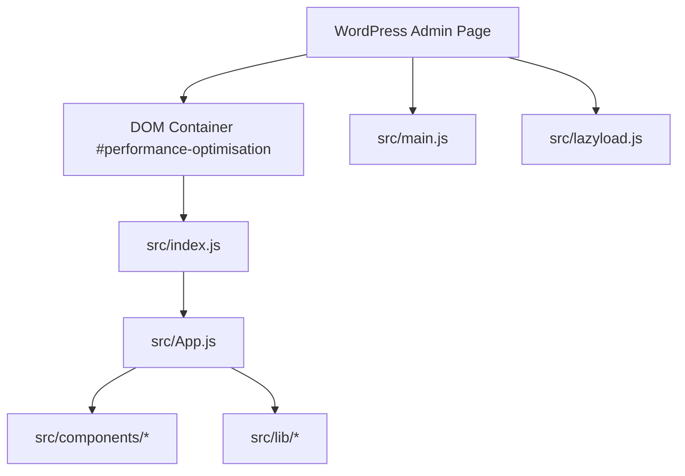
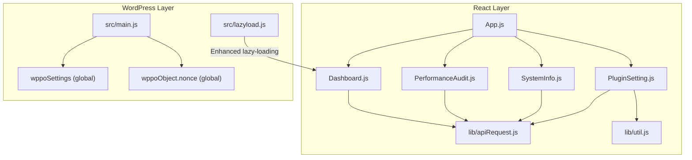
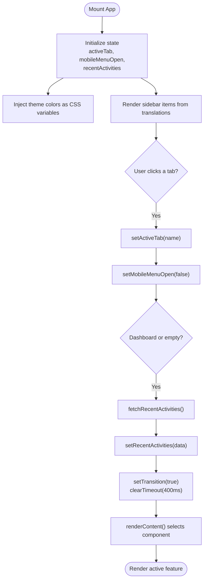
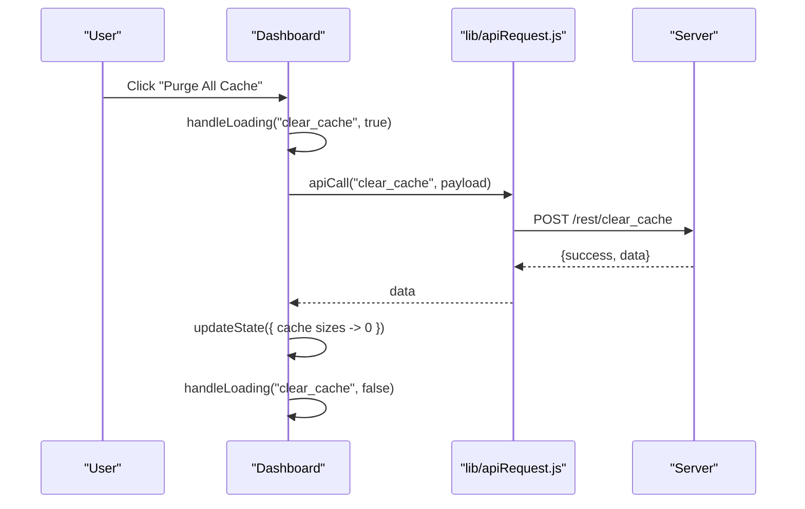
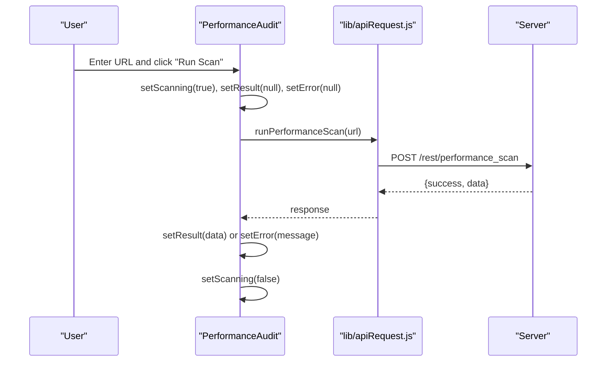
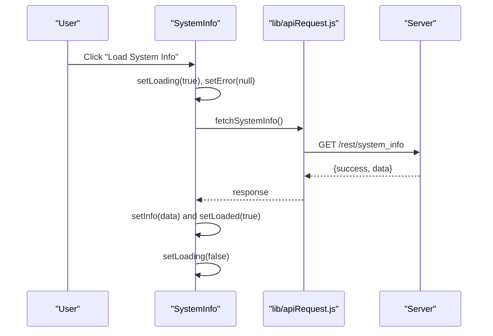
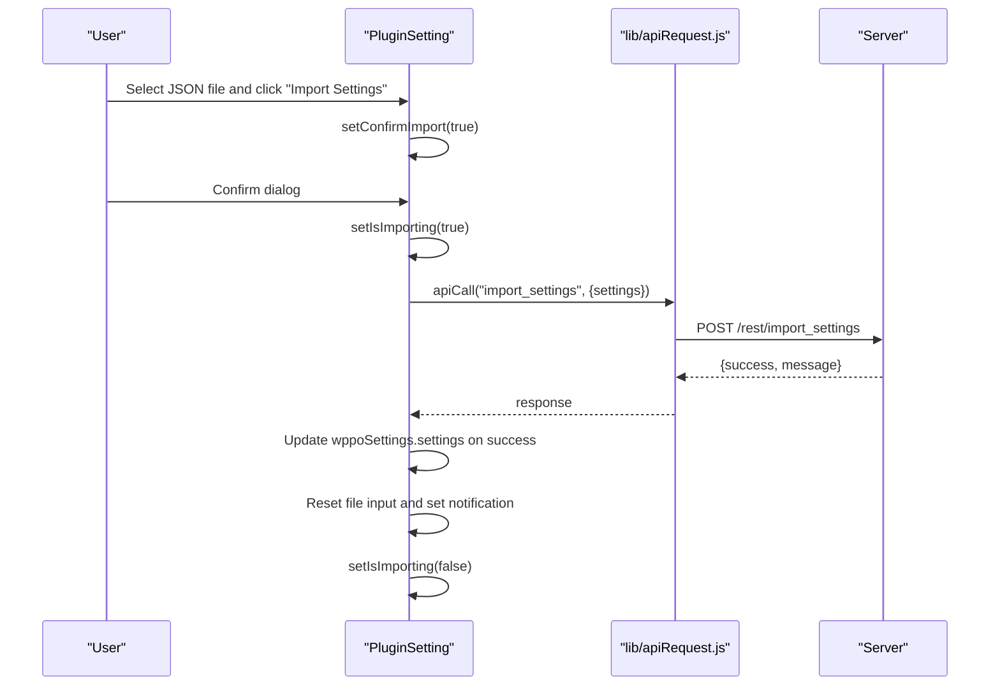
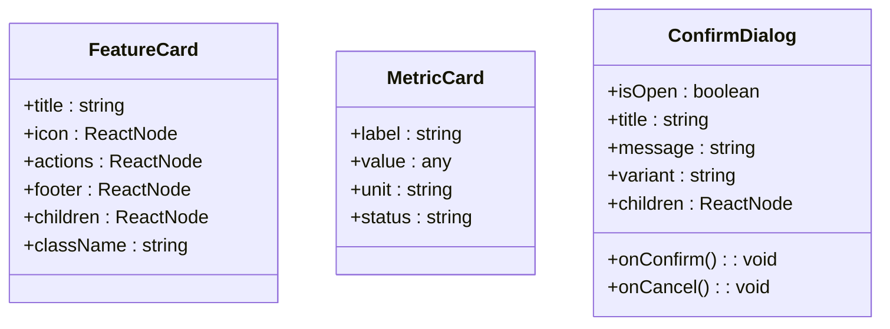
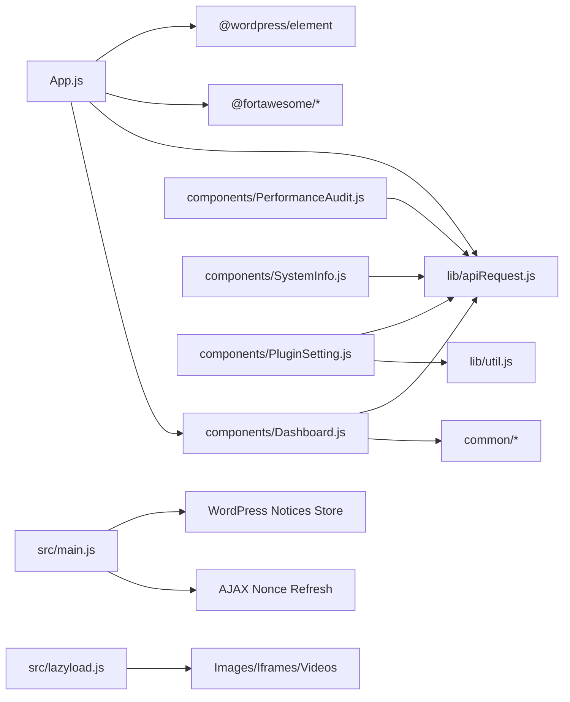

# Administration Interface

<cite>
**Referenced Files in This Document**
- [App.js](file://src/App.js)
- [index.js](file://src/index.js)
- [main.js](file://src/main.js)
- [lazyload.js](file://src/lazyload.js)
- [apiRequest.js](file://src/lib/apiRequest.js)
- [util.js](file://src/lib/util.js)
- [Dashboard.js](file://src/components/Dashboard.js)
- [SystemInfo.js](file://src/components/SystemInfo.js)
- [PerformanceAudit.js](file://src/components/PerformanceAudit.js)
- [PluginSetting.js](file://src/components/PluginSetting.js)
- [RecentActivityCard.js](file://src/components/RecentActivityCard.js)
- [FeatureCard.js](file://src/components/common/FeatureCard.js)
- [MetricCard.js](file://src/components/common/MetricCard.js)
- [ConfirmDialog.js](file://src/components/common/ConfirmDialog.js)
- [package.json](file://package.json)
</cite>

## Table of Contents
1. [Introduction](#introduction)
2. [Project Structure](#project-structure)
3. [Core Components](#core-components)
4. [Architecture Overview](#architecture-overview)
5. [Detailed Component Analysis](#detailed-component-analysis)
6. [Dependency Analysis](#dependency-analysis)
7. [Performance Considerations](#performance-considerations)
8. [Troubleshooting Guide](#troubleshooting-guide)
9. [Conclusion](#conclusion)
10. [Appendices](#appendices)

## Introduction
This document describes the React-based administration interface for the plugin. It explains the component architecture, state management, and API integration patterns. It documents the dashboard functionality, system information display, and user interaction patterns. It also provides guidelines for extending the interface and customizing the admin experience, along with examples of component usage and integration with WordPress admin styles.

## Project Structure
The administration UI is a React application bootstrapped inside WordPress. The entry point mounts the root React component into a dedicated DOM container. WordPress-specific integrations (nonces, AJAX, notices) are handled by a small bootstrap script. Lazy loading utilities are provided separately to improve initial page performance.

**Diagram sources**
- [index.js:1-12](file://src/index.js#L1-L12)
- [App.js:176-276](file://src/App.js#L176-L276)
- [main.js:1-172](file://src/main.js#L1-L172)
- [lazyload.js:1-362](file://src/lazyload.js#L1-L362)

**Section sources**
- [index.js:1-12](file://src/index.js#L1-L12)
- [App.js:28-112](file://src/App.js#L28-L112)
- [main.js:1-172](file://src/main.js#L1-L172)
- [lazyload.js:1-362](file://src/lazyload.js#L1-L362)

## Core Components
- App: Orchestrates navigation, sidebar, and content rendering. Manages active tab, transitions, and mobile menu state. Injects WordPress theme colors as CSS variables. Fetches recent activities on dashboard visits.
- Dashboard: Aggregates system health stats, performance audit, system info, image optimization, and recent activity. Handles cache clearing, image optimization, and removal of optimized images with polling for background jobs.
- PerformanceAudit: Provides a URL-based scanner and displays categorized performance metrics with status badges and tooltips. Supports a developer mode toggle for advanced timings.
- SystemInfo: On-demand fetch of system/environment details (PHP, DB, WP, server, cache, constants) and renders them in a responsive grid.
- PluginSetting: Tools tab for exporting/importing settings, viewing the full activity log, and confirming destructive actions.
- Common Components: FeatureCard, MetricCard, ConfirmDialog, and others provide reusable UI patterns across features.

**Section sources**
- [App.js:28-112](file://src/App.js#L28-L112)
- [Dashboard.js:38-356](file://src/components/Dashboard.js#L38-L356)
- [PerformanceAudit.js:203-486](file://src/components/PerformanceAudit.js#L203-L486)
- [SystemInfo.js:66-208](file://src/components/SystemInfo.js#L66-L208)
- [PluginSetting.js:16-349](file://src/components/PluginSetting.js#L16-L349)
- [FeatureCard.js:12-44](file://src/components/common/FeatureCard.js#L12-L44)
- [MetricCard.js:12-28](file://src/components/common/MetricCard.js#L12-L28)
- [ConfirmDialog.js:22-145](file://src/components/common/ConfirmDialog.js#L22-L145)

## Architecture Overview
The admin UI follows a top-down React architecture with centralized state in App and feature-specific state in components. API calls are abstracted via a shared utility that injects WordPress nonces and handles settings updates. WordPress admin integrations (AJAX, notices) are handled by a dedicated script.

**Diagram sources**
- [App.js:15-22](file://src/App.js#L15-L22)
- [Dashboard.js:8-15](file://src/components/Dashboard.js#L8-L15)
- [PerformanceAudit.js:20-25](file://src/components/PerformanceAudit.js#L20-L25)
- [SystemInfo.js:12-15](file://src/components/SystemInfo.js#L12-L15)
- [PluginSetting.js:1-3](file://src/components/PluginSetting.js#L1-L3)
- [apiRequest.js:1-54](file://src/lib/apiRequest.js#L1-L54)
- [util.js:1-9](file://src/lib/util.js#L1-L9)
- [main.js:10-79](file://src/main.js#L10-L79)
- [lazyload.js:152-362](file://src/lazyload.js#L152-L362)

## Detailed Component Analysis

### App Component
- Responsibilities:
  - Manage active tab and route to the appropriate feature component.
  - Render sidebar with icons and labels from translations.
  - Handle mobile menu open/close and overlay behavior.
  - Inject WordPress theme colors as CSS variables for consistent theming.
  - Fetch recent activities once when visiting the dashboard.
  - Coordinate transitions and fade-in effects during navigation.
- State and Effects:
  - Local state for activeTab, transition flag, mobileMenuOpen, recentActivities.
  - Memoized sidebar items and content renderer.
  - Resize listener to auto-close mobile menu on larger screens.
  - Theme color injection effect.
  - Conditional activity fetch effect with a ref guard to avoid repeated fetches.
- Props and Events:
  - Receives onNavigate callback to switch tabs from child components.
  - Passes activities array to Dashboard.
- Accessibility:
  - Proper aria labels and roles for buttons and overlays.

**Diagram sources**
- [App.js:28-174](file://src/App.js#L28-L174)

**Section sources**
- [App.js:28-112](file://src/App.js#L28-L112)
- [App.js:114-174](file://src/App.js#L114-L174)

### Dashboard Component
- Responsibilities:
  - Aggregate and display system health metrics (cache size, optimized assets, DB overhead, image optimization progress).
  - Provide quick actions: purge cache, navigate to related settings.
  - Integrate PerformanceAudit and SystemInfo panels.
  - Manage image optimization workflow: queue background jobs, poll status, and remove optimized images with confirmation.
  - Fetch database cleanup counts and compute overhead.
- State Management:
  - Uses a single state object for cache sizes, asset totals, normalized image info, and loading flags.
  - Polling loop for background job status using a ref to store interval ID.
  - Memoized derived values for totals and percentages.
- API Integration:
  - Uses apiCall for settings actions and fetchRecentActivities for initial data.
  - Dedicated polling endpoint for image job status.
- Interactions:
  - onClick handlers for cache clearing and image optimization.
  - Confirmation dialog for removing optimized images.

**Diagram sources**
- [Dashboard.js:155-172](file://src/components/Dashboard.js#L155-L172)
- [apiRequest.js:2-18](file://src/lib/apiRequest.js#L2-L18)

**Section sources**
- [Dashboard.js:38-356](file://src/components/Dashboard.js#L38-L356)

### PerformanceAudit Component
- Responsibilities:
  - Provide a URL input field with a submit handler to trigger a performance scan.
  - Toggle developer mode to reveal advanced timing and asset breakdown metrics.
  - Render categorized results with status badges and tooltips.
- Data Handling:
  - Maintains internal state for URL, scanning, result, error, and devMode.
  - Uses helper functions to derive statuses and format bytes.
- UX:
  - Home URL preset button.
  - Disabled submit during scanning.
  - Developer details toggle.

**Diagram sources**
- [PerformanceAudit.js:216-237](file://src/components/PerformanceAudit.js#L216-L237)
- [apiRequest.js:41-43](file://src/lib/apiRequest.js#L41-L43)

**Section sources**
- [PerformanceAudit.js:203-486](file://src/components/PerformanceAudit.js#L203-L486)

### SystemInfo Component
- Responsibilities:
  - On-demand fetch of system/environment details.
  - Render grouped tables for PHP, Database, WordPress, Server, Cache, and WP Constants.
- State and UX:
  - Trigger button until data is loaded.
  - Loading and error states with accessible announcements.
  - Two-column grid layout for readability.

**Diagram sources**
- [SystemInfo.js:72-90](file://src/components/SystemInfo.js#L72-L90)
- [apiRequest.js:51-53](file://src/lib/apiRequest.js#L51-L53)

**Section sources**
- [SystemInfo.js:66-208](file://src/components/SystemInfo.js#L66-L208)

### PluginSetting Component
- Responsibilities:
  - Export current plugin settings to a JSON file.
  - Import settings from a JSON file with confirmation and overwrite semantics.
  - Paginated activity log viewer with previous/next navigation.
- State and UX:
  - File selection state and notification feedback.
  - Loading and pagination state for activity log.
  - Confirmation dialog for destructive import action.

**Diagram sources**
- [PluginSetting.js:83-160](file://src/components/PluginSetting.js#L83-L160)
- [apiRequest.js:2-18](file://src/lib/apiRequest.js#L2-L18)

**Section sources**
- [PluginSetting.js:16-349](file://src/components/PluginSetting.js#L16-L349)

### Common Components
- FeatureCard: Standardized card layout with optional title, icon, actions, and footer.
- MetricCard: Displays a single metric with label, value, unit, and status badge.
- ConfirmDialog: Reusable confirmation dialog with focus trapping, escape handling, and variant styling.

**Diagram sources**
- [FeatureCard.js:12-44](file://src/components/common/FeatureCard.js#L12-L44)
- [MetricCard.js:12-28](file://src/components/common/MetricCard.js#L12-L28)
- [ConfirmDialog.js:22-145](file://src/components/common/ConfirmDialog.js#L22-L145)

**Section sources**
- [FeatureCard.js:12-44](file://src/components/common/FeatureCard.js#L12-L44)
- [MetricCard.js:12-28](file://src/components/common/MetricCard.js#L12-L28)
- [ConfirmDialog.js:22-145](file://src/components/common/ConfirmDialog.js#L22-L145)

## Dependency Analysis
- React and WordPress element:
  - The app uses @wordpress/element for hooks and JSX rendering.
- Icons:
  - FontAwesome is used for icons across components.
- API Utilities:
  - apiRequest.js centralizes REST calls, nonce handling, and settings updates.
- WordPress Integrations:
  - main.js handles AJAX nonce refresh and WordPress notices dispatch.
- Lazy Loading:
  - lazyload.js enhances resource loading for images, iframes, and videos after initial render.

**Diagram sources**
- [App.js:1-14](file://src/App.js#L1-L14)
- [apiRequest.js:1-54](file://src/lib/apiRequest.js#L1-L54)
- [util.js:1-9](file://src/lib/util.js#L1-L9)
- [main.js:10-110](file://src/main.js#L10-L110)
- [lazyload.js:152-362](file://src/lazyload.js#L152-L362)

**Section sources**
- [package.json:16-30](file://package.json#L16-L30)
- [App.js:1-14](file://src/App.js#L1-L14)
- [apiRequest.js:1-54](file://src/lib/apiRequest.js#L1-L54)
- [util.js:1-9](file://src/lib/util.js#L1-L9)
- [main.js:10-110](file://src/main.js#L10-L110)
- [lazyload.js:152-362](file://src/lazyload.js#L152-L362)

## Performance Considerations
- Initial render and hydration:
  - The React app mounts into a dedicated container. Consider deferring non-critical work until after mount to reduce FCP.
- Network reliability:
  - API calls include nonce handling and retry logic for 403 responses. Ensure UI reflects loading states to prevent redundant submissions.
- Background jobs:
  - Dashboard polls for image optimization status. Use interval guards and clear intervals on unmount to avoid memory leaks.
- Resource loading:
  - lazyload.js observes images/iframes/videos and triggers load on intersection. This reduces initial payload and improves perceived performance.
- Theming:
  - Injecting theme colors as CSS variables avoids runtime style recalculation and ensures consistent branding.

[No sources needed since this section provides general guidance]

## Troubleshooting Guide
- Nonce errors:
  - If a request fails with a 403, the system attempts to refresh the nonce via AJAX and retries. Verify that the AJAX endpoint is reachable and that the nonce is being updated.
- Notice display:
  - WordPress notices are dispatched via the core/notices store when available; otherwise, a fallback alert is used. Ensure the global store is accessible in the admin context.
- Activity log pagination:
  - If pagination does not update, verify that the response includes current_page and total_pages fields.
- Lazy loading:
  - If media does not load, check that IntersectionObserver is supported or rely on the fallback scroll handler. Ensure data-* attributes are present on elements to be lazily loaded.

**Section sources**
- [main.js:10-79](file://src/main.js#L10-L79)
- [main.js:88-110](file://src/main.js#L88-L110)
- [PluginSetting.js:42-57](file://src/components/PluginSetting.js#L42-L57)
- [lazyload.js:152-362](file://src/lazyload.js#L152-L362)

## Conclusion
The administration interface is a modular React application integrated with WordPress. It leverages shared utilities for API communication, maintains clear separation of concerns across components, and provides robust user interactions with accessible dialogs and notices. The architecture supports extension and customization through standardized patterns and reusable components.

[No sources needed since this section summarizes without analyzing specific files]

## Appendices

### API Integration Patterns
- Centralized API client:
  - apiCall encapsulates method, headers, and body handling, including nonce injection and settings update on specific actions.
- Endpoint-specific helpers:
  - fetchRecentActivities, runPerformanceScan, and fetchSystemInfo provide typed wrappers for common operations.
- WordPress-specific handling:
  - main.js manages nonce refresh and WordPress notice dispatch for admin feedback.

**Section sources**
- [apiRequest.js:1-54](file://src/lib/apiRequest.js#L1-L54)
- [main.js:10-110](file://src/main.js#L10-L110)

### Extending the Interface
- Add a new feature:
  - Create a new component under src/components/, import it in App.js, and add a sidebar item with an icon and label.
  - Wire navigation via setActiveTab and pass any required options from wppoSettings.
- Customize state handling:
  - Use local component state for transient UI state and memoized selectors for derived values.
  - For persistent settings, use apiCall with update_settings action and ensure wppoSettings.settings is updated.
- Accessibility:
  - Provide aria labels, roles, and keyboard navigation support for interactive elements.
- Styling:
  - Use existing CSS classes and FeatureCard to maintain consistency with WordPress admin styles.

**Section sources**
- [App.js:36-75](file://src/App.js#L36-L75)
- [FeatureCard.js:12-44](file://src/components/common/FeatureCard.js#L12-L44)

### Component Usage Examples
- Dashboard quick actions:
  - Use LoadingSubmitButton for actions like cache clearing and image optimization.
- System info:
  - Wrap content in FeatureCard and use InfoTable/InfoRow for structured data presentation.
- Performance audit:
  - Use MetricOverview and ResultRow to display categorized metrics with status badges.
- Tools:
  - Use ConfirmDialog for destructive actions and FeatureCard for grouped settings.

**Section sources**
- [Dashboard.js:222-356](file://src/components/Dashboard.js#L222-L356)
- [SystemInfo.js:43-201](file://src/components/SystemInfo.js#L43-L201)
- [PerformanceAudit.js:143-481](file://src/components/PerformanceAudit.js#L143-L481)
- [PluginSetting.js:162-345](file://src/components/PluginSetting.js#L162-L345)

### WordPress Admin Styles Integration
- Consistent theming:
  - App injects theme colors as CSS variables for primary, secondary, and text colors.
- Accessible dialogs:
  - ConfirmDialog manages focus trapping and escape handling to align with admin UX expectations.
- Notices:
  - Prefer WordPress notices store for snackbar-style notifications; fall back to alerts when unavailable.

**Section sources**
- [App.js:128-151](file://src/App.js#L128-L151)
- [ConfirmDialog.js:69-93](file://src/components/common/ConfirmDialog.js#L69-L93)
- [main.js:88-110](file://src/main.js#L88-L110)