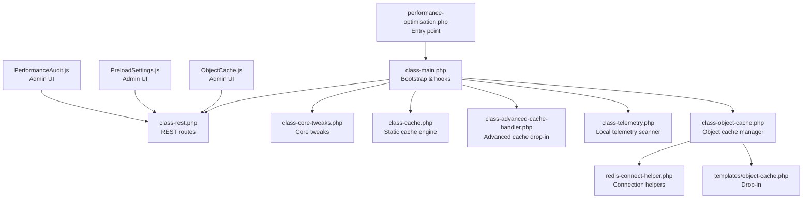
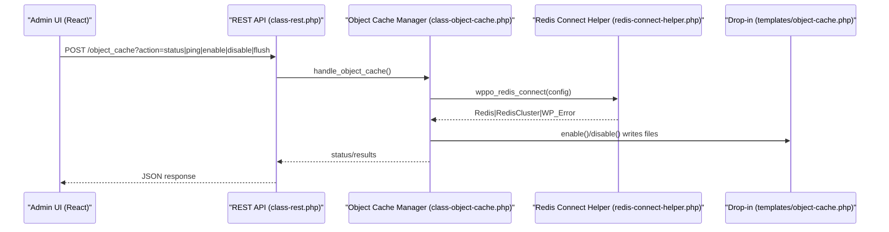
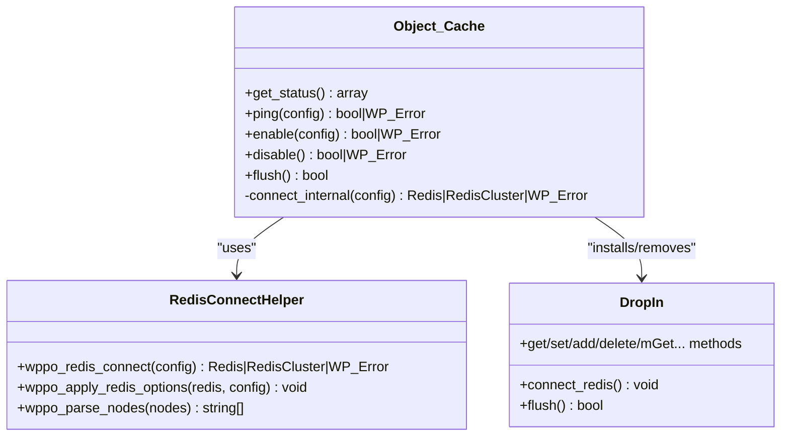
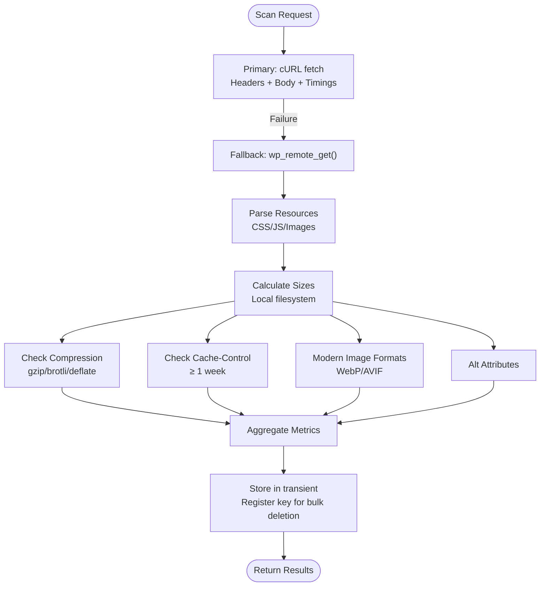
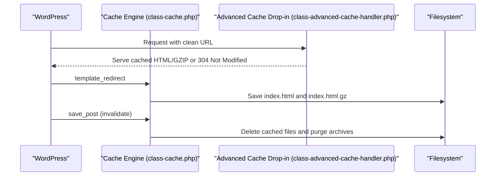
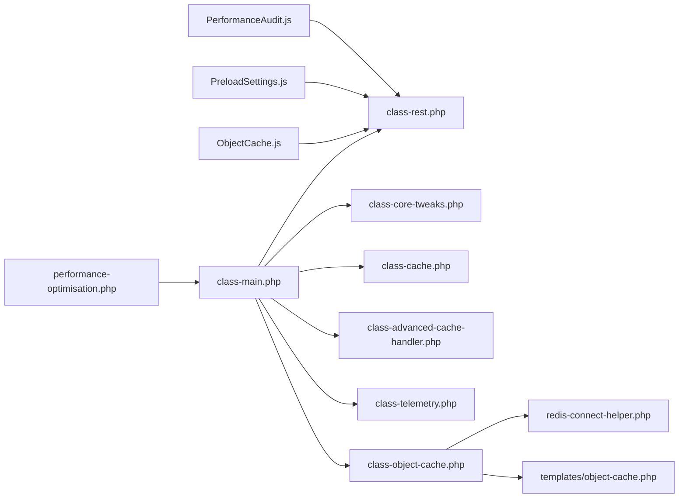

# Advanced Features

<cite>
**Referenced Files in This Document**
- [performance-optimisation.php](file://performance-optimisation.php)
- [class-main.php](file://includes/class-main.php)
- [class-rest.php](file://includes/class-rest.php)
- [class-object-cache.php](file://includes/class-object-cache.php)
- [redis-connect-helper.php](file://includes/redis-connect-helper.php)
- [object-cache.php](file://templates/object-cache.php)
- [class-telemetry.php](file://includes/class-telemetry.php)
- [class-core-tweaks.php](file://includes/class-core-tweaks.php)
- [class-advanced-cache-handler.php](file://includes/class-advanced-cache-handler.php)
- [class-cache.php](file://includes/class-cache.php)
- [ObjectCache.js](file://src/components/ObjectCache.js)
- [PreloadSettings.js](file://src/components/PreloadSettings.js)
- [PerformanceAudit.js](file://src/components/PerformanceAudit.js)
</cite>

## Table of Contents
1. [Introduction](#introduction)
2. [Project Structure](#project-structure)
3. [Core Components](#core-components)
4. [Architecture Overview](#architecture-overview)
5. [Detailed Component Analysis](#detailed-component-analysis)
6. [Dependency Analysis](#dependency-analysis)
7. [Performance Considerations](#performance-considerations)
8. [Troubleshooting Guide](#troubleshooting-guide)
9. [Conclusion](#conclusion)
10. [Appendices](#appendices)

## Introduction
This document explains advanced plugin features for performance optimization, focusing on:
- Object cache integration with Redis and Redis Sentinel/Cluster
- Core WordPress performance tweaks
- Telemetry data collection and performance audits
- Preload settings and cache warm-up
- Advanced configuration options, security considerations, and integration with external caching solutions

It targets experienced users who need expert-level guidance to configure, troubleshoot, and optimize WordPress performance using this plugin’s advanced capabilities.

## Project Structure
The plugin follows a modular, layered architecture:
- Entry point initializes the main controller and registers hooks
- REST API exposes administrative endpoints for settings, diagnostics, and cache operations
- Frontend dashboard components provide configuration UI for object cache, preload settings, and performance audit
- Backend classes encapsulate Redis connection logic, telemetry scanning, core tweaks, and static cache generation

**Diagram sources**
- [performance-optimisation.php:1-68](file://performance-optimisation.php#L1-L68)
- [class-main.php:118-154](file://includes/class-main.php#L118-L154)
- [class-rest.php:37-123](file://includes/class-rest.php#L37-L123)
- [class-object-cache.php:22-62](file://includes/class-object-cache.php#L22-L62)
- [redis-connect-helper.php:34-188](file://includes/redis-connect-helper.php#L34-L188)
- [object-cache.php:78-149](file://templates/object-cache.php#L78-L149)
- [class-telemetry.php:45-192](file://includes/class-telemetry.php#L45-L192)
- [class-core-tweaks.php:18-56](file://includes/class-core-tweaks.php#L18-L56)
- [class-advanced-cache-handler.php:25-73](file://includes/class-advanced-cache-handler.php#L25-L73)
- [class-cache.php:32-120](file://includes/class-cache.php#L32-L120)
- [ObjectCache.js:23-539](file://src/components/ObjectCache.js#L23-L539)
- [PreloadSettings.js:15-283](file://src/components/PreloadSettings.js#L15-L283)
- [PerformanceAudit.js:203-486](file://src/components/PerformanceAudit.js#L203-L486)

**Section sources**
- [performance-optimisation.php:1-68](file://performance-optimisation.php#L1-L68)
- [class-main.php:98-154](file://includes/class-main.php#L98-L154)

## Core Components
- Object Cache Manager: Installs/uninstalls Redis drop-in, tests connectivity, pings Redis, and flushes cache
- Redis Connection Helpers: Unified connection logic supporting standalone, Sentinel, and Cluster modes
- Telemetry Scanner: Local HTTP-based page analysis with granular timings and asset breakdown
- Core Tweaks: Disables bloat (emojis, embeds, dashicons, XML-RPC), controls heartbeat
- Static Cache Engine: Generates and serves static HTML with gzip, supports CDN rewriting and smart purging
- Advanced Cache Drop-in: Serves cached HTML directly from wp-content/advanced-cache.php
- REST API: Administrative endpoints for settings, cache operations, diagnostics, and object cache management
- Admin UI Components: React-based dashboards for object cache, preload settings, and performance audit

**Section sources**
- [class-object-cache.php:78-144](file://includes/class-object-cache.php#L78-L144)
- [redis-connect-helper.php:34-188](file://includes/redis-connect-helper.php#L34-L188)
- [class-telemetry.php:45-192](file://includes/class-telemetry.php#L45-L192)
- [class-core-tweaks.php:35-56](file://includes/class-core-tweaks.php#L35-L56)
- [class-cache.php:260-310](file://includes/class-cache.php#L260-L310)
- [class-advanced-cache-handler.php:104-191](file://includes/class-advanced-cache-handler.php#L104-L191)
- [class-rest.php:105-122](file://includes/class-rest.php#L105-L122)
- [ObjectCache.js:23-539](file://src/components/ObjectCache.js#L23-L539)
- [PreloadSettings.js:15-283](file://src/components/PreloadSettings.js#L15-L283)
- [PerformanceAudit.js:203-486](file://src/components/PerformanceAudit.js#L203-L486)

## Architecture Overview
The plugin integrates WordPress hooks with backend services and a React admin UI. Object cache relies on a drop-in that loads early in WordPress bootstrap. Telemetry scans pages via HTTP and caches results. Static cache generation occurs during template_redirect and is served by the advanced cache drop-in.

**Diagram sources**
- [class-rest.php:636-695](file://includes/class-rest.php#L636-L695)
- [class-object-cache.php:108-144](file://includes/class-object-cache.php#L108-L144)
- [redis-connect-helper.php:34-188](file://includes/redis-connect-helper.php#L34-L188)
- [object-cache.php:78-149](file://templates/object-cache.php#L78-L149)

## Detailed Component Analysis

### Object Cache Integration (Redis/Memcached)
- Drop-in Management: Installs/removes object-cache.php with a plugin-specific marker, detects foreign drop-ins, and safely flushes cache
- Connection Modes: Supports standalone, Sentinel, and Cluster; TLS, persistent connections, and compression options
- Telemetry: Collects Redis stats (memory, clients, uptime, keyspace hits/misses) when enabled
- Security: Validates PhpRedis availability, rejects directory traversal, and sanitizes configuration inputs

**Diagram sources**
- [class-object-cache.php:22-290](file://includes/class-object-cache.php#L22-L290)
- [redis-connect-helper.php:34-245](file://includes/redis-connect-helper.php#L34-L245)
- [object-cache.php:20-764](file://templates/object-cache.php#L20-L764)

**Section sources**
- [class-object-cache.php:78-144](file://includes/class-object-cache.php#L78-L144)
- [class-object-cache.php:208-275](file://includes/class-object-cache.php#L208-L275)
- [redis-connect-helper.php:34-188](file://includes/redis-connect-helper.php#L34-L188)
- [object-cache.php:78-149](file://templates/object-cache.php#L78-L149)

### Telemetry and Performance Audit
- Local HTTP Scanning: Uses cURL for granular timings (DNS, connect, SSL, TTFB) and automatic decompression; falls back to wp_remote_get()
- Asset Parsing: Parses CSS, JS, and images with WP_HTML_Tag_Processor (WP 6.2+) or regex fallback
- Metrics: Load time, TTFB, DNS/connect/SSL, resource counts, sizes, compression, cache-control, modern image formats, alt attributes, robots.txt presence
- Developer Mode: Advanced timings and environment details for deep diagnostics

**Diagram sources**
- [class-telemetry.php:45-192](file://includes/class-telemetry.php#L45-L192)
- [class-telemetry.php:213-367](file://includes/class-telemetry.php#L213-L367)
- [class-telemetry.php:369-540](file://includes/class-telemetry.php#L369-L540)

**Section sources**
- [class-telemetry.php:45-192](file://includes/class-telemetry.php#L45-L192)
- [class-telemetry.php:213-367](file://includes/class-telemetry.php#L213-L367)
- [PerformanceAudit.js:203-486](file://src/components/PerformanceAudit.js#L203-L486)

### Core WordPress Performance Tweaks
- Disables emojis, embeds, dashicons on frontend, XML-RPC, and controls heartbeat frequency or disables it
- Applied via hooks during init and wp_enqueue_scripts

**Section sources**
- [class-core-tweaks.php:35-56](file://includes/class-core-tweaks.php#L35-L56)
- [class-core-tweaks.php:58-193](file://includes/class-core-tweaks.php#L58-L193)

### Static Cache Engine and Advanced Cache Drop-in
- Dynamic static HTML generation during template_redirect, minification pass, CDN rewriting, and gzip storage
- Smart purging on save_post and archive updates; supports exclude patterns
- Advanced cache drop-in serves cached HTML directly from wp-content/advanced-cache.php with ETag/Last-Modified and gzip support

**Diagram sources**
- [class-cache.php:260-310](file://includes/class-cache.php#L260-L310)
- [class-cache.php:546-598](file://includes/class-cache.php#L546-L598)
- [class-advanced-cache-handler.php:104-191](file://includes/class-advanced-cache-handler.php#L104-L191)

**Section sources**
- [class-cache.php:260-310](file://includes/class-cache.php#L260-L310)
- [class-cache.php:470-483](file://includes/class-cache.php#L470-L483)
- [class-cache.php:546-598](file://includes/class-cache.php#L546-L598)
- [class-advanced-cache-handler.php:104-191](file://includes/class-advanced-cache-handler.php#L104-L191)

### Preload Settings and Performance Audit UI
- Preload Settings: Enable cache warm-up, exclude URLs (regex), preconnect/DNS prefetch, preload fonts and critical CSS
- Performance Audit: URL scan bar, metric overview, developer details toggle, and comprehensive asset/environment breakdown

**Section sources**
- [PreloadSettings.js:15-283](file://src/components/PreloadSettings.js#L15-L283)
- [PerformanceAudit.js:203-486](file://src/components/PerformanceAudit.js#L203-L486)

## Dependency Analysis
- Entry point depends on Main class initialization
- Main includes and registers REST routes, core tweaks, cache engine, and admin UI
- Object cache manager depends on Redis connection helpers and drop-in template
- Telemetry depends on WordPress HTML parser and filesystem utilities
- Static cache engine depends on WordPress hooks and filesystem operations

**Diagram sources**
- [performance-optimisation.php:40-44](file://performance-optimisation.php#L40-L44)
- [class-main.php:128-154](file://includes/class-main.php#L128-L154)
- [class-rest.php:37-123](file://includes/class-rest.php#L37-L123)
- [class-object-cache.php:14-62](file://includes/class-object-cache.php#L14-L62)
- [redis-connect-helper.php:15-34](file://includes/redis-connect-helper.php#L15-L34)
- [object-cache.php:12-20](file://templates/object-cache.php#L12-L20)
- [ObjectCache.js:1-22](file://src/components/ObjectCache.js#L1-L22)
- [PreloadSettings.js:1-14](file://src/components/PreloadSettings.js#L1-L14)
- [PerformanceAudit.js:1-26](file://src/components/PerformanceAudit.js#L1-L26)

**Section sources**
- [class-main.php:128-154](file://includes/class-main.php#L128-L154)
- [class-rest.php:37-123](file://includes/class-rest.php#L37-L123)

## Performance Considerations
- Redis Compression: Enable ZSTD/LZ4/LZF when memory is constrained; defaults to igbinary serializer
- Persistent Connections: Keep connections alive to reduce overhead
- TLS Encryption: Secure traffic between WordPress and Redis
- Static Cache Gzip: Automatic gzip storage reduces bandwidth and improves TTFB
- CDN Rewriting: Rewrites wp-content/wp-includes URLs to CDN for reduced origin load
- Smart Purging: Clears home/blog archives and taxonomy terms to maintain freshness
- Preload Warm-up: Reduces first-hit latency by visiting pages in batches

[No sources needed since this section provides general guidance]

## Troubleshooting Guide
Common issues and expert techniques:
- Redis Connectivity Failures
  - Verify PhpRedis extension is installed and loaded
  - Use the “Test Connection” action to ping Redis
  - Check mode-specific errors (missing Sentinel/Cluster classes, low node count, version mismatch)
  - Inspect telemetry error messages and connection logs
- Foreign Drop-in Conflicts
  - The plugin refuses to overwrite or remove foreign drop-ins; disable competing plugins first
- Directory Traversal and Security
  - All file operations sanitize paths and reject directory traversal sequences
  - REST endpoints validate nonce and user capability
- Cache Invalidation
  - Use “Flush Object Cache” from the UI or REST endpoint
  - Trigger smart purging on content changes; verify purge of archives and taxonomies
- Telemetry Failures
  - cURL fallback: If cURL is unavailable, wp_remote_get() is used with reduced granularity
  - Transient caching: Results are cached for one hour; clear transients if stale
- Advanced Cache Serving
  - Ensure advanced-cache.php exists and belongs to the plugin (marker check)
  - Validate ETag/Last-Modified headers and gzip availability

**Section sources**
- [class-object-cache.php:165-195](file://includes/class-object-cache.php#L165-L195)
- [class-object-cache.php:213-217](file://includes/class-object-cache.php#L213-L217)
- [class-rest.php:131-136](file://includes/class-rest.php#L131-L136)
- [class-cache.php:647-677](file://includes/class-cache.php#L647-L677)
- [class-telemetry.php:68-122](file://includes/class-telemetry.php#L68-L122)
- [class-advanced-cache-handler.php:48-94](file://includes/class-advanced-cache-handler.php#L48-L94)

## Conclusion
This plugin delivers enterprise-grade performance through:
- Flexible Redis object caching with Sentinel/Cluster support and robust diagnostics
- Comprehensive telemetry and performance audit capabilities
- Practical preload and cache warm-up features
- Strong security and safety checks around file operations and drop-in management
- Seamless integration with WordPress hooks and REST APIs

Adopt the expert-level configurations and troubleshooting techniques outlined above to maximize performance and reliability.

[No sources needed since this section summarizes without analyzing specific files]

## Appendices

### Advanced Configuration Options
- Object Cache
  - Deployment Mode: standalone | sentinel | cluster
  - Connection: host/port, password, database, TLS, persistent
  - Sentinel: master_name, nodes
  - Compression: none | lzf | zstd | lz4
- Preload Settings
  - Enable Preload Cache, exclude patterns (regex), preconnect/DNS prefetch origins, preload fonts/CSS URLs
- Telemetry
  - Manual and scheduled scans; developer mode toggles advanced timings and environment details

**Section sources**
- [ObjectCache.js:24-539](file://src/components/ObjectCache.js#L24-L539)
- [PreloadSettings.js:16-283](file://src/components/PreloadSettings.js#L16-L283)
- [PerformanceAudit.js:203-486](file://src/components/PerformanceAudit.js#L203-L486)

### Expert-Level Scenarios
- High Availability Redis with Sentinel
  - Configure multiple sentinel nodes and a master name; ensure phpredis 6.0+ for Sentinel support
- Enterprise Memory Optimization
  - Enable ZSTD compression and igbinary serializer; monitor hit ratio and memory usage
- CDN-Aware Static Cache
  - Enable CDN rewriting for wp-content/wp-includes; verify srcset handling
- Proactive Cache Warm-up
  - Enable preload cache with regex exclusions for dynamic pages; monitor queued jobs

**Section sources**
- [redis-connect-helper.php:72-153](file://includes/redis-connect-helper.php#L72-L153)
- [object-cache.php:326-344](file://templates/object-cache.php#L326-L344)
- [class-cache.php:325-381](file://includes/class-cache.php#L325-L381)
- [class-cron.php:113-178](file://includes/class-cron.php#L113-L178)