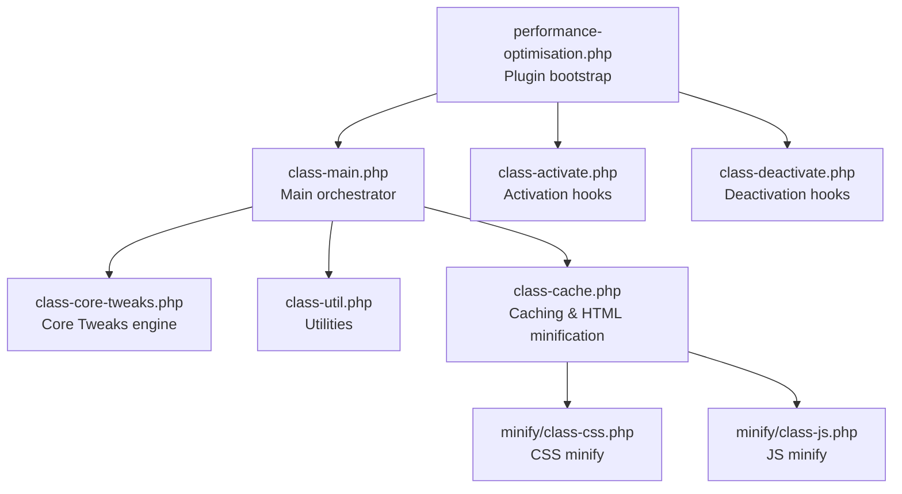
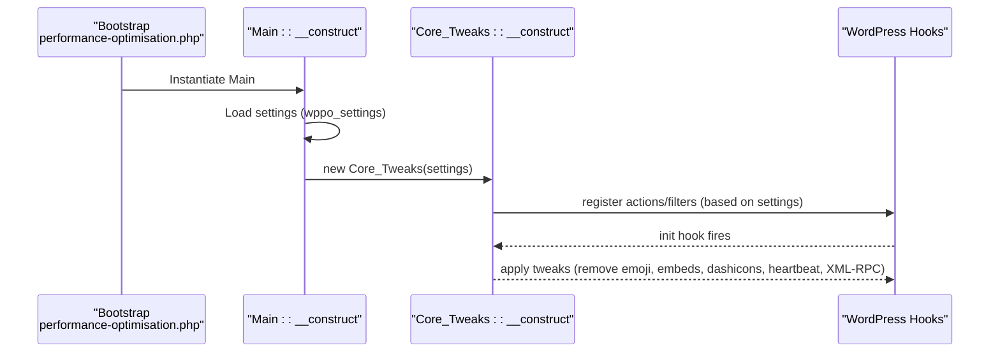
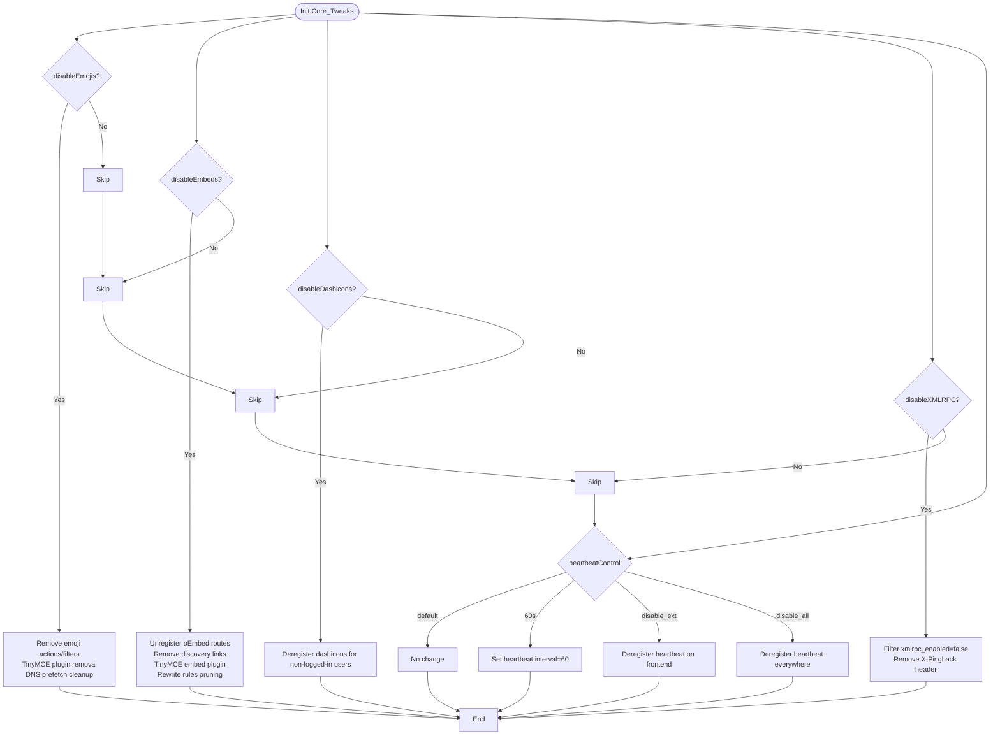
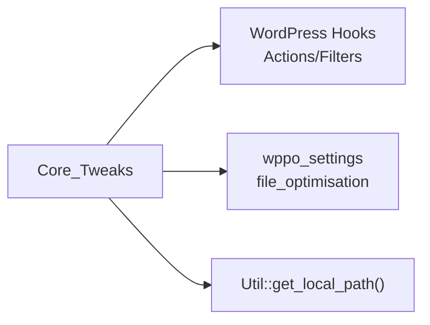

# Core WordPress Tweaks

<cite>
**Referenced Files in This Document**
- [performance-optimisation.php](file://performance-optimisation.php)
- [class-core-tweaks.php](file://includes/class-core-tweaks.php)
- [class-main.php](file://includes/class-main.php)
- [class-activate.php](file://includes/class-activate.php)
- [class-deactivate.php](file://includes/class-deactivate.php)
- [class-util.php](file://includes/class-util.php)
- [class-cache.php](file://includes/class-cache.php)
- [class-css.php](file://includes/minify/class-css.php)
- [class-js.php](file://includes/minify/class-js.php)
- [readme.txt](file://readme.txt)
- [composer.json](file://composer.json)
- [FileOptimization.js](file://src/components/FileOptimization.js)
</cite>

## Table of Contents
1. [Introduction](#introduction)
2. [Project Structure](#project-structure)
3. [Core Components](#core-components)
4. [Architecture Overview](#architecture-overview)
5. [Detailed Component Analysis](#detailed-component-analysis)
6. [Dependency Analysis](#dependency-analysis)
7. [Performance Considerations](#performance-considerations)
8. [Troubleshooting Guide](#troubleshooting-guide)
9. [Conclusion](#conclusion)
10. [Appendices](#appendices)

## Introduction
This document explains the Core WordPress Tweaks functionality included in the plugin. These tweaks disable or modify certain WordPress core features that commonly add overhead without providing value for most sites. The goal is to reduce bloat, lower server load, and improve perceived and measurable performance by removing unnecessary frontend requests and background processes.

The plugin exposes a dedicated “Core Tweaks” section in the admin UI, allowing site owners to safely disable:
- Emojis
- oEmbed/embeds
- Dashicons on the frontend
- XML-RPC
- Heartbeat API (with multiple control modes)

These changes are opt-in and configurable, with safeguards to avoid breaking functionality for sites that legitimately rely on these features.

## Project Structure
The Core Tweaks feature is implemented as a small, focused module integrated into the main plugin lifecycle. The main entry initializes the plugin, loads settings, and instantiates the Core Tweaks engine with the relevant options.

**Diagram sources**
- [performance-optimisation.php:17-43](file://performance-optimisation.php#L17-L43)
- [class-main.php:98-118](file://includes/class-main.php#L98-L118)
- [class-core-tweaks.php:18-56](file://includes/class-core-tweaks.php#L18-L56)
- [class-util.php:29-80](file://includes/class-util.php#L29-L80)
- [class-cache.php:32-120](file://includes/class-cache.php#L32-L120)
- [class-css.php:23-55](file://includes/minify/class-css.php#L23-L55)
- [class-js.php:27-64](file://includes/minify/class-js.php#L27-L64)
- [class-activate.php:35-68](file://includes/class-activate.php#L35-L68)
- [class-deactivate.php:36-49](file://includes/class-deactivate.php#L36-L49)

**Section sources**
- [performance-optimisation.php:17-43](file://performance-optimisation.php#L17-L43)
- [class-main.php:98-118](file://includes/class-main.php#L98-L118)

## Core Components
- Core_Tweaks: Applies WordPress-level modifications based on settings. It registers actions/filters to remove emoji scripts/styles, unregister embed endpoints, deregister dashicons for non-logged-in users, remove X-Pingback headers, and control the Heartbeat API.
- Main: Reads plugin settings, constructs Core_Tweaks with file_optimisation options, and wires up admin UI and other performance features.
- Utilities: Provides helpers for filesystem operations, URL normalization, and preload link generation.
- Activation/Deactivation: Ensures safe installation and cleanup, including adding/removing the WP_CACHE guard and .htaccess rules when applicable.

Key settings that drive Core Tweaks:
- disableEmojis
- disableEmbeds
- disableDashicons
- disableXMLRPC
- heartbeatControl (values: default, 60s, disable_ext, disable_all)

**Section sources**
- [class-core-tweaks.php:18-56](file://includes/class-core-tweaks.php#L18-L56)
- [class-main.php:99-117](file://includes/class-main.php#L99-L117)
- [class-util.php:89-110](file://includes/class-util.php#L89-L110)
- [FileOptimization.js:565-611](file://src/components/FileOptimization.js#L565-L611)

## Architecture Overview
Core Tweaks are applied early in the WordPress lifecycle via actions/filters. The Main class constructs Core_Tweaks with the current settings, ensuring the right tweaks are registered depending on user choices.

**Diagram sources**
- [performance-optimisation.php:40-43](file://performance-optimisation.php#L40-L43)
- [class-main.php:99-117](file://includes/class-main.php#L99-L117)
- [class-core-tweaks.php:32-56](file://includes/class-core-tweaks.php#L32-L56)

## Detailed Component Analysis

### Core_Tweaks Engine
Purpose:
- Remove or modify core WordPress features that add overhead without benefit for most sites.

Implementation highlights:
- Emojis: Removes detection scripts/styles, feed filters, and TinyMCE emoji plugin; also strips emoji CDN from DNS hints.
- Embeds: Unregisters oEmbed routes and JS, removes oEmbed discovery links, disables TinyMCE embed plugin, and prunes rewrite rules.
- Dashicons: Deregisters the dashicons stylesheet for non-logged-in users.
- XML-RPC: Sets xmlrpc_enabled to false and removes X-Pingback header.
- Heartbeat: Supports four modes via heartbeatControl:
  - default: leave as-is
  - 60s: set interval to 60 seconds
  - disable_ext: deregister heartbeat on frontend
  - disable_all: deregister heartbeat everywhere

Performance impact:
- Emojis: Eliminates an extra HTTP request and inline JS/CSS per page.
- Embeds: Removes wp-embed.min.js and related discovery links; prevents outbound oEmbed queries.
- Dashicons: Avoids loading ~10KB of CSS for anonymous users.
- XML-RPC: Reduces attack surface and CPU usage from pingbacks.
- Heartbeat: Significantly lowers AJAX polling frequency or disables it on the frontend.

Compatibility and safety:
- All changes are opt-in and controlled by settings.
- Heartbeat control allows disabling only on frontend if admin-dependent scripts require it.
- Embeds and Emojis removal is safe for most sites; verify if third-party content relies on embedding or emoji rendering.

Rollback:
- Disabling the relevant toggles reverts the changes immediately.
- No persistent state is written outside of plugin settings.

**Diagram sources**
- [class-core-tweaks.php:32-56](file://includes/class-core-tweaks.php#L32-L56)
- [class-core-tweaks.php:61-99](file://includes/class-core-tweaks.php#L61-L99)
- [class-core-tweaks.php:104-144](file://includes/class-core-tweaks.php#L104-L144)
- [class-core-tweaks.php:149-153](file://includes/class-core-tweaks.php#L149-L153)
- [class-core-tweaks.php:161-166](file://includes/class-core-tweaks.php#L161-L166)
- [class-core-tweaks.php:171-181](file://includes/class-core-tweaks.php#L171-L181)

**Section sources**
- [class-core-tweaks.php:32-192](file://includes/class-core-tweaks.php#L32-L192)

### Main Integration and Settings
- Main reads the wppo_settings option and passes file_optimisation subsection to Core_Tweaks.
- The admin UI exposes toggles for each tweak and heartbeat mode, with contextual descriptions and warnings.

Configuration options exposed in UI:
- Disable Emojis
- Disable Embeds
- Disable Dashicons on Frontend
- Disable XML-RPC
- Heartbeat API Control (four modes)

Best practices:
- Start with defaults and enable only what applies to your site.
- Test after enabling Heartbeat control and XML-RPC disable.
- If using Jetpack or remote publishing, keep XML-RPC enabled.

**Section sources**
- [class-main.php:99-117](file://includes/class-main.php#L99-L117)
- [FileOptimization.js:565-611](file://src/components/FileOptimization.js#L565-L611)

### Utilities and Filesystem Helpers
- get_local_path: Converts URLs to filesystem paths safely, guarding against directory traversal.
- process_urls: Normalizes and deduplicates lists of URLs for exclusions and preloads.
- generate_preload_link: Outputs sanitized preload/dns-prefetch/preconnect link tags.

These utilities underpin safe asset handling and preload injection elsewhere in the plugin.

**Section sources**
- [class-util.php:89-110](file://includes/class-util.php#L89-L110)
- [class-util.php:243-248](file://includes/class-util.php#L243-L248)
- [class-util.php:193-231](file://includes/class-util.php#L193-L231)

### Activation and Deactivation Lifecycle
- Activation ensures WP_CACHE guard is present and may apply .htaccess rules based on settings.
- Deactivation removes cron jobs, clears caches, and cleans up WP_CACHE and drop-in files.

This ensures a clean slate when the plugin is disabled.

**Section sources**
- [class-activate.php:35-68](file://includes/class-activate.php#L35-L68)
- [class-deactivate.php:36-49](file://includes/class-deactivate.php#L36-L49)

## Dependency Analysis
Core_Tweaks depends on WordPress hooks and core APIs. It does not introduce external runtime dependencies beyond WordPress itself.

**Diagram sources**
- [class-core-tweaks.php:32-56](file://includes/class-core-tweaks.php#L32-L56)
- [class-main.php:99-117](file://includes/class-main.php#L99-L117)
- [class-util.php:89-110](file://includes/class-util.php#L89-L110)

**Section sources**
- [class-core-tweaks.php:32-56](file://includes/class-core-tweaks.php#L32-L56)
- [class-main.php:99-117](file://includes/class-main.php#L99-L117)

## Performance Considerations
- Reduced network requests: Removing emojis and embeds eliminates extra assets.
- Lower CPU usage: Heartbeat throttling or disabling reduces AJAX polling.
- Fewer CSS downloads: Removing dashicons for guests cuts CSS size.
- Security and resource savings: Disabling XML-RPC mitigates pingback-based CPU spikes.

Recommendations:
- Measure before/after using tools like PageSpeed Insights or Lighthouse.
- Enable Heartbeat control gradually and monitor admin/editor scripts.
- Keep XML-RPC enabled if Jetpack or remote clients are used.

[No sources needed since this section provides general guidance]

## Troubleshooting Guide
Common issues and resolutions:
- Admin/editor scripts relying on Heartbeat: Switch heartbeatControl to “Disable on Frontend Only” or “Default Mode.”
- Jetpack or remote publishing broken: Keep XML-RPC enabled.
- Embeds used on content: Keep disableEmbeds disabled.
- Emoji-dependent icons: Keep disableEmojis disabled.
- Dashicons needed on frontend: Keep disableDashicons disabled.

Rollback procedure:
- In the admin UI, disable the specific Core Tweaks toggle(s).
- Save settings; changes take effect immediately.

Validation:
- Verify that the relevant assets are no longer enqueued or requested.
- Use browser dev tools to confirm removal of emoji assets, embed scripts, dashicons CSS, and heartbeat polling.

**Section sources**
- [FileOptimization.js:565-611](file://src/components/FileOptimization.js#L565-L611)
- [class-core-tweaks.php:61-99](file://includes/class-core-tweaks.php#L61-L99)
- [class-core-tweaks.php:104-144](file://includes/class-core-tweaks.php#L104-L144)
- [class-core-tweaks.php:149-153](file://includes/class-core-tweaks.php#L149-L153)
- [class-core-tweaks.php:161-166](file://includes/class-core-tweaks.php#L161-L166)
- [class-core-tweaks.php:171-181](file://includes/class-core-tweaks.php#L171-L181)

## Conclusion
The Core Tweaks subsystem provides a safe, configurable way to remove common sources of WordPress bloat. By disabling Emojis, Embeds, Dashicons, XML-RPC, and controlling Heartbeat, most sites can reduce payload size, lower CPU usage, and improve responsiveness. Because these changes are opt-in and reversible, they can be tested incrementally with minimal risk.

[No sources needed since this section summarizes without analyzing specific files]

## Appendices

### Configuration Options Reference
- disableEmojis: Boolean. Removes emoji scripts/styles and TinyMCE plugin.
- disableEmbeds: Boolean. Disables oEmbed endpoints and related scripts.
- disableDashicons: Boolean. Deregisters dashicons for non-logged-in users.
- disableXMLRPC: Boolean. Disables xmlrpc.php and removes X-Pingback header.
- heartbeatControl: String. Values: default | 60s | disable_ext | disable_all.

**Section sources**
- [class-core-tweaks.php:32-56](file://includes/class-core-tweaks.php#L32-L56)
- [FileOptimization.js:565-611](file://src/components/FileOptimization.js#L565-L611)

### Compatibility Notes
- Heartbeat control: Use “Disable on Frontend Only” if admin-dependent scripts are present.
- XML-RPC: Disable only if Jetpack or remote publishing is not used.
- Embeds/Emojis: Disable if your site does not rely on cross-site embedding or emoji rendering.

**Section sources**
- [readme.txt:212-216](file://readme.txt#L212-L216)
- [FileOptimization.js:565-611](file://src/components/FileOptimization.js#L565-L611)

### Dependencies
- Composer libraries used by the plugin include HTML and code minification packages, but Core Tweaks itself has no external runtime dependencies beyond WordPress.

**Section sources**
- [composer.json:11-14](file://composer.json#L11-L14)