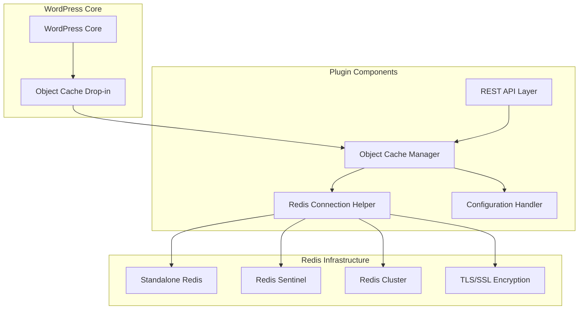
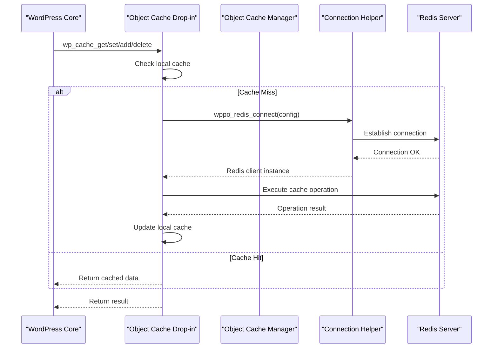
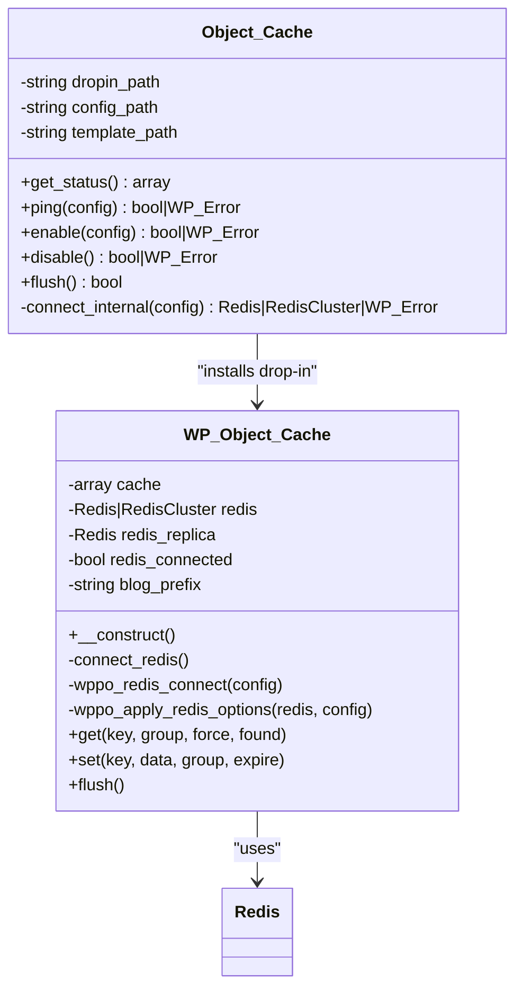
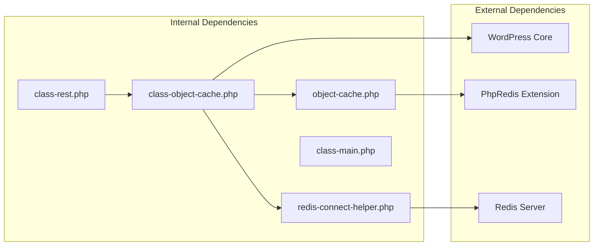

# Object Cache Integration

<cite>
**Referenced Files in This Document**
- [class-object-cache.php](file://includes/class-object-cache.php)
- [redis-connect-helper.php](file://includes/redis-connect-helper.php)
- [object-cache.php](file://templates/object-cache.php)
- [ObjectCache.js](file://src/components/ObjectCache.js)
- [class-rest.php](file://includes/class-rest.php)
- [class-main.php](file://includes/class-main.php)
- [performance-optimisation.php](file://performance-optimisation.php)
- [readme.txt](file://readme.txt)
</cite>

## Table of Contents
1. [Introduction](#introduction)
2. [Project Structure](#project-structure)
3. [Core Components](#core-components)
4. [Architecture Overview](#architecture-overview)
5. [Detailed Component Analysis](#detailed-component-analysis)
6. [Dependency Analysis](#dependency-analysis)
7. [Performance Considerations](#performance-considerations)
8. [Troubleshooting Guide](#troubleshooting-guide)
9. [Conclusion](#conclusion)

## Introduction
This document provides comprehensive documentation for the object cache integration system that enables enterprise-grade Redis object caching in WordPress. The system integrates with Redis and Memcached through WordPress's object-cache drop-in mechanism, offering high availability, clustering, and advanced security features.

The plugin provides a complete Redis object caching solution with support for standalone deployments, Redis Sentinel for high availability, and Redis Cluster for distributed caching. It includes sophisticated connection management, automatic failover, TLS encryption, and performance optimization features.

## Project Structure
The object cache integration is built around several key components that work together to provide seamless Redis integration:



**Diagram sources**
- [class-object-cache.php:1-290](file://includes/class-object-cache.php#L1-L290)
- [redis-connect-helper.php:1-245](file://includes/redis-connect-helper.php#L1-L245)
- [object-cache.php:1-900](file://templates/object-cache.php#L1-L900)

**Section sources**
- [performance-optimisation.php:1-68](file://performance-optimisation.php#L1-L68)
- [readme.txt:33-33](file://readme.txt#L33-L33)

## Core Components

### Object Cache Manager
The Object Cache Manager serves as the central coordinator for Redis integration, handling installation, configuration, connection testing, and status monitoring.

Key responsibilities include:
- Managing the WordPress object-cache drop-in installation
- Validating Redis connectivity and configuration
- Providing status monitoring and telemetry data
- Supporting multiple Redis deployment modes (standalone, sentinel, cluster)
- Handling connection testing and ping operations

### Redis Connection Helper
Provides shared connection logic for both the admin dashboard and the object cache drop-in, supporting multiple Redis deployment patterns:

- **Standalone Mode**: Direct connection to a single Redis instance
- **Sentinel Mode**: High availability with automatic failover
- **Cluster Mode**: Distributed caching across multiple nodes
- **TLS Support**: Encrypted connections for production environments

### Object Cache Drop-in
The WordPress-compatible object cache implementation that integrates seamlessly with the WordPress object cache API, providing transparent caching for WordPress core and plugins.

**Section sources**
- [class-object-cache.php:22-290](file://includes/class-object-cache.php#L22-L290)
- [redis-connect-helper.php:15-245](file://includes/redis-connect-helper.php#L15-L245)
- [object-cache.php:20-764](file://templates/object-cache.php#L20-L764)

## Architecture Overview

The object cache system follows a layered architecture that ensures compatibility with WordPress while providing enterprise-grade Redis functionality:



**Diagram sources**
- [object-cache.php:431-459](file://templates/object-cache.php#L431-L459)
- [redis-connect-helper.php:34-188](file://includes/redis-connect-helper.php#L34-L188)
- [class-object-cache.php:153-156](file://includes/class-object-cache.php#L153-L156)

The architecture supports multiple connection modes with automatic fallback and failover capabilities, ensuring high availability and reliable caching performance.

## Detailed Component Analysis

### Object Cache Manager Implementation

The Object Cache Manager ([class-object-cache.php](file://includes/class-object-cache.php)) provides comprehensive Redis integration management:



**Diagram sources**
- [class-object-cache.php:22-290](file://includes/class-object-cache.php#L22-L290)
- [object-cache.php:20-764](file://templates/object-cache.php#L20-L764)

#### Status Monitoring and Telemetry
The manager provides comprehensive status monitoring with detailed Redis telemetry:

| Status Field | Description | Values |
|--------------|-------------|---------|
| `enabled` | Drop-in installation status | `true`/`false` |
| `redis_missing` | PhpRedis extension availability | `true`/`false` |
| `redis_reachable` | Redis connection status | `true`/`false` |
| `foreign_dropin` | Conflicting drop-in detection | `true`/`false` |
| `telemetry` | Redis server statistics | Various metrics |

Telemetry data includes Redis version, uptime, memory usage, client connections, and cache hit ratios.

**Section sources**
- [class-object-cache.php:78-144](file://includes/class-object-cache.php#L78-L144)
- [class-object-cache.php:153-156](file://includes/class-object-cache.php#L153-L156)

### Redis Connection Management

The connection helper ([redis-connect-helper.php](file://includes/redis-connect-helper.php)) implements robust connection logic supporting multiple deployment patterns:

#### Connection Modes

**Standalone Mode**
- Direct connection to single Redis instance
- Supports persistent connections for performance
- Authentication and database selection
- Local replica support for read scaling

**Sentinel Mode**
- High availability with automatic failover
- Multiple sentinel nodes for redundancy
- Dynamic master discovery
- Version requirement (phpredis >= 6.0.0)

**Cluster Mode**
- Distributed caching across multiple nodes
- Automatic sharding and failover
- TLS support for encrypted connections
- Persistent connections for cluster nodes

#### Connection Security Features
- TLS/SSL encryption support
- Authentication with password-based auth
- Database selection and isolation
- Connection timeout handling (0.5 seconds)

**Section sources**
- [redis-connect-helper.php:34-188](file://includes/redis-connect-helper.php#L34-L188)
- [redis-connect-helper.php:202-220](file://includes/redis-connect-helper.php#L202-L220)

### Object Cache Drop-in Implementation

The WordPress-compatible object cache drop-in ([object-cache.php](file://templates/object-cache.php)) provides seamless integration with WordPress's caching API:

#### Key Features
- WordPress object cache API compliance
- Local memory caching for performance
- Group-based caching with global/non-persistent groups
- Batch operations (mGet, mSet) for efficiency
- Atomic increment/decrement operations
- Site-specific key prefixing for multisite support

#### Caching Operations
The drop-in implements all standard WordPress cache operations:

| Operation | Method | Purpose |
|-----------|---------|---------|
| Get | `get()` | Retrieve cached data |
| Set | `set()` | Store cached data |
| Add | `add()` | Add data if not exists |
| Replace | `replace()` | Replace existing data |
| Delete | `delete()` | Remove cached data |
| Flush | `flush()` | Clear cache for site |
| Increment | `incr()` | Atomic increment |
| Decrement | `decr()` | Atomic decrement |

#### Performance Optimizations
- Local cache layer for frequent access
- Batch operations for multiple keys
- Pipeline support for atomic operations
- Replica support for read scaling
- Intelligent key prefixing for isolation

**Section sources**
- [object-cache.php:431-518](file://templates/object-cache.php#L431-L518)
- [object-cache.php:633-674](file://templates/object-cache.php#L633-L674)

### Admin Interface and Configuration

The admin interface ([ObjectCache.js](file://src/components/ObjectCache.js)) provides a comprehensive configuration experience:

#### Configuration Options
- **Connection Mode**: Standalone, Sentinel, or Cluster
- **Basic Settings**: Host, port, password, database
- **Advanced Settings**: TLS encryption, persistent connections
- **Performance**: Memory compression (LZF, ZSTD, LZ4)
- **Monitoring**: Real-time status and telemetry

#### User Experience Features
- Real-time connection testing
- Conflict detection with other cache plugins
- Extension availability validation
- Progress indicators for operations
- Comprehensive error messaging

**Section sources**
- [ObjectCache.js:23-539](file://src/components/ObjectCache.js#L23-L539)
- [class-rest.php:636-695](file://includes/class-rest.php#L636-L695)

## Dependency Analysis

The object cache system has minimal external dependencies while providing comprehensive Redis integration:



**Diagram sources**
- [class-main.php:128-154](file://includes/class-main.php#L128-L154)
- [class-rest.php:105-109](file://includes/class-rest.php#L105-L109)

### WordPress Integration Points
- Object cache drop-in mechanism
- REST API integration for admin interface
- Settings management through WordPress options
- File system operations for drop-in management

### Redis Integration Points
- PhpRedis extension for native Redis operations
- Redis Sentinel for high availability
- Redis Cluster for distributed caching
- TLS support for encrypted connections

**Section sources**
- [class-main.php:128-154](file://includes/class-main.php#L128-L154)
- [class-rest.php:105-109](file://includes/class-rest.php#L105-L109)

## Performance Considerations

### Connection Optimization
- **Timeout Configuration**: 0.5-second connection timeouts balance responsiveness with reliability
- **Persistent Connections**: Optional persistent connections reduce connection overhead
- **Local Caching**: In-memory cache layer reduces Redis round trips
- **Batch Operations**: mGet/mSet operations minimize network overhead

### Memory Management
- **Serializer Selection**: Automatic igbinary/php serializer selection
- **Compression Options**: LZF, ZSTD, and LZ4 compression support
- **Memory Footprint**: Configurable compression reduces memory usage
- **Garbage Collection**: Automatic cleanup of expired keys

### Scalability Features
- **Cluster Support**: Horizontal scaling across multiple Redis nodes
- **Replica Support**: Read scaling with dedicated replica connections
- **Connection Pooling**: Efficient connection reuse
- **Failover Handling**: Automatic recovery from Redis failures

## Troubleshooting Guide

### Common Connection Issues

**Redis Extension Missing**
- **Symptoms**: "Extension Missing" notice in admin interface
- **Solution**: Install and enable PhpRedis extension
- **Verification**: Check phpinfo() for Redis module

**Connection Timeout**
- **Symptoms**: "Redis Server Unreachable" errors
- **Causes**: Network latency, firewall blocking, incorrect host/port
- **Solutions**: Verify network connectivity, check firewall rules, validate host/port configuration

**Authentication Failures**
- **Symptoms**: "Redis Auth failed" errors
- **Causes**: Incorrect password, missing AUTH configuration
- **Solutions**: Verify password configuration, check Redis AUTH settings

**Sentinel Configuration Issues**
- **Symptoms**: "Could not resolve master via Sentinels" errors
- **Causes**: Missing sentinel nodes, incorrect master name, phpredis version issues
- **Solutions**: Verify sentinel node configuration, check phpredis version >= 6.0.0

### Diagnostic Commands

**Connection Testing**
```bash
# Test Redis connectivity
redis-cli -h HOST -p PORT PING

# Check Redis server info
redis-cli INFO

# Test authentication
redis-cli -a PASSWORD PING
```

**WordPress Debugging**
- Enable WordPress debug logging
- Check plugin conflict detection
- Verify drop-in file permissions

**Performance Monitoring**
- Monitor Redis memory usage
- Track cache hit ratios
- Observe connection pool utilization

**Section sources**
- [class-object-cache.php:165-195](file://includes/class-object-cache.php#L165-L195)
- [redis-connect-helper.php:72-153](file://includes/redis-connect-helper.php#L72-L153)

## Conclusion

The object cache integration system provides a comprehensive, enterprise-grade Redis caching solution for WordPress. It offers:

- **Multi-mode Support**: Standalone, Sentinel, and Cluster deployments
- **High Availability**: Automatic failover and redundancy
- **Security**: TLS encryption and authentication support
- **Performance**: Optimized connections, batching, and compression
- **Management**: Complete admin interface with monitoring and diagnostics

The system integrates seamlessly with WordPress through the object-cache drop-in mechanism while providing advanced Redis features suitable for production environments. Its modular architecture ensures maintainability and extensibility for future enhancements.

Key benefits include reduced database load, improved page load times, and scalable caching infrastructure that grows with your WordPress site's needs.