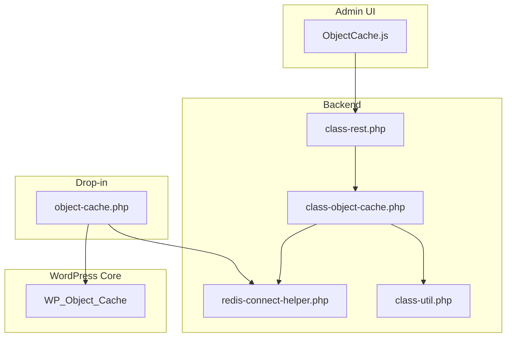
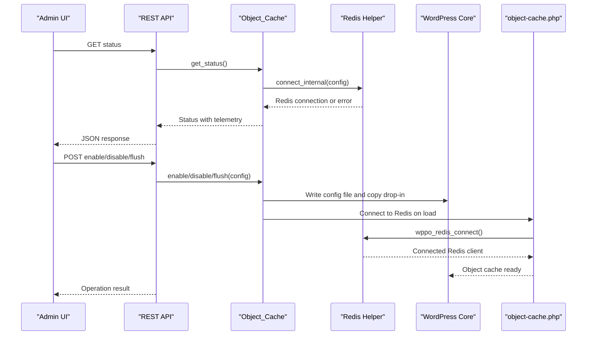
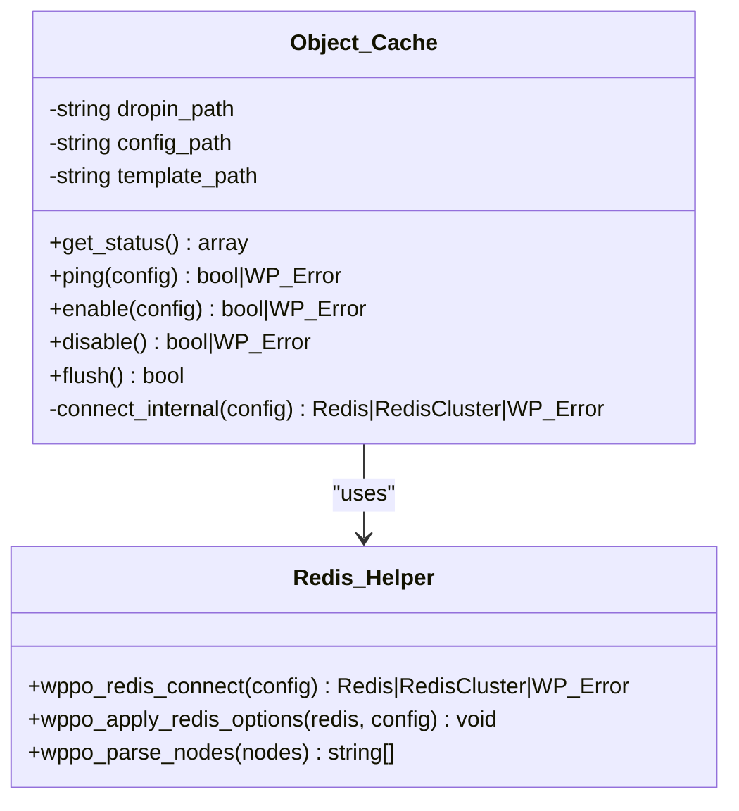
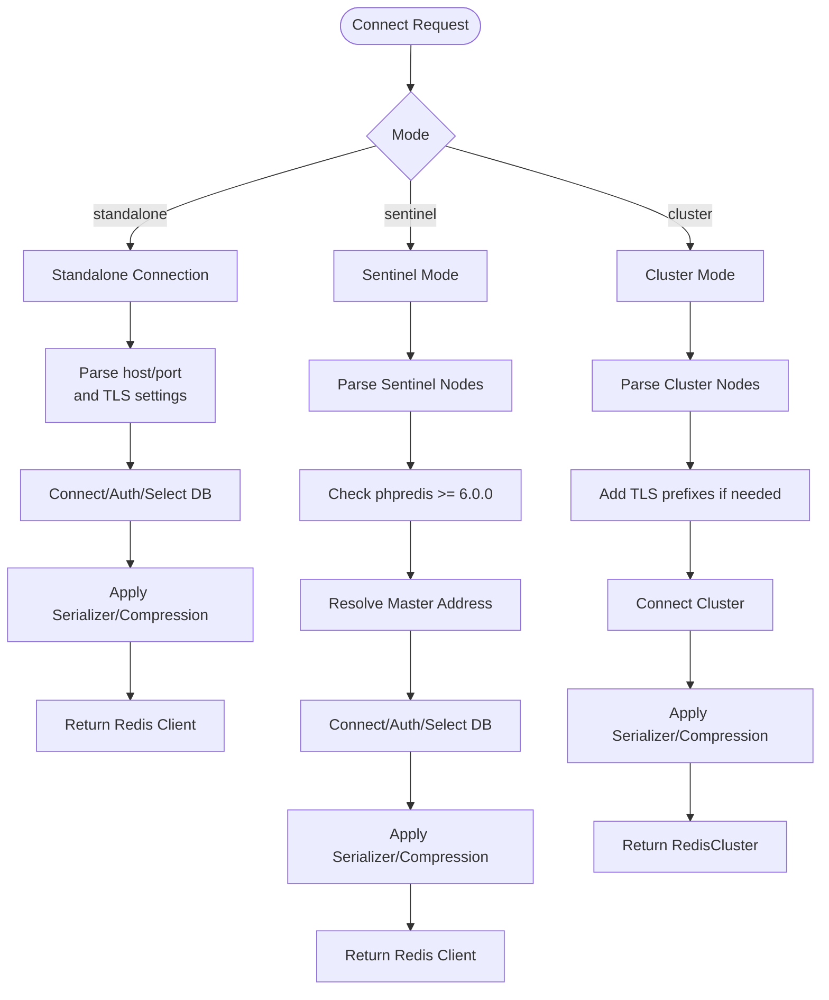
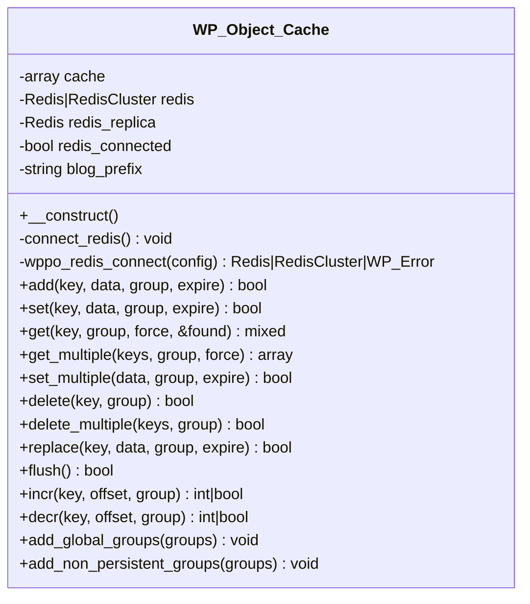
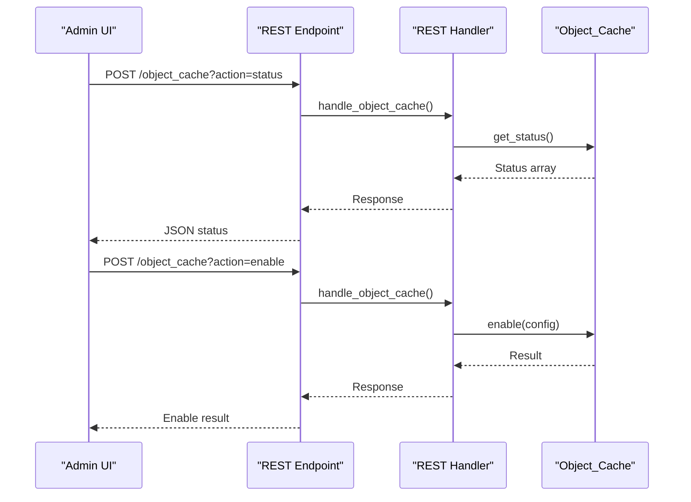
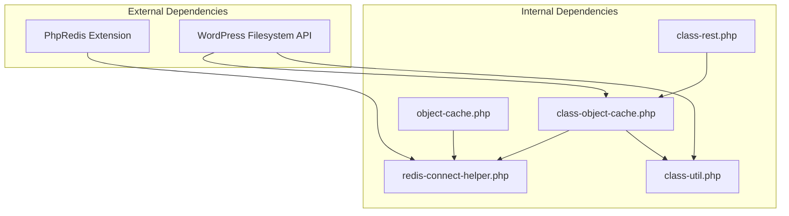

# Object Cache Integration

<cite>
**Referenced Files in This Document**
- [class-object-cache.php](file://includes/class-object-cache.php)
- [redis-connect-helper.php](file://includes/redis-connect-helper.php)
- [object-cache.php](file://templates/object-cache.php)
- [ObjectCache.js](file://src/components/ObjectCache.js)
- [class-rest.php](file://includes/class-rest.php)
- [class-main.php](file://includes/class-main.php)
- [performance-optimisation.php](file://performance-optimisation.php)
- [class-util.php](file://includes/class-util.php)
- [readme.txt](file://readme.txt)
- [changelog.md](file://changelog.md)
</cite>

## Table of Contents
1. [Introduction](#introduction)
2. [Project Structure](#project-structure)
3. [Core Components](#core-components)
4. [Architecture Overview](#architecture-overview)
5. [Detailed Component Analysis](#detailed-component-analysis)
6. [Dependency Analysis](#dependency-analysis)
7. [Performance Considerations](#performance-considerations)
8. [Troubleshooting Guide](#troubleshooting-guide)
9. [Conclusion](#conclusion)

## Introduction
This document explains the object cache integration system that enables enterprise-grade Redis object caching for WordPress through the plugin's drop-in mechanism. It covers installation, configuration, connection testing, status monitoring, Redis connection helpers, cluster support, security considerations, and performance optimization techniques. The system supports standalone, Sentinel, and Cluster modes with TLS/SSL encryption and provides comprehensive status reporting and administrative controls.

## Project Structure
The object cache integration spans several components:
- Backend manager for enabling/disabling the drop-in and testing connectivity
- Shared Redis connection helper for both admin UI and drop-in
- WordPress object cache drop-in that integrates with WordPress core caching
- REST API endpoints for administrative actions
- Frontend dashboard component for configuration and monitoring

**Diagram sources**
- [ObjectCache.js:1-539](file://src/components/ObjectCache.js#L1-L539)
- [class-rest.php:105-109](file://includes/class-rest.php#L105-L109)
- [class-object-cache.php:22-62](file://includes/class-object-cache.php#L22-L62)
- [redis-connect-helper.php:34-188](file://includes/redis-connect-helper.php#L34-L188)
- [object-cache.php:20-149](file://templates/object-cache.php#L20-L149)

**Section sources**
- [class-main.php:128-157](file://includes/class-main.php#L128-L157)
- [performance-optimisation.php:40-44](file://performance-optimisation.php#L40-L44)

## Core Components
- Object Cache Manager: Handles drop-in installation, removal, status checking, and connection testing
- Redis Connection Helper: Shared logic for standalone, Sentinel, and Cluster connections with TLS support
- WordPress Object Cache Drop-in: Integrates with WordPress core to provide transparent object caching
- REST API Handler: Exposes endpoints for status, ping, enable/disable, and flush operations
- Admin Dashboard Component: Provides configuration UI, connection testing, and status monitoring

Key capabilities:
- Automatic detection of existing drop-ins and prevention of conflicts
- Support for Redis standalone, Sentinel HA, and Cluster deployments
- TLS/SSL encryption for secure connections
- Memory compression options (LZF, ZSTD, LZ4) when supported
- Persistent connections for reduced overhead
- Comprehensive telemetry and hit ratio calculation

**Section sources**
- [class-object-cache.php:22-144](file://includes/class-object-cache.php#L22-L144)
- [redis-connect-helper.php:34-220](file://includes/redis-connect-helper.php#L34-L220)
- [object-cache.php:20-764](file://templates/object-cache.php#L20-L764)
- [class-rest.php:636-695](file://includes/class-rest.php#L636-L695)

## Architecture Overview
The system follows a layered architecture with clear separation between UI, backend logic, and the WordPress drop-in:

**Diagram sources**
- [class-rest.php:636-695](file://includes/class-rest.php#L636-L695)
- [class-object-cache.php:78-144](file://includes/class-object-cache.php#L78-L144)
- [redis-connect-helper.php:34-188](file://includes/redis-connect-helper.php#L34-L188)
- [object-cache.php:78-149](file://templates/object-cache.php#L78-L149)

## Detailed Component Analysis

### Object Cache Manager
The Object Cache Manager serves as the central controller for all object cache operations:

**Diagram sources**
- [class-object-cache.php:22-290](file://includes/class-object-cache.php#L22-L290)
- [redis-connect-helper.php:34-245](file://includes/redis-connect-helper.php#L34-L245)

Key responsibilities:
- Validates existing drop-ins and prevents conflicts
- Manages configuration file generation and placement
- Tests Redis connectivity and collects telemetry
- Provides administrative actions (enable, disable, flush)

**Section sources**
- [class-object-cache.php:78-144](file://includes/class-object-cache.php#L78-L144)
- [class-object-cache.php:208-247](file://includes/class-object-cache.php#L208-L247)
- [class-object-cache.php:256-275](file://includes/class-object-cache.php#L256-L275)

### Redis Connection Helpers
The Redis connection helper provides robust connection logic across all supported modes:

**Diagram sources**
- [redis-connect-helper.php:34-188](file://includes/redis-connect-helper.php#L34-L188)

Connection features:
- Automatic TLS prefix handling for all modes
- Persistent connection support for standalone/cluster
- Graceful fallback and error reporting
- Memory compression configuration (LZF, ZSTD, LZ4)
- Serializer selection with igbinary fallback

**Section sources**
- [redis-connect-helper.php:34-188](file://includes/redis-connect-helper.php#L34-L188)
- [redis-connect-helper.php:202-220](file://includes/redis-connect-helper.php#L202-L220)
- [redis-connect-helper.php:231-244](file://includes/redis-connect-helper.php#L231-L244)

### WordPress Object Cache Drop-in
The drop-in seamlessly integrates with WordPress core:

**Diagram sources**
- [object-cache.php:20-764](file://templates/object-cache.php#L20-L764)

Key features:
- Transparent integration with WordPress caching functions
- Support for global and non-persistent groups
- Replica connections for read scaling
- Pipeline support for batch operations
- Site-scoped flush operations

**Section sources**
- [object-cache.php:78-149](file://templates/object-cache.php#L78-L149)
- [object-cache.php:431-518](file://templates/object-cache.php#L431-L518)
- [object-cache.php:633-674](file://templates/object-cache.php#L633-L674)

### REST API Integration
The REST API provides administrative controls:

**Diagram sources**
- [class-rest.php:105-109](file://includes/class-rest.php#L105-L109)
- [class-rest.php:636-695](file://includes/class-rest.php#L636-L695)

Supported actions:
- status: Retrieve current status and telemetry
- ping: Test Redis connectivity
- enable: Install drop-in and configuration
- disable: Remove drop-in and configuration
- flush: Clear object cache

**Section sources**
- [class-rest.php:636-695](file://includes/class-rest.php#L636-L695)
- [class-rest.php:697-763](file://includes/class-rest.php#L697-L763)

## Dependency Analysis
The object cache system has minimal external dependencies and clear internal relationships:

**Diagram sources**
- [class-object-cache.php:87-96](file://includes/class-object-cache.php#L87-L96)
- [redis-connect-helper.php:34-188](file://includes/redis-connect-helper.php#L34-L188)
- [object-cache.php:78-88](file://templates/object-cache.php#L78-L88)

Key dependencies:
- PhpRedis extension for Redis operations
- WordPress filesystem API for file operations
- WordPress REST API for administrative endpoints
- WordPress core caching functions for integration

**Section sources**
- [class-object-cache.php:81-84](file://includes/class-object-cache.php#L81-L84)
- [class-rest.php:131-136](file://includes/class-rest.php#L131-L136)

## Performance Considerations
The system implements several performance optimizations:

### Connection Management
- Persistent connections reduce TCP handshake overhead
- Connection pooling through RedisCluster for multi-node deployments
- Graceful fallback to local cache when Redis is unavailable
- Optimized serializer selection with igbinary fallback

### Memory Efficiency
- Optional memory compression (LZF, ZSTD, LZ4) reduces memory footprint
- Pipeline operations for batch set/get operations
- Local cache layer for non-critical data
- Efficient key prefixing to minimize memory fragmentation

### Operational Optimizations
- Asynchronous operations where possible
- Batched processing for large datasets
- Intelligent retry mechanisms with exponential backoff
- Connection reuse across requests

### Monitoring and Telemetry
- Real-time hit ratio calculation
- Memory usage tracking
- Connection statistics collection
- Performance metrics exposed through REST API

**Section sources**
- [redis-connect-helper.php:202-220](file://includes/redis-connect-helper.php#L202-L220)
- [object-cache.php:431-518](file://templates/object-cache.php#L431-L518)
- [class-rest.php:642-649](file://includes/class-rest.php#L642-L649)

## Troubleshooting Guide

### Common Connection Issues
1. **PhpRedis Extension Missing**
   - Symptom: "Extension Missing" notice in dashboard
   - Solution: Install and enable PhpRedis extension
   - Verification: Check phpinfo() for Redis module

2. **Foreign Drop-in Conflict**
   - Symptom: "Conflict Detected" notice
   - Solution: Disable other object cache plugins
   - Prevention: System checks for existing drop-ins

3. **Redis Server Unreachable**
   - Symptom: Connection timeout or refused connection
   - Solution: Verify Redis server status and network connectivity
   - Debug: Use ping action to test connectivity

4. **Authentication Failures**
   - Symptom: "Auth failed" errors
   - Solution: Verify password and database selection
   - Security: Ensure proper ACL configuration

### Configuration Validation
The system performs comprehensive validation:
- Node specification parsing for cluster/sentinel modes
- TLS certificate validation
- Memory compression capability detection
- Serializer compatibility checks

### Diagnostic Tools
Administrative tools for troubleshooting:
- Connection testing with detailed error messages
- Telemetry collection for Redis statistics
- Status monitoring with real-time updates
- Error logging and reporting

**Section sources**
- [ObjectCache.js:209-233](file://src/components/ObjectCache.js#L209-L233)
- [class-rest.php:652-660](file://includes/class-rest.php#L652-L660)
- [class-object-cache.php:165-195](file://includes/class-object-cache.php#L165-L195)

## Conclusion
The object cache integration system provides enterprise-grade Redis object caching for WordPress with comprehensive support for standalone, Sentinel, and Cluster deployments. Its architecture emphasizes security, performance, and operational simplicity through:

- Seamless WordPress integration via drop-in mechanism
- Robust connection handling across multiple Redis deployment patterns
- Comprehensive administrative controls and monitoring
- Performance optimizations including compression and persistent connections
- Strong security measures including conflict detection and validation

The system is designed for production environments requiring high availability, scalability, and observability while maintaining ease of use for administrators.