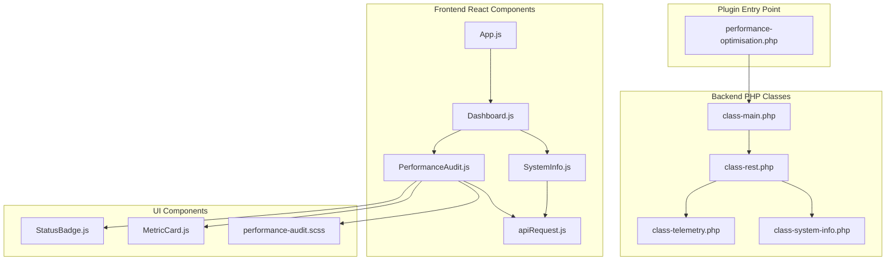
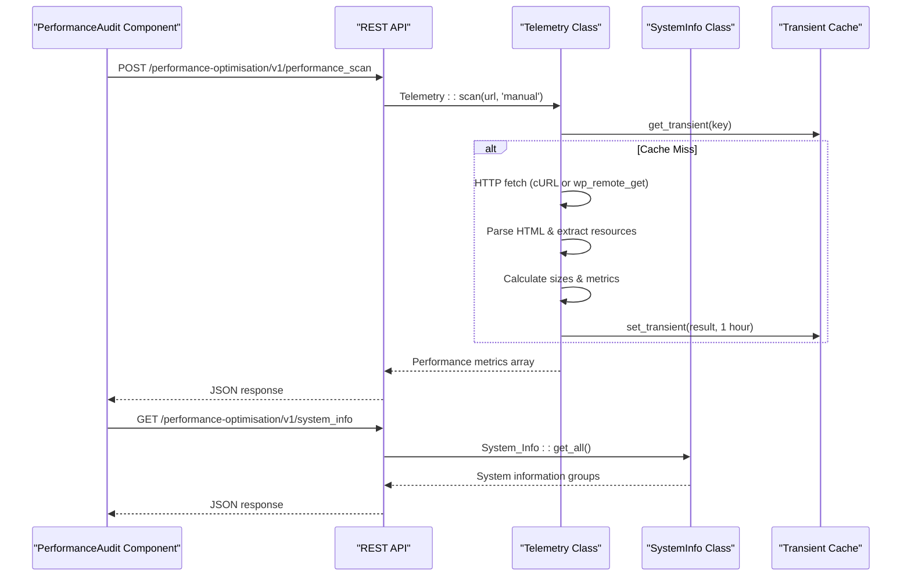
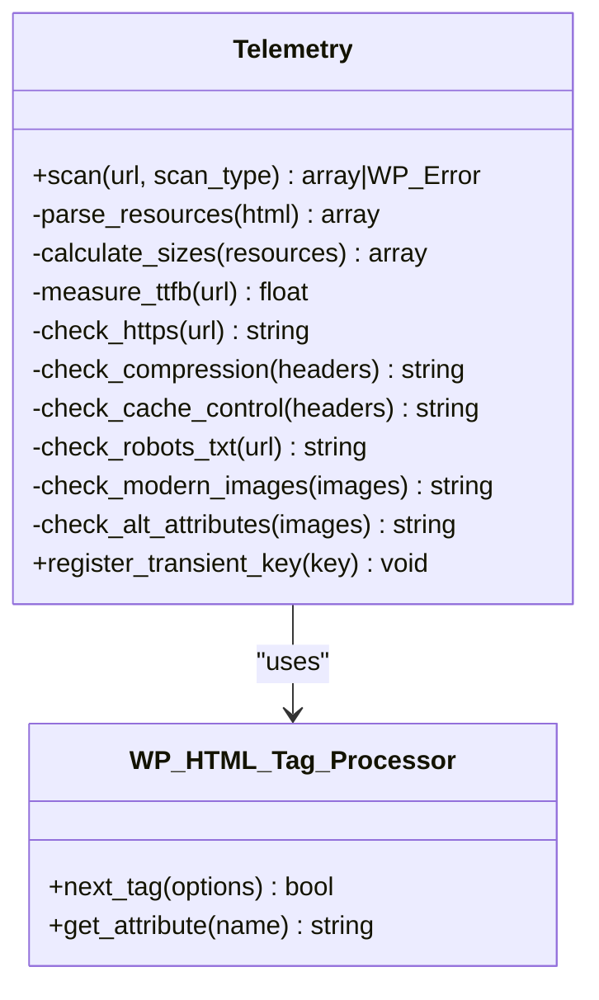
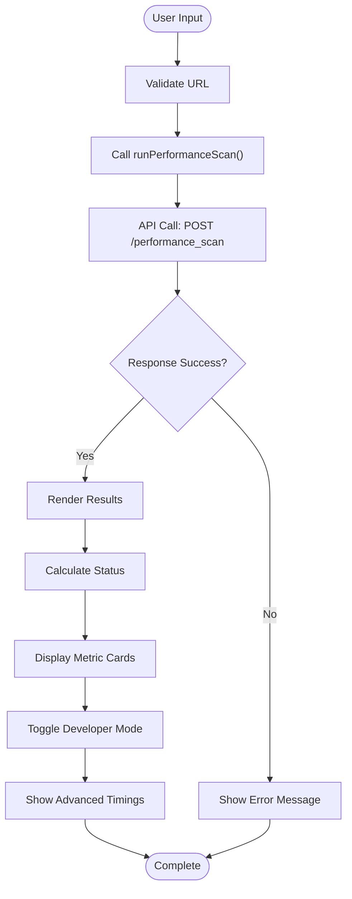
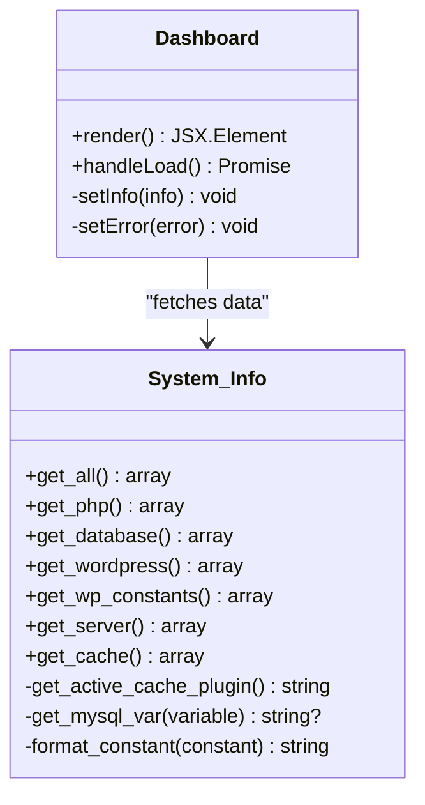
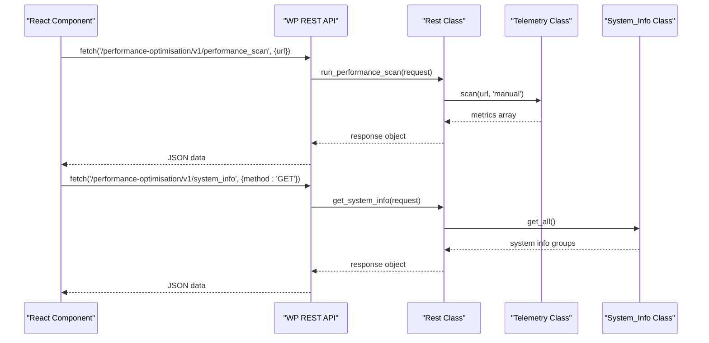
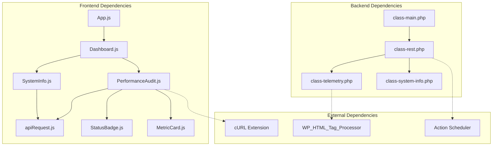

# Performance Audit Capabilities

<cite>
**Referenced Files in This Document**
- [performance-optimisation.php](file://performance-optimisation.php)
- [class-main.php](file://includes/class-main.php)
- [class-rest.php](file://includes/class-rest.php)
- [class-telemetry.php](file://includes/class-telemetry.php)
- [class-system-info.php](file://includes/class-system-info.php)
- [PerformanceAudit.js](file://src/components/PerformanceAudit.js)
- [SystemInfo.js](file://src/components/SystemInfo.js)
- [apiRequest.js](file://src/lib/apiRequest.js)
- [App.js](file://src/App.js)
- [Dashboard.js](file://src/components/Dashboard.js)
- [StatusBadge.js](file://src/components/common/StatusBadge.js)
- [MetricCard.js](file://src/components/common/MetricCard.js)
- [performance-audit.scss](file://src/css/components/_performance-audit.scss)
- [readme.txt](file://readme.txt)
</cite>

## Table of Contents
1. [Introduction](#introduction)
2. [Project Structure](#project-structure)
3. [Core Components](#core-components)
4. [Architecture Overview](#architecture-overview)
5. [Detailed Component Analysis](#detailed-component-analysis)
6. [Dependency Analysis](#dependency-analysis)
7. [Performance Considerations](#performance-considerations)
8. [Troubleshooting Guide](#troubleshooting-guide)
9. [Conclusion](#conclusion)

## Introduction
This document provides comprehensive documentation for the performance audit and diagnostic capabilities of the Performance Optimisation WordPress plugin. It explains the built-in audit tools, performance measurement techniques, diagnostic procedures, and the recommendation engine. The documentation covers system information gathering, bottleneck identification, optimization suggestions, integration with external auditing tools, automated monitoring, and continuous performance evaluation workflows.

## Project Structure
The plugin follows a modular architecture with clear separation between backend PHP classes and frontend React components. The performance audit functionality is implemented as part of the dashboard, leveraging REST API endpoints for telemetry and system diagnostics.

**Diagram sources**
- [performance-optimisation.php:1-68](file://performance-optimisation.php#L1-L68)
- [class-main.php:1-1131](file://includes/class-main.php#L1-L1131)
- [class-rest.php:1-843](file://includes/class-rest.php#L1-L843)
- [PerformanceAudit.js:1-486](file://src/components/PerformanceAudit.js#L1-L486)
- [SystemInfo.js:1-208](file://src/components/SystemInfo.js#L1-L208)

**Section sources**
- [performance-optimisation.php:1-68](file://performance-optimisation.php#L1-L68)
- [class-main.php:1-1131](file://includes/class-main.php#L1-L1131)

## Core Components
The performance audit capabilities are built around three core components:

1. **Telemetry Engine**: Performs local HTTP-based page analysis with granular network timing measurements
2. **System Information Gatherer**: Collects comprehensive server, PHP, WordPress, and cache environment details
3. **Audit Dashboard**: Provides user-friendly visualization and interpretation of performance metrics

**Section sources**
- [class-telemetry.php:1-542](file://includes/class-telemetry.php#L1-L542)
- [class-system-info.php:1-298](file://includes/class-system-info.php#L1-L298)
- [PerformanceAudit.js:1-486](file://src/components/PerformanceAudit.js#L1-L486)

## Architecture Overview
The performance audit system follows a client-server architecture with REST API communication between the frontend React components and backend PHP classes.

**Diagram sources**
- [class-rest.php:804-819](file://includes/class-rest.php#L804-L819)
- [class-telemetry.php:45-192](file://includes/class-telemetry.php#L45-L192)
- [class-system-info.php:62-71](file://includes/class-system-info.php#L62-L71)

## Detailed Component Analysis

### Telemetry Engine
The Telemetry class performs comprehensive page analysis with sophisticated HTTP fetching and parsing capabilities.

**Diagram sources**
- [class-telemetry.php:31-541](file://includes/class-telemetry.php#L31-L541)

**Key Features:**
- **Dual HTTP Fetch Strategy**: Uses cURL for granular network timing when available, falls back to wp_remote_get()
- **Resource Parsing**: Extracts CSS, JS, and image resources with lazy-load detection
- **Size Calculation**: Computes asset sizes using local filesystem paths
- **Performance Metrics**: Measures load time, TTFB, DNS/connect/SSL timings
- **Compression Detection**: Identifies Gzip, Brotli, or Deflate compression
- **Cache Analysis**: Evaluates Cache-Control headers and modern image formats

**Section sources**
- [class-telemetry.php:45-192](file://includes/class-telemetry.php#L45-L192)
- [class-telemetry.php:213-367](file://includes/class-telemetry.php#L213-L367)

### Performance Audit Dashboard
The frontend PerformanceAudit component provides an intuitive interface for running scans and interpreting results.

**Diagram sources**
- [PerformanceAudit.js:203-237](file://src/components/PerformanceAudit.js#L203-L237)

**Core Functionality:**
- **Metric Thresholds**: Defines performance thresholds for load time (2.5s good, 4s poor), TTFB (200ms good, 500ms poor), and page size (500KB good, 1000KB poor)
- **Status Badge System**: Provides visual feedback with 'good', 'needs_improvement', and 'poor' status indicators
- **Developer Mode**: Enables advanced network timing details for technical analysis
- **Real-time Formatting**: Converts raw bytes to human-readable formats (KB, MB)

**Section sources**
- [PerformanceAudit.js:28-66](file://src/components/PerformanceAudit.js#L28-L66)
- [PerformanceAudit.js:143-201](file://src/components/PerformanceAudit.js#L143-L201)
- [StatusBadge.js:11-30](file://src/components/common/StatusBadge.js#L11-L30)

### System Information Gathering
The SystemInfo component collects comprehensive environment details for diagnostic purposes.

**Diagram sources**
- [class-system-info.php:29-296](file://includes/class-system-info.php#L29-L296)
- [SystemInfo.js:66-90](file://src/components/SystemInfo.js#L66-L90)

**Information Collected:**
- **PHP Environment**: Version, SAPI, memory limits, execution time, extensions count
- **Database Details**: Server version, extension class, client version, max connections
- **WordPress Configuration**: Version, environment type, permalink structure, HTTPS status
- **Server Information**: Software, operating system, architecture
- **Cache Status**: Object cache availability, active cache plugins, memory usage
- **WordPress Constants**: Debug settings, cache configuration, memory limits

**Section sources**
- [class-system-info.php:62-212](file://includes/class-system-info.php#L62-L212)
- [SystemInfo.js:130-202](file://src/components/SystemInfo.js#L130-L202)

### REST API Integration
The REST API provides programmatic access to performance audit and system information capabilities.

**Diagram sources**
- [class-rest.php:53-122](file://includes/class-rest.php#L53-L122)
- [class-rest.php:804-819](file://includes/class-rest.php#L804-L819)
- [apiRequest.js:41-53](file://src/lib/apiRequest.js#L41-L53)

**Section sources**
- [class-rest.php:37-122](file://includes/class-rest.php#L37-L122)
- [apiRequest.js:1-54](file://src/lib/apiRequest.js#L1-L54)

## Dependency Analysis
The performance audit system exhibits clear separation of concerns with well-defined dependencies between components.

**Diagram sources**
- [PerformanceAudit.js:10-26](file://src/components/PerformanceAudit.js#L10-L26)
- [class-rest.php:19-43](file://includes/class-rest.php#L19-L43)
- [class-main.php:128-154](file://includes/class-main.php#L128-L154)

**Key Dependencies:**
- **cURL Extension**: Required for granular network timing measurements
- **WP_HTML_Tag_Processor**: Available in WordPress 6.2+, provides accurate HTML parsing
- **Action Scheduler**: Enables background processing for image optimization
- **Transient Cache**: Stores performance scan results for 1 hour

**Section sources**
- [class-telemetry.php:68-122](file://includes/class-telemetry.php#L68-L122)
- [class-rest.php:26-43](file://includes/class-rest.php#L26-L43)

## Performance Considerations
The plugin implements several performance optimizations to minimize overhead:

### Caching Strategy
- **Transient Cache**: Performance scan results cached for 1 hour to reduce repeated HTTP requests
- **Local Filesystem Access**: Asset size calculations use local filesystem instead of HTTP HEAD requests
- **Selective Loading**: System information loaded on-demand rather than on dashboard mount

### Resource Management
- **Lazy Loading**: System information component only loads when user initiates
- **Efficient Parsing**: Uses WordPress 6.2+ HTML processor when available, falls back to regex for older versions
- **Background Processing**: Image optimization uses Action Scheduler for non-blocking operations

### Memory Optimization
- **Component-Level State**: Individual components manage their state independently
- **Conditional Rendering**: Results only rendered when available
- **Resource Cleanup**: Proper cleanup of intervals and event listeners

**Section sources**
- [class-telemetry.php:46-51](file://includes/class-telemetry.php#L46-L51)
- [Dashboard.js:99-153](file://src/components/Dashboard.js#L99-L153)

## Troubleshooting Guide

### Common Issues and Solutions

**Performance Scan Failures:**
- **Symptom**: Scan returns error message
- **Causes**: Network connectivity issues, invalid URL, server timeouts
- **Solutions**: Verify URL accessibility, check firewall settings, retry with different URL

**Missing Network Timing Data:**
- **Symptom**: Developer mode shows zero values for DNS/connect/SSL
- **Causes**: cURL extension not available or disabled
- **Solutions**: Enable cURL extension, verify PHP configuration

**System Information Not Loading:**
- **Symptom**: "Load System Info" button remains disabled
- **Causes**: Permission issues, server restrictions
- **Solutions**: Verify admin privileges, check server logs for errors

**Cache Performance Issues:**
- **Symptom**: Slow dashboard loading with frequent scans
- **Causes**: Excessive cache misses
- **Solutions**: Allow cached results to expire naturally, reduce scan frequency

**Section sources**
- [class-telemetry.php:136-156](file://includes/class-telemetry.php#L136-L156)
- [PerformanceAudit.js:224-236](file://src/components/PerformanceAudit.js#L224-L236)

## Conclusion
The Performance Optimisation plugin provides a comprehensive performance audit and diagnostic system through its integrated Telemetry engine, System Information gatherer, and intuitive dashboard interface. The system offers both high-level performance insights and detailed technical analysis, enabling users to identify bottlenecks, track improvements, and implement targeted optimizations. The modular architecture ensures maintainability and extensibility, while the caching and performance optimization strategies minimize overhead on production systems.

The plugin's strength lies in its practical approach to performance measurement, focusing on real-world metrics rather than theoretical benchmarks, and providing actionable recommendations based on measurable performance indicators.