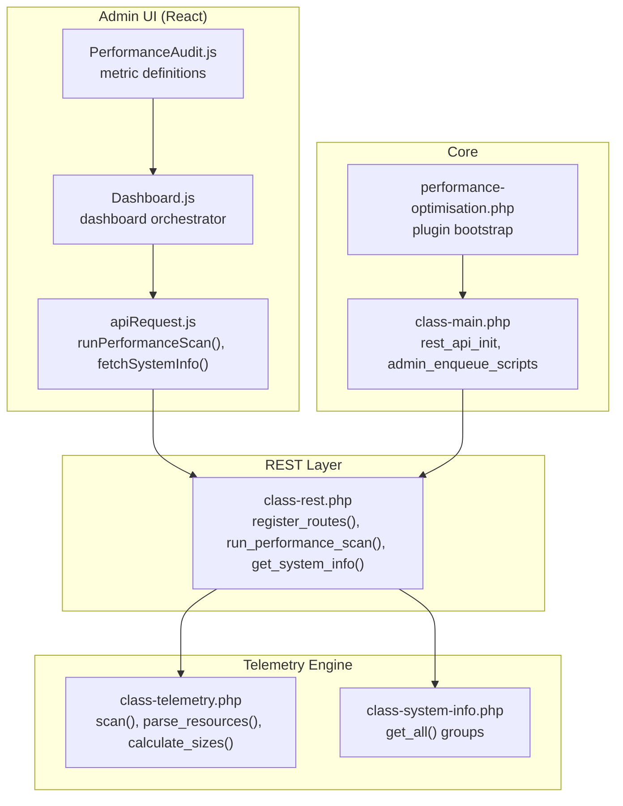
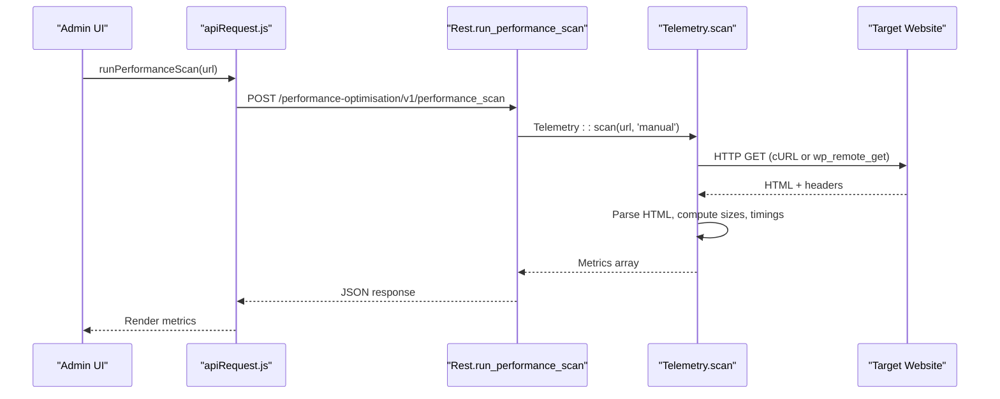
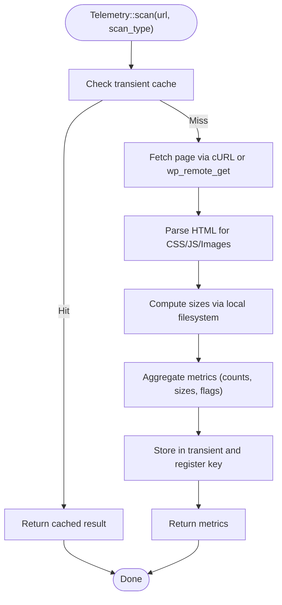
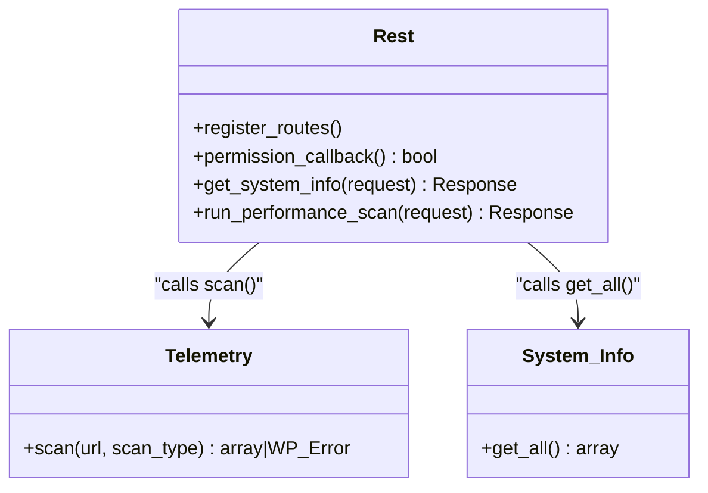
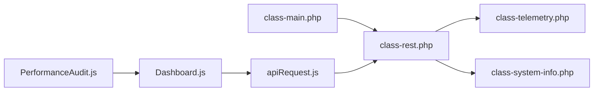

# Telemetry Data Collection

<cite>
**Referenced Files in This Document**
- [class-telemetry.php](file://includes/class-telemetry.php)
- [class-rest.php](file://includes/class-rest.php)
- [class-system-info.php](file://includes/class-system-info.php)
- [class-main.php](file://includes/class-main.php)
- [apiRequest.js](file://src/lib/apiRequest.js)
- [PerformanceAudit.js](file://src/components/PerformanceAudit.js)
- [Dashboard.js](file://src/components/Dashboard.js)
- [performance-optimisation.php](file://performance-optimisation.php)
- [readme.txt](file://readme.txt)
</cite>

## Table of Contents
1. [Introduction](#introduction)
2. [Project Structure](#project-structure)
3. [Core Components](#core-components)
4. [Architecture Overview](#architecture-overview)
5. [Detailed Component Analysis](#detailed-component-analysis)
6. [Dependency Analysis](#dependency-analysis)
7. [Performance Considerations](#performance-considerations)
8. [Privacy and Compliance](#privacy-and-compliance)
9. [Troubleshooting Guide](#troubleshooting-guide)
10. [Conclusion](#conclusion)

## Introduction
This document explains the telemetry and analytics data collection system implemented in the plugin. It focuses on how performance metrics are gathered locally, processed, and surfaced for diagnostics and optimization decisions. The system performs HTTP-based page analysis, extracts granular timing and resource metrics, and exposes them via a REST API for the admin dashboard. It also collects system-level environment information for diagnostics.

Key characteristics:
- Local-only telemetry: The plugin fetches and analyzes the target URL from the WordPress server.
- Structured metrics: Timing breakdowns (DNS, connect, SSL, TTFB), resource counts and sizes, compression and caching headers, and SEO/server signals.
- REST API exposure: Endpoints for running scans and retrieving system information.
- No remote data upload: All telemetry remains local to the WordPress site.

## Project Structure
The telemetry system spans PHP backend classes and a React-based admin UI:
- Backend: Telemetry scanning, REST route registration, and system information collection.
- Frontend: UI components and API utilities to trigger scans and display results.

**Diagram sources**
- [class-rest.php:30-123](file://includes/class-rest.php#L30-L123)
- [class-telemetry.php:31-192](file://includes/class-telemetry.php#L31-L192)
- [class-system-info.php:29-71](file://includes/class-system-info.php#L29-L71)
- [class-main.php:182-184](file://includes/class-main.php#L182-L184)
- [performance-optimisation.php:40-44](file://performance-optimisation.php#L40-L44)
- [apiRequest.js:1-53](file://src/lib/apiRequest.js#L1-L53)
- [Dashboard.js:1-44](file://src/components/Dashboard.js#L1-L44)
- [PerformanceAudit.js:26-66](file://src/components/PerformanceAudit.js#L26-L66)

**Section sources**
- [class-rest.php:30-123](file://includes/class-rest.php#L30-L123)
- [class-telemetry.php:31-192](file://includes/class-telemetry.php#L31-L192)
- [class-system-info.php:29-71](file://includes/class-system-info.php#L29-L71)
- [class-main.php:182-184](file://includes/class-main.php#L182-L184)
- [performance-optimisation.php:40-44](file://performance-optimisation.php#L40-L44)
- [apiRequest.js:1-53](file://src/lib/apiRequest.js#L1-L53)
- [Dashboard.js:1-44](file://src/components/Dashboard.js#L1-L44)
- [PerformanceAudit.js:26-66](file://src/components/PerformanceAudit.js#L26-L66)

## Core Components
- Telemetry scanner: Fetches a URL, parses HTML, computes granular timings and resource sizes, and returns a structured metrics array.
- REST endpoints: Exposes system info and performance scan capabilities with nonce-protected permissions.
- System info collector: Gathers PHP, DB, WordPress, server, and cache environment details.
- Frontend API utilities and components: Trigger scans, display metrics, and provide guidance.

Key responsibilities:
- Telemetry::scan: Orchestrates HTTP fetch (cURL or wp_remote_get), HTML parsing, resource sizing, and result aggregation.
- Rest::run_performance_scan: Validates input, invokes Telemetry::scan, and returns results.
- Rest::get_system_info: Returns environment diagnostics.
- Frontend: runPerformanceScan and fetchSystemInfo drive the UI.

**Section sources**
- [class-telemetry.php:31-192](file://includes/class-telemetry.php#L31-L192)
- [class-rest.php:794-819](file://includes/class-rest.php#L794-L819)
- [class-system-info.php:62-71](file://includes/class-system-info.php#L62-L71)
- [apiRequest.js:34-53](file://src/lib/apiRequest.js#L34-L53)

## Architecture Overview
The telemetry pipeline follows a clear request-response flow:
- Admin UI triggers a scan via runPerformanceScan.
- API request reaches REST route run_performance_scan.
- Telemetry::scan performs the analysis and returns metrics.
- UI renders metrics with guidance from PerformanceAudit.

**Diagram sources**
- [apiRequest.js:41-43](file://src/lib/apiRequest.js#L41-L43)
- [class-rest.php:804-819](file://includes/class-rest.php#L804-L819)
- [class-telemetry.php:45-192](file://includes/class-telemetry.php#L45-L192)

## Detailed Component Analysis

### Telemetry Scanner
Responsibilities:
- Fetch page content using cURL when available for granular timings and automatic decompression, with a wp_remote_get() fallback.
- Parse HTML to extract CSS, JS, and image resources; detect lazy-loading patterns.
- Compute sizes using local filesystem paths for local assets.
- Aggregate metrics including load time, TTFB, DNS/connect/SSL timings, resource counts and sizes, HTTPS, compression, cache headers, robots.txt presence, modern image formats, alt attributes, and scan type.

Processing logic highlights:
- cURL path: captures namelookup_time, connect_time, appconnect_time, starttransfer_time, total_time; computes DNS, connect, SSL, TTFB, total.
- Fallback path: measures load time via microtime and uses wp_remote_head for TTFB when cURL is unavailable.
- Resource parsing: uses WP_HTML_Tag_Processor on supported WordPress versions, with regex fallback.
- Size calculation: resolves URLs to local paths and sums file sizes; external assets return zero intentionally for Phase 1.
- Result caching: stores results in a transient keyed by the URL hash for one hour and registers the key for bulk deletion.

**Diagram sources**
- [class-telemetry.php:45-192](file://includes/class-telemetry.php#L45-L192)
- [class-telemetry.php:213-367](file://includes/class-telemetry.php#L213-L367)
- [class-telemetry.php:535-540](file://includes/class-telemetry.php#L535-L540)

**Section sources**
- [class-telemetry.php:45-192](file://includes/class-telemetry.php#L45-L192)
- [class-telemetry.php:213-367](file://includes/class-telemetry.php#L213-L367)
- [class-telemetry.php:535-540](file://includes/class-telemetry.php#L535-L540)

### REST Endpoints
Endpoints:
- GET /wp-json/performance-optimisation/v1/system_info: Returns system diagnostics (PHP, DB, WordPress, server, cache).
- POST /wp-json/performance-optimisation/v1/performance_scan: Runs a local telemetry scan for a given URL and returns metrics.

Permissions:
- Both endpoints require manage_options capability and a valid X-WP-Nonce header.

**Diagram sources**
- [class-rest.php:37-123](file://includes/class-rest.php#L37-L123)
- [class-rest.php:794-819](file://includes/class-rest.php#L794-L819)
- [class-telemetry.php:31-192](file://includes/class-telemetry.php#L31-L192)
- [class-system-info.php:62-71](file://includes/class-system-info.php#L62-L71)

**Section sources**
- [class-rest.php:37-123](file://includes/class-rest.php#L37-L123)
- [class-rest.php:794-819](file://includes/class-rest.php#L794-L819)
- [class-system-info.php:62-71](file://includes/class-system-info.php#L62-L71)

### System Information Collector
Collects environment details grouped as:
- PHP: version, SAPI, memory limits, execution time, upload/post sizes, display errors, extension count.
- Database: server version, extension class, client version, max_connections.
- WordPress: version, environment type, permalink structure, HTTPS usage, multisite.
- WordPress constants: WP_DEBUG, WP_CACHE, WP_MEMORY_LIMIT, WP_DEBUG_LOG, SCRIPT_DEBUG.
- Server: server software, OS and kernel, architecture.
- Cache: object cache status, active cache plugin, peak/current memory usage, WooCommerce presets.

**Section sources**
- [class-system-info.php:62-298](file://includes/class-system-info.php#L62-L298)

### Frontend Integration
- apiRequest.js: Provides runPerformanceScan and fetchSystemInfo helpers that attach the X-WP-Nonce header and return JSON responses.
- Dashboard.js: Orchestrates telemetry and system info retrieval and passes data to child components.
- PerformanceAudit.js: Defines metric descriptions and status thresholds for interpretation.

**Section sources**
- [apiRequest.js:1-53](file://src/lib/apiRequest.js#L1-L53)
- [Dashboard.js:1-44](file://src/components/Dashboard.js#L1-L44)
- [PerformanceAudit.js:26-66](file://src/components/PerformanceAudit.js#L26-L66)

## Dependency Analysis
- Telemetry depends on WordPress HTTP APIs (wp_remote_get/head), cURL when available, and HTML parsing utilities.
- REST layer depends on Telemetry and System_Info classes.
- Main class wires REST routes and enqueues admin scripts with localized API URLs and nonce.
- Frontend relies on WordPress REST base URL and nonce for authenticated requests.

**Diagram sources**
- [class-main.php:182-184](file://includes/class-main.php#L182-L184)
- [class-rest.php:37-123](file://includes/class-rest.php#L37-L123)
- [class-telemetry.php:31-192](file://includes/class-telemetry.php#L31-L192)
- [class-system-info.php:29-71](file://includes/class-system-info.php#L29-L71)
- [apiRequest.js:1-53](file://src/lib/apiRequest.js#L1-L53)
- [Dashboard.js:1-44](file://src/components/Dashboard.js#L1-L44)
- [PerformanceAudit.js:26-66](file://src/components/PerformanceAudit.js#L26-L66)

**Section sources**
- [class-main.php:182-184](file://includes/class-main.php#L182-L184)
- [class-rest.php:37-123](file://includes/class-rest.php#L37-L123)
- [class-telemetry.php:31-192](file://includes/class-telemetry.php#L31-L192)
- [class-system-info.php:29-71](file://includes/class-system-info.php#L29-L71)
- [apiRequest.js:1-53](file://src/lib/apiRequest.js#L1-L53)
- [Dashboard.js:1-44](file://src/components/Dashboard.js#L1-L44)
- [PerformanceAudit.js:26-66](file://src/components/PerformanceAudit.js#L26-L66)

## Performance Considerations
- HTTP fetch strategy:
  - cURL path provides granular timings and automatic decompression, minimizing post-processing overhead.
  - wp_remote_get() fallback ensures compatibility when cURL is unavailable.
- Local sizing:
  - Uses filesystem access for CSS/JS/images; external assets return zero, avoiding expensive HEAD requests.
- Caching:
  - Transient caching of scan results prevents repeated scans for the same URL within an hour.
  - Transient index registration supports bulk deletion for cleanup operations.
- Frontend responsiveness:
  - Nonce refresh via AJAX avoids stale nonce issues and improves reliability.

Recommendations:
- Prefer cURL availability for best timing accuracy.
- Use caching wisely; clear transients when significant site changes occur.
- Monitor transient index growth and prune as needed.

**Section sources**
- [class-telemetry.php:68-122](file://includes/class-telemetry.php#L68-L122)
- [class-telemetry.php:333-367](file://includes/class-telemetry.php#L333-L367)
- [class-telemetry.php:46-51](file://includes/class-telemetry.php#L46-L51)
- [class-telemetry.php:535-540](file://includes/class-telemetry.php#L535-L540)
- [class-main.php:475-484](file://includes/class-main.php#L475-L484)

## Privacy and Compliance
- Local-only telemetry: The plugin performs scans on the WordPress server against the target URL; no data is uploaded outside the site.
- Minimal data exposure: Metrics include timing, counts, sizes, and header flags; no content or cookies are transmitted.
- Authentication and authorization: REST endpoints require manage_options capability and a valid X-WP-Nonce header.
- Opt-out procedures: There is no explicit opt-out mechanism for telemetry in the current implementation. Users can avoid running scans or restrict access to administrative users.

Guidance:
- Restrict REST endpoint access to trusted administrators.
- Avoid scanning sensitive or private URLs.
- Review and adjust permissions as needed for shared hosting environments.

**Section sources**
- [class-rest.php:131-136](file://includes/class-rest.php#L131-L136)
- [class-rest.php:804-819](file://includes/class-rest.php#L804-L819)
- [class-telemetry.php:45-192](file://includes/class-telemetry.php#L45-L192)

## Troubleshooting Guide
Common issues and resolutions:
- HTTP fetch failures:
  - Verify cURL availability and PHP configuration.
  - Check wp_remote_get() fallback behavior and timeouts.
- Empty or zero sizes:
  - External/CDN assets return zero by design; confirm local filesystem paths for CSS/JS/images.
- Permission errors:
  - Ensure the user has manage_options and a valid nonce.
- Stale nonce:
  - Use the AJAX nonce refresh endpoint to obtain a fresh nonce.

Operational tips:
- Clear scan transients if results appear outdated.
- Validate robots.txt presence and cache-control headers for correctness.
- Confirm HTTPS usage and compression flags for optimal performance.

**Section sources**
- [class-telemetry.php:124-156](file://includes/class-telemetry.php#L124-L156)
- [class-telemetry.php:333-367](file://includes/class-telemetry.php#L333-L367)
- [class-rest.php:131-136](file://includes/class-rest.php#L131-L136)
- [class-main.php:771-781](file://includes/class-main.php#L771-L781)

## Conclusion
The telemetry system provides actionable, local performance insights without transmitting data externally. It combines granular network timings, resource analysis, and environment diagnostics to guide optimization decisions. By leveraging REST endpoints and a React-driven UI, it offers a safe, extensible foundation for performance auditing. Administrators can interpret metrics to improve load times, resource delivery, and server-side caching, while maintaining strict privacy boundaries.