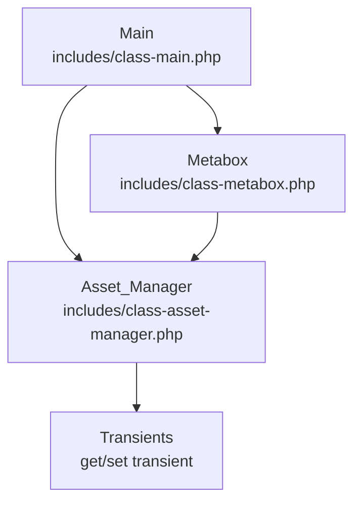
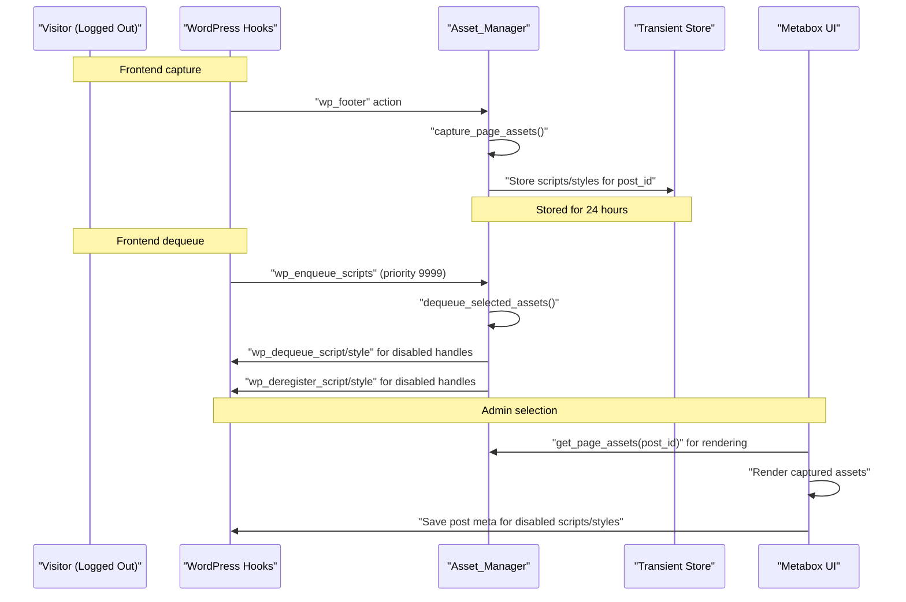
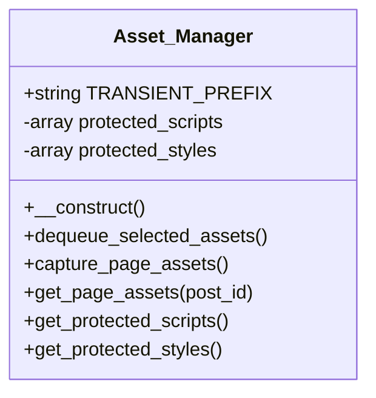
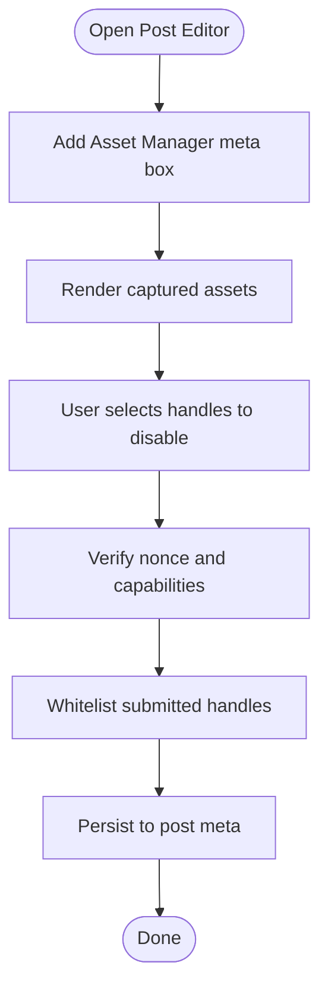
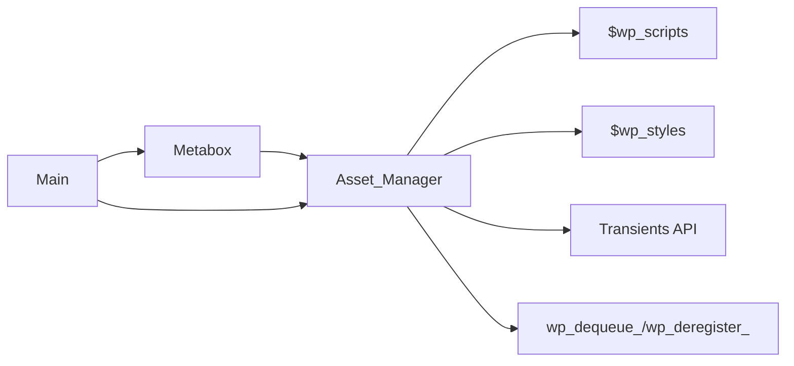

# Asset Manager

<cite>
**Referenced Files in This Document**
- [class-asset-manager.php](file://includes/class-asset-manager.php)
- [class-metabox.php](file://includes/class-metabox.php)
- [class-main.php](file://includes/class-main.php)
- [bolt.md](file://.jules/bolt.md)
</cite>

## Table of Contents
1. [Introduction](#introduction)
2. [Project Structure](#project-structure)
3. [Core Components](#core-components)
4. [Architecture Overview](#architecture-overview)
5. [Detailed Component Analysis](#detailed-component-analysis)
6. [Dependency Analysis](#dependency-analysis)
7. [Performance Considerations](#performance-considerations)
8. [Troubleshooting Guide](#troubleshooting-guide)
9. [Conclusion](#conclusion)

## Introduction
This document explains the asset manager system that controls which scripts and styles are loaded on a per-page/post basis. It covers:
- Per-page/post control for selective asset disabling
- Asset capture and storage using transients for admin meta box functionality
- Protected assets that prevent deregistration of core WordPress scripts and styles
- Dequeueing process, dependency management, and conflict resolution strategies
- Practical workflows, troubleshooting steps, and best practices

## Project Structure
The asset manager is implemented as a dedicated class that integrates with WordPress hooks and is orchestrated by the main plugin class. The admin meta box renders captured assets and persists user selections.

**Diagram sources**
- [class-main.php:226-228](file://includes/class-main.php#L226-L228)
- [class-asset-manager.php:76-82](file://includes/class-asset-manager.php#L76-L82)
- [class-metabox.php:37-42](file://includes/class-metabox.php#L37-L42)

**Section sources**
- [class-main.php:118-144](file://includes/class-main.php#L118-L144)
- [class-asset-manager.php:27-82](file://includes/class-asset-manager.php#L27-L82)
- [class-metabox.php:30-74](file://includes/class-metabox.php#L30-L74)

## Core Components
- Asset_Manager: Captures enqueued assets on the frontend and dequeues disabled assets on the same page. It defines protected core WordPress handles that cannot be removed.
- Metabox: Adds an “Asset Manager” meta box to post editor screens, displays captured assets, and saves user-selected handles to disable.
- Main: Instantiates Asset_Manager and Metabox, and orchestrates plugin-wide hooks.

Key responsibilities:
- Capture assets in transient keyed by post ID
- Dequeue disabled assets on frontend for logged-out visitors
- Protect core WordPress scripts/styles from removal
- Whitelist submitted handles against the canonical list of captured assets

**Section sources**
- [class-asset-manager.php:27-224](file://includes/class-asset-manager.php#L27-L224)
- [class-metabox.php:30-332](file://includes/class-metabox.php#L30-L332)
- [class-main.php:226-228](file://includes/class-main.php#L226-L228)

## Architecture Overview
The asset manager operates on two complementary hooks:
- wp_footer: captures all enqueued scripts/styles and stores them in a transient
- wp_enqueue_scripts (very late): dequeues user-disabled assets for the current page/post

Protected assets are enforced by checking against predefined lists before deregistering.

**Diagram sources**
- [class-asset-manager.php:76-82](file://includes/class-asset-manager.php#L76-L82)
- [class-asset-manager.php:131-191](file://includes/class-asset-manager.php#L131-L191)
- [class-asset-manager.php:91-121](file://includes/class-asset-manager.php#L91-L121)
- [class-metabox.php:105-236](file://includes/class-metabox.php#L105-L236)

## Detailed Component Analysis

### Asset_Manager
Responsibilities:
- Capture enqueued assets on the frontend and store them in a transient keyed by post ID
- Dequeue and deregister assets disabled by the user for the current page/post
- Enforce protected assets lists for scripts and styles
- Expose protected lists and captured assets retrieval

Implementation highlights:
- Transient key prefix ensures per-page isolation
- Late priority on dequeue hook avoids conflicts with other plugins
- Comparison logic prevents unnecessary transient writes
- Protected lists guard core WordPress handles

**Diagram sources**
- [class-asset-manager.php:27-224](file://includes/class-asset-manager.php#L27-L224)

**Section sources**
- [class-asset-manager.php:27-82](file://includes/class-asset-manager.php#L27-L82)
- [class-asset-manager.php:91-121](file://includes/class-asset-manager.php#L91-L121)
- [class-asset-manager.php:131-191](file://includes/class-asset-manager.php#L131-L191)
- [class-asset-manager.php:193-224](file://includes/class-asset-manager.php#L193-L224)

### Metabox
Responsibilities:
- Add an “Asset Manager” meta box to post editor screens
- Render captured assets with checkboxes to disable
- Save user selections to post meta, whitelisted against captured assets
- Display helpful messaging when assets are not yet captured

Key behaviors:
- Nonce verification and capability checks
- Whitelisting of submitted handles against the canonical list
- Protected assets visually indicated and disabled in UI

**Diagram sources**
- [class-metabox.php:49-74](file://includes/class-metabox.php#L49-L74)
- [class-metabox.php:105-236](file://includes/class-metabox.php#L105-L236)
- [class-metabox.php:291-329](file://includes/class-metabox.php#L291-L329)

**Section sources**
- [class-metabox.php:30-74](file://includes/class-metabox.php#L30-L74)
- [class-metabox.php:105-236](file://includes/class-metabox.php#L105-L236)
- [class-metabox.php:291-329](file://includes/class-metabox.php#L291-L329)

### Main Integration
The main class instantiates Asset_Manager and Metabox, ensuring the asset manager is active on both frontend and admin contexts.

**Section sources**
- [class-main.php:136-144](file://includes/class-main.php#L136-L144)
- [class-main.php:226-228](file://includes/class-main.php#L226-L228)

## Dependency Analysis
- Asset_Manager depends on WordPress global objects ($wp_scripts, $wp_styles) to enumerate enqueued assets.
- Asset_Manager relies on WordPress transients API to persist captured assets per post.
- Asset_Manager interacts with WordPress enqueue/deregister APIs to remove unwanted assets.
- Metabox depends on Asset_Manager’s static methods to retrieve captured assets and protected lists.
- Main orchestrates instantiation of both classes and registers plugin hooks.

Potential coupling and cohesion:
- Asset_Manager encapsulates capture/dequeue logic, minimizing coupling to other subsystems.
- Metabox delegates asset retrieval and protection decisions to Asset_Manager, keeping UI logic focused.

External dependencies:
- WordPress core hooks and APIs
- Transients for persistence

**Diagram sources**
- [class-asset-manager.php:141-191](file://includes/class-asset-manager.php#L141-L191)
- [class-metabox.php:118-121](file://includes/class-metabox.php#L118-L121)
- [class-main.php:226-228](file://includes/class-main.php#L226-L228)

**Section sources**
- [class-asset-manager.php:141-191](file://includes/class-asset-manager.php#L141-L191)
- [class-metabox.php:118-121](file://includes/class-metabox.php#L118-L121)
- [class-main.php:226-228](file://includes/class-main.php#L226-L228)

## Performance Considerations
- Transient writes: The asset capture routine should avoid unnecessary writes by comparing with existing transient values. The project’s internal notes highlight that unconditional transient writes cause significant database overhead and should be avoided.
- Priority and timing: Dequeueing occurs at a very late priority to minimize conflicts with other plugins’ enqueue logic.
- Protected assets: Prevents accidental removal of core scripts/styles, reducing runtime errors and re-enqueue attempts.

Best practices derived from the code and project notes:
- Only write transients when captured assets have changed
- Dequeue late to avoid conflicts
- Protect core WordPress handles to prevent instability

**Section sources**
- [.jules/bolt.md:16-19](file://.jules/bolt.md#L16-L19)
- [class-asset-manager.php:76-82](file://includes/class-asset-manager.php#L76-L82)
- [class-asset-manager.php:187-191](file://includes/class-asset-manager.php#L187-L191)

## Troubleshooting Guide
Common issues and resolutions:
- Assets not captured
  - Ensure the page/post was visited while logged out so capture runs in the frontend context.
  - Verify that the transient for the post ID contains scripts/styles.
  - If not captured, visit the page again to refresh the transient.

- Disabled assets still loading
  - Confirm the user is not logged in; dequeue logic intentionally skips logged-in users.
  - Check that the selected handles are present in the captured list for the current page/post.
  - Verify that the handles were whitelisted during save and persisted to post meta.

- Protected assets removed unexpectedly
  - Protected handles are intentionally excluded from removal. If a protected asset disappears, inspect the protected lists and confirm the handle is included.

- Conflicts with other plugins
  - Dequeue runs at a very late priority to minimize conflicts. If issues arise, review other plugins’ enqueue priorities and adjust accordingly.

- Transient write overhead
  - Ensure the transient comparison logic is used to avoid unnecessary writes.

**Section sources**
- [class-asset-manager.php:91-121](file://includes/class-asset-manager.php#L91-L121)
- [class-asset-manager.php:131-191](file://includes/class-asset-manager.php#L131-L191)
- [class-metabox.php:118-121](file://includes/class-metabox.php#L118-L121)
- [.jules/bolt.md:16-19](file://.jules/bolt.md#L16-L19)

## Conclusion
The asset manager provides a robust, per-page/post mechanism to selectively disable scripts and styles. By capturing assets on the frontend and storing them in transients, it enables precise control through the admin meta box. Protected assets safeguard core WordPress functionality, while late-priority dequeueing minimizes conflicts. Following the best practices—avoiding unnecessary transient writes, verifying captured assets, and respecting protected handles—ensures reliable performance and stability.