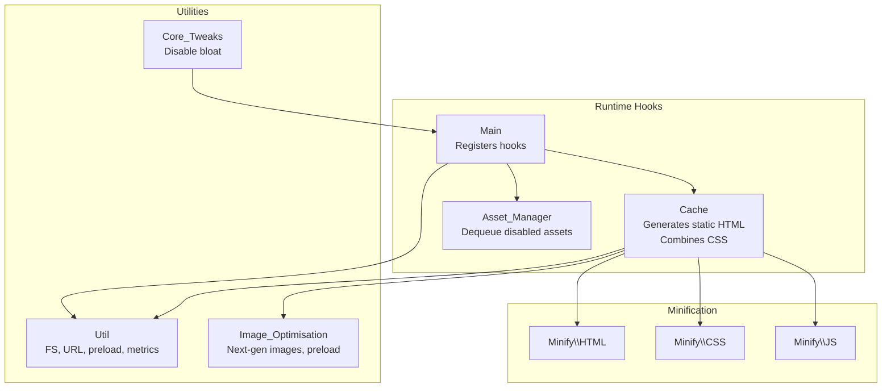
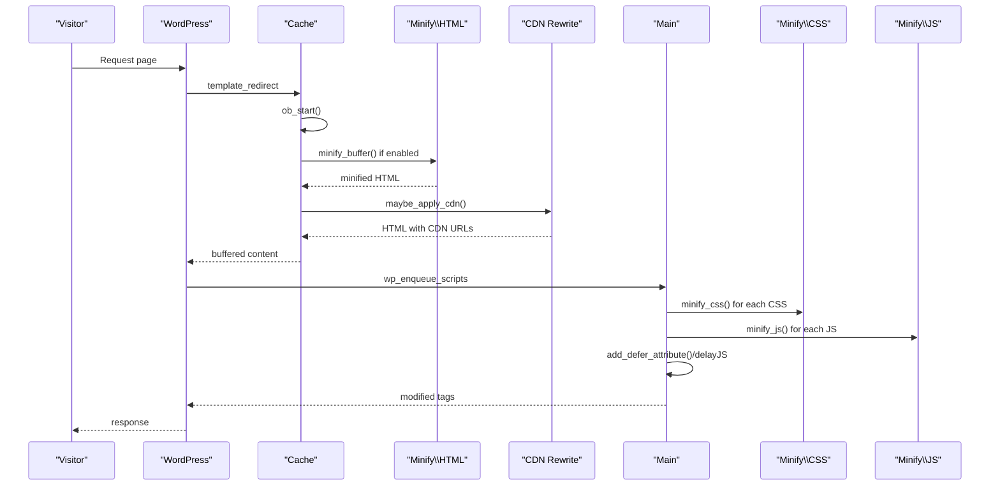
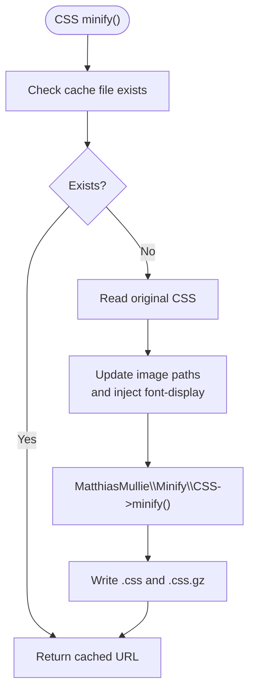
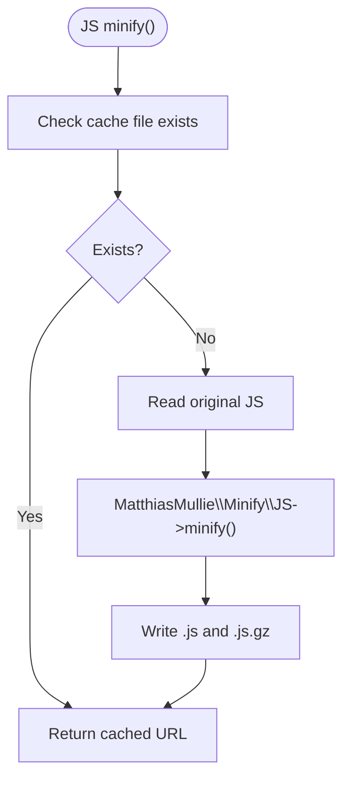
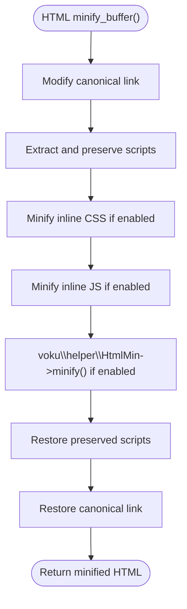
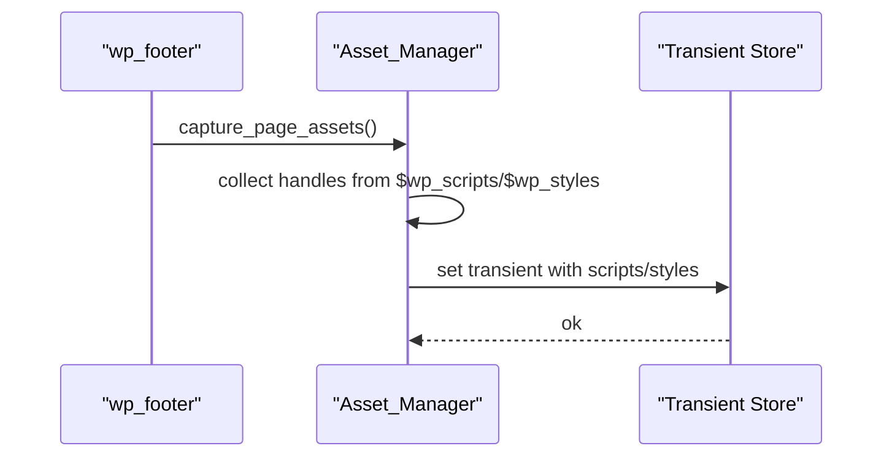
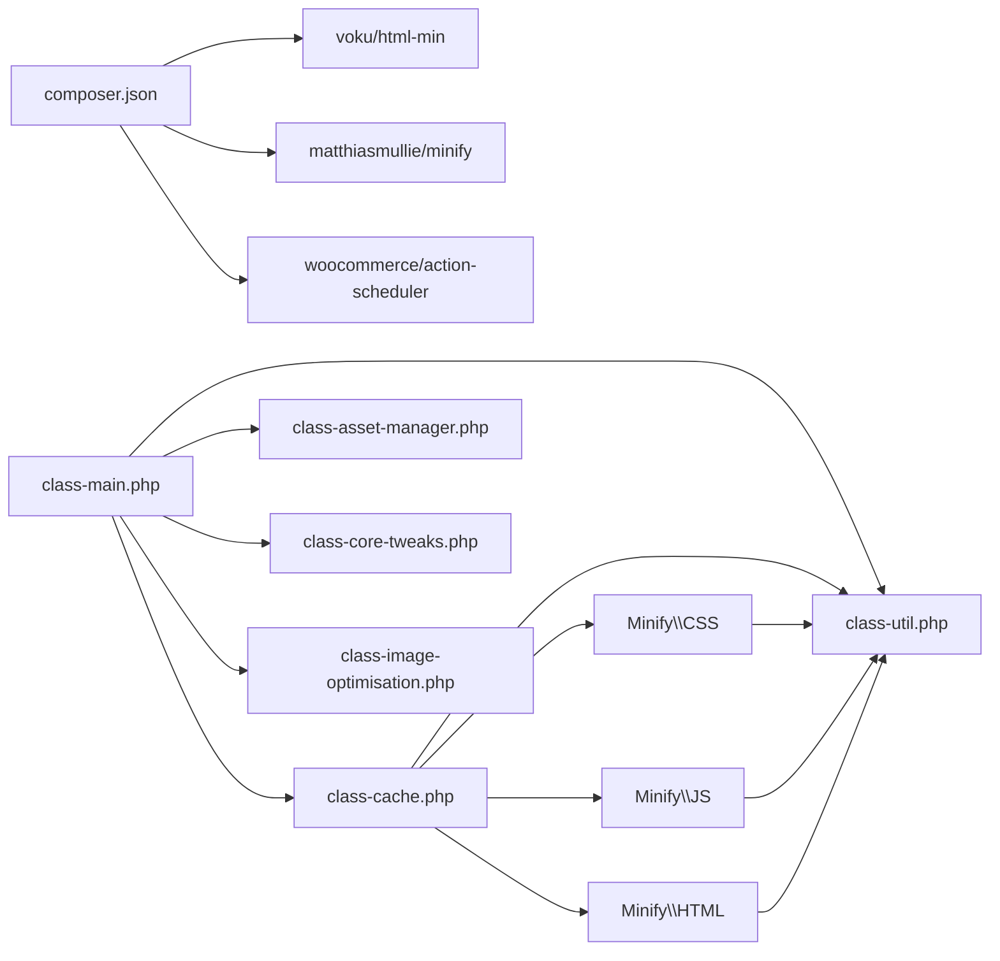

# Asset Optimization

<cite>
**Referenced Files in This Document**
- [performance-optimisation.php](file://performance-optimisation.php)
- [class-main.php](file://includes/class-main.php)
- [class-cache.php](file://includes/class-cache.php)
- [class-asset-manager.php](file://includes/class-asset-manager.php)
- [class-util.php](file://includes/class-util.php)
- [class-core-tweaks.php](file://includes/class-core-tweaks.php)
- [class-image-optimisation.php](file://includes/class-image-optimisation.php)
- [class-html.php](file://includes/minify/class-html.php)
- [class-css.php](file://includes/minify/class-css.php)
- [class-js.php](file://includes/minify/class-js.php)
- [composer.json](file://composer.json)
- [package.json](file://package.json)
- [FileOptimization.js](file://src/components/FileOptimization.js)
</cite>

## Table of Contents
1. [Introduction](#introduction)
2. [Project Structure](#project-structure)
3. [Core Components](#core-components)
4. [Architecture Overview](#architecture-overview)
5. [Detailed Component Analysis](#detailed-component-analysis)
6. [Dependency Analysis](#dependency-analysis)
7. [Performance Considerations](#performance-considerations)
8. [Troubleshooting Guide](#troubleshooting-guide)
9. [Conclusion](#conclusion)
10. [Appendices](#appendices)

## Introduction
This document explains the asset optimization system implemented by the plugin. It covers CSS minification and combination, JavaScript optimization, HTML minification, and the coordination role of the asset manager. It also documents the minification algorithms used, configuration options for different optimization levels, custom exclusion rules, performance monitoring, examples of optimized asset delivery, and troubleshooting common issues.

## Project Structure
The plugin organizes asset optimization logic across several core classes:
- Main orchestrator registers hooks and wires optimization features.
- Cache handles dynamic static HTML generation, minification pass, and combined CSS.
- Asset Manager controls per-page asset selection and protection of core assets.
- Minifiers encapsulate CSS, JS, and HTML minification logic.
- Utilities provide shared helpers for filesystem, URL processing, and metrics.
- Core Tweaks disables unnecessary WordPress features to reduce bloat.
- Image Optimization integrates next-gen image formats and preloading.

**Diagram sources**
- [class-main.php:164-241](file://includes/class-main.php#L164-L241)
- [class-cache.php:127-223](file://includes/class-cache.php#L127-L223)
- [class-asset-manager.php:76-121](file://includes/class-asset-manager.php#L76-L121)
- [class-html.php:64-143](file://includes/minify/class-html.php#L64-L143)
- [class-css.php:51-106](file://includes/minify/class-css.php#L51-L106)
- [class-js.php:60-99](file://includes/minify/class-js.php#L60-L99)
- [class-util.php:38-149](file://includes/class-util.php#L38-L149)
- [class-core-tweaks.php:32-56](file://includes/class-core-tweaks.php#L32-L56)
- [class-image-optimisation.php:95-208](file://includes/class-image-optimisation.php#L95-L208)

**Section sources**
- [performance-optimisation.php:26-44](file://performance-optimisation.php#L26-L44)
- [composer.json:11-15](file://composer.json#L11-L15)
- [package.json:7-13](file://package.json#L7-L13)

## Core Components
- Main orchestrator: Reads settings, registers filters/actions, coordinates minification and deferral/delay, and manages exclusions.
- Cache: Implements dynamic static HTML generation, optional HTML minification pass, combined CSS, and CDN rewriting.
- Asset Manager: Captures enqueued assets and dequeues disabled ones on the frontend, protecting core handles.
- Minify classes: Provide minification for CSS, JS, and inline parts of HTML using dedicated libraries.
- Utilities: Provide filesystem preparation, URL normalization, preload link generation, and metrics.
- Core Tweaks: Disables emoji, embeds, dashicons on frontend, XML-RPC, and controls heartbeat frequency.
- Image Optimization: Serves next-gen images (WebP/AVIF), preloads images, and lazily loads images.

**Section sources**
- [class-main.php:98-241](file://includes/class-main.php#L98-L241)
- [class-cache.php:94-223](file://includes/class-cache.php#L94-L223)
- [class-asset-manager.php:76-222](file://includes/class-asset-manager.php#L76-L222)
- [class-html.php:64-370](file://includes/minify/class-html.php#L64-L370)
- [class-css.php:51-191](file://includes/minify/class-css.php#L51-L191)
- [class-js.php:60-131](file://includes/minify/class-js.php#L60-L131)
- [class-util.php:38-248](file://includes/class-util.php#L38-L248)
- [class-core-tweaks.php:32-192](file://includes/class-core-tweaks.php#L32-L192)
- [class-image-optimisation.php:95-290](file://includes/class-image-optimisation.php#L95-L290)

## Architecture Overview
The system operates primarily during the request lifecycle:
- On template_redirect, Cache starts buffering and optionally minifies HTML and applies CDN rewriting.
- During wp_enqueue_scripts, Main injects minification and deferral/delay logic for CSS/JS and combines CSS when enabled.
- Asset_Manager runs late to dequeue disabled assets and protect core handles.
- Utilities provide shared infrastructure for filesystem operations and metrics.

**Diagram sources**
- [class-cache.php:260-310](file://includes/class-cache.php#L260-L310)
- [class-cache.php:391-396](file://includes/class-cache.php#L391-L396)
- [class-cache.php:325-381](file://includes/class-cache.php#L325-L381)
- [class-main.php:175-241](file://includes/class-main.php#L175-L241)
- [class-main.php:1006-1055](file://includes/class-main.php#L1006-L1055)
- [class-main.php:894-917](file://includes/class-main.php#L894-L917)

## Detailed Component Analysis

### CSS Minification and Combination
- Minification: CSS class reads the original file, updates image paths, injects font-display: swap into @font-face declarations, minifies via MatthiasMullie, and writes both the minified file and a gzipped variant to the cache directory. It returns the content URL of the cached file.
- Combination: Cache collects all queued CSS, filters by media=all and excludes configured URLs/handles, concatenates, normalizes font-display, minifies, writes combined CSS, enqueues it, and emits a preload link for the combined file.

**Diagram sources**
- [class-css.php:63-106](file://includes/minify/class-css.php#L63-L106)
- [class-css.php:143-190](file://includes/minify/class-css.php#L143-L190)

**Section sources**
- [class-css.php:51-191](file://includes/minify/class-css.php#L51-L191)
- [class-cache.php:127-223](file://includes/class-cache.php#L127-L223)

### JavaScript Optimization
- Minification: JS class reads the original file, minifies via MatthiasMullie, and writes both the minified file and a gzipped variant to the cache directory. It returns the content URL of the cached file.
- Deferral/Delay: Main adds defer attribute to eligible scripts and transforms inline script types and attributes for delayed execution, with configurable exclusions.

**Diagram sources**
- [class-js.php:74-99](file://includes/minify/class-js.php#L74-L99)

**Section sources**
- [class-js.php:60-131](file://includes/minify/class-js.php#L60-L131)
- [class-main.php:894-917](file://includes/class-main.php#L894-L917)
- [class-main.php:1036-1055](file://includes/class-main.php#L1036-L1055)

### HTML Minification Strategies
- HTML minification: Uses voku/html-min to remove comments, whitespace, redundant attributes, and optimize tags. Canonical links are temporarily rewritten to preserve SEO.
- Inline CSS/JS minification: Extracts and minifies inline <style> and <script> content when enabled, preserving JSON-LD and module/importmap types.
- Delayed JS: Optionally transforms script type and attributes to delay execution for eligible scripts, with exclusion lists.

**Diagram sources**
- [class-cache.php:287-310](file://includes/class-cache.php#L287-L310)
- [class-html.php:116-143](file://includes/minify/class-html.php#L116-L143)
- [class-html.php:171-195](file://includes/minify/class-html.php#L171-L195)
- [class-html.php:239-255](file://includes/minify/class-html.php#L239-L255)
- [class-html.php:264-342](file://includes/minify/class-html.php#L264-L342)

**Section sources**
- [class-html.php:64-370](file://includes/minify/class-html.php#L64-L370)
- [class-cache.php:391-396](file://includes/class-cache.php#L391-L396)

### Asset Manager Coordination
- Captures enqueued scripts/styles on the frontend and stores them transiently for admin UI.
- Dequeues disabled assets for the current post, respecting protected core handles for scripts/styles.
- Provides APIs to retrieve protected handles and captured assets.

**Diagram sources**
- [class-asset-manager.php:131-191](file://includes/class-asset-manager.php#L131-L191)

**Section sources**
- [class-asset-manager.php:76-121](file://includes/class-asset-manager.php#L76-L121)
- [class-asset-manager.php:131-222](file://includes/class-asset-manager.php#L131-L222)

### Minification Algorithms and Impact
- CSS: MatthiasMullie Minify removes comments, whitespace, unused selectors, and optimizes values. Font-display injection improves font rendering performance.
- JS: MatthiasMullie Minify performs dead-code elimination and whitespace removal.
- HTML: voku/html-min removes comments, collapses whitespace, optimizes attributes, and removes redundant markup. Inline CSS/JS minification further reduces payload.
- Combined CSS: Concatenation reduces HTTP requests; minification reduces size; preload hints improve perceived performance.

Impact on performance:
- Reduced payload sizes lead to lower bandwidth usage and faster parse/execute times.
- Combined CSS reduces round-trips; deferred/delayed JS improves render-blocking mitigation.
- CDN rewriting and next-gen images reduce transfer sizes and leverage modern codecs.

**Section sources**
- [composer.json:12-13](file://composer.json#L12-L13)
- [class-css.php:92-93](file://includes/minify/class-css.php#L92-L93)
- [class-js.php:85-86](file://includes/minify/class-js.php#L85-L86)
- [class-cache.php:209-210](file://includes/class-cache.php#L209-L210)

### Configuration Options and Exclusions
Key settings exposed in the admin UI and wired by Main:
- Enable/disable minification for JS/CSS/HTML, inline CSS/JS, and HTML minification.
- Exclude specific JS/CSS handles/URLs from minification and deferral/delay.
- Combine CSS and exclude specific CSS handles/URLs.
- Defer/Delay JS with exclusion lists.
- Remove WooCommerce CSS/JS on non-store pages with URL/handle exceptions.
- Enable server rules (.htaccess) and configure CDN URL.
- Core tweaks: disable emojis/embeds/dashicons/XML-RPC and control heartbeat.

These are read from the settings option and applied via filters and actions.

**Section sources**
- [FileOptimization.js:22-46](file://src/components/FileOptimization.js#L22-L46)
- [class-main.php:164-241](file://includes/class-main.php#L164-L241)
- [class-main.php:185-222](file://includes/class-main.php#L185-L222)
- [class-main.php:786-835](file://includes/class-main.php#L786-L835)

### Performance Monitoring
- Metrics exposed to the admin UI include counts of minified JS/CSS files and cache size.
- Utilities provide counting of minified files and directory size calculation.
- Transients cache totals to avoid frequent filesystem scans.

**Section sources**
- [class-util.php:118-149](file://includes/class-util.php#L118-L149)
- [class-cache.php:711-726](file://includes/class-cache.php#L711-L726)
- [class-main.php:463-474](file://includes/class-main.php#L463-L474)

### Examples of Optimized Asset Delivery
- Minified CSS: A CSS file is transformed into a hashed-named file in the cache directory, served with a version parameter derived from file modification time, and gzipped for transport.
- Minified JS: Similar caching and versioning strategy for JS files.
- Combined CSS: All eligible enqueued CSS is concatenated, minified, cached, and enqueued as a single stylesheet with a preload hint.
- Deferred/Delayed JS: Script tags receive defer or type transformations; inline scripts are optionally delayed with exclusions.

**Section sources**
- [class-css.php:108-133](file://includes/minify/class-css.php#L108-L133)
- [class-js.php:113-129](file://includes/minify/class-js.php#L113-L129)
- [class-cache.php:213-222](file://includes/class-cache.php#L213-L222)
- [class-main.php:1013-1024](file://includes/class-main.php#L1013-L1024)
- [class-main.php:1043-1054](file://includes/class-main.php#L1043-L1054)
- [class-main.php:894-917](file://includes/class-main.php#L894-L917)

## Dependency Analysis
External libraries:
- voku/html-min: HTML minification.
- matthiasmullie/minify: CSS/JS minification.
- woocommerce/action-scheduler: Background processing for image conversions.

Internal dependencies:
- Main depends on Cache, Minify classes, Util, and Asset_Manager.
- Cache depends on Minify\CSS and Util.
- Minify classes depend on Util for filesystem operations.
- Image_Optimisation integrates with Img_Converter and Util.

**Diagram sources**
- [composer.json:11-15](file://composer.json#L11-L15)
- [class-main.php:128-144](file://includes/class-main.php#L128-L144)
- [class-cache.php:16-18](file://includes/class-cache.php#L16-L18)

**Section sources**
- [composer.json:11-15](file://composer.json#L11-L15)
- [class-main.php:128-144](file://includes/class-main.php#L128-L144)

## Performance Considerations
- Prefer combining CSS for pages with many small stylesheets to reduce HTTP requests.
- Use minification judiciously; extremely small files may not benefit and could increase CPU cost.
- Leverage deferred and delayed JS for non-critical scripts to improve time-to-interactive.
- Enable CDN rewriting for wp-content and wp-includes assets to reduce origin load.
- Monitor cache size and minified file counts to assess effectiveness.
- Use exclusion lists to preserve compatibility for third-party scripts requiring immediate execution.

[No sources needed since this section provides general guidance]

## Troubleshooting Guide
Common issues and resolutions:
- Minification not applied:
  - Verify settings for minifyJS/minifyCSS/minifyHTML are enabled.
  - Check exclusions for handles/URLs that may bypass minification.
  - Ensure logged-in users are excluded from minification by design.
- Combined CSS not loading:
  - Confirm combineCSS is enabled and excluded handles/URLs are correct.
  - Inspect network panel for 404s on combined CSS file.
- Deferred/Delayed JS breaking functionality:
  - Add problematic scripts to the exclusion lists for defer/delay.
  - Validate inline scripts are not JSON-LD or module/importmap types.
- CDN rewriting not taking effect:
  - Confirm cdnURL is set and WP_HTML_Tag_Processor is available.
  - Check that asset URLs originate from the site’s content directory.
- Protected assets removed:
  - Review protected script/style handles and avoid disabling core handles.
- Cache not updating:
  - Clear plugin cache via admin UI or programmatically.
  - Trigger invalidation on content changes.

**Section sources**
- [class-main.php:185-222](file://includes/class-main.php#L185-L222)
- [class-main.php:894-917](file://includes/class-main.php#L894-L917)
- [class-cache.php:325-381](file://includes/class-cache.php#L325-L381)
- [class-asset-manager.php:44-67](file://includes/class-asset-manager.php#L44-L67)
- [class-cache.php:647-702](file://includes/class-cache.php#L647-L702)

## Conclusion
The plugin provides a robust, layered asset optimization pipeline: HTML minification, CSS/JS minification, combined CSS, deferred/delayed JS, CDN rewriting, and next-gen image serving. Its configuration model allows precise control over optimization behavior, while built-in exclusions and protections help maintain compatibility. Monitoring metrics enable ongoing evaluation of performance gains.

[No sources needed since this section summarizes without analyzing specific files]

## Appendices

### Configuration Options Reference
- file_optimisation.minifyJS/excludeJS
- file_optimisation.minifyCSS/excludeCSS
- file_optimisation.combineCSS/excludeCombineCSS
- file_optimisation.minifyHTML/minifyInlineCSS/minifyInlineJS
- file_optimisation.deferJS/excludeDeferJS
- file_optimisation.delayJS/excludeDelayJS
- file_optimisation.removeWooCSSJS/excludeUrlToKeepJSCSS/removeCssJsHandle
- file_optimisation.enableServerRules/cdnURL
- Core tweaks: disableEmojis/disableEmbeds/disableDashicons/disableXMLRPC/heartbeatControl

**Section sources**
- [FileOptimization.js:22-46](file://src/components/FileOptimization.js#L22-L46)
- [class-main.php:164-241](file://includes/class-main.php#L164-L241)