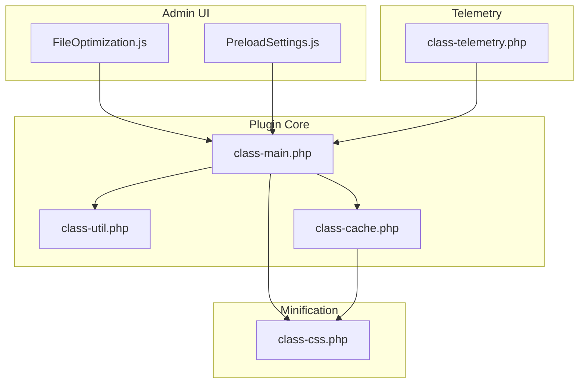
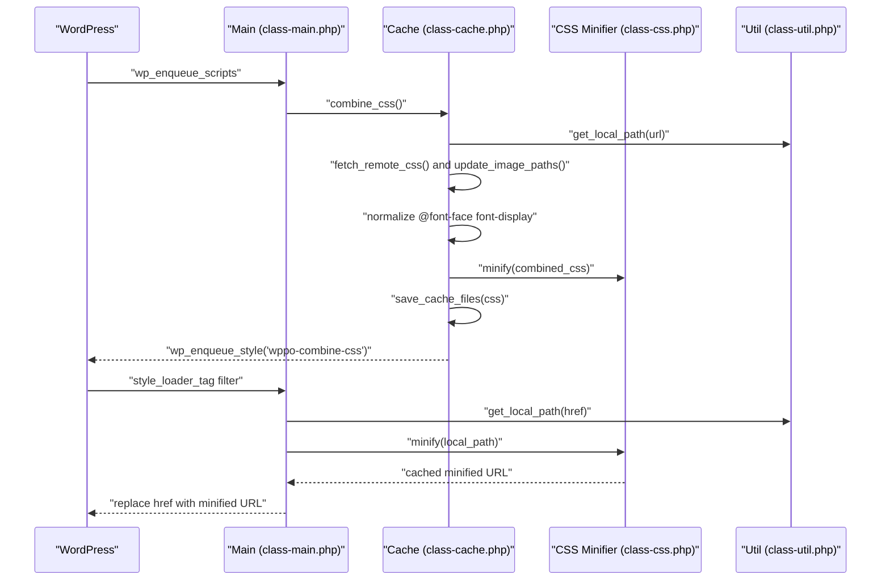
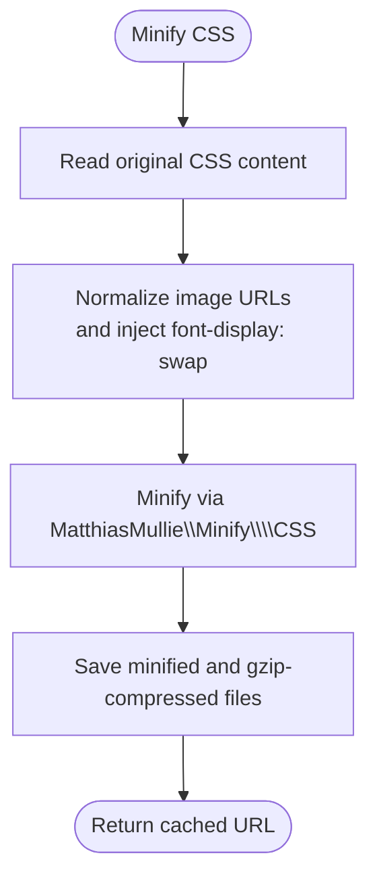
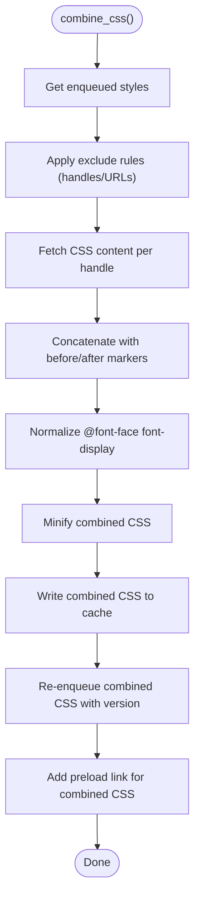
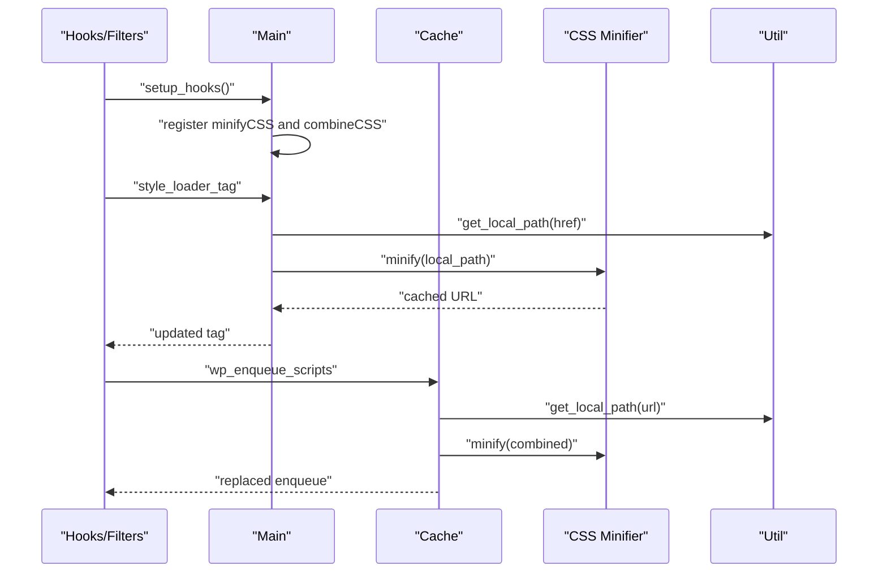
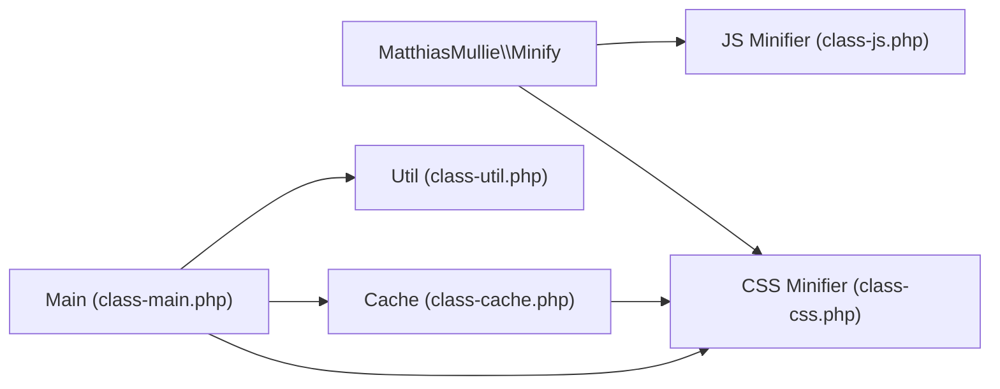

# CSS Optimization

<cite>
**Referenced Files in This Document**
- [class-css.php](file://includes/minify/class-css.php)
- [class-main.php](file://includes/class-main.php)
- [class-cache.php](file://includes/class-cache.php)
- [class-util.php](file://includes/class-util.php)
- [FileOptimization.js](file://src/components/FileOptimization.js)
- [PreloadSettings.js](file://src/components/PreloadSettings.js)
- [PerformanceAudit.js](file://src/components/PerformanceAudit.js)
- [class-telemetry.php](file://includes/class-telemetry.php)
- [composer.lock](file://composer.lock)
</cite>

## Table of Contents
1. [Introduction](#introduction)
2. [Project Structure](#project-structure)
3. [Core Components](#core-components)
4. [Architecture Overview](#architecture-overview)
5. [Detailed Component Analysis](#detailed-component-analysis)
6. [Dependency Analysis](#dependency-analysis)
7. [Performance Considerations](#performance-considerations)
8. [Troubleshooting Guide](#troubleshooting-guide)
9. [Conclusion](#conclusion)
10. [Appendices](#appendices)

## Introduction
This document explains the CSS optimization capabilities implemented in the plugin. It covers the CSS minification algorithm, combining strategies to reduce HTTP requests, the CSS processing pipeline (including image path updates and font-display enhancements), configuration options for different optimization levels, critical CSS preloading, and performance measurement. It also provides guidance for troubleshooting common minification issues such as selector conflicts and specificity problems.

## Project Structure
The CSS optimization features are implemented across several core files:
- Minification: dedicated CSS minifier class
- Pipeline orchestration: main plugin class wiring hooks and filters
- Combining: cache class aggregates and serves combined CSS
- Utilities: shared helpers for filesystem, paths, and preload generation
- Admin UI: configuration screens for enabling and excluding optimizations
- Telemetry: performance measurement and reporting

**Diagram sources**
- [class-main.php:167-244](file://includes/class-main.php#L167-L244)
- [class-css.php:23-106](file://includes/minify/class-css.php#L23-L106)
- [class-cache.php:127-223](file://includes/class-cache.php#L127-L223)
- [class-util.php:29-200](file://includes/class-util.php#L29-L200)
- [FileOptimization.js:19-90](file://src/components/FileOptimization.js#L19-L90)
- [PreloadSettings.js:15-282](file://src/components/PreloadSettings.js#L15-L282)
- [class-telemetry.php:46-200](file://includes/class-telemetry.php#L46-L200)

**Section sources**
- [class-main.php:128-157](file://includes/class-main.php#L128-L157)
- [class-css.php:23-106](file://includes/minify/class-css.php#L23-L106)
- [class-cache.php:127-223](file://includes/class-cache.php#L127-L223)
- [class-util.php:29-200](file://includes/class-util.php#L29-L200)
- [FileOptimization.js:19-90](file://src/components/FileOptimization.js#L19-L90)
- [PreloadSettings.js:15-282](file://src/components/PreloadSettings.js#L15-L282)
- [class-telemetry.php:46-200](file://includes/class-telemetry.php#L46-L200)

## Core Components
- CSS Minifier: reads a CSS file, updates image URLs, injects font-display: swap for @font-face blocks, minifies via MatthiasMullie\Minify\CSS, and writes cached files with gzip.
- CSS Link Rewriter: filters style_loader_tag to replace original CSS URLs with minified cached URLs when eligible.
- CSS Combine: collects enqueued stylesheets, optionally excludes selected handles/URLs, concatenates, normalizes font-display, minifies, saves a combined file, re-enqueues it, and adds a preload hint.
- Utilities: filesystem preparation, URL-to-path resolution, cache directory management, and preload link generation.
- Admin Settings: toggles for minifyCSS, excludeCSS, combineCSS, excludeCombineCSS, and preloadCSS with critical CSS URLs.

Key behaviors:
- Minification removes comments and whitespace and shortens common patterns.
- Image URLs inside CSS are normalized and upgraded to modern formats when available.
- Font-display: swap is injected into @font-face blocks to improve perceived performance.
- Combined CSS is served with a version parameter derived from fileatime for cache busting.

**Section sources**
- [class-css.php:63-106](file://includes/minify/class-css.php#L63-L106)
- [class-css.php:143-190](file://includes/minify/class-css.php#L143-L190)
- [class-main.php:1046-1070](file://includes/class-main.php#L1046-L1070)
- [class-cache.php:127-223](file://includes/class-cache.php#L127-L223)
- [class-cache.php:233-249](file://includes/class-cache.php#L233-L249)
- [class-util.php:38-110](file://includes/class-util.php#L38-L110)
- [FileOptimization.js:22-46](file://src/components/FileOptimization.js#L22-L46)
- [PreloadSettings.js:242-274](file://src/components/PreloadSettings.js#L242-L274)

## Architecture Overview
The CSS optimization pipeline integrates with WordPress hooks and filters to intercept, transform, and serve CSS efficiently.

**Diagram sources**
- [class-main.php:181-183](file://includes/class-main.php#L181-L183)
- [class-cache.php:127-223](file://includes/class-cache.php#L127-L223)
- [class-cache.php:233-249](file://includes/class-cache.php#L233-L249)
- [class-css.php:63-106](file://includes/minify/class-css.php#L63-L106)
- [class-util.php:89-110](file://includes/class-util.php#L89-L110)

## Detailed Component Analysis

### CSS Minification Algorithm
The minifier performs:
- Image URL normalization and modern format substitution (WebP/AVIF) when available.
- Injection of font-display: swap into @font-face blocks if missing.
- Minification using MatthiasMullie\Minify\CSS.
- Caching with gzip compression and a .gz companion file.

**Diagram sources**
- [class-css.php:73-106](file://includes/minify/class-css.php#L73-L106)
- [class-css.php:143-190](file://includes/minify/class-css.php#L143-L190)
- [composer.lock:59-68](file://composer.lock#L59-L68)

**Section sources**
- [class-css.php:63-106](file://includes/minify/class-css.php#L63-L106)
- [class-css.php:143-190](file://includes/minify/class-css.php#L143-L190)
- [composer.lock:59-68](file://composer.lock#L59-L68)

### CSS Combining Strategy
The combine feature:
- Gathers enqueued styles on the frontend.
- Applies exclusions by handle or URL pattern.
- Concatenates CSS content, preserving before/after markers.
- Normalizes @font-face font-display and minifies.
- Writes a combined file and re-enqueues it with a version parameter.
- Adds a preload link for the combined CSS.

**Diagram sources**
- [class-cache.php:127-223](file://includes/class-cache.php#L127-L223)
- [class-cache.php:233-249](file://includes/class-cache.php#L233-L249)

**Section sources**
- [class-cache.php:127-223](file://includes/class-cache.php#L127-L223)
- [class-cache.php:233-249](file://includes/class-cache.php#L233-L249)

### CSS Processing Pipeline
The pipeline integrates minification and combining:
- Hook registration enables minifyCSS and combineCSS based on settings.
- style_loader_tag filter rewrites CSS URLs to minified cached versions.
- combine_css action collects and serves a single combined stylesheet.
- Utilities manage filesystem and path resolution.

**Diagram sources**
- [class-main.php:167-244](file://includes/class-main.php#L167-L244)
- [class-main.php:1046-1070](file://includes/class-main.php#L1046-L1070)
- [class-cache.php:127-223](file://includes/class-cache.php#L127-L223)
- [class-util.php:89-110](file://includes/class-util.php#L89-L110)

**Section sources**
- [class-main.php:167-244](file://includes/class-main.php#L167-L244)
- [class-main.php:1046-1070](file://includes/class-main.php#L1046-L1070)
- [class-cache.php:127-223](file://includes/class-cache.php#L127-L223)
- [class-util.php:89-110](file://includes/class-util.php#L89-L110)

### Configuration Options
Admin UI exposes the following CSS optimization controls:
- Enable CSS minification and exclude list (handles/partial URLs).
- Enable CSS combining and exclude list (handles/partial URLs).
- Preload critical CSS with a list of URLs to preload.

These settings are persisted under the plugin’s settings key and influence hook registration and filtering behavior.

**Section sources**
- [FileOptimization.js:22-46](file://src/components/FileOptimization.js#L22-L46)
- [FileOptimization.js:226-246](file://src/components/FileOptimization.js#L226-L246)
- [PreloadSettings.js:242-274](file://src/components/PreloadSettings.js#L242-L274)

### Vendor Prefix Handling and Property Optimization
- The minifier leverages MatthiasMullie\Minify\CSS, which removes comments and whitespace and shortens common patterns.
- The plugin does not implement explicit vendor prefix insertion or property-specific optimization; it relies on the underlying minifier for generic CSS cleanup.

**Section sources**
- [composer.lock:59-68](file://composer.lock#L59-L68)
- [class-css.php:92-93](file://includes/minify/class-css.php#L92-L93)

### Media Query Consolidation
- The minifier does not consolidate or merge media queries.
- Combining preserves original media query boundaries while minimizing whitespace and comments.

**Section sources**
- [class-cache.php:194-207](file://includes/class-cache.php#L194-L207)

### Unused Selector Removal
- The minifier does not remove unused selectors.
- The plugin does not implement CSS parsing to detect unused selectors.

**Section sources**
- [composer.lock:59-68](file://composer.lock#L59-L68)

## Dependency Analysis
- External library: MatthiasMullie\Minify is used for CSS and JS minification.
- WordPress hooks: style_loader_tag filter and wp_enqueue_scripts action integrate the optimization into the request lifecycle.
- Internal dependencies: Util provides filesystem and path utilities; Cache orchestrates combining and serving.

**Diagram sources**
- [composer.lock:42-46](file://composer.lock#L42-L46)
- [class-main.php:167-244](file://includes/class-main.php#L167-L244)
- [class-css.php:23-106](file://includes/minify/class-css.php#L23-L106)
- [class-cache.php:127-223](file://includes/class-cache.php#L127-L223)
- [class-util.php:29-200](file://includes/class-util.php#L29-L200)

**Section sources**
- [composer.lock:42-46](file://composer.lock#L42-L46)
- [class-main.php:167-244](file://includes/class-main.php#L167-L244)
- [class-css.php:23-106](file://includes/minify/class-css.php#L23-L106)
- [class-cache.php:127-223](file://includes/class-cache.php#L127-L223)
- [class-util.php:29-200](file://includes/class-util.php#L29-L200)

## Performance Considerations
- Minification reduces CSS size and eliminates whitespace/comments, lowering transfer time.
- Combining reduces HTTP requests by serving a single CSS file; the plugin adds a preload link for faster acquisition.
- Image URL normalization ensures assets are served from optimized locations and modern formats when available.
- Versioned combined CSS avoids stale caches and improves long-term caching.
- Telemetry measures page load time, TTFB, and resource sizes to quantify optimization impact.

[No sources needed since this section provides general guidance]

## Troubleshooting Guide
Common issues and resolutions:
- Selector conflicts after minification
  - Cause: Minification does not rewrite selectors; conflicts may stem from original CSS ordering or specificity.
  - Resolution: Review CSS order and specificity; consider critical CSS injection and targeted exclusions.
  - Evidence: The plugin does not alter selectors; minification focuses on comments, whitespace, and common patterns.
  - Section sources
    - [composer.lock:59-68](file://composer.lock#L59-L68)

- Specificity regressions after combining
  - Cause: Combined CSS preserves original selectors; specificity depends on original authoring.
  - Resolution: Audit combined CSS output and adjust original styles to maintain intended specificity.
  - Section sources
    - [class-cache.php:127-223](file://includes/class-cache.php#L127-L223)

- Incorrect image paths in CSS
  - Cause: Relative paths may change when CSS is moved or combined.
  - Resolution: Ensure CSS references are relative to the CSS location or use absolute URLs; the plugin normalizes URLs during minification and combining.
  - Section sources
    - [class-css.php:143-190](file://includes/minify/class-css.php#L143-L190)
    - [class-cache.php:233-249](file://includes/class-cache.php#L233-L249)

- Fonts not displaying immediately
  - Cause: font-display defaults to swap when missing; ensure @font-face blocks include font-display: swap for optimal perceived performance.
  - Resolution: Verify @font-face declarations include font-display: swap; the plugin injects it automatically if missing.
  - Section sources
    - [class-css.php:79-90](file://includes/minify/class-css.php#L79-L90)
    - [class-cache.php:196-207](file://includes/class-cache.php#L196-L207)

- Minified CSS not applied
  - Cause: Logged-in users, excluded handles, or already minified files bypass minification.
  - Resolution: Check exclude lists and user state; confirm the file is not already minified.
  - Section sources
    - [class-main.php:1046-1070](file://includes/class-main.php#L1046-L1070)
    - [class-main.php:1117-1144](file://includes/class-main.php#L1117-L1144)

- Combined CSS not loading
  - Cause: Exclusions or non-all media args prevent inclusion.
  - Resolution: Adjust exclude lists and ensure stylesheets target 'all' media.
  - Section sources
    - [class-cache.php:139-168](file://includes/class-cache.php#L139-L168)

- Measuring impact
  - Use telemetry to compare load time, TTFB, and resource sizes before and after enabling optimizations.
  - Section sources
    - [class-telemetry.php:46-200](file://includes/class-telemetry.php#L46-L200)
    - [PerformanceAudit.js:31-59](file://src/components/PerformanceAudit.js#L31-L59)

## Conclusion
The plugin provides robust CSS optimization through minification and combining, with careful handling of image URLs and font-display semantics. Administrators can configure exclusions and preload critical CSS to further improve performance. While the minifier does not remove unused selectors or consolidate media queries, it delivers significant size reductions and improved delivery characteristics. Telemetry supports measuring real-world performance improvements.

[No sources needed since this section summarizes without analyzing specific files]

## Appendices

### Configuration Options Reference
- minifyCSS: enable/disable CSS minification
- excludeCSS: list of handles or partial URLs to exclude from minification
- combineCSS: enable/disable CSS combining
- excludeCombineCSS: list of handles or partial URLs to exclude from combining
- preloadCSS: enable critical CSS preloading
- preloadCSSUrls: list of critical CSS URLs to preload

**Section sources**
- [FileOptimization.js:22-46](file://src/components/FileOptimization.js#L22-L46)
- [FileOptimization.js:226-246](file://src/components/FileOptimization.js#L226-L246)
- [PreloadSettings.js:242-274](file://src/components/PreloadSettings.js#L242-L274)