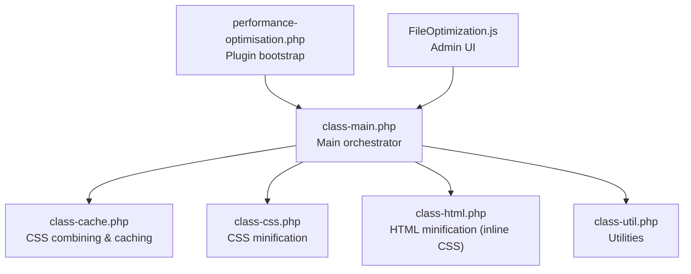
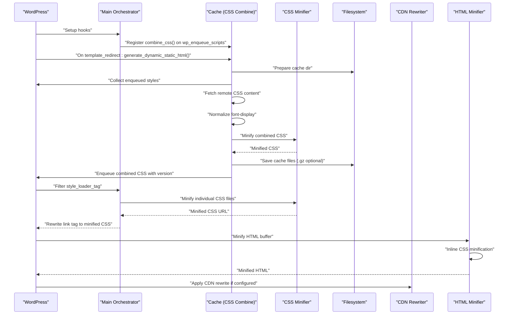
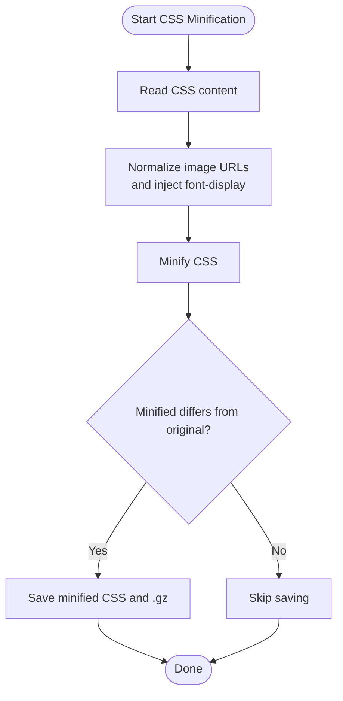
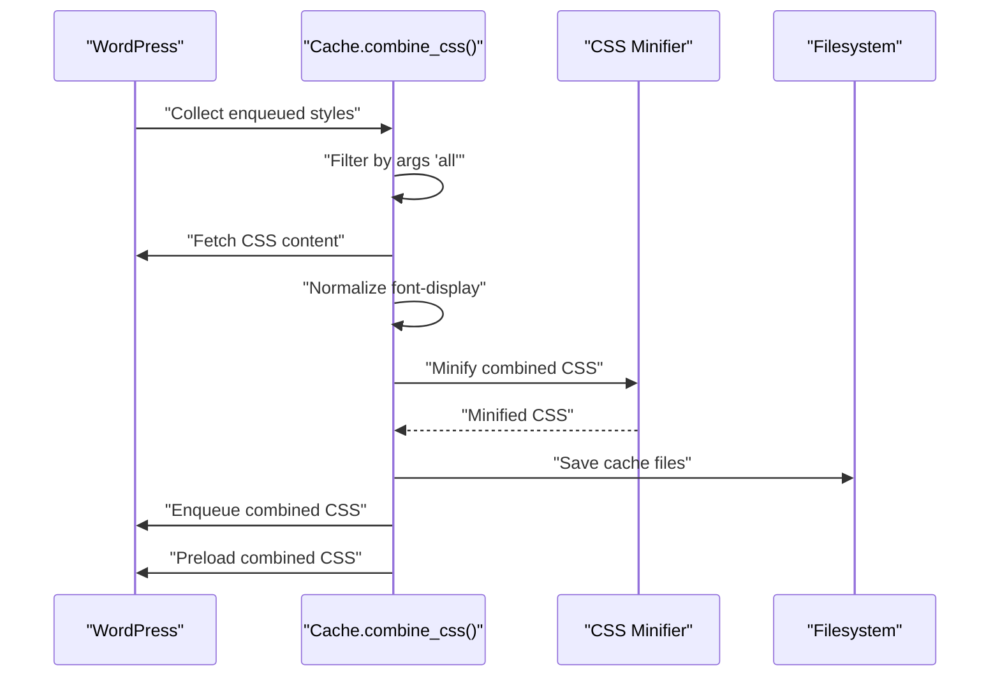
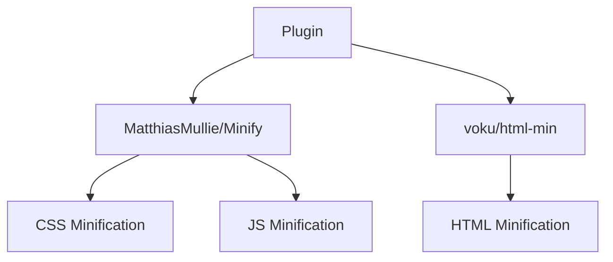

# CSS Optimization

<cite>
**Referenced Files in This Document**
- [performance-optimisation.php](file://performance-optimisation.php)
- [class-main.php](file://includes/class-main.php)
- [class-cache.php](file://includes/class-cache.php)
- [class-css.php](file://includes/minify/class-css.php)
- [class-html.php](file://includes/minify/class-html.php)
- [class-util.php](file://includes/class-util.php)
- [composer.json](file://composer.json)
- [FileOptimization.js](file://src/components/FileOptimization.js)
</cite>

## Table of Contents
1. [Introduction](#introduction)
2. [Project Structure](#project-structure)
3. [Core Components](#core-components)
4. [Architecture Overview](#architecture-overview)
5. [Detailed Component Analysis](#detailed-component-analysis)
6. [Dependency Analysis](#dependency-analysis)
7. [Performance Considerations](#performance-considerations)
8. [Troubleshooting Guide](#troubleshooting-guide)
9. [Conclusion](#conclusion)

## Introduction
This document explains the CSS optimization capabilities implemented in the plugin. It covers the CSS minification algorithm, combining strategies to reduce HTTP requests, the CSS processing pipeline, vendor prefix handling, property optimization, media query consolidation, configuration options for different optimization levels, custom exclusion rules for critical CSS, performance impact measurements, and troubleshooting guidance for common minification issues.

## Project Structure
The plugin organizes CSS optimization across several core areas:
- Main orchestration and configuration
- CSS minification and image optimization
- CSS combining and caching
- HTML minification (which includes inline CSS minification)
- Utility helpers for filesystem, URL processing, and preload generation
- Frontend configuration UI for enabling/disabling features

**Diagram sources**
- [performance-optimisation.php:1-68](file://performance-optimisation.php#L1-L68)
- [class-main.php:128-154](file://includes/class-main.php#L128-L154)
- [class-cache.php:32-120](file://includes/class-cache.php#L32-L120)
- [class-css.php:23-55](file://includes/minify/class-css.php#L23-L55)
- [class-html.php:32-68](file://includes/minify/class-html.php#L32-L68)
- [class-util.php:29-80](file://includes/class-util.php#L29-L80)
- [FileOptimization.js:19-46](file://src/components/FileOptimization.js#L19-L46)

**Section sources**
- [performance-optimisation.php:17-43](file://performance-optimisation.php#L17-L43)
- [class-main.php:128-154](file://includes/class-main.php#L128-L154)

## Core Components
- CSS Minification: Uses a dedicated minifier to remove comments, whitespace, and normalize properties, with special handling for font-display and image URL updates.
- CSS Combining: Collects all enqueued stylesheets, concatenates them, applies font-display normalization, minifies, caches, and enqueues a single combined stylesheet.
- Inline CSS Minification: During HTML minification, inline styles are minified to reduce payload.
- Exclusions: Supports exclusion lists for CSS handles/URLs and combines to preserve critical CSS.
- Vendor Prefix Handling: No explicit vendor prefix manipulation is implemented; the minifier focuses on standard CSS normalization.
- Media Query Consolidation: No explicit consolidation is performed; media queries are preserved as-is by the minifier.
- Configuration Options: Admin UI exposes toggles for minify CSS, exclude CSS, combine CSS, exclude combine CSS, and related settings.

**Section sources**
- [class-css.php:63-106](file://includes/minify/class-css.php#L63-L106)
- [class-cache.php:127-223](file://includes/class-cache.php#L127-L223)
- [class-html.php:116-143](file://includes/minify/class-html.php#L116-L143)
- [class-main.php:175-202](file://includes/class-main.php#L175-L202)
- [FileOptimization.js:22-46](file://src/components/FileOptimization.js#L22-L46)

## Architecture Overview
The CSS optimization pipeline integrates with WordPress hooks and filesystem operations to deliver optimized CSS efficiently.

**Diagram sources**
- [class-main.php:164-241](file://includes/class-main.php#L164-L241)
- [class-cache.php:127-223](file://includes/class-cache.php#L127-L223)
- [class-css.php:63-106](file://includes/minify/class-css.php#L63-L106)
- [class-html.php:116-143](file://includes/minify/class-html.php#L116-L143)
- [class-cache.php:325-381](file://includes/class-cache.php#L325-L381)

## Detailed Component Analysis

### CSS Minification Algorithm
The CSS minification process performs:
- Removal of comments and unnecessary whitespace
- Normalization of properties and values
- Injection of font-display: swap into @font-face blocks when missing
- Image URL normalization and next-gen image conversion triggers

**Diagram sources**
- [class-css.php:63-106](file://includes/minify/class-css.php#L63-L106)
- [class-css.php:143-190](file://includes/minify/class-css.php#L143-L190)

**Section sources**
- [class-css.php:63-106](file://includes/minify/class-css.php#L63-L106)
- [class-css.php:77-90](file://includes/minify/class-css.php#L77-L90)
- [class-css.php:143-190](file://includes/minify/class-css.php#L143-L190)

### CSS Combining Strategies
The plugin combines all enqueued stylesheets into a single file to reduce HTTP requests:
- Collects queue, filters by args ('all'), and fetches CSS content
- Applies font-display normalization and minification
- Saves to cache and enqueues a single combined stylesheet with versioning
- Adds a preload link for the combined CSS

**Diagram sources**
- [class-cache.php:127-223](file://includes/class-cache.php#L127-L223)
- [class-cache.php:194-211](file://includes/class-cache.php#L194-L211)

**Section sources**
- [class-cache.php:127-223](file://includes/class-cache.php#L127-L223)

### CSS Processing Pipeline
The pipeline integrates with WordPress hooks and filesystem operations:
- Hooks registration for combining CSS and minifying CSS
- Exclusion lists for handles/URLs
- Individual CSS minification via filter on style_loader_tag
- Combined CSS minification and caching

```mermaid
classDiagram
class Main {
+setup_hooks()
+minify_css(tag, handle, href)
+minify_js(tag, handle, src)
-is_css_minified(file_path)
-is_js_minified(file_path)
}
class Cache {
+combine_css()
-fetch_remote_css(url)
+generate_dynamic_static_html()
+maybe_apply_cdn(buffer)
}
class CSS_Minifier {
+minify()
+update_image_paths(css, file_path)
}
class HTML_Minifier {
+minify_html(html)
+minify_inline_css(html)
}
class Util {
+process_urls(urls)
+get_local_path(url)
+generate_preload_link(...)
}
Main --> Cache : "hooks"
Main --> CSS_Minifier : "minify CSS"
Cache --> CSS_Minifier : "minify combined CSS"
Cache --> Util : "helpers"
Main --> Util : "helpers"
HTML_Minifier --> CSS_Minifier : "inline CSS minification"
```

**Diagram sources**
- [class-main.php:164-241](file://includes/class-main.php#L164-L241)
- [class-cache.php:127-223](file://includes/class-cache.php#L127-L223)
- [class-css.php:23-55](file://includes/minify/class-css.php#L23-L55)
- [class-html.php:32-68](file://includes/minify/class-html.php#L32-L68)
- [class-util.php:29-80](file://includes/class-util.php#L29-L80)

**Section sources**
- [class-main.php:164-241](file://includes/class-main.php#L164-L241)
- [class-main.php:1006-1024](file://includes/class-main.php#L1006-L1024)

### Vendor Prefix Handling and Property Optimization
- Vendor prefix handling: Not implemented in the current codebase.
- Property optimization: The minifier removes comments and whitespace; font-display normalization is applied to @font-face blocks.

**Section sources**
- [class-css.php:77-90](file://includes/minify/class-css.php#L77-L90)
- [class-cache.php:194-207](file://includes/class-cache.php#L194-L207)

### Media Query Consolidation
- No explicit media query consolidation is performed. Media queries are preserved by the minifier.

**Section sources**
- [class-cache.php:127-223](file://includes/class-cache.php#L127-L223)

### Configuration Options and Exclusions
Available configuration options exposed in the admin UI include:
- Minify CSS
- Exclude specific CSS files
- Combine CSS
- Exclude CSS files from combining
- Related server rules and CDN settings

These options are read from plugin settings and applied via hooks and filters.

**Section sources**
- [FileOptimization.js:22-46](file://src/components/FileOptimization.js#L22-L46)
- [class-main.php:175-202](file://includes/class-main.php#L175-L202)

## Dependency Analysis
External dependencies used for CSS optimization:
- MatthiasMullie/Minify for CSS and JS minification
- voku/html-min for HTML minification

**Diagram sources**
- [composer.json:134-137](file://composer.json#L134-L137)
- [class-html.php:16-19](file://includes/minify/class-html.php#L16-L19)
- [class-css.php:16](file://includes/minify/class-css.php#L16)

**Section sources**
- [composer.json:134-137](file://composer.json#L134-L137)
- [class-html.php:16-19](file://includes/minify/class-html.php#L16-L19)
- [class-css.php:16](file://includes/minify/class-css.php#L16)

## Performance Considerations
- Reduced HTTP requests: Combining CSS reduces round-trips.
- Smaller payloads: Minification removes comments and whitespace.
- Font rendering: font-display: swap injection improves perceived performance for web fonts.
- CDN integration: Optional CDN rewriting for wp-content and wp-includes resources.
- Preloading: Preload combined CSS and other resources to improve render performance.

[No sources needed since this section provides general guidance]

## Troubleshooting Guide
Common issues and resolutions:
- Selector conflicts after minification: Ensure critical CSS is excluded from combining. Use the exclude combine CSS setting to preserve critical styles.
- Specificity problems: Verify that excluded CSS still loads in the correct order. Use the exclude CSS setting to prevent minification of problematic files.
- Inline CSS breaking: If inline CSS minification causes issues, disable minify inline CSS in settings.
- CDN misconfiguration: If assets fail to load after CDN rewrite, verify the CDN URL and ensure the rewrite logic targets wp-content and wp-includes paths.

**Section sources**
- [class-cache.php:139-164](file://includes/class-cache.php#L139-L164)
- [class-main.php:195-202](file://includes/class-main.php#L195-L202)
- [class-cache.php:325-381](file://includes/class-cache.php#L325-L381)

## Conclusion
The plugin provides robust CSS optimization through minification, combining, and CDN integration. While vendor prefix handling and media query consolidation are not implemented, the existing pipeline delivers significant performance improvements with configurable exclusions for critical CSS and inline CSS minification safeguards.