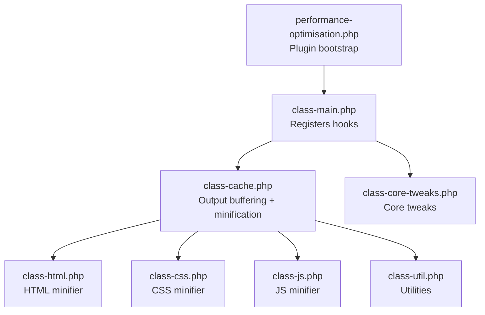
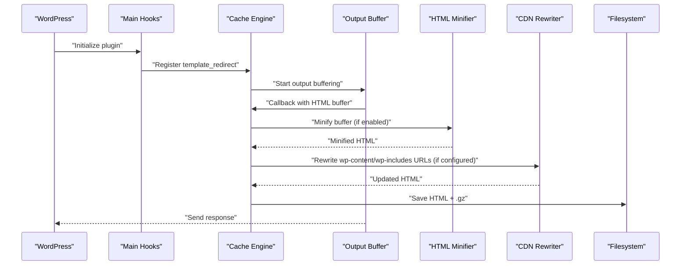
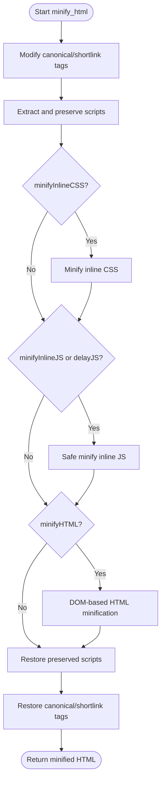
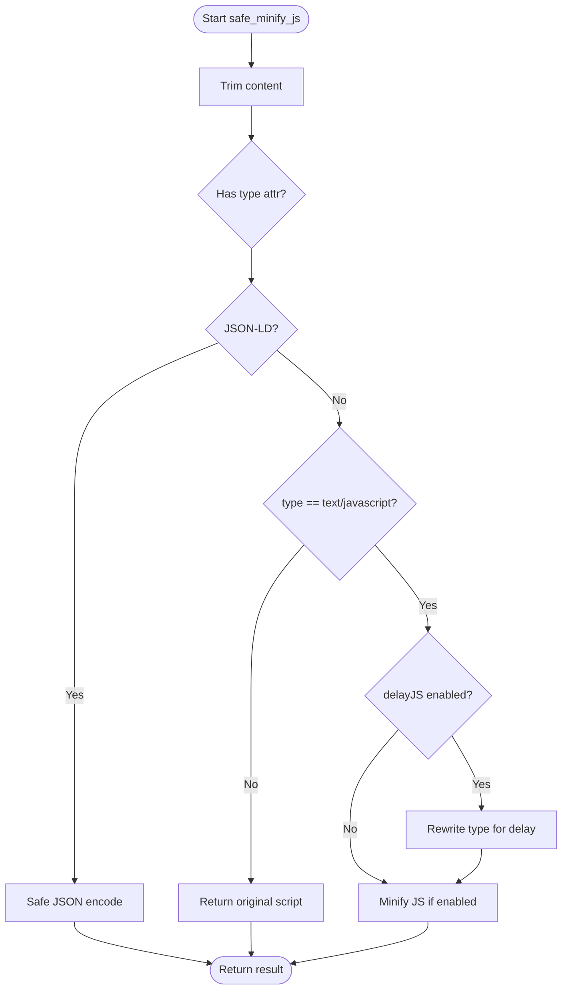
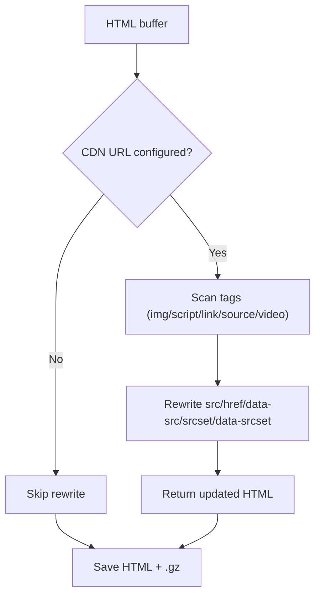
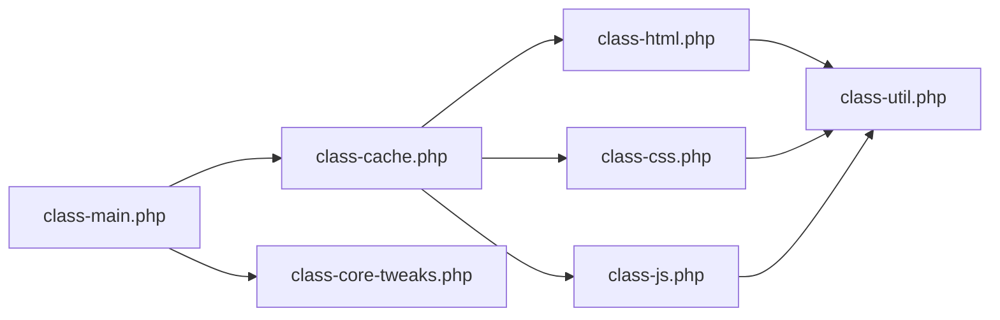

# HTML Optimization

<cite>
**Referenced Files in This Document**
- [performance-optimisation.php](file://performance-optimisation.php)
- [class-main.php](file://includes/class-main.php)
- [class-cache.php](file://includes/class-cache.php)
- [class-html.php](file://includes/minify/class-html.php)
- [class-css.php](file://includes/minify/class-css.php)
- [class-js.php](file://includes/minify/class-js.php)
- [class-util.php](file://includes/class-util.php)
- [class-core-tweaks.php](file://includes/class-core-tweaks.php)
- [ROADMAP.md](file://ROADMAP.md)
</cite>

## Table of Contents
1. [Introduction](#introduction)
2. [Project Structure](#project-structure)
3. [Core Components](#core-components)
4. [Architecture Overview](#architecture-overview)
5. [Detailed Component Analysis](#detailed-component-analysis)
6. [Dependency Analysis](#dependency-analysis)
7. [Performance Considerations](#performance-considerations)
8. [Troubleshooting Guide](#troubleshooting-guide)
9. [Conclusion](#conclusion)

## Introduction
This document explains the HTML optimization features of the plugin, focusing on the HTML minification pipeline, safe handling of dynamic content, compression techniques, configuration options, and performance impact. It covers how the plugin removes comments and unnecessary whitespace, optimizes attributes, compresses output, and preserves critical scripts and styles while integrating with WordPress hooks and caching.

## Project Structure
The HTML optimization is implemented as part of the plugin’s broader performance suite. Key areas involved:
- Entry point initializes the main controller.
- The main controller registers hooks and delegates to cache generation.
- The cache layer performs output buffering and applies minification.
- The HTML minifier class encapsulates DOM-based minification and inline script/style handling.
- Supporting minifiers handle CSS and JS files.
- Utilities provide shared helpers for filesystem and URL processing.

**Diagram sources**
- [performance-optimisation.php:17-43](file://performance-optimisation.php#L17-L43)
- [class-main.php:128-241](file://includes/class-main.php#L128-L241)
- [class-cache.php:260-310](file://includes/class-cache.php#L260-L310)
- [class-html.php:32-107](file://includes/minify/class-html.php#L32-L107)
- [class-css.php:23-106](file://includes/minify/class-css.php#L23-L106)
- [class-js.php:27-99](file://includes/minify/class-js.php#L27-L99)
- [class-util.php:29-80](file://includes/class-util.php#L29-L80)
- [class-core-tweaks.php:18-56](file://includes/class-core-tweaks.php#L18-L56)

**Section sources**
- [performance-optimisation.php:17-43](file://performance-optimisation.php#L17-L43)
- [class-main.php:128-241](file://includes/class-main.php#L128-L241)
- [class-cache.php:260-310](file://includes/class-cache.php#L260-L310)

## Core Components
- HTML Minifier: Performs DOM-based minification, removes comments and whitespace, optimizes attributes, sorts classes and attributes, and normalizes links. It also safely minifies inline CSS and JS, preserves critical script blocks, and delays script execution when configured.
- Cache Engine: Starts output buffering early, applies image optimizations, optionally minifies HTML, applies CDN rewriting, and persists compressed cache files.
- CSS/JS Minifiers: Provide file-based minification with gzip caching for CSS and JS assets.
- Utilities: Provide filesystem preparation, URL normalization, and preload link generation.

Key capabilities:
- Safe inline CSS/JS minification with JSON and type checks.
- Selective script delay and exclusion lists.
- Canonical link preservation during minification.
- Compression via gzip for cached assets.

**Section sources**
- [class-html.php:32-107](file://includes/minify/class-html.php#L32-L107)
- [class-html.php:116-143](file://includes/minify/class-html.php#L116-L143)
- [class-html.php:171-211](file://includes/minify/class-html.php#L171-L211)
- [class-html.php:239-255](file://includes/minify/class-html.php#L239-L255)
- [class-html.php:264-342](file://includes/minify/class-html.php#L264-L342)
- [class-cache.php:287-310](file://includes/class-cache.php#L287-L310)
- [class-cache.php:391-396](file://includes/class-cache.php#L391-L396)
- [class-css.php:63-106](file://includes/minify/class-css.php#L63-L106)
- [class-js.php:74-99](file://includes/minify/class-js.php#L74-L99)
- [class-util.php:38-60](file://includes/class-util.php#L38-L60)

## Architecture Overview
The HTML optimization pipeline integrates with WordPress hooks to capture output, apply transformations, and persist compressed artifacts.

**Diagram sources**
- [class-main.php:175-177](file://includes/class-main.php#L175-L177)
- [class-cache.php:260-310](file://includes/class-cache.php#L260-L310)
- [class-cache.php:391-396](file://includes/class-cache.php#L391-L396)
- [class-cache.php:325-381](file://includes/class-cache.php#L325-L381)
- [class-cache.php:470-483](file://includes/class-cache.php#L470-L483)

## Detailed Component Analysis

### HTML Minification Pipeline
The HTML minifier configures a DOM-based minifier to remove comments, collapse whitespace, normalize attributes, and strip redundant markup. It also:
- Temporarily extracts and preserves specific script blocks to avoid breaking functionality.
- Optionally minifies inline CSS and JS, with safeguards for JSON-LD and non-JavaScript types.
- Adjusts script types for delayed execution when configured.
- Preserves canonical and shortlink tags by temporarily renaming attributes.

**Diagram sources**
- [class-html.php:116-143](file://includes/minify/class-html.php#L116-L143)
- [class-html.php:152-162](file://includes/minify/class-html.php#L152-L162)
- [class-html.php:171-195](file://includes/minify/class-html.php#L171-L195)
- [class-html.php:239-255](file://includes/minify/class-html.php#L239-L255)
- [class-html.php:264-342](file://includes/minify/class-html.php#L264-L342)
- [class-html.php:220-230](file://includes/minify/class-html.php#L220-L230)

**Section sources**
- [class-html.php:75-107](file://includes/minify/class-html.php#L75-L107)
- [class-html.php:116-143](file://includes/minify/class-html.php#L116-L143)
- [class-html.php:152-162](file://includes/minify/class-html.php#L152-L162)
- [class-html.php:171-195](file://includes/minify/class-html.php#L171-L195)
- [class-html.php:220-230](file://includes/minify/class-html.php#L220-L230)
- [class-html.php:239-255](file://includes/minify/class-html.php#L239-L255)
- [class-html.php:264-342](file://includes/minify/class-html.php#L264-L342)

### Safe Inline Script Handling
The inline JS minifier:
- Detects JSON-LD and application/ld+json scripts and safely re-encodes them.
- Skips non-standard script types to avoid breaking functionality.
- Applies optional delay by rewriting script type attributes and deferring execution for eligible scripts.

**Diagram sources**
- [class-html.php:282-342](file://includes/minify/class-html.php#L282-L342)

**Section sources**
- [class-html.php:282-342](file://includes/minify/class-html.php#L282-L342)

### CDN Rewriting and Compression
The cache engine optionally rewrites local wp-content and wp-includes URLs to a configured CDN and saves both uncompressed and gzip-compressed cache files. This reduces payload sizes and leverages CDN distribution.

**Diagram sources**
- [class-cache.php:325-381](file://includes/class-cache.php#L325-L381)
- [class-cache.php:470-483](file://includes/class-cache.php#L470-L483)

**Section sources**
- [class-cache.php:325-381](file://includes/class-cache.php#L325-L381)
- [class-cache.php:470-483](file://includes/class-cache.php#L470-L483)

### Configuration Options and Selective Processing
Options are read from plugin settings and applied selectively:
- HTML minification toggles for inline CSS/JS and overall HTML.
- Script delay and defer with exclusion lists.
- Combine CSS and minify CSS/JS file-level toggles with exclusion lists.
- CDN URL rewriting for wp-content/wp-includes resources.
- Core tweaks (e.g., disable emojis, embeds, dashicons) to reduce bloat.

These are registered via hooks and filters in the main controller and applied in the cache engine and minifiers.

**Section sources**
- [class-main.php:99-118](file://includes/class-main.php#L99-L118)
- [class-main.php:175-241](file://includes/class-main.php#L175-L241)
- [class-cache.php:294-302](file://includes/class-cache.php#L294-L302)
- [class-core-tweaks.php:32-56](file://includes/class-core-tweaks.php#L32-L56)

## Dependency Analysis
The HTML optimization depends on:
- WordPress hooks for lifecycle integration.
- Third-party minifiers for HTML, CSS, and JS.
- Filesystem utilities for cache persistence.
- CDN rewriting logic for asset delivery.

**Diagram sources**
- [class-main.php:128-241](file://includes/class-main.php#L128-L241)
- [class-cache.php:260-310](file://includes/class-cache.php#L260-L310)
- [class-html.php:16-20](file://includes/minify/class-html.php#L16-L20)
- [class-css.php:16-18](file://includes/minify/class-css.php#L16-L18)
- [class-js.php:15-16](file://includes/minify/class-js.php#L15-L16)
- [class-util.php:29-80](file://includes/class-util.php#L29-L80)
- [class-core-tweaks.php:18-56](file://includes/class-core-tweaks.php#L18-L56)

**Section sources**
- [class-main.php:128-241](file://includes/class-main.php#L128-L241)
- [class-cache.php:260-310](file://includes/class-cache.php#L260-L310)
- [class-html.php:16-20](file://includes/minify/class-html.php#L16-L20)
- [class-css.php:16-18](file://includes/minify/class-css.php#L16-L18)
- [class-js.php:15-16](file://includes/minify/class-js.php#L15-L16)
- [class-util.php:29-80](file://includes/class-util.php#L29-L80)
- [class-core-tweaks.php:18-56](file://includes/class-core-tweaks.php#L18-L56)

## Performance Considerations
- Output buffering and minification occur during template_redirect, minimizing overhead for logged-in users and non-cacheable pages.
- Gzip compression is applied to cached HTML and assets, reducing transfer size.
- CDN rewriting offloads static assets to a content delivery network, improving latency and bandwidth efficiency.
- Core tweaks reduce unnecessary scripts and styles, lowering initial payload.

[No sources needed since this section provides general guidance]

## Troubleshooting Guide
Common issues and resolutions:
- Template rendering conflicts:
  - Embedded scripts with non-standard types or JSON-LD are preserved to avoid runtime errors.
  - Canonical and shortlink tags are temporarily renamed and restored to maintain SEO metadata.
- Dynamic content preservation:
  - Scripts are extracted and restored around minification to prevent unintended side effects.
  - Exclusion lists for delay/defer allow preserving critical scripts.
- Minification failures:
  - Inline CSS/JS minifiers catch exceptions and return original content to avoid breaking pages.
- CDN misconfiguration:
  - Verify CDN URL settings and ensure the rewrite logic targets wp-content/wp-includes paths.

**Section sources**
- [class-html.php:152-162](file://includes/minify/class-html.php#L152-L162)
- [class-html.php:171-195](file://includes/minify/class-html.php#L171-L195)
- [class-html.php:220-230](file://includes/minify/class-html.php#L220-L230)
- [class-html.php:243-249](file://includes/minify/class-html.php#L243-L249)
- [class-html.php:332-339](file://includes/minify/class-html.php#L332-L339)
- [class-cache.php:325-381](file://includes/class-cache.php#L325-L381)

## Conclusion
The HTML optimization subsystem combines DOM-based minification, safe inline script handling, CDN rewriting, and gzip compression to reduce payload sizes and improve page load performance. Its selective configuration and preservation mechanisms help maintain functionality while delivering measurable performance gains across typical WordPress deployments.