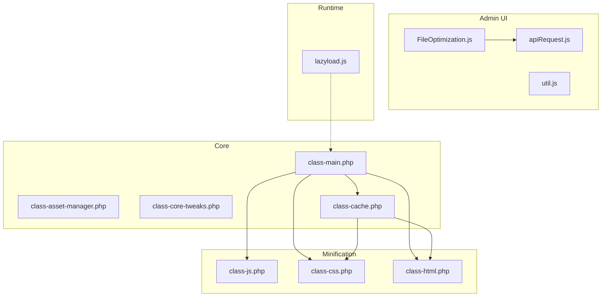
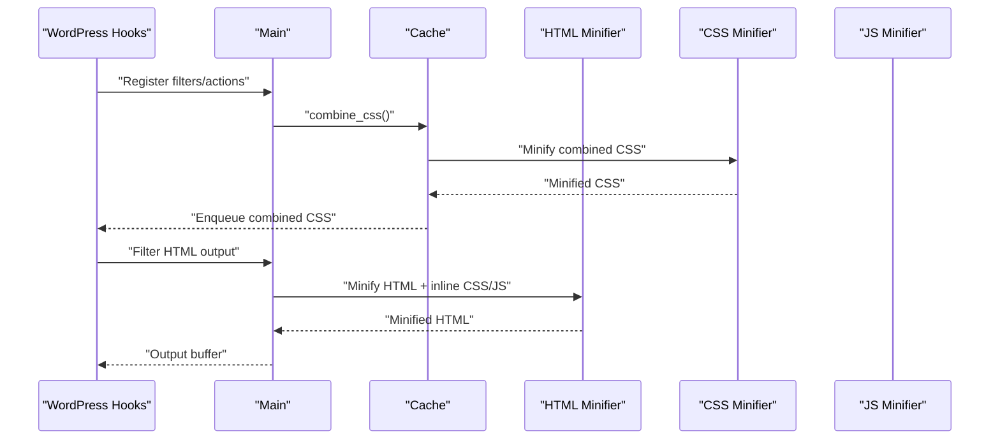
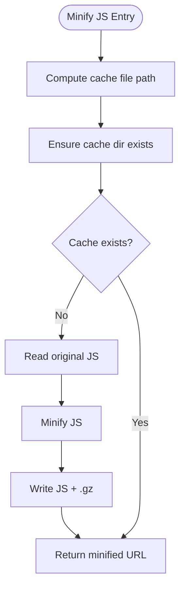
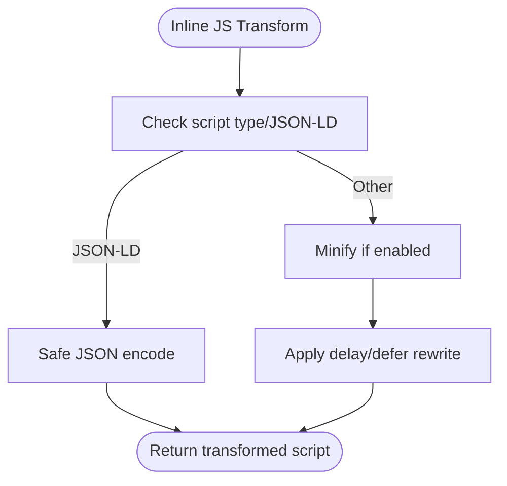
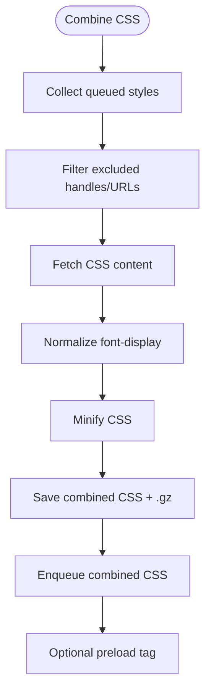
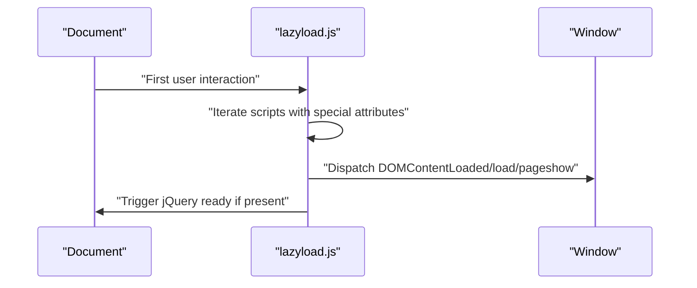
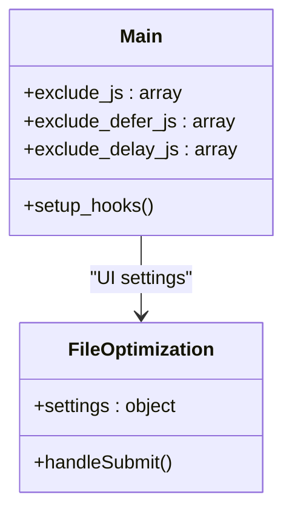
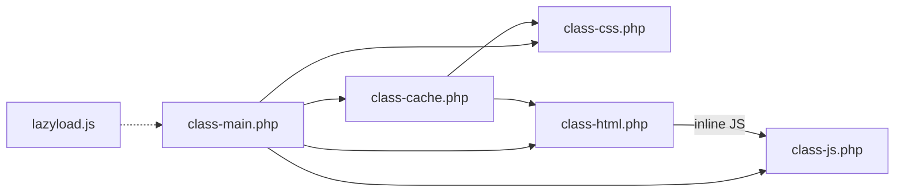

# JavaScript Optimization

<cite>
**Referenced Files in This Document**
- [class-js.php](file://includes/minify/class-js.php)
- [class-css.php](file://includes/minify/class-css.php)
- [class-html.php](file://includes/minify/class-html.php)
- [class-cache.php](file://includes/class-cache.php)
- [class-main.php](file://includes/class-main.php)
- [class-asset-manager.php](file://includes/class-asset-manager.php)
- [class-core-tweaks.php](file://includes/class-core-tweaks.php)
- [FileOptimization.js](file://src/components/FileOptimization.js)
- [lazyload.js](file://src/lazyload.js)
- [apiRequest.js](file://src/lib/apiRequest.js)
- [util.js](file://src/lib/util.js)
</cite>

## Table of Contents
1. [Introduction](#introduction)
2. [Project Structure](#project-structure)
3. [Core Components](#core-components)
4. [Architecture Overview](#architecture-overview)
5. [Detailed Component Analysis](#detailed-component-analysis)
6. [Dependency Analysis](#dependency-analysis)
7. [Performance Considerations](#performance-considerations)
8. [Troubleshooting Guide](#troubleshooting-guide)
9. [Conclusion](#conclusion)
10. [Appendices](#appendices)

## Introduction
This document explains the JavaScript optimization capabilities implemented in the plugin, focusing on minification, combining, and safe transformation of JavaScript assets. It covers how minification is performed, how scripts are deferred or delayed for improved performance, and how the system preserves compatibility with modern JavaScript features and third-party libraries. It also documents configuration options, exclusion rules, and practical guidance for delivering optimized JavaScript efficiently.

## Project Structure
The JavaScript optimization features are implemented across several PHP classes and a small amount of client-side JavaScript:
- Minification: dedicated classes for JS, CSS, and HTML
- Delivery and combining: cache and main controller classes
- Runtime behavior: client-side lazy-loading and delay execution
- Admin UI: React-based settings panel for toggling and configuring optimizations

**Diagram sources**
- [class-main.php:167-244](file://includes/class-main.php#L167-L244)
- [class-cache.php:127-223](file://includes/class-cache.php#L127-L223)
- [class-js.php:74-99](file://includes/minify/class-js.php#L74-L99)
- [class-css.php:63-106](file://includes/minify/class-css.php#L63-L106)
- [class-html.php:116-143](file://includes/minify/class-html.php#L116-L143)
- [lazyload.js:55-126](file://src/lazyload.js#L55-L126)
- [FileOptimization.js:55-90](file://src/components/FileOptimization.js#L55-L90)

**Section sources**
- [class-main.php:128-157](file://includes/class-main.php#L128-L157)
- [class-cache.php:127-223](file://includes/class-cache.php#L127-L223)
- [class-js.php:74-99](file://includes/minify/class-js.php#L74-L99)
- [class-css.php:63-106](file://includes/minify/class-css.php#L63-L106)
- [class-html.php:116-143](file://includes/minify/class-html.php#L116-L143)
- [lazyload.js:55-126](file://src/lazyload.js#L55-L126)
- [FileOptimization.js:55-90](file://src/components/FileOptimization.js#L55-L90)

## Core Components
- JavaScript Minification: Uses a third-party minifier to compress JS content and cache gzipped results.
- CSS Minification and Image Rewriting: Minifies CSS and updates image URLs to next-gen formats when available.
- HTML Minification and Inline Script Handling: Minifies HTML and safely handles inline CSS/JS, including JSON-LD and deferred/delayed scripts.
- CSS Combining: Collects enqueued styles, optionally excludes selected handles/URLs, and serves a combined, minified CSS file.
- Runtime Script Delay: Client-side logic converts type attributes for deferred/delayed scripts and loads them on first user interaction.
- Admin Configuration UI: Provides toggles and exclusion lists for JS/CSS minification, defer, delay, and combining.

**Section sources**
- [class-js.php:74-99](file://includes/minify/class-js.php#L74-L99)
- [class-css.php:63-106](file://includes/minify/class-css.php#L63-L106)
- [class-html.php:116-143](file://includes/minify/class-html.php#L116-L143)
- [class-cache.php:127-223](file://includes/class-cache.php#L127-L223)
- [lazyload.js:55-126](file://src/lazyload.js#L55-L126)
- [FileOptimization.js:19-620](file://src/components/FileOptimization.js#L19-L620)

## Architecture Overview
The optimization pipeline integrates WordPress hooks, minification utilities, and runtime transformations:
- WordPress hooks register filters/actions to enable minification and combining.
- Minification classes compute cache paths, write gzipped files, and return URLs.
- HTML minification preserves critical script blocks and applies safe transformations.
- CSS combining aggregates styles, minifies, and enqueues a single file.
- Client-side lazyload intercepts deferred/delayed scripts and executes them on first user interaction.

**Diagram sources**
- [class-main.php:167-244](file://includes/class-main.php#L167-L244)
- [class-cache.php:127-223](file://includes/class-cache.php#L127-L223)
- [class-html.php:116-143](file://includes/minify/class-html.php#L116-L143)

## Detailed Component Analysis

### JavaScript Minification
JavaScript minification is performed by a dedicated class that:
- Computes a cache file path based on the original file’s hash.
- Ensures the cache directory exists.
- Reads the original content, minifies it, and writes both uncompressed and gzipped files.
- Returns the URL of the minified file for serving.

**Diagram sources**
- [class-js.php:108-129](file://includes/minify/class-js.php#L108-L129)

**Section sources**
- [class-js.php:74-99](file://includes/minify/class-js.php#L74-L99)
- [class-js.php:108-129](file://includes/minify/class-js.php#L108-L129)

### Safe Inline JavaScript Transformation
The HTML minifier safely transforms inline JavaScript:
- Detects JSON-LD and other non-JavaScript script types and encodes them safely.
- Applies minification to eligible inline scripts.
- Optionally marks scripts for deferral/delay by rewriting type attributes and deferring src assignment.

**Diagram sources**
- [class-html.php:264-342](file://includes/minify/class-html.php#L264-L342)

**Section sources**
- [class-html.php:264-342](file://includes/minify/class-html.php#L264-L342)

### CSS Combining and Minification
The cache module combines enqueued CSS files:
- Excludes handles/URLs based on configuration.
- Fetches CSS content from local or remote sources.
- Applies font-display normalization and minification.
- Writes combined CSS and gzipped variant, enqueues it, and optionally preloads it.

**Diagram sources**
- [class-cache.php:127-223](file://includes/class-cache.php#L127-L223)

**Section sources**
- [class-cache.php:127-223](file://includes/class-cache.php#L127-L223)

### Runtime Script Delay and Deferred Loading
Deferred and delayed scripts are handled client-side:
- Scripts are marked with special attributes and loaded on first user interaction.
- Inline scripts are encoded as data URIs when necessary.
- After loading, synthetic DOM events are dispatched to ensure libraries initialize properly.

**Diagram sources**
- [lazyload.js:55-126](file://src/lazyload.js#L55-L126)

**Section sources**
- [lazyload.js:55-126](file://src/lazyload.js#L55-L126)

### Configuration and Exclusions
The plugin exposes configuration options through the admin UI and main controller:
- Enable/disable JS minification and defer/delay.
- Exclude specific scripts by handle or URL pattern.
- Exclude CSS from combining and minification.
- Exclude URLs for server rules and CDN rewriting.

**Diagram sources**
- [class-main.php:34-66](file://includes/class-main.php#L34-L66)
- [FileOptimization.js:55-90](file://src/components/FileOptimization.js#L55-L90)

**Section sources**
- [class-main.php:34-66](file://includes/class-main.php#L34-L66)
- [FileOptimization.js:19-620](file://src/components/FileOptimization.js#L19-L620)

## Dependency Analysis
Key dependencies and relationships:
- Main registers WordPress hooks and wires minification/combining based on settings.
- Cache depends on minifiers and WordPress asset queues to combine CSS.
- HTML minifier depends on third-party libraries for safe inline transformations.
- Runtime lazyload depends on DOM events and browser APIs.

**Diagram sources**
- [class-main.php:167-244](file://includes/class-main.php#L167-L244)
- [class-cache.php:127-223](file://includes/class-cache.php#L127-L223)
- [class-html.php:116-143](file://includes/minify/class-html.php#L116-L143)
- [lazyload.js:55-126](file://src/lazyload.js#L55-L126)

**Section sources**
- [class-main.php:167-244](file://includes/class-main.php#L167-L244)
- [class-cache.php:127-223](file://includes/class-cache.php#L127-L223)
- [class-html.php:116-143](file://includes/minify/class-html.php#L116-L143)
- [lazyload.js:55-126](file://src/lazyload.js#L55-L126)

## Performance Considerations
- Minification reduces payload size and improves transfer speeds; gzipping further reduces bandwidth.
- Combining CSS reduces HTTP requests; preloading the combined file accelerates rendering.
- Deferring and delaying scripts prevents render-blocking and reduces initial CPU usage.
- Exclusion lists protect critical scripts and third-party libraries from unintended transformations.
- CDN rewriting reduces origin load and improves global delivery.

[No sources needed since this section provides general guidance]

## Troubleshooting Guide
Common issues and resolutions:
- Syntax errors after minification or inline transformations:
  - Use exclusion lists to bypass problematic scripts or inline blocks.
  - Temporarily disable minification to isolate the issue.
- Async script handling:
  - Ensure deferred/delayed scripts are placed after DOM-ready events.
  - Verify that libraries expecting synchronous initialization are not delayed.
- Third-party library compatibility:
  - Exclude handles or URLs that conflict with deferred/delayed execution.
  - Review inline JSON-LD and other non-JS script types to ensure safe encoding.
- CDN and server rules:
  - Confirm CDN hostnames and permissions for .htaccess updates.
  - Validate exclusions for URLs that must remain on the origin.

**Section sources**
- [class-html.php:264-342](file://includes/minify/class-html.php#L264-L342)
- [class-main.php:188-225](file://includes/class-main.php#L188-L225)
- [FileOptimization.js:19-620](file://src/components/FileOptimization.js#L19-L620)

## Conclusion
The plugin provides a robust, layered approach to JavaScript optimization: server-side minification and combining, safe inline transformations, and client-side deferred/delayed execution. With configurable exclusion rules and compatibility safeguards, it balances performance gains with reliability across diverse WordPress setups and third-party integrations.

[No sources needed since this section summarizes without analyzing specific files]

## Appendices

### Configuration Options Reference
- Minify JavaScript: Toggle to enable/disable JS minification.
- Exclude JS from Minification: Comma-separated handles or URL patterns to skip minification.
- Defer JavaScript: Load scripts after page render to avoid render-blocking.
- Exclude JS from Defer: Handles or URL patterns to keep non-deferred.
- Delay JavaScript Execution: Delay all scripts until first user interaction.
- Exclude JS from Delay: Handles or URL patterns to keep non-delayed.
- Combine CSS: Merge enqueued CSS into a single file.
- Exclude CSS from Combining: Handles or URL patterns to keep separate.
- Minify CSS: Enable CSS minification.
- Minify HTML: Enable HTML minification.
- Minify Inline CSS/JS: Minify inline styles/scripts.
- Enable Server Rules (.htaccess): Write server-level rules for caching/compression.
- CDN Hostname: Rewrite asset URLs to a CDN domain.

**Section sources**
- [FileOptimization.js:19-620](file://src/components/FileOptimization.js#L19-L620)
- [class-main.php:188-225](file://includes/class-main.php#L188-L225)