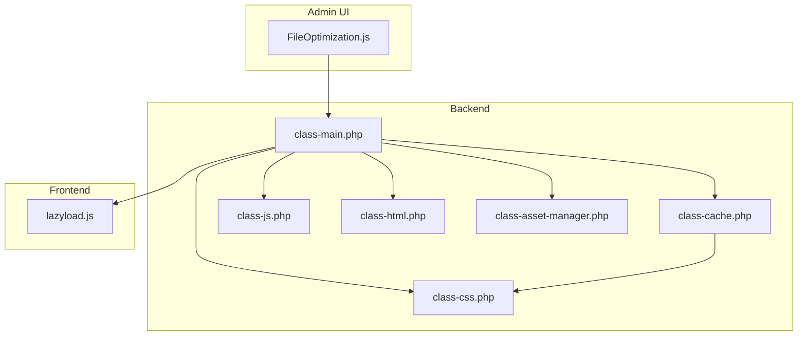
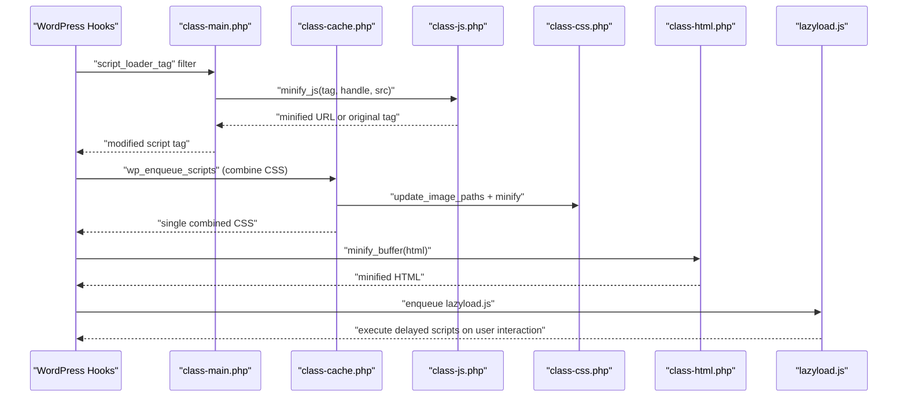
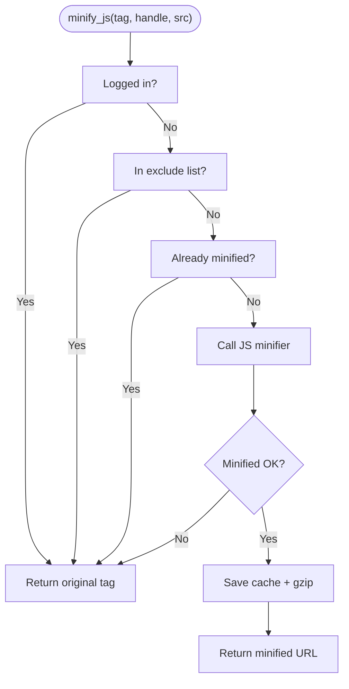
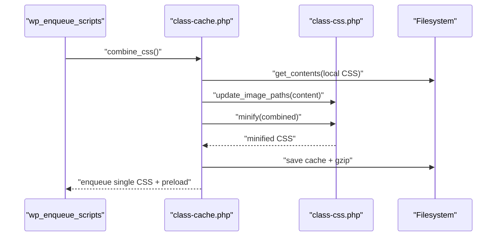
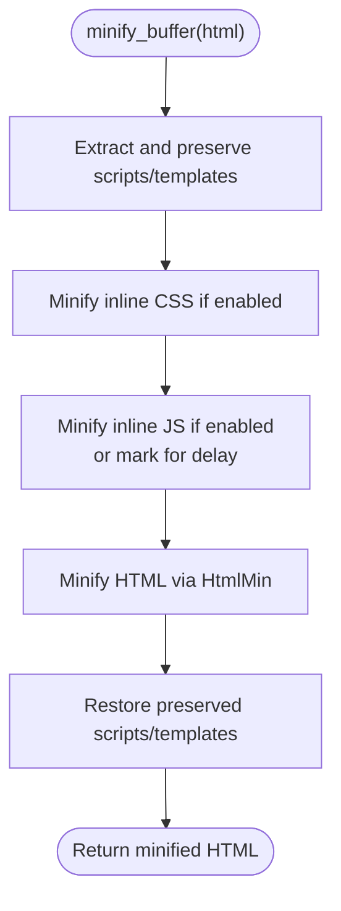
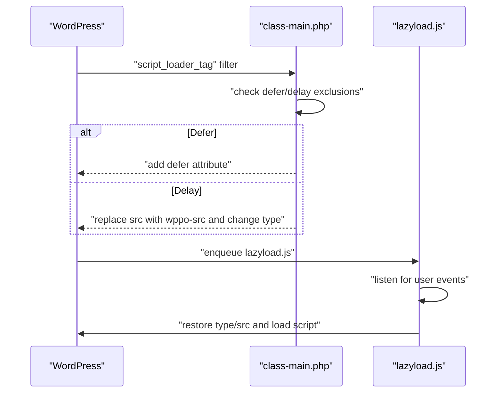
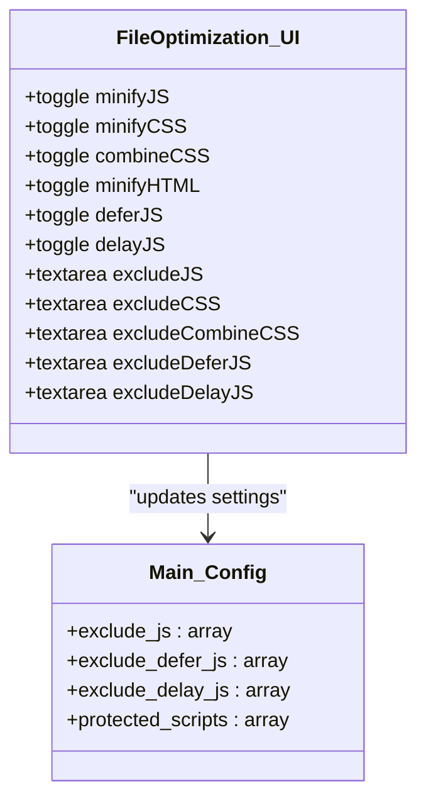
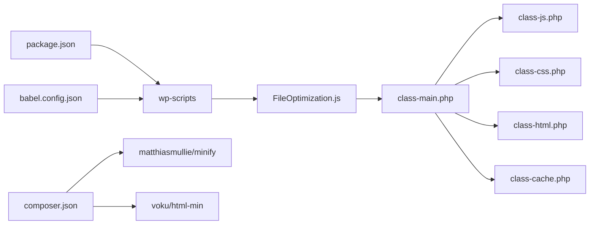

# JavaScript Optimization

<cite>
**Referenced Files in This Document**
- [class-js.php](file://includes/minify/class-js.php)
- [class-css.php](file://includes/minify/class-css.php)
- [class-html.php](file://includes/minify/class-html.php)
- [class-cache.php](file://includes/class-cache.php)
- [class-main.php](file://includes/class-main.php)
- [class-asset-manager.php](file://includes/class-asset-manager.php)
- [FileOptimization.js](file://src/components/FileOptimization.js)
- [lazyload.js](file://src/lazyload.js)
- [package.json](file://package.json)
- [babel.config.json](file://babel.config.json)
- [composer.json](file://composer.json)
- [readme.md](file://readme.md)
</cite>

## Table of Contents
1. [Introduction](#introduction)
2. [Project Structure](#project-structure)
3. [Core Components](#core-components)
4. [Architecture Overview](#architecture-overview)
5. [Detailed Component Analysis](#detailed-component-analysis)
6. [Dependency Analysis](#dependency-analysis)
7. [Performance Considerations](#performance-considerations)
8. [Troubleshooting Guide](#troubleshooting-guide)
9. [Conclusion](#conclusion)

## Introduction
This document explains the JavaScript optimization capabilities of the plugin, focusing on minification, combining, and runtime loading strategies. It covers how the plugin minifies JavaScript files, combines CSS into a single file, defers and delays script execution, and safely transforms inline scripts. It also documents configuration options, exclusion rules, and compatibility considerations for modern JavaScript features.

## Project Structure
The JavaScript optimization pipeline spans PHP backend classes and a React-based admin interface:
- Backend minification and caching: includes/minify/class-js.php, includes/minify/class-css.php, includes/minify/class-html.php, includes/class-cache.php
- Runtime script handling and exclusions: includes/class-main.php, includes/class-asset-manager.php
- Admin configuration UI: src/components/FileOptimization.js
- Client-side lazy-loading and delayed execution: src/lazyload.js
- Build toolchain and presets: package.json, babel.config.json
- Dependencies and third-party libraries: composer.json, readme.md

**Diagram sources**
- [class-main.php:164-241](file://includes/class-main.php#L164-L241)
- [class-cache.php:127-223](file://includes/class-cache.php#L127-L223)
- [class-js.php:27-131](file://includes/minify/class-js.php#L27-L131)
- [class-css.php:23-192](file://includes/minify/class-css.php#L23-L192)
- [class-html.php:32-372](file://includes/minify/class-html.php#L32-L372)
- [class-asset-manager.php:27-224](file://includes/class-asset-manager.php#L27-L224)
- [lazyload.js:1-121](file://src/lazyload.js#L1-L121)

**Section sources**
- [class-main.php:128-154](file://includes/class-main.php#L128-L154)
- [FileOptimization.js:19-620](file://src/components/FileOptimization.js#L19-L620)

## Core Components
- JavaScript Minification: Uses MatthiasMullie Minify to compress JS files and cache them with gzip. See [class-js.php:74-99](file://includes/minify/class-js.php#L74-L99).
- CSS Minification and Image Optimization: Minifies CSS and updates image URLs to WebP/AVIF variants. See [class-css.php:63-106](file://includes/minify/class-css.php#L63-L106).
- HTML Minification and Inline Script Handling: Minifies HTML and safely minifies/minimally transforms inline CSS/JS. See [class-html.php:116-143](file://includes/minify/class-html.php#L116-L143).
- CSS Combination: Collects enqueued styles, fetches and concatenates them, applies font-display optimizations, minifies, caches, and enqueues a single CSS file. See [class-cache.php:127-223](file://includes/class-cache.php#L127-223).
- Script Loading Controls: Defers scripts, delays execution until user interaction, and excludes specific scripts. See [class-main.php:894-917](file://includes/class-main.php#L894-L917) and [class-main.php:1036-1055](file://includes/class-main.php#L1036-L1055).
- Exclusion Lists: Maintains protected handles and configurable exclusion lists for JS/CSS/defer/delay. See [class-main.php:42-66](file://includes/class-main.php#L42-L66) and [class-main.php:185-222](file://includes/class-main.php#L185-L222).
- Admin Configuration UI: Provides toggles and exclusion inputs for JS/CSS/HTML optimization and loading strategies. See [FileOptimization.js:22-382](file://src/components/FileOptimization.js#L22-L382).

**Section sources**
- [class-js.php:74-129](file://includes/minify/class-js.php#L74-L129)
- [class-css.php:63-106](file://includes/minify/class-css.php#L63-L106)
- [class-html.php:116-143](file://includes/minify/class-html.php#L116-L143)
- [class-cache.php:127-223](file://includes/class-cache.php#L127-L223)
- [class-main.php:894-917](file://includes/class-main.php#L894-L917)
- [class-main.php:1036-1055](file://includes/class-main.php#L1036-L1055)
- [class-main.php:42-66](file://includes/class-main.php#L42-L66)
- [class-main.php:185-222](file://includes/class-main.php#L185-L222)
- [FileOptimization.js:22-382](file://src/components/FileOptimization.js#L22-L382)

## Architecture Overview
The optimization pipeline integrates WordPress hooks with backend minification and caching, and client-side lazy-loading.

**Diagram sources**
- [class-main.php:164-241](file://includes/class-main.php#L164-L241)
- [class-main.php:894-917](file://includes/class-main.php#L894-L917)
- [class-main.php:1036-1055](file://includes/class-main.php#L1036-L1055)
- [class-cache.php:127-223](file://includes/class-cache.php#L127-L223)
- [class-js.php:74-99](file://includes/minify/class-js.php#L74-L99)
- [class-css.php:77-106](file://includes/minify/class-css.php#L77-L106)
- [class-html.php:391-396](file://includes/minify/class-html.php#L391-L396)
- [lazyload.js:55-106](file://src/lazyload.js#L55-L106)

## Detailed Component Analysis

### JavaScript Minification
- Purpose: Reduce JavaScript payload by removing whitespace/comments and caching gzipped versions.
- Implementation:
  - Reads the original file via the WordPress filesystem abstraction.
  - Uses MatthiasMullie Minify to produce minified content.
  - Saves both uncompressed and gzipped cache files under a hashed filename.
  - Returns a content URL pointing to the cached file.
- Safety checks:
  - Skips minification if the file is already minified (based on extension and line count).
  - Returns original tag if minification fails.

**Diagram sources**
- [class-main.php:1036-1055](file://includes/class-main.php#L1036-L1055)
- [class-js.php:74-99](file://includes/minify/class-js.php#L74-L99)
- [class-main.php:1102-1129](file://includes/class-main.php#L1102-L1129)

**Section sources**
- [class-js.php:74-129](file://includes/minify/class-js.php#L74-L129)
- [class-main.php:1036-1055](file://includes/class-main.php#L1036-L1055)
- [class-main.php:1102-1129](file://includes/class-main.php#L1102-L1129)

### CSS Combination and Minification
- Purpose: Reduce HTTP requests by combining enqueued CSS into a single file and minify it.
- Implementation:
  - Iterates queued styles, respecting exclusion lists (by handle or partial URL).
  - Fetches CSS content from local filesystem or remote URLs.
  - Applies font-display optimizations and minification.
  - Saves combined CSS and gzipped cache, enqueues it, and adds a preload link.

**Diagram sources**
- [class-cache.php:127-223](file://includes/class-cache.php#L127-L223)
- [class-css.php:77-106](file://includes/minify/class-css.php#L77-L106)

**Section sources**
- [class-cache.php:127-223](file://includes/class-cache.php#L127-L223)
- [class-css.php:77-106](file://includes/minify/class-css.php#L77-L106)

### HTML Minification and Inline Script Handling
- Purpose: Compress HTML output and safely transform inline CSS/JS.
- Implementation:
  - Preserves script/template tags by temporarily replacing them.
  - Minifies inline CSS/JS when enabled, with safety checks for JSON-LD and module/script types.
  - Optionally marks scripts for delayed execution by altering type attributes and adding wppo-* markers.
  - Restores preserved content after minification.

**Diagram sources**
- [class-html.php:116-143](file://includes/minify/class-html.php#L116-L143)
- [class-html.php:171-211](file://includes/minify/class-html.php#L171-L211)
- [class-html.php:264-342](file://includes/minify/class-html.php#L264-L342)

**Section sources**
- [class-html.php:116-143](file://includes/minify/class-html.php#L116-L143)
- [class-html.php:171-211](file://includes/minify/class-html.php#L171-L211)
- [class-html.php:264-342](file://includes/minify/class-html.php#L264-L342)

### Script Loading Strategies: Defer and Delay
- Defer:
  - Adds the defer attribute to eligible scripts for non-logged-in users.
  - Respects exclusion lists for handles/URLs.
- Delay:
  - Changes script type to a placeholder and moves the src to a wppo-src attribute.
  - Client-side lazyloader restores attributes and loads scripts on first user interaction.

**Diagram sources**
- [class-main.php:894-917](file://includes/class-main.php#L894-L917)
- [lazyload.js:55-106](file://src/lazyload.js#L55-L106)

**Section sources**
- [class-main.php:894-917](file://includes/class-main.php#L894-L917)
- [lazyload.js:55-106](file://src/lazyload.js#L55-L106)

### Configuration Options and Exclusions
- Admin UI exposes toggles and exclusion fields for:
  - Minify JavaScript, CSS, HTML
  - Combine CSS
  - Defer/Delay JavaScript
  - Exclude specific scripts/styles/handles
- Backend merges user-provided exclusion lists with built-in protected handles.

**Diagram sources**
- [FileOptimization.js:22-382](file://src/components/FileOptimization.js#L22-L382)
- [class-main.php:42-66](file://includes/class-main.php#L42-L66)
- [class-main.php:185-222](file://includes/class-main.php#L185-L222)

**Section sources**
- [FileOptimization.js:22-382](file://src/components/FileOptimization.js#L22-L382)
- [class-main.php:42-66](file://includes/class-main.php#L42-L66)
- [class-main.php:185-222](file://includes/class-main.php#L185-L222)

## Dependency Analysis
- Third-party libraries:
  - MatthiasMullie Minify for JS/CSS minification
  - voku/html-min for HTML minification
- Build toolchain:
  - WordPress Scripts (Webpack) for bundling admin UI
  - Babel preset @wordpress/default for transpilation
- WordPress integration:
  - Filters/actions for script/style tag manipulation and enqueue lifecycle

**Diagram sources**
- [package.json:6-13](file://package.json#L6-L13)
- [babel.config.json:1-6](file://babel.config.json#L1-L6)
- [composer.json:134-144](file://composer.json#L134-L144)
- [readme.md:123-144](file://readme.md#L123-L144)

**Section sources**
- [package.json:6-13](file://package.json#L6-L13)
- [babel.config.json:1-6](file://babel.config.json#L1-L6)
- [composer.json:134-144](file://composer.json#L134-L144)
- [readme.md:123-144](file://readme.md#L123-L144)

## Performance Considerations
- Minification reduces payload size and improves parse/execution time.
- Combining CSS reduces HTTP requests; minification further shrinks the bundle.
- Deferring non-critical scripts improves Time-to-Interactive.
- Delaying scripts reduces initial CPU usage but requires careful testing to avoid breaking immediate functionality.
- Gzip compression is applied at cache write time for both JS and CSS.

[No sources needed since this section provides general guidance]

## Troubleshooting Guide
Common issues and resolutions:
- Syntax errors after minification:
  - Ensure scripts are not already minified (extension or short content heuristic).
  - Exclude problematic scripts via the admin UI exclusion fields.
- Async script handling:
  - Deferred scripts execute after DOMContentLoaded; ensure dependent code is idempotent or guarded.
  - For inline scripts marked for delay, confirm the lazyloader is present and functioning.
- Third-party library compatibility:
  - Some libraries rely on global variables or synchronous execution; exclude them from defer/delay.
  - Use exclusion lists for handles/URLs to preserve required scripts.
- CDN and asset rewriting:
  - When CDN is enabled, verify that wp-content/wp-includes URLs are rewritten correctly.

**Section sources**
- [class-main.php:1102-1129](file://includes/class-main.php#L1102-L1129)
- [class-main.php:894-917](file://includes/class-main.php#L894-L917)
- [class-main.php:1036-1055](file://includes/class-main.php#L1036-L1055)
- [lazyload.js:55-106](file://src/lazyload.js#L55-L106)

## Conclusion
The plugin provides a robust JavaScript optimization stack: backend minification with caching, CSS combination, HTML minification with safe inline transformations, and client-side deferred/delayed execution. Administrators can tailor behavior via granular toggles and exclusion lists, balancing performance gains with compatibility needs.