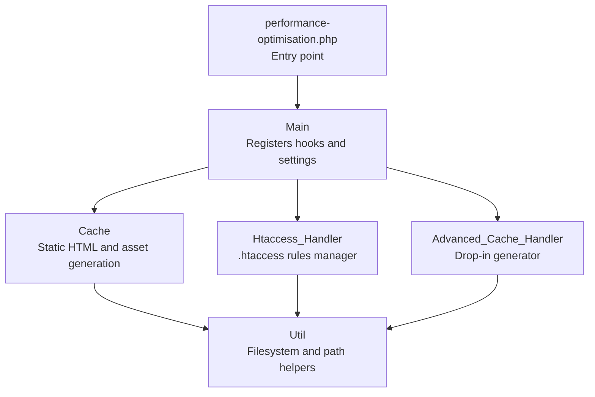
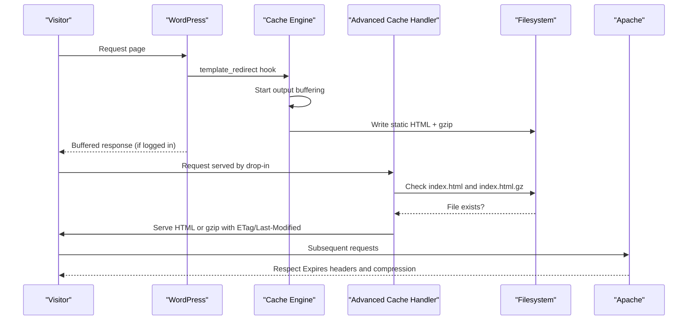
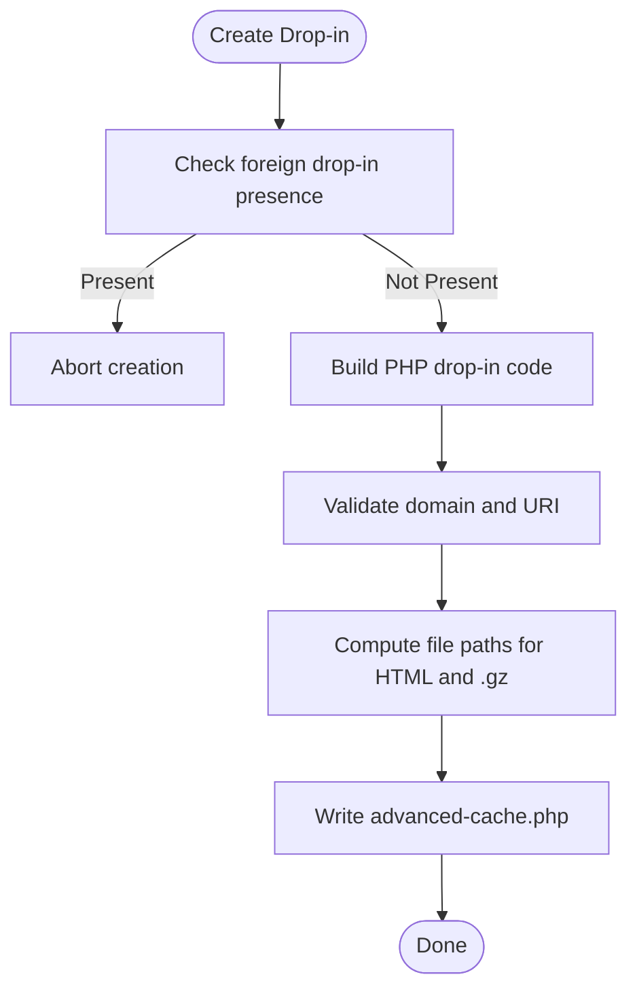
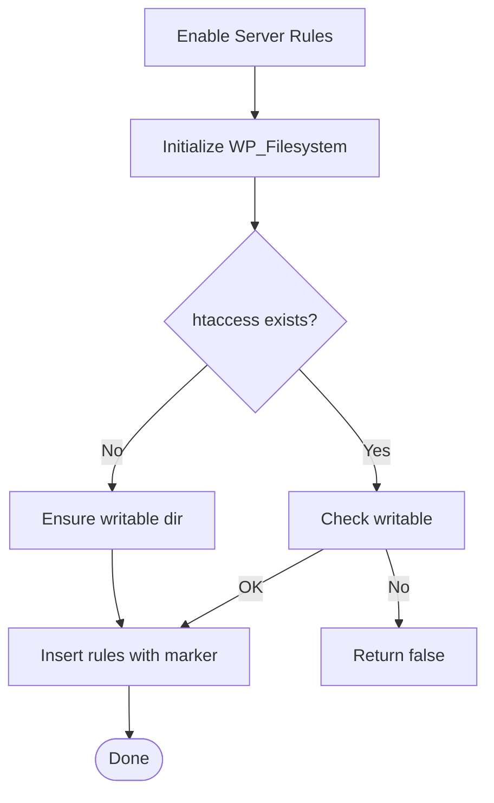
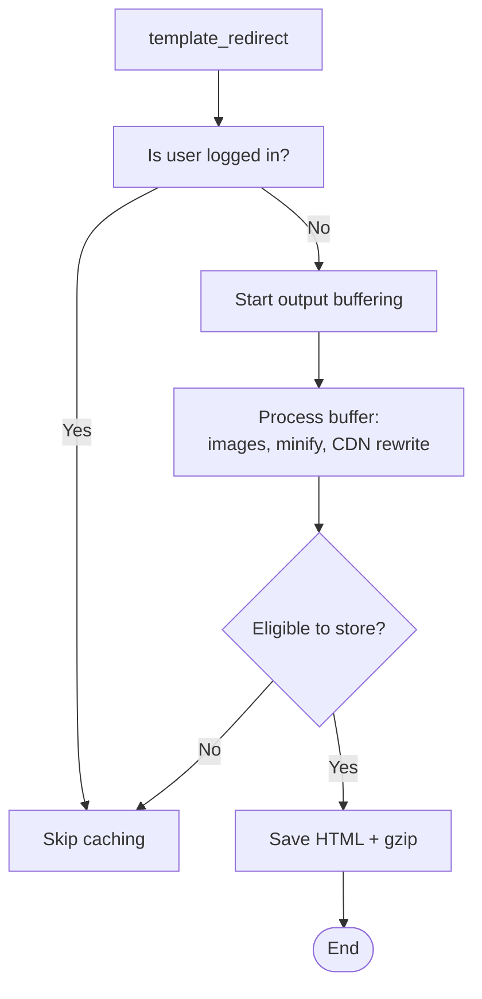
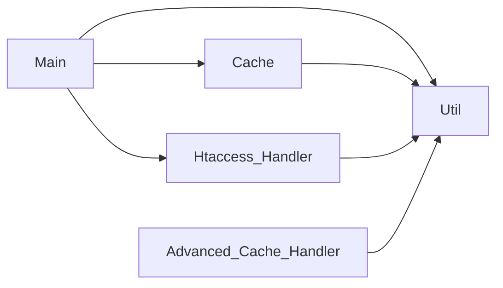

# Advanced Cache Handler

<cite>
**Referenced Files in This Document**
- [performance-optimisation.php](file://performance-optimisation.php)
- [class-main.php](file://includes/class-main.php)
- [class-advanced-cache-handler.php](file://includes/class-advanced-cache-handler.php)
- [class-htaccess-handler.php](file://includes/class-htaccess-handler.php)
- [class-cache.php](file://includes/class-cache.php)
- [class-util.php](file://includes/class-util.php)
- [readme.txt](file://readme.txt)
</cite>

## Table of Contents
1. [Introduction](#introduction)
2. [Project Structure](#project-structure)
3. [Core Components](#core-components)
4. [Architecture Overview](#architecture-overview)
5. [Detailed Component Analysis](#detailed-component-analysis)
6. [Dependency Analysis](#dependency-analysis)
7. [Performance Considerations](#performance-considerations)
8. [Troubleshooting Guide](#troubleshooting-guide)
9. [Conclusion](#conclusion)

## Introduction
This document explains the advanced cache handler functionality and .htaccess modifications implemented by the plugin. It covers server-level caching optimizations, URL rewriting rules, integration with web server configurations, and the relationship between plugin-level caching and server-level optimizations. It also documents the .htaccess generation process, cache header management, browser caching directives, and compatibility considerations.

## Project Structure
The plugin organizes performance-related features across dedicated classes:
- Entry point initializes the plugin and registers core functionality.
- Main orchestrates hooks, settings, and integrates cache and server rule management.
- Advanced cache handler provides a lightweight server-side drop-in for serving static HTML with gzip support.
- Htaccess handler automates Apache server rules for compression and browser caching.
- Cache engine generates and stores static HTML and minified assets.
- Utilities provide shared helpers for filesystem operations and path/url processing.

**Diagram sources**
- [performance-optimisation.php:40-44](file://performance-optimisation.php#L40-L44)
- [class-main.php:128-154](file://includes/class-main.php#L128-L154)
- [class-advanced-cache-handler.php:25](file://includes/class-advanced-cache-handler.php#L25-L25)
- [class-htaccess-handler.php:25](file://includes/class-htaccess-handler.php#L25-L25)
- [class-cache.php:32](file://includes/class-cache.php#L32-L32)
- [class-util.php:29](file://includes/class-util.php#L29-L29)

**Section sources**
- [performance-optimisation.php:40-44](file://performance-optimisation.php#L40-L44)
- [class-main.php:128-154](file://includes/class-main.php#L128-L154)

## Core Components
- Advanced Cache Handler: Creates and removes an advanced-cache.php drop-in that serves static HTML and gzip-compressed content for anonymous users, with ETag and Last-Modified support and 304 Not Modified handling.
- Htaccess Handler: Adds Apache rules for Gzip/Deflate compression and browser caching via insert_with_markers, scoped to a plugin-specific marker.
- Cache Engine: Generates static HTML pages, minifies CSS/JS, combines CSS, and stores compressed files with gzip variants.
- Utilities: Provide filesystem initialization, cache directory preparation, URL normalization, and preload link generation.

**Section sources**
- [class-advanced-cache-handler.php:25-221](file://includes/class-advanced-cache-handler.php#L25-L221)
- [class-htaccess-handler.php:25-141](file://includes/class-htaccess-handler.php#L25-L141)
- [class-cache.php:32-755](file://includes/class-cache.php#L32-L755)
- [class-util.php:29-251](file://includes/class-util.php#L29-L251)

## Architecture Overview
The plugin integrates server-level optimizations with WordPress hooks:
- On template_redirect, the Cache engine starts output buffering and writes static HTML to disk.
- For anonymous users, the Advanced Cache Handler drop-in serves pre-generated HTML and gzip files directly from the filesystem.
- The Htaccess Handler appends Apache rules for compression and caching when enabled in settings.
- CDN rewriting can transform asset URLs to a configured CDN domain for wp-content and wp-includes resources.

**Diagram sources**
- [class-main.php:175-177](file://includes/class-main.php#L175-L177)
- [class-cache.php:260-308](file://includes/class-cache.php#L260-L308)
- [class-advanced-cache-handler.php:104-191](file://includes/class-advanced-cache-handler.php#L104-L191)
- [class-htaccess-handler.php:42-74](file://includes/class-htaccess-handler.php#L42-L74)

## Detailed Component Analysis

### Advanced Cache Handler
Purpose:
- Provides a lightweight server-side drop-in to serve cached HTML and gzip-compressed content for anonymous users.
- Implements ETag and Last-Modified headers and 304 Not Modified responses to reduce bandwidth and CPU.

Key behaviors:
- Detects whether an existing advanced-cache.php belongs to another plugin and avoids overwriting it.
- Generates a PHP drop-in that:
  - Sanitizes and validates HTTP_HOST and REQUEST_URI to prevent path traversal.
  - Builds cache file paths under wp-content/cache/wppo/<domain>/<path>/index.html.
  - Serves gzip-compressed files when present and available.
  - Sets Content-Type, Content-Encoding, Last-Modified, ETag, and handles conditional requests.
- Supports removal of the drop-in when disabled.

**Diagram sources**
- [class-advanced-cache-handler.php:80-114](file://includes/class-advanced-cache-handler.php#L80-L114)
- [class-advanced-cache-handler.php:104-191](file://includes/class-advanced-cache-handler.php#L104-L191)

**Section sources**
- [class-advanced-cache-handler.php:25-221](file://includes/class-advanced-cache-handler.php#L25-L221)

### Htaccess Handler
Purpose:
- Automates Apache server rules for Gzip/Deflate compression and browser caching via insert_with_markers.
- Writes rules outside the WordPress core section to avoid conflicts during permalink updates.

Generated rules:
- Compression (mod_deflate): Applies to HTML, CSS, JavaScript, XML, fonts, and icons.
- Browser caching (mod_expires): Sets default cache for 2 days, zero for HTML, and one year for static assets.

**Diagram sources**
- [class-htaccess-handler.php:42-74](file://includes/class-htaccess-handler.php#L42-L74)
- [class-htaccess-handler.php:82-138](file://includes/class-htaccess-handler.php#L82-L138)

**Section sources**
- [class-htaccess-handler.php:25-141](file://includes/class-htaccess-handler.php#L25-L141)

### Cache Engine
Purpose:
- Generates static HTML pages for anonymous users and minifies/compresses assets.
- Supports CDN rewriting for wp-content and wp-includes resources.

Key behaviors:
- Starts output buffering on template_redirect for non-logged-in users and non-404 pages.
- Processes buffer through image optimization, optional minification, and CDN rewriting.
- Saves both uncompressed and gzip-compressed files.
- Determines eligibility for caching based on domain, query string, and preload settings.
- Provides granular cache invalidation for edited posts, home page, and related archives.

**Diagram sources**
- [class-main.php:175-177](file://includes/class-main.php#L175-L177)
- [class-cache.php:260-308](file://includes/class-cache.php#L260-L308)
- [class-cache.php:470-483](file://includes/class-cache.php#L470-L483)
- [class-cache.php:492-536](file://includes/class-cache.php#L492-L536)

**Section sources**
- [class-cache.php:32-755](file://includes/class-cache.php#L32-L755)

### Utilities
Purpose:
- Provide shared helpers for filesystem operations, cache directory preparation, URL normalization, and preload link generation.

Highlights:
- prepare_cache_dir: Recursively creates cache directories with proper permissions.
- init_filesystem: Initializes WP_Filesystem with fallback.
- get_local_path: Converts URLs to local filesystem paths safely.
- process_urls: Normalizes and deduplicates lists of URLs.
- generate_preload_link: Outputs sanitized preload/link tags.

**Section sources**
- [class-util.php:29-251](file://includes/class-util.php#L29-L251)

## Dependency Analysis
- Main depends on Cache, Htaccess_Handler, and Util for orchestration and filesystem operations.
- Advanced_Cache_Handler depends on Util for filesystem initialization and path handling.
- Htaccess_Handler depends on Util for filesystem initialization and WordPress file APIs.
- Cache depends on Util for filesystem operations and URL/path normalization.

**Diagram sources**
- [class-main.php:128-154](file://includes/class-main.php#L128-L154)
- [class-advanced-cache-handler.php:53-114](file://includes/class-advanced-cache-handler.php#L53-L114)
- [class-htaccess-handler.php:53-74](file://includes/class-htaccess-handler.php#L53-L74)
- [class-cache.php:118-120](file://includes/class-cache.php#L118-L120)

**Section sources**
- [class-main.php:128-154](file://includes/class-main.php#L128-L154)
- [class-advanced-cache-handler.php:53-114](file://includes/class-advanced-cache-handler.php#L53-L114)
- [class-htaccess-handler.php:53-74](file://includes/class-htaccess-handler.php#L53-L74)
- [class-cache.php:118-120](file://includes/class-cache.php#L118-L120)

## Performance Considerations
- Server-level caching reduces PHP processing by serving static HTML and gzip-compressed content directly from the filesystem for anonymous users.
- Compression (Gzip/Deflate) reduces payload sizes for HTML, CSS, JS, and fonts.
- Browser caching headers minimize repeated downloads of static assets.
- Output buffering and minification reduce bandwidth and improve perceived performance.
- CDN rewriting can offload static assets to a globally distributed network, reducing latency.

[No sources needed since this section provides general guidance]

## Troubleshooting Guide
Common issues and resolutions:
- .htaccess write failures:
  - Ensure the .htaccess file exists or the directory is writable.
  - Verify the web server has write permissions to the directory.
  - The plugin attempts to insert rules with a plugin-specific marker; conflicts with other plugins are avoided.
- Foreign advanced-cache.php present:
  - If another plugin or host owns advanced-cache.php, the plugin will not overwrite it and may show an admin notice.
- Cache not served:
  - Confirm the advanced-cache.php drop-in exists and is owned by the plugin.
  - Verify the cache directory exists and is writable.
  - Check that the request is for an anonymous user and the URL path is eligible for caching.
- CDN rewriting not applied:
  - Ensure CDN URL is configured and the HTML contains wp-content or wp-includes resources.
  - Verify WordPress HTML tag processor is available.
- Settings rollback on .htaccess failure:
  - When enabling server rules fails, the plugin reverts the setting and displays an admin notice.

**Section sources**
- [class-htaccess-handler.php:59-65](file://includes/class-htaccess-handler.php#L59-L65)
- [class-advanced-cache-handler.php:80-94](file://includes/class-advanced-cache-handler.php#L80-L94)
- [class-main.php:250-277](file://includes/class-main.php#L250-L277)
- [readme.txt:215-216](file://readme.txt#L215-L216)

## Conclusion
The plugin provides a layered approach to performance optimization:
- Plugin-level caching generates static HTML and minified assets, with CDN rewriting for wp-content and wp-includes resources.
- Server-level caching serves pre-generated HTML and gzip-compressed content directly from the filesystem for anonymous users.
- Apache server rules automate Gzip/Deflate compression and browser caching via .htaccess.
These optimizations integrate seamlessly with WordPress hooks and settings, offering significant performance gains when configured appropriately.

[No sources needed since this section summarizes without analyzing specific files]