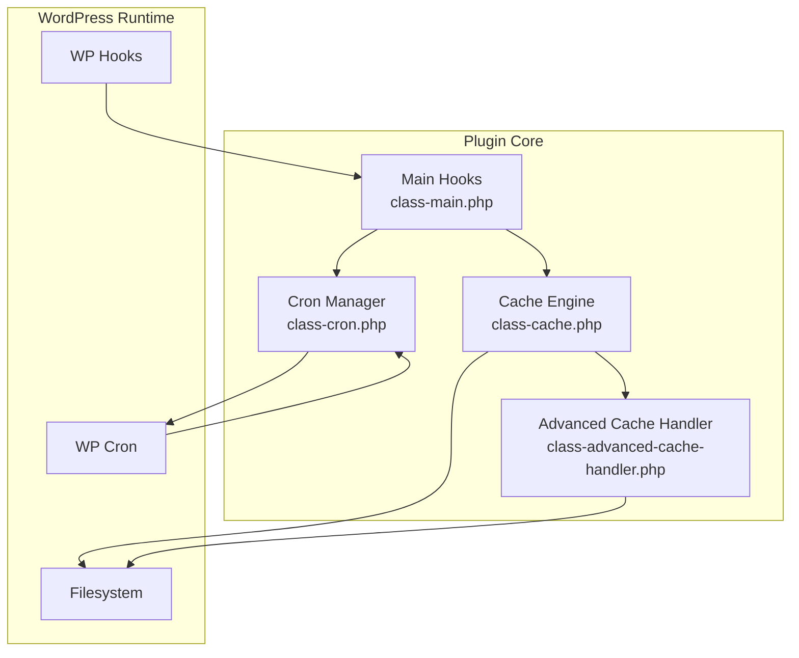
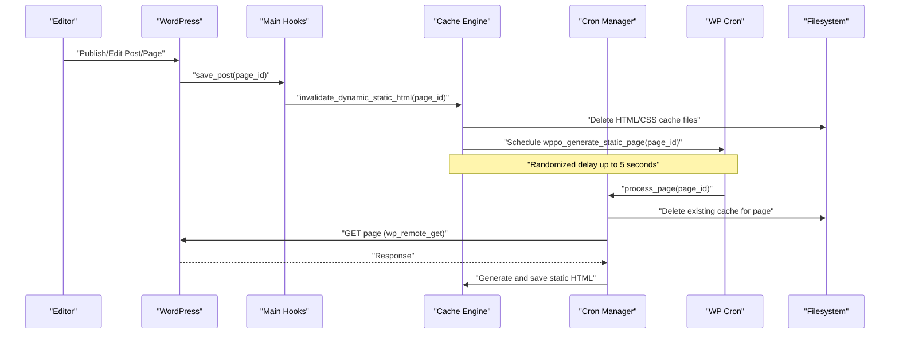
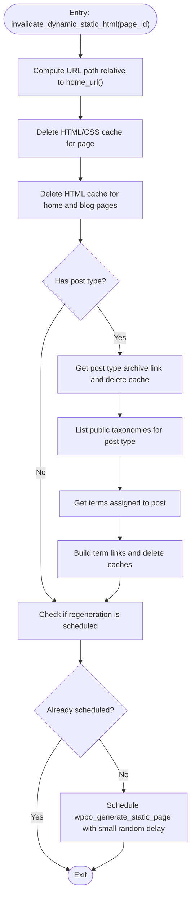
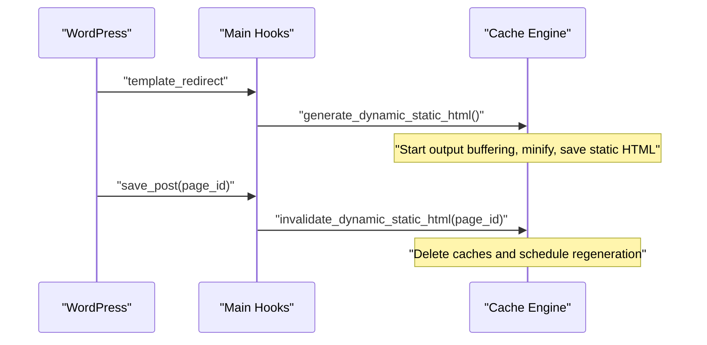
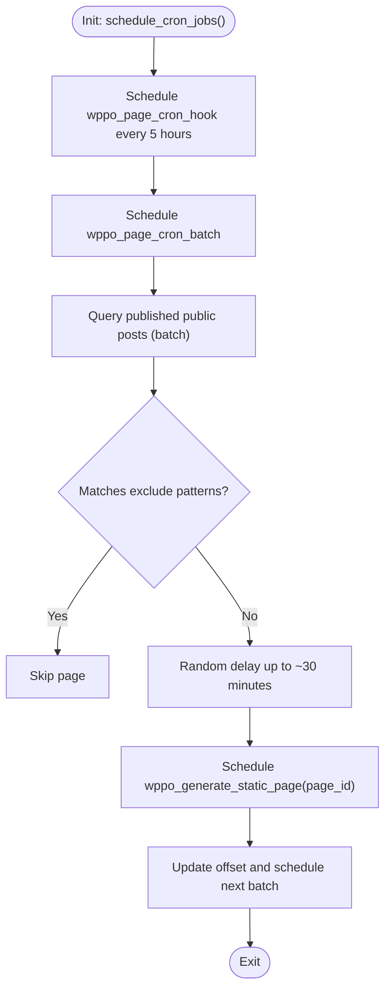
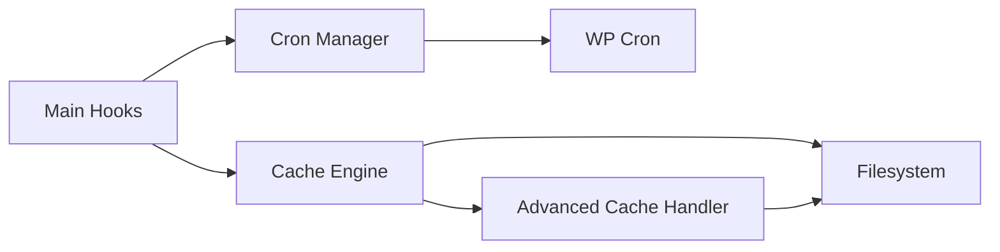

# Cache Invalidation Strategies

<cite>
**Referenced Files in This Document**
- [class-cache.php](file://includes/class-cache.php)
- [class-cron.php](file://includes/class-cron.php)
- [class-main.php](file://includes/class-main.php)
- [class-advanced-cache-handler.php](file://includes/class-advanced-cache-handler.php)
- [readme.txt](file://readme.txt)
- [ROADMAP.md](file://ROADMAP.md)
</cite>

## Table of Contents
1. [Introduction](#introduction)
2. [Project Structure](#project-structure)
3. [Core Components](#core-components)
4. [Architecture Overview](#architecture-overview)
5. [Detailed Component Analysis](#detailed-component-analysis)
6. [Dependency Analysis](#dependency-analysis)
7. [Performance Considerations](#performance-considerations)
8. [Troubleshooting Guide](#troubleshooting-guide)
9. [Conclusion](#conclusion)

## Introduction
This document explains the cache invalidation mechanisms and smart purging strategies implemented in the plugin. It focuses on the invalidate_dynamic_static_html method, smart purging for home pages, archives, and related content, and the extended purging for taxonomies and post types. It also documents the relationship with WordPress hooks, cron job scheduling for cache regeneration, and conditional invalidation based on settings. Examples of invalidation triggers for posts, pages, categories, and custom post types are provided, along with the random delay mechanism for cache regeneration, performance impact of invalidation, and best practices for maintaining cache freshness.

## Project Structure
The cache invalidation and regeneration logic spans several core files:
- Cache generation and invalidation: [class-cache.php](file://includes/class-cache.php)
- Cron scheduling and regeneration: [class-cron.php](file://includes/class-cron.php)
- Hook registration and integration: [class-main.php](file://includes/class-main.php)
- Advanced cache handler for static HTML serving: [class-advanced-cache-handler.php](file://includes/class-advanced-cache-handler.php)
- Plugin overview and feature highlights: [readme.txt](file://readme.txt)
- Roadmap and planned enhancements: [ROADMAP.md](file://ROADMAP.md)

**Diagram sources**
- [class-main.php:175-177](file://includes/class-main.php#L175-L177)
- [class-cache.php:260-310](file://includes/class-cache.php#L260-L310)
- [class-cron.php:42-52](file://includes/class-cron.php#L42-L52)
- [class-advanced-cache-handler.php:112-141](file://includes/class-advanced-cache-handler.php#L112-L141)

**Section sources**
- [class-main.php:175-177](file://includes/class-main.php#L175-L177)
- [class-cache.php:260-310](file://includes/class-cache.php#L260-L310)
- [class-cron.php:42-52](file://includes/class-cron.php#L42-L52)
- [class-advanced-cache-handler.php:112-141](file://includes/class-advanced-cache-handler.php#L112-L141)

## Core Components
- Dynamic static HTML generation and caching: The Cache engine generates and serves static HTML for eligible pages and applies minification and CDN rewriting when configured.
- Invalidation and smart purging: The invalidate_dynamic_static_html method clears caches for the edited page, the home/blog archives, and related taxonomy/post-type archives.
- Regeneration scheduling: The Cron manager schedules background regeneration of static pages with randomized delays to distribute load.
- Hook integration: The Main class registers hooks to trigger generation on template_redirect and invalidation on save_post.

Key responsibilities:
- Cache::generate_dynamic_static_html: Starts output buffering to capture and minify content, then saves static HTML and optional CSS.
- Cache::invalidate_dynamic_static_html: Purges the edited page’s cache, home/blog archives, and related archives; schedules regeneration.
- Cron::schedule_cron_jobs: Schedules periodic regeneration and batched per-page regeneration with randomized delays.
- Hook wiring: Main registers template_redirect for generation and save_post for invalidation.

**Section sources**
- [class-cache.php:260-310](file://includes/class-cache.php#L260-L310)
- [class-cache.php:546-598](file://includes/class-cache.php#L546-L598)
- [class-cron.php:79-91](file://includes/class-cron.php#L79-L91)
- [class-cron.php:113-184](file://includes/class-cron.php#L113-L184)
- [class-main.php:175-177](file://includes/class-main.php#L175-L177)

## Architecture Overview
The invalidation and regeneration pipeline integrates WordPress hooks, the filesystem, and WP Cron.

**Diagram sources**
- [class-main.php:175-177](file://includes/class-main.php#L175-L177)
- [class-cache.php:546-598](file://includes/class-cache.php#L546-L598)
- [class-cron.php:222-227](file://includes/class-cron.php#L222-L227)
- [class-cron.php:274-279](file://includes/class-cron.php#L274-L279)

## Detailed Component Analysis

### invalidate_dynamic_static_html Method
Purpose:
- Invalidate the dynamic static HTML cache for a specific page and related global and taxonomy archives.
- Trigger background regeneration with a small random delay.

Behavior:
- Compute the page’s URL path relative to the site URL and delete both HTML and CSS cache files.
- Always purge the home page and the blog page (if the front page is set to a page).
- If the post type has a public archive, purge that archive.
- For each public taxonomy associated with the post type, purge term archives for terms assigned to the post.
- Schedule a single event to regenerate the page’s static HTML with a random delay up to a small window.

Smart purging scope:
- Home page and blog archive: Ensures the front page and latest posts page reflect recent edits.
- Post type archive: Keeps archive pages fresh for the edited post type.
- Taxonomy term archives: Keeps category/tag and custom taxonomy term pages up to date.

Regeneration scheduling:
- Uses a small random delay to avoid thundering herd effects when multiple posts are edited in quick succession.

**Diagram sources**
- [class-cache.php:546-598](file://includes/class-cache.php#L546-L598)

**Section sources**
- [class-cache.php:546-598](file://includes/class-cache.php#L546-L598)

### Smart Purging for Home Pages, Archives, and Related Content
Scope:
- Home page: Always invalidated to reflect recent content changes.
- Blog page: Invalidated when the front page is set to a page displaying latest posts.
- Post type archives: Invalidated when the edited post belongs to a post type with a public archive.
- Taxonomy term archives: Invalidated for each public taxonomy term assigned to the edited post.

Examples of invalidation triggers:
- Posts: Editing a post invalidates the post’s cache, home/blog archives, and related archives.
- Pages: Editing a page invalidates the page’s cache and home/blog archives.
- Categories: Editing a post assigned to a category invalidates the category archive cache.
- Custom post types: Editing a post in a custom post type invalidates the post type archive and related taxonomy term archives.

**Section sources**
- [class-cache.php:554-593](file://includes/class-cache.php#L554-L593)

### Extended Purging for Taxonomies and Post Types
Mechanism:
- Detects the post type of the edited post.
- Retrieves the post type archive link and deletes the cache for that archive.
- Iterates through public taxonomies associated with the post type.
- For each taxonomy, retrieves terms assigned to the post and deletes caches for each term’s archive.

Benefits:
- Keeps archive pages accurate without requiring global cache invalidation.
- Reduces unnecessary regeneration of unrelated pages.

**Section sources**
- [class-cache.php:566-593](file://includes/class-cache.php#L566-L593)

### Relationship with WordPress Hooks
Hook registration:
- template_redirect: Triggers Cache::generate_dynamic_static_html to capture and save static HTML for eligible pages.
- save_post: Triggers Cache::invalidate_dynamic_static_html to invalidate caches for the edited post and related archives.

Integration:
- Main class wires these hooks and also registers Cron and other subsystems.

**Diagram sources**
- [class-main.php:175-177](file://includes/class-main.php#L175-L177)
- [class-cache.php:260-310](file://includes/class-cache.php#L260-L310)
- [class-cache.php:546-598](file://includes/class-cache.php#L546-L598)

**Section sources**
- [class-main.php:175-177](file://includes/class-main.php#L175-L177)

### Cron Job Scheduling for Cache Regeneration
Scheduling:
- Periodic regeneration: A main hook runs every five hours to trigger batched regeneration.
- Batched per-page regeneration: Queries published public post types in batches, skipping excluded URLs, and schedules a single regeneration event per page with a larger random delay window.

Random delay mechanism:
- Small random delay (up to a few seconds) for immediate invalidation-triggered regeneration.
- Larger random delay (up to ~30 minutes) for batched regeneration to distribute load across time.

Background regeneration:
- process_page loads the page via HTTP to regenerate static HTML and removes any existing cached files for that page.

**Diagram sources**
- [class-cron.php:79-91](file://includes/class-cron.php#L79-L91)
- [class-cron.php:113-184](file://includes/class-cron.php#L113-L184)
- [class-cron.php:222-227](file://includes/class-cron.php#L222-L227)

**Section sources**
- [class-cron.php:79-91](file://includes/class-cron.php#L79-L91)
- [class-cron.php:113-184](file://includes/class-cron.php#L113-L184)
- [class-cron.php:222-227](file://includes/class-cron.php#L222-L227)

### Conditional Invalidation Based on Settings
Conditions:
- Cache storage eligibility: The Cache engine checks various conditions (e.g., not logged in, not a 404, not a query string with specific parameters, and whether preloading is enabled and not excluded) before storing cache files.
- Exclusions: Preload exclusion patterns are processed to avoid caching certain URLs.

Implications:
- Invalidation respects the same conditions that govern caching, ensuring that pages that are not cached are not unnecessarily invalidated.
- Exclusion patterns influence both caching eligibility and regeneration scheduling.

**Section sources**
- [class-cache.php:492-536](file://includes/class-cache.php#L492-L536)
- [class-cron.php:140-175](file://includes/class-cron.php#L140-L175)

### Serving Static HTML with Advanced Cache Handler
Static HTML serving:
- The advanced cache handler locates the static HTML file for the current request and serves it directly if available, bypassing the full WordPress boot process.

Integration:
- The Cache engine writes static HTML files to the cache directory; the advanced cache handler reads them for fast delivery.

**Section sources**
- [class-advanced-cache-handler.php:112-141](file://includes/class-advanced-cache-handler.php#L112-L141)

## Dependency Analysis
- Main depends on Cache and Cron to wire hooks and manage lifecycle.
- Cache depends on the filesystem for reading/writing cache files and on WordPress APIs for permalinks and taxonomy links.
- Cron depends on WP Cron to schedule regeneration events and on WordPress APIs to enumerate posts and apply exclusions.
- Advanced Cache Handler depends on the filesystem and WordPress constants to locate and serve static files.

**Diagram sources**
- [class-main.php:175-177](file://includes/class-main.php#L175-L177)
- [class-cache.php:470-483](file://includes/class-cache.php#L470-L483)
- [class-cron.php:42-52](file://includes/class-cron.php#L42-L52)
- [class-advanced-cache-handler.php:112-141](file://includes/class-advanced-cache-handler.php#L112-L141)

**Section sources**
- [class-main.php:175-177](file://includes/class-main.php#L175-L177)
- [class-cache.php:470-483](file://includes/class-cache.php#L470-L483)
- [class-cron.php:42-52](file://includes/class-cron.php#L42-L52)
- [class-advanced-cache-handler.php:112-141](file://includes/class-advanced-cache-handler.php#L112-L141)

## Performance Considerations
- Output buffering and minification: The Cache engine buffers output, applies minification and CDN rewriting, and saves both HTML and compressed variants. This reduces server load and improves delivery performance.
- Randomized delays: Both immediate invalidation-triggered regeneration and batched regeneration use random delays to avoid spikes in traffic and server load.
- Batched regeneration: Processing posts in batches prevents memory exhaustion and distributes load over time.
- Conditional caching: Eligibility checks ensure that non-cacheable pages (e.g., logged-in users, 404s, query strings) are not cached, avoiding wasted effort.
- Static HTML serving: The advanced cache handler serves static files directly, minimizing WordPress boot overhead.

Best practices:
- Prefer granular invalidation over global cache clearing to minimize unnecessary regeneration.
- Use exclusion patterns for URLs that should not be cached or regenerated.
- Monitor cache size and regeneration throughput to adjust batch sizes and delays as needed.
- Keep the plugin updated to benefit from performance improvements and security hardening.

[No sources needed since this section provides general guidance]

## Troubleshooting Guide
Common issues and remedies:
- Cache not updating after edits:
  - Verify that the page is eligible for caching (not logged in, not a 404, not excluded).
  - Confirm that the invalidation hook fired and that regeneration was scheduled.
  - Check filesystem permissions for the cache directory.
- Excessive regeneration load:
  - Adjust batch sizes and random delay ranges in cron scheduling.
  - Review exclusion patterns to avoid regenerating unnecessary pages.
- Static HTML not served:
  - Ensure the advanced cache handler is active and the cache file exists.
  - Verify that the request path matches the cache directory structure.

**Section sources**
- [class-cache.php:492-536](file://includes/class-cache.php#L492-L536)
- [class-cron.php:113-184](file://includes/class-cron.php#L113-L184)
- [class-advanced-cache-handler.php:112-141](file://includes/class-advanced-cache-handler.php#L112-L141)

## Conclusion
The plugin implements a robust cache invalidation and regeneration system centered around invalidate_dynamic_static_html and WP Cron. Smart purging ensures that only relevant pages are invalidated and regenerated, while randomized delays distribute load and maintain responsiveness. The system integrates cleanly with WordPress hooks and filesystem operations, and the roadmap outlines continued enhancements for cache invalidation and object caching.

[No sources needed since this section summarizes without analyzing specific files]