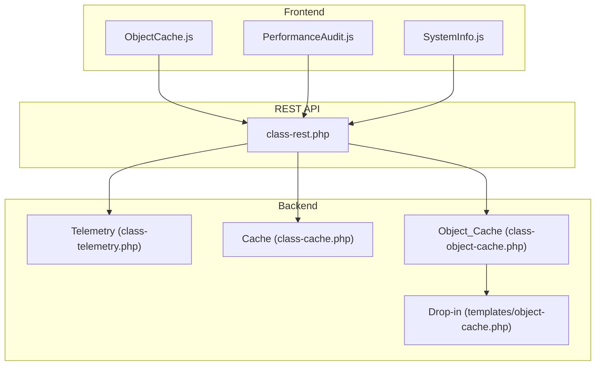
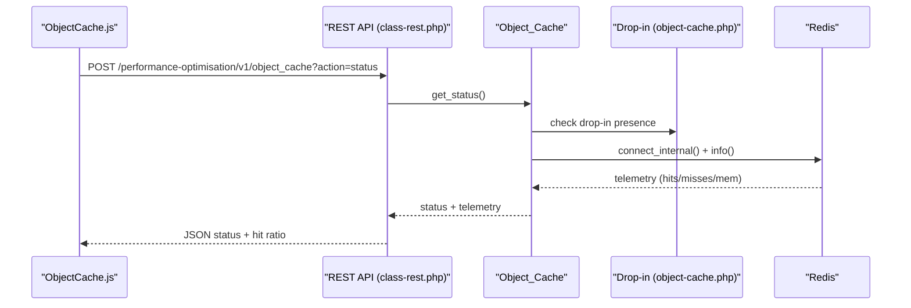
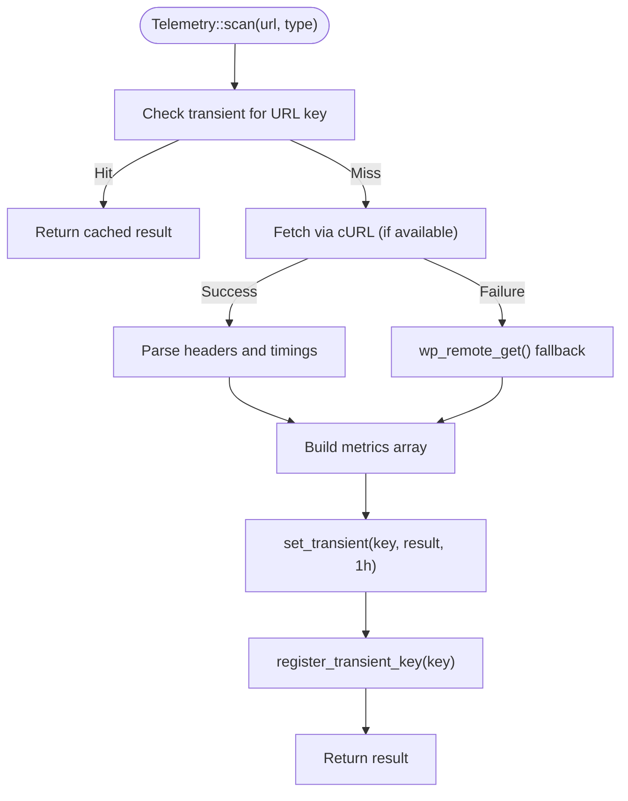
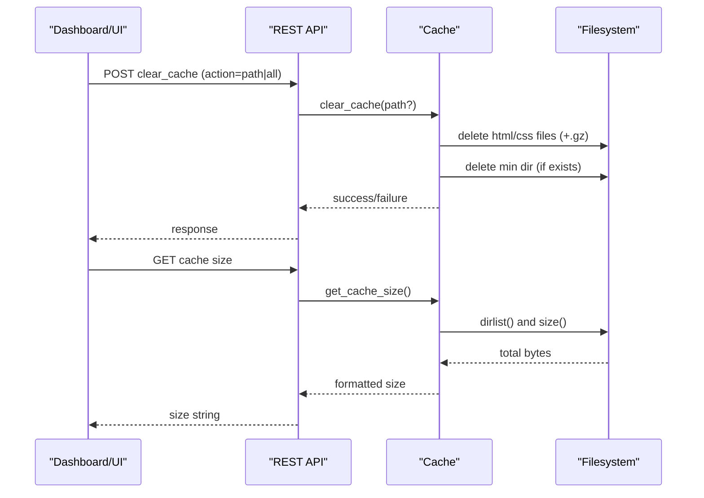
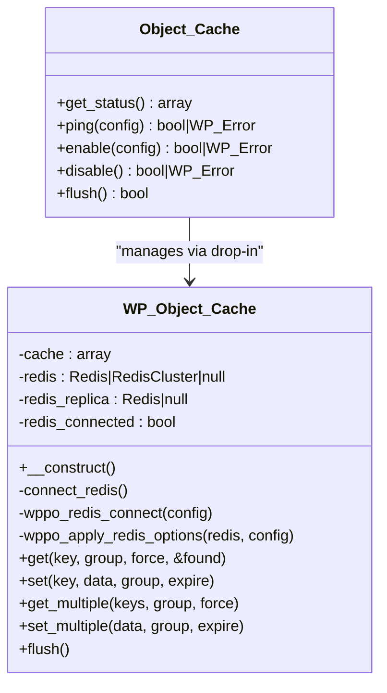
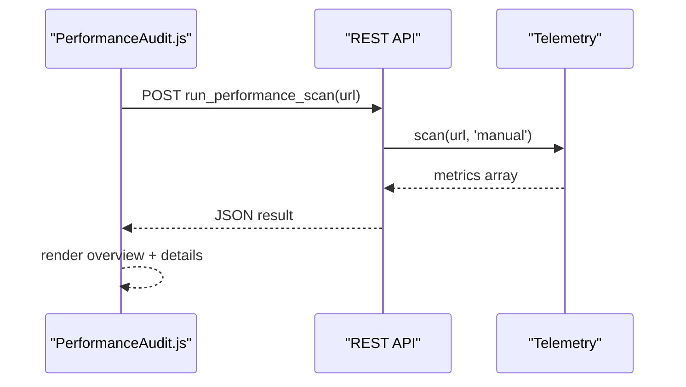
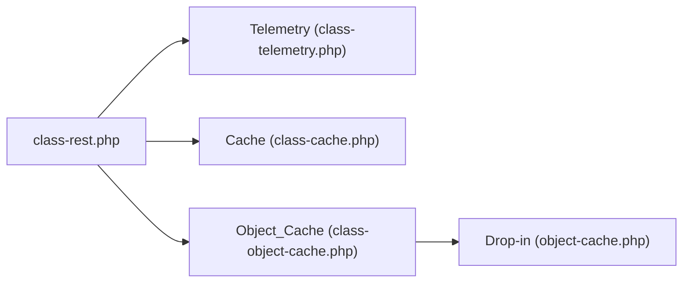

# Cache Performance Monitoring

<cite>
**Referenced Files in This Document**
- [class-telemetry.php](file://includes/class-telemetry.php)
- [class-cache.php](file://includes/class-cache.php)
- [class-object-cache.php](file://includes/class-object-cache.php)
- [object-cache.php](file://templates/object-cache.php)
- [class-rest.php](file://includes/class-rest.php)
- [ObjectCache.js](file://src/components/ObjectCache.js)
- [PerformanceAudit.js](file://src/components/PerformanceAudit.js)
- [SystemInfo.js](file://src/components/SystemInfo.js)
</cite>

## Table of Contents
1. [Introduction](#introduction)
2. [Project Structure](#project-structure)
3. [Core Components](#core-components)
4. [Architecture Overview](#architecture-overview)
5. [Detailed Component Analysis](#detailed-component-analysis)
6. [Dependency Analysis](#dependency-analysis)
7. [Performance Considerations](#performance-considerations)
8. [Troubleshooting Guide](#troubleshooting-guide)
9. [Conclusion](#conclusion)

## Introduction
This document explains how the plugin monitors and measures cache performance across three layers: HTTP/telemetry scans, static file cache generation, and Redis object caching. It covers cache hit rate telemetry, cache size tracking, performance impact measurement, and practical guidance for debugging and optimization.

## Project Structure
The cache performance monitoring spans backend PHP classes, a Redis drop-in, and a React dashboard:
- Telemetry: HTTP performance scans with granular timings and asset analysis
- Static cache: Combined/minified CSS, static HTML generation, CDN rewriting, and purge logic
- Object cache: Redis drop-in with connection management, telemetry, and flush operations
- Frontend: React components for object cache status, performance audit, and system info

**Diagram sources**
- [class-rest.php:37-123](file://includes/class-rest.php#L37-L123)
- [class-telemetry.php:45-192](file://includes/class-telemetry.php#L45-L192)
- [class-cache.php:260-310](file://includes/class-cache.php#L260-L310)
- [class-object-cache.php:78-144](file://includes/class-object-cache.php#L78-L144)
- [object-cache.php:20-149](file://templates/object-cache.php#L20-L149)

**Section sources**
- [class-rest.php:37-123](file://includes/class-rest.php#L37-L123)

## Core Components
- Telemetry scanner: Measures page load time, TTFB, DNS/connect/SSL timings, and asset counts/sizes; caches results via transients with automatic indexing for bulk deletion.
- Static cache manager: Generates combined/minified CSS, static HTML, applies CDN rewriting, and supports smart purging and size reporting.
- Object cache manager: Installs/removes Redis drop-in, pings connectivity, collects Redis telemetry (hit ratio, memory usage, clients), and flushes cache.
- Frontend dashboards: Visualizes Redis hit ratio, memory usage, and cache size; runs performance scans and displays system info.

**Section sources**
- [class-telemetry.php:45-192](file://includes/class-telemetry.php#L45-L192)
- [class-cache.php:260-310](file://includes/class-cache.php#L260-L310)
- [class-object-cache.php:78-144](file://includes/class-object-cache.php#L78-L144)
- [ObjectCache.js:137-286](file://src/components/ObjectCache.js#L137-L286)
- [PerformanceAudit.js:31-486](file://src/components/PerformanceAudit.js#L31-L486)
- [SystemInfo.js:177-201](file://src/components/SystemInfo.js#L177-L201)

## Architecture Overview
The system exposes REST endpoints for UI actions and telemetry. Telemetry scans use cURL for granular timings and falls back to wp_remote_get(). Static cache generation hooks into output buffering and filesystem operations. Object cache integrates via a drop-in that wraps Redis operations and exposes telemetry via wp-content configuration.

**Diagram sources**
- [class-rest.php:636-695](file://includes/class-rest.php#L636-L695)
- [class-object-cache.php:78-144](file://includes/class-object-cache.php#L78-L144)
- [object-cache.php:78-149](file://templates/object-cache.php#L78-L149)

## Detailed Component Analysis

### Telemetry Scanner
- Purpose: Perform HTTP scans to collect performance metrics including load time, TTFB, DNS/connect/SSL timings, asset counts, and sizes.
- Caching: Results are cached in transients keyed by URL hash and registered in a master index for safe bulk deletion.
- Fallbacks: Uses cURL for granular timings and automatic content-encoding decoding; falls back to wp_remote_get() when cURL is unavailable.
- Metrics collected: load_time, ttfb, dns_lookup_time, connect_time, ssl_time, css/js/media counts and totals, compression/cache-control checks, modern image usage, alt attributes, robots.txt presence, HTTPS usage, and scan type.

**Diagram sources**
- [class-telemetry.php:45-192](file://includes/class-telemetry.php#L45-L192)
- [class-telemetry.php:524-542](file://includes/class-telemetry.php#L524-L542)

**Section sources**
- [class-telemetry.php:45-192](file://includes/class-telemetry.php#L45-L192)
- [class-telemetry.php:524-542](file://includes/class-telemetry.php#L524-L542)

### Static Cache Manager
- Purpose: Combine and minify CSS, generate static HTML, apply CDN rewriting, and manage cache lifecycle.
- Storage: Writes files under wp-content/cache/wppo/<domain>/<path>/index.html(.gz) with gzip compression.
- Purge: Supports single-page and full cache clear; smart purges home/blog archives and related terms/post types; clears transient cache keys for JS/CSS totals and cache size.
- Size tracking: Reports total cache size by walking the cache directory tree and summing file sizes.

**Diagram sources**
- [class-rest.php:145-175](file://includes/class-rest.php#L145-L175)
- [class-cache.php:647-726](file://includes/class-cache.php#L647-L726)

**Section sources**
- [class-cache.php:260-310](file://includes/class-cache.php#L260-L310)
- [class-cache.php:470-483](file://includes/class-cache.php#L470-L483)
- [class-cache.php:647-726](file://includes/class-cache.php#L647-L726)

### Object Cache Manager and Drop-in
- Purpose: Manage Redis object cache drop-in installation, connection, ping, and telemetry; expose flush operations.
- Telemetry: Collects Redis info including keyspace hits/misses for hit ratio computation, memory usage, client counts, version, and uptime.
- Drop-in: Implements WordPress object cache API with support for standalone, Sentinel, and Cluster modes; applies serialization/compression options; supports replica reads.

**Diagram sources**
- [class-object-cache.php:22-289](file://includes/class-object-cache.php#L22-L289)
- [object-cache.php:20-764](file://templates/object-cache.php#L20-L764)

**Section sources**
- [class-object-cache.php:78-144](file://includes/class-object-cache.php#L78-L144)
- [object-cache.php:78-149](file://templates/object-cache.php#L78-L149)
- [object-cache.php:431-459](file://templates/object-cache.php#L431-L459)

### Frontend Dashboards and Metrics
- Object Cache dashboard: Displays Redis telemetry (memory usage, hit ratio, active clients, version/uptime), compression options, TLS/persistence toggles, and actions (enable/disable/flush/ping).
- Performance Audit: Runs telemetry scans and presents user-friendly metrics and developer details (network timings, asset breakdown, environment).
- System Info: Aggregates PHP/DB/WP/server/cache details for diagnostics.

**Diagram sources**
- [PerformanceAudit.js:203-237](file://src/components/PerformanceAudit.js#L203-L237)
- [class-rest.php:804-819](file://includes/class-rest.php#L804-L819)
- [class-telemetry.php:45-192](file://includes/class-telemetry.php#L45-L192)

**Section sources**
- [ObjectCache.js:137-286](file://src/components/ObjectCache.js#L137-L286)
- [PerformanceAudit.js:31-486](file://src/components/PerformanceAudit.js#L31-L486)
- [SystemInfo.js:177-201](file://src/components/SystemInfo.js#L177-L201)

## Dependency Analysis
- REST endpoints depend on Telemetry, Cache, and Object_Cache classes.
- Object_Cache.get_status() depends on the drop-in presence and Redis connectivity; it queries Redis info for telemetry.
- Telemetry::scan() depends on cURL availability and WordPress HTTP APIs for fallback; results are cached via transients.
- Static cache depends on WordPress filesystem API and WordPress constants for paths.

**Diagram sources**
- [class-rest.php:37-123](file://includes/class-rest.php#L37-L123)
- [class-telemetry.php:45-192](file://includes/class-telemetry.php#L45-L192)
- [class-cache.php:260-310](file://includes/class-cache.php#L260-L310)
- [class-object-cache.php:78-144](file://includes/class-object-cache.php#L78-L144)
- [object-cache.php:20-149](file://templates/object-cache.php#L20-L149)

**Section sources**
- [class-rest.php:37-123](file://includes/class-rest.php#L37-L123)

## Performance Considerations
- Cache hit rate: Compute as keyspace_hits / (keyspace_hits + keyspace_misses) × 100. Monitor trends to detect cache pressure or misconfiguration.
- Cache size tracking: Use directory traversal to compute total bytes and format human-readable sizes. Periodically refresh to avoid stale values.
- Telemetry overhead: Transient caching prevents repeated expensive scans; transient index enables safe bulk deletion for long-running environments.
- Static cache benefits: Combined/minified CSS reduces requests and payload; gzip compression halves transfer size; CDN rewriting offloads bandwidth.
- Object cache benefits: Redis reduces database and PHP overhead; compression lowers memory footprint; persistent connections reduce handshake costs.

[No sources needed since this section provides general guidance]

## Troubleshooting Guide
- Object cache not enabled:
  - Check for foreign drop-in conflicts and missing PhpRedis extension.
  - Verify connection settings (host/port/password/database/nodes/master_name).
  - Use ping action to validate connectivity; inspect telemetry_error messages.
- Low cache hit ratio:
  - Review Redis memory usage and peak memory; consider increasing memory or tuning TTL/expiry.
  - Inspect non-persistent groups and global groups configuration.
- Slow page loads:
  - Use Performance Audit to identify bottlenecks (TTFB, DNS, connect, SSL).
  - Confirm compression and cache-control headers are enabled.
  - Check static cache size and ensure combined/minified assets are served.
- Cache not purging:
  - Trigger smart purge for home/blog archives and related terms/post types.
  - Clear transient cache keys for JS/CSS totals and cache size.

**Section sources**
- [class-object-cache.php:78-144](file://includes/class-object-cache.php#L78-L144)
- [class-rest.php:636-695](file://includes/class-rest.php#L636-L695)
- [PerformanceAudit.js:31-486](file://src/components/PerformanceAudit.js#L31-L486)
- [class-cache.php:647-726](file://includes/class-cache.php#L647-L726)

## Conclusion
The plugin provides a comprehensive cache performance monitoring stack: HTTP telemetry for end-to-end performance, static cache generation for asset delivery optimization, and Redis object caching with actionable telemetry. By tracking hit ratios, cache sizes, and performance metrics, operators can diagnose issues, optimize configurations, and improve overall site performance.