# Cache Storage and Management

<cite>
**Referenced Files in This Document**
- [class-cache.php](file://includes/class-cache.php)
- [class-advanced-cache-handler.php](file://includes/class-advanced-cache-handler.php)
- [class-cron.php](file://includes/class-cron.php)
- [class-database-cleanup.php](file://includes/class-database-cleanup.php)
- [class-util.php](file://includes/class-util.php)
- [class-main.php](file://includes/class-main.php)
- [class-object-cache.php](file://includes/class-object-cache.php)
- [class-css.php](file://includes/minify/class-css.php)
- [class-js.php](file://includes/minify/class-js.php)
- [class-html.php](file://includes/minify/class-html.php)
- [sentinel.md](file://.jules/sentinel.md)
- [ROADMAP.md](file://ROADMAP.md)
</cite>

## Table of Contents
1. [Introduction](#introduction)
2. [Project Structure](#project-structure)
3. [Core Components](#core-components)
4. [Architecture Overview](#architecture-overview)
5. [Detailed Component Analysis](#detailed-component-analysis)
6. [Dependency Analysis](#dependency-analysis)
7. [Performance Considerations](#performance-considerations)
8. [Troubleshooting Guide](#troubleshooting-guide)
9. [Conclusion](#conclusion)

## Introduction
This document explains the cache storage architecture and file management of the Performance Optimisation plugin. It covers the cache directory structure, file naming conventions, storage organization by domain and URL paths, the dual-file system with regular and gzip-compressed files, cache path resolution algorithms, filesystem operations, cache size calculation, directory traversal prevention, and security measures against malicious path injection. It also documents cache invalidation triggers, automated cleanup processes, examples of cache file locations, and storage optimization strategies.

## Project Structure
The cache-related functionality spans several core classes:
- Dynamic cache generation and serving: [class-cache.php](file://includes/class-cache.php)
- Static cache drop-in for early serving: [class-advanced-cache-handler.php](file://includes/class-advanced-cache-handler.php)
- Background tasks and scheduling: [class-cron.php](file://includes/class-cron.php)
- Filesystem utilities: [class-util.php](file://includes/class-util.php)
- Minification cache (separate from dynamic cache): [class-css.php](file://includes/minify/class-css.php), [class-js.php](file://includes/minify/class-js.php), [class-html.php](file://includes/minify/class-html.php)
- Object cache integration: [class-object-cache.php](file://includes/class-object-cache.php)
- Main entry hooks and lifecycle: [class-main.php](file://includes/class-main.php)

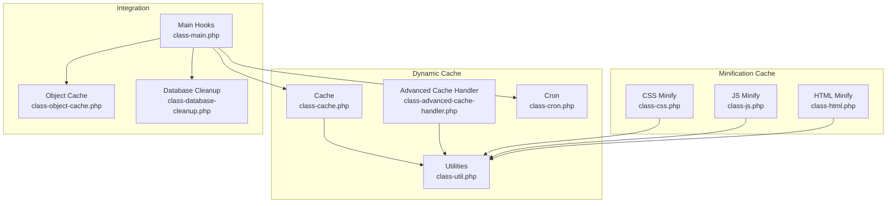

**Diagram sources**
- [class-cache.php:32-120](file://includes/class-cache.php#L32-L120)
- [class-advanced-cache-handler.php:25-120](file://includes/class-advanced-cache-handler.php#L25-L120)
- [class-cron.php:27-91](file://includes/class-cron.php#L27-L91)
- [class-util.php:29-80](file://includes/class-util.php#L29-L80)
- [class-css.php:23-55](file://includes/minify/class-css.php#L23-L55)
- [class-js.php:27-64](file://includes/minify/class-js.php#L27-L64)
- [class-html.php:32-68](file://includes/minify/class-html.php#L32-L68)
- [class-main.php:98-118](file://includes/class-main.php#L98-L118)
- [class-object-cache.php:22-62](file://includes/class-object-cache.php#L22-L62)
- [class-database-cleanup.php:30-60](file://includes/class-database-cleanup.php#L30-L60)

**Section sources**
- [class-cache.php:32-120](file://includes/class-cache.php#L32-L120)
- [class-advanced-cache-handler.php:25-120](file://includes/class-advanced-cache-handler.php#L25-L120)
- [class-cron.php:27-91](file://includes/class-cron.php#L27-L91)
- [class-util.php:29-80](file://includes/class-util.php#L29-L80)
- [class-css.php:23-55](file://includes/minify/class-css.php#L23-L55)
- [class-js.php:27-64](file://includes/minify/class-js.php#L27-L64)
- [class-html.php:32-68](file://includes/minify/class-html.php#L32-L68)
- [class-main.php:98-118](file://includes/class-main.php#L98-L118)
- [class-object-cache.php:22-62](file://includes/class-object-cache.php#L22-L62)
- [class-database-cleanup.php:30-60](file://includes/class-database-cleanup.php#L30-L60)

## Core Components
- Dynamic cache storage under the WordPress content directory with domain and URL path segmentation.
- Dual-file system: regular and gzip-compressed variants for every cached file.
- Path normalization and traversal prevention using strict checks on domain and URL path segments.
- Filesystem abstraction via WordPress Filesystem API for safe operations.
- Cache size calculation via recursive directory traversal.
- Automated cache invalidation on content changes and scheduled preloading.
- Separate minification cache for JS/CSS assets.

**Section sources**
- [class-cache.php:39-120](file://includes/class-cache.php#L39-L120)
- [class-cache.php:470-483](file://includes/class-cache.php#L470-L483)
- [class-cache.php:492-536](file://includes/class-cache.php#L492-L536)
- [class-cache.php:711-752](file://includes/class-cache.php#L711-L752)
- [class-advanced-cache-handler.php:129-141](file://includes/class-advanced-cache-handler.php#L129-L141)
- [class-css.php:126-133](file://includes/minify/class-css.php#L126-L133)
- [class-js.php:122-129](file://includes/minify/class-js.php#L122-L129)

## Architecture Overview
The cache architecture consists of:
- Dynamic cache: generated and served during normal HTTP requests, stored under a domain-specific path derived from the HTTP host and normalized request URI.
- Static cache drop-in: an early-serving handler placed in the content directory to serve cached pages before WordPress boots.
- Minification cache: separate cache for minified JS/CSS files, hashed by source path.
- Utilities: shared filesystem initialization and directory preparation helpers.
- Scheduling: cron jobs for preloading and periodic maintenance.

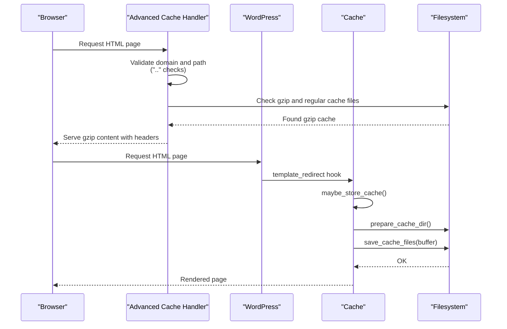

**Diagram sources**
- [class-advanced-cache-handler.php:129-187](file://includes/class-advanced-cache-handler.php#L129-L187)
- [class-cache.php:492-536](file://includes/class-cache.php#L492-L536)
- [class-cache.php:470-483](file://includes/class-cache.php#L470-L483)
- [class-cache.php:456-458](file://includes/class-cache.php#L456-L458)

## Detailed Component Analysis

### Dynamic Cache Storage and Serving
- Storage location: under the WordPress content directory, organized by domain and URL path segments.
- Naming convention: each URL path maps to a directory with an index file named by type (html, css).
- Dual-file system: both uncompressed and gzip-compressed variants are written.
- Path resolution: domain and URL path are normalized and validated to prevent traversal.
- Serving: the advanced cache drop-in serves gzip files when available and supported by the client.

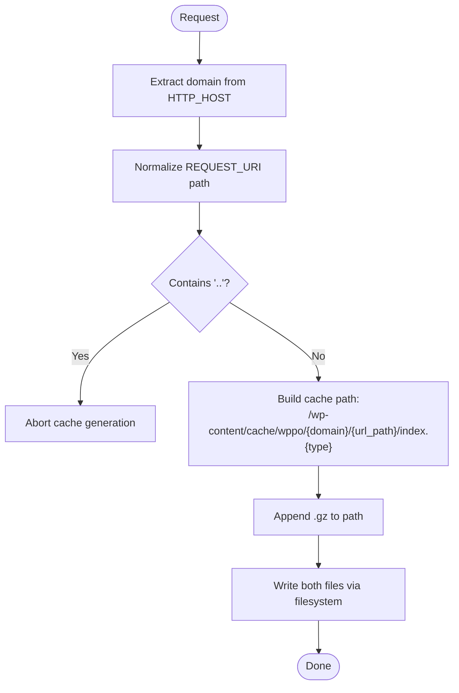

**Diagram sources**
- [class-cache.php:95-120](file://includes/class-cache.php#L95-L120)
- [class-cache.php:433-447](file://includes/class-cache.php#L433-L447)
- [class-cache.php:470-483](file://includes/class-cache.php#L470-L483)
- [class-advanced-cache-handler.php:126-141](file://includes/class-advanced-cache-handler.php#L126-L141)

**Section sources**
- [class-cache.php:39-120](file://includes/class-cache.php#L39-L120)
- [class-cache.php:433-447](file://includes/class-cache.php#L433-L447)
- [class-cache.php:470-483](file://includes/class-cache.php#L470-L483)
- [class-advanced-cache-handler.php:129-187](file://includes/class-advanced-cache-handler.php#L129-L187)

### Cache Directory Structure and Organization
- Root: WordPress content directory plus a fixed cache path segment.
- Domain segment: derived from the HTTP host, sanitized to remove traversal attempts.
- URL path segment: derived from the normalized request URI path, with traversal detection.
- File naming: index.html for HTML, index.css for combined CSS, with .gz variants.

Examples of cache file locations:
- Single-page cache: [get_cache_file_path():433-435](file://includes/class-cache.php#L433-L435)
- Combined CSS cache: [get_cache_file_path('css'):433-435](file://includes/class-cache.php#L433-L435)
- Minification cache: [get_cache_file_path():114-117](file://includes/minify/class-css.php#L114-L117)

**Section sources**
- [class-cache.php:433-435](file://includes/class-cache.php#L433-L435)
- [class-css.php:114-117](file://includes/minify/class-css.php#L114-L117)

### Dual-File System: Regular and Gzip
- Both regular and gzip-compressed files are written for every cached resource.
- Gzip compression uses maximum compression level.
- Serving prioritizes gzip when available and supported by the client.

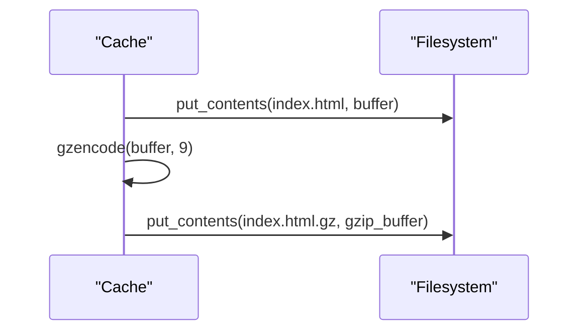

**Diagram sources**
- [class-cache.php:470-483](file://includes/class-cache.php#L470-L483)
- [class-css.php:126-133](file://includes/minify/class-css.php#L126-L133)
- [class-js.php:122-129](file://includes/minify/class-js.php#L122-L129)

**Section sources**
- [class-cache.php:470-483](file://includes/class-cache.php#L470-L483)
- [class-css.php:126-133](file://includes/minify/class-css.php#L126-L133)
- [class-js.php:122-129](file://includes/minify/class-js.php#L122-L129)

### Cache Path Resolution and Filesystem Operations
- Path resolution combines domain and URL path segments with a fixed cache root.
- Filesystem operations are performed via the WordPress Filesystem API initialized in utilities.
- Directory preparation ensures parent directories exist before writing.

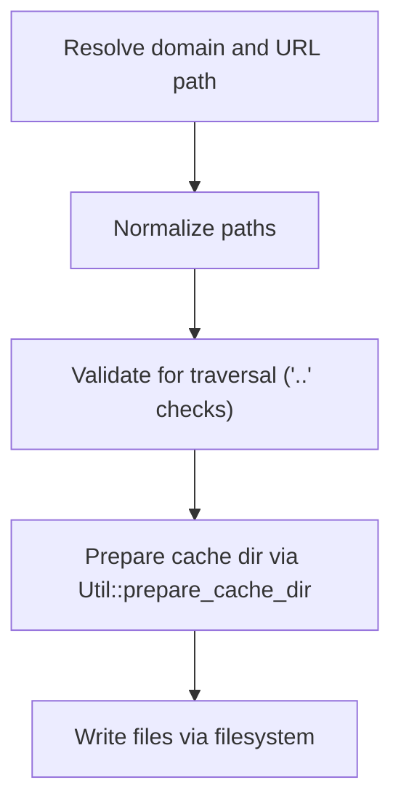

**Diagram sources**
- [class-cache.php:433-458](file://includes/class-cache.php#L433-L458)
- [class-util.php:38-60](file://includes/class-util.php#L38-L60)

**Section sources**
- [class-cache.php:433-458](file://includes/class-cache.php#L433-L458)
- [class-util.php:38-60](file://includes/class-util.php#L38-L60)

### Cache Size Calculation and Directory Traversal Prevention
- Cache size is calculated by recursively traversing the cache directory and summing file sizes.
- Directory traversal prevention is enforced by rejecting any path containing traversal sequences.

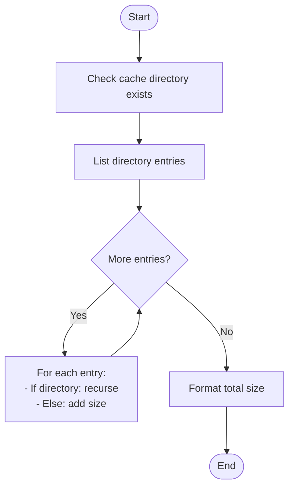

**Diagram sources**
- [class-cache.php:711-752](file://includes/class-cache.php#L711-L752)
- [class-cache.php:736-752](file://includes/class-cache.php#L736-L752)

**Section sources**
- [class-cache.php:711-752](file://includes/class-cache.php#L711-L752)

### Security Measures Against Malicious Path Injection
- Input sanitization: domain and URL path are extracted from HTTP headers and sanitized.
- Traversal checks: any occurrence of traversal sequences aborts cache generation.
- Operator precedence: guards are structured to avoid accidental bypasses.
- Legacy drop-in detection: prevents overwriting foreign cache handlers.

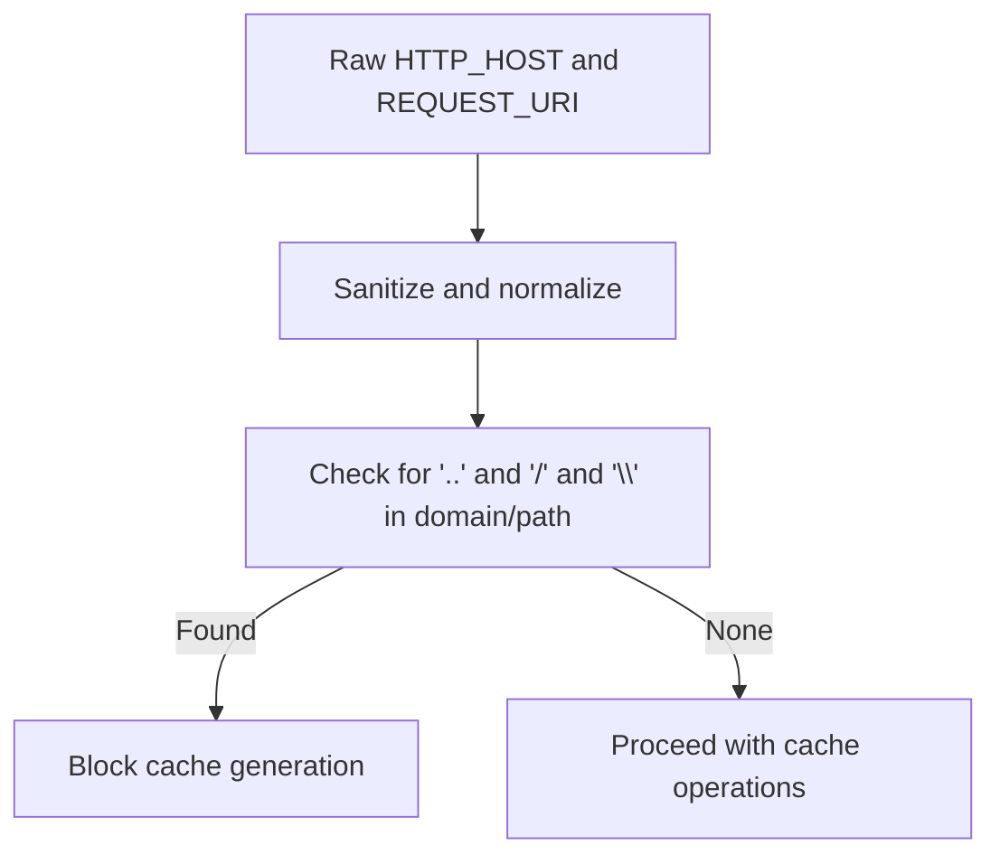

**Diagram sources**
- [class-cache.php:95-120](file://includes/class-cache.php#L95-L120)
- [class-cache.php:492-536](file://includes/class-cache.php#L492-L536)
- [class-advanced-cache-handler.php:129-131](file://includes/class-advanced-cache-handler.php#L129-L131)
- [sentinel.md:10-19](file://.jules/sentinel.md#L10-L19)

**Section sources**
- [class-cache.php:95-120](file://includes/class-cache.php#L95-L120)
- [class-cache.php:492-536](file://includes/class-cache.php#L492-L536)
- [class-advanced-cache-handler.php:129-131](file://includes/class-advanced-cache-handler.php#L129-L131)
- [sentinel.md:10-19](file://.jules/sentinel.md#L10-L19)

### Cache Invalidation Triggers and Automated Cleanup
- Manual invalidation: per-page invalidation clears both HTML and CSS caches and purges related archives.
- Scheduled preloading: cron jobs generate static pages in batches and clear previous cache versions before loading.
- Structural changes: permalink updates, theme switches, plugin activation/deactivation trigger full cache clear.
- Database cleanup: automated cleanup of revisions, drafts, trashed posts/comments, expired transients, and orphaned postmeta.

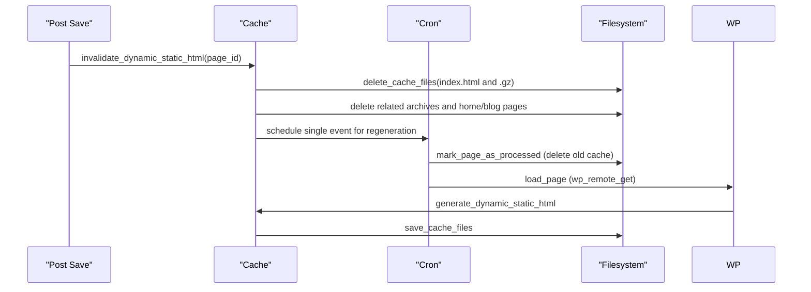

**Diagram sources**
- [class-cache.php:546-598](file://includes/class-cache.php#L546-L598)
- [class-cron.php:289-311](file://includes/class-cron.php#L289-L311)
- [class-cron.php:274-279](file://includes/class-cron.php#L274-L279)
- [class-main.php:233-239](file://includes/class-main.php#L233-L239)

**Section sources**
- [class-cache.php:546-598](file://includes/class-cache.php#L546-L598)
- [class-cron.php:289-311](file://includes/class-cron.php#L289-L311)
- [class-cron.php:274-279](file://includes/class-cron.php#L274-L279)
- [class-main.php:233-239](file://includes/class-main.php#L233-L239)

### Minification Cache Organization
- JS and CSS minification caches are stored separately under a min cache directory.
- Files are named by hashing the original file path to avoid collisions and ensure deterministic caching.
- Both regular and gzip-compressed variants are written.

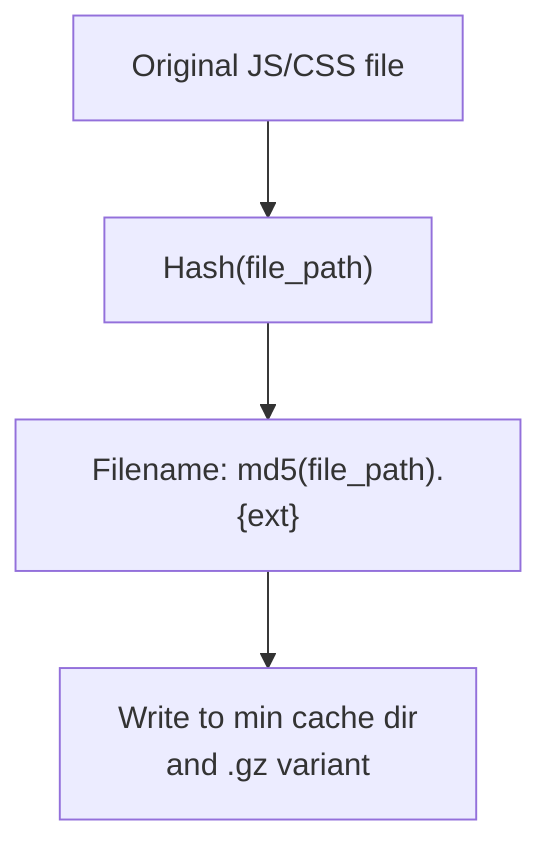

**Diagram sources**
- [class-css.php:114-117](file://includes/minify/class-css.php#L114-L117)
- [class-js.php:108-111](file://includes/minify/class-js.php#L108-L111)
- [class-css.php:126-133](file://includes/minify/class-css.php#L126-L133)
- [class-js.php:122-129](file://includes/minify/class-js.php#L122-L129)

**Section sources**
- [class-css.php:114-117](file://includes/minify/class-css.php#L114-L117)
- [class-js.php:108-111](file://includes/minify/class-js.php#L108-L111)
- [class-css.php:126-133](file://includes/minify/class-css.php#L126-L133)
- [class-js.php:122-129](file://includes/minify/class-js.php#L122-L129)

### Object Cache Integration
- Object cache drop-in management: install/remove and status checks.
- Redis connectivity testing and telemetry collection.
- Configuration file generation and persistence.

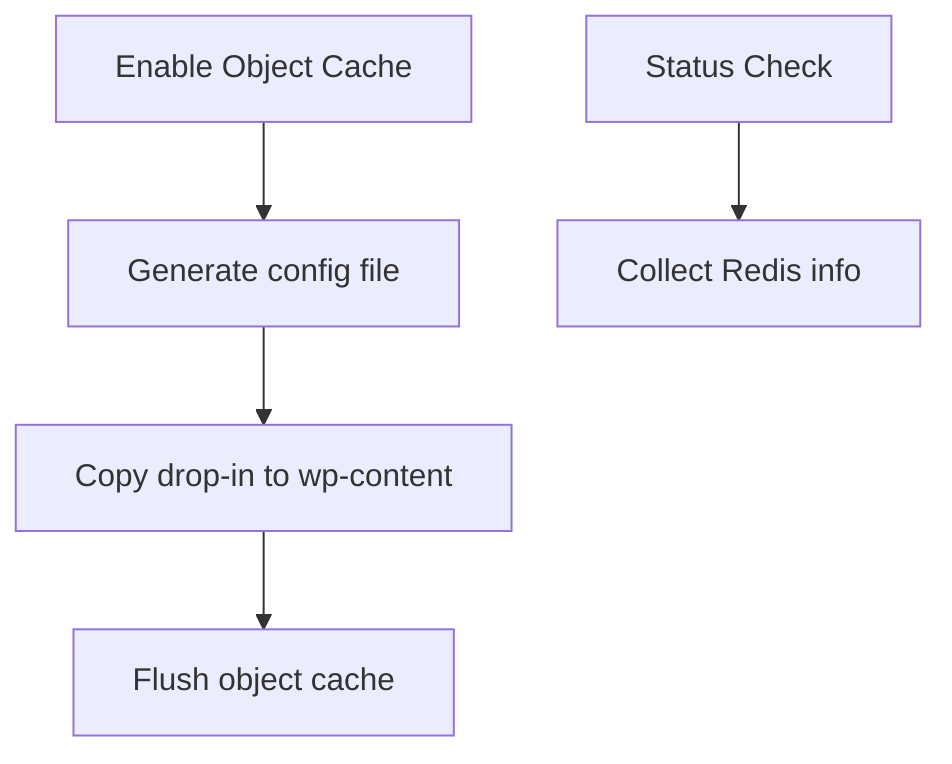

**Diagram sources**
- [class-object-cache.php:208-247](file://includes/class-object-cache.php#L208-L247)
- [class-object-cache.php:78-144](file://includes/class-object-cache.php#L78-L144)

**Section sources**
- [class-object-cache.php:208-247](file://includes/class-object-cache.php#L208-L247)
- [class-object-cache.php:78-144](file://includes/class-object-cache.php#L78-L144)

## Dependency Analysis
- Cache depends on utilities for filesystem initialization and directory preparation.
- Advanced cache handler depends on utilities for filesystem operations and on WordPress constants for path resolution.
- Cron integrates with cache invalidation and preloading.
- Main class wires hooks for cache generation and invalidation.

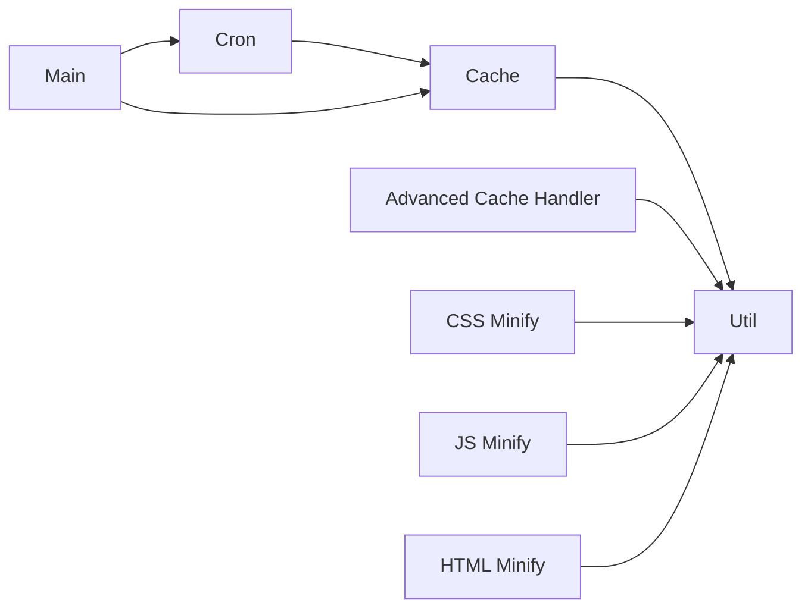

**Diagram sources**
- [class-cache.php:118-120](file://includes/class-cache.php#L118-L120)
- [class-advanced-cache-handler.php:53-56](file://includes/class-advanced-cache-handler.php#L53-L56)
- [class-cron.php:49-51](file://includes/class-cron.php#L49-L51)
- [class-main.php:175-177](file://includes/class-main.php#L175-L177)
- [class-css.php:54-55](file://includes/minify/class-css.php#L54-L55)
- [class-js.php:63-64](file://includes/minify/class-js.php#L63-L64)
- [class-html.php:67-68](file://includes/minify/class-html.php#L67-L68)

**Section sources**
- [class-cache.php:118-120](file://includes/class-cache.php#L118-L120)
- [class-advanced-cache-handler.php:53-56](file://includes/class-advanced-cache-handler.php#L53-L56)
- [class-cron.php:49-51](file://includes/class-cron.php#L49-L51)
- [class-main.php:175-177](file://includes/class-main.php#L175-L177)
- [class-css.php:54-55](file://includes/minify/class-css.php#L54-L55)
- [class-js.php:63-64](file://includes/minify/class-js.php#L63-L64)
- [class-html.php:67-68](file://includes/minify/class-html.php#L67-L68)

## Performance Considerations
- Gzip compression reduces payload size; the advanced cache handler serves gzip when available and supported.
- Minification reduces HTML/CSS/JS sizes and improves load times.
- Batched cron jobs prevent memory exhaustion during preloading.
- Transients cache cache size and minified file counts to reduce repeated filesystem scans.

[No sources needed since this section provides general guidance]

## Troubleshooting Guide
Common issues and resolutions:
- Cache not generated: verify domain and URL path do not contain traversal sequences; ensure filesystem initialization succeeds.
- Incorrect cache paths: confirm domain extraction and request URI normalization; check for operator precedence errors in validation logic.
- Permission errors: ensure WordPress Filesystem API can write to the cache directory; verify directory ownership and permissions.
- Cache size reporting: if cache directory does not exist, size calculation returns an informative message; verify cache generation ran.
- Security hardening: review path traversal guards and ensure they are applied consistently across all cache operations.

**Section sources**
- [class-cache.php:95-120](file://includes/class-cache.php#L95-L120)
- [class-cache.php:492-536](file://includes/class-cache.php#L492-L536)
- [class-cache.php:711-752](file://includes/class-cache.php#L711-L752)
- [class-advanced-cache-handler.php:129-131](file://includes/class-advanced-cache-handler.php#L129-L131)
- [sentinel.md:10-19](file://.jules/sentinel.md#L10-L19)

## Conclusion
The plugin implements a robust cache storage architecture with domain and URL path segmentation, dual-file gzip support, strict traversal prevention, and integrated filesystem operations. Dynamic cache generation and serving complement a separate minification cache, while cron-driven preloading and granular invalidation ensure freshness. Security hardening and automated cleanup processes protect performance and reliability.