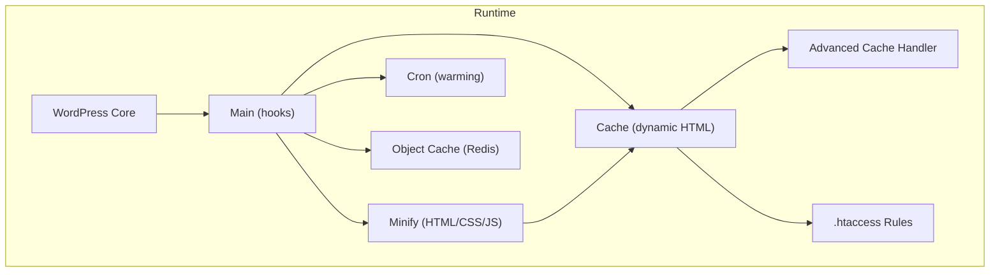
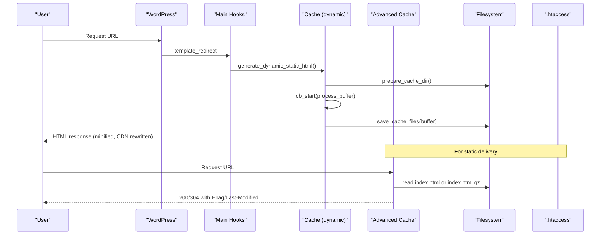
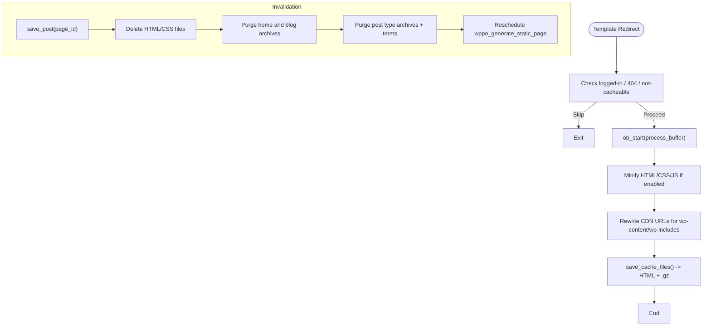
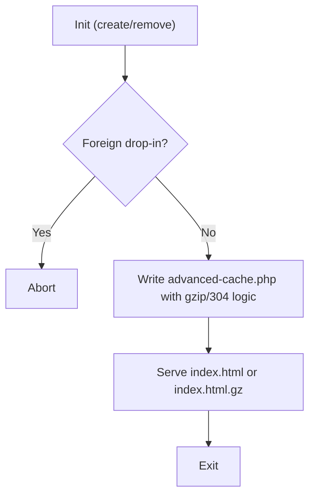
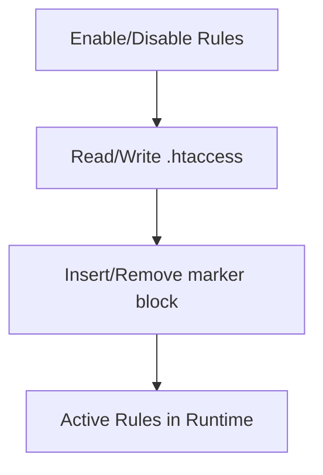
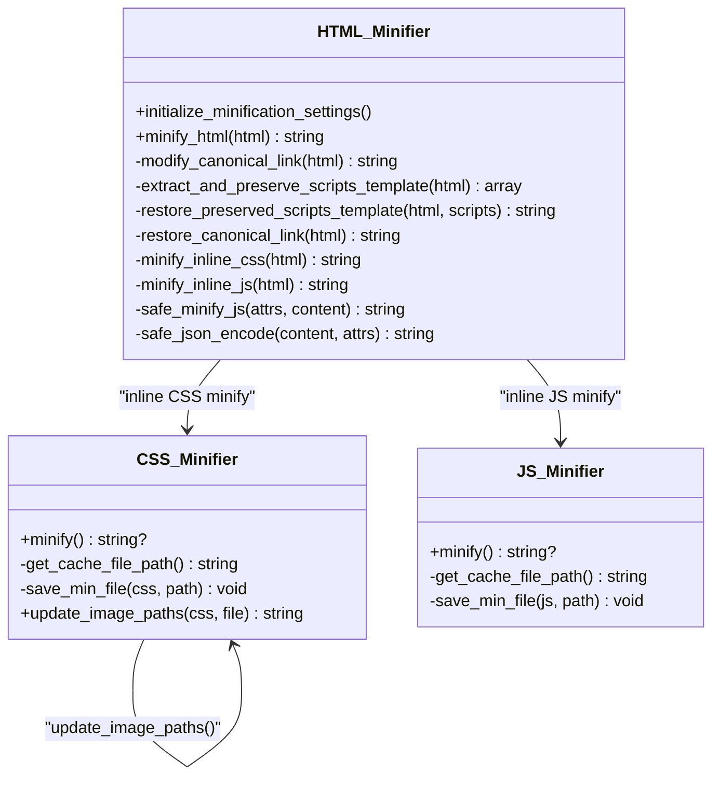
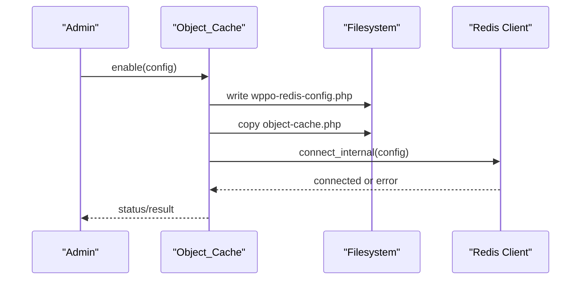
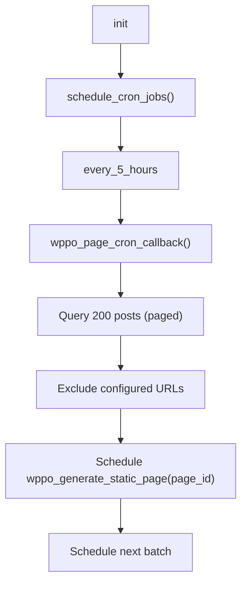
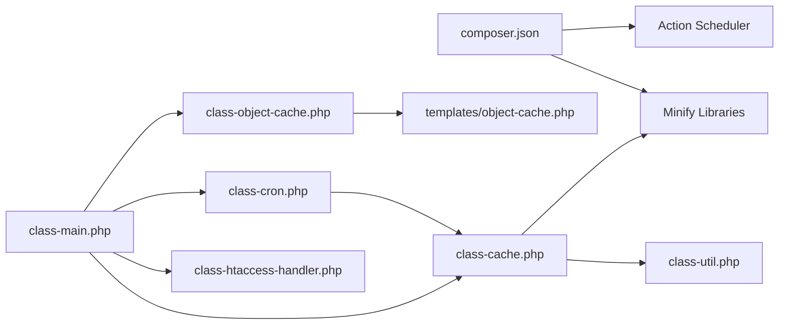

# Caching System

<cite>
**Referenced Files in This Document**
- [performance-optimisation.php](file://performance-optimisation.php)
- [class-main.php](file://includes/class-main.php)
- [class-cache.php](file://includes/class-cache.php)
- [class-advanced-cache-handler.php](file://includes/class-advanced-cache-handler.php)
- [class-htaccess-handler.php](file://includes/class-htaccess-handler.php)
- [class-util.php](file://includes/class-util.php)
- [class-cron.php](file://includes/class-cron.php)
- [class-object-cache.php](file://includes/class-object-cache.php)
- [class-html.php](file://includes/minify/class-html.php)
- [class-css.php](file://includes/minify/class-css.php)
- [class-js.php](file://includes/minify/class-js.php)
- [object-cache.php](file://templates/object-cache.php)
- [composer.json](file://composer.json)
</cite>

## Table of Contents
1. [Introduction](#introduction)
2. [Project Structure](#project-structure)
3. [Core Components](#core-components)
4. [Architecture Overview](#architecture-overview)
5. [Detailed Component Analysis](#detailed-component-analysis)
6. [Dependency Analysis](#dependency-analysis)
7. [Performance Considerations](#performance-considerations)
8. [Troubleshooting Guide](#troubleshooting-guide)
9. [Conclusion](#conclusion)
10. [Appendices](#appendices)

## Introduction
This document explains the Performance Optimisation plugin’s caching system with a focus on dynamic static HTML caching, cache generation, storage management, invalidation strategies, cache warming, CDN integration, advanced cache handler, and .htaccess optimizations. It also covers configuration options, performance monitoring, and troubleshooting.

## Project Structure
The caching system spans several core modules:
- Dynamic static HTML caching and storage
- Advanced cache drop-in for early static delivery
- Server-side compression and browser caching via .htaccess
- Minification and asset caching
- Object cache via Redis drop-in
- Background cache warming via cron

**Diagram sources**
- [class-main.php:164-241](file://includes/class-main.php#L164-L241)
- [class-cache.php:260-310](file://includes/class-cache.php#L260-L310)
- [class-advanced-cache-handler.php:104-191](file://includes/class-advanced-cache-handler.php#L104-L191)
- [class-htaccess-handler.php:42-74](file://includes/class-htaccess-handler.php#L42-L74)
- [class-cron.php:79-91](file://includes/class-cron.php#L79-L91)
- [class-object-cache.php:208-247](file://includes/class-object-cache.php#L208-L247)

**Section sources**
- [performance-optimisation.php:17-44](file://performance-optimisation.php#L17-L44)
- [class-main.php:98-118](file://includes/class-main.php#L98-L118)

## Core Components
- Dynamic Static HTML Cache: Generates and stores compressed static HTML per URL path, with smart purge and CDN rewrite.
- Advanced Cache Drop-in: Serves prebuilt static HTML with gzip support and 304 Not Modified handling.
- .htaccess Rules: Enables Gzip and Expires-based browser caching.
- Minification and Asset Caching: Minifies HTML/CSS/JS and caches minified assets.
- Object Cache (Redis): Provides persistent object caching via a Redis drop-in.
- Cache Warming: Schedules background generation of cached pages.

**Section sources**
- [class-cache.php:260-310](file://includes/class-cache.php#L260-L310)
- [class-advanced-cache-handler.php:104-191](file://includes/class-advanced-cache-handler.php#L104-L191)
- [class-htaccess-handler.php:82-137](file://includes/class-htaccess-handler.php#L82-L137)
- [class-cron.php:79-91](file://includes/class-cron.php#L79-L91)
- [class-object-cache.php:208-247](file://includes/class-object-cache.php#L208-L247)

## Architecture Overview
The caching architecture integrates runtime generation and server-level delivery:

**Diagram sources**
- [class-main.php:175-177](file://includes/class-main.php#L175-L177)
- [class-cache.php:260-310](file://includes/class-cache.php#L260-L310)
- [class-cache.php:470-483](file://includes/class-cache.php#L470-L483)
- [class-advanced-cache-handler.php:137-187](file://includes/class-advanced-cache-handler.php#L137-L187)

## Detailed Component Analysis

### Dynamic Static HTML Cache
- Generation: Starts output buffering at template_redirect, minifies and applies CDN rewriting, then writes HTML and gzip variants.
- Storage: Stores under wp-content/cache/wppo/{domain}/{path}/index.html and index.html.gz.
- Conditions: Skips for logged-in users, 404s, non-cacheable paths, and query strings commonly used for cache-busting.
- CDN Rewriting: Rewrites local wp-content/wp-includes URLs to configured CDN for supported tags.
- Smart Purge: On save_post, deletes HTML/CSS cache for the page, home, blog archives, post type archives, and term archives; reschedules regeneration.

**Diagram sources**
- [class-cache.php:260-310](file://includes/class-cache.php#L260-L310)
- [class-cache.php:470-483](file://includes/class-cache.php#L470-L483)
- [class-cache.php:546-598](file://includes/class-cache.php#L546-L598)
- [class-main.php:175-177](file://includes/class-main.php#L175-L177)

**Section sources**
- [class-cache.php:260-310](file://includes/class-cache.php#L260-L310)
- [class-cache.php:325-381](file://includes/class-cache.php#L325-L381)
- [class-cache.php:492-536](file://includes/class-cache.php#L492-L536)
- [class-cache.php:546-598](file://includes/class-cache.php#L546-L598)

### Advanced Cache Handler (Early Static Delivery)
- Purpose: Creates wp-content/advanced-cache.php to serve cached HTML directly from the filesystem with gzip and 304 handling.
- Safety: Detects foreign drop-ins via markers; refuses to overwrite.
- Behavior: Serves .gz if present, sets Last-Modified/ETag, responds 304 when matched.

**Diagram sources**
- [class-advanced-cache-handler.php:104-191](file://includes/class-advanced-cache-handler.php#L104-L191)
- [class-advanced-cache-handler.php:48-73](file://includes/class-advanced-cache-handler.php#L48-L73)

**Section sources**
- [class-advanced-cache-handler.php:104-191](file://includes/class-advanced-cache-handler.php#L104-L191)
- [class-advanced-cache-handler.php:48-73](file://includes/class-advanced-cache-handler.php#L48-L73)

### .htaccess Rules (Gzip + Browser Caching)
- Adds mod_deflate rules for HTML/CSS/JS/XML/Fonts.
- Adds mod_expires rules with sensible defaults (e.g., 1 year for static assets, 0 seconds for HTML).

**Diagram sources**
- [class-htaccess-handler.php:42-74](file://includes/class-htaccess-handler.php#L42-L74)
- [class-htaccess-handler.php:82-137](file://includes/class-htaccess-handler.php#L82-L137)

**Section sources**
- [class-htaccess-handler.php:42-74](file://includes/class-htaccess-handler.php#L42-L74)
- [class-htaccess-handler.php:82-137](file://includes/class-htaccess-handler.php#L82-L137)

### Minification and Asset Caching
- HTML minification: voku/html-min with configurable inline CSS/JS minification and script preservation.
- CSS minification: MatthiasMullie with font-display enhancement and image path updates.
- JS minification: MatthiasMullie with gzip caching.
- Asset caching: Minified CSS/JS saved under wp-content/cache/wppo/min/{css|js}/MD5.css/js with .gz.

**Diagram sources**
- [class-html.php:64-143](file://includes/minify/class-html.php#L64-L143)
- [class-css.php:63-106](file://includes/minify/class-css.php#L63-L106)
- [class-js.php:74-99](file://includes/minify/class-js.php#L74-L99)

**Section sources**
- [class-html.php:64-143](file://includes/minify/class-html.php#L64-L143)
- [class-css.php:63-106](file://includes/minify/class-css.php#L63-L106)
- [class-js.php:74-99](file://includes/minify/class-js.php#L74-L99)

### Object Cache (Redis) Drop-in
- Installs object-cache.php and writes wppo-redis-config.php.
- Supports standalone, sentinel, and cluster modes with TLS, compression, and replica connections.
- Provides status checks, ping, and flush.

**Diagram sources**
- [class-object-cache.php:208-247](file://includes/class-object-cache.php#L208-L247)
- [object-cache.php:78-149](file://templates/object-cache.php#L78-L149)

**Section sources**
- [class-object-cache.php:208-247](file://includes/class-object-cache.php#L208-L247)
- [object-cache.php:78-149](file://templates/object-cache.php#L78-L149)

### Cache Warming (Cron)
- Schedules periodic warming of published public posts/pages in batches.
- Skips excluded URLs and randomizes delays to avoid load spikes.
- Clears previous cache for a page before regenerating.

**Diagram sources**
- [class-cron.php:79-91](file://includes/class-cron.php#L79-L91)
- [class-cron.php:113-184](file://includes/class-cron.php#L113-L184)
- [class-cron.php:222-227](file://includes/class-cron.php#L222-L227)
- [class-cron.php:289-311](file://includes/class-cron.php#L289-L311)

**Section sources**
- [class-cron.php:79-91](file://includes/class-cron.php#L79-L91)
- [class-cron.php:113-184](file://includes/class-cron.php#L113-L184)
- [class-cron.php:222-227](file://includes/class-cron.php#L222-L227)
- [class-cron.php:289-311](file://includes/class-cron.php#L289-L311)

## Dependency Analysis
- Composer dependencies include HTML/JS/CSS minifiers and Action Scheduler.
- Runtime dependencies: WordPress hooks, filesystem API, and optional server modules (mod_deflate, mod_expires).

**Diagram sources**
- [composer.json:11-15](file://composer.json#L11-L15)
- [class-main.php:128-144](file://includes/class-main.php#L128-L144)
- [class-cache.php:16-18](file://includes/class-cache.php#L16-L18)

**Section sources**
- [composer.json:11-15](file://composer.json#L11-L15)
- [class-main.php:128-144](file://includes/class-main.php#L128-L144)

## Performance Considerations
- Static HTML caching reduces PHP processing and DB queries for anonymous users.
- Gzip compression and 304 Not Modified minimize bandwidth and latency.
- Browser caching via Expires headers reduces repeated downloads.
- Minification reduces payload sizes.
- Redis object cache reduces DB and computation overhead for transient data.
- Cache warming proactively generates cache entries to avoid cold starts.

[No sources needed since this section provides general guidance]

## Troubleshooting Guide
Common issues and resolutions:
- Cache not generated
  - Verify user is not logged in and URL is cacheable.
  - Ensure filesystem is writable and cache directories exist.
  - Check query string exclusions and preload settings.
- Stale cache after edits
  - Trigger manual invalidation or rely on smart purge on save_post.
  - Clear plugin cache via admin or programmatically.
- Advanced cache conflicts
  - Check for foreign drop-in; the handler avoids overwriting.
- .htaccess rules not applied
  - Verify file permissions and existence; the updater checks writability.
- Redis object cache not active
  - Confirm PhpRedis extension, correct config, and no foreign drop-in.

**Section sources**
- [class-cache.php:492-536](file://includes/class-cache.php#L492-L536)
- [class-cache.php:647-677](file://includes/class-cache.php#L647-L677)
- [class-advanced-cache-handler.php:104-110](file://includes/class-advanced-cache-handler.php#L104-L110)
- [class-htaccess-handler.php:59-65](file://includes/class-htaccess-handler.php#L59-L65)
- [class-object-cache.php:208-216](file://includes/class-object-cache.php#L208-L216)

## Conclusion
The plugin’s caching system combines dynamic static HTML generation, server-level delivery via an advanced cache drop-in, and complementary .htaccess optimizations. It includes robust invalidation, background warming, and optional Redis object caching. Together, these features deliver significant performance gains by reducing server load and improving response times.

[No sources needed since this section summarizes without analyzing specific files]

## Appendices

### Cache Configuration Options
- File Optimization
  - Enable server rules (Gzip + Expires)
  - CDN URL for wp-content/wp-includes assets
  - Combine CSS, minify HTML/inline CSS/inline JS/delay JS
  - Exclude lists for JS/CSS/defer/delay
- Preload Settings
  - Enable preloading cache
  - Exclude URLs from preloading
- Image Optimization
  - Lazy-load images/videos, convert to WebP/AVIF, batch sizes
- Database Cleanup
  - Automated cleanup schedule and categories

These options are read in the main class and propagated to cache, minification, and cron subsystems.

**Section sources**
- [class-main.php:99-109](file://includes/class-main.php#L99-L109)
- [class-main.php:250-277](file://includes/class-main.php#L250-L277)

### Performance Monitoring
- Cache size and minified asset counts are cached as transients and exposed in admin localization.
- Object cache status includes telemetry when enabled and reachable.

**Section sources**
- [class-main.php:463-473](file://includes/class-main.php#L463-L473)
- [class-object-cache.php:78-144](file://includes/class-object-cache.php#L78-L144)