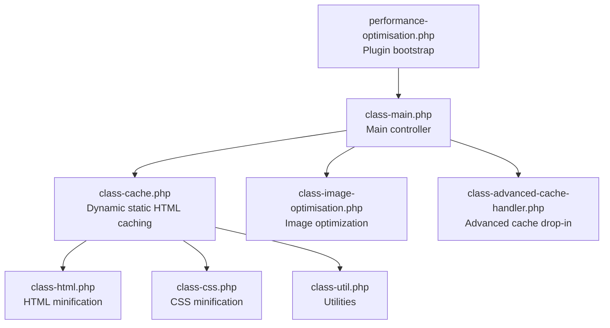
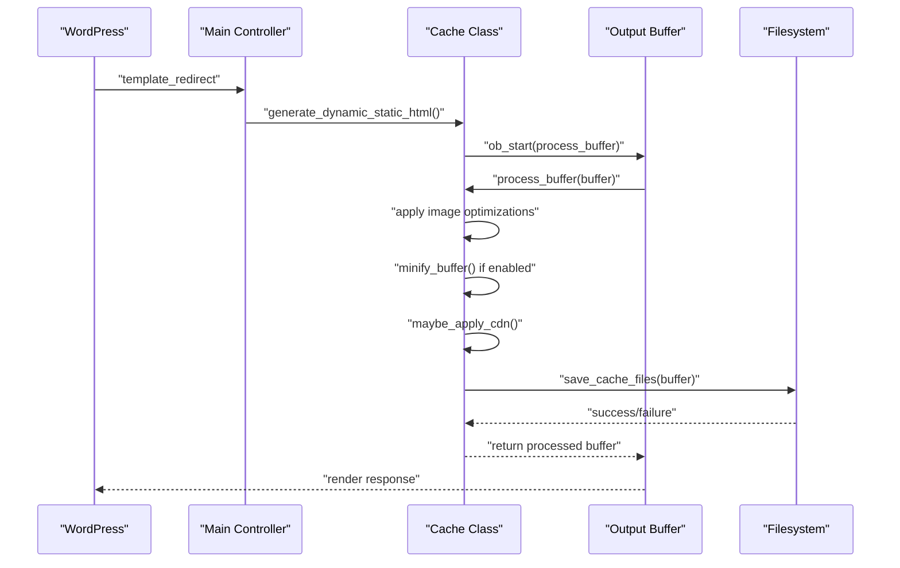
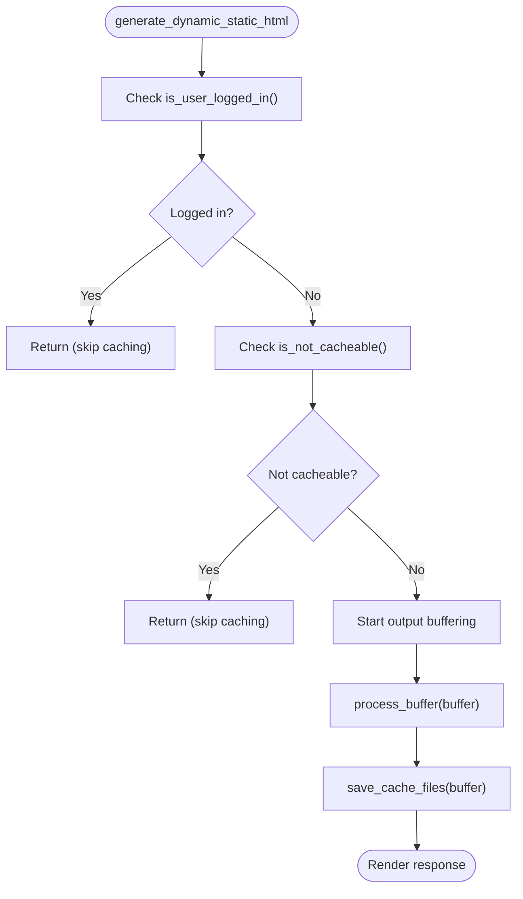
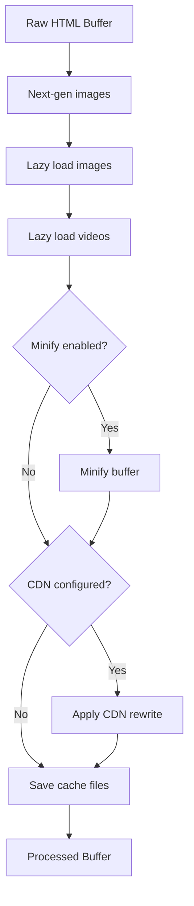
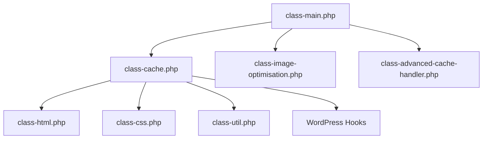

# Dynamic Static HTML Caching

<cite>
**Referenced Files in This Document**
- [performance-optimisation.php](file://performance-optimisation.php)
- [class-main.php](file://includes/class-main.php)
- [class-cache.php](file://includes/class-cache.php)
- [class-advanced-cache-handler.php](file://includes/class-advanced-cache-handler.php)
- [class-image-optimisation.php](file://includes/class-image-optimisation.php)
- [class-util.php](file://includes/class-util.php)
- [class-html.php](file://includes/minify/class-html.php)
- [class-css.php](file://includes/minify/class-css.php)
</cite>

## Table of Contents
1. [Introduction](#introduction)
2. [Project Structure](#project-structure)
3. [Core Components](#core-components)
4. [Architecture Overview](#architecture-overview)
5. [Detailed Component Analysis](#detailed-component-analysis)
6. [Dependency Analysis](#dependency-analysis)
7. [Performance Considerations](#performance-considerations)
8. [Troubleshooting Guide](#troubleshooting-guide)
9. [Conclusion](#conclusion)

## Introduction
This document explains the dynamic static HTML caching mechanism implemented in the Performance Optimisation plugin. The system generates static HTML files from WordPress requests, caches them to disk, and serves them directly to visitors for improved performance. It integrates with WordPress hooks, performs buffer processing, minification, and CDN URL rewriting, and maintains a structured cache file hierarchy that mirrors the URL path.

## Project Structure
The caching system spans several core files:
- Entry point initializes the plugin and main controller
- Main controller registers WordPress hooks and orchestrates caching
- Cache class manages static HTML generation, buffer processing, minification, CDN rewriting, and file storage
- Advanced cache handler provides a server-side drop-in for direct static file serving
- Image optimization integrates lazy loading and next-gen image delivery
- Utilities provide filesystem operations, URL normalization, and preload link generation
- Minification classes handle HTML/CSS/JS minification

**Diagram sources**
- [performance-optimisation.php:1-71](file://performance-optimisation.php#L1-L71)
- [class-main.php:1-120](file://includes/class-main.php#L1-L120)
- [class-cache.php:1-120](file://includes/class-cache.php#L1-L120)
- [class-advanced-cache-handler.php:1-60](file://includes/class-advanced-cache-handler.php#L1-L60)
- [class-image-optimisation.php:1-60](file://includes/class-image-optimisation.php#L1-L60)
- [class-util.php:1-60](file://includes/class-util.php#L1-L60)
- [class-html.php:1-60](file://includes/minify/class-html.php#L1-L60)
- [class-css.php:1-60](file://includes/minify/class-css.php#L1-L60)

**Section sources**
- [performance-optimisation.php:1-71](file://performance-optimisation.php#L1-L71)
- [class-main.php:1-120](file://includes/class-main.php#L1-L120)

## Core Components
- Cache class: Central orchestrator for static HTML generation, buffer processing, minification, CDN rewriting, and file storage
- Main controller: Registers WordPress hooks and delegates to Cache
- Advanced cache handler: Creates a drop-in for direct static file serving
- Image optimization: Integrates lazy loading and next-gen image delivery into buffer processing
- Minification: HTML/CSS/JS minification pipeline
- Utilities: Filesystem operations, URL normalization, preload link generation

**Section sources**
- [class-cache.php:1-120](file://includes/class-cache.php#L1-L120)
- [class-main.php:167-244](file://includes/class-main.php#L167-L244)
- [class-advanced-cache-handler.php:25-94](file://includes/class-advanced-cache-handler.php#L25-L94)
- [class-image-optimisation.php:27-120](file://includes/class-image-optimisation.php#L27-L120)
- [class-html.php:32-107](file://includes/minify/class-html.php#L32-L107)
- [class-css.php:23-106](file://includes/minify/class-css.php#L23-L106)
- [class-util.php:29-80](file://includes/class-util.php#L29-L80)

## Architecture Overview
The caching workflow begins at the WordPress template_redirect hook, where the Cache class starts output buffering. During buffer processing, the system applies image optimizations, optional minification, and CDN URL rewriting. The processed buffer is saved to disk as both uncompressed and gzip-compressed files. The system also maintains a separate minification cache for CSS assets.

**Diagram sources**
- [class-main.php:178-183](file://includes/class-main.php#L178-L183)
- [class-cache.php:260-310](file://includes/class-cache.php#L260-L310)
- [class-cache.php:287-310](file://includes/class-cache.php#L287-L310)
- [class-cache.php:391-396](file://includes/class-cache.php#L391-L396)
- [class-cache.php:325-381](file://includes/class-cache.php#L325-L381)
- [class-cache.php:470-483](file://includes/class-cache.php#L470-L483)

## Detailed Component Analysis

### Cache Class: Dynamic Static HTML Generation
The Cache class is the core of the caching mechanism. It:
- Initializes domain, cache root directory, and URL path from the current request
- Starts output buffering at template_redirect
- Processes the buffer through image optimization, optional minification, and CDN rewriting
- Saves both uncompressed and gzip-compressed cache files
- Provides cache invalidation and purge utilities

Key behaviors:
- Request filtering: Skips caching for logged-in users, 404 pages, and non-cacheable URLs
- Buffer processing: Applies image optimizations, minification, and CDN rewriting
- File storage: Creates directories and writes both .html and .html.gz files
- URL path mapping: Mirrors WordPress URL structure in the cache directory

**Diagram sources**
- [class-cache.php:260-276](file://includes/class-cache.php#L260-L276)
- [class-cache.php:261-263](file://includes/class-cache.php#L261-L263)
- [class-cache.php:406-423](file://includes/class-cache.php#L406-L423)
- [class-cache.php:287-310](file://includes/class-cache.php#L287-L310)
- [class-cache.php:470-483](file://includes/class-cache.php#L470-L483)

**Section sources**
- [class-cache.php:94-120](file://includes/class-cache.php#L94-L120)
- [class-cache.php:260-276](file://includes/class-cache.php#L260-L276)
- [class-cache.php:287-310](file://includes/class-cache.php#L287-L310)
- [class-cache.php:433-447](file://includes/class-cache.php#L433-L447)
- [class-cache.php:470-483](file://includes/class-cache.php#L470-L483)

### Buffer Processing Pipeline
The buffer processing pipeline applies multiple transformations:
- Image optimization: Next-gen image replacement, lazy loading, and video lazy loading
- Minification: HTML minification and inline CSS/JS minification when enabled
- CDN rewriting: Rewrites wp-content and wp-includes URLs to configured CDN

**Diagram sources**
- [class-cache.php:287-310](file://includes/class-cache.php#L287-L310)
- [class-cache.php:288-292](file://includes/class-cache.php#L288-L292)
- [class-cache.php:391-396](file://includes/class-cache.php#L391-L396)
- [class-cache.php:325-381](file://includes/class-cache.php#L325-L381)
- [class-cache.php:470-483](file://includes/class-cache.php#L470-L483)

**Section sources**
- [class-cache.php:287-310](file://includes/class-cache.php#L287-L310)
- [class-image-optimisation.php:95-208](file://includes/class-image-optimisation.php#L95-L208)
- [class-image-optimisation.php:1021-1064](file://includes/class-image-optimisation.php#L1021-L1064)
- [class-html.php:116-143](file://includes/minify/class-html.php#L116-L143)

### CDN URL Rewriting
The system rewrites local asset URLs in HTML to use a configured CDN for wp-content and wp-includes resources. It uses WordPress's HTML tag processor when available, otherwise falls back to regex-based processing. The rewrite targets img, script, link, source, and video tags and updates src, href, data-src, srcset, and data-srcset attributes.

**Section sources**
- [class-cache.php:325-381](file://includes/class-cache.php#L325-L381)

### Cache File Structure and URL Path Mapping
Cache files are organized under the plugin's cache directory with a structure that mirrors the WordPress URL path:
- Root: wp-content/cache/wppo
- Subdirectories: domain/URL-path/index.html
- Gzip variants: domain/URL-path/index.html.gz

Examples:
- Home page: domain./index.html
- Category page: domain./category/news/index.html
- Post page: domain./2024/01/post-title/index.html

The cache URL follows the same structure: wp-content/cache/wppo/domain/URL-path/index.html.

**Section sources**
- [class-cache.php:433-447](file://includes/class-cache.php#L433-L447)
- [class-cache.php:434](file://includes/class-cache.php#L434)

### Role of the Cache Class in the Overall Architecture
The Cache class acts as the central coordinator:
- Hooks into WordPress lifecycle at template_redirect
- Manages output buffering and buffer processing
- Integrates with image optimization and minification
- Handles file I/O and cache storage
- Provides cache invalidation and purging

**Section sources**
- [class-main.php:178-183](file://includes/class-main.php#L178-L183)
- [class-cache.php:260-276](file://includes/class-cache.php#L260-L276)

### Advanced Cache Handler: Direct Static File Serving
The Advanced Cache Handler creates a drop-in file that bypasses WordPress entirely for serving cached content. It checks for logged-in users, validates request paths, and serves either the compressed or uncompressed cache file with appropriate headers.

**Section sources**
- [class-advanced-cache-handler.php:104-191](file://includes/class-advanced-cache-handler.php#L104-L191)
- [class-advanced-cache-handler.php:137-187](file://includes/class-advanced-cache-handler.php#L137-L187)

## Dependency Analysis
The caching system relies on WordPress hooks and integrates with multiple subsystems:

**Diagram sources**
- [class-main.php:167-244](file://includes/class-main.php#L167-L244)
- [class-cache.php:1-120](file://includes/class-cache.php#L1-120)
- [class-image-optimisation.php:1-60](file://includes/class-image-optimisation.php#L1-L60)
- [class-html.php:1-60](file://includes/minify/class-html.php#L1-L60)
- [class-css.php:1-60](file://includes/minify/class-css.php#L1-L60)
- [class-util.php:1-60](file://includes/class-util.php#L1-L60)
- [class-advanced-cache-handler.php:1-60](file://includes/class-advanced-cache-handler.php#L1-L60)

**Section sources**
- [class-main.php:167-244](file://includes/class-main.php#L167-L244)
- [class-cache.php:1-120](file://includes/class-cache.php#L1-L120)

## Performance Considerations
- Memory usage: The system operates on the output buffer, avoiding excessive memory overhead by processing content incrementally
- Disk I/O: Writes both uncompressed and gzip-compressed files; gzip compression reduces bandwidth but increases CPU usage
- CDN integration: Offloads static asset delivery to CDN, reducing origin server load
- Minification: Reduces HTML/CSS/JS sizes; inline minification requires careful handling to avoid breaking functionality
- Cache invalidation: Granular invalidation for specific pages and smart purging for archives and home page
- Advanced cache drop-in: Bypasses WordPress entirely for cached requests, minimizing overhead

## Troubleshooting Guide
Common issues and resolutions:
- Cache not generated: Verify template_redirect hook registration and that the request is not filtered as not cacheable
- Incorrect cache path: Check domain extraction and URL path normalization
- Minification errors: Review minification settings and ensure compatibility with inline scripts
- CDN rewrite failures: Confirm CDN URL configuration and that the HTML tag processor is available
- File permission errors: Ensure the cache directory is writable by the web server

**Section sources**
- [class-main.php:178-183](file://includes/class-main.php#L178-L183)
- [class-cache.php:406-423](file://includes/class-cache.php#L406-L423)
- [class-cache.php:325-381](file://includes/class-cache.php#L325-L381)
- [class-util.php:38-60](file://includes/class-util.php#L38-L60)

## Conclusion
The dynamic static HTML caching mechanism provides significant performance improvements by generating and serving static HTML files while maintaining WordPress compatibility. It integrates seamlessly with WordPress hooks, applies intelligent buffer processing, and offers flexible configuration for minification and CDN integration. The system's architecture supports both direct static file serving via the advanced cache drop-in and traditional WordPress request handling, providing optimal performance across different deployment scenarios.