# Dynamic Static HTML Caching

<cite>
**Referenced Files in This Document**
- [performance-optimisation.php](file://performance-optimisation.php)
- [class-main.php](file://includes/class-main.php)
- [class-cache.php](file://includes/class-cache.php)
- [class-html.php](file://includes/minify/class-html.php)
- [class-css.php](file://includes/minify/class-css.php)
- [class-image-optimisation.php](file://includes/class-image-optimisation.php)
- [class-cron.php](file://includes/class-cron.php)
- [class-util.php](file://includes/class-util.php)
- [class-advanced-cache-handler.php](file://includes/class-advanced-cache-handler.php)
</cite>

## Table of Contents
1. [Introduction](#introduction)
2. [Project Structure](#project-structure)
3. [Core Components](#core-components)
4. [Architecture Overview](#architecture-overview)
5. [Detailed Component Analysis](#detailed-component-analysis)
6. [Dependency Analysis](#dependency-analysis)
7. [Performance Considerations](#performance-considerations)
8. [Troubleshooting Guide](#troubleshooting-guide)
9. [Conclusion](#conclusion)

## Introduction
This document explains the dynamic static HTML caching mechanism implemented by the plugin. It covers how WordPress requests are intercepted, how static HTML files are generated and stored, and how the system integrates with WordPress hooks. It also documents the buffer processing pipeline, minification integration, CDN URL rewriting, cache file structure, URL path mapping, and the role of the Cache class in the overall architecture. Finally, it compares this approach to traditional WordPress caching methods and highlights performance benefits and memory usage considerations.

## Project Structure
The caching system spans several core files:
- Entry point initializes the plugin and registers the main controller.
- The main controller wires WordPress hooks and instantiates the cache engine.
- The cache engine orchestrates buffer interception, minification, CDN rewriting, and persistent storage.
- Minification utilities provide HTML/CSS/JS minification.
- Image optimization enhances HTML with next-gen image delivery and lazy-loading.
- Cron management schedules background static page generation.
- Utilities provide filesystem operations, URL normalization, and preload link generation.

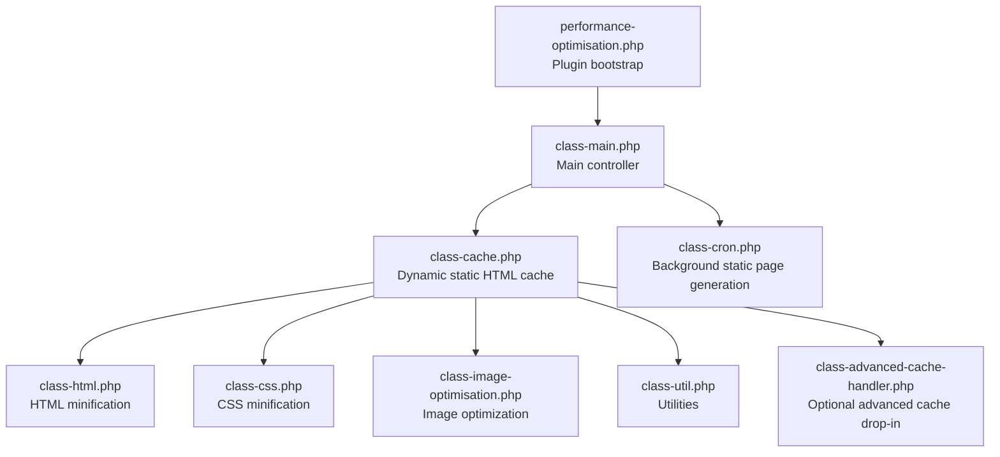

**Diagram sources**
- [performance-optimisation.php:40-43](file://performance-optimisation.php#L40-L43)
- [class-main.php:98-118](file://includes/class-main.php#L98-L118)
- [class-cache.php:32-120](file://includes/class-cache.php#L32-L120)
- [class-html.php:32-68](file://includes/minify/class-html.php#L32-L68)
- [class-css.php:23-55](file://includes/minify/class-css.php#L23-L55)
- [class-image-optimisation.php:27-57](file://includes/class-image-optimisation.php#L27-L57)
- [class-cron.php:42-52](file://includes/class-cron.php#L42-L52)
- [class-util.php:29-80](file://includes/class-util.php#L29-L80)
- [class-advanced-cache-handler.php:112-141](file://includes/class-advanced-cache-handler.php#L112-L141)

**Section sources**
- [performance-optimisation.php:40-43](file://performance-optimisation.php#L40-L43)
- [class-main.php:98-118](file://includes/class-main.php#L98-L118)

## Core Components
- Cache class: Orchestrates dynamic static HTML generation, buffer processing, minification, CDN rewriting, and persistent storage. It computes cache paths from URL paths, prepares directories, and writes both uncompressed and gzip-compressed files.
- Main controller: Wires WordPress hooks, including template_redirect for cache generation and save_post for cache invalidation. It also sets up minification and defer/delay logic.
- HTML minifier: Provides HTML minification and inline CSS/JS minification with safety checks and preservation of critical script tags.
- CSS minifier: Minifies CSS and updates image URLs to next-gen formats where available.
- Image optimizer: Rewrites image URLs to next-gen formats, adds lazy-loading attributes, and generates preload links.
- Cron manager: Schedules background static page generation for public posts in batches.
- Utilities: Provides filesystem initialization, cache directory preparation, URL normalization, and preload link generation.

**Section sources**
- [class-cache.php:32-120](file://includes/class-cache.php#L32-L120)
- [class-main.php:164-241](file://includes/class-main.php#L164-L241)
- [class-html.php:32-68](file://includes/minify/class-html.php#L32-L68)
- [class-css.php:23-55](file://includes/minify/class-css.php#L23-L55)
- [class-image-optimisation.php:27-57](file://includes/class-image-optimisation.php#L27-L57)
- [class-cron.php:42-52](file://includes/class-cron.php#L42-L52)
- [class-util.php:29-80](file://includes/class-util.php#L29-L80)

## Architecture Overview
The caching workflow begins at the WordPress lifecycle hook level and culminates in persistent file storage. The main controller registers the template_redirect hook to trigger cache generation. The Cache class starts output buffering, processes the buffer through image optimization, optional minification, and CDN rewriting, then saves the result to disk. Background cron jobs can pre-generate caches for public pages.

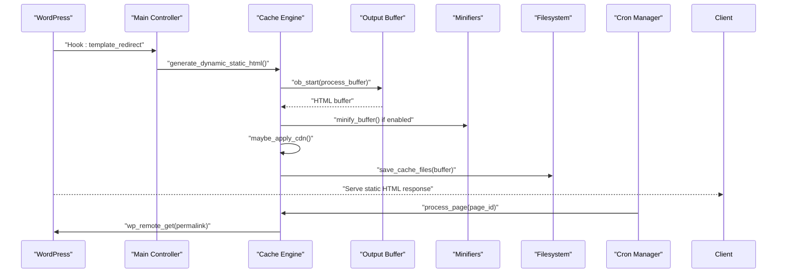

**Diagram sources**
- [class-main.php:175-177](file://includes/class-main.php#L175-L177)
- [class-cache.php:260-310](file://includes/class-cache.php#L260-L310)
- [class-cache.php:391-396](file://includes/class-cache.php#L391-L396)
- [class-cache.php:325-381](file://includes/class-cache.php#L325-L381)
- [class-cache.php:470-483](file://includes/class-cache.php#L470-L483)
- [class-cron.php:222-227](file://includes/class-cron.php#L222-L227)

## Detailed Component Analysis

### Cache Class: Dynamic Static HTML Generation
The Cache class is central to the caching mechanism. It:
- Intercepts requests at template_redirect via the main controller.
- Starts output buffering with a custom handler that processes the buffer.
- Applies image optimization, optional minification, and CDN rewriting.
- Writes both uncompressed and gzip-compressed cache files.
- Computes cache paths from the current URL and domain, preventing directory traversal.
- Determines whether caching is allowed based on query parameters and preload settings.
- Provides granular cache invalidation on content changes and smart purging for archives.

Key responsibilities:
- Buffer processing pipeline: image optimization, minification, CDN rewrite, save to disk.
- Cache path computation: domain-based subdirectories and URL-path-based nested folders.
- Storage: uncompressed and gzip-compressed variants.
- Invalidation: per-page, home/blog archives, and taxonomy/post-type archives.

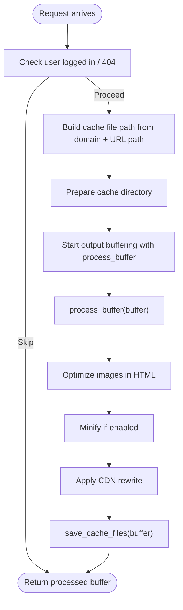

**Diagram sources**
- [class-cache.php:260-310](file://includes/class-cache.php#L260-L310)
- [class-cache.php:287-310](file://includes/class-cache.php#L287-L310)
- [class-cache.php:391-396](file://includes/class-cache.php#L391-L396)
- [class-cache.php:325-381](file://includes/class-cache.php#L325-L381)
- [class-cache.php:470-483](file://includes/class-cache.php#L470-L483)

**Section sources**
- [class-cache.php:260-310](file://includes/class-cache.php#L260-L310)
- [class-cache.php:287-310](file://includes/class-cache.php#L287-L310)
- [class-cache.php:433-447](file://includes/class-cache.php#L433-L447)
- [class-cache.php:470-483](file://includes/class-cache.php#L470-L483)
- [class-cache.php:492-536](file://includes/class-cache.php#L492-L536)
- [class-cache.php:546-598](file://includes/class-cache.php#L546-L598)

### Buffer Processing Pipeline
The buffer processing pipeline applies multiple transformations before writing to disk:
- Next-gen image optimization and lazy-loading: scans IMG tags and updates src/srcset to next-gen formats and data-* attributes.
- Inline CSS/JS minification: minifies inline styles and scripts when enabled, preserving critical scripts and avoiding breaking JSON-LD.
- CDN URL rewriting: rewrites local wp-content/wp-includes URLs to a configured CDN host using WordPress’s HTML tag processor when available.
- Gzip compression: writes both uncompressed and compressed variants for efficient serving.

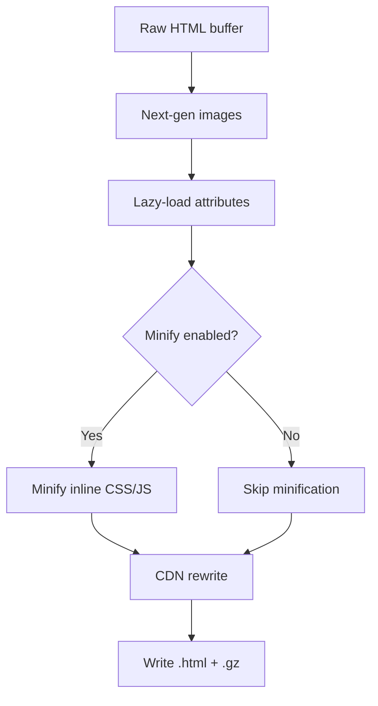

**Diagram sources**
- [class-cache.php:287-310](file://includes/class-cache.php#L287-L310)
- [class-image-optimisation.php:95-208](file://includes/class-image-optimisation.php#L95-L208)
- [class-html.php:116-143](file://includes/minify/class-html.php#L116-L143)
- [class-cache.php:325-381](file://includes/class-cache.php#L325-L381)
- [class-cache.php:470-483](file://includes/class-cache.php#L470-L483)

**Section sources**
- [class-cache.php:287-310](file://includes/class-cache.php#L287-L310)
- [class-image-optimisation.php:95-208](file://includes/class-image-optimisation.php#L95-L208)
- [class-html.php:116-143](file://includes/minify/class-html.php#L116-L143)
- [class-cache.php:325-381](file://includes/class-cache.php#L325-L381)

### Minification Integration
- HTML minification: Uses a dedicated HTML minifier that removes comments, whitespace, and redundant attributes, and can minify inline CSS/JS when enabled.
- CSS minification: Minifies CSS content and updates image URLs to next-gen formats, injecting font-display hints for @font-face.
- Inline CSS/JS handling: Preserves critical scripts and JSON-LD, and safely minifies others.

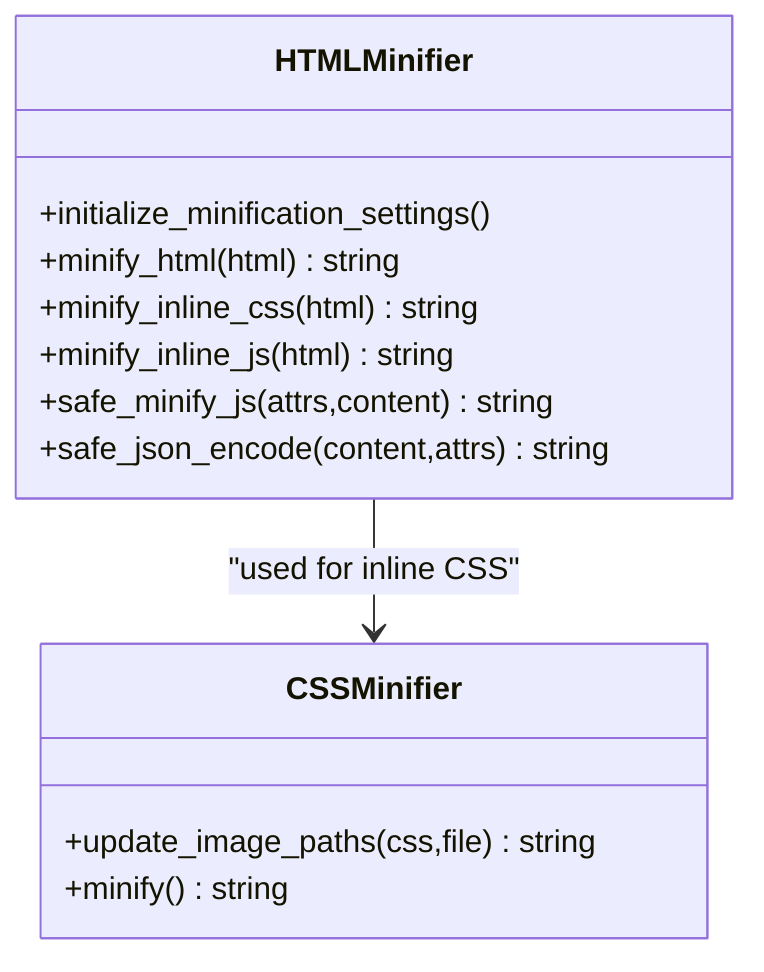

**Diagram sources**
- [class-html.php:32-68](file://includes/minify/class-html.php#L32-L68)
- [class-html.php:116-143](file://includes/minify/class-html.php#L116-L143)
- [class-css.php:23-55](file://includes/minify/class-css.php#L23-L55)
- [class-css.php:143-190](file://includes/minify/class-css.php#L143-L190)

**Section sources**
- [class-html.php:32-68](file://includes/minify/class-html.php#L32-L68)
- [class-html.php:116-143](file://includes/minify/class-html.php#L116-L143)
- [class-css.php:63-106](file://includes/minify/class-css.php#L63-L106)
- [class-css.php:143-190](file://includes/minify/class-css.php#L143-L190)

### CDN URL Rewriting
The Cache class conditionally rewrites local asset URLs to a configured CDN host for wp-content and wp-includes resources. It uses WordPress’s HTML tag processor when available, scanning img, script, link, source, and video tags and replacing attributes that match the site URL and contain the target paths. It supports both src and srcset attributes.

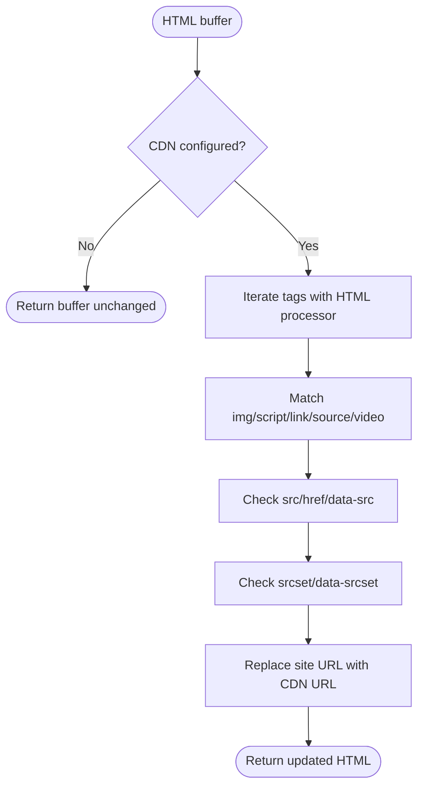

**Diagram sources**
- [class-cache.php:325-381](file://includes/class-cache.php#L325-L381)

**Section sources**
- [class-cache.php:325-381](file://includes/class-cache.php#L325-L381)

### Cache File Structure and URL Path Mapping
Cache files are organized under a domain-based directory and mirror the URL path structure:
- Root: wp-content/cache/wppo/{domain}/{url_path}/index.{html|css}
- Example: for a request to example.com/blog/post/, the cache file is stored at index.html under the path derived from the URL path.
- Gzip variant: index.html.gz is written alongside the uncompressed file.
- CSS files are similarly stored under the same path structure with .css extension.

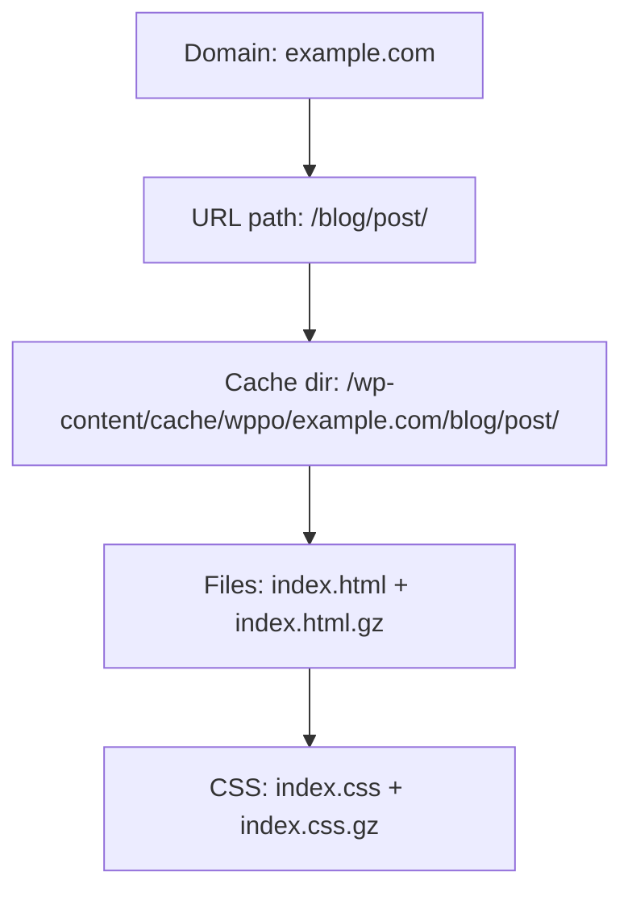

**Diagram sources**
- [class-cache.php:433-447](file://includes/class-cache.php#L433-L447)

**Section sources**
- [class-cache.php:433-447](file://includes/class-cache.php#L433-L447)

### Role of the Cache Class in the Architecture
- Hook integration: Registered by the main controller at template_redirect and save_post.
- Buffer interception: Starts output buffering and processes the buffer through the pipeline.
- Storage: Writes both uncompressed and gzip-compressed files using the filesystem abstraction.
- Invalidation: Granular invalidation on content changes and smart purging for archives and taxonomy pages.
- Preload integration: Coordinates with cron to pre-generate caches for public posts.

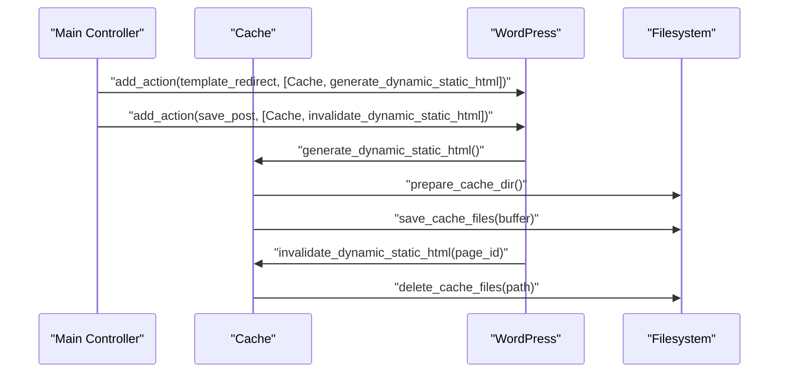

**Diagram sources**
- [class-main.php:175-177](file://includes/class-main.php#L175-L177)
- [class-main.php:177](file://includes/class-main.php#L177)
- [class-cache.php:260-310](file://includes/class-cache.php#L260-L310)
- [class-cache.php:470-483](file://includes/class-cache.php#L470-L483)
- [class-cache.php:546-598](file://includes/class-cache.php#L546-L598)

**Section sources**
- [class-main.php:175-177](file://includes/class-main.php#L175-L177)
- [class-main.php:177](file://includes/class-main.php#L177)
- [class-cache.php:260-310](file://includes/class-cache.php#L260-L310)
- [class-cache.php:470-483](file://includes/class-cache.php#L470-L483)
- [class-cache.php:546-598](file://includes/class-cache.php#L546-L598)

### Background Static Page Generation
The cron manager schedules background jobs to pre-generate static HTML for public posts in batches, skipping excluded URLs and randomizing delays to avoid load spikes. It marks pages as processed by deleting existing cache files and then loads the permalink to trigger generation.

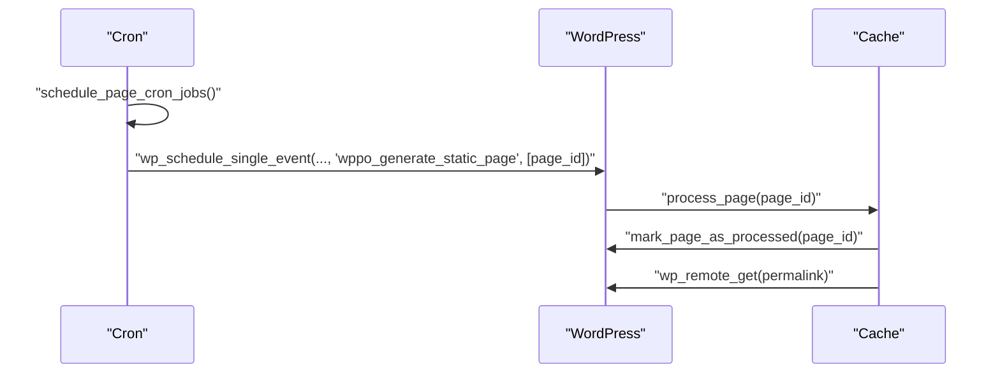

**Diagram sources**
- [class-cron.php:113-184](file://includes/class-cron.php#L113-L184)
- [class-cron.php:222-227](file://includes/class-cron.php#L222-L227)
- [class-cron.php:289-311](file://includes/class-cron.php#L289-L311)
- [class-cron.php:274-279](file://includes/class-cron.php#L274-L279)

**Section sources**
- [class-cron.php:113-184](file://includes/class-cron.php#L113-L184)
- [class-cron.php:222-227](file://includes/class-cron.php#L222-L227)
- [class-cron.php:289-311](file://includes/class-cron.php#L289-L311)
- [class-cron.php:274-279](file://includes/class-cron.php#L274-L279)

### Advanced Cache Drop-In
An optional advanced cache drop-in can serve static HTML directly from the filesystem, bypassing WordPress entirely for eligible requests. It computes the cache file path from the site domain and request URI, validates for directory traversal, and serves either the HTML or gzip-compressed variant.

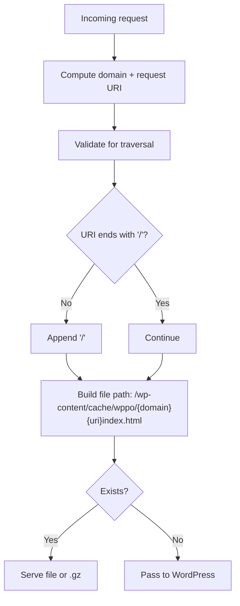

**Diagram sources**
- [class-advanced-cache-handler.php:112-141](file://includes/class-advanced-cache-handler.php#L112-L141)

**Section sources**
- [class-advanced-cache-handler.php:112-141](file://includes/class-advanced-cache-handler.php#L112-L141)

## Dependency Analysis
- Main controller depends on Cache for dynamic static HTML generation and invalidation.
- Cache depends on:
  - HTML minifier for HTML processing.
  - CSS minifier for CSS processing.
  - Image optimizer for image optimization and lazy-loading.
  - Utilities for filesystem operations and URL processing.
  - Cron manager for background static page generation.
- HTML/CSS minifiers depend on third-party libraries for minification.
- Image optimizer depends on WordPress’s HTML tag processor when available and regex fallback otherwise.

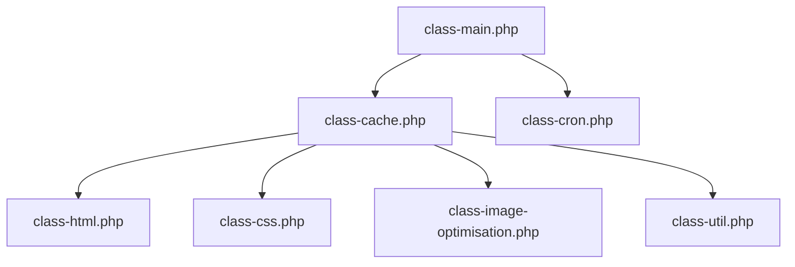

**Diagram sources**
- [class-main.php:175-177](file://includes/class-main.php#L175-L177)
- [class-cache.php:32-120](file://includes/class-cache.php#L32-L120)
- [class-html.php:32-68](file://includes/minify/class-html.php#L32-L68)
- [class-css.php:23-55](file://includes/minify/class-css.php#L23-L55)
- [class-image-optimisation.php:27-57](file://includes/class-image-optimisation.php#L27-L57)
- [class-util.php:29-80](file://includes/class-util.php#L29-L80)
- [class-cron.php:42-52](file://includes/class-cron.php#L42-L52)

**Section sources**
- [class-main.php:175-177](file://includes/class-main.php#L175-L177)
- [class-cache.php:32-120](file://includes/class-cache.php#L32-L120)

## Performance Considerations
- Memory usage:
  - Output buffering captures the entire page HTML; ensure adequate memory limits for complex pages.
  - Minification and CDN rewriting add CPU overhead; enable only when beneficial.
  - Gzip compression increases I/O but reduces bandwidth; ensure filesystem write performance.
- Disk I/O:
  - Cache directory is created lazily; ensure sufficient disk space and proper permissions.
  - Gzip compression doubles storage but improves transfer speed.
- Background generation:
  - Cron batches prevent memory exhaustion and spread load across time.
  - Randomized delays reduce simultaneous requests.
- CDN benefits:
  - Offloads static assets to CDN edges, reducing origin latency and bandwidth.
- Comparison to traditional WordPress caching:
  - Traditional object/page caching stores PHP-rendered responses in memory or files; this approach stores fully rendered HTML on disk, reducing PHP execution for static pages.
  - This method is particularly effective for public, non-authenticated pages and can be combined with CDN for global acceleration.

[No sources needed since this section provides general guidance]

## Troubleshooting Guide
- Cache not generated:
  - Verify template_redirect hook registration and that the user is not logged in.
  - Check is_not_cacheable conditions (domain, query parameters, 404).
  - Ensure filesystem initialization succeeds and cache directory is writable.
- Incorrect cache path:
  - Confirm URL path normalization and absence of directory traversal.
  - Validate domain extraction from HTTP_HOST.
- Minification issues:
  - Review minify options and ensure inline CSS/JS are compatible.
  - Check for exceptions thrown by minifiers and fallback behavior.
- CDN rewrite not applied:
  - Confirm CDN URL is configured and WordPress HTML tag processor is available.
  - Verify that URLs match the expected wp-content/wp-includes patterns.
- Invalidation not working:
  - Ensure save_post hook triggers invalidate_dynamic_static_html.
  - Check smart purging logic for home/blog archives and taxonomy pages.
- Cron generation not running:
  - Verify cron schedules and that batches are scheduled.
  - Confirm wp_remote_get timeouts and network connectivity.

**Section sources**
- [class-cache.php:406-423](file://includes/class-cache.php#L406-L423)
- [class-cache.php:492-536](file://includes/class-cache.php#L492-L536)
- [class-cache.php:546-598](file://includes/class-cache.php#L546-L598)
- [class-html.php:282-342](file://includes/minify/class-html.php#L282-L342)
- [class-cache.php:325-381](file://includes/class-cache.php#L325-L381)
- [class-cron.php:113-184](file://includes/class-cron.php#L113-L184)

## Conclusion
The dynamic static HTML caching mechanism intercepts WordPress requests early in the lifecycle, processes the output buffer through image optimization, optional minification, and CDN rewriting, and persists the result to disk. The Cache class orchestrates path computation, storage, and invalidation, while the main controller wires hooks and integrates with cron for background generation. Compared to traditional WordPress caching, this approach stores fully rendered HTML on disk, reducing PHP execution for static pages and leveraging CDN distribution for improved performance.

[No sources needed since this section summarizes without analyzing specific files]