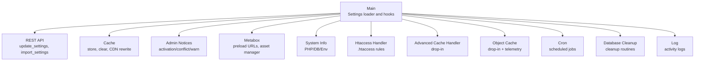
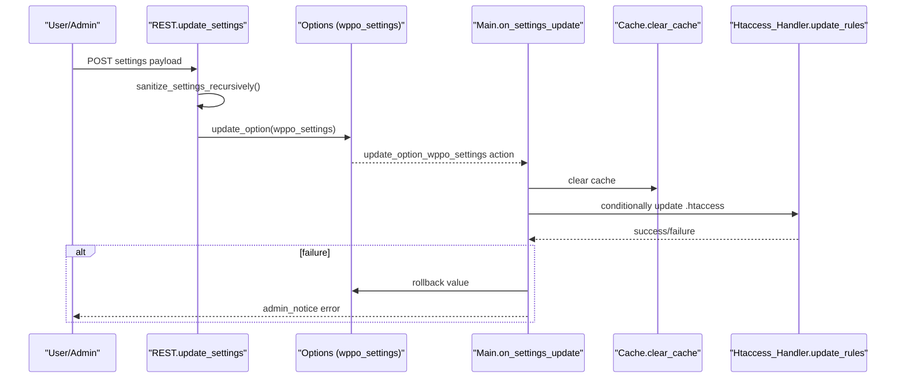
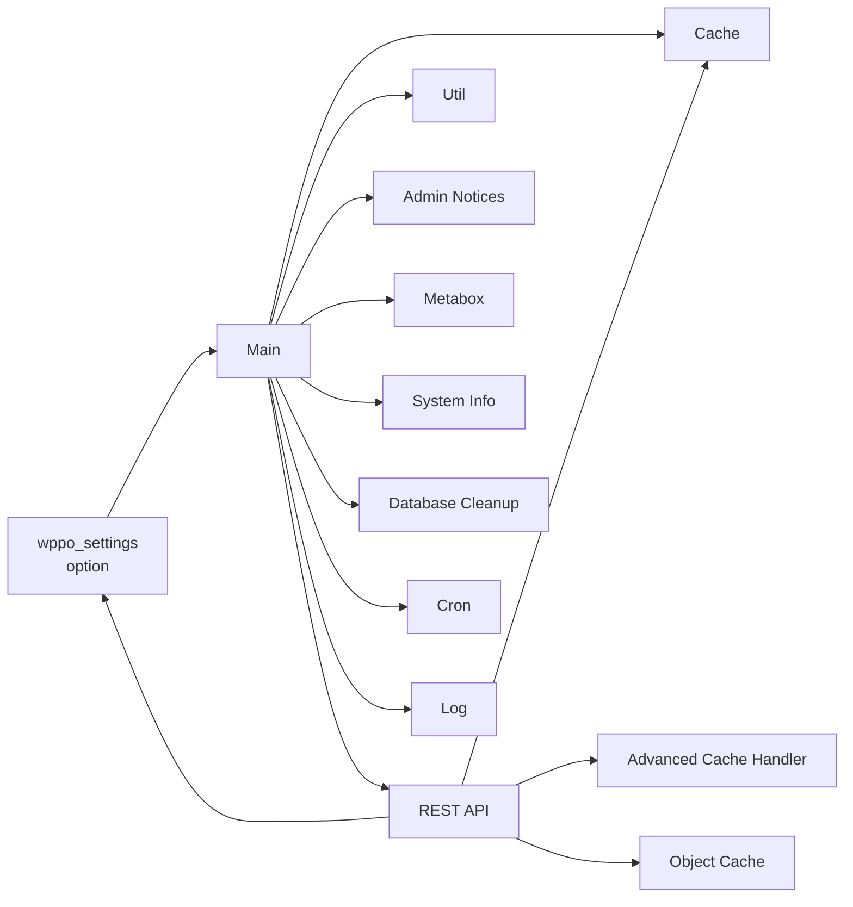

# Configuration Management

<cite>
**Referenced Files in This Document**
- [performance-optimisation.php](file://performance-optimisation.php)
- [class-main.php](file://includes/class-main.php)
- [class-rest.php](file://includes/class-rest.php)
- [class-admin-notices.php](file://includes/class-admin-notices.php)
- [class-metabox.php](file://includes/class-metabox.php)
- [class-system-info.php](file://includes/class-system-info.php)
- [class-cache.php](file://includes/class-cache.php)
- [class-util.php](file://includes/class-util.php)
- [class-htaccess-handler.php](file://includes/class-htaccess-handler.php)
- [class-asset-manager.php](file://includes/class-asset-manager.php)
- [class-database-cleanup.php](file://includes/class-database-cleanup.php)
- [class-cron.php](file://includes/class-cron.php)
- [class-log.php](file://includes/class-log.php)
- [class-advanced-cache-handler.php](file://includes/class-advanced-cache-handler.php)
- [class-object-cache.php](file://includes/class-object-cache.php)
</cite>

## Table of Contents
1. [Introduction](#introduction)
2. [Project Structure](#project-structure)
3. [Core Components](#core-components)
4. [Architecture Overview](#architecture-overview)
5. [Detailed Component Analysis](#detailed-component-analysis)
6. [Dependency Analysis](#dependency-analysis)
7. [Performance Considerations](#performance-considerations)
8. [Troubleshooting Guide](#troubleshooting-guide)
9. [Conclusion](#conclusion)
10. [Appendices](#appendices)

## Introduction
This document explains the configuration management features of the plugin, focusing on the settings structure, option validation, import/export functionality, admin notices, metabox integration, system information display, backup and restore procedures, multisite considerations, and settings synchronization. It also covers programmatic configuration changes and how to integrate custom settings.

## Project Structure
The plugin organizes configuration-related functionality across several focused classes:
- Settings persistence and lifecycle: Main, REST API, Cache, Util
- Admin UX: Admin Notices, Metabox, System Info
- Infrastructure: Htaccess Handler, Advanced Cache Handler, Object Cache
- Automation: Cron, Database Cleanup, Logging

**Diagram sources**
- [class-main.php:118-241](file://includes/class-main.php#L118-L241)
- [class-rest.php:37-123](file://includes/class-rest.php#L37-L123)
- [class-cache.php:94-120](file://includes/class-cache.php#L94-L120)
- [class-admin-notices.php:43-46](file://includes/class-admin-notices.php#L43-L46)
- [class-metabox.php:37-42](file://includes/class-metabox.php#L37-L42)
- [class-system-info.php:62-71](file://includes/class-system-info.php#L62-L71)
- [class-htaccess-handler.php:42-74](file://includes/class-htaccess-handler.php#L42-L74)
- [class-advanced-cache-handler.php:104-191](file://includes/class-advanced-cache-handler.php#L104-L191)
- [class-object-cache.php:78-144](file://includes/class-object-cache.php#L78-L144)
- [class-cron.php:42-52](file://includes/class-cron.php#L42-L52)
- [class-database-cleanup.php:529-546](file://includes/class-database-cleanup.php#L529-L546)
- [class-log.php:32-62](file://includes/class-log.php#L32-L62)

**Section sources**
- [performance-optimisation.php:17-44](file://performance-optimisation.php#L17-L44)
- [class-main.php:118-241](file://includes/class-main.php#L118-L241)

## Core Components
- Settings storage: WordPress option named wppo_settings, hierarchical under file_optimisation, image_optimisation, preload_settings, database_cleanup, object_cache.
- Validation and sanitization: REST endpoints sanitize recursively; URL lists are normalized; path inputs are validated to prevent traversal.
- Lifecycle hooks: update_option_wppo_settings triggers cache clear and .htaccess updates; Main constructor loads defaults and initializes subsystems.

Key behaviors:
- Default settings are merged with persisted values on boot.
- On settings update, cache is cleared; .htaccess rules are conditionally applied and rolled back on failure with admin notice.
- REST endpoints expose import/export-like operations via JSON payload handling.

**Section sources**
- [class-main.php:99-118](file://includes/class-main.php#L99-L118)
- [class-main.php:250-277](file://includes/class-main.php#L250-L277)
- [class-rest.php:184-200](file://includes/class-rest.php#L184-L200)
- [class-rest.php:409-432](file://includes/class-rest.php#L409-L432)

## Architecture Overview
The configuration lifecycle spans initialization, REST-driven updates, and runtime enforcement.

**Diagram sources**
- [class-rest.php:184-200](file://includes/class-rest.php#L184-L200)
- [class-main.php:250-277](file://includes/class-main.php#L250-L277)
- [class-htaccess-handler.php:42-74](file://includes/class-htaccess-handler.php#L42-L74)

## Detailed Component Analysis

### Settings Structure and Defaults
- Storage: WordPress option wppo_settings with nested sections:
  - file_optimisation: minification, defer/delay, combine, CDN, server rules, exclusions
  - image_optimisation: lazy-load, conversion format, batch sizes, exclusions
  - preload_settings: preload cache, exclusions, post-type feature images
  - database_cleanup: schedule and thresholds
  - object_cache: Redis connection settings
- Defaults: Bootstrapped in Main::__construct with sensible defaults for file_optimisation and empty containers for other sections.

Operational impact:
- Runtime toggles are read from options to attach filters/actions and adjust behavior (e.g., minify, defer, combine, preload cache).
- REST update merges tab-specific settings into the full option.

**Section sources**
- [class-main.php:99-118](file://includes/class-main.php#L99-L118)
- [class-main.php:171-222](file://includes/class-main.php#L171-L222)
- [class-rest.php:184-200](file://includes/class-rest.php#L184-L200)

### Option Validation and Sanitization
- REST update_settings:
  - Recursively sanitizes booleans and textareas; strips unsafe characters from keys.
  - Validates cache clear paths and image paths to prevent directory traversal.
- URL normalization:
  - process_urls normalizes newline or array inputs, trims, deduplicates, and reindexes.
- Path and URL safety:
  - Directory traversal checks in Cache, REST, and Util prevent unsafe file operations.

**Section sources**
- [class-rest.php:209-223](file://includes/class-rest.php#L209-L223)
- [class-rest.php:145-156](file://includes/class-rest.php#L145-L156)
- [class-rest.php:259-264](file://includes/class-rest.php#L259-L264)
- [class-util.php:243-248](file://includes/class-util.php#L243-L248)
- [class-cache.php:97-114](file://includes/class-cache.php#L97-L114)

### Import/Export Functionality
- Import via REST:
  - Endpoint accepts JSON with action/import_settings and settings array.
  - Sanitizes incoming settings and compares with existing option; updates only if changed.
  - Returns success/error with messages.
- Export via UI:
  - The admin page localizes wppoSettings.settings for client-side export; the plugin does not define a dedicated export endpoint in the reviewed code.

Notes:
- The UI exposes “Import Settings” and “Export Settings” labels, indicating client-side export is available in the admin interface. No server-side export endpoint was identified in the reviewed files.

**Section sources**
- [class-rest.php:409-432](file://includes/class-rest.php#L409-L432)
- [class-main.php:517-542](file://includes/class-main.php#L517-L542)

### Admin Notices System
- Rendered on admin_notices hook; dismissible via query args with nonce.
- Categories:
  - Welcome/Onboarding
  - Activation issues (foreign drop-in, WP_CACHE flag, wp-config write issues)
  - Competing page-cache plugins detection (when drop-in is ours)

**Section sources**
- [class-admin-notices.php:43-46](file://includes/class-admin-notices.php#L43-L46)
- [class-admin-notices.php:85-93](file://includes/class-admin-notices.php#L85-L93)
- [class-admin-notices.php:100-116](file://includes/class-admin-notices.php#L100-L116)
- [class-admin-notices.php:123-168](file://includes/class-admin-notices.php#L123-L168)
- [class-admin-notices.php:175-201](file://includes/class-admin-notices.php#L175-L201)

### Metabox Integration
- Preload Image URL metabox:
  - Stores textarea of URLs per post; sanitized and saved on save_post.
- Asset Manager metabox:
  - Captures frontend enqueued scripts/styles and stores as transient keyed by post ID.
  - Admin UI renders protected vs. disabled lists; saves whitelisted handles on save_post.

Protected assets:
- Script and style handles are protected to avoid breaking core/admin functionality.

**Section sources**
- [class-metabox.php:49-74](file://includes/class-metabox.php#L49-L74)
- [class-metabox.php:82-94](file://includes/class-metabox.php#L82-L94)
- [class-metabox.php:105-236](file://includes/class-metabox.php#L105-L236)
- [class-metabox.php:244-330](file://includes/class-metabox.php#L244-L330)
- [class-asset-manager.php:76-82](file://includes/class-asset-manager.php#L76-L82)
- [class-asset-manager.php:38-67](file://includes/class-asset-manager.php#L38-L67)

### System Information Display
- Aggregates:
  - PHP, database, WordPress, server, cache environment, and active cache plugin detection.
- Output:
  - Single endpoint returns grouped arrays for UI consumption.

**Section sources**
- [class-system-info.php:62-71](file://includes/class-system-info.php#L62-L71)
- [class-system-info.php:88-99](file://includes/class-system-info.php#L88-L99)
- [class-system-info.php:113-122](file://includes/class-system-info.php#L113-L122)
- [class-system-info.php:136-144](file://includes/class-system-info.php#L136-L144)
- [class-system-info.php:158-166](file://includes/class-system-info.php#L158-L166)
- [class-system-info.php:180-188](file://includes/class-system-info.php#L180-L188)
- [class-system-info.php:202-212](file://includes/class-system-info.php#L202-L212)
- [class-rest.php:790-792](file://includes/class-rest.php#L790-L792)

### Backup and Restore Procedures
- Settings backup/restore:
  - Import endpoint performs a full replacement of wppo_settings with sanitized input.
  - No built-in “export to file” endpoint; import is the primary restoration mechanism.
- Filesystem backups:
  - The plugin writes drop-in files (advanced-cache.php, object-cache.php) and manages cache directories. Backups are not automated by the plugin; administrators should maintain filesystem backups prior to enabling server-side rules or installing drop-ins.

**Section sources**
- [class-rest.php:409-432](file://includes/class-rest.php#L409-L432)
- [class-advanced-cache-handler.php:104-191](file://includes/class-advanced-cache-handler.php#L104-L191)
- [class-object-cache.php:208-247](file://includes/class-object-cache.php#L208-L247)

### Multi-site Configuration Considerations
- Active plugin detection includes both site-level and network-wide active plugins.
- Cron scheduling and database cleanup operate per-site; no explicit cross-site settings propagation is implemented in the reviewed code.

**Section sources**
- [class-admin-notices.php:208-217](file://includes/class-admin-notices.php#L208-L217)
- [class-cron.php:84-91](file://includes/class-cron.php#L84-L91)

### Settings Synchronization
- On update_option_wppo_settings, the plugin clears caches and conditionally updates .htaccess rules. If .htaccess update fails, the setting is rolled back and an admin notice is shown.
- There is no explicit cross-site synchronization; settings remain per-site.

**Section sources**
- [class-main.php:250-277](file://includes/class-main.php#L250-L277)

### Programmatic Configuration Changes
- REST endpoints:
  - update_settings: Merge tab-specific settings into wppo_settings and persist.
  - import_settings: Replace settings with sanitized JSON payload.
- Direct option manipulation:
  - Use update_option('wppo_settings', $settings) to persist changes programmatically.
  - Trigger cache clear via Cache::clear_cache() after updates.
- Example paths:
  - [Update settings:184-200](file://includes/class-rest.php#L184-L200)
  - [Import settings:409-432](file://includes/class-rest.php#L409-L432)
  - [Clear cache:647-677](file://includes/class-cache.php#L647-L677)

**Section sources**
- [class-rest.php:184-200](file://includes/class-rest.php#L184-L200)
- [class-rest.php:409-432](file://includes/class-rest.php#L409-L432)
- [class-cache.php:647-677](file://includes/class-cache.php#L647-L677)

### Custom Settings Integration
- Adding a new tab:
  - Extend the settings array with a new top-level key (e.g., 'my_tab') and merge it in update_settings.
  - Ensure sanitization is applied in sanitize_settings_recursively or by adding a dedicated validator.
- Exclusions and URL lists:
  - Use Util::process_urls to normalize user-provided URLs for JS/CSS excludes, preload cache exclusions, and similar lists.
- Example paths:
  - [Sanitization:209-223](file://includes/class-rest.php#L209-L223)
  - [URL normalization:243-248](file://includes/class-util.php#L243-248)

**Section sources**
- [class-rest.php:209-223](file://includes/class-rest.php#L209-L223)
- [class-util.php:243-248](file://includes/class-util.php#L243-L248)

## Dependency Analysis
Configuration management depends on:
- WordPress options API for persistence
- REST API for programmatic updates
- Filesystem API for drop-in and cache operations
- WordPress hooks for runtime behavior

**Diagram sources**
- [class-main.php:118-241](file://includes/class-main.php#L118-L241)
- [class-rest.php:37-123](file://includes/class-rest.php#L37-L123)
- [class-cache.php:94-120](file://includes/class-cache.php#L94-L120)
- [class-advanced-cache-handler.php:48-73](file://includes/class-advanced-cache-handler.php#L48-L73)
- [class-object-cache.php:78-144](file://includes/class-object-cache.php#L78-L144)
- [class-admin-notices.php:43-46](file://includes/class-admin-notices.php#L43-L46)
- [class-metabox.php:37-42](file://includes/class-metabox.php#L37-L42)
- [class-system-info.php:62-71](file://includes/class-system-info.php#L62-L71)
- [class-database-cleanup.php:529-546](file://includes/class-database-cleanup.php#L529-L546)
- [class-cron.php:42-52](file://includes/class-cron.php#L42-L52)
- [class-log.php:32-62](file://includes/class-log.php#L32-L62)

**Section sources**
- [class-main.php:118-241](file://includes/class-main.php#L118-L241)
- [class-rest.php:37-123](file://includes/class-rest.php#L37-L123)

## Performance Considerations
- Batched operations:
  - Database cleanup uses chunked queries to avoid memory pressure.
  - Cron processes pages in batches to prevent timeouts.
- Caching:
  - REST responses leverage caching for counts and transient-based asset captures.
- CDN rewriting:
  - Conditional rewrite of asset URLs to CDN only when configured.

**Section sources**
- [class-database-cleanup.php:476-521](file://includes/class-database-cleanup.php#L476-L521)
- [class-cron.php:113-184](file://includes/class-cron.php#L113-L184)
- [class-cache.php:325-381](file://includes/class-cache.php#L325-L381)

## Troubleshooting Guide
Common issues and resolutions:
- .htaccess update fails:
  - Symptom: Error notice after toggling server rules.
  - Behavior: Setting is rolled back; admin notice instructs checking permissions.
  - Resolution: Verify file permissions and ownership; revert via FTP if needed.
- Foreign drop-in conflicts:
  - Symptom: Warning about competing page-cache plugins.
  - Resolution: Use only one full-page cache solution.
- Object cache enable failures:
  - Symptom: Cannot write config or drop-in; foreign drop-in present.
  - Resolution: Disable conflicting drop-in; ensure PhpRedis extension is installed.

**Section sources**
- [class-main.php:250-277](file://includes/class-main.php#L250-L277)
- [class-admin-notices.php:175-201](file://includes/class-admin-notices.php#L175-L201)
- [class-object-cache.php:208-247](file://includes/class-object-cache.php#L208-L247)

## Conclusion
The plugin’s configuration management centers on a single, structured option (wppo_settings) with robust sanitization, REST-driven updates, and careful lifecycle hooks. It integrates tightly with caching, filesystem operations, and admin UX to provide a cohesive configuration experience. While import is supported, export is client-side in the UI. Multi-site awareness is limited to active plugin detection and per-site scheduling.

## Appendices

### Settings Schema Overview
- file_optimisation
  - enableServerRules: boolean
  - cdnURL: string
  - minifyJS/minifyCSS/minifyHTML/minifyInlineCSS/minifyInlineJS: booleans
  - deferJS/delayJS: booleans
  - excludeJS/excludeCSS/excludeCombineCSS/excludeDeferJS/excludeDelayJS: URL lists
  - removeWooCSSJS/excludeUrlToKeepJSCSS/removeCssJsHandle: booleans/URL lists
- image_optimisation
  - lazyLoadImages/lazyLoadVideos: booleans
  - conversionFormat: webp/avif/both
  - batch: integer
  - excludeConvertImages/excludeImages/excludeVideos: URL lists
  - maxWidthImgSize: integer
- preload_settings
  - enablePreloadCache: boolean
  - excludePreloadCache: URL list
  - preloadFrontPageImg/preloadPostTypeImg: booleans
  - preloadFontsUrls/preloadCSSUrls/preconnectOrigins/dnsPrefetchOrigins: URL lists
- database_cleanup
  - dbSchedule: none/daily/weekly/monthly
  - dbRevMaxAge/dbRevKeepLatest: integers
- object_cache
  - mode/host/port/password/database/nodes/master_name/use_tls/persistent/compression: mixed

**Section sources**
- [class-main.php:99-118](file://includes/class-main.php#L99-L118)
- [class-rest.php:184-200](file://includes/class-rest.php#L184-L200)