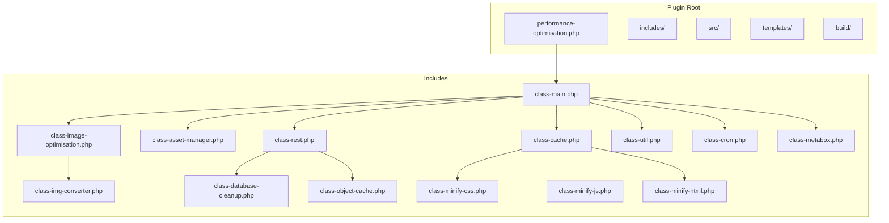
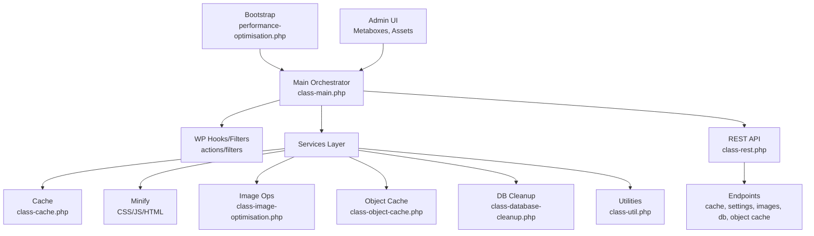
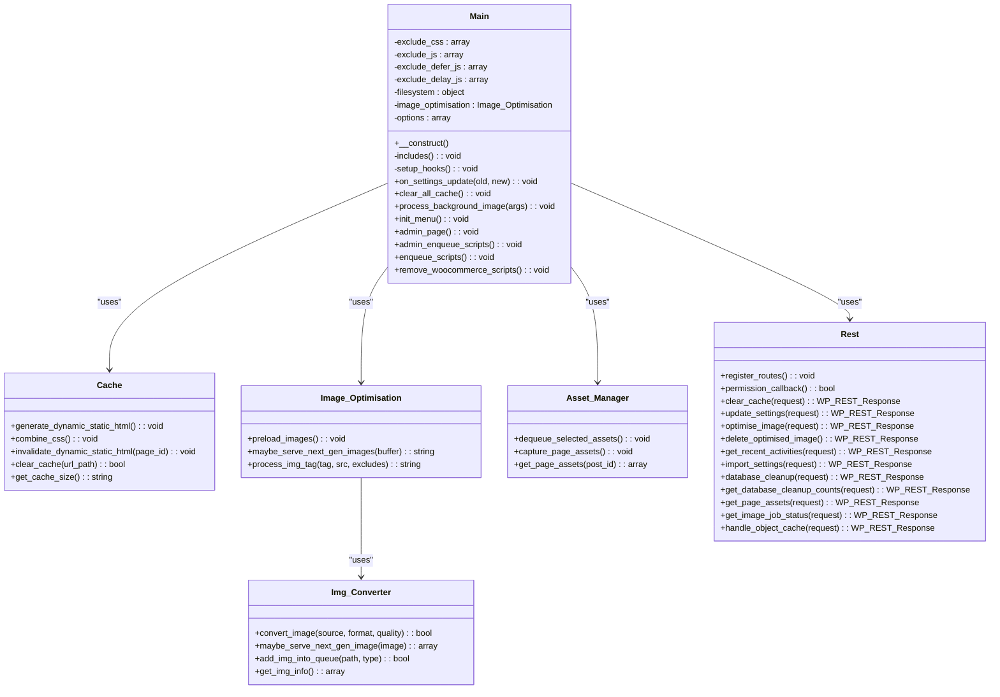
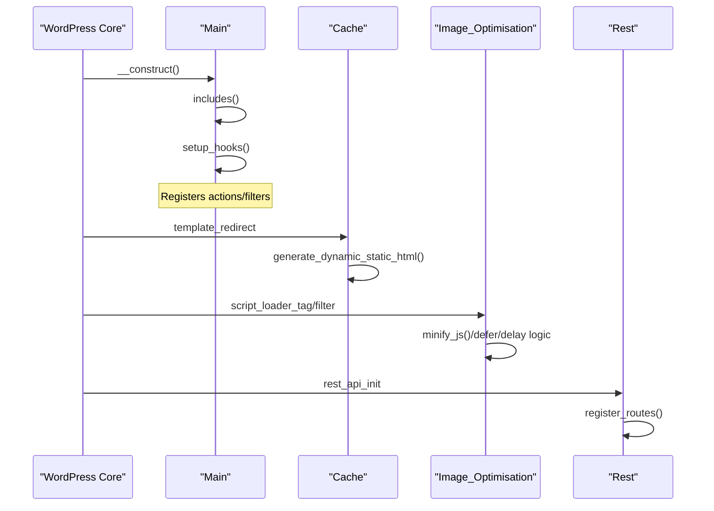
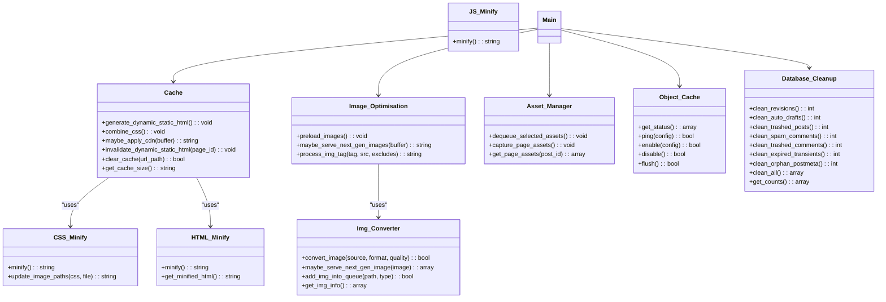
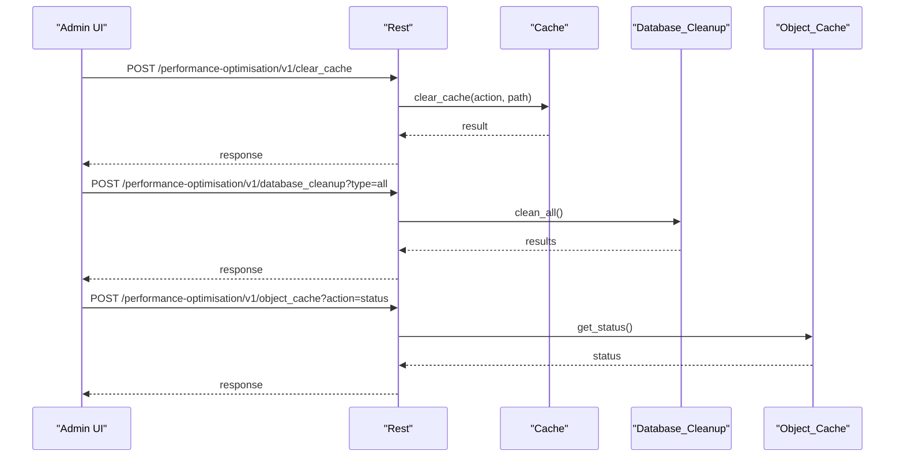
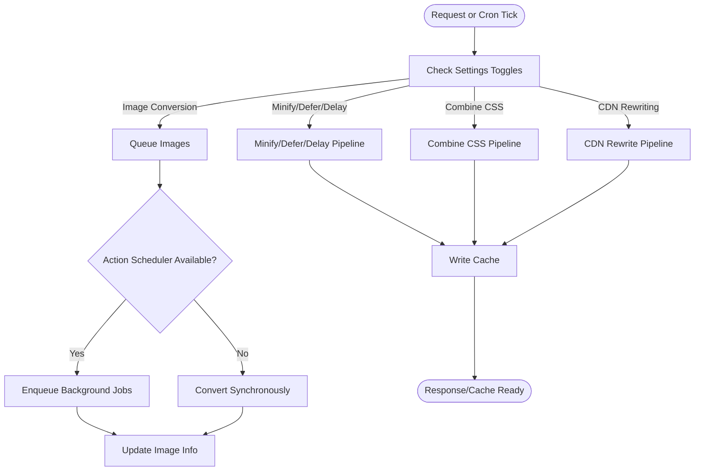
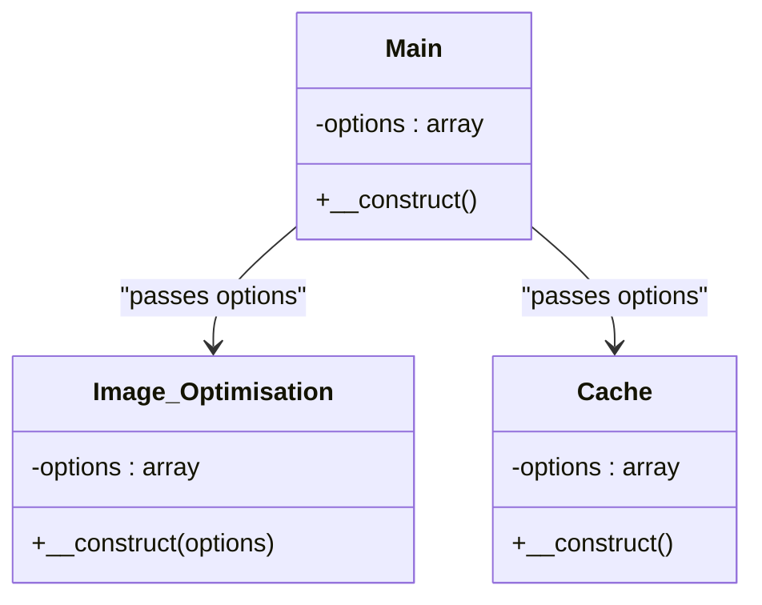
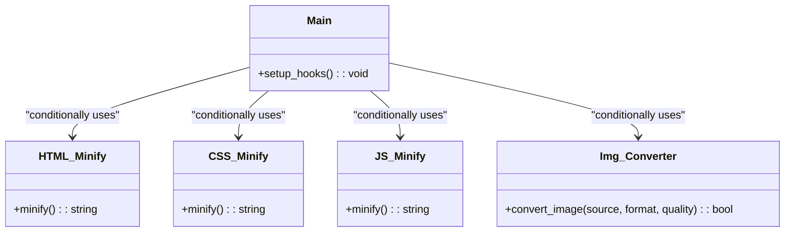
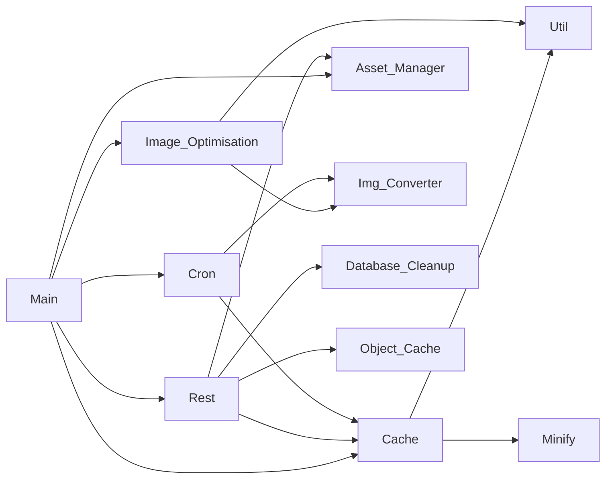

# Core Architecture

<cite>
**Referenced Files in This Document**
- [performance-optimisation.php](file://performance-optimisation.php)
- [class-main.php](file://includes/class-main.php)
- [class-cache.php](file://includes/class-cache.php)
- [class-asset-manager.php](file://includes/class-asset-manager.php)
- [class-image-optimisation.php](file://includes/class-image-optimisation.php)
- [class-img-converter.php](file://includes/class-img-converter.php)
- [class-rest.php](file://includes/class-rest.php)
- [class-util.php](file://includes/class-util.php)
- [class-cron.php](file://includes/class-cron.php)
- [class-database-cleanup.php](file://includes/class-database-cleanup.php)
- [class-metabox.php](file://includes/class-metabox.php)
- [class-object-cache.php](file://includes/class-object-cache.php)
- [class-minify-css.php](file://includes/minify/class-css.php)
- [class-minify-js.php](file://includes/minify/class-js.php)
- [class-minify-html.php](file://includes/minify/class-html.php)
</cite>

## Table of Contents
1. [Introduction](#introduction)
2. [Project Structure](#project-structure)
3. [Core Components](#core-components)
4. [Architecture Overview](#architecture-overview)
5. [Detailed Component Analysis](#detailed-component-analysis)
6. [Dependency Analysis](#dependency-analysis)
7. [Performance Considerations](#performance-considerations)
8. [Troubleshooting Guide](#troubleshooting-guide)
9. [Conclusion](#conclusion)

## Introduction
This document describes the core architecture of the Performance Optimisation plugin. It focuses on the orchestrator pattern used by the Main class, the modular design separating caching, asset optimization, image processing, and administrative components, WordPress integration via hooks and filters, the service layer architecture, and the REST API implementation. It also covers singleton-like configuration usage, strategy-like selection of optimization approaches, and presents component and data flow diagrams to aid understanding.

## Project Structure
The plugin follows a namespace-based, feature-oriented structure:
- includes/: Core PHP classes implementing optimization features
- includes/minify/: Minification services for CSS, JS, and HTML
- src/: React-based admin UI (bundled via Webpack)
- templates/: Drop-in and admin templates
- build/: Built frontend assets
- vendor/: Composer dependencies

**Diagram sources**
- [performance-optimisation.php:1-68](file://performance-optimisation.php#L1-L68)
- [class-main.php:1-1131](file://includes/class-main.php#L1-L1131)
- [class-cache.php:1-755](file://includes/class-cache.php#L1-L755)
- [class-asset-manager.php:1-224](file://includes/class-asset-manager.php#L1-L224)
- [class-image-optimisation.php:1-1373](file://includes/class-image-optimisation.php#L1-L1373)
- [class-img-converter.php:1-762](file://includes/class-img-converter.php#L1-L762)
- [class-rest.php:1-843](file://includes/class-rest.php#L1-L843)
- [class-util.php:1-251](file://includes/class-util.php#L1-L251)
- [class-cron.php:1-397](file://includes/class-cron.php#L1-L397)
- [class-database-cleanup.php:1-652](file://includes/class-database-cleanup.php#L1-L652)
- [class-metabox.php:1-332](file://includes/class-metabox.php#L1-L332)
- [class-object-cache.php:1-290](file://includes/class-object-cache.php#L1-L290)
- [class-minify-css.php:1-192](file://includes/minify/class-css.php#L1-L192)
- [class-minify-js.php:1-131](file://includes/minify/class-js.php#L1-L131)
- [class-minify-html.php:1-372](file://includes/minify/class-html.php#L1-L372)

**Section sources**
- [performance-optimisation.php:1-68](file://performance-optimisation.php#L1-L68)

## Core Components
- Main orchestrator: Initializes subsystems, wires hooks/filters, and coordinates lifecycle actions.
- Caching engine: Dynamic static HTML cache, CSS combination, CDN rewriting, and cache management.
- Asset manager: Per-page script/style capture and selective disabling.
- Image optimization: Next-gen image serving, conversion, preloading, and lazy-loading.
- REST API: Admin endpoints for cache, settings, image optimization, diagnostics, and object cache.
- Utilities: Filesystem, URL processing, preload link generation, and image MIME detection.
- Background jobs: Cron scheduler for static page generation, image conversion, and database cleanup.
- Administrative UI: Metaboxes for preload URLs and asset manager, plus admin pages and assets.

**Section sources**
- [class-main.php:1-1131](file://includes/class-main.php#L1-L1131)
- [class-cache.php:1-755](file://includes/class-cache.php#L1-L755)
- [class-asset-manager.php:1-224](file://includes/class-asset-manager.php#L1-L224)
- [class-image-optimisation.php:1-1373](file://includes/class-image-optimisation.php#L1-L1373)
- [class-img-converter.php:1-762](file://includes/class-img-converter.php#L1-L762)
- [class-rest.php:1-843](file://includes/class-rest.php#L1-L843)
- [class-util.php:1-251](file://includes/class-util.php#L1-L251)
- [class-cron.php:1-397](file://includes/class-cron.php#L1-L397)
- [class-database-cleanup.php:1-652](file://includes/class-database-cleanup.php#L1-L652)
- [class-metabox.php:1-332](file://includes/class-metabox.php#L1-L332)
- [class-object-cache.php:1-290](file://includes/class-object-cache.php#L1-L290)

## Architecture Overview
The plugin uses a layered architecture:
- Bootstrap layer initializes constants, autoloaders, and the Main orchestrator.
- Orchestrator layer (Main) loads subsystems, registers WordPress hooks/filters, and wires services.
- Service layer implements optimization features (cache, minify, image, object cache, database cleanup).
- Integration layer exposes REST endpoints and admin UI.
- Data layer persists configuration and runtime state (options, cache, image info).

**Diagram sources**
- [performance-optimisation.php:1-68](file://performance-optimisation.php#L1-L68)
- [class-main.php:1-1131](file://includes/class-main.php#L1-L1131)
- [class-rest.php:1-843](file://includes/class-rest.php#L1-L843)
- [class-cache.php:1-755](file://includes/class-cache.php#L1-L755)
- [class-image-optimisation.php:1-1373](file://includes/class-image-optimisation.php#L1-L1373)
- [class-object-cache.php:1-290](file://includes/class-object-cache.php#L1-L290)
- [class-database-cleanup.php:1-652](file://includes/class-database-cleanup.php#L1-L652)
- [class-util.php:1-251](file://includes/class-util.php#L1-L251)

## Detailed Component Analysis

### Main Orchestrator Pattern
The Main class acts as the central orchestrator:
- Loads autoloader and required subsystems.
- Initializes filesystem and image optimization service.
- Registers WordPress hooks/filters for admin UI, frontend asset injection, caching, minification, and background processing.
- Coordinates settings-driven behavior (e.g., defer/delay JS, combine CSS, CDN rewriting).
- Provides admin menu and localized assets for the React UI.

**Diagram sources**
- [class-main.php:1-1131](file://includes/class-main.php#L1-L1131)
- [class-cache.php:1-755](file://includes/class-cache.php#L1-L755)
- [class-image-optimisation.php:1-1373](file://includes/class-image-optimisation.php#L1-L1373)
- [class-img-converter.php:1-762](file://includes/class-img-converter.php#L1-L762)
- [class-asset-manager.php:1-224](file://includes/class-asset-manager.php#L1-L224)
- [class-rest.php:1-843](file://includes/class-rest.php#L1-L843)

**Section sources**
- [class-main.php:1-1131](file://includes/class-main.php#L1-L1131)

### WordPress Integration Patterns
- Hooks: Admin menu, admin_enqueue_scripts, wp_enqueue_scripts, admin_bar_menu, template_redirect, save_post, rest_api_init, wp_ajax_*.
- Filters: script_loader_tag, style_loader_tag for minification and defer/delay logic.
- REST API: Namespaced endpoints for cache, settings, image optimization, database cleanup, object cache, and diagnostics.
- Admin UI: Metaboxes for preload URLs and asset manager; localized admin scripts with REST endpoints and nonces.

**Diagram sources**
- [class-main.php:164-241](file://includes/class-main.php#L164-L241)
- [class-cache.php:260-310](file://includes/class-cache.php#L260-L310)
- [class-image-optimisation.php:95-208](file://includes/class-image-optimisation.php#L95-L208)
- [class-rest.php:37-43](file://includes/class-rest.php#L37-L43)

**Section sources**
- [class-main.php:164-241](file://includes/class-main.php#L164-L241)
- [class-rest.php:37-136](file://includes/class-rest.php#L37-L136)

### Service Layer Architecture
- Cache service: Manages dynamic static HTML cache, CSS combination, CDN rewriting, and cache purging.
- Minification services: CSS, JS, and HTML minifiers encapsulated in dedicated classes.
- Image optimization service: Integrates conversion and next-gen serving via Img_Converter.
- Asset manager service: Captures and selectively disables assets per page/post.
- Object cache service: Manages Redis drop-in installation and telemetry.
- Database cleanup service: Batched cleanup routines for revisions, drafts, trashed items, spam, transients, and orphaned meta.

**Diagram sources**
- [class-cache.php:1-755](file://includes/class-cache.php#L1-L755)
- [class-minify-css.php:1-192](file://includes/minify/class-css.php#L1-L192)
- [class-minify-js.php:1-131](file://includes/minify/class-js.php#L1-L131)
- [class-minify-html.php:1-372](file://includes/minify/class-html.php#L1-L372)
- [class-image-optimisation.php:1-1373](file://includes/class-image-optimisation.php#L1-L1373)
- [class-img-converter.php:1-762](file://includes/class-img-converter.php#L1-L762)
- [class-asset-manager.php:1-224](file://includes/class-asset-manager.php#L1-L224)
- [class-object-cache.php:1-290](file://includes/class-object-cache.php#L1-L290)
- [class-database-cleanup.php:1-652](file://includes/class-database-cleanup.php#L1-L652)

**Section sources**
- [class-cache.php:1-755](file://includes/class-cache.php#L1-L755)
- [class-minify-css.php:1-192](file://includes/minify/class-css.php#L1-L192)
- [class-minify-js.php:1-131](file://includes/minify/class-js.php#L1-L131)
- [class-minify-html.php:1-372](file://includes/minify/class-html.php#L1-L372)
- [class-image-optimisation.php:1-1373](file://includes/class-image-optimisation.php#L1-L1373)
- [class-img-converter.php:1-762](file://includes/class-img-converter.php#L1-L762)
- [class-asset-manager.php:1-224](file://includes/class-asset-manager.php#L1-L224)
- [class-object-cache.php:1-290](file://includes/class-object-cache.php#L1-L290)
- [class-database-cleanup.php:1-652](file://includes/class-database-cleanup.php#L1-L652)

### REST API Implementation
The Rest class registers a namespaced REST API with endpoints for:
- Cache management (clear single/all)
- Settings update/import
- Image optimization (background queue and status)
- Database cleanup (counts and operations)
- Page asset inspection
- Object cache (status, ping, enable/disable, flush)
- System info and performance scan

**Diagram sources**
- [class-rest.php:37-123](file://includes/class-rest.php#L37-L123)
- [class-cache.php:647-677](file://includes/class-cache.php#L647-L677)
- [class-database-cleanup.php:529-546](file://includes/class-database-cleanup.php#L529-L546)
- [class-object-cache.php:78-144](file://includes/class-object-cache.php#L78-L144)

**Section sources**
- [class-rest.php:1-843](file://includes/class-rest.php#L1-L843)

### Data Flow and Background Processing
- Settings-driven toggles control minification, defer/delay, combine CSS, CDN rewriting, and image conversion.
- Background processing uses Action Scheduler when available; otherwise synchronous fallback.
- Cron orchestrates periodic tasks: static page generation, image conversion, and database cleanup.

**Diagram sources**
- [class-main.php:164-241](file://includes/class-main.php#L164-L241)
- [class-cache.php:260-310](file://includes/class-cache.php#L260-L310)
- [class-image-optimisation.php:95-208](file://includes/class-image-optimisation.php#L95-L208)
- [class-img-converter.php:104-310](file://includes/class-img-converter.php#L104-L310)
- [class-cron.php:321-360](file://includes/class-cron.php#L321-L360)

**Section sources**
- [class-main.php:164-241](file://includes/class-main.php#L164-L241)
- [class-cache.php:260-310](file://includes/class-cache.php#L260-L310)
- [class-image-optimisation.php:95-208](file://includes/class-image-optimisation.php#L95-L208)
- [class-img-converter.php:104-310](file://includes/class-img-converter.php#L104-L310)
- [class-cron.php:321-360](file://includes/class-cron.php#L321-L360)

### Singleton Pattern Usage for Global Configuration
- Global configuration is read once and reused across services via get_option('wppo_settings').
- The Main class stores options in a private property and passes them to services (e.g., Image_Optimisation, Cache).
- This avoids repeated disk reads and centralizes configuration access.

**Diagram sources**
- [class-main.php:98-118](file://includes/class-main.php#L98-L118)
- [class-image-optimisation.php:53-57](file://includes/class-image-optimisation.php#L53-L57)
- [class-cache.php:94-120](file://includes/class-cache.php#L94-L120)

**Section sources**
- [class-main.php:98-118](file://includes/class-main.php#L98-L118)

### Strategy Pattern Implementation for Optimization Approaches
- Minification: Strategy-like selection between HTML, CSS, and JS minifiers based on settings.
- Image conversion: Strategy-like selection between WebP, AVIF, or both based on configuration.
- CDN rewriting: Strategy applied only when CDN URL is configured.
- Lazy-load and preloading: Strategy applied based on user-defined exclusions and device targeting.

**Diagram sources**
- [class-minify-html.php:64-143](file://includes/minify/class-html.php#L64-L143)
- [class-minify-css.php:51-106](file://includes/minify/class-css.php#L51-L106)
- [class-minify-js.php:60-99](file://includes/minify/class-js.php#L60-L99)
- [class-img-converter.php:104-310](file://includes/class-img-converter.php#L104-L310)
- [class-main.php:164-241](file://includes/class-main.php#L164-L241)

**Section sources**
- [class-minify-html.php:64-143](file://includes/minify/class-html.php#L64-L143)
- [class-minify-css.php:51-106](file://includes/minify/class-css.php#L51-L106)
- [class-minify-js.php:60-99](file://includes/minify/class-js.php#L60-L99)
- [class-img-converter.php:104-310](file://includes/class-img-converter.php#L104-L310)
- [class-main.php:164-241](file://includes/class-main.php#L164-L241)

## Dependency Analysis
- Main depends on Cache, Asset_Manager, Image_Optimisation, Rest, Cron, Util, and other subsystems.
- Cache depends on Util and Minify services.
- Image_Optimisation depends on Img_Converter and Util.
- Rest depends on Cache, Database_Cleanup, Object_Cache, Asset_Manager, and Img_Converter indirectly via shared options.
- Cron depends on Cache and Img_Converter for background tasks.

**Diagram sources**
- [class-main.php:128-154](file://includes/class-main.php#L128-L154)
- [class-cache.php:1-755](file://includes/class-cache.php#L1-L755)
- [class-image-optimisation.php:1-1373](file://includes/class-image-optimisation.php#L1-L1373)
- [class-img-converter.php:1-762](file://includes/class-img-converter.php#L1-L762)
- [class-rest.php:1-843](file://includes/class-rest.php#L1-L843)
- [class-cron.php:1-397](file://includes/class-cron.php#L1-L397)
- [class-database-cleanup.php:1-652](file://includes/class-database-cleanup.php#L1-L652)
- [class-asset-manager.php:1-224](file://includes/class-asset-manager.php#L1-L224)

**Section sources**
- [class-main.php:128-154](file://includes/class-main.php#L128-L154)

## Performance Considerations
- Minification and CDN rewriting are gated by settings to avoid unnecessary overhead.
- Static HTML cache generation is skipped for logged-in users and non-cacheable paths.
- CSS combination applies exclusions and only for non-logged-in users.
- Background processing uses Action Scheduler when available; otherwise synchronous fallback prevents blocking.
- Batched database cleanup and cron scheduling prevent memory exhaustion and long-running operations.
- Image conversion queues pending images and processes them in controlled batches.

[No sources needed since this section provides general guidance]

## Troubleshooting Guide
- Cache clearing: Use REST endpoint or Main::clear_all_cache(); verify cache directory permissions.
- Settings rollback: Main::on_settings_update() rolls back .htaccess changes on failure and shows admin notices.
- Image conversion failures: Img_Converter validates file size and dimensions; logs errors and updates status.
- Object cache: Object_Cache::get_status() checks drop-in presence and Redis connectivity; ping() tests connection.
- Database cleanup: Rest::database_cleanup() returns partial or total failures; use counts endpoint to diagnose.

**Section sources**
- [class-main.php:250-277](file://includes/class-main.php#L250-L277)
- [class-cache.php:647-702](file://includes/class-cache.php#L647-L702)
- [class-img-converter.php:111-152](file://includes/class-img-converter.php#L111-L152)
- [class-object-cache.php:78-144](file://includes/class-object-cache.php#L78-L144)
- [class-rest.php:451-539](file://includes/class-rest.php#L451-L539)

## Conclusion
The Performance Optimisation plugin employs a robust orchestrator pattern centered on the Main class, integrating WordPress hooks and filters with a modular service layer. It separates concerns across caching, asset management, image optimization, and administrative utilities, exposing a comprehensive REST API for programmatic control. The architecture balances performance with configurability, leveraging background processing and batched operations to maintain responsiveness while delivering significant optimization benefits.