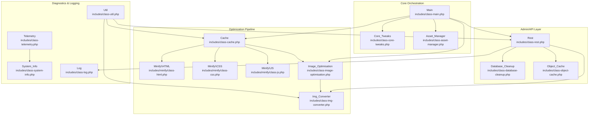
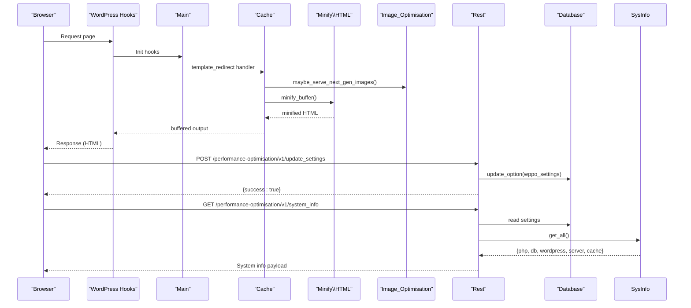
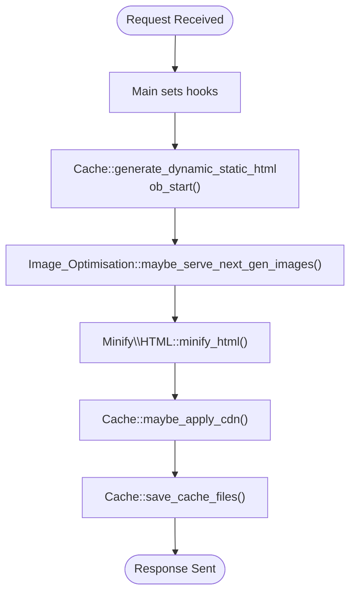
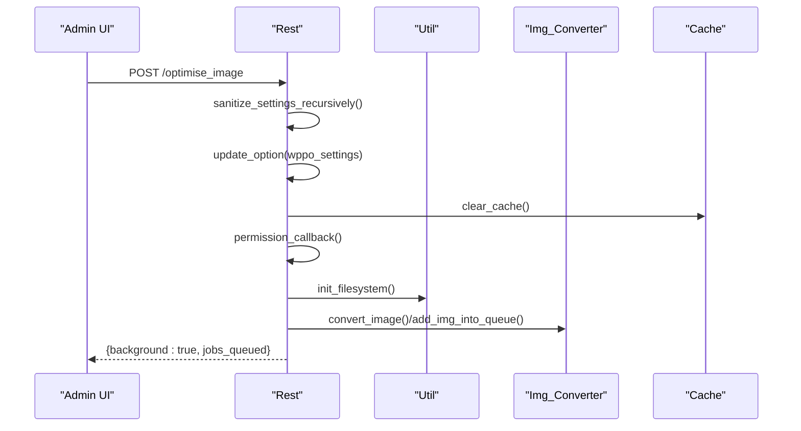
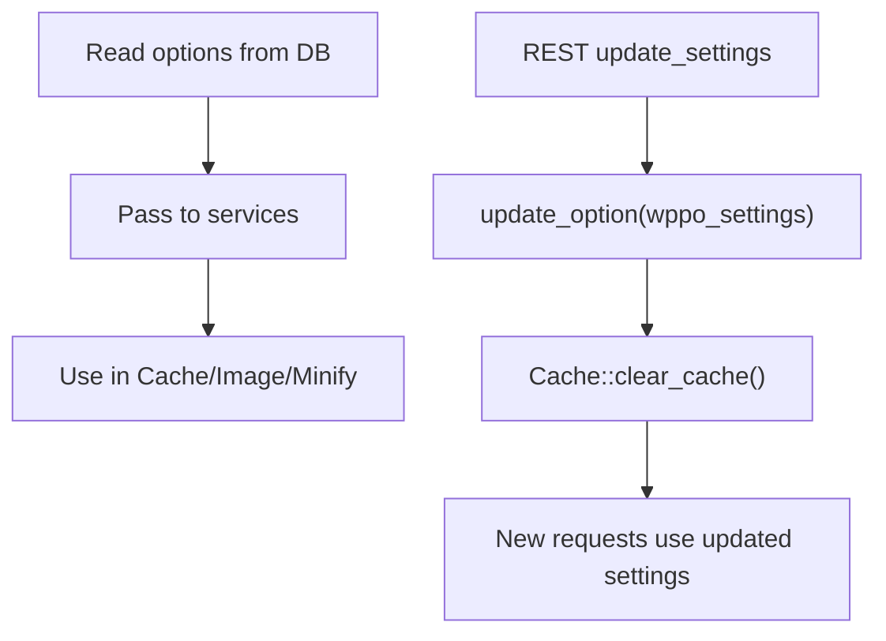
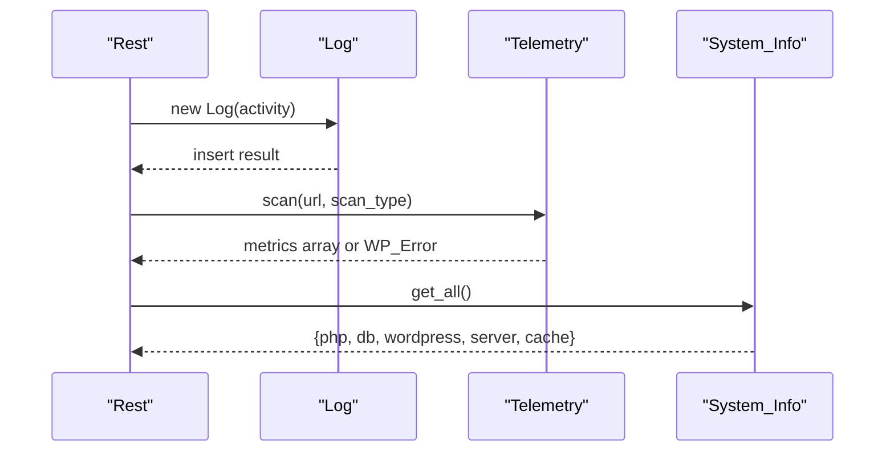
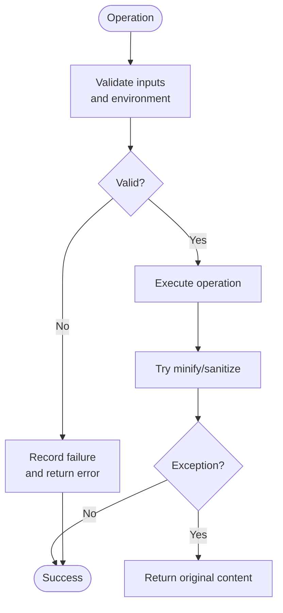
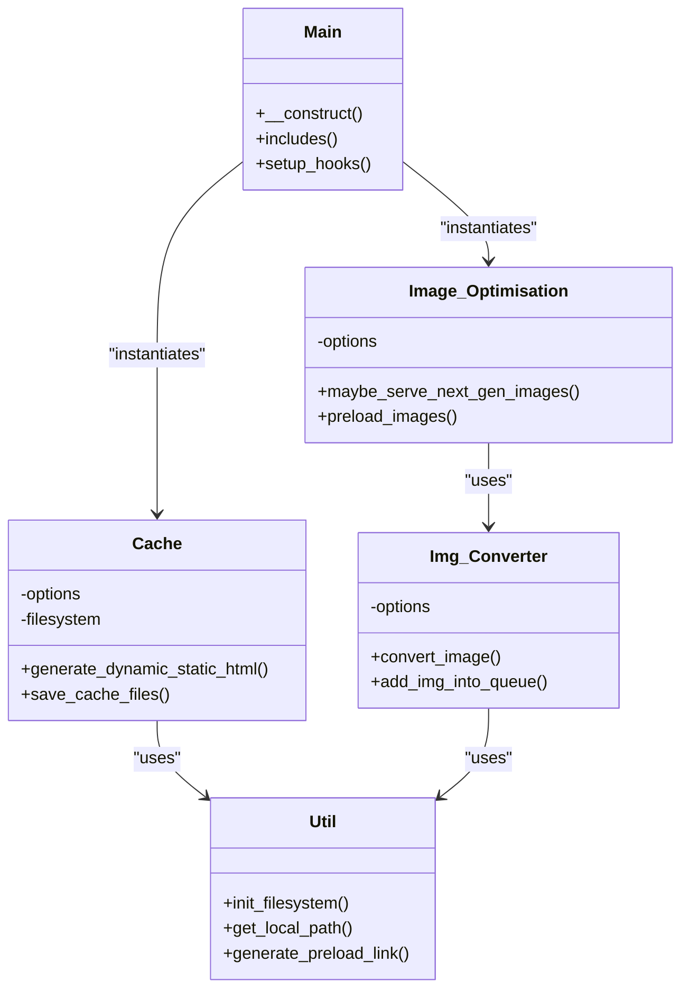
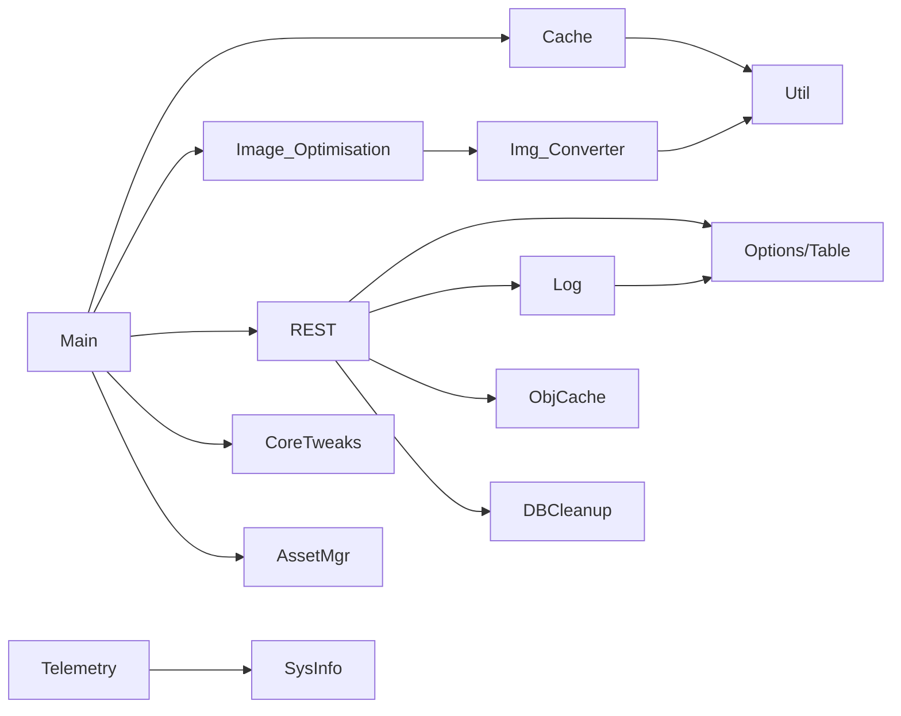

# Data Flow and Dependencies

<cite>
**Referenced Files in This Document**
- [class-main.php](file://includes/class-main.php)
- [class-rest.php](file://includes/class-rest.php)
- [class-cache.php](file://includes/class-cache.php)
- [class-image-optimisation.php](file://includes/class-image-optimisation.php)
- [class-img-converter.php](file://includes/class-img-converter.php)
- [class-util.php](file://includes/class-util.php)
- [class-telemetry.php](file://includes/class-telemetry.php)
- [class-system-info.php](file://includes/class-system-info.php)
- [class-log.php](file://includes/class-log.php)
- [class-database-cleanup.php](file://includes/class-database-cleanup.php)
- [class-object-cache.php](file://includes/class-object-cache.php)
- [class-core-tweaks.php](file://includes/class-core-tweaks.php)
- [class-asset-manager.php](file://includes/class-asset-manager.php)
- [minify/class-html.php](file://includes/minify/class-html.php)
- [minify/class-css.php](file://includes/minify/class-css.php)
- [minify/class-js.php](file://includes/minify/class-js.php)
</cite>

## Table of Contents
1. [Introduction](#introduction)
2. [Project Structure](#project-structure)
3. [Core Components](#core-components)
4. [Architecture Overview](#architecture-overview)
5. [Detailed Component Analysis](#detailed-component-analysis)
6. [Dependency Analysis](#dependency-analysis)
7. [Performance Considerations](#performance-considerations)
8. [Troubleshooting Guide](#troubleshooting-guide)
9. [Conclusion](#conclusion)

## Introduction
This document explains the data flow and dependencies within the plugin’s core architecture. It covers how requests traverse the optimization pipeline from initiation through processing to response delivery, how services depend on each other, and how configuration, logging, and telemetry integrate across the system. It also documents dependency injection patterns, configuration management (validation, persistence, inheritance), and error propagation/fallback mechanisms that maintain consistency across optimization stages.

## Project Structure
The plugin organizes functionality into cohesive classes grouped by responsibility:
- Core orchestration and lifecycle management
- REST API for admin and external integrations
- Optimization subsystems (caching, minification, image conversion, database cleanup)
- Utilities and shared helpers
- Telemetry and diagnostics
- Logging and auditing

**Diagram sources**
- [class-main.php:98-154](file://includes/class-main.php#L98-L154)
- [class-rest.php:37-43](file://includes/class-rest.php#L37-L43)
- [class-cache.php:94-120](file://includes/class-cache.php#L94-L120)
- [class-image-optimisation.php:53-57](file://includes/class-image-optimisation.php#L53-L57)
- [class-img-converter.php:83-91](file://includes/class-img-converter.php#L83-L91)
- [class-telemetry.php:45-51](file://includes/class-telemetry.php#L45-L51)
- [class-system-info.php:62-71](file://includes/class-system-info.php#L62-L71)
- [class-log.php:32-62](file://includes/class-log.php#L32-L62)
- [class-database-cleanup.php:30-37](file://includes/class-database-cleanup.php#L30-L37)
- [class-object-cache.php:22-62](file://includes/class-object-cache.php#L22-L62)
- [class-core-tweaks.php:32-56](file://includes/class-core-tweaks.php#L32-L56)
- [class-asset-manager.php:76-82](file://includes/class-asset-manager.php#L76-L82)
- [minify/class-html.php:64-68](file://includes/minify/class-html.php#L64-L68)
- [minify/class-css.php:51-55](file://includes/minify/class-css.php#L51-L55)
- [minify/class-js.php:60-64](file://includes/minify/class-js.php#L60-L64)

**Section sources**
- [class-main.php:98-154](file://includes/class-main.php#L98-L154)
- [class-rest.php:37-43](file://includes/class-rest.php#L37-L43)
- [class-cache.php:94-120](file://includes/class-cache.php#L94-L120)
- [class-image-optimisation.php:53-57](file://includes/class-image-optimisation.php#L53-L57)
- [class-img-converter.php:83-91](file://includes/class-img-converter.php#L83-L91)
- [class-telemetry.php:45-51](file://includes/class-telemetry.php#L45-L51)
- [class-system-info.php:62-71](file://includes/class-system-info.php#L62-L71)
- [class-log.php:32-62](file://includes/class-log.php#L32-L62)
- [class-database-cleanup.php:30-37](file://includes/class-database-cleanup.php#L30-L37)
- [class-object-cache.php:22-62](file://includes/class-object-cache.php#L22-L62)
- [class-core-tweaks.php:32-56](file://includes/class-core-tweaks.php#L32-L56)
- [class-asset-manager.php:76-82](file://includes/class-asset-manager.php#L76-L82)
- [minify/class-html.php:64-68](file://includes/minify/class-html.php#L64-L68)
- [minify/class-css.php:51-55](file://includes/minify/class-css.php#L51-L55)
- [minify/class-js.php:60-64](file://includes/minify/class-js.php#L60-L64)

## Core Components
- Main orchestrator initializes dependencies, loads classes, sets hooks, and wires core services.
- REST API exposes endpoints for settings, cache management, image optimization, database cleanup, and diagnostics.
- Cache engine generates dynamic static HTML, combines CSS, applies CDN rewriting, and minifies HTML/CSS/JS.
- Image optimization pipeline serves next-gen formats, preloads images, and lazily processes images.
- Utilities provide filesystem access, URL normalization, preload generation, and image MIME detection.
- Telemetry and System Info collect environment metrics and scan pages for performance insights.
- Logging persists activities and integrates with REST responses.
- Database Cleanup and Object Cache manage infrastructure-level optimizations.

**Section sources**
- [class-main.php:98-154](file://includes/class-main.php#L98-L154)
- [class-rest.php:37-43](file://includes/class-rest.php#L37-L43)
- [class-cache.php:32-120](file://includes/class-cache.php#L32-L120)
- [class-image-optimisation.php:27-57](file://includes/class-image-optimisation.php#L27-L57)
- [class-util.php:29-80](file://includes/class-util.php#L29-L80)
- [class-telemetry.php:31-51](file://includes/class-telemetry.php#L31-L51)
- [class-system-info.php:29-71](file://includes/class-system-info.php#L29-L71)
- [class-log.php:22-62](file://includes/class-log.php#L22-L62)
- [class-database-cleanup.php:30-37](file://includes/class-database-cleanup.php#L30-L37)
- [class-object-cache.php:22-62](file://includes/class-object-cache.php#L22-L62)

## Architecture Overview
The plugin follows a layered architecture:
- Entry points: WordPress hooks (actions/filters) and REST routes
- Orchestration: Main coordinates services and settings
- Processing: Cache, Minification, Image Optimization, and Utilities
- Persistence: Options, transients, filesystem, and database cleanup
- Observability: Telemetry, System Info, and Logging

**Diagram sources**
- [class-main.php:164-241](file://includes/class-main.php#L164-L241)
- [class-cache.php:260-310](file://includes/class-cache.php#L260-L310)
- [minify/class-html.php:116-143](file://includes/minify/class-html.php#L116-L143)
- [class-image-optimisation.php:95-208](file://includes/class-image-optimisation.php#L95-L208)
- [class-rest.php:184-200](file://includes/class-rest.php#L184-L200)
- [class-system-info.php:62-71](file://includes/class-system-info.php#L62-L71)

## Detailed Component Analysis

### Data Flow Through Optimization Pipeline
End-to-end flow from request to response:
1. Request arrives; Main sets hooks.
2. Cache intercepts output via template_redirect and buffers content.
3. Image optimization transforms image URLs and tags for next-gen formats and lazy loading.
4. HTML minification strips comments, whitespace, and optimizes attributes.
5. Optional CDN rewriting adjusts asset URLs.
6. Cache writes static HTML and gzipped variants.
7. Response is sent to client.

**Diagram sources**
- [class-main.php:164-177](file://includes/class-main.php#L164-L177)
- [class-cache.php:260-310](file://includes/class-cache.php#L260-L310)
- [class-image-optimisation.php:95-208](file://includes/class-image-optimisation.php#L95-L208)
- [minify/class-html.php:116-143](file://includes/minify/class-html.php#L116-L143)
- [class-cache.php:325-381](file://includes/class-cache.php#L325-L381)

**Section sources**
- [class-main.php:164-177](file://includes/class-main.php#L164-L177)
- [class-cache.php:260-310](file://includes/class-cache.php#L260-L310)
- [class-image-optimisation.php:95-208](file://includes/class-image-optimisation.php#L95-L208)
- [minify/class-html.php:116-143](file://includes/minify/class-html.php#L116-L143)
- [class-cache.php:325-381](file://includes/class-cache.php#L325-L381)

### REST API and Configuration Management
- REST endpoints validate and sanitize inputs, persist settings, and trigger cache invalidation.
- Settings are persisted in the options table and read across services.
- Background image conversion uses Action Scheduler when available, with synchronous fallback.

**Diagram sources**
- [class-rest.php:184-200](file://includes/class-rest.php#L184-L200)
- [class-rest.php:253-353](file://includes/class-rest.php#L253-L353)
- [class-util.php:67-80](file://includes/class-util.php#L67-L80)
- [class-img-converter.php:632-659](file://includes/class-img-converter.php#L632-L659)
- [class-cache.php:647-677](file://includes/class-cache.php#L647-L677)

**Section sources**
- [class-rest.php:184-200](file://includes/class-rest.php#L184-L200)
- [class-rest.php:253-353](file://includes/class-rest.php#L253-L353)
- [class-util.php:67-80](file://includes/class-util.php#L67-L80)
- [class-img-converter.php:632-659](file://includes/class-img-converter.php#L632-L659)
- [class-cache.php:647-677](file://includes/class-cache.php#L647-L677)

### Configuration Validation, Persistence, and Inheritance
- Settings are read from the options table and passed to services via constructors or method parameters.
- REST sanitization recursively validates and cleans settings arrays.
- Settings inheritance: Cache and other services read options at runtime; changes propagate immediately.

**Diagram sources**
- [class-main.php:99-114](file://includes/class-main.php#L99-L114)
- [class-rest.php:184-200](file://includes/class-rest.php#L184-L200)
- [class-cache.php:647-677](file://includes/class-cache.php#L647-L677)

**Section sources**
- [class-main.php:99-114](file://includes/class-main.php#L99-L114)
- [class-rest.php:184-200](file://includes/class-rest.php#L184-L200)
- [class-cache.php:647-677](file://includes/class-cache.php#L647-L677)

### Logging and Telemetry Integration
- Logging writes to a dedicated custom table with pagination and caching.
- Telemetry performs local HTTP scans with cURL or wp_remote_get, parsing HTML and computing metrics.
- System Info aggregates PHP, DB, WordPress, server, and cache environment details.

**Diagram sources**
- [class-log.php:32-62](file://includes/class-log.php#L32-L62)
- [class-telemetry.php:45-51](file://includes/class-telemetry.php#L45-L51)
- [class-system-info.php:62-71](file://includes/class-system-info.php#L62-L71)
- [class-rest.php:790-792](file://includes/class-rest.php#L790-L792)

**Section sources**
- [class-log.php:32-62](file://includes/class-log.php#L32-L62)
- [class-telemetry.php:45-51](file://includes/class-telemetry.php#L45-L51)
- [class-system-info.php:62-71](file://includes/class-system-info.php#L62-L71)
- [class-rest.php:790-792](file://includes/class-rest.php#L790-L792)

### Error Propagation and Fallback Mechanisms
- Image conversion validates file size/dimensions and checks supported formats; errors are recorded and surfaced via REST responses.
- Minification wraps exceptions and returns original content on failure.
- Telemetry falls back from cURL to wp_remote_get when cURL is unavailable.
- REST rollback updates settings if .htaccess updates fail.

**Diagram sources**
- [class-img-converter.php:104-132](file://includes/class-img-converter.php#L104-L132)
- [minify/class-html.php:246-250](file://includes/minify/class-html.php#L246-L250)
- [class-telemetry.php:124-156](file://includes/class-telemetry.php#L124-L156)
- [class-main.php:250-277](file://includes/class-main.php#L250-L277)

**Section sources**
- [class-img-converter.php:104-132](file://includes/class-img-converter.php#L104-L132)
- [minify/class-html.php:246-250](file://includes/minify/class-html.php#L246-L250)
- [class-telemetry.php:124-156](file://includes/class-telemetry.php#L124-L156)
- [class-main.php:250-277](file://includes/class-main.php#L250-L277)

### Dependency Injection Patterns
- Constructor injection: Services receive options and filesystem instances.
- Method-based injection: REST passes sanitized settings to Cache and Image services.
- Static helpers: Util provides shared filesystem and URL utilities.

**Diagram sources**
- [class-main.php:98-118](file://includes/class-main.php#L98-L118)
- [class-cache.php:94-120](file://includes/class-cache.php#L94-L120)
- [class-image-optimisation.php:53-57](file://includes/class-image-optimisation.php#L53-L57)
- [class-img-converter.php:83-91](file://includes/class-img-converter.php#L83-L91)
- [class-util.php:67-80](file://includes/class-util.php#L67-L80)

**Section sources**
- [class-main.php:98-118](file://includes/class-main.php#L98-L118)
- [class-cache.php:94-120](file://includes/class-cache.php#L94-L120)
- [class-image-optimisation.php:53-57](file://includes/class-image-optimisation.php#L53-L57)
- [class-img-converter.php:83-91](file://includes/class-img-converter.php#L83-L91)
- [class-util.php:67-80](file://includes/class-util.php#L67-L80)

## Dependency Analysis
Key dependencies and coupling:
- Main depends on options, filesystem, and instantiates Cache, Image_Optimisation, Core_Tweaks, Asset_Manager, and REST.
- Cache depends on Util for filesystem operations and options for feature toggles.
- Image_Optimisation composes Img_Converter and uses Util for URL/path resolution.
- REST depends on multiple services and persists settings to the options table.
- Telemetry and System Info are standalone diagnostics utilities.

**Diagram sources**
- [class-main.php:98-154](file://includes/class-main.php#L98-L154)
- [class-cache.php:94-120](file://includes/class-cache.php#L94-L120)
- [class-image-optimisation.php:53-57](file://includes/class-image-optimisation.php#L53-L57)
- [class-img-converter.php:83-91](file://includes/class-img-converter.php#L83-L91)
- [class-rest.php:37-43](file://includes/class-rest.php#L37-L43)
- [class-telemetry.php:45-51](file://includes/class-telemetry.php#L45-L51)
- [class-system-info.php:62-71](file://includes/class-system-info.php#L62-L71)
- [class-log.php:32-62](file://includes/class-log.php#L32-L62)
- [class-database-cleanup.php:30-37](file://includes/class-database-cleanup.php#L30-L37)
- [class-object-cache.php:22-62](file://includes/class-object-cache.php#L22-L62)

**Section sources**
- [class-main.php:98-154](file://includes/class-main.php#L98-L154)
- [class-cache.php:94-120](file://includes/class-cache.php#L94-L120)
- [class-image-optimisation.php:53-57](file://includes/class-image-optimisation.php#L53-L57)
- [class-img-converter.php:83-91](file://includes/class-img-converter.php#L83-L91)
- [class-rest.php:37-43](file://includes/class-rest.php#L37-L43)
- [class-telemetry.php:45-51](file://includes/class-telemetry.php#L45-L51)
- [class-system-info.php:62-71](file://includes/class-system-info.php#L62-L71)
- [class-log.php:32-62](file://includes/class-log.php#L32-L62)
- [class-database-cleanup.php:30-37](file://includes/class-database-cleanup.php#L30-L37)
- [class-object-cache.php:22-62](file://includes/class-object-cache.php#L22-L62)

## Performance Considerations
- Filesystem operations are centralized via Util to ensure consistent permissions and error handling.
- Minification uses dedicated libraries and preserves critical script types (e.g., JSON-LD) to avoid breaking functionality.
- Image conversion queues jobs and avoids blocking requests; fallback to synchronous processing when Action Scheduler is unavailable.
- Cache uses gzip compression and selective storage to balance disk usage and bandwidth.
- Telemetry caches results via transients to reduce repeated scans.

[No sources needed since this section provides general guidance]

## Troubleshooting Guide
Common issues and resolutions:
- Settings update rollback: If .htaccess update fails, settings are rolled back and an admin notice is shown.
- REST permission failures: Nonce verification and capability checks must pass.
- Image conversion failures: Exceeding size/dimension limits or unsupported formats are logged and reported.
- Minification errors: Exceptions are caught and original content is returned to avoid breaking pages.
- Telemetry scan failures: Falls back to wp_remote_get when cURL is unavailable.

**Section sources**
- [class-main.php:250-277](file://includes/class-main.php#L250-L277)
- [class-rest.php:131-136](file://includes/class-rest.php#L131-L136)
- [class-img-converter.php:122-128](file://includes/class-img-converter.php#L122-L128)
- [minify/class-html.php:246-250](file://includes/minify/class-html.php#L246-L250)
- [class-telemetry.php:124-156](file://includes/class-telemetry.php#L124-L156)

## Conclusion
The plugin’s architecture cleanly separates concerns across orchestration, optimization, diagnostics, and persistence. Data flows predictably from request initiation through caching and minification to response delivery, with robust fallbacks and error handling. Configuration is validated and persisted centrally, while logging and telemetry provide operational visibility. The dependency injection patterns promote modularity and testability, enabling reliable cross-stage consistency.