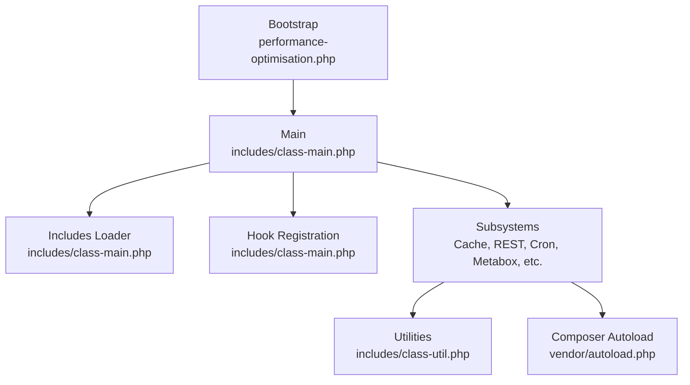
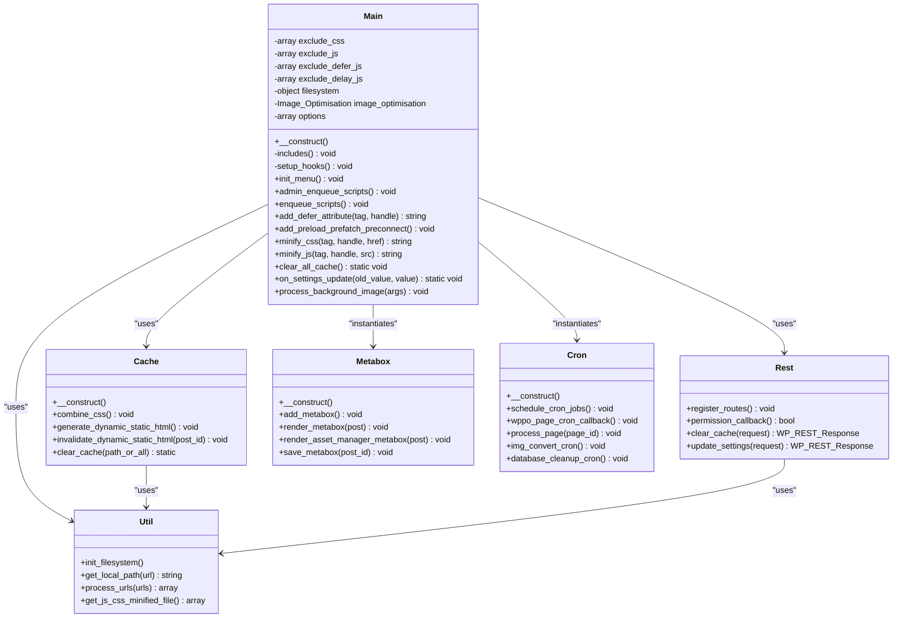
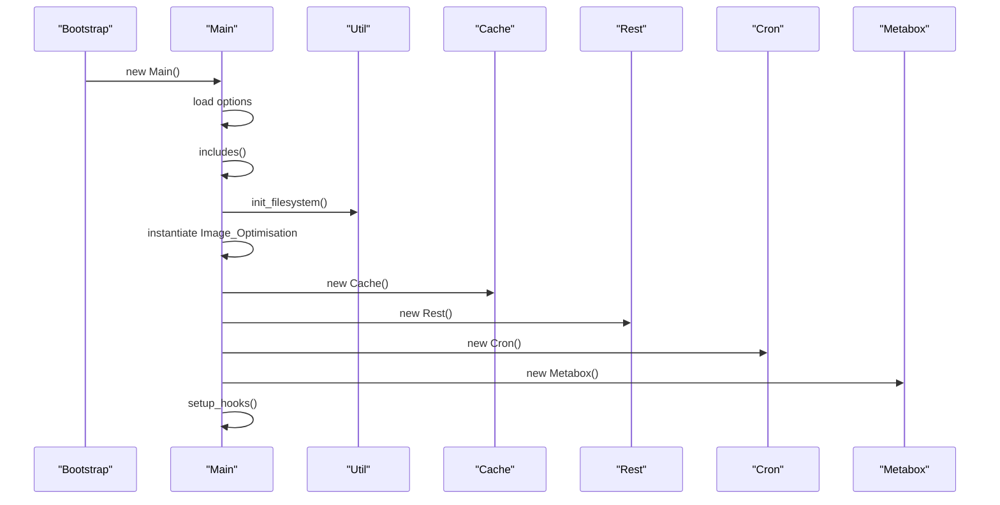
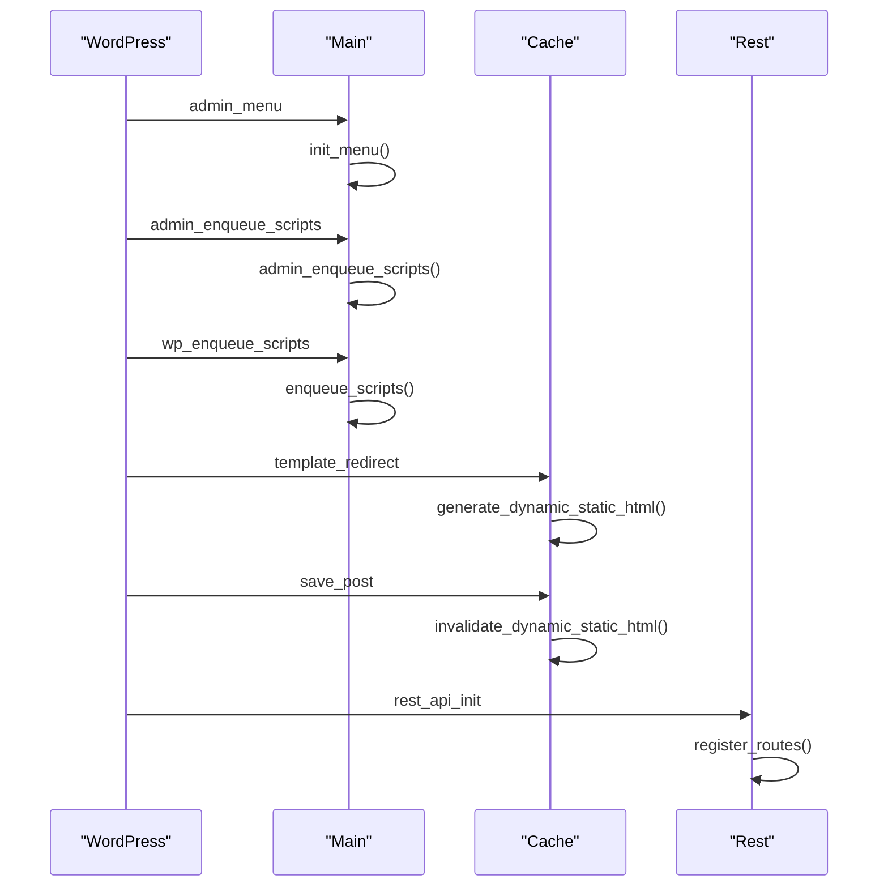
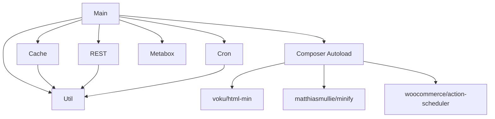

# Plugin Initialization

<cite>
**Referenced Files in This Document**
- [performance-optimisation.php](file://performance-optimisation.php)
- [class-main.php](file://includes/class-main.php)
- [class-util.php](file://includes/class-util.php)
- [class-cache.php](file://includes/class-cache.php)
- [class-rest.php](file://includes/class-rest.php)
- [class-metabox.php](file://includes/class-metabox.php)
- [class-cron.php](file://includes/class-cron.php)
- [class-activate.php](file://includes/class-activate.php)
- [class-deactivate.php](file://includes/class-deactivate.php)
- [composer.json](file://composer.json)
</cite>

## Table of Contents
1. [Introduction](#introduction)
2. [Project Structure](#project-structure)
3. [Core Components](#core-components)
4. [Architecture Overview](#architecture-overview)
5. [Detailed Component Analysis](#detailed-component-analysis)
6. [Dependency Analysis](#dependency-analysis)
7. [Performance Considerations](#performance-considerations)
8. [Troubleshooting Guide](#troubleshooting-guide)
9. [Conclusion](#conclusion)

## Introduction
This document explains the plugin initialization process and WordPress integration patterns, focusing on the Main class orchestration and how it coordinates all optimization subsystems. It covers constructor responsibilities, autoloading and includes, WordPress hook registration, singleton-like configuration management, and the modular architecture that enables clean separation of concerns.

## Project Structure
The plugin follows a layered structure with a central Main class coordinating subsystems:
- Bootstrap entry point initializes constants and loads the Main class
- Main class orchestrates includes, hook registration, and subsystem instantiation
- Subsystems encapsulate specific functionality (cache, REST, cron, metabox, etc.)
- Utilities provide shared helpers for filesystem and configuration

**Diagram sources**
- [performance-optimisation.php:40-44](file://performance-optimisation.php#L40-L44)
- [class-main.php:128-157](file://includes/class-main.php#L128-L157)
- [class-main.php:167-244](file://includes/class-main.php#L167-L244)

**Section sources**
- [performance-optimisation.php:27-44](file://performance-optimisation.php#L27-L44)
- [composer.json:16-20](file://composer.json#L16-L20)

## Core Components
- Bootstrap entry point defines plugin constants and instantiates the Main class
- Main class constructor initializes configuration, includes subsystems, sets up hooks, and prepares core dependencies
- Includes method performs selective autoloading and file organization
- Hook registration establishes admin menu, script enqueueing, and action/filter wiring
- Utilities centralize filesystem and configuration helpers used across subsystems

**Section sources**
- [performance-optimisation.php:27-44](file://performance-optimisation.php#L27-L44)
- [class-main.php:98-118](file://includes/class-main.php#L98-L118)
- [class-main.php:128-157](file://includes/class-main.php#L128-L157)
- [class-main.php:167-244](file://includes/class-main.php#L167-L244)
- [class-util.php:67-80](file://includes/class-util.php#L67-L80)

## Architecture Overview
The Main class acts as the central coordinator, delegating responsibilities to specialized subsystems while maintaining a unified configuration surface. It uses WordPress hooks to integrate with the admin interface and frontend rendering pipeline.

**Diagram sources**
- [class-main.php:29-118](file://includes/class-main.php#L29-L118)
- [class-cache.php:32-120](file://includes/class-cache.php#L32-L120)
- [class-rest.php:26-136](file://includes/class-rest.php#L26-L136)
- [class-metabox.php:30-42](file://includes/class-metabox.php#L30-L42)
- [class-cron.php:27-52](file://includes/class-cron.php#L27-L52)
- [class-util.php:29-80](file://includes/class-util.php#L29-L80)

## Detailed Component Analysis

### Main Class Orchestration
The Main class constructor initializes configuration from the plugin settings, loads subsystems, and wires WordPress hooks. It prepares the filesystem and image optimization instance, and conditionally instantiates core tweaks based on settings.

Key responsibilities:
- Load and merge default settings with stored options
- Include subsystem files selectively (admin vs. frontend)
- Register WordPress actions/filters for admin menu, script enqueueing, and performance optimizations
- Instantiate and wire subsystems (Cache, REST, Cron, Metabox, Asset Manager)
- Provide static methods for cache clearing and settings updates

**Diagram sources**
- [performance-optimisation.php:44](file://performance-optimisation.php#L44)
- [class-main.php:98-118](file://includes/class-main.php#L98-L118)
- [class-main.php:128-157](file://includes/class-main.php#L128-L157)
- [class-main.php:167-244](file://includes/class-main.php#L167-L244)

**Section sources**
- [class-main.php:98-118](file://includes/class-main.php#L98-L118)
- [class-main.php:128-157](file://includes/class-main.php#L128-L157)
- [class-main.php:167-244](file://includes/class-main.php#L167-L244)

### Includes Method and Autoloading
The includes method centralizes file loading and selective inclusion based on context:
- Always loads Composer autoload and core subsystems
- Loads diagnostics and system info in admin or AJAX contexts
- Loads admin notices only in admin context
- Instantiates admin notices and telemetry conditionally

This pattern ensures minimal overhead on frontend requests while preserving admin functionality.

**Section sources**
- [class-main.php:128-157](file://includes/class-main.php#L128-L157)

### WordPress Hook Registration
The setup_hooks method registers a comprehensive set of WordPress actions and filters:
- Admin menu and scripts for dashboard integration
- Frontend script enqueueing and admin bar integration
- Dynamic static HTML generation/invalidation
- Asset minification and deferral/delay logic
- REST API routes and AJAX handlers
- Background job scheduling and cache invalidation triggers

Hook registration demonstrates dependency injection by passing bound callbacks to subsystem instances, enabling loose coupling between Main and subsystems.

**Diagram sources**
- [class-main.php:167-244](file://includes/class-main.php#L167-L244)
- [class-cache.php:32-120](file://includes/class-cache.php#L32-L120)
- [class-rest.php:37-43](file://includes/class-rest.php#L37-L43)

**Section sources**
- [class-main.php:167-244](file://includes/class-main.php#L167-L244)

### Singleton Pattern and Global Configuration Management
While the Main class is instantiated once at bootstrap, it serves as a configuration hub that maintains global settings and provides static methods for cache management and settings updates. This pattern centralizes configuration access and ensures consistent behavior across subsystems.

Key aspects:
- Options loaded once and reused across methods
- Static methods for cache clearing and settings update handling
- Centralized exclusion lists for JS/CSS optimization
- Theme color extraction for frontend integration

**Section sources**
- [class-main.php:98-118](file://includes/class-main.php#L98-L118)
- [class-main.php:253-292](file://includes/class-main.php#L253-L292)
- [class-main.php:373-423](file://includes/class-main.php#L373-L423)

### Practical Examples

#### Hook Registration Patterns
- Admin menu creation: [init_menu:324-334](file://includes/class-main.php#L324-L334)
- Script enqueueing: [admin_enqueue_scripts:433-785](file://includes/class-main.php#L433-L785), [enqueue_scripts:792-814](file://includes/class-main.php#L792-L814)
- Action/filter setup: [setup_hooks:167-244](file://includes/class-main.php#L167-L244)

#### Dependency Injection Patterns
- Bound callbacks to subsystems: [setup_hooks:167-244](file://includes/class-main.php#L167-L244)
- Constructor-based instantiation: [Main::__construct:98-118](file://includes/class-main.php#L98-L118)
- Utility dependency: [Util::init_filesystem:67-80](file://includes/class-util.php#L67-L80)

#### Modular Architecture
- Subsystem isolation: [Cache:32-120](file://includes/class-cache.php#L32-L120), [Rest:26-136](file://includes/class-rest.php#L26-L136), [Cron:27-52](file://includes/class-cron.php#L27-L52), [Metabox:30-42](file://includes/class-metabox.php#L30-L42)
- Shared utilities: [Util:29-80](file://includes/class-util.php#L29-L80)

**Section sources**
- [class-main.php:167-244](file://includes/class-main.php#L167-L244)
- [class-main.php:324-334](file://includes/class-main.php#L324-L334)
- [class-main.php:433-785](file://includes/class-main.php#L433-L785)
- [class-main.php:792-814](file://includes/class-main.php#L792-L814)
- [class-cache.php:32-120](file://includes/class-cache.php#L32-L120)
- [class-rest.php:26-136](file://includes/class-rest.php#L26-L136)
- [class-cron.php:27-52](file://includes/class-cron.php#L27-L52)
- [class-metabox.php:30-42](file://includes/class-metabox.php#L30-L42)
- [class-util.php:29-80](file://includes/class-util.php#L29-L80)

## Dependency Analysis
The plugin relies on Composer-managed PHP libraries for minification and background job scheduling, while WordPress core provides the hook system and admin interface.

**Diagram sources**
- [composer.json:16-20](file://composer.json#L16-L20)
- [class-main.php:128-157](file://includes/class-main.php#L128-L157)

**Section sources**
- [composer.json:16-20](file://composer.json#L16-L20)
- [class-main.php:128-157](file://includes/class-main.php#L128-L157)

## Performance Considerations
- Selective includes: Admin-only diagnostics and notices minimize frontend overhead
- Conditional hook registration: Only enabled optimizations register their filters/actions
- Filesystem abstraction: Util::init_filesystem ensures reliable file operations across environments
- Static caching: Transients for cache size and JS/CSS counts reduce repeated computations
- Batch processing: Cron jobs process pages in batches to avoid memory exhaustion

## Troubleshooting Guide
Common initialization and integration issues:
- Activation/deactivation hooks: Verify [wppo_activate:52-57](file://performance-optimisation.php#L52-L57) and [wppo_deactivate:65-70](file://performance-optimisation.php#L65-L70) are registered
- Settings persistence: Check [on_settings_update:253-280](file://includes/class-main.php#L253-L280) rollback logic for .htaccess updates
- Filesystem permissions: Ensure [Util::init_filesystem:67-80](file://includes/class-util.php#L67-L80) succeeds for cache and asset operations
- Cron job scheduling: Validate [Cron::__construct:42-52](file://includes/class-cron.php#L42-L52) and [schedule_cron_jobs:79-91](file://includes/class-cron.php#L79-L91) behavior

**Section sources**
- [performance-optimisation.php:52-70](file://performance-optimisation.php#L52-L70)
- [class-main.php:253-280](file://includes/class-main.php#L253-L280)
- [class-util.php:67-80](file://includes/class-util.php#L67-L80)
- [class-cron.php:42-91](file://includes/class-cron.php#L42-L91)

## Conclusion
The Main class orchestrates a modular, WordPress-native architecture that balances performance with flexibility. Its constructor initializes configuration and subsystems, the includes method provides selective loading, and hook registration integrates seamlessly with WordPress hooks. The singleton-like configuration management and dependency injection patterns ensure clean separation of concerns while maintaining centralized control over optimization subsystems.