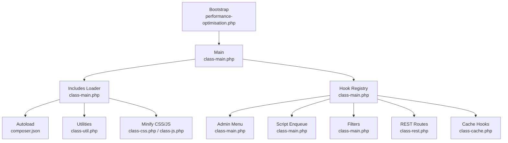
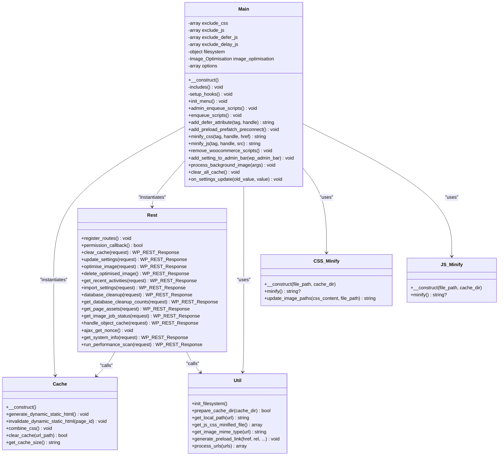
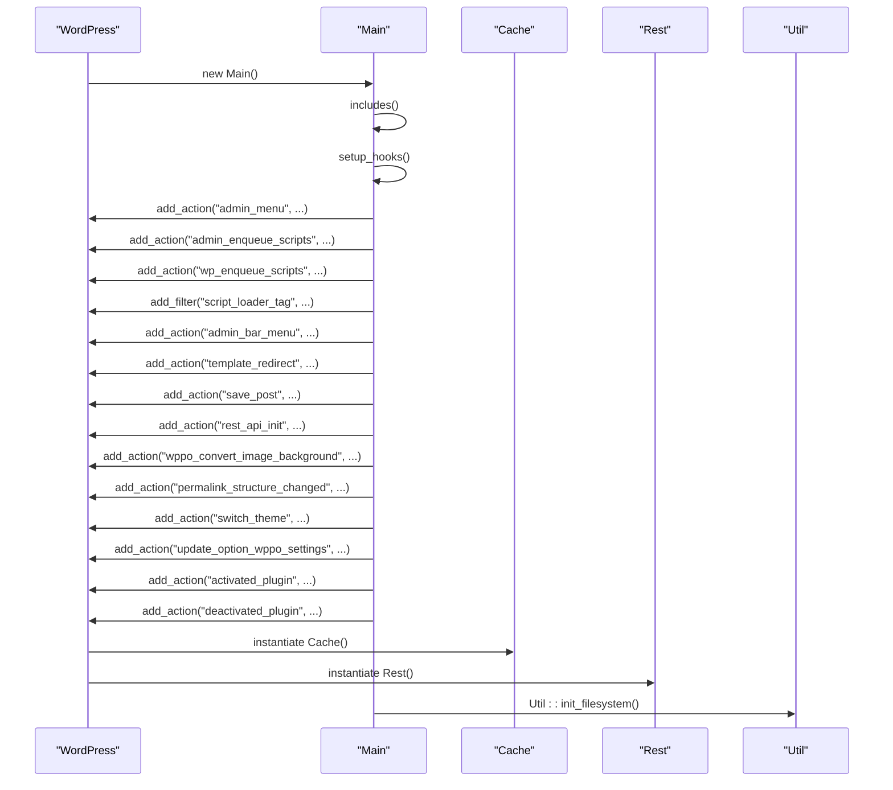
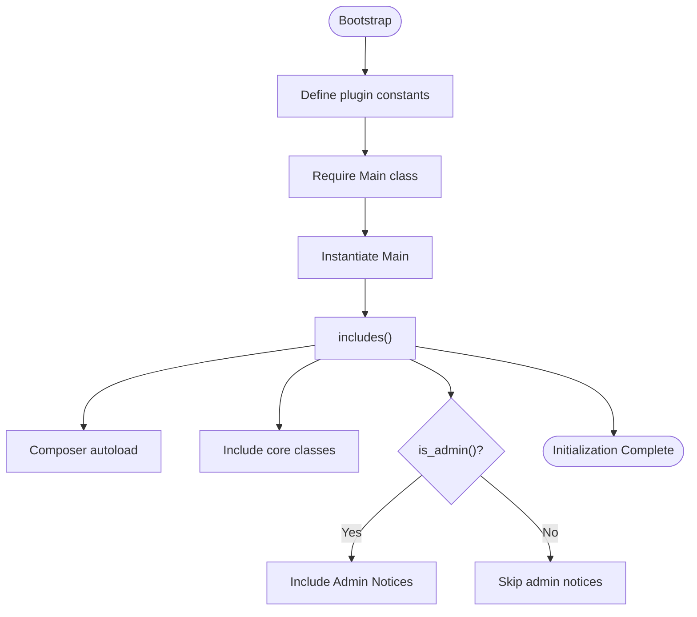
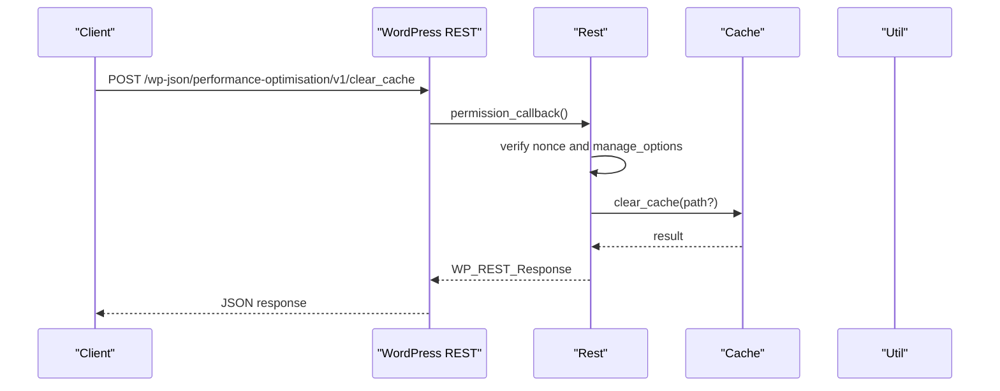
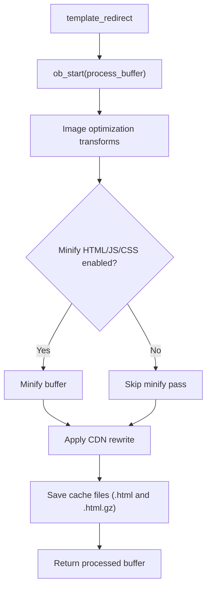
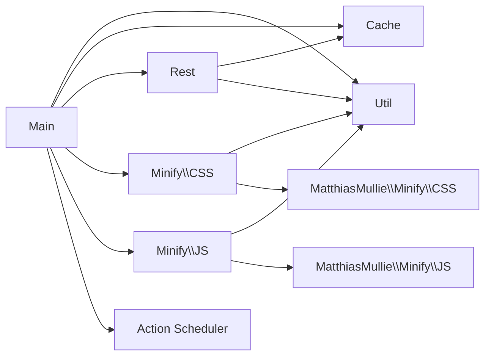

# Plugin Initialization

<cite>
**Referenced Files in This Document**
- [performance-optimisation.php](file://performance-optimisation.php)
- [class-main.php](file://includes/class-main.php)
- [class-util.php](file://includes/class-util.php)
- [class-cache.php](file://includes/class-cache.php)
- [class-rest.php](file://includes/class-rest.php)
- [class-activate.php](file://includes/class-activate.php)
- [class-deactivate.php](file://includes/class-deactivate.php)
- [class-css.php](file://includes/minify/class-css.php)
- [class-js.php](file://includes/minify/class-js.php)
- [composer.json](file://composer.json)
</cite>

## Table of Contents
1. [Introduction](#introduction)
2. [Project Structure](#project-structure)
3. [Core Components](#core-components)
4. [Architecture Overview](#architecture-overview)
5. [Detailed Component Analysis](#detailed-component-analysis)
6. [Dependency Analysis](#dependency-analysis)
7. [Performance Considerations](#performance-considerations)
8. [Troubleshooting Guide](#troubleshooting-guide)
9. [Conclusion](#conclusion)

## Introduction
This document explains the plugin initialization and orchestration model centered on the Main class. It covers how the Main class initializes core components, loads dependencies, sets up WordPress hooks, and coordinates optimization subsystems such as caching, minification, REST API, and background tasks. It also documents the autoloading strategy, WordPress integration patterns, and the global configuration management approach used by the plugin.

## Project Structure
The plugin follows a layered, feature-based organization:
- Bootstrap entry point initializes constants and loads the Main class.
- Main orchestrates includes, hook registration, and subsystem instantiation.
- Subsystems encapsulate responsibilities (caching, minification, REST, cron, admin UI).
- Composer-managed autoloading powers PSR-4 class discovery.

**Diagram sources**
- [performance-optimisation.php:17-44](file://performance-optimisation.php#L17-L44)
- [class-main.php:98-154](file://includes/class-main.php#L98-L154)
- [class-main.php:164-241](file://includes/class-main.php#L164-L241)
- [class-rest.php:37-43](file://includes/class-rest.php#L37-L43)
- [class-cache.php:24-120](file://includes/class-cache.php#L24-L120)
- [composer.json:1-40](file://composer.json#L1-L40)

**Section sources**
- [performance-optimisation.php:17-44](file://performance-optimisation.php#L17-L44)
- [composer.json:1-40](file://composer.json#L1-L40)

## Core Components
- Main: Central coordinator that constructs subsystems, loads includes, and registers WordPress hooks.
- Util: Shared utilities for filesystem, URL processing, preload link generation, and cache directory preparation.
- Cache: Dynamic static HTML caching, CSS combination, CDN rewrite, and cache management.
- REST: REST API route registration and handlers for settings, cache, image optimization, diagnostics, and object cache.
- Minify CSS/JS: On-demand minification with caching and gzip.
- Activate/Deactivate: Plugin lifecycle helpers for advanced cache drop-in, .htaccess rules, and cleanup.

Key initialization responsibilities:
- Constructor: Loads options, includes subsystems, sets up hooks, initializes filesystem and image optimization.
- includes: Autoloader and explicit includes for core classes; admin notices when applicable.
- setup_hooks: Registers admin menu, enqueue scripts/styles, filters for defer/delay, REST routes, cache hooks, and background actions.

**Section sources**
- [class-main.php:98-118](file://includes/class-main.php#L98-L118)
- [class-main.php:128-154](file://includes/class-main.php#L128-L154)
- [class-main.php:164-241](file://includes/class-main.php#L164-L241)

## Architecture Overview
The Main class acts as the application’s initializer and orchestrator. It:
- Bootstraps configuration from the wppo_settings option.
- Loads Composer autoloader and plugin classes.
- Registers WordPress actions/filters for admin UI, frontend performance, REST API, and background tasks.
- Instantiates subsystems (Cache, REST, Cron, Asset Manager, Metabox) to handle specialized responsibilities.

**Diagram sources**
- [class-main.php:29-1131](file://includes/class-main.php#L29-L1131)
- [class-cache.php:32-755](file://includes/class-cache.php#L32-L755)
- [class-rest.php:26-843](file://includes/class-rest.php#L26-L843)
- [class-util.php:29-251](file://includes/class-util.php#L29-L251)
- [class-css.php:23-192](file://includes/minify/class-css.php#L23-L192)
- [class-js.php:27-131](file://includes/minify/class-js.php#L27-L131)

## Detailed Component Analysis

### Main Class Orchestration
- Constructor responsibilities:
  - Loads wppo_settings into $options.
  - Calls includes() to bootstrap autoload and class files.
  - Calls setup_hooks() to register WordPress actions/filters.
  - Initializes filesystem via Util::init_filesystem().
  - Creates Image_Optimisation instance with options.
  - Instantiates Core_Tweaks with file optimization options.

- includes():
  - Loads Composer autoloader.
  - Includes logging, utilities, minifiers, cache, metabox, image optimization, cron, REST, database cleanup, asset manager, htaccess handler, core tweaks, object cache, telemetry, and system info.
  - Conditionally loads admin notices in admin context.

- setup_hooks():
  - Admin menu and admin_enqueue_scripts for dashboard.
  - Frontend enqueue and script_loader_tag filter for defer/delay.
  - Admin bar integration for quick cache actions.
  - Conditional removal of WooCommerce CSS/JS based on settings.
  - Cache hooks for dynamic static HTML generation/invalidation and CSS combination.
  - REST API registration via Rest::register_routes().
  - Minification filters for CSS/JS when enabled.
  - Preload/prefetch/preconnect insertion.
  - Background image processing via Action Scheduler callback.
  - Structural change hooks to clear cache and settings update handler to manage .htaccess rules.

- Singleton pattern note:
  - The Main class itself is instantiated once at plugin bootstrap and is not declared as a singleton. Global configuration is centralized via the wppo_settings option and passed to subsystems as needed. There is no internal static instance caching in Main.

- Practical examples:
  - Hook registration: admin_menu, admin_enqueue_scripts, wp_enqueue_scripts, script_loader_tag defer/delay, admin_bar_menu, rest_api_init, template_redirect, save_post, wppo_convert_image_background, permalink_structure_changed, switch_theme, update_option_wppo_settings, activated_plugin, deactivated_plugin.
  - Dependency injection: Main passes $options to Image_Optimisation and Core_Tweaks; Cache and REST are instantiated locally within setup_hooks() and later used statically for cache operations.

**Section sources**
- [class-main.php:98-118](file://includes/class-main.php#L98-L118)
- [class-main.php:128-154](file://includes/class-main.php#L128-L154)
- [class-main.php:164-241](file://includes/class-main.php#L164-L241)
- [performance-optimisation.php:42-43](file://performance-optimisation.php#L42-L43)

### WordPress Hook Registration Patterns
- Admin menu and dashboard:
  - init_menu registers the top-level Performance Optimisation menu.
  - admin_enqueue_scripts enqueues admin assets and localizes data for React UI.
  - admin_page includes the admin template.

- Frontend performance hooks:
  - enqueue_scripts conditionally enqueues lazy-load scripts for non-logged-in users when image optimization or delay JS is enabled.
  - add_defer_attribute injects defer or special attributes for delay JS based on exclusions.
  - add_preload_prefatch_preconnect generates preload/prefetch/preconnect tags from settings.

- REST API:
  - rest_api_init registers routes via Rest::register_routes().
  - Permission checks use wp_verify_nonce and manage_options capability.

- Caching:
  - template_redirect wraps output buffering to generate dynamic static HTML.
  - save_post invalidates cached pages for the edited post.
  - combine_css enqueues a combined CSS file when enabled.

- Background tasks:
  - wppo_convert_image_background triggers image conversion via Img_Converter.
  - Action Scheduler integration for async image processing.

**Diagram sources**
- [class-main.php:164-241](file://includes/class-main.php#L164-L241)
- [class-cache.php:94-120](file://includes/class-cache.php#L94-L120)
- [class-rest.php:37-43](file://includes/class-rest.php#L37-L43)
- [class-util.php:67-80](file://includes/class-util.php#L67-L80)

**Section sources**
- [class-main.php:321-343](file://includes/class-main.php#L321-L343)
- [class-main.php:430-745](file://includes/class-main.php#L430-L745)
- [class-main.php:752-774](file://includes/class-main.php#L752-L774)
- [class-main.php:894-917](file://includes/class-main.php#L894-L917)
- [class-main.php:924-994](file://includes/class-main.php#L924-L994)
- [class-main.php:1006-1055](file://includes/class-main.php#L1006-L1055)
- [class-main.php:1036-1055](file://includes/class-main.php#L1036-L1055)

### Includes and Autoloading Strategy
- Composer autoloader is included early to resolve plugin classes.
- Explicit includes load core classes grouped by feature (logging, utilities, minifiers, cache, REST, cron, etc.).
- Admin-only notices are conditionally included when in admin context.
- Utilities centralize filesystem initialization and URL/path processing.

**Diagram sources**
- [performance-optimisation.php:26-43](file://performance-optimisation.php#L26-L43)
- [class-main.php:128-154](file://includes/class-main.php#L128-L154)

**Section sources**
- [composer.json:11-15](file://composer.json#L11-L15)
- [class-main.php:128-154](file://includes/class-main.php#L128-L154)

### REST API Integration
- Routes are registered under the namespace and mapped to methods in the Rest class.
- Permission_callback verifies nonce and user capabilities.
- Handlers cover cache operations, settings updates, image optimization, database cleanup, page assets, object cache, system info, and performance scans.

**Diagram sources**
- [class-rest.php:37-43](file://includes/class-rest.php#L37-L43)
- [class-rest.php:131-136](file://includes/class-rest.php#L131-L136)
- [class-rest.php:145-175](file://includes/class-rest.php#L145-L175)

**Section sources**
- [class-rest.php:53-123](file://includes/class-rest.php#L53-L123)
- [class-rest.php:131-136](file://includes/class-rest.php#L131-L136)
- [class-rest.php:145-200](file://includes/class-rest.php#L145-L200)

### Caching and Minification Subsystems
- Cache:
  - Generates dynamic static HTML on template_redirect and invalidates on save_post.
  - Combines CSS and optionally minifies HTML/CSS/JS based on settings.
  - Applies CDN rewriting for wp-content/wp-includes assets.
  - Provides clear_cache, get_cache_size, and directory traversal-safe operations.

- Minify CSS/JS:
  - Uses MatthiasMullie libraries to minify and cache gzipped outputs.
  - CSS minifier updates image paths to next-gen formats and queues conversions.
  - JS minifier caches minified outputs similarly.

**Diagram sources**
- [class-cache.php:260-310](file://includes/class-cache.php#L260-L310)
- [class-cache.php:391-396](file://includes/class-cache.php#L391-L396)
- [class-cache.php:325-381](file://includes/class-cache.php#L325-L381)

**Section sources**
- [class-cache.php:260-310](file://includes/class-cache.php#L260-L310)
- [class-cache.php:325-381](file://includes/class-cache.php#L325-L381)
- [class-css.php:63-106](file://includes/minify/class-css.php#L63-L106)
- [class-js.php:74-99](file://includes/minify/class-js.php#L74-L99)

### Plugin Lifecycle Hooks
- Activation:
  - Creates advanced cache drop-in, ensures WP_CACHE constant, applies .htaccess rules if enabled, and sets up activity log table.
- Deactivation:
  - Unschedules cron events, removes advanced cache drop-in, removes WP_CACHE constant, and clears cache.

**Section sources**
- [class-activate.php:35-68](file://includes/class-activate.php#L35-L68)
- [class-deactivate.php:36-49](file://includes/class-deactivate.php#L36-L49)

## Dependency Analysis
- Internal dependencies:
  - Main depends on Util for filesystem and URL utilities.
  - Main instantiates Cache and Rest for runtime operations.
  - Minify CSS/JS depend on Util for filesystem and on MatthiasMullie libraries.
  - REST depends on Cache and Util for operations and sanitization.

- External dependencies:
  - Composer packages: voku/html-min, matthiasmullie/minify, woocommerce/action-scheduler.

**Diagram sources**
- [class-main.php:113-118](file://includes/class-main.php#L113-L118)
- [class-rest.php:37-43](file://includes/class-rest.php#L37-L43)
- [class-css.php:16-18](file://includes/minify/class-css.php#L16-L18)
- [class-js.php:15-16](file://includes/minify/class-js.php#L15-L16)
- [composer.json:11-15](file://composer.json#L11-L15)

**Section sources**
- [composer.json:11-15](file://composer.json#L11-L15)
- [class-main.php:113-118](file://includes/class-main.php#L113-L118)

## Performance Considerations
- Minification and caching:
  - Minify CSS/JS only when needed and skip logged-in users for performance.
  - Use Util::prepare_cache_dir to ensure cache directories exist before writing.
  - Compress cache outputs with gzip for reduced bandwidth.

- Hook placement:
  - Combine CSS runs late (PHP_INT_MAX) to capture all enqueued styles.
  - Defer/delay logic targets non-logged-in users to avoid impacting admin performance.

- Background processing:
  - Use Action Scheduler for image conversion to avoid blocking requests.
  - Batch database writes and avoid frequent update_option calls within loops.

- CDN rewriting:
  - Only rewrite assets under wp-content/wp-includes to minimize unnecessary processing.

[No sources needed since this section provides general guidance]

## Troubleshooting Guide
- .htaccess rule updates fail:
  - on_settings_update rolls back settings and displays an admin notice if update fails. Verify file permissions and backups.

- Cache not clearing:
  - clear_all_cache delegates to Cache::clear_cache; ensure filesystem is initialized and cache directories exist.

- REST endpoint unauthorized:
  - permission_callback requires valid nonce and manage_options capability. Use ajax_get_nonce to refresh nonce if needed.

- Activation/deactivation issues:
  - Activation ensures WP_CACHE constant presence and applies .htaccess rules if enabled.
  - Deactivation removes scheduled cron jobs, drop-in, and WP_CACHE constant, and clears cache.

**Section sources**
- [class-main.php:250-277](file://includes/class-main.php#L250-L277)
- [class-main.php:287-289](file://includes/class-main.php#L287-L289)
- [class-rest.php:131-136](file://includes/class-rest.php#L131-L136)
- [class-rest.php:771-781](file://includes/class-rest.php#L771-L781)
- [class-activate.php:76-126](file://includes/class-activate.php#L76-L126)
- [class-deactivate.php:92-124](file://includes/class-deactivate.php#L92-L124)

## Conclusion
The Main class orchestrates the plugin by initializing configuration, loading dependencies, and registering WordPress hooks that coordinate caching, minification, REST API, and background tasks. While not a singleton, it centralizes global configuration via the wppo_settings option and passes it to subsystems. The modular architecture enables clean separation of concerns, and the autoloading strategy ensures predictable class resolution. Proper hook placement, background processing, and filesystem initialization are key to reliable performance improvements.