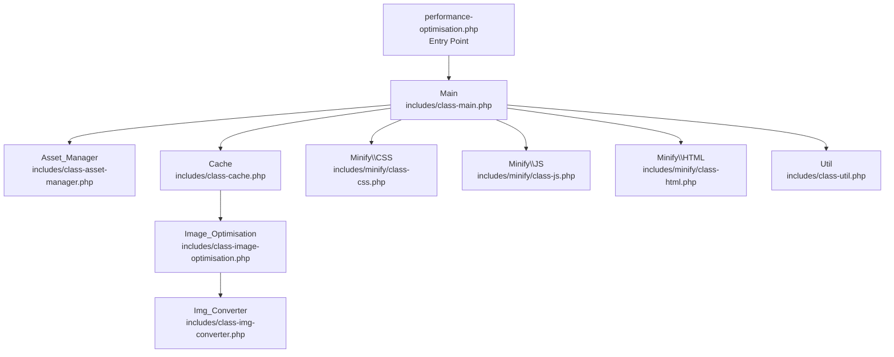
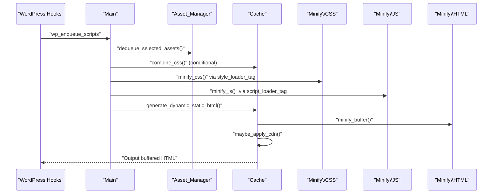
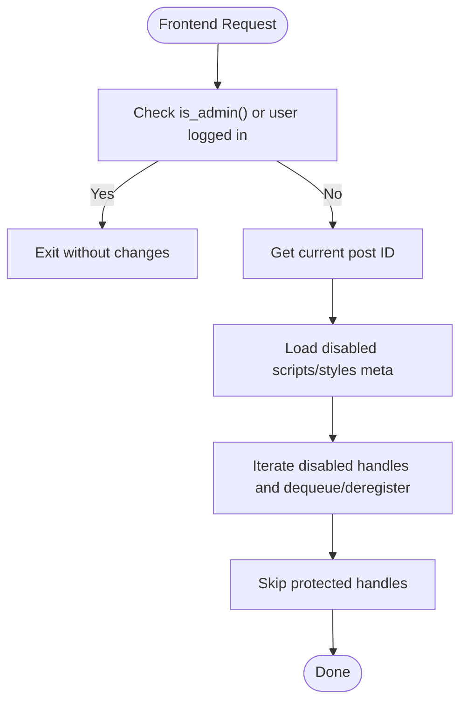
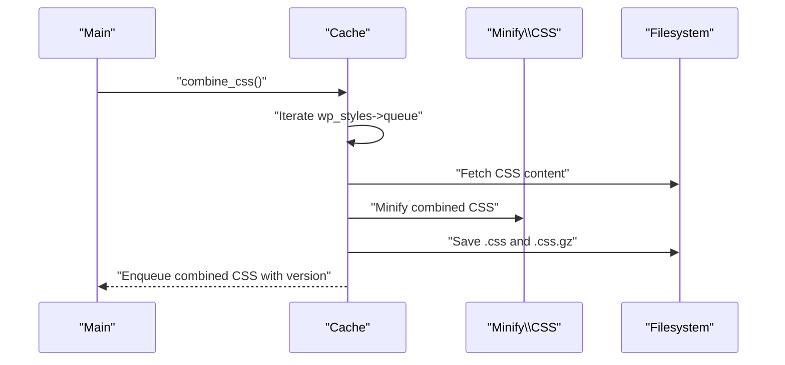
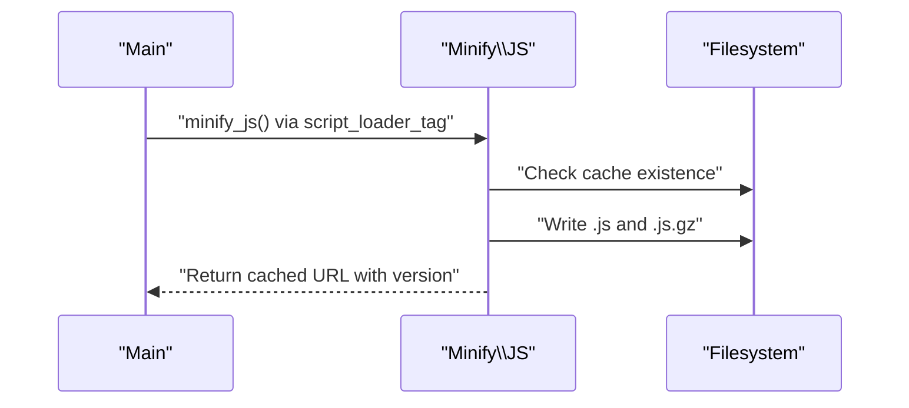
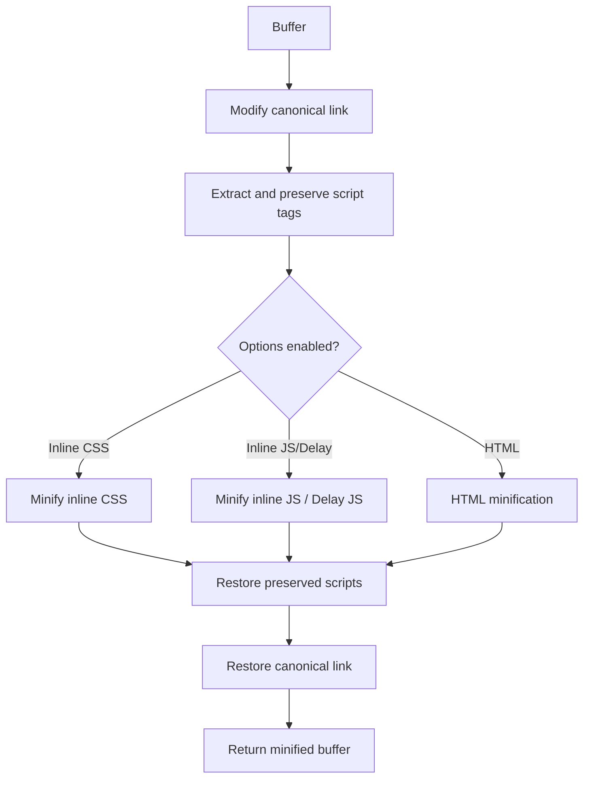
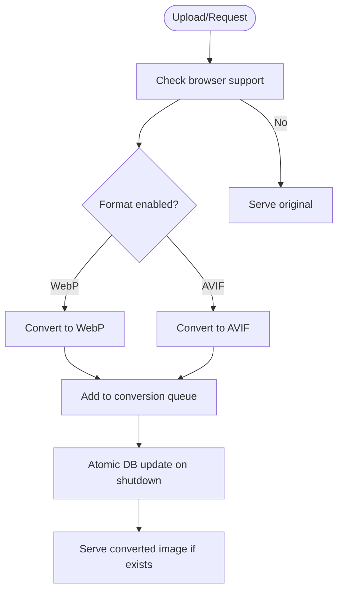
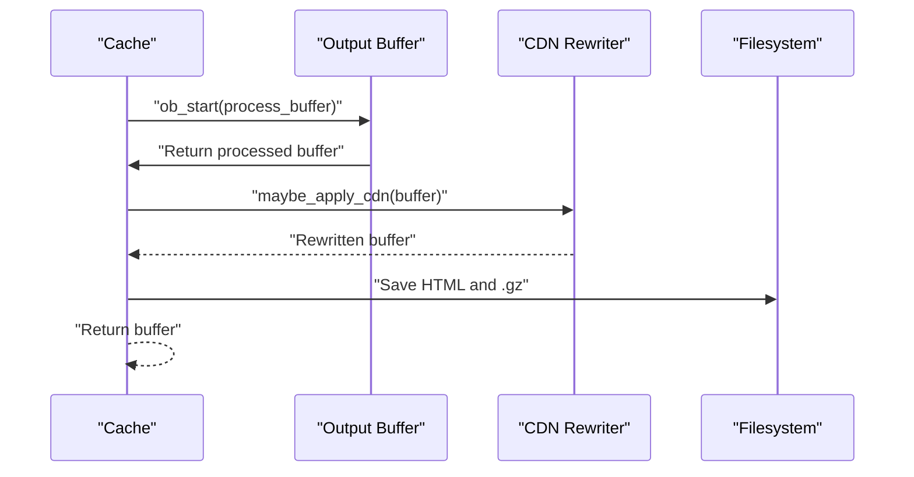
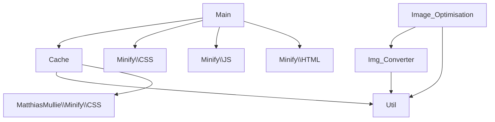

# Asset Management Service

<cite>
**Referenced Files in This Document**
- [performance-optimisation.php](file://performance-optimisation.php)
- [class-main.php](file://includes/class-main.php)
- [class-asset-manager.php](file://includes/class-asset-manager.php)
- [class-cache.php](file://includes/class-cache.php)
- [class-util.php](file://includes/class-util.php)
- [class-image-optimisation.php](file://includes/class-image-optimisation.php)
- [class-img-converter.php](file://includes/class-img-converter.php)
- [class-css.php](file://includes/minify/class-css.php)
- [class-js.php](file://includes/minify/class-js.php)
- [class-html.php](file://includes/minify/class-html.php)
- [composer.json](file://composer.json)
- [readme.txt](file://readme.txt)
</cite>

## Table of Contents
1. [Introduction](#introduction)
2. [Project Structure](#project-structure)
3. [Core Components](#core-components)
4. [Architecture Overview](#architecture-overview)
5. [Detailed Component Analysis](#detailed-component-analysis)
6. [Dependency Analysis](#dependency-analysis)
7. [Performance Considerations](#performance-considerations)
8. [Troubleshooting Guide](#troubleshooting-guide)
9. [Conclusion](#conclusion)

## Introduction
This document explains the Asset Management Service within the Performance Optimisation plugin. It covers the asset queuing system, minification pipeline, optimization strategies for CSS, JavaScript, and HTML, asset combination and dependency management, version handling, integration with WordPress enqueue system, efficient asset serving, caching strategies, browser compatibility, and troubleshooting guidance. The goal is to provide both technical depth and practical operational insights for developers and site administrators.

## Project Structure
The plugin follows a modular, namespace-based architecture with clear separation of concerns:
- Entry point initializes the main controller and registers activation/deactivation hooks.
- Main orchestrates hooks, settings, and integrates minification and caching.
- Asset Manager captures and controls per-page asset loading.
- Cache subsystem combines CSS, generates static HTML, and applies CDN rewriting.
- Minification classes handle CSS, JS, and HTML minification with gzip caching.
- Image optimization pipeline converts images to WebP/AVIF and serves them conditionally.
- Utilities provide filesystem operations, URL processing, preload generation, and statistics.

**Diagram sources**
- [performance-optimisation.php:40-43](file://performance-optimisation.php#L40-L43)
- [class-main.php:128-149](file://includes/class-main.php#L128-L149)
- [class-asset-manager.php:27](file://includes/class-asset-manager.php#L27)
- [class-cache.php:32](file://includes/class-cache.php#L32)
- [class-css.php:23](file://includes/minify/class-css.php#L23)
- [class-js.php:27](file://includes/minify/class-js.php#L27)
- [class-html.php:32](file://includes/minify/class-html.php#L32)
- [class-image-optimisation.php:27](file://includes/class-image-optimisation.php#L27)
- [class-img-converter.php:22](file://includes/class-img-converter.php#L22)
- [class-util.php:29](file://includes/class-util.php#L29)

**Section sources**
- [performance-optimisation.php:40-43](file://performance-optimisation.php#L40-L43)
- [class-main.php:128-149](file://includes/class-main.php#L128-L149)

## Core Components
- Asset Manager: Captures enqueued assets for admin UI and dequeues disabled assets on the frontend while protecting core handles.
- Minification Pipeline: Provides CSS, JS, and HTML minifiers backed by external libraries, with caching and gzip generation.
- Cache Engine: Combines CSS, generates static HTML, applies CDN rewriting, and manages cache lifecycle.
- Image Optimization: Converts images to WebP/AVIF, serves them conditionally, and supports lazy loading and preloading.
- Utilities: Filesystem preparation, URL normalization, preload link generation, and statistics.

Key responsibilities:
- Asset capture and protection of core WordPress handles.
- Conditional minification and versioning for CSS/JS.
- HTML minification pass with inline CSS/JS handling.
- CSS combination with font-display optimization.
- CDN URL rewriting for wp-content/wp-includes assets.
- Image conversion queue management and status tracking.

**Section sources**
- [class-asset-manager.php:27-224](file://includes/class-asset-manager.php#L27-L224)
- [class-css.php:23-192](file://includes/minify/class-css.php#L23-L192)
- [class-js.php:27-131](file://includes/minify/class-js.php#L27-L131)
- [class-html.php:32-372](file://includes/minify/class-html.php#L32-L372)
- [class-cache.php:32-755](file://includes/class-cache.php#L32-L755)
- [class-image-optimisation.php:27-1373](file://includes/class-image-optimisation.php#L27-L1373)
- [class-util.php:29-251](file://includes/class-util.php#L29-L251)

## Architecture Overview
The system integrates with WordPress hooks to intercept asset registration and output, applying transformations and caching strategies. The main controller wires settings, filters, and actions, while specialized classes handle minification, caching, and image optimization.

**Diagram sources**
- [class-main.php:164-241](file://includes/class-main.php#L164-L241)
- [class-main.php:178-181](file://includes/class-main.php#L178-L181)
- [class-main.php:1006-1055](file://includes/class-main.php#L1006-L1055)
- [class-cache.php:260-310](file://includes/class-cache.php#L260-L310)
- [class-cache.php:391-396](file://includes/class-cache.php#L391-L396)
- [class-cache.php:325-381](file://includes/class-cache.php#L325-L381)

## Detailed Component Analysis

### Asset Manager
- Purpose: Capture enqueued assets for admin UI and selectively dequeue/disregister assets on the frontend while protecting core handles.
- Protected handles: Scripts and styles considered essential for admin/editor and core functionality are never removed.
- Transient storage: Captured assets are stored per post with a 24-hour TTL for UI display.

**Diagram sources**
- [class-asset-manager.php:91-121](file://includes/class-asset-manager.php#L91-L121)
- [class-asset-manager.php:131-191](file://includes/class-asset-manager.php#L131-L191)

**Section sources**
- [class-asset-manager.php:27-224](file://includes/class-asset-manager.php#L27-L224)

### CSS Minification and Combination
- Minification: Uses MatthiasMullie Minify to minify CSS content, injects font-display: swap for @font-face, and caches both plain and gzipped files.
- Image path updates: Rewrites CSS url() paths to point to optimized images and queues WebP/AVIF conversions.
- Combination: Collects all enqueued CSS, fetches content, injects font-display: swap, minifies, saves combined file, enqueues it, and adds preload.

**Diagram sources**
- [class-cache.php:127-223](file://includes/class-cache.php#L127-L223)
- [class-cache.php:233-249](file://includes/class-cache.php#L233-L249)
- [class-css.php:63-106](file://includes/minify/class-css.php#L63-L106)

**Section sources**
- [class-css.php:23-192](file://includes/minify/class-css.php#L23-L192)
- [class-cache.php:127-223](file://includes/class-cache.php#L127-L223)

### JavaScript Minification
- Minification: Uses MatthiasMullie Minify to minify JS content and caches both plain and gzipped files.
- Version handling: Appends fileatime-based version to the cached URL to bust cache on change.

**Diagram sources**
- [class-main.php:1036-1055](file://includes/class-main.php#L1036-L1055)
- [class-js.php:74-99](file://includes/minify/class-js.php#L74-L99)

**Section sources**
- [class-js.php:27-131](file://includes/minify/class-js.php#L27-L131)
- [class-main.php:1036-1055](file://includes/class-main.php#L1036-L1055)

### HTML Minification and Inline Processing
- HTML minification: Uses voku/html-min with extensive cleanup options and relative URL normalization.
- Inline CSS/JS: Minifies inline styles and scripts, preserving JSON-LD and excluding specific types.
- Delayed JS: Rewrites script type and attributes to defer execution until user interaction, with exclusion lists.

**Diagram sources**
- [class-html.php:116-143](file://includes/minify/class-html.php#L116-L143)
- [class-html.php:239-255](file://includes/minify/class-html.php#L239-L255)
- [class-html.php:264-342](file://includes/minify/class-html.php#L264-L342)
- [class-html.php:152-162](file://includes/minify/class-html.php#L152-L162)
- [class-html.php:205-211](file://includes/minify/class-html.php#L205-L211)
- [class-html.php:220-230](file://includes/minify/class-html.php#L220-L230)

**Section sources**
- [class-html.php:32-372](file://includes/minify/class-html.php#L32-L372)

### Image Optimization Pipeline
- Conversion: Converts images to WebP/AVIF using GD Imagick, with safety checks for animated WebP and dimension limits.
- Queue management: Tracks pending/failed/completed conversions and flushes to DB atomically on shutdown.
- Serving: Detects browser support and serves converted images; falls back to originals when unsupported.
- Lazy loading and preloading: Rewrites img/srcset/iframe/video tags for lazy loading and generates preload links.

**Diagram sources**
- [class-img-converter.php:104-310](file://includes/class-img-converter.php#L104-L310)
- [class-img-converter.php:632-659](file://includes/class-img-converter.php#L632-L659)
- [class-img-converter.php:711-760](file://includes/class-img-converter.php#L711-L760)
- [class-image-optimisation.php:95-208](file://includes/class-image-optimisation.php#L95-L208)

**Section sources**
- [class-img-converter.php:22-762](file://includes/class-img-converter.php#L22-L762)
- [class-image-optimisation.php:27-1373](file://includes/class-image-optimisation.php#L27-L1373)

### CDN Rewriting and Static HTML Caching
- CDN rewriting: Scans HTML for wp-content/wp-includes assets and rewrites URLs to a configured CDN domain using WP_HTML_Tag_Processor when available.
- Dynamic static HTML: Buffers output, applies image optimizations, minification, and CDN rewriting, then saves HTML and gzipped variants.

**Diagram sources**
- [class-cache.php:260-310](file://includes/class-cache.php#L260-L310)
- [class-cache.php:325-381](file://includes/class-cache.php#L325-L381)

**Section sources**
- [class-cache.php:260-381](file://includes/class-cache.php#L260-L381)

## Dependency Analysis
External libraries:
- voku/html-min: HTML minification with DOM parser and attribute optimizations.
- matthiasmullie/minify: CSS/JS minification.
- woocommerce/action-scheduler: Background job scheduling for image conversion.

Internal dependencies:
- Main orchestrates hooks and delegates to Cache, Minify classes, and Utilities.
- Cache depends on Minify\CSS for combined CSS minification and Util for filesystem operations.
- Image_Optimisation depends on Img_Converter for conversions and Util for filesystem operations.

**Diagram sources**
- [composer.json:11-15](file://composer.json#L11-L15)
- [class-main.php:128-149](file://includes/class-main.php#L128-L149)
- [class-cache.php:18](file://includes/class-cache.php#L18)
- [class-image-optimisation.php:53-71](file://includes/class-image-optimisation.php#L53-L71)

**Section sources**
- [composer.json:11-15](file://composer.json#L11-L15)
- [class-main.php:128-149](file://includes/class-main.php#L128-L149)

## Performance Considerations
- Minification thresholds: CSS/JS is considered already minified if file is small or already min/bundle named, avoiding redundant processing.
- Gzip caching: Both plain and gzipped files are cached to reduce server CPU at runtime.
- CDN rewriting: Offloads static assets to CDN, reducing origin bandwidth and latency.
- Lazy loading: Reduces initial payload and improves perceived performance; excludes critical above-the-fold images.
- Atomic image queue updates: Batched DB writes minimize contention and improve throughput.
- Font-display optimization: Injects font-display: swap to prevent render-blocking text.

[No sources needed since this section provides general guidance]

## Troubleshooting Guide
Common issues and resolutions:
- Minification not applied:
  - Verify settings for minifyJS/minifyCSS/minifyHTML are enabled.
  - Check excluded handles/URLs in settings; ensure they are correctly formatted.
  - Confirm cache directories are writable and filesystem initialized.
- Assets still loading from original URLs:
  - Ensure combineCSS is enabled and Cache::combine_css runs on wp_enqueue_scripts.
  - Verify CDN URL is configured and WP_HTML_Tag_Processor is available for CDN rewriting.
- Image conversion failures:
  - Check browser support for WebP/AVIF; ensure required extensions are installed.
  - Review conversion queue status and logs for oversized or unsupported images.
  - Confirm upload directory paths are within wp-content/uploads and not subject to directory traversal.
- Defer/delay JS breaking functionality:
  - Add problematic scripts to exclusion lists in settings.
  - Test incrementally and validate with browser devtools.

**Section sources**
- [class-main.php:178-202](file://includes/class-main.php#L178-L202)
- [class-cache.php:325-381](file://includes/class-cache.php#L325-L381)
- [class-img-converter.php:104-310](file://includes/class-img-converter.php#L104-L310)
- [class-image-optimisation.php:1021-1064](file://includes/class-image-optimisation.php#L1021-L1064)

## Conclusion
The Asset Management Service provides a robust, modular system for minifying, combining, and serving assets efficiently. It integrates tightly with WordPress hooks, leverages proven third-party libraries, and includes safeguards for performance and compatibility. By understanding the minification pipeline, caching strategies, and integration points, administrators can optimize asset delivery while maintaining site stability and performance.