# Cache Service

<cite>
**Referenced Files in This Document**
- [performance-optimisation.php](file://performance-optimisation.php)
- [class-main.php](file://includes/class-main.php)
- [class-cache.php](file://includes/class-cache.php)
- [class-advanced-cache-handler.php](file://includes/class-advanced-cache-handler.php)
- [class-util.php](file://includes/class-util.php)
- [class-cron.php](file://includes/class-cron.php)
- [class-rest.php](file://includes/class-rest.php)
- [class-telemetry.php](file://includes/class-telemetry.php)
- [class-core-tweaks.php](file://includes/class-core-tweaks.php)
- [class-activate.php](file://includes/class-activate.php)
- [class-deactivate.php](file://includes/class-deactivate.php)
- [minify/class-html.php](file://includes/minify/class-html.php)
- [readme.txt](file://readme.txt)
</cite>

## Table of Contents
1. [Introduction](#introduction)
2. [Project Structure](#project-structure)
3. [Core Components](#core-components)
4. [Architecture Overview](#architecture-overview)
5. [Detailed Component Analysis](#detailed-component-analysis)
6. [Dependency Analysis](#dependency-analysis)
7. [Performance Considerations](#performance-considerations)
8. [Troubleshooting Guide](#troubleshooting-guide)
9. [Conclusion](#conclusion)
10. [Appendices](#appendices)

## Introduction
This document explains the Cache Service component of the Performance Optimisation plugin. It covers the dynamic static HTML caching system, including cache generation, storage, retrieval, and invalidation. It documents the cache directory structure, file naming conventions, and URL path mapping. It details cache invalidation strategies, including smart purging for archives, posts, and taxonomies. It explains integration with WordPress hooks and the output buffering system, and it covers cache storage options such as gzip compression, CDN integration, and performance monitoring. Finally, it provides examples of cache configuration, troubleshooting cache issues, and understanding cache performance metrics.

## Project Structure
The Cache Service spans several core files:
- Main entry initializes hooks and wires the Cache service into WordPress lifecycle.
- Cache class encapsulates generation, storage, retrieval, and invalidation.
- Advanced Cache Handler creates a drop-in to serve cached HTML directly from the server.
- Utilities provide filesystem operations and URL/path helpers.
- Cron and REST APIs support preloading and administrative cache operations.
- Telemetry and Core Tweaks provide complementary performance insights and server-side rules.

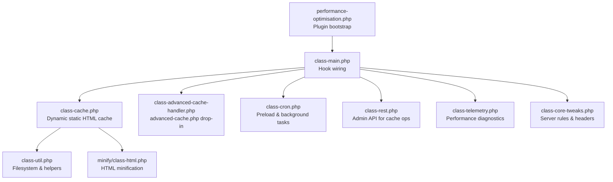

**Diagram sources**
- [performance-optimisation.php:40-43](file://performance-optimisation.php#L40-L43)
- [class-main.php:128-149](file://includes/class-main.php#L128-L149)
- [class-cache.php:32-120](file://includes/class-cache.php#L32-L120)
- [class-advanced-cache-handler.php:25-41](file://includes/class-advanced-cache-handler.php#L25-L41)
- [class-util.php:29-80](file://includes/class-util.php#L29-L80)
- [class-cron.php:42-52](file://includes/class-cron.php#L42-L52)
- [class-rest.php:37-43](file://includes/class-rest.php#L37-L43)
- [minify/class-html.php:32-68](file://includes/minify/class-html.php#L32-L68)
- [class-telemetry.php:423-453](file://includes/class-telemetry.php#L423-L453)
- [class-core-tweaks.php:128-193](file://includes/class-core-tweaks.php#L128-L193)

**Section sources**
- [performance-optimisation.php:40-43](file://performance-optimisation.php#L40-L43)
- [class-main.php:128-149](file://includes/class-main.php#L128-L149)

## Core Components
- Cache class: Generates and stores dynamic static HTML, prepares directories, saves files with gzip, applies CDN rewriting, and invalidates caches.
- Advanced Cache Handler: Creates an advanced-cache.php drop-in to serve cached HTML directly from the server.
- Main class: Wires hooks for cache generation and invalidation, and integrates with other subsystems.
- Utilities: Provides filesystem initialization, cache directory preparation, URL normalization, and JS/CSS counts.
- Cron: Schedules preloading of static pages and background tasks.
- REST: Exposes endpoints to clear cache, update settings, and manage background jobs.
- HTML Minifier: Applies HTML, inline CSS, and inline JS minification when enabled.
- Telemetry: Assesses compression and cache-control headers for performance diagnostics.
- Core Tweaks: Adds server rules for gzip and browser caching.

**Section sources**
- [class-cache.php:32-120](file://includes/class-cache.php#L32-L120)
- [class-advanced-cache-handler.php:25-41](file://includes/class-advanced-cache-handler.php#L25-L41)
- [class-main.php:164-241](file://includes/class-main.php#L164-L241)
- [class-util.php:38-149](file://includes/class-util.php#L38-L149)
- [class-cron.php:42-52](file://includes/class-cron.php#L42-L52)
- [class-rest.php:53-123](file://includes/class-rest.php#L53-L123)
- [minify/class-html.php:116-143](file://includes/minify/class-html.php#L116-L143)
- [class-telemetry.php:423-453](file://includes/class-telemetry.php#L423-L453)
- [class-core-tweaks.php:128-193](file://includes/class-core-tweaks.php#L128-L193)

## Architecture Overview
The Cache Service integrates with WordPress via hooks and output buffering. It generates static HTML during template_redirect, minifies and optionally rewrites assets to CDN, and persists both uncompressed and gzip-compressed files. A separate advanced-cache.php drop-in serves cached HTML directly from the server when possible, bypassing WordPress entirely.

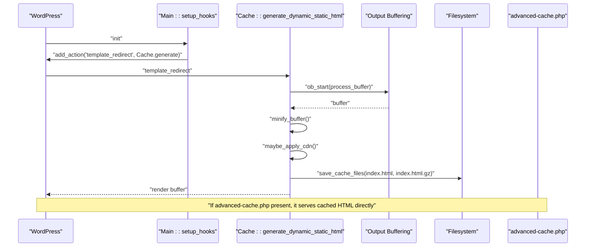

**Diagram sources**
- [class-main.php:175-177](file://includes/class-main.php#L175-L177)
- [class-cache.php:260-276](file://includes/class-cache.php#L260-L276)
- [class-cache.php:287-310](file://includes/class-cache.php#L287-L310)
- [class-cache.php:470-483](file://includes/class-cache.php#L470-L483)
- [class-advanced-cache-handler.php:104-191](file://includes/class-advanced-cache-handler.php#L104-L191)

## Detailed Component Analysis

### Dynamic Static HTML Generation and Storage
- Generation: During template_redirect, the Cache class starts output buffering and processes the buffer through minification and CDN rewriting before saving.
- Storage: Both uncompressed and gzip-compressed files are written. The gzip file is named with a .gz extension appended to the HTML path.
- Directory structure: Cache files are organized under wp-content/cache/wppo/{domain}/{path}/index.html and index.html.gz.
- URL mapping: The cache URL mirrors the request path; the domain segment isolates multi-site or multi-domain setups.

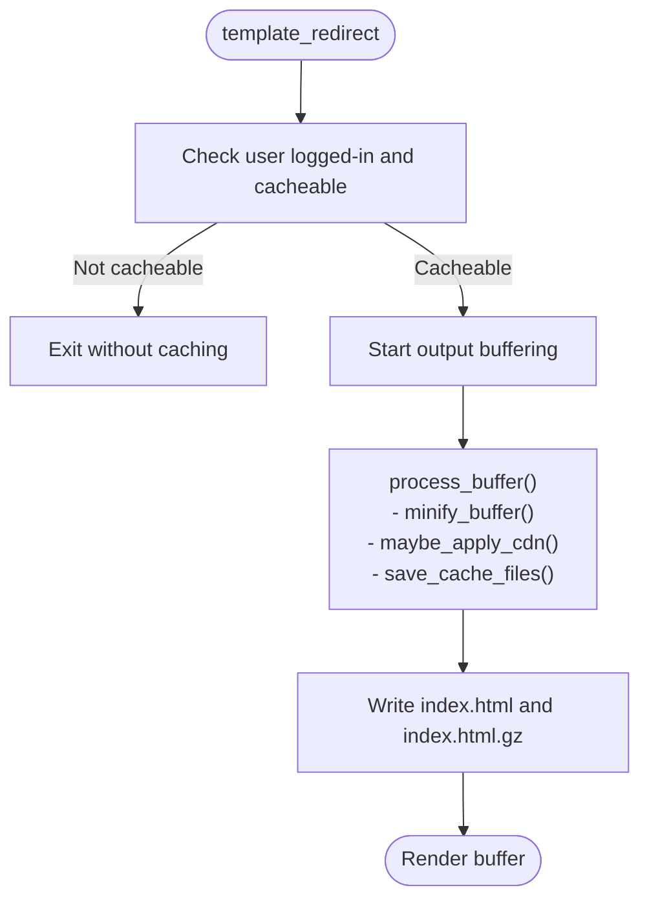

**Diagram sources**
- [class-cache.php:260-276](file://includes/class-cache.php#L260-L276)
- [class-cache.php:287-310](file://includes/class-cache.php#L287-L310)
- [class-cache.php:470-483](file://includes/class-cache.php#L470-L483)

**Section sources**
- [class-cache.php:260-310](file://includes/class-cache.php#L260-L310)
- [class-cache.php:433-447](file://includes/class-cache.php#L433-L447)

### Cache Directory Structure and Naming Conventions
- Root: wp-content/cache/wppo
- Domain isolation: {domain} subdirectory per site
- Path mapping: Request path segments become subdirectories; index.html is the filename
- Extensions: index.html and index.html.gz for gzip-compressed variants
- Example: A request to example.com/blog/post becomes wp-content/cache/wppo/example.com/blog/post/index.html and index.html.gz

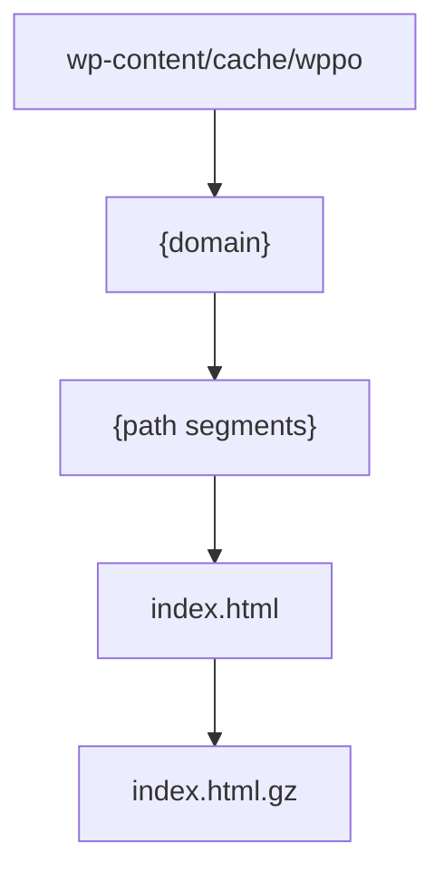

**Diagram sources**
- [class-cache.php:433-447](file://includes/class-cache.php#L433-L447)
- [class-cache.php:470-483](file://includes/class-cache.php#L470-L483)

**Section sources**
- [class-cache.php:433-447](file://includes/class-cache.php#L433-L447)
- [class-cache.php:470-483](file://includes/class-cache.php#L470-L483)

### Cache Invalidation Strategies
- On save_post: Invalidate the specific post’s HTML and CSS cache files, then purge the home page and blog archive.
- Extended smart purging: For the post’s post type, purge the post type archive; for public taxonomies, purge term archives for terms the post belongs to.
- Scheduled regeneration: A single event is scheduled with a random delay to regenerate the page asynchronously.

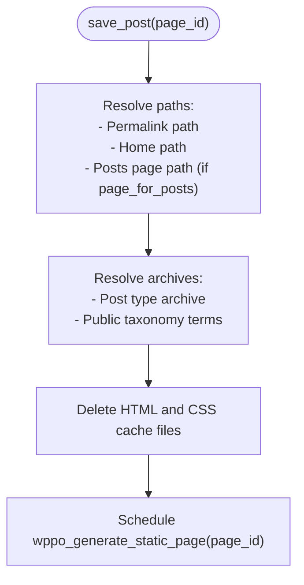

**Diagram sources**
- [class-cache.php:546-598](file://includes/class-cache.php#L546-L598)

**Section sources**
- [class-cache.php:546-598](file://includes/class-cache.php#L546-L598)

### Integration with WordPress Hooks and Output Buffering
- Hook wiring: Main registers template_redirect to trigger cache generation and save_post to trigger invalidation.
- Output buffering: Cache::generate_dynamic_static_html wraps the response in ob_start with a callback that processes and saves the buffer.
- Combine CSS: When enabled, CSS is combined, minified, and enqueued with a preload hint.

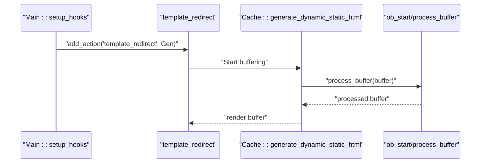

**Diagram sources**
- [class-main.php:175-177](file://includes/class-main.php#L175-L177)
- [class-cache.php:260-276](file://includes/class-cache.php#L260-L276)
- [class-cache.php:287-310](file://includes/class-cache.php#L287-L310)

**Section sources**
- [class-main.php:175-177](file://includes/class-main.php#L175-L177)
- [class-cache.php:260-310](file://includes/class-cache.php#L260-L310)

### CDN Integration and Asset Rewriting
- Rewriting logic: When a CDN URL is configured, the Cache class scans HTML tags (img, script, link, source, video) and rewrites attributes that match the site URL and contain wp-content or wp-includes.
- Attributes handled: src, href, data-src, srcset, data-srcset.
- WP_HTML_Tag_Processor: Used to safely parse and rewrite HTML when available.

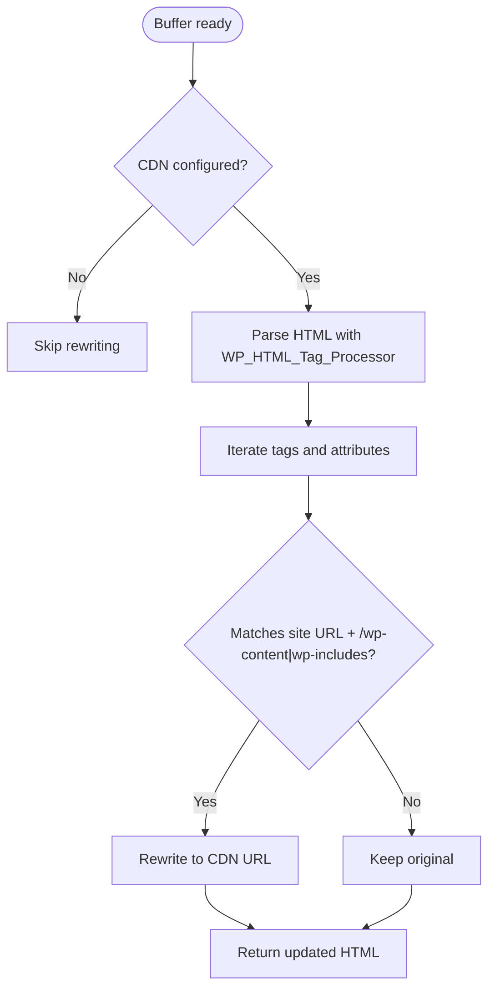

**Diagram sources**
- [class-cache.php:325-381](file://includes/class-cache.php#L325-L381)

**Section sources**
- [class-cache.php:325-381](file://includes/class-cache.php#L325-L381)

### Gzip Compression and Serving
- Storage: Both uncompressed and gzip-compressed files are written during cache generation.
- Serving: The advanced-cache.php drop-in checks for .gz files and serves them with appropriate headers (Last-Modified, ETag, Content-Encoding: gzip) and 304 Not Modified handling when matched.

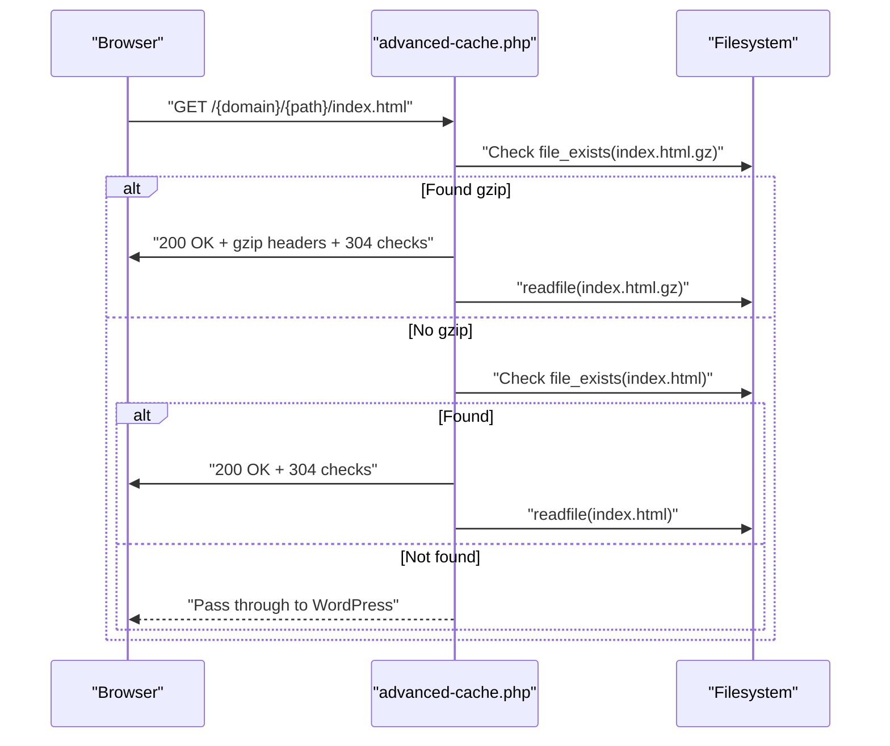

**Diagram sources**
- [class-advanced-cache-handler.php:150-187](file://includes/class-advanced-cache-handler.php#L150-L187)

**Section sources**
- [class-cache.php:470-483](file://includes/class-cache.php#L470-L483)
- [class-advanced-cache-handler.php:150-187](file://includes/class-advanced-cache-handler.php#L150-L187)

### Cache Preloading and Background Tasks
- Preload settings: Users can enable preloading and exclude specific URLs. Cron schedules batches of pages to be loaded and cached.
- Batch processing: Pages are processed in chunks to avoid memory issues, with randomized delays and follow-up batches.
- REST endpoints: Provide programmatic control for cache operations and background job status.

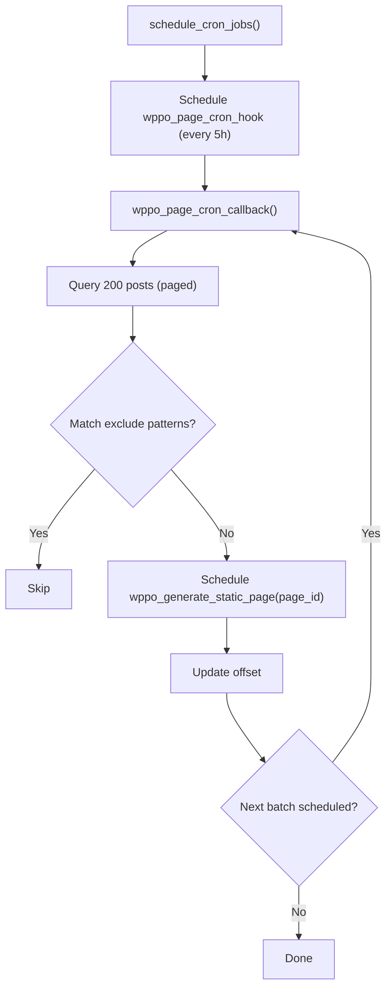

**Diagram sources**
- [class-cron.php:79-184](file://includes/class-cron.php#L79-L184)

**Section sources**
- [class-cron.php:79-184](file://includes/class-cron.php#L79-L184)
- [class-rest.php:55-123](file://includes/class-rest.php#L55-L123)

### Cache Size and Performance Monitoring
- Cache size: A static method computes total cache size recursively and formats it for display.
- Transients: Main caches cache size and JS/CSS counts to avoid repeated filesystem scans.
- Telemetry: Checks compression and cache-control headers to assess server-side performance.

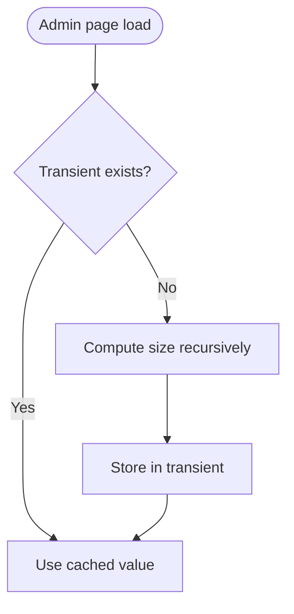

**Diagram sources**
- [class-cache.php:711-726](file://includes/class-cache.php#L711-L726)
- [class-main.php:463-473](file://includes/class-main.php#L463-L473)
- [class-telemetry.php:423-453](file://includes/class-telemetry.php#L423-L453)

**Section sources**
- [class-cache.php:711-726](file://includes/class-cache.php#L711-L726)
- [class-main.php:463-473](file://includes/class-main.php#L463-L473)
- [class-telemetry.php:423-453](file://includes/class-telemetry.php#L423-L453)

## Dependency Analysis
- Main depends on Cache, Cron, REST, and other subsystems to wire hooks and expose admin functionality.
- Cache depends on Util for filesystem operations and on HTML minifier for content processing.
- Advanced Cache Handler depends on filesystem and writes a drop-in file.
- Telemetry and Core Tweaks complement cache performance by checking headers and adding server rules.

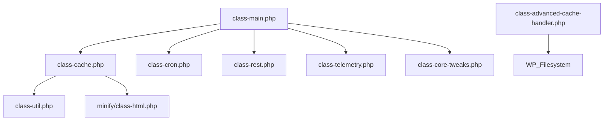

**Diagram sources**
- [class-main.php:128-149](file://includes/class-main.php#L128-L149)
- [class-cache.php:32-120](file://includes/class-cache.php#L32-L120)
- [class-advanced-cache-handler.php:104-191](file://includes/class-advanced-cache-handler.php#L104-L191)
- [class-telemetry.php:423-453](file://includes/class-telemetry.php#L423-L453)
- [class-core-tweaks.php:128-193](file://includes/class-core-tweaks.php#L128-L193)

**Section sources**
- [class-main.php:128-149](file://includes/class-main.php#L128-L149)
- [class-cache.php:32-120](file://includes/class-cache.php#L32-L120)

## Performance Considerations
- Minification: HTML, inline CSS, and inline JS can be minified when enabled, reducing payload sizes.
- CDN rewriting: Offloads static assets to a CDN domain for faster delivery.
- Gzip compression: Both uncompressed and gzip-compressed cache files are stored to leverage client-side compression.
- Preloading: Cron-based preloading warms cache for key pages to improve first-load performance.
- Server rules: Core Tweaks can add gzip and cache-control headers via .htaccess for broader performance benefits.

[No sources needed since this section provides general guidance]

## Troubleshooting Guide
- Cache not generated:
  - Verify template_redirect hook is active and not blocked by user login or 404 conditions.
  - Ensure filesystem is initialized and writable.
  - Check that query strings are not excluded by configuration.
- Cache not served:
  - Confirm advanced-cache.php drop-in exists and is owned by this plugin.
  - Verify gzip files exist and are readable.
  - Check for directory traversal prevention in path construction.
- Invalidation not working:
  - Ensure save_post hook triggers invalidation and that scheduled regeneration is queued.
  - Verify exclude patterns do not unintentionally block URLs.
- Performance metrics:
  - Use telemetry to check compression and cache-control headers.
  - Review cache size and JS/CSS counts via admin page.

**Section sources**
- [class-cache.php:260-310](file://includes/class-cache.php#L260-L310)
- [class-cache.php:470-483](file://includes/class-cache.php#L470-L483)
- [class-advanced-cache-handler.php:104-191](file://includes/class-advanced-cache-handler.php#L104-L191)
- [class-cache.php:546-598](file://includes/class-cache.php#L546-L598)
- [class-telemetry.php:423-453](file://includes/class-telemetry.php#L423-L453)

## Conclusion
The Cache Service provides a robust dynamic static HTML caching system integrated with WordPress hooks and output buffering. It supports gzip compression, CDN rewriting, smart purging, and preloading. The advanced-cache.php drop-in enables direct server-side serving of cached content. Administrators can monitor cache size and performance via built-in telemetry and REST endpoints.

[No sources needed since this section summarizes without analyzing specific files]

## Appendices

### Cache Configuration Examples
- Enable preloading cache and exclude specific URLs:
  - Use the Preload Settings tab to toggle enablePreloadCache and enter exclude patterns.
- Configure CDN URL:
  - Set cdnURL in file_optimisation settings to rewrite asset URLs to your CDN domain.
- Minification options:
  - Toggle minifyHTML, minifyInlineCSS, minifyInlineJS, and delayJS as needed.

**Section sources**
- [class-main.php:164-241](file://includes/class-main.php#L164-L241)
- [class-cache.php:325-381](file://includes/class-cache.php#L325-L381)
- [minify/class-html.php:116-143](file://includes/minify/class-html.php#L116-L143)

### Understanding Cache Performance Metrics
- Cache size: Computed recursively and cached via transients for efficiency.
- JS/CSS counts: Derived from the minify cache directory to reflect optimization progress.
- Compression and cache-control: Checked via telemetry to confirm server-side performance enhancements.

**Section sources**
- [class-cache.php:711-726](file://includes/class-cache.php#L711-L726)
- [class-main.php:463-473](file://includes/class-main.php#L463-L473)
- [class-telemetry.php:423-453](file://includes/class-telemetry.php#L423-L453)