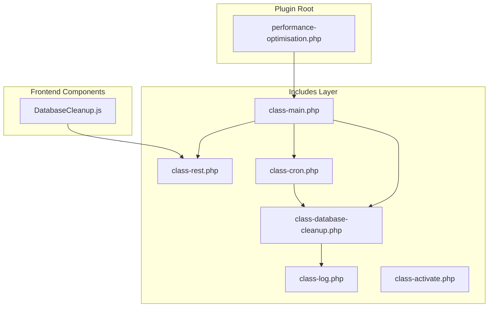
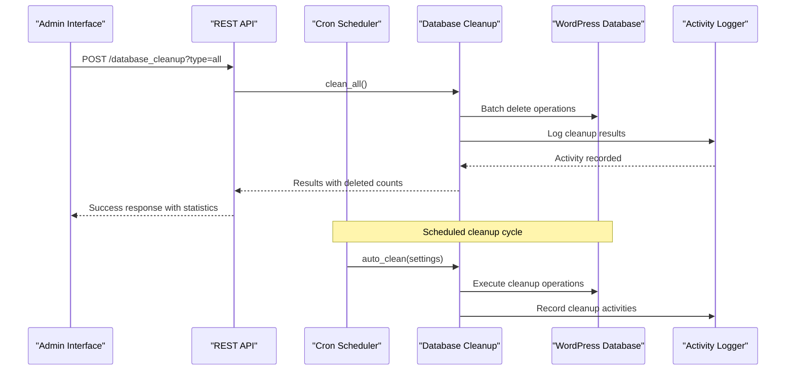
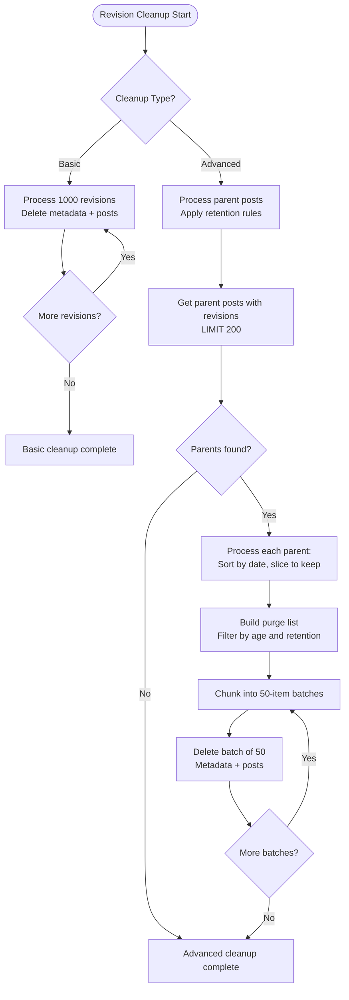
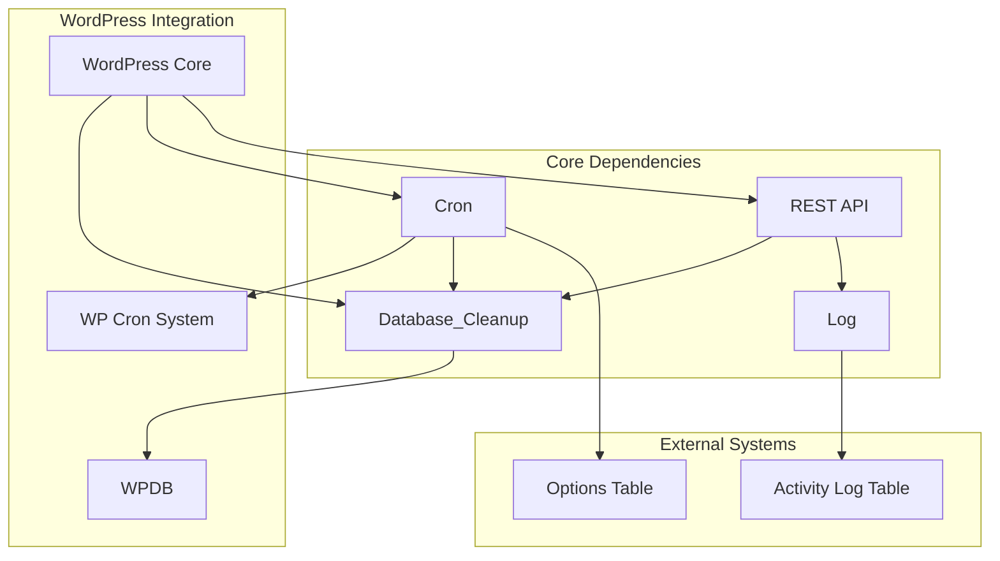

# Database Cleanup Service

<cite>
**Referenced Files in This Document**
- [class-database-cleanup.php](file://includes/class-database-cleanup.php)
- [class-cron.php](file://includes/class-cron.php)
- [DatabaseCleanup.js](file://src/components/DatabaseCleanup.js)
- [class-rest.php](file://includes/class-rest.php)
- [class-main.php](file://includes/class-main.php)
- [class-log.php](file://includes/class-log.php)
- [class-activate.php](file://includes/class-activate.php)
- [performance-optimisation.php](file://performance-optimisation.php)
</cite>

## Table of Contents
1. [Introduction](#introduction)
2. [Project Structure](#project-structure)
3. [Core Components](#core-components)
4. [Architecture Overview](#architecture-overview)
5. [Detailed Component Analysis](#detailed-component-analysis)
6. [Dependency Analysis](#dependency-analysis)
7. [Performance Considerations](#performance-considerations)
8. [Troubleshooting Guide](#troubleshooting-guide)
9. [Conclusion](#conclusion)

## Introduction
The Database Cleanup Service is a comprehensive WordPress plugin component designed to optimize database performance by removing unnecessary data and streamlining WordPress core bloat. This service provides automated cleanup processes for post revisions, auto-drafts, trashed content, spam comments, expired transients, and orphaned metadata, along with sophisticated revision management and transient optimization capabilities.

The service integrates seamlessly with WordPress's native cron system and offers both manual and automated cleanup options, providing administrators with flexible control over database maintenance while minimizing performance impact through intelligent batching and optimization strategies.

## Project Structure
The Database Cleanup Service is organized within the Performance Optimisation plugin's modular architecture, following WordPress coding standards and namespace conventions.



**Diagram sources**
- [performance-optimisation.php:1-68](file://performance-optimisation.php#L1-L68)
- [class-main.php:128-154](file://includes/class-main.php#L128-L154)

**Section sources**
- [performance-optimisation.php:1-68](file://performance-optimisation.php#L1-L68)
- [class-main.php:128-154](file://includes/class-main.php#L128-L154)

## Core Components

### Database Cleanup Engine
The central processing engine responsible for executing cleanup operations across all supported data categories. The engine employs sophisticated batching mechanisms to handle large datasets efficiently while maintaining system stability.

Key cleanup categories include:
- **Post Revisions**: Advanced revision management with configurable retention policies
- **Auto Drafts**: Temporary post drafts that accumulate over time
- **Trashed Content**: Posts and comments moved to trash but still consuming space
- **Spam Content**: Comment spam that accumulates in the database
- **Expired Transients**: Temporary cached data that has exceeded its expiration time
- **Orphaned Metadata**: Post meta entries with no associated parent posts

### Automated Cleanup Scheduler
A robust cron-based system that coordinates cleanup operations according to administrator-defined schedules. The scheduler supports daily, weekly, and monthly cleanup cycles with intelligent timing controls to minimize performance impact.

### REST API Interface
A comprehensive REST API layer that exposes cleanup functionality to both the WordPress admin interface and external integrations. The API provides granular control over cleanup operations with proper authentication and authorization.

### Frontend Management Interface
A React-based administrative interface that provides intuitive controls for configuring cleanup schedules, monitoring database health, and executing cleanup operations manually.

**Section sources**
- [class-database-cleanup.php:30-652](file://includes/class-database-cleanup.php#L30-L652)
- [class-cron.php:27-397](file://includes/class-cron.php#L27-L397)
- [class-rest.php:53-123](file://includes/class-rest.php#L53-L123)

## Architecture Overview



**Diagram sources**
- [class-rest.php:451-539](file://includes/class-rest.php#L451-L539)
- [class-cron.php:369-395](file://includes/class-cron.php#L369-L395)
- [class-database-cleanup.php:529-586](file://includes/class-database-cleanup.php#L529-L586)

The architecture follows a layered approach with clear separation of concerns:
- **Presentation Layer**: React-based admin interface for user interaction
- **API Layer**: REST endpoints for programmatic access
- **Business Logic Layer**: Core cleanup algorithms and scheduling
- **Data Access Layer**: Direct database operations with safety measures
- **Logging Layer**: Comprehensive activity tracking and audit trails

## Detailed Component Analysis

### Database Cleanup Engine

#### Revision Management System
The revision management system provides two distinct approaches to handle WordPress post revisions:

**Basic Revision Cleanup**
- Removes all post revisions in 1000-item batches
- Processes both revision posts and associated metadata
- Maintains referential integrity by deleting metadata before posts

**Advanced Revision Management**
- Implements configurable retention policies based on age and quantity
- Retains configurable number of latest revisions per post parent
- Applies sophisticated date-based filtering for optimal cleanup efficiency



**Diagram sources**
- [class-database-cleanup.php:94-186](file://includes/class-database-cleanup.php#L94-L186)
- [class-database-cleanup.php:38-82](file://includes/class-database-cleanup.php#L38-L82)

#### Transient Optimization
The transient optimization system addresses WordPress's built-in caching mechanism inefficiencies by identifying and removing expired transient data that accumulates over time.

**Transient Cleanup Process**
- Identifies expired transients by comparing timeout values against current time
- Removes both data and timeout entries in coordinated operations
- Processes transients in 1000-item batches to prevent memory issues
- Maintains referential integrity by cleaning related timeout entries

#### Orphaned Data Detection
The orphaned data detection system identifies metadata entries that lack corresponding parent posts, preventing database bloat from accumulating over time.

**Orphan Detection Algorithm**
- Performs LEFT JOIN operations between postmeta and posts tables
- Identifies records where parent post ID is NULL
- Processes orphans in 5000-item batches for optimal performance
- Maintains referential integrity while cleaning orphaned entries

**Section sources**
- [class-database-cleanup.php:38-186](file://includes/class-database-cleanup.php#L38-L186)
- [class-database-cleanup.php:408-521](file://includes/class-database-cleanup.php#L408-L521)

### Automated Cleanup Scheduler

#### Cron Integration
The cleanup scheduler integrates with WordPress's native cron system to provide reliable, automated cleanup operations without manual intervention.

**Scheduler Configuration**
- Custom "every_5_hours" interval for page generation tasks
- Daily cleanup scheduling for database optimization
- Weekly and monthly cleanup options with intelligent timing
- Last-run timestamp tracking to prevent excessive cleanup frequency

```mermaid
stateDiagram-v2
[*] --> Idle
Idle --> CheckingSchedule : "Cron Event Triggered"
CheckingSchedule --> ShouldRun{"Should Run Cleanup?"}
ShouldRun --> |Yes| ExecuteCleanup : "Execute Auto Cleanup"
ShouldRun --> |No| Idle : "Skip Cleanup"
ExecuteCleanup --> UpdateTimestamp : "Update Last Run"
UpdateTimestamp --> Idle : "Cleanup Complete"
note right of ExecuteCleanup
Executes cleanup methods :
- Advanced revisions
- Auto drafts
- Trashed posts
- Spam comments
- Trashed comments
- Expired transients
- Orphaned postmeta
end note
```

**Diagram sources**
- [class-cron.php:369-395](file://includes/class-cron.php#L369-L395)

#### Cleanup Timing Controls
The scheduler implements intelligent timing controls to prevent cleanup operations during peak traffic periods:

**Timing Strategy**
- Daily cleanup runs at configurable intervals
- Weekly cleanup requires 6-day buffer from last run
- Monthly cleanup requires 30-day buffer from last run
- Last-run timestamp stored in WordPress options table
- Graceful handling of cleanup failures with error logging

**Section sources**
- [class-cron.php:369-395](file://includes/class-cron.php#L369-L395)

### REST API Implementation

#### Endpoint Definitions
The REST API provides comprehensive access to cleanup functionality with proper authentication and authorization:

**Available Endpoints**
- `POST /performance-optimisation/v1/database_cleanup`: Execute cleanup operations
- `GET /performance-optimisation/v1/database_cleanup_counts`: Retrieve cleanup statistics
- `POST /performance-optimisation/v1/update_settings`: Update cleanup configuration

#### Authentication and Authorization
The API implements WordPress-native security measures:

**Security Features**
- Nonce-based authentication using `X-WP-Nonce` header
- Administrator capability checks (`manage_options`)
- Request parameter sanitization and validation
- Proper error handling with appropriate HTTP status codes

**Section sources**
- [class-rest.php:53-123](file://includes/class-rest.php#L53-L123)
- [class-rest.php:451-539](file://includes/class-rest.php#L451-L539)

### Frontend Management Interface

#### React Component Architecture
The frontend interface provides an intuitive administrative experience for database cleanup management:

**Component Features**
- Real-time cleanup statistics display
- Configurable cleanup schedules (daily, weekly, monthly)
- Granular cleanup controls for individual data categories
- Bulk cleanup operations for comprehensive optimization
- User feedback through notification system

```mermaid
classDiagram
class DatabaseCleanup {
+settings : object
+counts : object
+loading : object
+fetchCounts() void
+handleCleanup(type) Promise
+onSubmitSettings(event) Promise
}
class FeatureCard {
+title : string
+icon : JSX.Element
+actions : JSX.Element
+children : JSX.Element
}
class ConfirmDialog {
+isOpen : boolean
+type : string
+label : string
+onConfirm() void
+onCancel() void
}
DatabaseCleanup --> FeatureCard : "renders"
DatabaseCleanup --> ConfirmDialog : "uses"
DatabaseCleanup --> "React Hooks" : "uses"
```

**Diagram sources**
- [DatabaseCleanup.js:55-379](file://src/components/DatabaseCleanup.js#L55-L379)

#### User Interaction Flow
The frontend provides streamlined user interaction for cleanup operations:

**Cleanup Workflow**
1. Initial statistics loading via REST API
2. User selects cleanup type or chooses bulk operations
3. Confirmation dialog for destructive operations
4. Background cleanup execution with progress indication
5. Results display with success/error notifications
6. Automatic statistics refresh after cleanup completion

**Section sources**
- [DatabaseCleanup.js:55-379](file://src/components/DatabaseCleanup.js#L55-L379)

## Dependency Analysis



**Diagram sources**
- [class-database-cleanup.php:15-20](file://includes/class-database-cleanup.php#L15-L20)
- [class-cron.php:16-18](file://includes/class-cron.php#L16-L18)
- [class-rest.php:15-17](file://includes/class-rest.php#L15-L17)

### Internal Dependencies
The cleanup service maintains minimal internal dependencies while providing comprehensive functionality:

**Primary Dependencies**
- WordPress database abstraction layer (`$wpdb`)
- WordPress cron system for automated scheduling
- WordPress options API for configuration storage
- WordPress REST API framework for endpoint implementation
- WordPress logging infrastructure for activity tracking

### External Dependencies
The service integrates with WordPress core systems without requiring external packages:

**Integration Points**
- WordPress database schema for cleanup operations
- WordPress cron scheduling system for automation
- WordPress REST API for frontend integration
- WordPress options table for persistent configuration
- WordPress filesystem API for cache management

**Section sources**
- [class-database-cleanup.php:15-20](file://includes/class-database-cleanup.php#L15-L20)
- [class-cron.php:16-18](file://includes/class-cron.php#L16-L18)
- [class-rest.php:15-17](file://includes/class-rest.php#L15-L17)

## Performance Considerations

### Database Optimization Strategies

#### Batching Mechanisms
The cleanup service implements sophisticated batching strategies to prevent database overload:

**Batch Sizes by Operation Type**
- Post operations: 1000-item batches for revisions and posts
- Comment operations: 1000-item batches for spam and trashed comments
- Transient operations: 1000-item batches for expired transients
- Metadata operations: 5000-item batches for orphaned postmeta

**Batch Processing Benefits**
- Prevents memory exhaustion during large cleanup operations
- Reduces transaction lock times on database tables
- Allows for graceful interruption and recovery
- Enables progress tracking and user feedback

#### Memory Management
The cleanup engine employs memory-efficient processing patterns:

**Memory Optimization Techniques**
- Progressive data loading using LIMIT clauses
- Chunk-based processing for large datasets
- Immediate resource cleanup after batch completion
- Minimal object instantiation during cleanup operations

### Performance Impact Analysis

#### Cleanup Operation Performance
Each cleanup category has distinct performance characteristics:

**High-Impact Operations**
- Post revision cleanup: Processes thousands of posts and associated metadata
- Transient cleanup: Handles large volumes of option table entries
- Orphaned metadata cleanup: Performs complex JOIN operations

**Low-Impact Operations**
- Auto draft cleanup: Processes small volumes of temporary data
- Trashed content cleanup: Handles moderate volumes of archived content
- Spam comment cleanup: Manages comment spam efficiently

#### System Resource Considerations
The cleanup service minimizes resource consumption through:

**Resource Optimization**
- Database query optimization with appropriate indexing
- Batch processing to prevent memory spikes
- Intelligent timing controls to avoid peak traffic
- Progress tracking to prevent long-running operations

### Cleanup Scheduling Options

#### Automated Cleanup Configuration
Administrators can configure cleanup frequency based on site characteristics:

**Scheduling Options**
- **None (Manual Only)**: Complete control over cleanup timing
- **Daily**: Frequent cleanup for high-traffic sites
- **Weekly**: Balanced approach for moderate traffic
- **Monthly**: Conservative approach for low-traffic sites

**Advanced Revision Settings**
- **Max Age (Days)**: Maximum age for revision retention
- **Keep Latest**: Number of latest revisions to retain per post
- **Retention Policy**: Balances storage efficiency with content history

**Section sources**
- [class-database-cleanup.php:561-586](file://includes/class-database-cleanup.php#L561-L586)
- [class-cron.php:378-395](file://includes/class-cron.php#L378-L395)

## Troubleshooting Guide

### Common Cleanup Issues

#### Database Connection Problems
**Symptoms**: Cleanup operations fail with database errors
**Causes**: 
- Database connection timeouts during large operations
- Insufficient database privileges for cleanup operations
- Memory limits exceeded during batch processing

**Solutions**:
- Increase PHP memory limits for cleanup operations
- Optimize database connection settings
- Reduce batch sizes for problematic cleanup operations
- Monitor database performance during cleanup execution

#### Cleanup Performance Issues
**Symptoms**: Cleanup operations take unexpectedly long or fail intermittently
**Causes**:
- Large volumes of data requiring cleanup
- Database fragmentation affecting query performance
- Conflicting database operations during cleanup

**Solutions**:
- Schedule cleanup during off-peak hours
- Implement incremental cleanup for large datasets
- Optimize database indexes for cleanup operations
- Monitor system resources during cleanup execution

#### Configuration Problems
**Symptoms**: Automated cleanup not executing as expected
**Causes**:
- Incorrect cron scheduling configuration
- Missing cleanup settings in WordPress options
- Permission issues with cleanup operations

**Solutions**:
- Verify cron scheduling in WordPress settings
- Check cleanup configuration in plugin settings
- Review WordPress cron system for proper operation
- Validate database permissions for cleanup operations

### Error Handling and Logging

#### Activity Logging System
The cleanup service maintains comprehensive activity logs for troubleshooting:

**Log Categories**
- Cleanup operation results and statistics
- Error messages and failure reasons
- Performance metrics and timing information
- User-initiated cleanup actions

**Log Management**
- Database-based logging for persistence
- Pagination support for large log volumes
- Caching mechanisms for improved performance
- Administrative interface for log review

**Section sources**
- [class-log.php:22-132](file://includes/class-log.php#L22-L132)
- [class-database-cleanup.php:582-585](file://includes/class-database-cleanup.php#L582-L585)

### Manual Cleanup Procedures

#### Direct Cleanup Execution
Administrators can execute cleanup operations manually when needed:

**Manual Cleanup Steps**
1. Navigate to Database Cleanup section in plugin interface
2. Select cleanup type or choose bulk operations
3. Confirm cleanup operation in confirmation dialog
4. Monitor progress and review results
5. Verify cleanup effectiveness through statistics

**Emergency Cleanup Procedures**
- Immediate cleanup of spam content
- Urgent removal of malicious data
- Emergency cleanup after security incidents
- Recovery procedures for corrupted data

## Conclusion

The Database Cleanup Service represents a comprehensive solution for WordPress database optimization, providing both automated and manual cleanup capabilities with sophisticated performance considerations. The service's modular architecture ensures maintainability while delivering robust functionality for database maintenance.

Key strengths of the service include:
- **Comprehensive Coverage**: Addresses all major sources of WordPress database bloat
- **Performance Optimization**: Implements intelligent batching and memory management
- **Flexible Scheduling**: Supports various cleanup frequencies and retention policies
- **Robust Monitoring**: Provides detailed statistics and activity logging
- **User-Friendly Interface**: Offers intuitive controls for both technical and non-technical users

The service successfully balances cleanup effectiveness with system performance, making it suitable for sites of all sizes while maintaining reliability and stability. Its integration with WordPress core systems ensures seamless operation within the WordPress ecosystem while providing the flexibility needed for diverse cleanup scenarios.

Future enhancements could include additional cleanup categories, enhanced monitoring capabilities, and expanded customization options for advanced users seeking more granular control over cleanup operations.