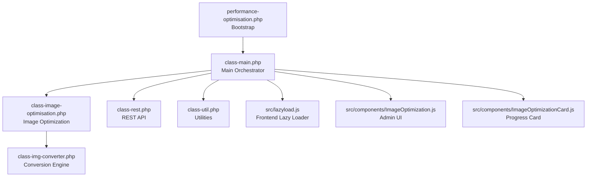
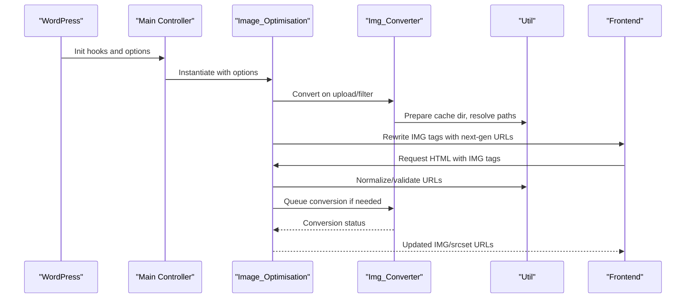
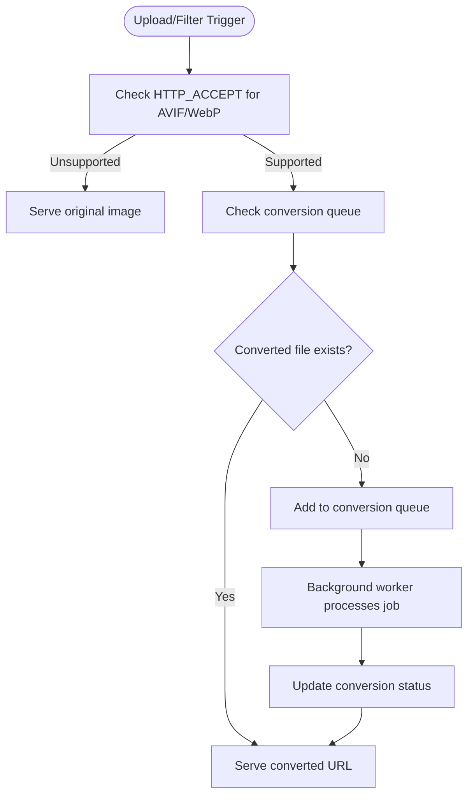
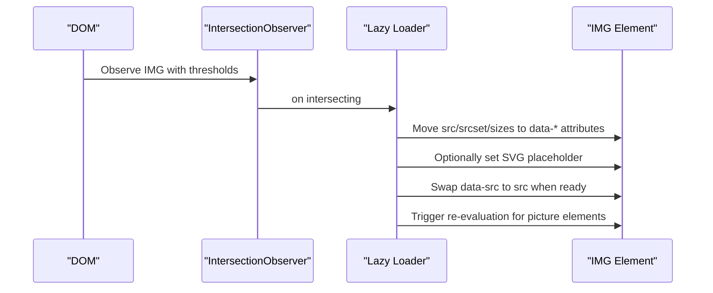
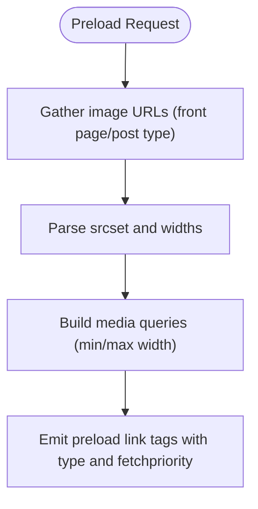
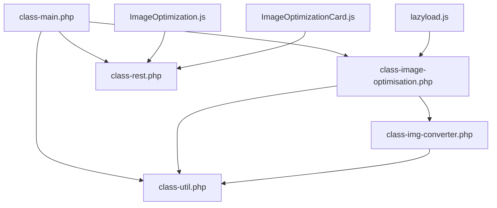

# Image Optimization Service

<cite>
**Referenced Files in This Document**
- [performance-optimisation.php](file://performance-optimisation.php)
- [class-main.php](file://includes/class-main.php)
- [class-image-optimisation.php](file://includes/class-image-optimisation.php)
- [class-img-converter.php](file://includes/class-img-converter.php)
- [class-util.php](file://includes/class-util.php)
- [class-rest.php](file://includes/class-rest.php)
- [lazyload.js](file://src/lazyload.js)
- [ImageOptimization.js](file://src/components/ImageOptimization.js)
- [ImageOptimizationCard.js](file://src/components/ImageOptimizationCard.js)
- [util.js](file://src/lib/util.js)
- [readme.txt](file://readme.txt)
</cite>

## Table of Contents
1. [Introduction](#introduction)
2. [Project Structure](#project-structure)
3. [Core Components](#core-components)
4. [Architecture Overview](#architecture-overview)
5. [Detailed Component Analysis](#detailed-component-analysis)
6. [Dependency Analysis](#dependency-analysis)
7. [Performance Considerations](#performance-considerations)
8. [Troubleshooting Guide](#troubleshooting-guide)
9. [Conclusion](#conclusion)
10. [Appendices](#appendices)

## Introduction
This document explains the Image Optimization Service within the Performance Optimisation plugin for WordPress. It covers WebP and AVIF conversion, lazy loading, preloading strategies, format detection and fallback, browser compatibility, optimization algorithms, quality settings, file size reduction, WordPress media library integration, and how optimized images are served. It also includes configuration guidance, performance impact analysis, and troubleshooting steps.

## Project Structure
The plugin follows a layered architecture:
- Plugin bootstrap initializes the main controller and registers hooks.
- The main controller orchestrates file optimization, preloading, and image optimization.
- The image optimization module detects browser support, replaces URLs with next-gen formats, and preloads critical images.
- The image converter handles background conversion to WebP/AVIF with safety checks and progress tracking.
- The frontend lazy loader defers non-critical images and videos until they enter the viewport.
- The admin UI exposes configuration panels for image optimization, preloading, and conversion progress.

**Diagram sources**
- [performance-optimisation.php:1-68](file://performance-optimisation.php#L1-L68)
- [class-main.php:1-120](file://includes/class-main.php#L1-L120)
- [class-image-optimisation.php:1-120](file://includes/class-image-optimisation.php#L1-L120)
- [class-img-converter.php:1-120](file://includes/class-img-converter.php#L1-L120)
- [class-rest.php:1-120](file://includes/class-rest.php#L1-L120)
- [lazyload.js:1-60](file://src/lazyload.js#L1-L60)
- [ImageOptimization.js:1-60](file://src/components/ImageOptimization.js#L1-L60)
- [ImageOptimizationCard.js:1-60](file://src/components/ImageOptimizationCard.js#L1-L60)

**Section sources**
- [performance-optimisation.php:1-68](file://performance-optimisation.php#L1-L68)
- [class-main.php:120-240](file://includes/class-main.php#L120-L240)

## Core Components
- Image_Optimisation: Detects browser support for next-gen formats, replaces IMG tags with optimized URLs, preloads critical images, and normalizes/validates URLs.
- Img_Converter: Converts images to WebP/AVIF with safety checks, tracks conversion status, and generates converted file paths/URLs.
- Util: Provides filesystem operations, URL normalization, preload link generation, and MIME type inference.
- Lazy Loader (lazyload.js): Implements IntersectionObserver-based lazy loading for images, iframes, and videos; supports SVG placeholders and responsive srcset handling.
- REST API (class-rest.php): Exposes endpoints for image optimization, status queries, and settings management.
- Admin UI (React components): Provides configurable options for lazy loading, conversion, preloading, and conversion progress.

**Section sources**
- [class-image-optimisation.php:27-120](file://includes/class-image-optimisation.php#L27-L120)
- [class-img-converter.php:22-120](file://includes/class-img-converter.php#L22-L120)
- [class-util.php:29-120](file://includes/class-util.php#L29-L120)
- [lazyload.js:120-220](file://src/lazyload.js#L120-L220)
- [class-rest.php:50-120](file://includes/class-rest.php#L50-L120)
- [ImageOptimization.js:19-120](file://src/components/ImageOptimization.js#L19-L120)

## Architecture Overview
The system integrates WordPress hooks with client-side lazy loading and server-side conversion:
- Hooks: The main controller registers filters/actions for image metadata and frontend output.
- Conversion: On upload or on-demand, images are queued for conversion to WebP/AVIF.
- Serving: During output, IMG tags are rewritten to serve next-gen formats when supported; otherwise, fallback to originals occurs.
- Preloading: Critical images are injected as preload hints to improve LCP.
- Frontend: Lazy loader defers non-critical assets until needed.

**Diagram sources**
- [class-main.php:160-240](file://includes/class-main.php#L160-L240)
- [class-image-optimisation.php:64-120](file://includes/class-image-optimisation.php#L64-L120)
- [class-img-converter.php:475-525](file://includes/class-img-converter.php#L475-L525)
- [class-util.php:38-120](file://includes/class-util.php#L38-L120)

## Detailed Component Analysis

### WebP and AVIF Conversion Pipeline
The conversion pipeline ensures safety and scalability:
- Detection: Browser support is inferred from HTTP_ACCEPT headers for image/avif and image/webp.
- Exclusions: Configurable URL substrings prevent conversion for specific images.
- Queueing: Pending conversions are tracked in an atomic option to avoid duplication.
- Conversion: GD or Imagick backends produce WebP/AVIF with quality and dimension limits.
- Serving: Converted images are served from a dedicated wppo directory under content.

**Diagram sources**
- [class-image-optimisation.php:95-120](file://includes/class-image-optimisation.php#L95-L120)
- [class-img-converter.php:104-310](file://includes/class-img-converter.php#L104-L310)
- [class-img-converter.php:632-659](file://includes/class-img-converter.php#L632-L659)

**Section sources**
- [class-img-converter.php:104-310](file://includes/class-img-converter.php#L104-L310)
- [class-img-converter.php:475-525](file://includes/class-img-converter.php#L475-L525)
- [class-image-optimisation.php:237-290](file://includes/class-image-optimisation.php#L237-L290)

### Lazy Loading Implementation
The lazy loader defers non-critical assets:
- IntersectionObserver: Watches IMG/IFRAME/VIDEO elements entering the viewport.
- Data attributes: Moves src/srcset/sizes to data-src/data-srcset/data-sizes to defer loading.
- SVG placeholders: Optionally replaces src with inline SVG for smooth loading.
- Responsive handling: Processes picture/source elements and re-evaluates when loaded.
- Fallback: For older browsers, scroll-based fallback loads elements when in viewport.

**Diagram sources**
- [lazyload.js:152-235](file://src/lazyload.js#L152-L235)
- [lazyload.js:287-355](file://src/lazyload.js#L287-L355)

**Section sources**
- [lazyload.js:152-235](file://src/lazyload.js#L152-L235)
- [lazyload.js:287-355](file://src/lazyload.js#L287-L355)
- [class-image-optimisation.php:610-798](file://includes/class-image-optimisation.php#L610-L798)

### Preloading Strategies
Preloading improves LCP by hinting the browser to prioritize critical assets:
- Front page images: Preload configured URLs with appropriate media conditions.
- Post type thumbnails: Extract srcset and generate media-conditional preload hints.
- Mobile/desktop variants: Support device-specific preload hints.
- MIME types: Preload links include type attributes derived from URL extensions.

**Diagram sources**
- [class-image-optimisation.php:392-454](file://includes/class-image-optimisation.php#L392-L454)
- [class-image-optimisation.php:501-556](file://includes/class-image-optimisation.php#L501-L556)
- [class-util.php:193-231](file://includes/class-util.php#L193-L231)

**Section sources**
- [class-image-optimisation.php:392-454](file://includes/class-image-optimisation.php#L392-L454)
- [class-image-optimisation.php:501-556](file://includes/class-image-optimisation.php#L501-L556)
- [class-util.php:193-231](file://includes/class-util.php#L193-L231)

### Format Detection, Fallback, and Browser Compatibility
- Detection: HTTP_ACCEPT headers determine AVIF/WebP support; HTML5 WP_HTML_Tag_Processor is used when available, with regex fallback otherwise.
- Fallback: If conversion is unavailable or unsupported, original URLs are preserved.
- Compatibility: Converted images are stored under a dedicated directory and served with correct MIME types; original images remain unchanged.

**Section sources**
- [class-image-optimisation.php:95-120](file://includes/class-image-optimisation.php#L95-L120)
- [class-image-optimisation.php:237-290](file://includes/class-image-optimisation.php#L237-L290)
- [class-util.php:158-179](file://includes/class-util.php#L158-L179)

### WordPress Media Library Integration
- Hook integration: The plugin hooks into attachment metadata generation to queue conversions for newly uploaded images.
- Thumbnail handling: Featured images for selected post types are preloaded intelligently.
- Exclusions: Partial URLs can exclude specific attachments from conversion or preloading.

**Section sources**
- [class-image-optimisation.php:67-71](file://includes/class-image-optimisation.php#L67-L71)
- [class-img-converter.php:475-525](file://includes/class-img-converter.php#L475-L525)
- [class-image-optimisation.php:429-471](file://includes/class-image-optimisation.php#L429-L471)

### REST API and Background Processing
- Endpoints: Update settings, optimize images, delete optimized images, and query image job status.
- Background processing: Uses Action Scheduler when available; otherwise, synchronous processing.
- Atomic status tracking: Conversion progress is stored in an atomic option to prevent race conditions.

**Section sources**
- [class-rest.php:54-123](file://includes/class-rest.php#L54-L123)
- [class-rest.php:253-353](file://includes/class-rest.php#L253-L353)
- [class-img-converter.php:711-760](file://includes/class-img-converter.php#L711-L760)

## Dependency Analysis
Key dependencies and relationships:
- Main controller depends on Image_Optimisation, REST API, and Utilities.
- Image_Optimisation depends on Img_Converter and Util.
- Img_Converter depends on WordPress filesystem APIs and image libraries.
- Frontend lazy loader depends on browser APIs (IntersectionObserver) with fallback logic.
- Admin UI components depend on REST endpoints for settings and status.

**Diagram sources**
- [class-main.php:128-154](file://includes/class-main.php#L128-L154)
- [class-image-optimisation.php:1-120](file://includes/class-image-optimisation.php#L1-L120)
- [class-img-converter.php:1-120](file://includes/class-img-converter.php#L1-L120)
- [class-rest.php:1-120](file://includes/class-rest.php#L1-L120)
- [lazyload.js:120-220](file://src/lazyload.js#L120-L220)
- [ImageOptimization.js:1-60](file://src/components/ImageOptimization.js#L1-L60)
- [ImageOptimizationCard.js:1-60](file://src/components/ImageOptimizationCard.js#L1-L60)

**Section sources**
- [class-main.php:128-154](file://includes/class-main.php#L128-L154)
- [class-image-optimisation.php:1-120](file://includes/class-image-optimisation.php#L1-L120)
- [class-img-converter.php:1-120](file://includes/class-img-converter.php#L1-L120)
- [class-rest.php:1-120](file://includes/class-rest.php#L1-L120)

## Performance Considerations
- Conversion limits: File size and dimension caps prevent memory exhaustion and DoS risks.
- Background processing: Action Scheduler offloads heavy work; otherwise, synchronous processing is available.
- Preload targeting: Restrict preloading to above-the-fold and critical images to avoid bandwidth waste.
- Lazy loading: Reduces initial payload; ensure hero images are excluded to prevent layout shifts.
- Format choice: AVIF offers higher compression but requires modern browsers; WebP is widely compatible.

[No sources needed since this section provides general guidance]

## Troubleshooting Guide
Common issues and resolutions:
- Conversion failures: Verify GD/Imagick availability and that images are readable. Check logs for size/dimension violations.
- No next-gen images served: Ensure browser accepts AVIF/WebP and that converted files exist.
- Preload not effective: Confirm URLs are valid and normalized; verify media conditions and fetchpriority attributes.
- Lazy loading not working: Check IntersectionObserver support or rely on scroll fallback; ensure data-* attributes are properly swapped.
- Settings not applying: Confirm REST permissions and nonce validity; verify settings are sanitized and saved.

**Section sources**
- [class-img-converter.php:111-153](file://includes/class-img-converter.php#L111-L153)
- [class-image-optimisation.php:95-120](file://includes/class-image-optimisation.php#L95-L120)
- [class-rest.php:131-136](file://includes/class-rest.php#L131-L136)

## Conclusion
The Image Optimization Service provides a robust, layered approach to modern image delivery: safe conversion to WebP/AVIF, intelligent fallback, targeted preloading, and efficient lazy loading. Its integration with WordPress hooks and REST endpoints enables scalable, admin-managed optimization suitable for diverse site architectures.

[No sources needed since this section summarizes without analyzing specific files]

## Appendices

### Configuration Examples
- Enable lazy loading for images and wrap in picture tags for next-gen format support.
- Choose conversion format: WebP for broad compatibility, AVIF for maximum savings, or Both for best coverage.
- Exclude specific images or videos from lazy loading or conversion using partial URL patterns.
- Preload front page and post type feature images; configure max width and exclude classes to prevent oversized images.

**Section sources**
- [ImageOptimization.js:156-210](file://src/components/ImageOptimization.js#L156-L210)
- [ImageOptimization.js:254-318](file://src/components/ImageOptimization.js#L254-L318)
- [ImageOptimization.js:378-490](file://src/components/ImageOptimization.js#L378-L490)

### Understanding Performance Metrics
- Monitor conversion progress via the Image Optimization Card in the admin UI.
- Use the Performance Audit section to review metrics like modern image formats, total page size, and asset counts.
- Track background job status through the REST API endpoints for image job status.

**Section sources**
- [ImageOptimizationCard.js:24-98](file://src/components/ImageOptimizationCard.js#L24-L98)
- [class-rest.php:592-627](file://includes/class-rest.php#L592-L627)
- [class-main.php:485-500](file://includes/class-main.php#L485-L500)