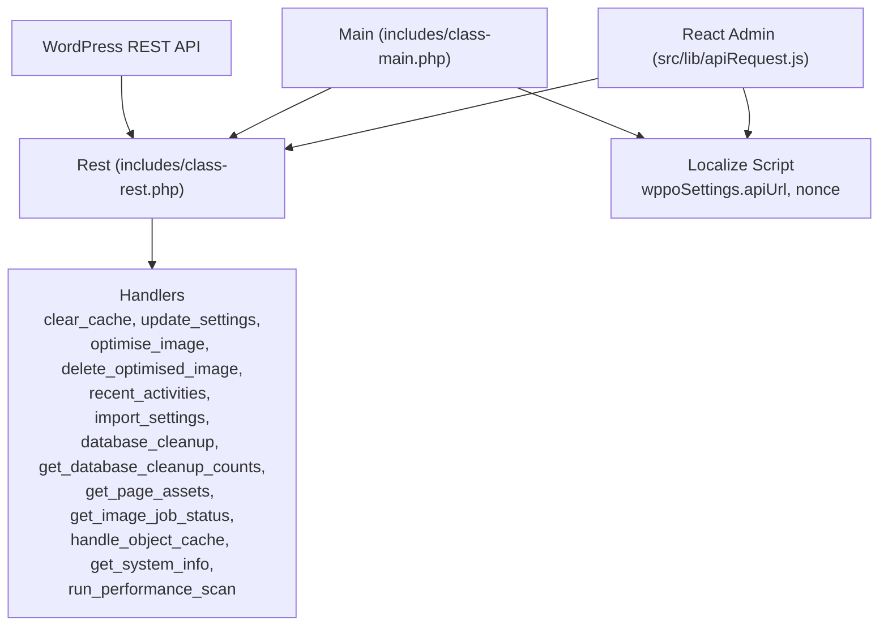
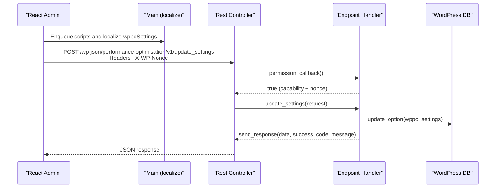
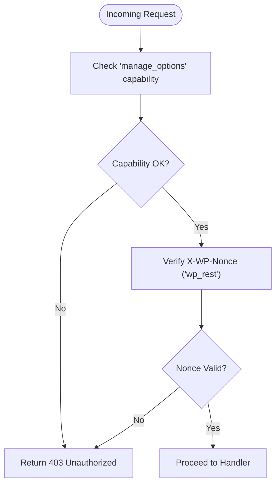
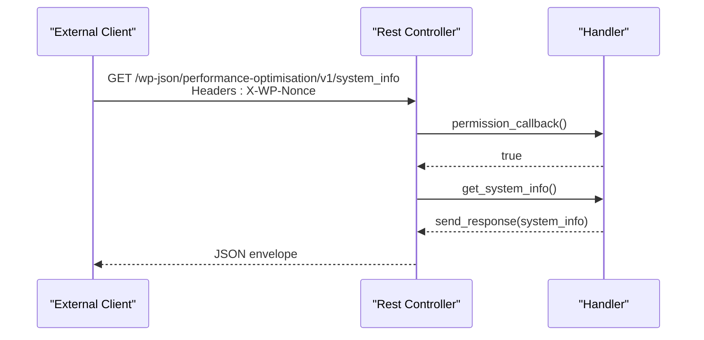
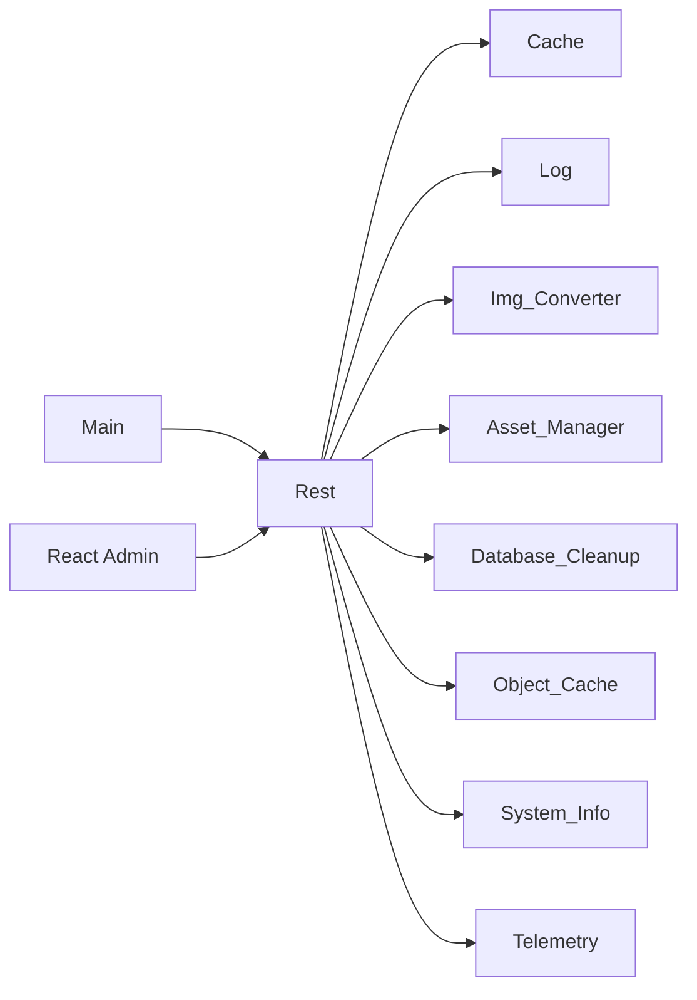

# REST API Service

<cite>
**Referenced Files in This Document**
- [class-rest.php](file://includes/class-rest.php)
- [class-main.php](file://includes/class-main.php)
- [class-system-info.php](file://includes/class-system-info.php)
- [class-telemetry.php](file://includes/class-telemetry.php)
- [class-database-cleanup.php](file://includes/class-database-cleanup.php)
- [class-asset-manager.php](file://includes/class-asset-manager.php)
- [class-object-cache.php](file://includes/class-object-cache.php)
- [apiRequest.js](file://src/lib/apiRequest.js)
- [performance-optimisation.php](file://performance-optimisation.php)
</cite>

## Table of Contents
1. [Introduction](#introduction)
2. [Project Structure](#project-structure)
3. [Core Components](#core-components)
4. [Architecture Overview](#architecture-overview)
5. [Detailed Component Analysis](#detailed-component-analysis)
6. [Dependency Analysis](#dependency-analysis)
7. [Performance Considerations](#performance-considerations)
8. [Troubleshooting Guide](#troubleshooting-guide)
9. [Conclusion](#conclusion)
10. [Appendices](#appendices)

## Introduction
This document describes the REST API Service exposed by the Performance Optimisation plugin for WordPress. It covers all available endpoints, their HTTP methods, URL patterns, request/response schemas, authentication requirements, and integration with the React admin interface. It also explains the authentication system, permission levels, security considerations, system information endpoints, performance metrics APIs, administrative functions, error handling, and client implementation guidelines.

## Project Structure
The REST API is implemented as part of the plugin’s backend and is wired into WordPress’s REST API infrastructure. The main entry point initializes the plugin and registers REST routes. The React admin UI consumes the API via a small utility module that attaches the nonce and performs fetch requests.

**Diagram sources**
- [class-main.php:182-183](file://includes/class-main.php#L182-L183)
- [class-rest.php:37-43](file://includes/class-rest.php#L37-L43)
- [apiRequest.js:1-54](file://src/lib/apiRequest.js#L1-L54)

**Section sources**
- [class-main.php:128-154](file://includes/class-main.php#L128-L154)
- [class-rest.php:30-123](file://includes/class-rest.php#L30-L123)
- [apiRequest.js:1-54](file://src/lib/apiRequest.js#L1-L54)

## Core Components
- REST controller: Registers and validates routes, implements handlers for cache, settings, image optimization, database cleanup, assets, object cache, diagnostics, and performance scans.
- Authentication: Requires WordPress user capability and a valid X-WP-Nonce header.
- Admin integration: Exposes endpoints consumed by the React admin UI and AJAX refresh for nonce updates.

Key responsibilities:
- Route registration and permission enforcement
- Data sanitization and validation
- Background job scheduling via Action Scheduler
- Telemetry and diagnostics
- Administrative operations (cache, DB cleanup, object cache)

**Section sources**
- [class-rest.php:30-136](file://includes/class-rest.php#L30-L136)
- [class-main.php:182-241](file://includes/class-main.php#L182-L241)

## Architecture Overview
The REST API is namespaced under performance-optimisation/v1. Handlers are invoked by WordPress REST API and return standardized JSON responses with data, success flag, and optional messages. The React admin passes the nonce via the X-WP-Nonce header and uses localized URLs.

**Diagram sources**
- [class-main.php:475-500](file://includes/class-main.php#L475-L500)
- [class-rest.php:131-136](file://includes/class-rest.php#L131-L136)
- [class-rest.php:184-200](file://includes/class-rest.php#L184-L200)

## Detailed Component Analysis

### Authentication and Permissions
- Permission callback enforces:
  - WordPress user capability: manage_options
  - Nonce verification: X-WP-Nonce header validated against wp_rest
- AJAX endpoint refreshes nonce for long-running admin sessions.

**Diagram sources**
- [class-rest.php:131-136](file://includes/class-rest.php#L131-L136)

**Section sources**
- [class-rest.php:131-136](file://includes/class-rest.php#L131-L136)
- [class-main.php:240](file://includes/class-main.php#L240)

### Endpoint Catalog

#### Base URL
- Namespace: performance-optimisation/v1
- Example base URL: https://yoursite/wp-json/performance-optimisation/v1/

#### Authentication
- Header: X-WP-Nonce: <nonce>
- Capability: manage_options
- Nonce refresh: wp_ajax_wppo_get_nonce

#### Response Schema
All endpoints return a standardized envelope:
- data: payload or null
- success: boolean
- message: string or null

Status codes:
- 200: Success
- 400: Validation or parameter error
- 403: Unauthorized (capability or nonce)
- 500: Server-side error

#### Endpoints

- GET /wp-json/performance-optimisation/v1/recent_activities
  - Purpose: Retrieve recent administrative activities
  - Query params: page (integer)
  - Response: data = array of activities
  - Auth: manage_options + valid nonce

- POST /wp-json/performance-optimisation/v1/clear_cache
  - Purpose: Clear cache (all or single page)
  - Body params: action (string), path (string)
  - Validation: rejects paths with directory traversal
  - Response: success boolean

- POST /wp-json/performance-optimisation/v1/update_settings
  - Purpose: Save plugin settings
  - Body params: tab (string), settings (object)
  - Behavior: Recursively sanitizes settings, updates option, clears cache
  - Response: data = current settings

- POST /wp-json/performance-optimisation/v1/import_settings
  - Purpose: Import settings from JSON payload
  - Body: action (string), settings (object)
  - Behavior: Validates action, sanitizes, compares with existing, updates if changed
  - Response: data = sanitized settings or existing settings

- POST /wp-json/performance-optimisation/v1/optimise_image
  - Purpose: Convert images to WebP/AVIF
  - Body params: webp (array), avif (array) of image paths
  - Validation: rejects paths with directory traversal
  - Behavior: If Action Scheduler available, schedules background jobs; otherwise processes synchronously
  - Response: background=true with jobs_queued and message, or processed image info

- POST /wp-json/performance-optimisation/v1/delete_optimised_image
  - Purpose: Delete optimized images directory
  - Behavior: Uses WP_Filesystem, deletes /wp-content/wppo
  - Response: success boolean + message

- GET /wp-json/performance-optimisation/v1/get_page_assets
  - Purpose: Return captured assets for a post
  - Query params: post_id (integer)
  - Response: data = {scripts:[], styles:[]} or message indicating no capture yet

- GET /wp-json/performance-optimisation/v1/image_job_status
  - Purpose: Report background image optimization status
  - Response: pending/completed/failed counts per format, queued_jobs count

- POST /wp-json/performance-optimisation/v1/database_cleanup
  - Purpose: Perform database cleanup for a type or all types
  - Query params: type (string) from: revisions, auto_drafts, trashed_posts, spam_comments, trashed_comments, expired_transients, orphan_postmeta, all
  - Response: For all: results (per-type counts) + deleted (total); for specific type: type + deleted; errors return 500 with failures

- GET /wp-json/performance-optimisation/v1/database_cleanup_counts
  - Purpose: Return counts for each cleanup category
  - Response: counts object

- POST /wp-json/performance-optimisation/v1/object_cache?action={status|ping|enable|disable|flush}
  - Purpose: Manage Redis object cache drop-in and telemetry
  - Body params: action (string), plus config fields for enable (host, port, password, database, nodes, master_name, use_tls, persistent, compression, mode)
  - Response: status object (with supported_compressors), ping success, enable/disable result, flush result

- GET /wp-json/performance-optimisation/v1/system_info
  - Purpose: System diagnostics (PHP, DB, WordPress, server, cache)
  - Response: data = grouped system info

- POST /wp-json/performance-optimisation/v1/performance_scan?url=<url>
  - Purpose: Run local telemetry scan on a URL
  - Body params: url (string)
  - Response: data = metrics object (load_time, ttfb, dns_lookup_time, connect_time, ssl_time, css/js/media counts and sizes, https, modern formats, alt attributes, robots.txt, compression, cache-control)

**Section sources**
- [class-rest.php:53-123](file://includes/class-rest.php#L53-L123)
- [class-rest.php:145-175](file://includes/class-rest.php#L145-L175)
- [class-rest.php:184-200](file://includes/class-rest.php#L184-L200)
- [class-rest.php:232-241](file://includes/class-rest.php#L232-L241)
- [class-rest.php:253-353](file://includes/class-rest.php#L253-L353)
- [class-rest.php:361-400](file://includes/class-rest.php#L361-L400)
- [class-rest.php:410-432](file://includes/class-rest.php#L410-L432)
- [class-rest.php:451-539](file://includes/class-rest.php#L451-L539)
- [class-rest.php:548-551](file://includes/class-rest.php#L548-L551)
- [class-rest.php:560-583](file://includes/class-rest.php#L560-L583)
- [class-rest.php:592-627](file://includes/class-rest.php#L592-L627)
- [class-rest.php:636-695](file://includes/class-rest.php#L636-L695)
- [class-rest.php:790-792](file://includes/class-rest.php#L790-L792)
- [class-rest.php:804-819](file://includes/class-rest.php#L804-L819)

### System Information Endpoints
- GET /wp-json/performance-optimisation/v1/system_info
  - Returns grouped system information:
    - php: version, sapi, memory_limit, max_execution_time, upload_max_filesize, post_max_size, display_errors, extensions_count
    - database: server_version, extension, client_version, max_connections
    - wordpress: version, environment_type, permalink_structure, using_https, multisite
    - wp_constants: WP_DEBUG, WP_CACHE, WP_MEMORY_LIMIT, WP_DEBUG_LOG, SCRIPT_DEBUG
    - server: server_software, os, architecture
    - cache: object_cache_status, active_cache_plugin, peak_memory_usage, current_memory_usage, woocommerce_presets

**Section sources**
- [class-system-info.php:62-71](file://includes/class-system-info.php#L62-L71)
- [class-rest.php:790-792](file://includes/class-rest.php#L790-L792)

### Performance Metrics APIs
- POST /wp-json/performance-optimisation/v1/performance_scan
  - Scans a URL and returns metrics:
    - page_url, load_time, ttfb, dns_lookup_time, connect_time, ssl_time
    - css_count, js_count, media_count, lazy_image_count, eager_image_count
    - css_total_size, js_total_size, media_total_size, total_size
    - uses_https, uses_modern_image_formats, image_alt_attributes, robots_txt_exists
    - gzip_brotli_compression, cache_control_headers
  - Uses cURL when available for granular timings and automatic decompression; falls back to wp_remote_get()

**Section sources**
- [class-rest.php:804-819](file://includes/class-rest.php#L804-L819)
- [class-telemetry.php:45-192](file://includes/class-telemetry.php#L45-L192)

### Administrative Functions
- Cache management
  - POST /wp-json/performance-optimisation/v1/clear_cache
  - POST /wp-json/performance-optimisation/v1/delete_optimised_image
- Settings
  - POST /wp-json/performance-optimisation/v1/update_settings
  - POST /wp-json/performance-optimisation/v1/import_settings
- Database cleanup
  - GET /wp-json/performance-optimisation/v1/database_cleanup_counts
  - POST /wp-json/performance-optimisation/v1/database_cleanup?type={...}
- Assets
  - GET /wp-json/performance-optimisation/v1/get_page_assets?post_id=...
  - GET /wp-json/performance-optimisation/v1/image_job_status
- Object cache (Redis)
  - POST /wp-json/performance-optimisation/v1/object_cache?action=status|ping|enable|disable|flush

**Section sources**
- [class-rest.php:145-175](file://includes/class-rest.php#L145-L175)
- [class-rest.php:184-200](file://includes/class-rest.php#L184-L200)
- [class-rest.php:410-432](file://includes/class-rest.php#L410-L432)
- [class-rest.php:451-539](file://includes/class-rest.php#L451-L539)
- [class-rest.php:548-583](file://includes/class-rest.php#L548-L583)
- [class-rest.php:592-627](file://includes/class-rest.php#L592-L627)
- [class-rest.php:636-695](file://includes/class-rest.php#L636-L695)

### Integration with React Admin and External Applications
- The admin UI localizes wppoSettings with apiUrl and nonce, then uses a small fetch wrapper to call endpoints.
- The wrapper:
  - Sends X-WP-Nonce header
  - For GET requests omits Content-Type
  - Updates settings cache on successful update_settings
- External applications can reuse this pattern to integrate with the API.

**Diagram sources**
- [apiRequest.js:51-53](file://src/lib/apiRequest.js#L51-L53)
- [class-rest.php:790-792](file://includes/class-rest.php#L790-L792)

**Section sources**
- [class-main.php:475-500](file://includes/class-main.php#L475-L500)
- [apiRequest.js:1-54](file://src/lib/apiRequest.js#L1-L54)

## Dependency Analysis
- Main wires the REST controller into WordPress via rest_api_init.
- The REST controller depends on:
  - Cache, Log, Util, Img_Converter, Asset_Manager, Database_Cleanup, Object_Cache, System_Info, Telemetry
- The React admin depends on localized nonce and API URL.

**Diagram sources**
- [class-main.php:182-183](file://includes/class-main.php#L182-L183)
- [class-rest.php:139-175](file://includes/class-rest.php#L139-L175)

**Section sources**
- [class-main.php:128-154](file://includes/class-main.php#L128-L154)
- [class-rest.php:139-175](file://includes/class-rest.php#L139-L175)

## Performance Considerations
- Background processing: Image optimization uses Action Scheduler when available to avoid blocking requests.
- Batch operations: Database cleanup uses batching to prevent timeouts and excessive memory usage.
- Caching: Telemetry results are cached via transients to avoid repeated scans.
- Resource sizing: Asset sizes are calculated from local filesystem paths for efficiency.
- Recommendations:
  - Use background image optimization for large batches
  - Monitor queued_jobs count via image_job_status
  - Leverage database cleanup counts to plan maintenance windows
  - Use performance_scan to identify bottlenecks before applying changes

[No sources needed since this section provides general guidance]

## Troubleshooting Guide
Common issues and resolutions:
- 403 Unauthorized
  - Cause: Missing manage_options capability or invalid/missing X-WP-Nonce
  - Resolution: Ensure user has administrator privileges and pass a fresh nonce
- 400 Bad Request
  - Causes:
    - Invalid cleanup type or missing parameters
    - Invalid image paths (directory traversal)
    - Missing post_id for get_page_assets
  - Resolution: Validate inputs and retry
- 500 Internal Server Error
  - Causes:
    - Database cleanup failures (WP_Error)
    - Object cache enable/disable/write errors
    - Telemetry scan failures
  - Resolution: Inspect logs and adjust configurations; retry after fixing underlying issues
- Stale nonce
  - Use wp_ajax_wppo_get_nonce to refresh the nonce

**Section sources**
- [class-rest.php:152-155](file://includes/class-rest.php#L152-L155)
- [class-rest.php:457-459](file://includes/class-rest.php#L457-L459)
- [class-rest.php:655-657](file://includes/class-rest.php#L655-L657)
- [class-rest.php:814-816](file://includes/class-rest.php#L814-L816)
- [class-main.php:240](file://includes/class-main.php#L240)

## Conclusion
The REST API Service provides comprehensive administrative controls for performance optimization, diagnostics, and maintenance. It enforces strict authentication, offers robust background processing, and exposes diagnostic endpoints for deep insights. The React admin integrates seamlessly via a simple fetch wrapper, and external clients can adopt the same pattern to integrate with the API.

[No sources needed since this section summarizes without analyzing specific files]

## Appendices

### Client Implementation Guidelines
- Always include X-WP-Nonce header with value from wppoSettings.nonce
- Use localized wppoSettings.apiUrl for endpoint base URL
- For GET requests, omit Content-Type header
- On update_settings success, update cached settings in your client
- Refresh nonce via wp_ajax_wppo_get_nonce if encountering 403 errors

**Section sources**
- [apiRequest.js:1-18](file://src/lib/apiRequest.js#L1-L18)
- [class-main.php:475-500](file://includes/class-main.php#L475-L500)
- [class-main.php:240](file://includes/class-main.php#L240)