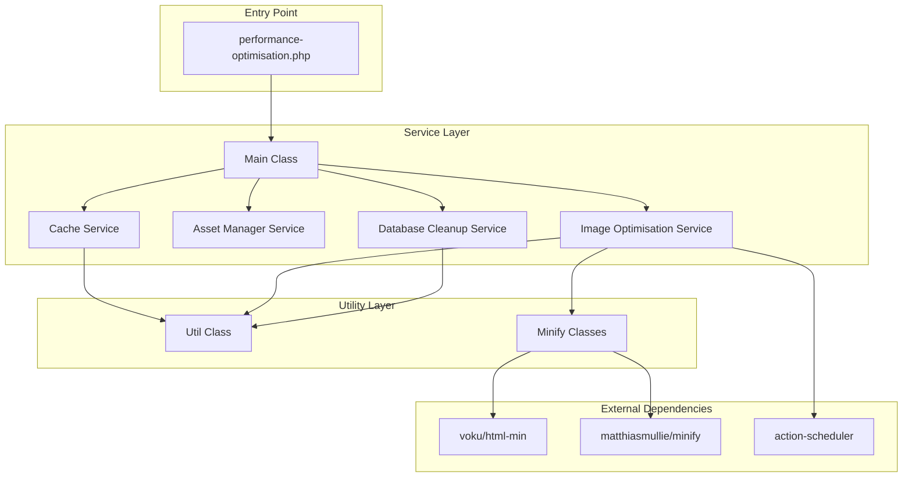
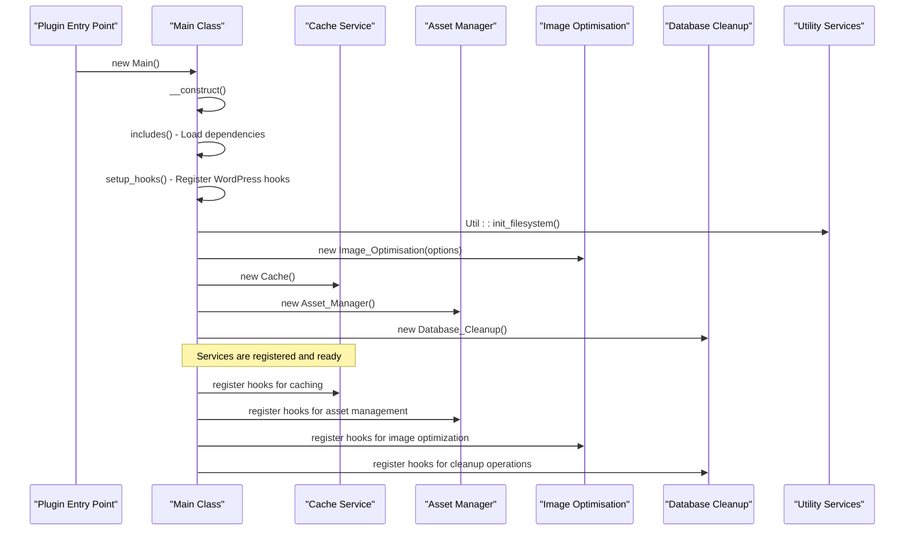
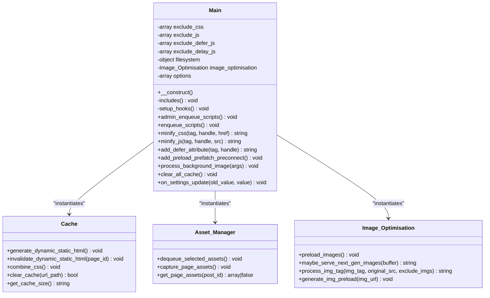
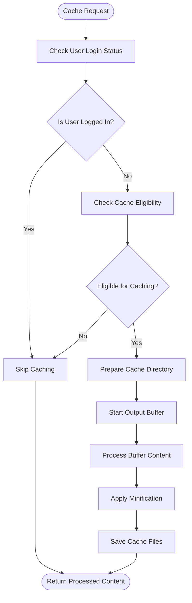
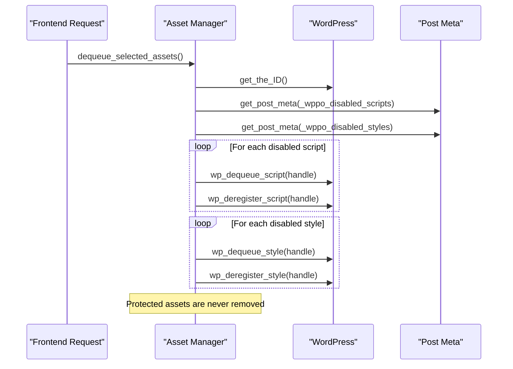
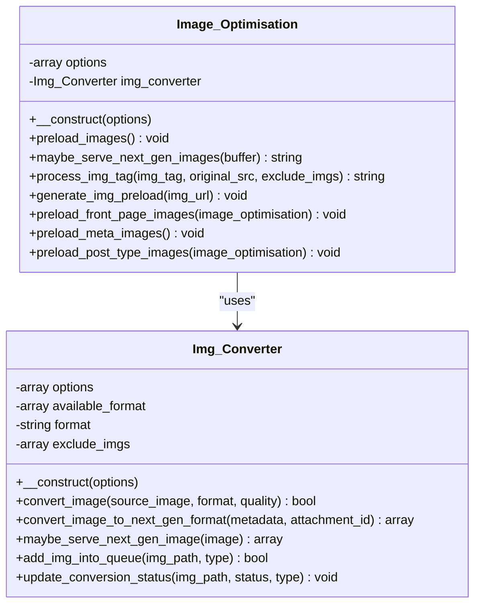
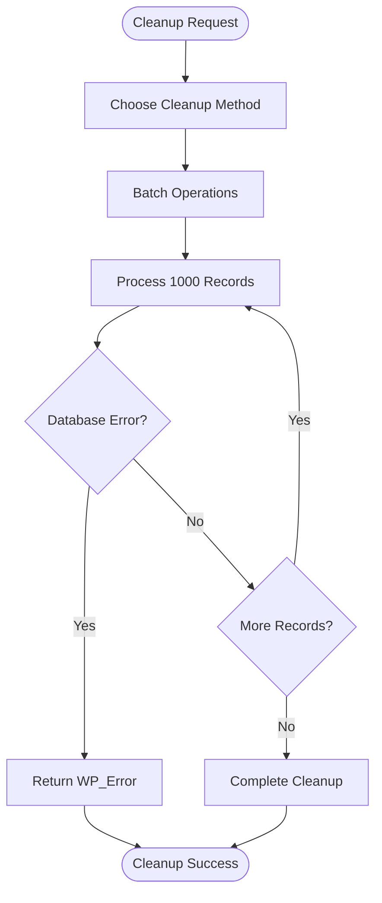
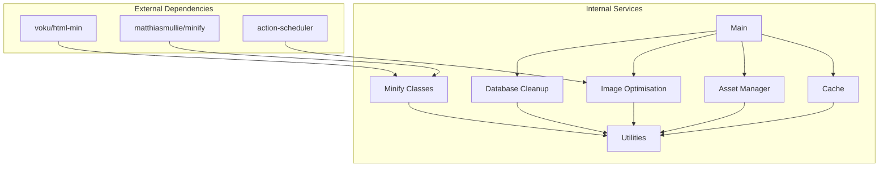

# Service Layer Architecture

<cite>
**Referenced Files in This Document**
- [performance-optimisation.php](file://performance-optimisation.php)
- [class-main.php](file://includes/class-main.php)
- [class-cache.php](file://includes/class-cache.php)
- [class-asset-manager.php](file://includes/class-asset-manager.php)
- [class-image-optimisation.php](file://includes/class-image-optimisation.php)
- [class-database-cleanup.php](file://includes/class-database-cleanup.php)
- [class-img-converter.php](file://includes/class-img-converter.php)
- [class-util.php](file://includes/class-util.php)
- [class-css.php](file://includes/minify/class-css.php)
- [class-js.php](file://includes/minify/class-js.php)
- [class-html.php](file://includes/minify/class-html.php)
- [composer.json](file://composer.json)
</cite>

## Table of Contents
1. [Introduction](#introduction)
2. [Project Structure](#project-structure)
3. [Core Components](#core-components)
4. [Architecture Overview](#architecture-overview)
5. [Detailed Component Analysis](#detailed-component-analysis)
6. [Dependency Analysis](#dependency-analysis)
7. [Performance Considerations](#performance-considerations)
8. [Troubleshooting Guide](#troubleshooting-guide)
9. [Conclusion](#conclusion)

## Introduction

The Performance Optimisation plugin implements a comprehensive service layer architecture that manages multiple optimization services independently. The system follows a modular design pattern where each optimization service operates as a standalone module that can be instantiated and managed by the central Main class. This architecture enables flexible service registration, dependency injection, and inter-service communication through shared interfaces and common data structures.

The service layer provides four primary optimization capabilities: caching, asset management, image optimization, and database cleanup. Each service maintains its own lifecycle, configuration, and specialized functionality while coordinating with other services through well-defined interfaces.

## Project Structure

The plugin follows a layered architecture with clear separation between presentation, service, and infrastructure layers:

**Diagram sources**
- [performance-optimisation.php:43](file://performance-optimisation.php#L43)
- [class-main.php:98-118](file://includes/class-main.php#L98-L118)
- [composer.json:11-15](file://composer.json#L11-L15)

**Section sources**
- [performance-optimisation.php:17-44](file://performance-optimisation.php#L17-L44)
- [composer.json:1-40](file://composer.json#L1-L40)

## Core Components

The service layer consists of five primary components, each implementing specific optimization functionality:

### Main Class - Central Orchestrator
The Main class serves as the central orchestrator that instantiates and coordinates all optimization services. It handles plugin initialization, service registration, and inter-service communication through WordPress hooks and filters.

### Cache Service - Static Content Management
Provides caching functionality for generated HTML content, CSS combination, and static file management with intelligent cache invalidation strategies.

### Asset Manager Service - Resource Control
Manages per-page/post control over script and style loading, providing selective asset disabling through WordPress meta boxes.

### Image Optimisation Service - Media Enhancement
Handles image conversion to modern formats (WebP/AVIF), preloading strategies, lazy loading, and next-generation image serving.

### Database Cleanup Service - Data Maintenance
Performs automated cleanup of WordPress database bloat including revisions, auto-drafts, trashed content, and orphaned metadata.

**Section sources**
- [class-main.php:29-118](file://includes/class-main.php#L29-L118)
- [class-cache.php:32-120](file://includes/class-cache.php#L32-L120)
- [class-asset-manager.php:27-82](file://includes/class-asset-manager.php#L27-L82)
- [class-image-optimisation.php:27-57](file://includes/class-image-optimisation.php#L27-L57)
- [class-database-cleanup.php:30-82](file://includes/class-database-cleanup.php#L30-L82)

## Architecture Overview

The service layer implements a dependency injection pattern where the Main class injects configuration options and shared utilities into each service during instantiation:

**Diagram sources**
- [performance-optimisation.php:43](file://performance-optimisation.php#L43)
- [class-main.php:98-149](file://includes/class-main.php#L98-L149)
- [class-main.php:175-229](file://includes/class-main.php#L175-L229)

The architecture employs several key design patterns:

### Strategy Pattern Implementation
Services implement different optimization strategies through configurable options and runtime decisions. The Image_Optimisation service demonstrates this with format conversion strategies (WebP/AVIF/both) and lazy loading approaches.

### Factory Pattern
The Main class acts as a factory, instantiating services with appropriate configuration options and registering them with WordPress hooks.

### Observer Pattern
Services register WordPress actions and filters, allowing them to observe and react to WordPress events without tight coupling.

**Section sources**
- [class-main.php:164-241](file://includes/class-main.php#L164-L241)
- [class-image-optimisation.php:53-71](file://includes/class-image-optimisation.php#L53-L71)

## Detailed Component Analysis

### Main Class - Service Orchestration

The Main class implements the central coordination hub for all optimization services:

**Diagram sources**
- [class-main.php:29-118](file://includes/class-main.php#L29-L118)
- [class-cache.php:32-120](file://includes/class-cache.php#L32-L120)
- [class-asset-manager.php:27-82](file://includes/class-asset-manager.php#L27-L82)
- [class-image-optimisation.php:27-57](file://includes/class-image-optimisation.php#L27-L57)

#### Service Registration and Lifecycle Management

The Main class manages service lifecycle through a structured initialization process:

1. **Configuration Loading**: Loads plugin settings from WordPress options
2. **Dependency Inclusion**: Includes all service classes and utilities
3. **Filesystem Initialization**: Establishes WordPress filesystem access
4. **Service Instantiation**: Creates service instances with configuration
5. **Hook Registration**: Registers services with WordPress action/filter system

#### Inter-Service Communication Patterns

Services communicate through several mechanisms:

- **Shared Configuration**: All services receive the same options array
- **WordPress Hooks**: Services register callbacks that can trigger other services
- **Static Method Calls**: Services call each other's static methods for shared functionality
- **Event-Driven Architecture**: Services respond to WordPress events and triggers

**Section sources**
- [class-main.php:98-149](file://includes/class-main.php#L98-L149)
- [class-main.php:175-241](file://includes/class-main.php#L175-L241)

### Cache Service - Static Content Management

The Cache service implements sophisticated static content caching with intelligent invalidation:

**Diagram sources**
- [class-cache.php:260-310](file://includes/class-cache.php#L260-L310)
- [class-cache.php:470-483](file://includes/class-cache.php#L470-L483)

#### Cache Storage Strategy

The Cache service implements a hierarchical storage system:

- **Domain-based Organization**: Cache files organized by domain name
- **Path-based Structure**: Maintains URL path structure within cache directories
- **Dual-format Storage**: Stores both uncompressed and gzip-compressed versions
- **Smart Invalidation**: Intelligent cache purging based on content changes

#### Integration with Image Optimization

The Cache service integrates with Image_Optimisation through buffer processing:

- **Next-gen Image Serving**: Processes HTML to serve WebP/AVIF images when supported
- **Lazy Loading Integration**: Applies lazy loading optimizations to cached content
- **Video Optimization**: Integrates video lazy loading capabilities

**Section sources**
- [class-cache.php:287-310](file://includes/class-cache.php#L287-L310)
- [class-cache.php:433-447](file://includes/class-cache.php#L433-L447)

### Asset Manager Service - Resource Control

The Asset Manager provides granular control over asset loading:

**Diagram sources**
- [class-asset-manager.php:91-121](file://includes/class-asset-manager.php#L91-L121)
- [class-asset-manager.php:131-190](file://includes/class-asset-manager.php#L131-L190)

#### Protected Assets Strategy

The Asset Manager implements a protection mechanism for essential WordPress assets:

- **Core Scripts Protection**: jQuery, WordPress core scripts, admin bar, heartbeat
- **Core Styles Protection**: Admin bar styles, dashicons, block library
- **Dynamic Exclusion**: Never removes assets that are essential for site functionality

#### Transient-Based Asset Tracking

The service uses WordPress transients to track page assets:

- **24-Hour Caching**: Captured assets cached for 24 hours
- **Change Detection**: Only updates when asset lists change
- **Post-specific Storage**: Separate transient keys for each post ID

**Section sources**
- [class-asset-manager.php:44-67](file://includes/class-asset-manager.php#L44-L67)
- [class-asset-manager.php:178-190](file://includes/class-asset-manager.php#L178-L190)

### Image Optimisation Service - Media Enhancement

The Image_Optimisation service implements comprehensive image optimization:

**Diagram sources**
- [class-image-optimisation.php:27-57](file://includes/class-image-optimisation.php#L27-L57)
- [class-img-converter.php:22-91](file://includes/class-img-converter.php#L22-L91)

#### Next-Generation Image Strategy

The service implements a sophisticated image format conversion strategy:

- **Browser Capability Detection**: Uses HTTP_ACCEPT headers to detect WebP/AVIF support
- **Format Priority**: Supports WebP, AVIF, or both conversion strategies
- **Queue-based Processing**: Background processing of images through Action Scheduler
- **Fallback Mechanisms**: Graceful degradation when formats are unsupported

#### Lazy Loading Implementation

The service provides multiple lazy loading strategies:

- **HTML Tag Processing**: Uses WordPress HTML processor when available
- **Regex Fallback**: Compatible regex-based processing for older WordPress versions
- **Dimension Optimization**: Automatically adds width/height attributes for better layout stability
- **Placeholder Support**: Optional SVG placeholder replacement for improved perceived performance

**Section sources**
- [class-image-optimisation.php:95-208](file://includes/class-image-optimisation.php#L95-L208)
- [class-img-converter.php:104-310](file://includes/class-img-converter.php#L104-L310)

### Database Cleanup Service - Data Maintenance

The Database Cleanup service implements efficient database maintenance:

**Diagram sources**
- [class-database-cleanup.php:42-82](file://includes/class-database-cleanup.php#L42-L82)
- [class-database-cleanup.php:529-546](file://includes/class-database-cleanup.php#L529-L546)

#### Advanced Cleanup Strategies

The service implements several cleanup strategies:

- **Batch Processing**: Processes 1000 records at a time to prevent memory issues
- **Advanced Revision Cleanup**: Keeps latest revisions per post with configurable retention
- **Orphan Detection**: Identifies and removes orphaned postmeta entries
- **Error Handling**: Comprehensive error handling with WP_Error return values

#### Automated Cleanup Scheduling

The service supports automated cleanup operations:

- **Scheduled Execution**: Can be triggered by WordPress cron system
- **Configurable Parameters**: Allows customization of cleanup thresholds
- **Progress Tracking**: Maintains detailed logs of cleanup operations

**Section sources**
- [class-database-cleanup.php:561-586](file://includes/class-database-cleanup.php#L561-L586)
- [class-database-cleanup.php:598-634](file://includes/class-database-cleanup.php#L598-L634)

## Dependency Analysis

The service layer exhibits clear dependency relationships with well-defined interfaces:

**Diagram sources**
- [composer.json:11-15](file://composer.json#L11-L15)
- [class-main.php:128-149](file://includes/class-main.php#L128-L149)

### Dependency Injection Pattern

The Main class implements dependency injection through:

- **Constructor Injection**: Services receive configuration options during instantiation
- **Shared Utilities**: All services access common utilities through static methods
- **Filesystem Access**: Services share WordPress filesystem instance
- **WordPress Integration**: Services integrate with WordPress hooks and APIs

### Circular Dependency Prevention

The architecture prevents circular dependencies through:

- **Service Separation**: Each service has distinct responsibilities
- **Interface Abstraction**: Services communicate through well-defined interfaces
- **Static Method Usage**: Cross-service communication uses static methods
- **Hook-based Communication**: Services coordinate through WordPress action/filter system

**Section sources**
- [class-main.php:128-149](file://includes/class-main.php#L128-L149)
- [composer.json:11-15](file://composer.json#L11-L15)

## Performance Considerations

The service layer implements several performance optimization strategies:

### Caching Strategies
- **Output Buffer Caching**: Static HTML caching with intelligent invalidation
- **Asset Caching**: Minified CSS/JS caching with gzip compression
- **Transient-based Tracking**: Efficient asset tracking using WordPress transients
- **Background Processing**: Image conversion performed asynchronously

### Memory Management
- **Batch Processing**: Database operations process in chunks of 1000 records
- **Lazy Loading**: Images loaded only when needed
- **Resource Cleanup**: Proper cleanup of file handles and memory
- **Filesystem Optimization**: Efficient file operations using WordPress filesystem API

### Scalability Features
- **Modular Design**: Independent services can be scaled separately
- **Background Task Processing**: Heavy operations offloaded to Action Scheduler
- **Configurable Limits**: Adjustable processing limits and timeouts
- **Error Containment**: Failures in one service don't affect others

## Troubleshooting Guide

### Common Issues and Solutions

#### Service Initialization Failures
- **Symptom**: Services not responding to hooks
- **Cause**: Filesystem permission issues or missing dependencies
- **Solution**: Verify WordPress filesystem credentials and plugin dependencies

#### Cache Invalidation Problems
- **Symptom**: Outdated cached content serving
- **Cause**: Improper cache invalidation triggers
- **Solution**: Use built-in cache clearing methods or manual cache purging

#### Image Conversion Failures
- **Symptom**: Images not converting to WebP/AVIF
- **Cause**: Missing GD/ImageMagick extensions or file permission issues
- **Solution**: Install required PHP extensions and verify file permissions

#### Database Cleanup Errors
- **Symptom**: Cleanup operations failing silently
- **Cause**: Database connection issues or insufficient privileges
- **Solution**: Check database connectivity and user permissions

### Debug Information Access

The Main class provides comprehensive debug information:

- **Performance Metrics**: Cache size, minified asset counts
- **Service Status**: Individual service health and activity
- **Error Logging**: Detailed error messages and stack traces
- **Configuration Validation**: Current settings verification

**Section sources**
- [class-main.php:463-474](file://includes/class-main.php#L463-L474)
- [class-cache.php:711-726](file://includes/class-cache.php#L711-L726)

## Conclusion

The Performance Optimisation plugin demonstrates a well-architected service layer that effectively separates concerns while maintaining loose coupling between components. The Main class serves as a central coordinator that implements dependency injection, service registration, and inter-service communication patterns.

Key strengths of the architecture include:

- **Modular Design**: Each service operates independently with clear responsibilities
- **Flexible Configuration**: Services adapt to different optimization strategies through configuration
- **Robust Error Handling**: Comprehensive error handling and recovery mechanisms
- **Performance Optimization**: Built-in caching, batch processing, and asynchronous operations
- **WordPress Integration**: Seamless integration with WordPress hooks, filters, and APIs

The service layer pattern enables easy extension and modification of optimization strategies. New services can be added following the established patterns, and existing services can be modified or replaced without affecting the overall system architecture. This design provides a solid foundation for continued development and enhancement of the plugin's optimization capabilities.