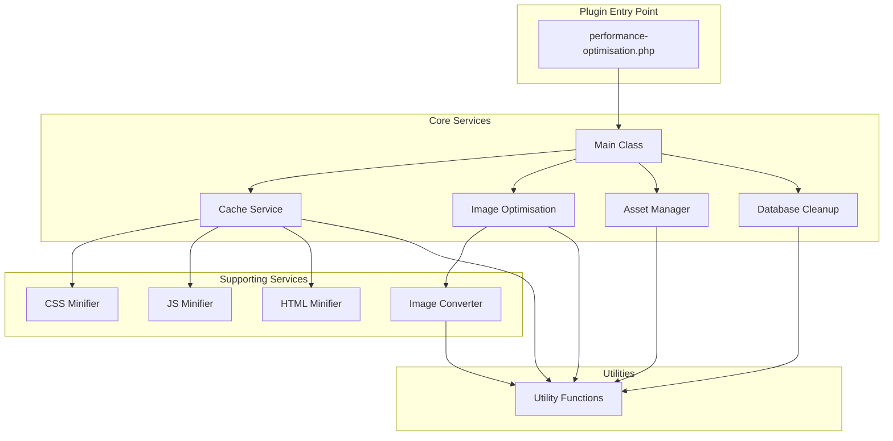
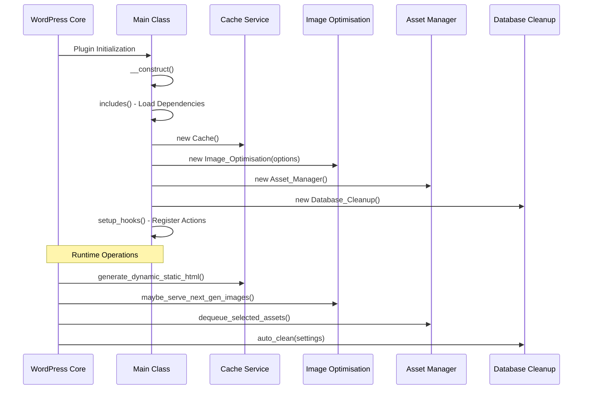
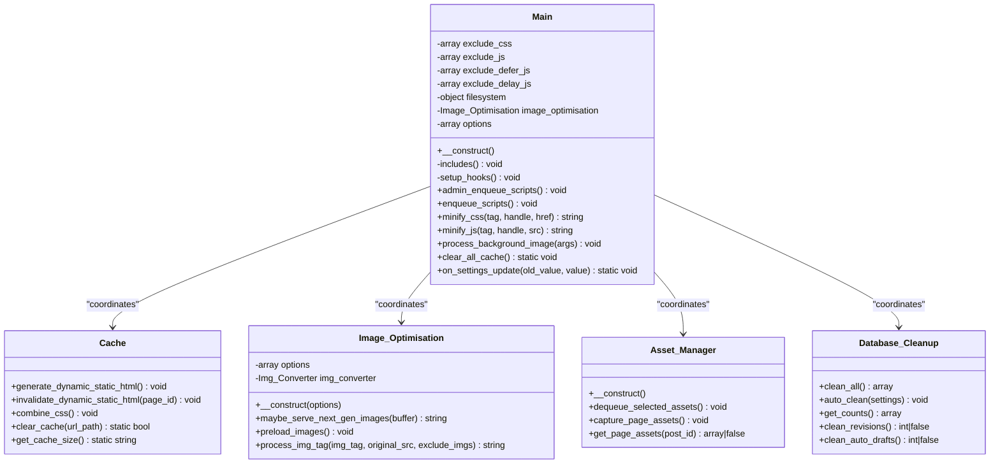
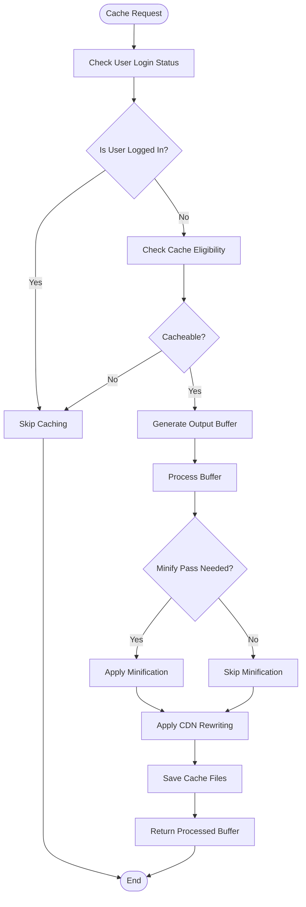
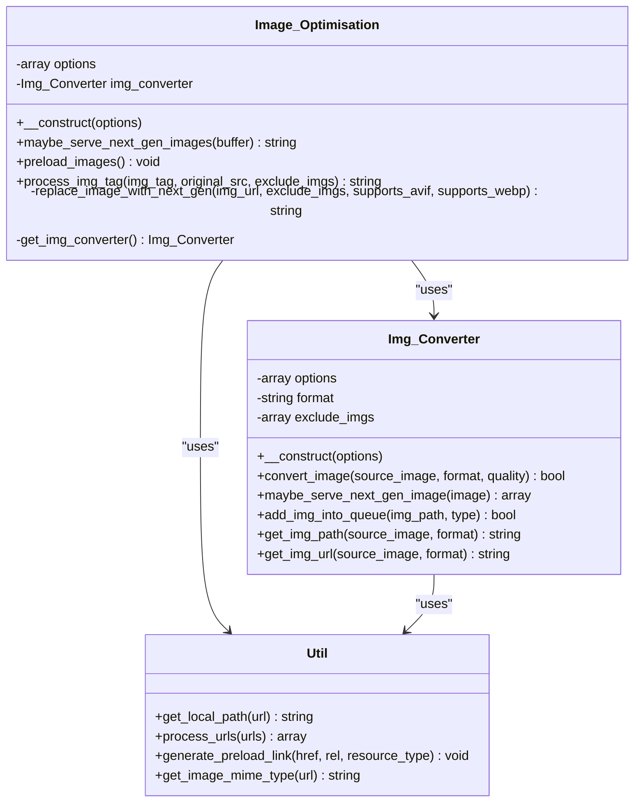
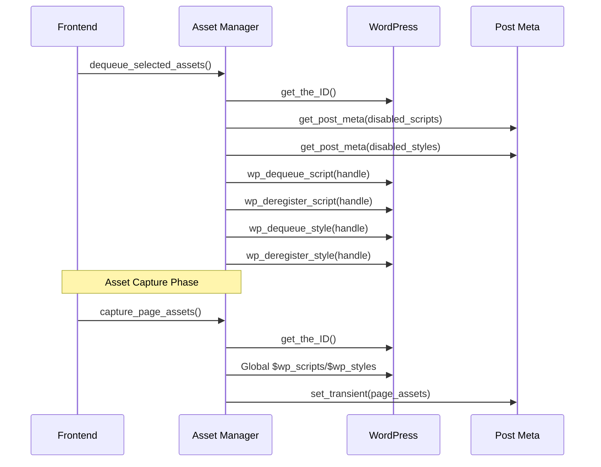
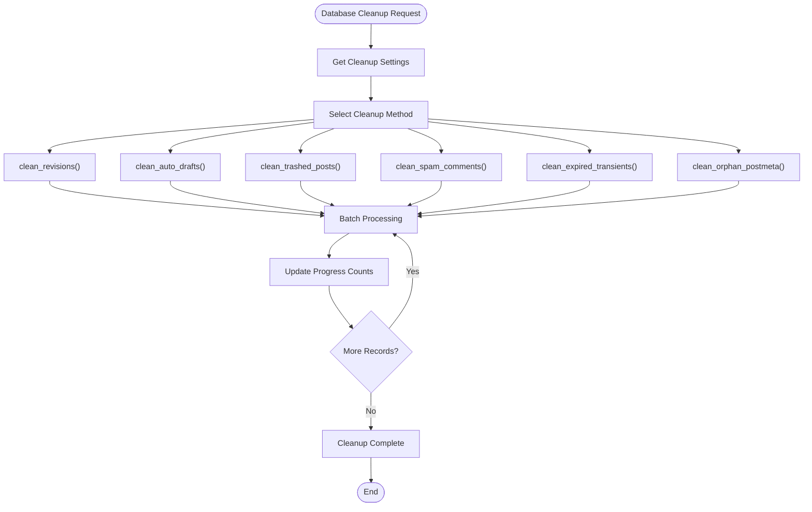
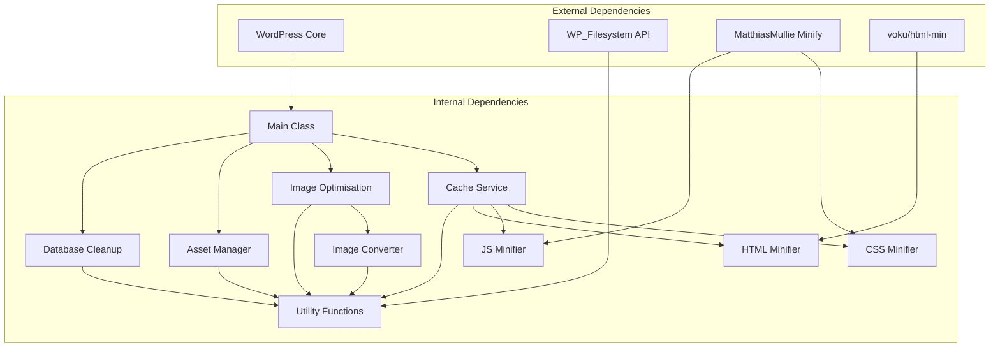

# Service Layer Architecture

<cite>
**Referenced Files in This Document**
- [performance-optimisation.php](file://performance-optimisation.php)
- [class-main.php](file://includes/class-main.php)
- [class-cache.php](file://includes/class-cache.php)
- [class-asset-manager.php](file://includes/class-asset-manager.php)
- [class-image-optimisation.php](file://includes/class-image-optimisation.php)
- [class-database-cleanup.php](file://includes/class-database-cleanup.php)
- [class-img-converter.php](file://includes/class-img-converter.php)
- [class-css.php](file://includes/minify/class-css.php)
- [class-js.php](file://includes/minify/class-js.php)
- [class-html.php](file://includes/minify/class-html.php)
- [class-util.php](file://includes/class-util.php)
</cite>

## Table of Contents
1. [Introduction](#introduction)
2. [Project Structure](#project-structure)
3. [Core Components](#core-components)
4. [Architecture Overview](#architecture-overview)
5. [Detailed Component Analysis](#detailed-component-analysis)
6. [Dependency Analysis](#dependency-analysis)
7. [Performance Considerations](#performance-considerations)
8. [Troubleshooting Guide](#troubleshooting-guide)
9. [Conclusion](#conclusion)

## Introduction

The Performance Optimisation plugin implements a comprehensive service layer architecture that manages multiple optimization capabilities through independent, modular services. Each service operates as a distinct module that can be instantiated and managed independently, coordinated by the central Main class. This architecture enables flexible service composition, clear separation of concerns, and extensible optimization strategies.

The service layer follows a pattern where individual optimization services are structured as independent modules that can be instantiated and managed by the Main class. The architecture emphasizes dependency injection, service registration, and inter-service communication through shared interfaces and common data structures.

## Project Structure

The plugin organizes its service layer into clearly defined modules within the `includes` directory, each representing a specific optimization capability:

**Diagram sources**
- [performance-optimisation.php:44](file://performance-optimisation.php#L44)
- [class-main.php:98-118](file://includes/class-main.php#L98-L118)

**Section sources**
- [performance-optimisation.php:18-44](file://performance-optimisation.php#L18-L44)
- [class-main.php:128-157](file://includes/class-main.php#L128-L157)

## Core Components

The service layer consists of five primary optimization services, each designed as an independent module:

### Cache Service
The Cache service manages dynamic static HTML generation, CSS combination, and comprehensive cache management. It provides sophisticated caching mechanisms with automatic invalidation and CDN integration capabilities.

### Image Optimisation Service
Handles advanced image optimization including WebP/AVIF conversion, lazy loading, preloading strategies, and next-generation format serving. Integrates with the Image Converter service for background processing.

### Asset Manager Service
Provides per-page/post control over script and style loading, enabling selective asset disabling through WordPress meta boxes with protection mechanisms for essential WordPress assets.

### Database Cleanup Service
Manages database optimization through batched operations for cleaning revisions, auto-drafts, trashed content, spam comments, expired transients, and orphaned post meta.

### Supporting Services
- **Image Converter**: Handles background image format conversion with quality control and format validation
- **Minification Services**: Separate CSS, JS, and HTML minifiers with caching capabilities
- **Utility Services**: Shared filesystem operations, URL processing, and resource management

**Section sources**
- [class-cache.php:32-120](file://includes/class-cache.php#L32-L120)
- [class-image-optimisation.php:27-57](file://includes/class-image-optimisation.php#L27-L57)
- [class-asset-manager.php:27-82](file://includes/class-asset-manager.php#L27-L82)
- [class-database-cleanup.php:30-82](file://includes/class-database-cleanup.php#L30-L82)

## Architecture Overview

The service layer architecture follows a centralized coordination pattern where the Main class serves as the orchestrator for all optimization services:

**Diagram sources**
- [class-main.php:98-118](file://includes/class-main.php#L98-L118)
- [class-main.php:167-244](file://includes/class-main.php#L167-L244)

The architecture implements several key patterns:

### Dependency Injection Pattern
Services receive their dependencies through constructors, enabling loose coupling and testability. The Main class injects configuration options and manages service lifecycles.

### Service Registration Pattern
Each service registers its own WordPress hooks and actions during initialization, creating a self-contained registration mechanism.

### Strategy Pattern Implementation
Different optimization approaches are implemented as interchangeable strategies, particularly evident in the image optimization service where multiple conversion formats can be selected.

**Section sources**
- [class-main.php:114-118](file://includes/class-main.php#L114-L118)
- [class-image-optimisation.php:53-57](file://includes/class-image-optimisation.php#L53-L57)

## Detailed Component Analysis

### Main Class Architecture

The Main class serves as the central coordinator and orchestrator for all service layer components:

**Diagram sources**
- [class-main.php:29-118](file://includes/class-main.php#L29-L118)
- [class-cache.php:32-120](file://includes/class-cache.php#L32-L120)
- [class-image-optimisation.php:27-57](file://includes/class-image-optimisation.php#L27-L57)
- [class-asset-manager.php:27-82](file://includes/class-asset-manager.php#L27-L82)
- [class-database-cleanup.php:30-82](file://includes/class-database-cleanup.php#L30-L82)

#### Service Lifecycle Management

The Main class implements comprehensive service lifecycle management:

**Initialization Phase:**
- Loads all required dependencies through the includes() method
- Initializes filesystem operations
- Creates service instances with appropriate configuration
- Registers WordPress hooks and actions

**Runtime Phase:**
- Coordinates service execution through WordPress hooks
- Manages service interactions and data flow
- Handles error conditions and fallback mechanisms
- Provides administrative interfaces for service control

**Shutdown Phase:**
- Clears caches and releases resources
- Finalizes background operations
- Cleans up temporary files and data structures

**Section sources**
- [class-main.php:98-118](file://includes/class-main.php#L98-L118)
- [class-main.php:128-157](file://includes/class-main.php#L128-L157)
- [class-main.php:167-244](file://includes/class-main.php#L167-L244)

### Cache Service Implementation

The Cache service provides comprehensive caching capabilities with sophisticated invalidation mechanisms:

**Diagram sources**
- [class-cache.php:260-310](file://includes/class-cache.php#L260-L310)
- [class-cache.php:391-396](file://includes/class-cache.php#L391-L396)

Key features include:
- Dynamic static HTML generation with automatic invalidation
- CSS combination and minification with CDN integration
- Comprehensive cache directory management with gzip compression
- Smart purging mechanisms for related content

**Section sources**
- [class-cache.php:260-381](file://includes/class-cache.php#L260-L381)
- [class-cache.php:470-483](file://includes/class-cache.php#L470-L483)

### Image Optimisation Service Architecture

The Image Optimisation service implements advanced image processing with multiple optimization strategies:

**Diagram sources**
- [class-image-optimisation.php:27-57](file://includes/class-image-optimisation.php#L27-L57)
- [class-img-converter.php:22-91](file://includes/class-img-converter.php#L22-L91)
- [class-util.php:29-80](file://includes/class-util.php#L29-L80)

The service implements multiple optimization strategies:
- Next-generation format conversion (WebP, AVIF)
- Lazy loading with performance optimizations
- Preloading strategies for critical images
- Background processing for image conversions
- Format detection and fallback mechanisms

**Section sources**
- [class-image-optimisation.php:95-290](file://includes/class-image-optimisation.php#L95-L290)
- [class-img-converter.php:104-310](file://includes/class-img-converter.php#L104-L310)

### Asset Manager Service

The Asset Manager provides granular control over asset loading with protection mechanisms:

**Diagram sources**
- [class-asset-manager.php:91-121](file://includes/class-asset-manager.php#L91-L121)
- [class-asset-manager.php:131-191](file://includes/class-asset-manager.php#L131-L191)

**Section sources**
- [class-asset-manager.php:91-191](file://includes/class-asset-manager.php#L91-L191)

### Database Cleanup Service

The Database Cleanup service implements efficient batched operations for database optimization:

**Diagram sources**
- [class-database-cleanup.php:529-546](file://includes/class-database-cleanup.php#L529-L546)
- [class-database-cleanup.php:44-82](file://includes/class-database-cleanup.php#L44-L82)

**Section sources**
- [class-database-cleanup.php:529-650](file://includes/class-database-cleanup.php#L529-L650)

## Dependency Analysis

The service layer exhibits clear dependency relationships with well-defined interfaces:

**Diagram sources**
- [class-main.php:128-144](file://includes/class-main.php#L128-L144)
- [class-cache.php:16-18](file://includes/class-cache.php#L16-L18)
- [class-css.php:16-18](file://includes/minify/class-css.php#L16-L18)
- [class-js.php:15-16](file://includes/minify/class-js.php#L15-L16)
- [class-html.php:16-19](file://includes/minify/class-html.php#L16-L19)

### Service Interactions

The services communicate through well-defined interfaces and shared data structures:

**Shared Interfaces:**
- Configuration options passed through constructor injection
- WordPress hook system for event coordination
- Filesystem abstraction for cross-platform compatibility
- Common utility functions for URL processing and resource management

**Data Flow Patterns:**
- Configuration-driven service behavior
- Event-driven service coordination
- Batch processing for resource-intensive operations
- Caching mechanisms for performance optimization

**Section sources**
- [class-main.php:128-157](file://includes/class-main.php#L128-L157)
- [class-util.php:38-60](file://includes/class-util.php#L38-L60)

## Performance Considerations

The service layer architecture incorporates several performance optimization strategies:

### Caching Strategies
- Static HTML caching with automatic invalidation
- Minified asset caching with version-based cache busting
- Image conversion caching with format-specific directories
- Database query result caching for statistics

### Asynchronous Processing
- Background image conversion through WordPress Action Scheduler
- Non-blocking filesystem operations
- Batch processing for database cleanup operations
- Deferred processing for resource-intensive tasks

### Resource Management
- Efficient filesystem operations with proper cleanup
- Memory-conscious image processing with size limits
- Optimized WordPress hook registration and deregistration
- Minimal overhead in production environments

### Scalability Features
- Modular service architecture allows selective service activation
- Configurable optimization levels based on performance requirements
- Extensible framework for adding new optimization strategies
- Graceful degradation when optimization features are disabled

## Troubleshooting Guide

### Common Issues and Solutions

**Cache-related Issues:**
- Verify cache directory permissions and existence
- Check filesystem API availability and configuration
- Monitor cache invalidation triggers and timing
- Review cache size limits and cleanup procedures

**Image Optimization Problems:**
- Validate GD library and Imagick extensions availability
- Check image format support and conversion limits
- Monitor background conversion queue status
- Verify CDN configuration and URL rewriting

**Service Coordination Issues:**
- Review WordPress hook registration order and conflicts
- Check service initialization sequence and dependencies
- Monitor background job scheduling and execution
- Validate configuration option processing and validation

**Database Cleanup Failures:**
- Verify database connection and permissions
- Check batch processing limits and timeouts
- Monitor transaction rollback scenarios
- Review error logging and recovery mechanisms

**Section sources**
- [class-cache.php:647-702](file://includes/class-cache.php#L647-L702)
- [class-img-converter.php:111-152](file://includes/class-img-converter.php#L111-L152)
- [class-database-cleanup.php:644-650](file://includes/class-database-cleanup.php#L644-L650)

## Conclusion

The Performance Optimisation plugin demonstrates a sophisticated service layer architecture that effectively separates concerns while maintaining tight coordination between optimization services. The Main class serves as a robust orchestrator that manages service lifecycle, dependency injection, and inter-service communication.

Key architectural strengths include:
- Clear separation of concerns with independent service modules
- Flexible dependency injection and service registration patterns
- Comprehensive error handling and fallback mechanisms
- Extensible framework supporting additional optimization strategies
- Performance-conscious design with caching and asynchronous processing

The service layer pattern implementation enables easy extension and modification of optimization capabilities while maintaining system stability and performance. The architecture provides a solid foundation for future enhancements and additional optimization features.