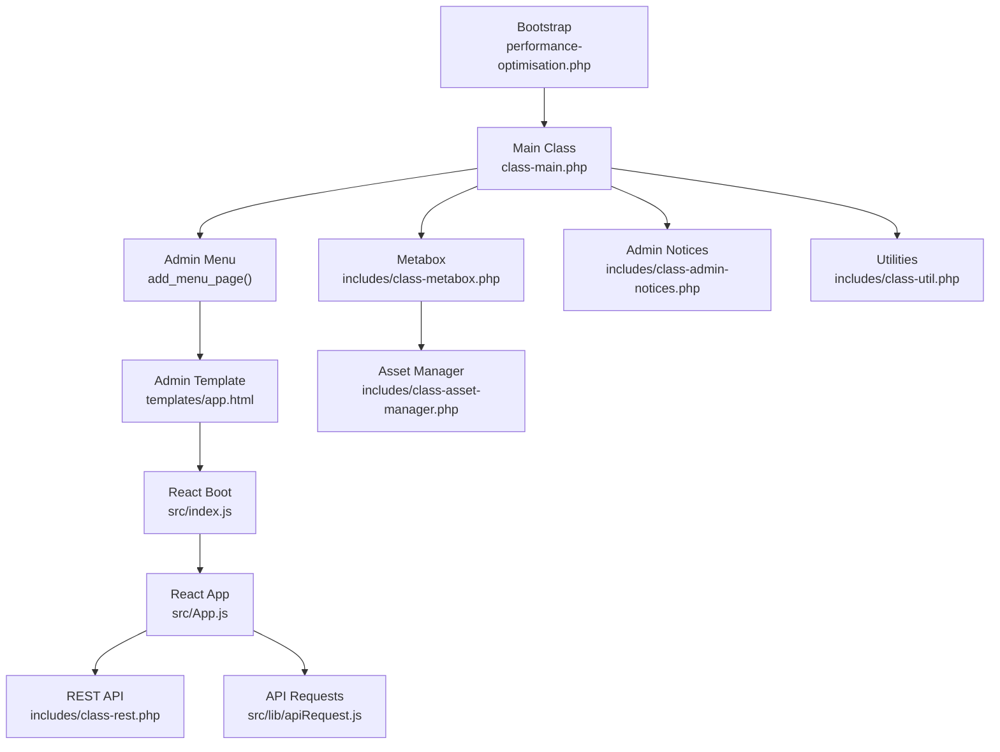
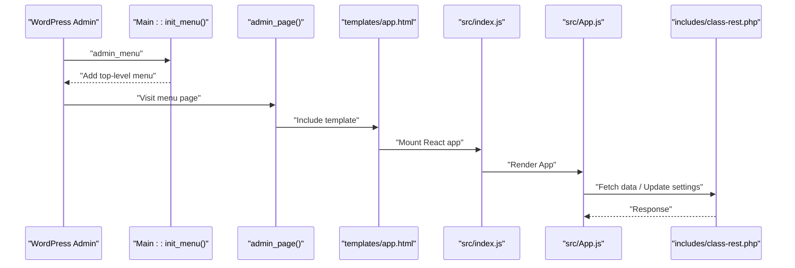
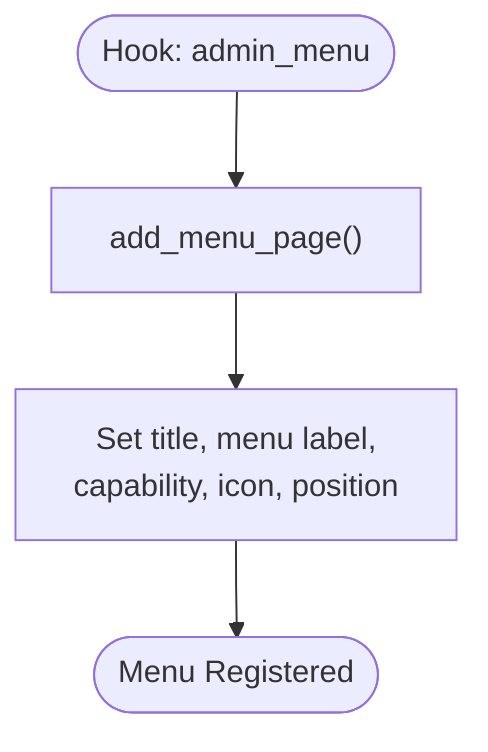
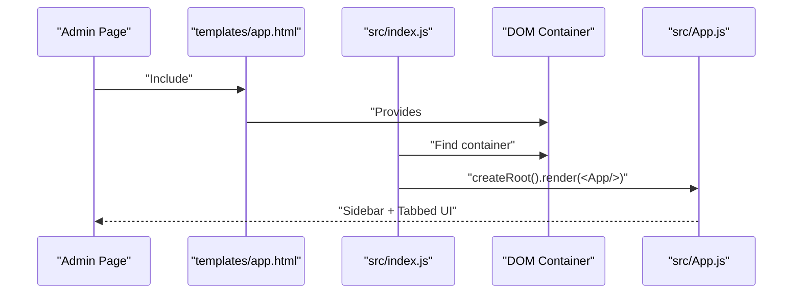
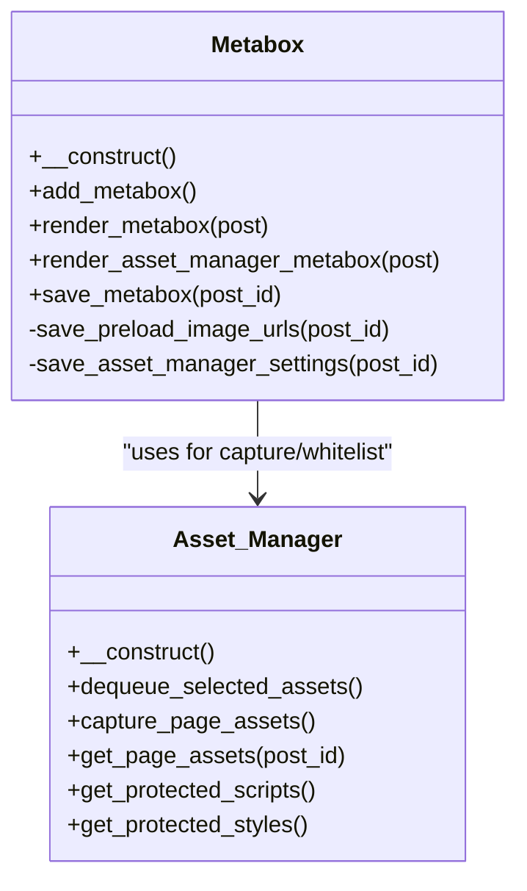
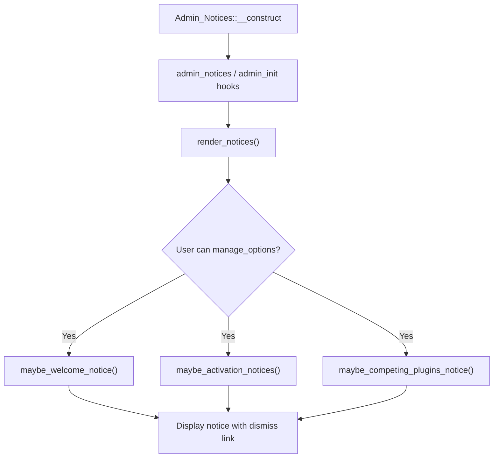
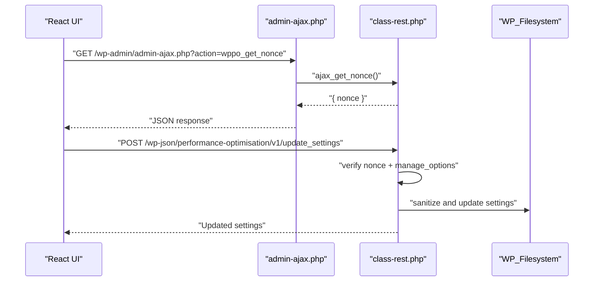
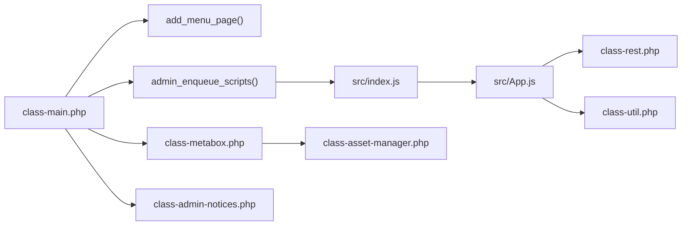

# Admin Interface and Metabox Integration

<cite>
**Referenced Files in This Document**
- [performance-optimisation.php](file://performance-optimisation.php)
- [class-main.php](file://includes/class-main.php)
- [class-admin-notices.php](file://includes/class-admin-notices.php)
- [class-metabox.php](file://includes/class-metabox.php)
- [class-asset-manager.php](file://includes/class-asset-manager.php)
- [class-rest.php](file://includes/class-rest.php)
- [class-util.php](file://includes/class-util.php)
- [app.html](file://templates/app.html)
- [index.js](file://src/index.js)
- [App.js](file://src/App.js)
- [apiRequest.js](file://src/lib/apiRequest.js)
- [readme.txt](file://readme.txt)
</cite>

## Table of Contents
1. [Introduction](#introduction)
2. [Project Structure](#project-structure)
3. [Core Components](#core-components)
4. [Architecture Overview](#architecture-overview)
5. [Detailed Component Analysis](#detailed-component-analysis)
6. [Dependency Analysis](#dependency-analysis)
7. [Performance Considerations](#performance-considerations)
8. [Troubleshooting Guide](#troubleshooting-guide)
9. [Conclusion](#conclusion)

## Introduction
This document explains the WordPress admin interface integration patterns used by the plugin, focusing on menu creation, admin page templating, React-based admin UI, metabox integration for performance controls, admin notices, and admin-ajax integration with security measures. It also covers how the plugin aligns with WordPress admin UI patterns such as screen options and contextual help.

## Project Structure
The plugin follows a layered architecture:
- Bootstrap and entry point: plugin bootstrap initializes the main class and registers activation/deactivation hooks.
- Admin menu and page: the main class registers a top-level menu and renders a React-powered admin page.
- React admin UI: a lightweight React app mounts into a dedicated container and communicates with the REST API.
- Metabox integration: custom metaboxes are added to post types to control per-page preload URLs and asset disabling.
- Admin notices: persistent notices for activation issues, cache conflicts, and onboarding.
- REST API: secure endpoints for settings updates, cache operations, image optimization, and diagnostics.
- Utilities: shared helpers for filesystem, URL processing, and admin UI integration.

**Diagram sources**
- [performance-optimisation.php:40-68](file://performance-optimisation.php#L40-L68)
- [class-main.php:321-343](file://includes/class-main.php#L321-L343)
- [app.html:1-6](file://templates/app.html#L1-L6)
- [index.js:1-12](file://src/index.js#L1-L12)
- [App.js:28-279](file://src/App.js#L28-L279)
- [class-rest.php:37-123](file://includes/class-rest.php#L37-L123)
- [apiRequest.js:1-54](file://src/lib/apiRequest.js#L1-L54)
- [class-metabox.php:37-74](file://includes/class-metabox.php#L37-L74)
- [class-asset-manager.php:76-82](file://includes/class-asset-manager.php#L76-L82)
- [class-admin-notices.php:43-46](file://includes/class-admin-notices.php#L43-L46)
- [class-util.php:67-80](file://includes/class-util.php#L67-L80)

**Section sources**
- [performance-optimisation.php:40-68](file://performance-optimisation.php#L40-L68)
- [class-main.php:321-343](file://includes/class-main.php#L321-L343)
- [app.html:1-6](file://templates/app.html#L1-L6)
- [index.js:1-12](file://src/index.js#L1-L12)
- [App.js:28-279](file://src/App.js#L28-L279)
- [class-rest.php:37-123](file://includes/class-rest.php#L37-L123)
- [apiRequest.js:1-54](file://src/lib/apiRequest.js#L1-L54)
- [class-metabox.php:37-74](file://includes/class-metabox.php#L37-L74)
- [class-asset-manager.php:76-82](file://includes/class-asset-manager.php#L76-L82)
- [class-admin-notices.php:43-46](file://includes/class-admin-notices.php#L43-L46)
- [class-util.php:67-80](file://includes/class-util.php#L67-L80)

## Core Components
- Admin menu and page: registers a top-level menu under the dashboard and renders a React app container.
- React admin UI: a sidebar-driven interface with tabs for dashboard, file optimization, preload, image optimization, database cleanup, object cache, and tools.
- Metabox integration: adds a “Preload Image URL” metabox to supported post types and an “Asset Manager” metabox to manage per-page script/style loading.
- Admin notices: onboarding, activation issues, and competing caching plugin warnings.
- REST API: secure endpoints for settings, cache, image optimization, database cleanup, and diagnostics.
- Utilities: filesystem initialization, URL normalization, and preload link generation.

**Section sources**
- [class-main.php:321-343](file://includes/class-main.php#L321-L343)
- [App.js:36-75](file://src/App.js#L36-L75)
- [class-metabox.php:49-74](file://includes/class-metabox.php#L49-L74)
- [class-admin-notices.php:85-93](file://includes/class-admin-notices.php#L85-L93)
- [class-rest.php:131-136](file://includes/class-rest.php#L131-L136)
- [class-util.php:67-80](file://includes/class-util.php#L67-L80)

## Architecture Overview
The admin UI is a hybrid: WordPress admin menu and page scaffold, with a React app mounted inside the admin page. The React app communicates with the plugin’s REST API for all data operations and settings updates. Security is enforced via WordPress capabilities and nonces.

**Diagram sources**
- [class-main.php:164-166](file://includes/class-main.php#L164-L166)
- [class-main.php:321-343](file://includes/class-main.php#L321-L343)
- [app.html:1-6](file://templates/app.html#L1-L6)
- [index.js:6-11](file://src/index.js#L6-L11)
- [App.js:176-275](file://src/App.js#L176-L275)
- [class-rest.php:37-123](file://includes/class-rest.php#L37-L123)

## Detailed Component Analysis

### Admin Menu Creation and Capability Requirements
- The plugin registers a top-level menu using a dedicated method that sets the page title, menu label, capability requirement, and icon.
- Capability requirement is set to a high-level administrative permission suitable for site-wide configuration.
- Icon uses a built-in WordPress dashicon for visual consistency.

**Diagram sources**
- [class-main.php:164-166](file://includes/class-main.php#L164-L166)
- [class-main.php:321-331](file://includes/class-main.php#L321-L331)

**Section sources**
- [class-main.php:321-331](file://includes/class-main.php#L321-L331)

### Admin Page Template System and React Integration
- The admin page method includes a simple wrapper template that defines a container for the React app.
- The React boot script locates the container and renders the App component.
- The App component manages routing among multiple feature tabs and injects theme colors for UI consistency.

**Diagram sources**
- [class-main.php:341-343](file://includes/class-main.php#L341-L343)
- [app.html:1-6](file://templates/app.html#L1-L6)
- [index.js:6-11](file://src/index.js#L6-L11)
- [App.js:28-279](file://src/App.js#L28-L279)

**Section sources**
- [class-main.php:341-343](file://includes/class-main.php#L341-L343)
- [app.html:1-6](file://templates/app.html#L1-L6)
- [index.js:6-11](file://src/index.js#L6-L11)
- [App.js:28-279](file://src/App.js#L28-L279)

### Metabox Integration for Performance Controls
- The plugin adds:
  - A “Preload Image URL” metabox to the side of supported post types.
  - An “Asset Manager” metabox to the normal area of all public post types.
- The Asset Manager displays captured scripts/styles and allows selective disabling with protection for core handles.
- Saving logic validates nonces, whitelists submitted handles against captured assets, and persists post meta.

**Diagram sources**
- [class-metabox.php:30-331](file://includes/class-metabox.php#L30-L331)
- [class-asset-manager.php:27-224](file://includes/class-asset-manager.php#L27-L224)

**Section sources**
- [class-metabox.php:49-74](file://includes/class-metabox.php#L49-L74)
- [class-metabox.php:82-94](file://includes/class-metabox.php#L82-L94)
- [class-metabox.php:105-236](file://includes/class-metabox.php#L105-L236)
- [class-metabox.php:244-329](file://includes/class-metabox.php#L244-L329)
- [class-asset-manager.php:76-121](file://includes/class-asset-manager.php#L76-L121)
- [class-asset-manager.php:131-191](file://includes/class-asset-manager.php#L131-L191)

### Admin Notices, Settings Pages, and Custom Admin Screens
- Admin notices:
  - Onboarding/welcome notice shown once after activation.
  - Activation notices for foreign drop-in presence, wp-config issues, and competing caching plugins.
  - Dismissible notices via nonce-protected query arguments.
- Settings pages:
  - The plugin’s admin page serves as the central settings screen, rendered by the React app.
  - REST endpoints support updating settings and importing/exporting configurations.

**Diagram sources**
- [class-admin-notices.php:43-46](file://includes/class-admin-notices.php#L43-L46)
- [class-admin-notices.php:85-93](file://includes/class-admin-notices.php#L85-L93)
- [class-admin-notices.php:100-116](file://includes/class-admin-notices.php#L100-L116)
- [class-admin-notices.php:123-168](file://includes/class-admin-notices.php#L123-L168)
- [class-admin-notices.php:175-201](file://includes/class-admin-notices.php#L175-L201)

**Section sources**
- [class-admin-notices.php:85-93](file://includes/class-admin-notices.php#L85-L93)
- [class-admin-notices.php:100-116](file://includes/class-admin-notices.php#L100-L116)
- [class-admin-notices.php:123-168](file://includes/class-admin-notices.php#L123-L168)
- [class-admin-notices.php:175-201](file://includes/class-admin-notices.php#L175-L201)
- [class-rest.php:184-200](file://includes/class-rest.php#L184-L200)

### Integration with WordPress Admin UI Patterns
- Screen options and contextual help:
  - The plugin leverages WordPress admin scaffolding and does not override screen options or help tabs.
  - The React app provides its own navigation and content areas within the admin page.
- Admin bar integration:
  - Lightweight admin bar script is enqueued when admin bar is visible, passing localized REST and AJAX URLs and a nonce.

**Section sources**
- [class-main.php:430-474](file://includes/class-main.php#L430-L474)
- [class-main.php:752-774](file://includes/class-main.php#L752-L774)

### Admin-Ajax Integration and Security Measures
- Nonce-based AJAX:
  - The plugin exposes an endpoint to refresh the REST nonce via AJAX for clients that may have stale nonces.
  - The REST controller validates both user capability and nonce validity for all endpoints.
- Security measures:
  - Input sanitization and recursive settings sanitization.
  - Path traversal protections for file operations and REST endpoints.
  - Protected script/style handles to prevent deregistration of core assets.
  - Foreground color extraction for UI theming without exposing sensitive data.

**Diagram sources**
- [class-main.php:240-240](file://includes/class-main.php#L240-L240)
- [class-rest.php:771-781](file://includes/class-rest.php#L771-L781)
- [class-rest.php:131-136](file://includes/class-rest.php#L131-L136)
- [class-rest.php:184-200](file://includes/class-rest.php#L184-L200)

**Section sources**
- [class-rest.php:131-136](file://includes/class-rest.php#L131-L136)
- [class-rest.php:771-781](file://includes/class-rest.php#L771-L781)
- [class-metabox.php:300-329](file://includes/class-metabox.php#L300-L329)
- [class-asset-manager.php:104-120](file://includes/class-asset-manager.php#L104-L120)

## Dependency Analysis
The plugin’s admin interface relies on:
- WordPress hooks for menu registration and script enqueueing.
- React app for UI composition and state management.
- REST API for data operations and settings persistence.
- Utilities for filesystem and URL handling.
- Metabox and Asset Manager for per-post controls.

**Diagram sources**
- [class-main.php:164-166](file://includes/class-main.php#L164-L166)
- [class-main.php:430-474](file://includes/class-main.php#L430-L474)
- [index.js:6-11](file://src/index.js#L6-L11)
- [App.js:28-279](file://src/App.js#L28-L279)
- [class-rest.php:37-123](file://includes/class-rest.php#L37-L123)
- [class-util.php:67-80](file://includes/class-util.php#L67-L80)
- [class-metabox.php:37-74](file://includes/class-metabox.php#L37-L74)
- [class-asset-manager.php:76-82](file://includes/class-asset-manager.php#L76-L82)
- [class-admin-notices.php:43-46](file://includes/class-admin-notices.php#L43-L46)

**Section sources**
- [class-main.php:164-166](file://includes/class-main.php#L164-L166)
- [class-main.php:430-474](file://includes/class-main.php#L430-L474)
- [index.js:6-11](file://src/index.js#L6-L11)
- [App.js:28-279](file://src/App.js#L28-L279)
- [class-rest.php:37-123](file://includes/class-rest.php#L37-L123)
- [class-util.php:67-80](file://includes/class-util.php#L67-L80)
- [class-metabox.php:37-74](file://includes/class-metabox.php#L37-L74)
- [class-asset-manager.php:76-82](file://includes/class-asset-manager.php#L76-L82)
- [class-admin-notices.php:43-46](file://includes/class-admin-notices.php#L43-L46)

## Performance Considerations
- React app is conditionally enqueued only on the plugin’s admin page, minimizing overhead elsewhere.
- REST API responses are cached via transients for certain data (e.g., cache size, JS/CSS counts) to reduce repeated computation.
- Asset Manager captures and stores per-page assets transiently to avoid repeated scanning.
- Minification and other runtime optimizations are gated behind user-configured options to avoid unnecessary processing.

[No sources needed since this section provides general guidance]

## Troubleshooting Guide
Common issues and resolutions:
- Admin notices:
  - Foreign drop-in present: indicates another plugin or host manages the advanced cache drop-in; the plugin will not overwrite it.
  - wp-config issues: permission or write failures when attempting to update configuration; resolve file permissions or add the constant manually.
  - Competing caching plugins: running multiple full-page cache solutions can conflict; use only one.
- Settings updates:
  - If enabling server-side rules fails, the plugin rolls back the setting and shows an admin notice; check file permissions and retry.
- Metabox and Asset Manager:
  - Disabled handles are whitelisted against captured assets; ensure you visit the frontend while logged out to capture assets before managing them in the metabox.

**Section sources**
- [class-admin-notices.php:133-147](file://includes/class-admin-notices.php#L133-L147)
- [class-admin-notices.php:175-201](file://includes/class-admin-notices.php#L175-L201)
- [class-main.php:250-277](file://includes/class-main.php#L250-L277)
- [class-metabox.php:118-139](file://includes/class-metabox.php#L118-L139)
- [class-asset-manager.php:178-191](file://includes/class-asset-manager.php#L178-L191)

## Conclusion
The plugin integrates tightly with WordPress admin by registering a top-level menu, rendering a React-based UI, and exposing secure REST endpoints. Metaboxes provide granular controls for per-post performance tuning, while admin notices guide users through activation and configuration safely. The architecture balances usability, security, and performance, aligning with WordPress admin UI patterns and standards.