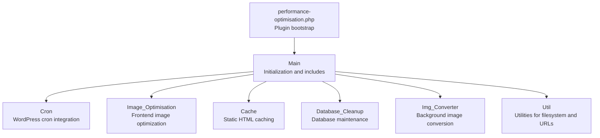
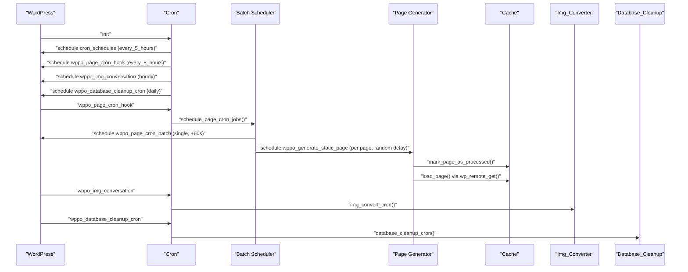
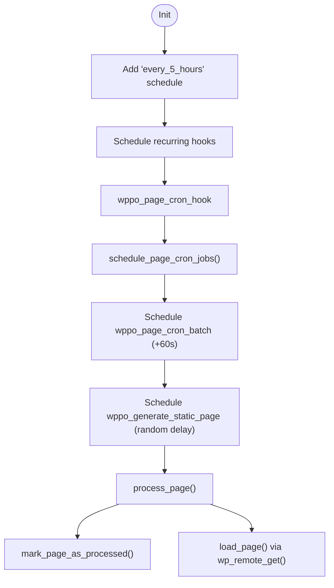
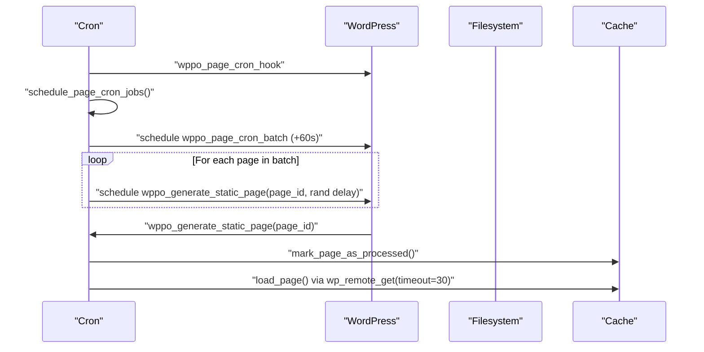
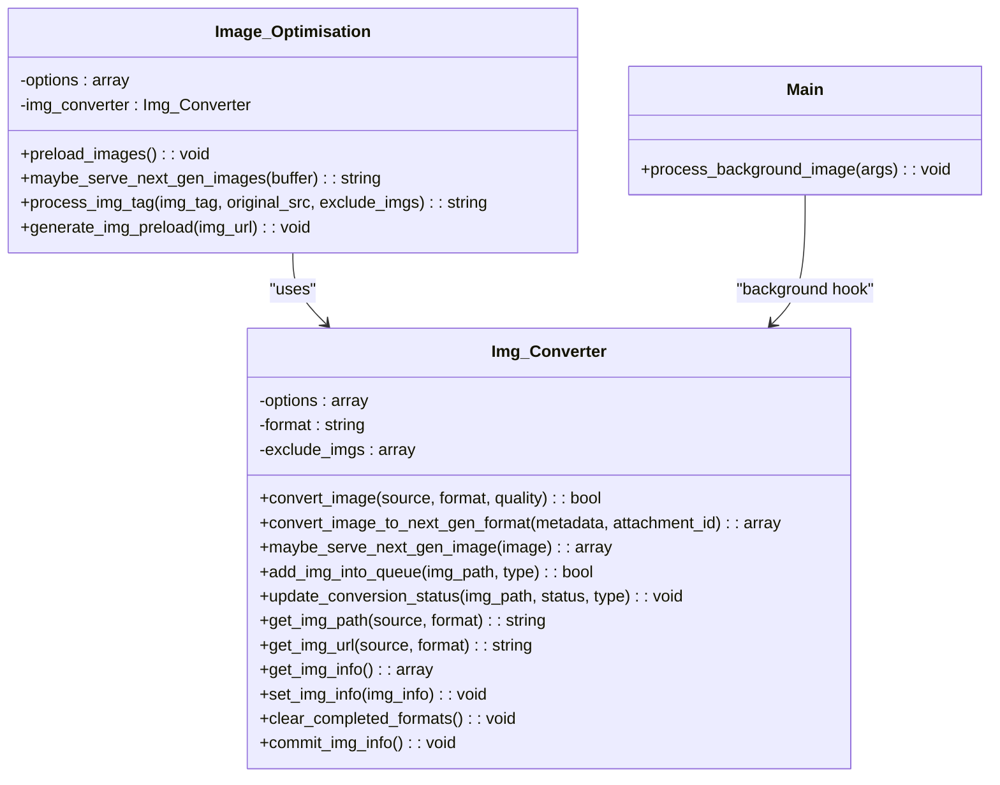
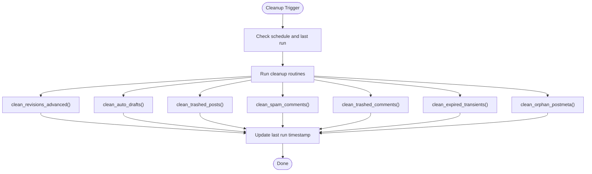
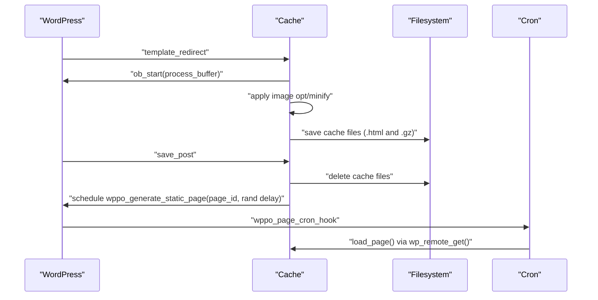
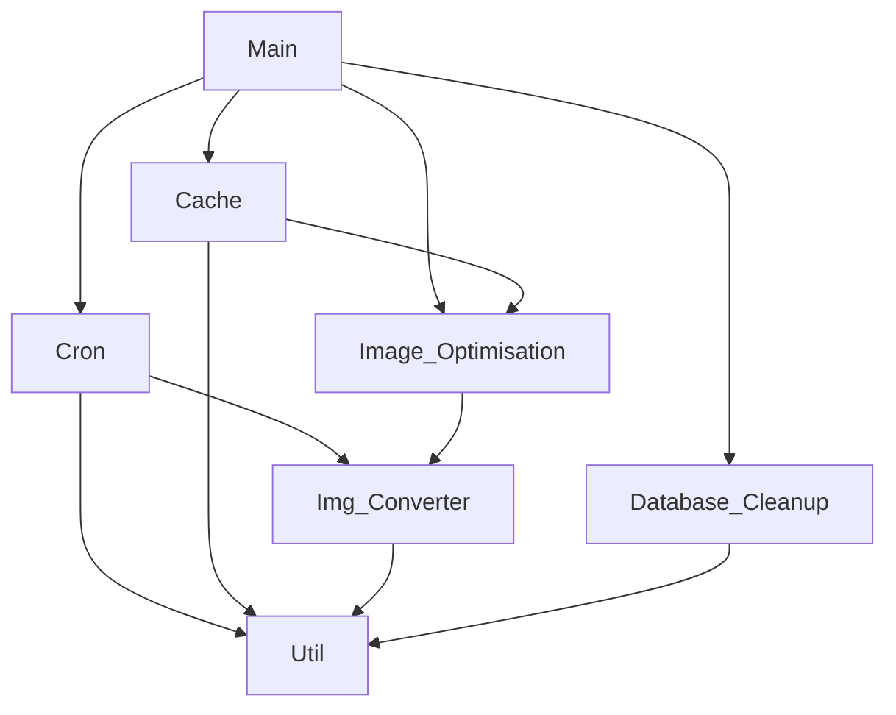

# Cron Job System and Background Processing

<cite>
**Referenced Files in This Document**
- [performance-optimisation.php](file://performance-optimisation.php)
- [class-main.php](file://includes/class-main.php)
- [class-cron.php](file://includes/class-cron.php)
- [class-database-cleanup.php](file://includes/class-database-cleanup.php)
- [class-image-optimisation.php](file://includes/class-image-optimisation.php)
- [class-img-converter.php](file://includes/class-img-converter.php)
- [class-cache.php](file://includes/class-cache.php)
- [class-util.php](file://includes/class-util.php)
- [class-core-tweaks.php](file://includes/class-core-tweaks.php)
</cite>

## Table of Contents
1. [Introduction](#introduction)
2. [Project Structure](#project-structure)
3. [Core Components](#core-components)
4. [Architecture Overview](#architecture-overview)
5. [Detailed Component Analysis](#detailed-component-analysis)
6. [Dependency Analysis](#dependency-analysis)
7. [Performance Considerations](#performance-considerations)
8. [Troubleshooting Guide](#troubleshooting-guide)
9. [Conclusion](#conclusion)

## Introduction
This document explains the plugin's cron job system and background processing patterns, focusing on how WordPress cron integrates with custom scheduling, how background image optimization is orchestrated, and how database cleanup and cache maintenance operate. It covers scheduled event registration, custom cron schedules, background task execution, and performance considerations for memory management and timeouts.

## Project Structure
The plugin initializes the main controller which loads supporting subsystems including cron, image optimization, caching, and database cleanup. The cron system registers WordPress hooks, schedules recurring and single events, and orchestrates background tasks.

**Diagram sources**
- [performance-optimisation.php:40-44](file://performance-optimisation.php#L40-L44)
- [class-main.php:128-154](file://includes/class-main.php#L128-L154)
- [class-main.php:227-228](file://includes/class-main.php#L227-L228)

**Section sources**
- [performance-optimisation.php:40-44](file://performance-optimisation.php#L40-L44)
- [class-main.php:128-154](file://includes/class-main.php#L128-L154)

## Core Components
- Cron orchestration: Schedules recurring tasks (static page generation, image conversion, database cleanup) and manages per-page batch processing.
- Image optimization: Converts images to modern formats (WebP/AVIF) and serves them conditionally based on browser support.
- Database cleanup: Automated cleanup of revisions, drafts, trashed posts/comments, spam, expired transients, and orphaned postmeta.
- Cache management: Generates and serves static HTML, with gzip compression and smart purging on content changes.
- Utilities: Filesystem operations, URL normalization, preload link generation, and image MIME detection.

**Section sources**
- [class-cron.php:42-52](file://includes/class-cron.php#L42-L52)
- [class-image-optimisation.php:27-57](file://includes/class-image-optimisation.php#L27-L57)
- [class-database-cleanup.php:30-30](file://includes/class-database-cleanup.php#L30-L30)
- [class-cache.php:32-120](file://includes/class-cache.php#L32-L120)
- [class-util.php:29-80](file://includes/class-util.php#L29-L80)

## Architecture Overview
The plugin integrates with WordPress cron via custom hooks and schedules. It also uses WordPress hooks to trigger background processing for image conversion and static page generation.

**Diagram sources**
- [class-cron.php:79-91](file://includes/class-cron.php#L79-L91)
- [class-cron.php:98-184](file://includes/class-cron.php#L98-L184)
- [class-cron.php:222-227](file://includes/class-cron.php#L222-L227)
- [class-cron.php:321-360](file://includes/class-cron.php#L321-L360)
- [class-cron.php:369-395](file://includes/class-cron.php#L369-L395)

## Detailed Component Analysis

### WordPress Cron Integration and Scheduling
- Custom schedule: Adds a custom "every_5_hours" interval via the cron_schedules filter.
- Recurring tasks:
  - Static page generation: Schedules wppo_page_cron_hook every 5 hours.
  - Image conversion: Schedules wppo_img_conversation hourly.
  - Database cleanup: Schedules wppo_database_cleanup_cron daily.
- Event lifecycle:
  - wppo_page_cron_hook triggers batch scheduling.
  - wppo_page_cron_batch schedules subsequent batches.
  - wppo_generate_static_page processes individual pages with randomized delays to distribute load.

**Diagram sources**
- [class-cron.php:64-70](file://includes/class-cron.php#L64-L70)
- [class-cron.php:79-91](file://includes/class-cron.php#L79-L91)
- [class-cron.php:98-184](file://includes/class-cron.php#L98-L184)
- [class-cron.php:222-227](file://includes/class-cron.php#L222-L227)

**Section sources**
- [class-cron.php:64-70](file://includes/class-cron.php#L64-L70)
- [class-cron.php:79-91](file://includes/class-cron.php#L79-L91)
- [class-cron.php:98-184](file://includes/class-cron.php#L98-L184)
- [class-cron.php:222-227](file://includes/class-cron.php#L222-L227)

### Static Page Generation Workflow
- Batch processing:
  - Reads a persisted offset to continue from where it left off.
  - Queries published public posts/pages in batches of 200 to avoid memory issues.
  - Applies exclusion rules based on configured patterns.
  - Schedules a single event per page with a random delay up to 1800 seconds.
  - Updates the offset and schedules the next batch if needed.
- Per-page processing:
  - Marks the page as processed by deleting cached HTML and gzip files.
  - Loads the page via wp_remote_get with a 30-second timeout to warm caches.

**Diagram sources**
- [class-cron.php:113-184](file://includes/class-cron.php#L113-L184)
- [class-cron.php:222-227](file://includes/class-cron.php#L222-L227)
- [class-cron.php:274-279](file://includes/class-cron.php#L274-L279)
- [class-cron.php:289-311](file://includes/class-cron.php#L289-L311)

**Section sources**
- [class-cron.php:113-184](file://includes/class-cron.php#L113-L184)
- [class-cron.php:222-227](file://includes/class-cron.php#L222-L227)
- [class-cron.php:274-279](file://includes/class-cron.php#L274-L279)
- [class-cron.php:289-311](file://includes/class-cron.php#L289-L311)

### Background Image Optimization
- Queue management:
  - Tracks pending, completed, and failed conversions in an option-backed state.
  - Uses atomic updates to merge concurrent writes safely.
  - Adds images to the queue when detected in filters or when attachments are processed.
- Conversion pipeline:
  - Validates image type and dimensions.
  - Supports WebP and AVIF conversion with quality controls.
  - Uses GD or Imagick depending on format and availability.
  - Writes converted files under a dedicated cache directory and updates status.
- Background execution:
  - The main class registers a hook to process background image conversions via Action Scheduler.
  - The cron system triggers periodic image conversion batches based on settings.

**Diagram sources**
- [class-img-converter.php:22-91](file://includes/class-img-converter.php#L22-L91)
- [class-image-optimisation.php:27-57](file://includes/class-image-optimisation.php#L27-L57)
- [class-main.php:297-311](file://includes/class-main.php#L297-L311)

**Section sources**
- [class-img-converter.php:104-310](file://includes/class-img-converter.php#L104-L310)
- [class-img-converter.php:476-524](file://includes/class-img-converter.php#L476-L524)
- [class-img-converter.php:533-574](file://includes/class-img-converter.php#L533-L574)
- [class-img-converter.php:632-659](file://includes/class-img-converter.php#L632-L659)
- [class-img-converter.php:711-760](file://includes/class-img-converter.php#L711-L760)
- [class-image-optimisation.php:27-57](file://includes/class-image-optimisation.php#L27-L57)
- [class-main.php:297-311](file://includes/class-main.php#L297-L311)

### Database Cleanup Operations
- Automated cleanup runs based on a configurable schedule (daily, weekly, monthly).
- Executes multiple cleanup routines in sequence:
  - Post revisions (with advanced pruning options).
  - Auto drafts.
  - Trashed posts.
  - Spam and trashed comments.
  - Expired transients.
  - Orphaned postmeta.
- Each routine operates in batches to avoid memory pressure and returns counts or WP_Error instances.

**Diagram sources**
- [class-database-cleanup.php:561-586](file://includes/class-database-cleanup.php#L561-L586)
- [class-database-cleanup.php:38-82](file://includes/class-database-cleanup.php#L38-L82)
- [class-database-cleanup.php:194-238](file://includes/class-database-cleanup.php#L194-L238)
- [class-database-cleanup.php:248-292](file://includes/class-database-cleanup.php#L248-L292)
- [class-database-cleanup.php:299-344](file://includes/class-database-cleanup.php#L299-L344)
- [class-database-cleanup.php:352-396](file://includes/class-database-cleanup.php#L352-L396)
- [class-database-cleanup.php:408-466](file://includes/class-database-cleanup.php#L408-L466)
- [class-database-cleanup.php:476-521](file://includes/class-database-cleanup.php#L476-L521)

**Section sources**
- [class-database-cleanup.php:561-586](file://includes/class-database-cleanup.php#L561-L586)
- [class-database-cleanup.php:38-82](file://includes/class-database-cleanup.php#L38-L82)
- [class-database-cleanup.php:194-238](file://includes/class-database-cleanup.php#L194-L238)
- [class-database-cleanup.php:248-292](file://includes/class-database-cleanup.php#L248-L292)
- [class-database-cleanup.php:299-344](file://includes/class-database-cleanup.php#L299-L344)
- [class-database-cleanup.php:352-396](file://includes/class-database-cleanup.php#L352-L396)
- [class-database-cleanup.php:408-466](file://includes/class-database-cleanup.php#L408-L466)
- [class-database-cleanup.php:476-521](file://includes/class-database-cleanup.php#L476-L521)

### Cache Maintenance Tasks
- Dynamic static HTML generation:
  - Starts output buffering at template_redirect.
  - Applies image optimization and minification passes when enabled.
  - Saves both uncompressed and gzip-compressed cache files.
- Smart purging:
  - On post saves, invalidates cache for the page and related archives.
  - Schedules a single background regeneration event with a small random delay to avoid thundering herd.
- Cache clearing:
  - Supports clearing per-page or entire cache with filesystem operations.

**Diagram sources**
- [class-cache.php:260-310](file://includes/class-cache.php#L260-L310)
- [class-cache.php:470-483](file://includes/class-cache.php#L470-L483)
- [class-cache.php:546-598](file://includes/class-cache.php#L546-L598)
- [class-cron.php:274-279](file://includes/class-cron.php#L274-L279)

**Section sources**
- [class-cache.php:260-310](file://includes/class-cache.php#L260-L310)
- [class-cache.php:470-483](file://includes/class-cache.php#L470-L483)
- [class-cache.php:546-598](file://includes/class-cache.php#L546-L598)
- [class-cron.php:274-279](file://includes/class-cron.php#L274-L279)

### Action Scheduler Integration
- The main class registers a hook for background image processing:
  - Hook: wppo_convert_image_background
  - Handler: process_background_image(args)
- This allows external systems (e.g., Action Scheduler) to enqueue conversion jobs with arguments specifying source path and format.

**Section sources**
- [class-main.php:230-232](file://includes/class-main.php#L230-L232)
- [class-main.php:297-311](file://includes/class-main.php#L297-L311)

### Multisite and Network-Wide Operations
- The cron system relies on WordPress's built-in scheduling which operates per-site.
- There is no explicit multisite-specific handling in the provided files; network-wide operations would require additional multisite-aware logic not present in the analyzed code.

**Section sources**
- [class-cron.php:79-91](file://includes/class-cron.php#L79-L91)

## Dependency Analysis
The following diagram shows key dependencies among major components:

**Diagram sources**
- [class-main.php:128-154](file://includes/class-main.php#L128-L154)
- [class-cron.php:321-360](file://includes/class-cron.php#L321-L360)
- [class-image-optimisation.php:217-223](file://includes/class-image-optimisation.php#L217-L223)
- [class-cache.php:288-292](file://includes/class-cache.php#L288-L292)

**Section sources**
- [class-main.php:128-154](file://includes/class-main.php#L128-L154)
- [class-cron.php:321-360](file://includes/class-cron.php#L321-L360)
- [class-image-optimisation.php:217-223](file://includes/class-image-optimisation.php#L217-L223)
- [class-cache.php:288-292](file://includes/class-cache.php#L288-L292)

## Performance Considerations
- Batched processing:
  - Static page generation processes 200 posts per batch to avoid memory exhaustion.
  - Database cleanup routines operate in batches (e.g., 1000 posts at a time) to prevent timeouts.
- Randomized delays:
  - Per-page static generation uses a random delay up to 1800 seconds to distribute load.
- Resource limits:
  - Image conversion validates file size and dimensions to mitigate memory bombs and oversized images.
- Timeout handling:
  - Static page loading uses a 30-second timeout for wp_remote_get.
- Atomic state updates:
  - Image conversion status uses atomic-like updates to prevent race conditions and ensure consistency.

**Section sources**
- [class-cron.php:120-129](file://includes/class-cron.php#L120-L129)
- [class-cron.php:172-174](file://includes/class-cron.php#L172-L174)
- [class-database-cleanup.php:46-79](file://includes/class-database-cleanup.php#L46-L79)
- [class-database-cleanup.php:198-235](file://includes/class-database-cleanup.php#L198-L235)
- [class-img-converter.php:122-128](file://includes/class-img-converter.php#L122-L128)
- [class-img-converter.php:140-152](file://includes/class-img-converter.php#L140-L152)
- [class-cron.php:277](file://includes/class-cron.php#L277)

## Troubleshooting Guide
- Cron not running:
  - Verify cron_schedules filter is active and custom schedule is registered.
  - Ensure scheduled hooks are registered during init.
- Static page generation stalls:
  - Check batch offset persistence and pagination logic.
  - Confirm exclusion patterns are not overly broad.
- Image conversion failures:
  - Review file size and dimension checks.
  - Verify required extensions (GD/Imagick) and format support.
  - Inspect conversion status updates and logs.
- Database cleanup errors:
  - Check for SQL errors and return false conditions.
  - Validate batch sizes and transaction boundaries.
- Cache issues:
  - Confirm filesystem initialization and directory permissions.
  - Verify CDN URL rewriting and asset path resolution.

**Section sources**
- [class-cron.php:64-70](file://includes/class-cron.php#L64-L70)
- [class-cron.php:79-91](file://includes/class-cron.php#L79-L91)
- [class-img-converter.php:111-114](file://includes/class-img-converter.php#L111-L114)
- [class-img-converter.php:122-128](file://includes/class-img-converter.php#L122-L128)
- [class-database-cleanup.php:46-79](file://includes/class-database-cleanup.php#L46-L79)
- [class-cache.php:118](file://includes/class-cache.php#L118)

## Conclusion
The plugin’s cron system integrates tightly with WordPress cron to schedule recurring maintenance tasks and batch-process static page generation. Background image optimization is orchestrated through queue management and conversion utilities, with Action Scheduler support for external background processing. Database cleanup and cache maintenance are designed for reliability with batching and atomic updates. Performance is addressed through batching, randomized delays, resource limits, and timeout handling.