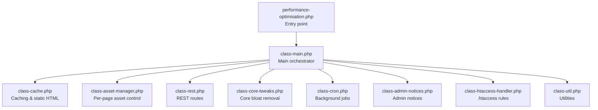
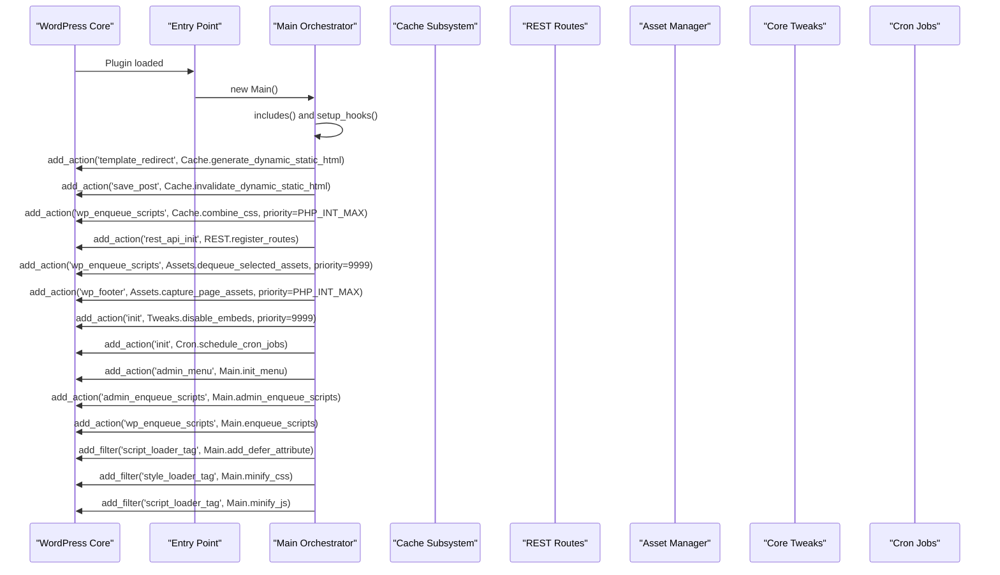
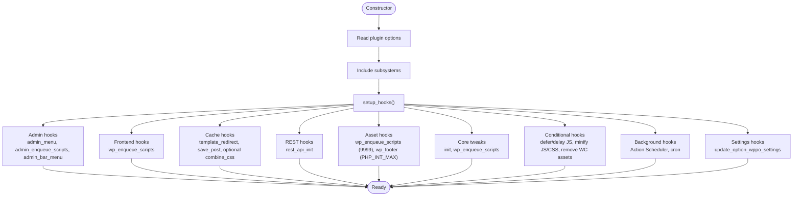
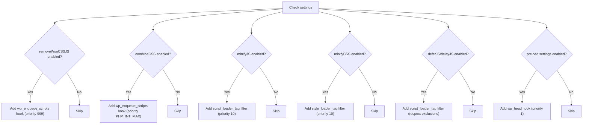
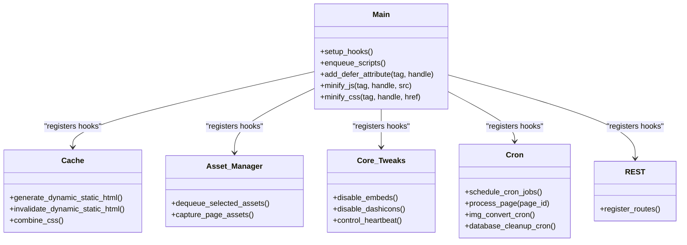
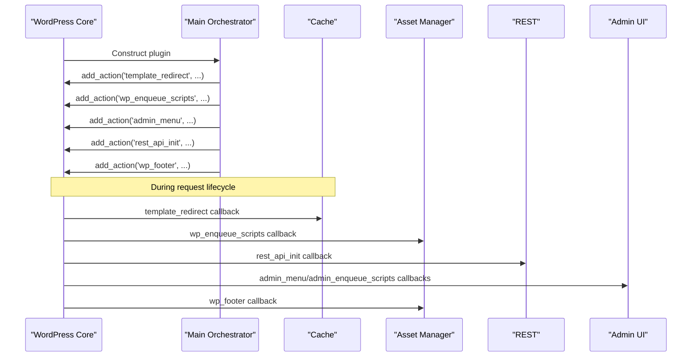
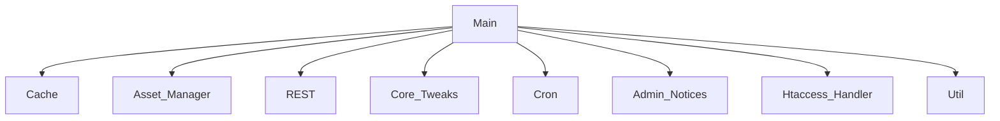

# Hook System and Priority Management

<cite>
**Referenced Files in This Document**
- [performance-optimisation.php](file://performance-optimisation.php)
- [class-main.php](file://includes/class-main.php)
- [class-cache.php](file://includes/class-cache.php)
- [class-asset-manager.php](file://includes/class-asset-manager.php)
- [class-rest.php](file://includes/class-rest.php)
- [class-core-tweaks.php](file://includes/class-core-tweaks.php)
- [class-cron.php](file://includes/class-cron.php)
- [class-admin-notices.php](file://includes/class-admin-notices.php)
- [class-htaccess-handler.php](file://includes/class-htaccess-handler.php)
- [class-util.php](file://includes/class-util.php)
</cite>

## Table of Contents
1. [Introduction](#introduction)
2. [Project Structure](#project-structure)
3. [Core Components](#core-components)
4. [Architecture Overview](#architecture-overview)
5. [Detailed Component Analysis](#detailed-component-analysis)
6. [Dependency Analysis](#dependency-analysis)
7. [Performance Considerations](#performance-considerations)
8. [Troubleshooting Guide](#troubleshooting-guide)
9. [Conclusion](#conclusion)

## Introduction
This document explains the WordPress hook system implementation used by the plugin, focusing on how the main orchestrator class registers actions and filters across the WordPress lifecycle. It covers hook registration patterns, priorities, timing considerations, conditional registration based on settings, and how hooks integrate with WordPress core phases such as template_redirect, wp_enqueue_scripts, and admin hooks. It also documents priority management strategies for optimization phases, conflict resolution, cleanup, and best practices for hook-based optimization.

## Project Structure
The plugin’s main entry point initializes the core class, which sets up the hook registry and delegates to specialized subsystems for caching, asset management, REST APIs, core tweaks, cron jobs, and admin UI.

**Diagram sources**
- [performance-optimisation.php:40-44](file://performance-optimisation.php#L40-L44)
- [class-main.php:111-118](file://includes/class-main.php#L111-L118)
- [class-main.php:128-154](file://includes/class-main.php#L128-L154)

**Section sources**
- [performance-optimisation.php:17-44](file://performance-optimisation.php#L17-L44)
- [class-main.php:98-118](file://includes/class-main.php#L98-L118)

## Core Components
- Main orchestrator: centralizes hook registration, reads settings, instantiates subsystems, and wires lifecycle hooks.
- Cache: generates and invalidates dynamic static HTML, combines CSS, and integrates with advanced-cache drop-in.
- Asset Manager: captures and dequeues per-page assets based on post meta, with strict protection lists.
- REST: registers REST endpoints for cache operations, settings updates, image optimization, diagnostics, and more.
- Core Tweaks: disables WordPress bloat (emojis, embeds, dashicons) and controls heartbeat via init and enqueue hooks.
- Cron: schedules periodic tasks for static page generation, image conversion, and database cleanup.
- Admin Notices: renders notices and handles dismissal for activation and cache conflicts.
- Htaccess Handler: toggles server-side compression and caching rules via .htaccess markers.
- Utilities: provides filesystem helpers, URL/path processing, preload link generation, and stats.

**Section sources**
- [class-main.php:164-241](file://includes/class-main.php#L164-L241)
- [class-cache.php:32-120](file://includes/class-cache.php#L32-L120)
- [class-asset-manager.php:27-82](file://includes/class-asset-manager.php#L27-L82)
- [class-rest.php:26-43](file://includes/class-rest.php#L26-L43)
- [class-core-tweaks.php:18-56](file://includes/class-core-tweaks.php#L18-L56)
- [class-cron.php:27-52](file://includes/class-cron.php#L27-L52)
- [class-admin-notices.php:20-46](file://includes/class-admin-notices.php#L20-L46)
- [class-htaccess-handler.php:25-74](file://includes/class-htaccess-handler.php#L25-L74)
- [class-util.php:29-80](file://includes/class-util.php#L29-L80)

## Architecture Overview
The main orchestrator registers hooks early in the plugin lifecycle and coordinates subsystems that operate at different WordPress lifecycle stages. The diagram below maps the primary hook registrations and their targets.

**Diagram sources**
- [class-main.php:164-241](file://includes/class-main.php#L164-L241)
- [class-cache.php:127-129](file://includes/class-cache.php#L127-L129)
- [class-asset-manager.php:76-82](file://includes/class-asset-manager.php#L76-L82)
- [class-core-tweaks.php:39-40](file://includes/class-core-tweaks.php#L39-L40)
- [class-cron.php:42-52](file://includes/class-cron.php#L42-L52)
- [class-rest.php:37-43](file://includes/class-rest.php#L37-L43)

## Detailed Component Analysis

### Main Orchestrator Hook Registration Pattern
- Admin UI hooks: admin_menu, admin_enqueue_scripts, wp_enqueue_scripts, admin_bar_menu.
- Caching hooks: template_redirect for dynamic static HTML generation/invalidation, optional CSS combination at high priority.
- REST API: rest_api_init registers endpoints.
- Asset control: per-page asset dequeue and capture at very late priorities.
- Core tweaks: init and wp_enqueue_scripts hooks for disabling bloat.
- Conditional hooks: defer/delay JS, minify JS/CSS, remove WooCommerce assets based on settings.
- Background processing: Action Scheduler callbacks and cron scheduling.
- Settings update: update_option_wppo_settings triggers cache clear and .htaccess update.

**Diagram sources**
- [class-main.php:98-118](file://includes/class-main.php#L98-L118)
- [class-main.php:164-241](file://includes/class-main.php#L164-L241)

**Section sources**
- [class-main.php:164-241](file://includes/class-main.php#L164-L241)
- [class-main.php:250-277](file://includes/class-main.php#L250-L277)

### Conditional Hook Registration Based on Settings
- Remove WooCommerce CSS/JS: executed at high priority on wp_enqueue_scripts when enabled.
- Combine CSS: executed at PHP_INT_MAX on wp_enqueue_scripts when enabled.
- Minify JS/CSS: registered as filters when enabled; exclusions are merged from settings.
- Defer/Delay JS: applied via script_loader_tag filter with exclusions from settings.
- Preload/Prefetch/Preconnect: added via wp_head when enabled and configured.

**Diagram sources**
- [class-main.php:171-180](file://includes/class-main.php#L171-L180)
- [class-main.php:185-202](file://includes/class-main.php#L185-L202)
- [class-main.php:204-222](file://includes/class-main.php#L204-L222)
- [class-main.php:224](file://includes/class-main.php#L224)

**Section sources**
- [class-main.php:171-222](file://includes/class-main.php#L171-L222)

### Priority Management Strategy
- Late execution for asset dequeue and capture to ensure other plugins enqueue first.
- Highest priority for CSS combination to merge styles last.
- Early execution for core tweaks (e.g., disable embeds at priority 9999) to override later additions.
- Early execution for preload links (priority 1) to influence early resource loading.
- Very late execution for asset capture to record all enqueued assets.

**Diagram sources**
- [class-main.php:164-241](file://includes/class-main.php#L164-L241)
- [class-cache.php:127-129](file://includes/class-cache.php#L127-L129)
- [class-asset-manager.php:76-82](file://includes/class-asset-manager.php#L76-L82)
- [class-core-tweaks.php:39-55](file://includes/class-core-tweaks.php#L39-L55)
- [class-cron.php:42-52](file://includes/class-cron.php#L42-L52)
- [class-rest.php:37-43](file://includes/class-rest.php#L37-L43)

**Section sources**
- [class-asset-manager.php:76-82](file://includes/class-asset-manager.php#L76-L82)
- [class-cache.php:127-129](file://includes/class-cache.php#L127-L129)
- [class-core-tweaks.php:39-55](file://includes/class-core-tweaks.php#L39-L55)

### Relationship Between Hooks and WordPress Core Lifecycle
- template_redirect: used to generate or serve static HTML before rendering the page.
- wp_enqueue_scripts: used for asset optimization, minification, deferral/delay, and enqueueing lazy-load scripts.
- admin_menu/admin_enqueue_scripts/admin_bar_menu: used for admin UI integration and admin-bar integration.
- rest_api_init: used to register REST endpoints for programmatic control.
- init: used for core tweaks and cron scheduling.
- wp_footer: used to capture enqueued assets for admin meta box.

**Diagram sources**
- [class-main.php:164-241](file://includes/class-main.php#L164-L241)
- [class-rest.php:37-43](file://includes/class-rest.php#L37-L43)
- [class-asset-manager.php:76-82](file://includes/class-asset-manager.php#L76-L82)

**Section sources**
- [class-main.php:164-241](file://includes/class-main.php#L164-L241)

### Hook Execution Order Examples
- CSS combination executes at the very end of the enqueue phase to merge all styles after other plugins have enqueued theirs.
- Asset dequeue occurs extremely late to remove assets that were registered by others.
- Preload links are injected early in head to maximize browser prefetching.
- Core tweaks that remove actions occur at high init priority to undo later additions.

**Section sources**
- [class-cache.php:127-129](file://includes/class-cache.php#L127-L129)
- [class-asset-manager.php:76-82](file://includes/class-asset-manager.php#L76-L82)
- [class-core-tweaks.php:39-40](file://includes/class-core-tweaks.php#L39-L40)

### Conflict Resolution and Cleanup
- Settings update hook clears cache and conditionally updates .htaccess rules; if update fails, it reverts settings and displays an admin notice.
- Admin notices warn about competing caching plugins and activation issues.
- Asset Manager protects core handles from being dequeued or deregistered.

**Section sources**
- [class-main.php:250-277](file://includes/class-main.php#L250-L277)
- [class-admin-notices.php:175-201](file://includes/class-admin-notices.php#L175-L201)
- [class-asset-manager.php:104-120](file://includes/class-asset-manager.php#L104-L120)

### Timing Considerations and Best Practices
- Use very late priorities for asset modifications to ensure other plugins run first.
- Prefer filters on loader tags for minification to avoid altering enqueue order.
- Apply conditional logic inside callbacks to minimize overhead when features are disabled.
- Keep hook callbacks lightweight; delegate heavy work to background jobs or caches.
- Validate and sanitize inputs before filesystem or server rule changes.

**Section sources**
- [class-main.php:171-180](file://includes/class-main.php#L171-L180)
- [class-main.php:185-202](file://includes/class-main.php#L185-L202)
- [class-main.php:204-222](file://includes/class-main.php#L204-L222)
- [class-htaccess-handler.php:42-74](file://includes/class-htaccess-handler.php#L42-L74)

## Dependency Analysis
The main orchestrator depends on subsystems for caching, asset control, REST, core tweaks, cron, admin notices, and utilities. These subsystems are instantiated and wired in setup_hooks.

**Diagram sources**
- [class-main.php:111-118](file://includes/class-main.php#L111-L118)
- [class-main.php:128-154](file://includes/class-main.php#L128-L154)

**Section sources**
- [class-main.php:111-118](file://includes/class-main.php#L111-L118)
- [class-main.php:128-154](file://includes/class-main.php#L128-L154)

## Performance Considerations
- Minification and combination should be gated by user settings to avoid unnecessary processing.
- Use transients and cached sizes to limit repeated expensive computations.
- Defer/delay JS can improve perceived performance but may affect inline scripts; test thoroughly.
- Static HTML generation reduces server load but requires proper invalidation on content changes.
- Cron jobs are batched to prevent memory exhaustion; ensure appropriate intervals.

[No sources needed since this section provides general guidance]

## Troubleshooting Guide
- .htaccess update failures: on_settings_update temporarily removes the settings update hook, reverts the option, and shows an admin notice.
- Competing caching plugins: admin notices detect active full-page cache plugins and advise using only one.
- Activation notices: transient-based notices inform about foreign drop-in presence or wp-config write issues.

**Section sources**
- [class-main.php:250-277](file://includes/class-main.php#L250-L277)
- [class-admin-notices.php:175-201](file://includes/class-admin-notices.php#L175-L201)
- [class-admin-notices.php:123-168](file://includes/class-admin-notices.php#L123-L168)

## Conclusion
The plugin’s hook system is organized around a central orchestrator that registers lifecycle-aware hooks with careful priority management. Conditional logic ensures optimizations only run when enabled, while subsystems encapsulate concerns like caching, asset control, REST, core tweaks, and cron. Proper timing and conflict resolution yield measurable performance improvements with minimal risk.