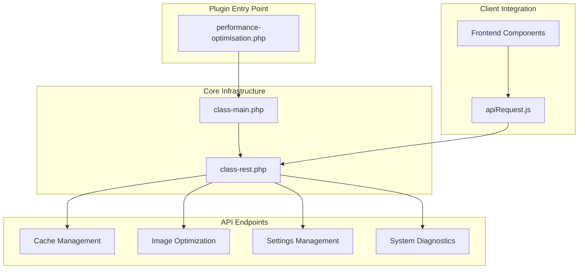
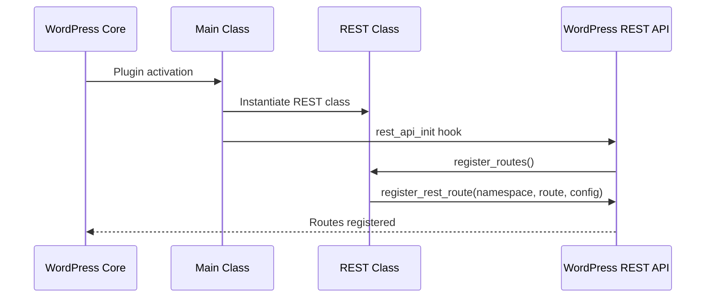
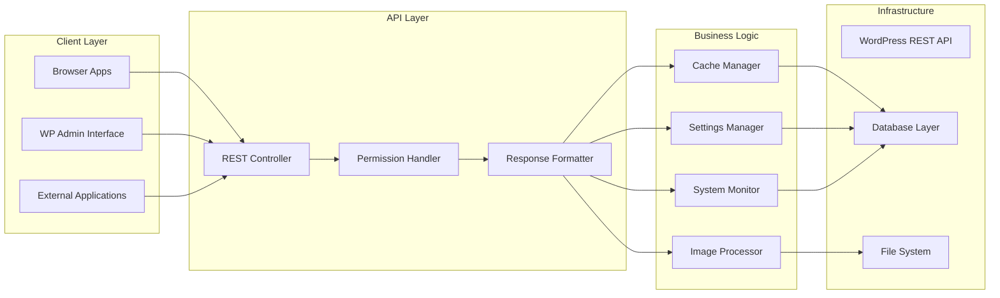
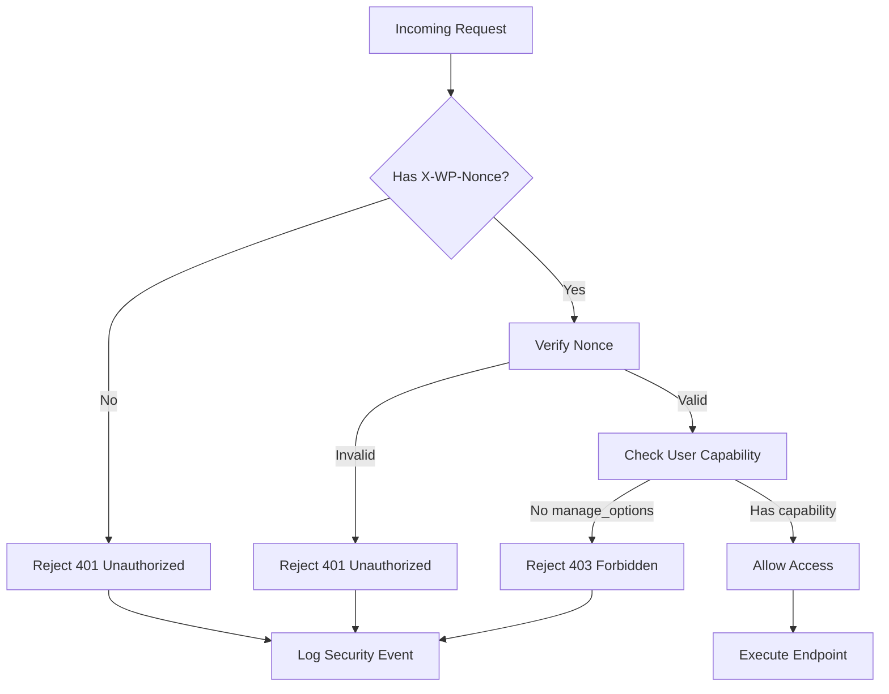
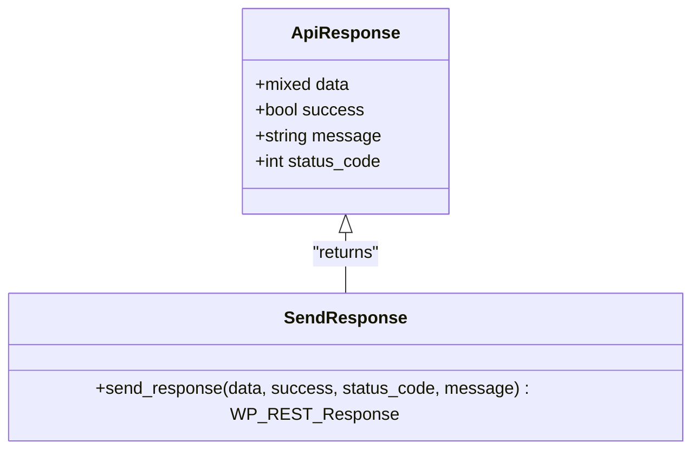
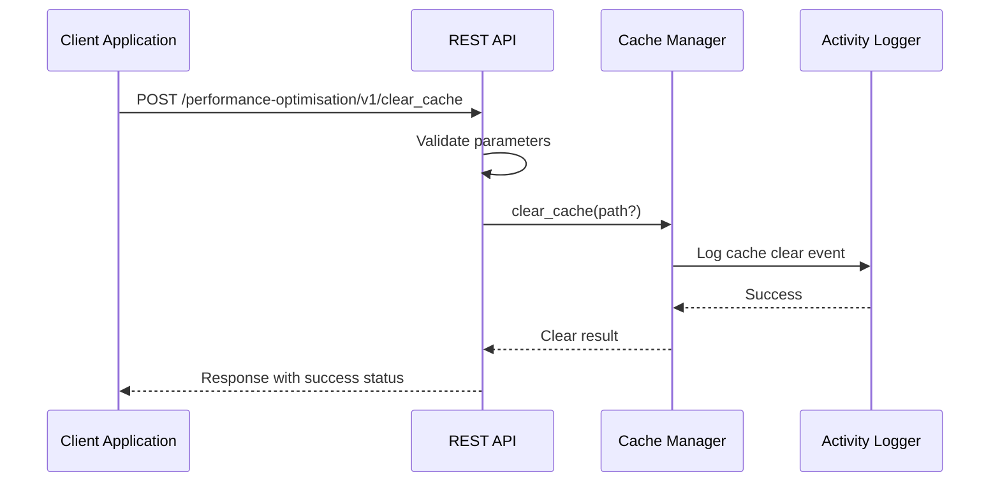
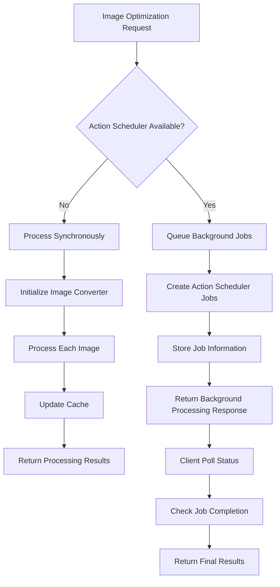
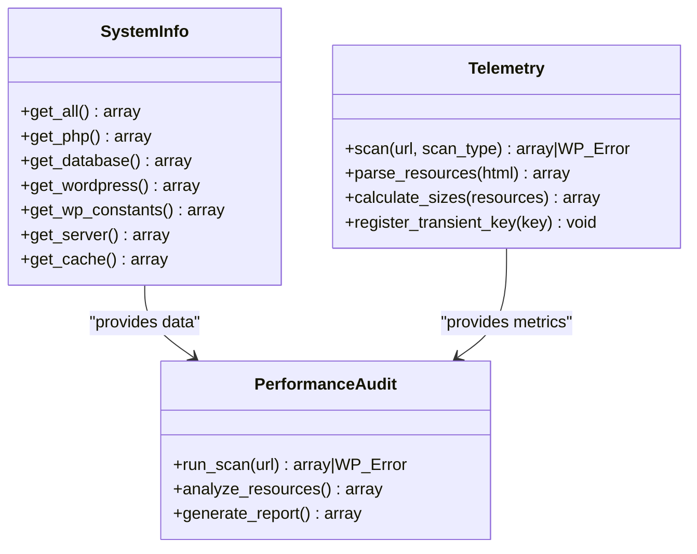
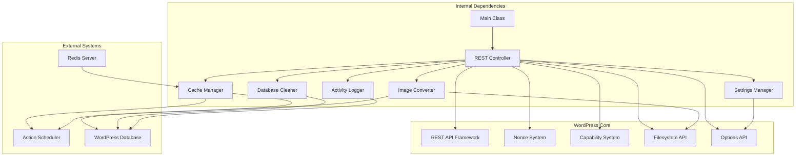
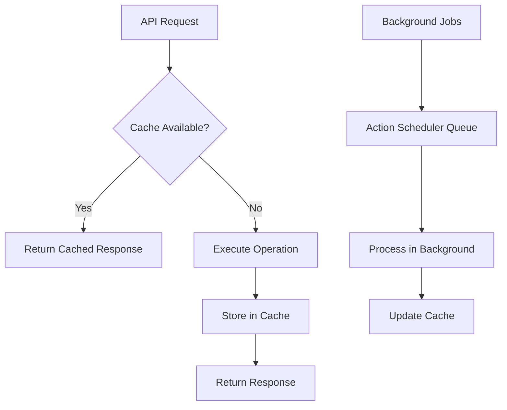

# REST API Implementation Patterns

<cite>
**Referenced Files in This Document**
- [performance-optimisation.php](file://performance-optimisation.php)
- [class-rest.php](file://includes/class-rest.php)
- [class-main.php](file://includes/class-main.php)
- [apiRequest.js](file://src/lib/apiRequest.js)
- [class-telemetry.php](file://includes/class-telemetry.php)
- [class-system-info.php](file://includes/class-system-info.php)
</cite>

## Table of Contents
1. [Introduction](#introduction)
2. [Project Structure](#project-structure)
3. [Core Components](#core-components)
4. [Architecture Overview](#architecture-overview)
5. [Detailed Component Analysis](#detailed-component-analysis)
6. [Dependency Analysis](#dependency-analysis)
7. [Performance Considerations](#performance-considerations)
8. [Troubleshooting Guide](#troubleshooting-guide)
9. [Conclusion](#conclusion)

## Introduction

The Performance Optimisation plugin implements a comprehensive REST API that provides programmatic access to performance optimization features. Built on WordPress's REST API infrastructure, the plugin exposes endpoints for cache management, image optimization, settings manipulation, database cleanup, and system diagnostics.

The API follows WordPress REST API conventions with proper authentication, authorization, and standardized response formats. All endpoints are registered under the `performance-optimisation/v1` namespace, providing a clean separation from core WordPress functionality.

## Project Structure

The REST API implementation is organized across several key components:



**Diagram sources**
- [performance-optimisation.php:40-43](file://performance-optimisation.php#L40-L43)
- [class-main.php:182-183](file://class-main.php#L182-L183)
- [class-rest.php:37-42](file://class-rest.php#L37-L42)

**Section sources**
- [performance-optimisation.php:17-43](file://performance-optimisation.php#L17-L43)
- [class-main.php:128-154](file://class-main.php#L128-L154)

## Core Components

### REST API Namespace Registration

The plugin registers its REST API namespace during the WordPress initialization process:



**Diagram sources**
- [class-main.php:182-183](file://class-main.php#L182-L183)
- [class-rest.php:37-42](file://class-rest.php#L37-L42)

### Authentication and Authorization

The API implements a two-layer security model:

1. **WordPress Capability Check**: All endpoints require `manage_options` capability
2. **Nonce Validation**: Uses WordPress nonces for CSRF protection

**Section sources**
- [class-rest.php:131-136](file://class-rest.php#L131-L136)

## Architecture Overview

The REST API architecture follows WordPress REST API patterns with custom endpoint registration:



**Diagram sources**
- [class-rest.php:30](file://class-rest.php#L30)
- [class-rest.php:37-42](file://class-rest.php#L37-L42)

## Detailed Component Analysis

### Endpoint Registry and Route Configuration

The REST controller maintains a comprehensive registry of all available endpoints:

| Endpoint | Method | Route Pattern | Purpose |
|----------|--------|---------------|---------|
| `clear_cache` | POST | `/performance-optimisation/v1/clear_cache` | Clear plugin cache (all or specific path) |
| `update_settings` | POST | `/performance-optimisation/v1/update_settings` | Update plugin configuration |
| `optimise_image` | POST | `/performance-optimisation/v1/optimise_image` | Convert images to WebP/AVIF format |
| `delete_optimised_image` | POST | `/performance-optimisation/v1/delete_optimised_image` | Remove converted images |
| `recent_activities` | GET | `/performance-optimisation/v1/recent_activities` | Retrieve recent system activities |
| `import_settings` | POST | `/performance-optimisation/v1/import_settings` | Import settings from JSON |
| `database_cleanup` | POST | `/performance-optimisation/v1/database_cleanup` | Clean WordPress database |
| `database_cleanup_counts` | GET | `/performance-optimisation/v1/database_cleanup_counts` | Get cleanup statistics |
| `get_page_assets` | GET | `/performance-optimisation/v1/get_page_assets` | Retrieve page asset information |
| `image_job_status` | GET | `/performance-optimisation/v1/image_job_status` | Check image optimization status |
| `object_cache` | POST | `/performance-optimisation/v1/object_cache` | Manage Redis object cache |
| `system_info` | GET | `/performance-optimisation/v1/system_info` | Retrieve system diagnostics |
| `performance_scan` | POST | `/performance-optimisation/v1/performance_scan` | Run performance audit |

**Section sources**
- [class-rest.php:53-122](file://class-rest.php#L53-L122)

### Authentication Mechanisms

The API implements a robust authentication system:



**Diagram sources**
- [class-rest.php:131-136](file://class-rest.php#L131-L136)

**Section sources**
- [class-rest.php:131-136](file://class-rest.php#L131-L136)

### Response Standardization

All API responses follow a consistent format:



**Diagram sources**
- [class-rest.php:831-840](file://class-rest.php#L831-L840)

**Section sources**
- [class-rest.php:821-840](file://class-rest.php#L821-L840)

### Cache Management Endpoints

The cache management system provides granular control over the plugin's caching functionality:



**Diagram sources**
- [class-rest.php:145-175](file://class-rest.php#L145-L175)

**Section sources**
- [class-rest.php:145-175](file://class-rest.php#L145-L175)

### Image Optimization Pipeline

The image optimization system supports both synchronous and asynchronous processing:



**Diagram sources**
- [class-rest.php:253-353](file://class-rest.php#L253-L353)

**Section sources**
- [class-rest.php:253-353](file://class-rest.php#L253-L353)

### System Diagnostics and Monitoring

The system diagnostics provide comprehensive health monitoring:



**Diagram sources**
- [class-system-info.php:62](file://class-system-info.php#L62)
- [class-telemetry.php:45](file://class-telemetry.php#L45)

**Section sources**
- [class-system-info.php:62](file://class-system-info.php#L62)
- [class-telemetry.php:45](file://class-telemetry.php#L45)

## Dependency Analysis

The REST API implementation has minimal external dependencies while leveraging WordPress core functionality:



**Diagram sources**
- [class-main.php:128-154](file://class-main.php#L128-L154)
- [class-rest.php:131-136](file://class-rest.php#L131-L136)

**Section sources**
- [class-main.php:128-154](file://class-main.php#L128-L154)
- [class-rest.php:131-136](file://class-rest.php#L131-L136)

## Performance Considerations

### Rate Limiting Strategy

The plugin implements several built-in rate limiting mechanisms:

1. **Nonce-based Protection**: Prevents replay attacks and CSRF
2. **Capability-based Throttling**: Restricts access to authorized users only
3. **Background Processing**: Uses Action Scheduler for long-running operations
4. **Transient Caching**: Caches expensive operations like telemetry scans

### Memory Management

The API is designed to minimize memory footprint:

- **Lazy Loading**: Components are loaded only when needed
- **Resource Cleanup**: Proper cleanup of file handles and database connections
- **Batch Processing**: Large operations are processed in chunks

### Caching Strategy



**Section sources**
- [class-telemetry.php:46](file://class-telemetry.php#L46)

## Troubleshooting Guide

### Common Authentication Issues

**Problem**: 401 Unauthorized responses
**Solution**: Ensure the `X-WP-Nonce` header is properly set and valid

**Problem**: 403 Forbidden responses  
**Solution**: Verify the requesting user has `manage_options` capability

### Error Response Format

All API errors follow this standardized format:

```json
{
  "data": null,
  "success": false,
  "message": "Error description",
  "status_code": 400
}
```

### Debugging Tips

1. **Enable WordPress Debug Logging**: Set `WP_DEBUG` to `true`
2. **Check Activity Logs**: Use the recent activities endpoint to track operations
3. **Monitor Background Jobs**: Use the image job status endpoint for async operations
4. **Validate Nonces**: Use the AJAX nonce endpoint to refresh stale nonces

**Section sources**
- [class-rest.php:831-840](file://class-rest.php#L831-L840)
- [class-rest.php:771-781](file://class-rest.php#L771-L781)

## Conclusion

The Performance Optimisation plugin demonstrates excellent REST API implementation patterns by:

1. **Following WordPress Conventions**: Proper namespace registration, authentication, and response formatting
2. **Implementing Security Best Practices**: Multi-layer authentication with nonces and capabilities
3. **Providing Comprehensive Coverage**: Endpoints for all major performance optimization features
4. **Ensuring Scalability**: Background processing for long-running operations
5. **Maintaining Extensibility**: Modular architecture supporting future enhancements

The API provides a solid foundation for programmatic access to WordPress performance optimization features while maintaining security and performance standards.