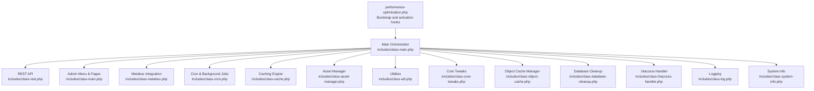
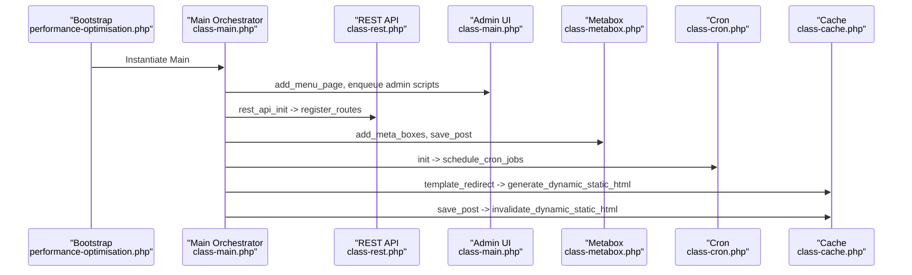
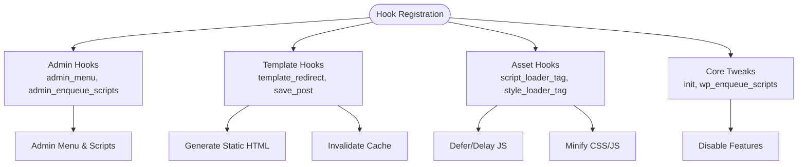
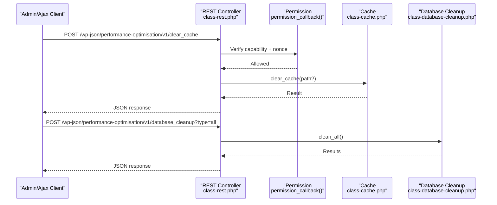
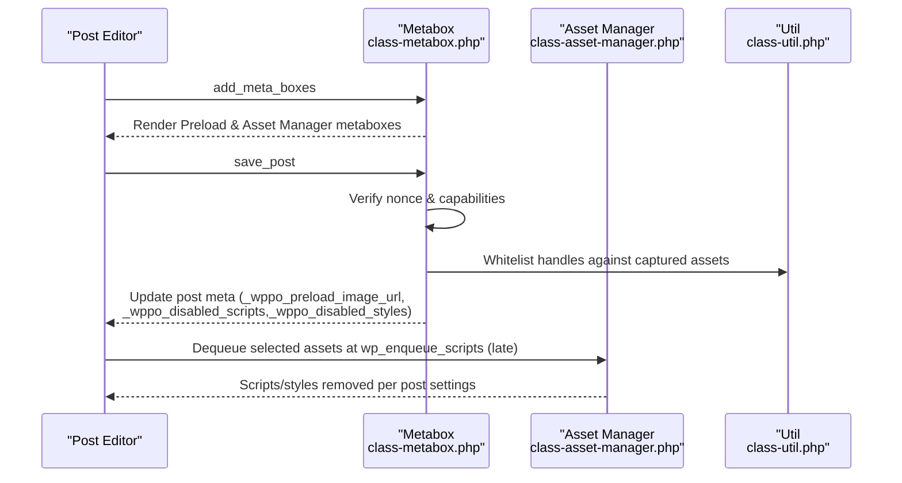
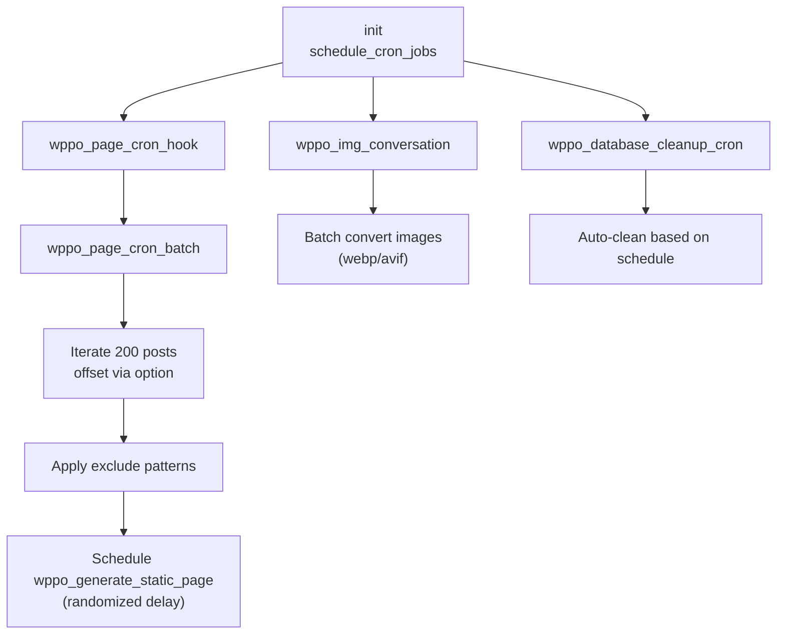
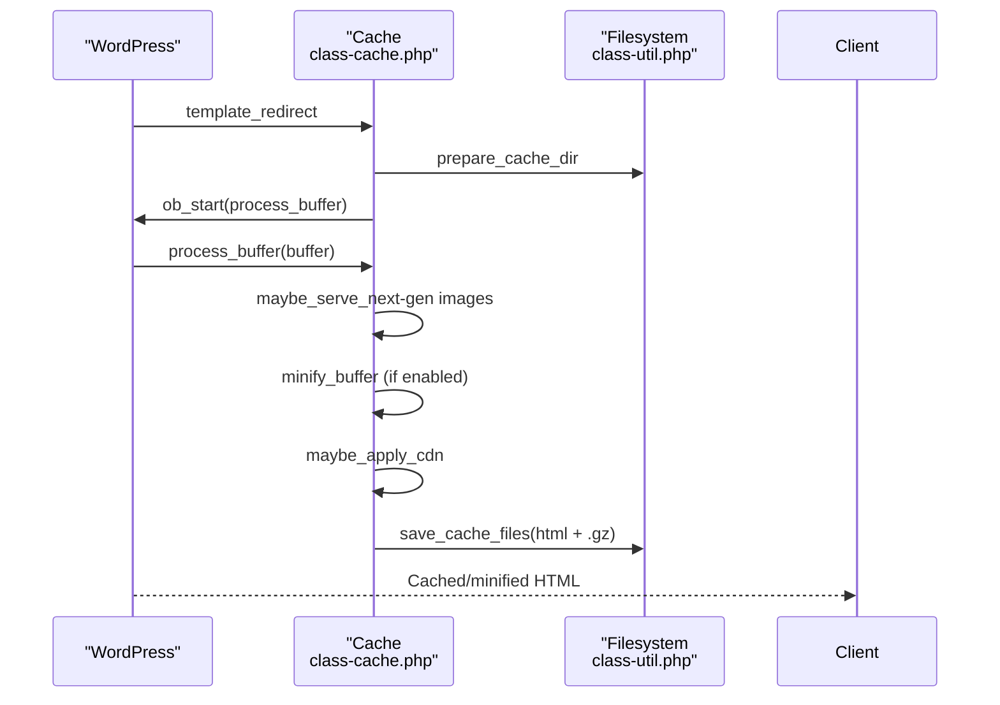
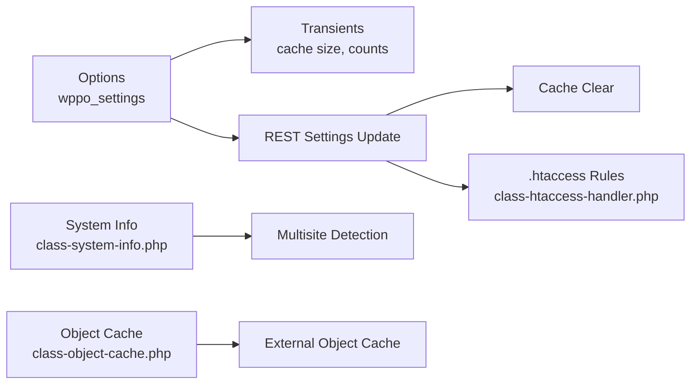
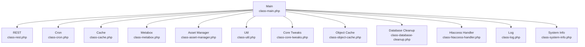

# WordPress Integration Patterns

<cite>
**Referenced Files in This Document**
- [performance-optimisation.php](file://performance-optimisation.php)
- [class-main.php](file://includes/class-main.php)
- [class-rest.php](file://includes/class-rest.php)
- [class-metabox.php](file://includes/class-metabox.php)
- [class-cron.php](file://includes/class-cron.php)
- [class-cache.php](file://includes/class-cache.php)
- [class-asset-manager.php](file://includes/class-asset-manager.php)
- [class-util.php](file://includes/class-util.php)
- [class-core-tweaks.php](file://includes/class-core-tweaks.php)
- [class-object-cache.php](file://includes/class-object-cache.php)
- [class-database-cleanup.php](file://includes/class-database-cleanup.php)
- [class-htaccess-handler.php](file://includes/class-htaccess-handler.php)
- [class-log.php](file://includes/class-log.php)
- [class-system-info.php](file://includes/class-system-info.php)
</cite>

## Table of Contents
1. [Introduction](#introduction)
2. [Project Structure](#project-structure)
3. [Core Components](#core-components)
4. [Architecture Overview](#architecture-overview)
5. [Detailed Component Analysis](#detailed-component-analysis)
6. [Dependency Analysis](#dependency-analysis)
7. [Performance Considerations](#performance-considerations)
8. [Troubleshooting Guide](#troubleshooting-guide)
9. [Conclusion](#conclusion)

## Introduction
This document explains the WordPress integration patterns used by the plugin, focusing on the hook-based architecture, REST API implementation, admin interface integration, cron and background processing, and WordPress-specific optimizations such as transients, options, and multisite considerations. It also covers integration points with core systems like the query system, template hierarchy, and admin UI patterns.

## Project Structure
The plugin follows a modular, namespace-based structure under includes/, with a central entry point delegating to a main orchestrator that sets up hooks, admin UI, REST endpoints, and subsystems.

**Diagram sources**
- [performance-optimisation.php:1-68](file://performance-optimisation.php#L1-L68)
- [class-main.php:1-1131](file://includes/class-main.php#L1-L1131)

**Section sources**
- [performance-optimisation.php:1-68](file://performance-optimisation.php#L1-L68)
- [class-main.php:128-154](file://includes/class-main.php#L128-L154)

## Core Components
- Main orchestrator initializes subsystems, loads options, sets up hooks, and wires admin UI and REST endpoints.
- REST API exposes administrative operations with nonce-validated permissions.
- Metabox integration extends the post editor with preloading and asset controls.
- Cron and background processing schedule static page generation, image conversion, and database cleanup.
- Caching engine generates and serves static HTML, combines CSS, and applies CDN rewriting.
- Utilities provide filesystem, URL processing, preload generation, and minified asset counting.
- Core tweaks disable or modify core bloat for performance.
- Object cache manager installs/removes Redis drop-in and tests connectivity.
- Database cleanup performs batched, safe deletions for common bloat.
- Logging persists activities and caches paginated results.
- System info aggregates environment details for diagnostics.

**Section sources**
- [class-main.php:98-118](file://includes/class-main.php#L98-L118)
- [class-rest.php:37-43](file://includes/class-rest.php#L37-L43)
- [class-metabox.php:37-42](file://includes/class-metabox.php#L37-L42)
- [class-cron.php:42-52](file://includes/class-cron.php#L42-L52)
- [class-cache.php:94-120](file://includes/class-cache.php#L94-L120)
- [class-util.php:29-80](file://includes/class-util.php#L29-L80)
- [class-core-tweaks.php:32-56](file://includes/class-core-tweaks.php#L32-L56)
- [class-object-cache.php:58-62](file://includes/class-object-cache.php#L58-L62)
- [class-database-cleanup.php:30-30](file://includes/class-database-cleanup.php#L30-L30)
- [class-log.php:32-62](file://includes/class-log.php#L32-L62)
- [class-system-info.php:62-71](file://includes/class-system-info.php#L62-L71)

## Architecture Overview
The plugin’s architecture is hook-driven and layered:
- Entry point registers activation/deactivation hooks and instantiates the main orchestrator.
- The main orchestrator wires WordPress actions/filters, admin screens, REST routes, and subsystems.
- Subsystems encapsulate responsibilities (REST, caching, cron, metabox, etc.) and communicate via shared options and utilities.
- Background processing leverages Action Scheduler when available, with fallbacks.

**Diagram sources**
- [performance-optimisation.php:43-67](file://performance-optimisation.php#L43-L67)
- [class-main.php:164-241](file://includes/class-main.php#L164-L241)
- [class-rest.php:37-43](file://includes/class-rest.php#L37-L43)
- [class-metabox.php:37-42](file://includes/class-metabox.php#L37-L42)
- [class-cron.php:42-52](file://includes/class-cron.php#L42-L52)
- [class-cache.php:260-276](file://includes/class-cache.php#L260-L276)

## Detailed Component Analysis

### Hook-Based Architecture and Timing
- Activation/deactivation hooks are registered at runtime and delegate to dedicated classes.
- Main orchestrator registers actions/filters at strategic hooks:
  - Admin UI: admin_menu, admin_enqueue_scripts, wp_enqueue_scripts.
  - Template lifecycle: template_redirect for cache generation, save_post for cache invalidation.
  - Asset pipeline: script_loader_tag/style_loader_tag filters for defer/delay/minify.
  - Core tweaks: init and wp_enqueue_scripts for disabling features.
- Priority management:
  - Asset combination runs at very high priority to finalize queue before output.
  - Asset dequeuing runs late (very high priority) to override earlier enqueues.
  - Admin bar integration uses elevated priority to ensure visibility.

**Diagram sources**
- [class-main.php:164-241](file://includes/class-main.php#L164-L241)
- [class-core-tweaks.php:32-56](file://includes/class-core-tweaks.php#L32-L56)
- [class-cache.php:127-223](file://includes/class-cache.php#L127-L223)

**Section sources**
- [performance-optimisation.php:51-67](file://performance-optimisation.php#L51-L67)
- [class-main.php:164-241](file://includes/class-main.php#L164-L241)
- [class-core-tweaks.php:32-56](file://includes/class-core-tweaks.php#L32-L56)
- [class-cache.php:127-223](file://includes/class-cache.php#L127-L223)

### REST API Implementation Patterns
- Namespace and route registration are centralized; endpoints are grouped by feature area.
- Permission model requires manage_options capability and a valid X-WP-Nonce header.
- Endpoints include cache management, settings updates, image optimization, database cleanup, asset inspection, object cache control, and diagnostics.
- AJAX nonce refresh endpoint supports clients that may face nonce staleness.

**Diagram sources**
- [class-rest.php:37-136](file://includes/class-rest.php#L37-L136)
- [class-rest.php:145-175](file://includes/class-rest.php#L145-L175)
- [class-rest.php:451-539](file://includes/class-rest.php#L451-L539)
- [class-cache.php:647-677](file://includes/class-cache.php#L647-L677)
- [class-database-cleanup.php:529-546](file://includes/class-database-cleanup.php#L529-L546)

**Section sources**
- [class-rest.php:37-136](file://includes/class-rest.php#L37-L136)
- [class-rest.php:145-175](file://includes/class-rest.php#L145-L175)
- [class-rest.php:451-539](file://includes/class-rest.php#L451-L539)

### Metabox Integration and Admin Interfaces
- Adds a “Preload Image URL” metabox to public post types for per-page preload configuration.
- Adds an “Asset Manager” metabox to manage disabled scripts/styles per post, with protection lists for core handles.
- Saves metabox data with nonce verification and sanitization, and whitelists handles against captured assets.

**Diagram sources**
- [class-metabox.php:49-74](file://includes/class-metabox.php#L49-L74)
- [class-metabox.php:244-330](file://includes/class-metabox.php#L244-L330)
- [class-asset-manager.php:76-121](file://includes/class-asset-manager.php#L76-L121)
- [class-util.php:243-248](file://includes/class-util.php#L243-L248)

**Section sources**
- [class-metabox.php:49-74](file://includes/class-metabox.php#L49-L74)
- [class-metabox.php:244-330](file://includes/class-metabox.php#L244-L330)
- [class-asset-manager.php:76-121](file://includes/class-asset-manager.php#L76-L121)

### Cron Job System and Background Processing
- Schedules periodic jobs for static page generation, image conversion, and database cleanup.
- Implements batched processing with offsets and randomized delays to avoid spikes.
- Supports Action Scheduler for background image conversion; falls back to synchronous processing when unavailable.
- Provides manual and automated cleanup routines with configurable schedules.

**Diagram sources**
- [class-cron.php:79-91](file://includes/class-cron.php#L79-L91)
- [class-cron.php:98-184](file://includes/class-cron.php#L98-L184)
- [class-cron.php:321-360](file://includes/class-cron.php#L321-L360)
- [class-cron.php:369-395](file://includes/class-cron.php#L369-L395)

**Section sources**
- [class-cron.php:79-91](file://includes/class-cron.php#L79-L91)
- [class-cron.php:98-184](file://includes/class-cron.php#L98-L184)
- [class-cron.php:321-360](file://includes/class-cron.php#L321-L360)
- [class-cron.php:369-395](file://includes/class-cron.php#L369-L395)

### Caching Engine and Dynamic Static HTML
- Wraps output buffering to minify and cache HTML, with optional CDN rewriting for wp-content/wp-includes assets.
- Combines CSS into a single file, minifies, and preloads the combined stylesheet.
- Supports smart purging on save_post and structural changes (theme switch, permalinks).
- Uses transients for lightweight cache size and minified asset counts.

**Diagram sources**
- [class-cache.php:260-310](file://includes/class-cache.php#L260-L310)
- [class-cache.php:325-381](file://includes/class-cache.php#L325-L381)
- [class-cache.php:470-483](file://includes/class-cache.php#L470-L483)
- [class-util.php:67-80](file://includes/class-util.php#L67-L80)

**Section sources**
- [class-cache.php:260-310](file://includes/class-cache.php#L260-L310)
- [class-cache.php:325-381](file://includes/class-cache.php#L325-L381)
- [class-cache.php:470-483](file://includes/class-cache.php#L470-L483)

### WordPress-Specific Optimizations
- Transients: Used for cache size, minified asset counts, and paginated activity logs.
- Options: Centralized settings under wppo_settings; updated via REST with sanitization; change listeners trigger cache invalidation and .htaccess updates.
- Multisite considerations: System info detects multisite; object cache manager checks external object cache; filesystem operations use WP_Filesystem.

**Diagram sources**
- [class-main.php:99-109](file://includes/class-main.php#L99-L109)
- [class-main.php:250-277](file://includes/class-main.php#L250-L277)
- [class-rest.php:184-200](file://includes/class-rest.php#L184-L200)
- [class-htaccess-handler.php:42-74](file://includes/class-htaccess-handler.php#L42-L74)
- [class-system-info.php:142-143](file://includes/class-system-info.php#L142-L143)
- [class-object-cache.php:208-247](file://includes/class-object-cache.php#L208-L247)

**Section sources**
- [class-main.php:99-109](file://includes/class-main.php#L99-L109)
- [class-main.php:250-277](file://includes/class-main.php#L250-L277)
- [class-rest.php:184-200](file://includes/class-rest.php#L184-L200)
- [class-htaccess-handler.php:42-74](file://includes/class-htaccess-handler.php#L42-L74)
- [class-system-info.php:142-143](file://includes/class-system-info.php#L142-L143)
- [class-object-cache.php:208-247](file://includes/class-object-cache.php#L208-L247)

### Integration with WordPress Core Systems
- Query system: Database cleanup uses direct $wpdb queries with batching; asset capture reads $wp_scripts/$wp_styles at footer.
- Template hierarchy: Static HTML generation hooks into template_redirect; cache invalidation listens to save_post; preloading targets front page and singular contexts.
- Admin UI: Menu page, localized scripts, and AJAX nonce endpoint integrate with admin bar and dashboard.

**Section sources**
- [class-database-cleanup.php:38-82](file://includes/class-database-cleanup.php#L38-L82)
- [class-asset-manager.php:131-191](file://includes/class-asset-manager.php#L131-L191)
- [class-cache.php:260-276](file://includes/class-cache.php#L260-L276)
- [class-main.php:321-343](file://includes/class-main.php#L321-L343)
- [class-rest.php:771-781](file://includes/class-rest.php#L771-L781)

## Dependency Analysis
The main orchestrator depends on subsystems and utilities. REST, cron, cache, and metabox are tightly coupled to options and utilities. Object cache and database cleanup are independent modules invoked by REST or cron.

**Diagram sources**
- [class-main.php:128-154](file://includes/class-main.php#L128-L154)
- [class-rest.php:37-43](file://includes/class-rest.php#L37-L43)
- [class-cron.php:42-52](file://includes/class-cron.php#L42-L52)
- [class-cache.php:94-120](file://includes/class-cache.php#L94-L120)
- [class-metabox.php:37-42](file://includes/class-metabox.php#L37-L42)
- [class-asset-manager.php:76-82](file://includes/class-asset-manager.php#L76-L82)
- [class-util.php:29-80](file://includes/class-util.php#L29-L80)
- [class-core-tweaks.php:32-56](file://includes/class-core-tweaks.php#L32-L56)
- [class-object-cache.php:58-62](file://includes/class-object-cache.php#L58-L62)
- [class-database-cleanup.php:30-30](file://includes/class-database-cleanup.php#L30-L30)
- [class-htaccess-handler.php:25-74](file://includes/class-htaccess-handler.php#L25-L74)
- [class-log.php:22-62](file://includes/class-log.php#L22-L62)
- [class-system-info.php:29-71](file://includes/class-system-info.php#L29-L71)

**Section sources**
- [class-main.php:128-154](file://includes/class-main.php#L128-L154)

## Performance Considerations
- Output buffering and minification occur only when not logged in and cacheable; CSS combination runs at high priority to finalize queues.
- Batched database cleanup and cron processing prevent memory spikes and timeouts.
- Transients cache expensive computations (cache size, counts) to reduce repeated filesystem scans.
- CDN rewriting is conditional and uses HTML processors when available; otherwise regex fallback is applied.
- Action Scheduler is preferred for background image conversion; synchronous fallback ensures reliability.

[No sources needed since this section provides general guidance]

## Troubleshooting Guide
- REST endpoint unauthorized: Verify manage_options capability and valid X-WP-Nonce header; use AJAX endpoint to refresh nonce.
- .htaccess rules not applied: Check file permissions and writable status; rollback on failure and surface admin notice.
- Cache not clearing: Ensure transients are cleared and filesystem operations succeed; verify path normalization and exclusion patterns.
- Cron jobs not running: Confirm cron schedules and scheduled hooks; verify batch offset persistence and exclusion patterns.
- Object cache not enabled: Validate PHP Redis extension, check for foreign drop-in conflicts, and test connectivity via ping.

**Section sources**
- [class-rest.php:131-136](file://includes/class-rest.php#L131-L136)
- [class-rest.php:771-781](file://includes/class-rest.php#L771-L781)
- [class-main.php:250-277](file://includes/class-main.php#L250-L277)
- [class-htaccess-handler.php:59-65](file://includes/class-htaccess-handler.php#L59-L65)
- [class-cache.php:647-677](file://includes/class-cache.php#L647-L677)
- [class-cron.php:79-91](file://includes/class-cron.php#L79-L91)
- [class-object-cache.php:208-247](file://includes/class-object-cache.php#L208-L247)

## Conclusion
The plugin implements a robust, hook-driven architecture that integrates deeply with WordPress core. It provides a cohesive admin experience, powerful REST APIs, intelligent caching, and background processing while maintaining performance best practices through batching, transients, and careful hook placement. The modular design enables maintainability and extensibility across caching, asset management, database hygiene, and diagnostics.