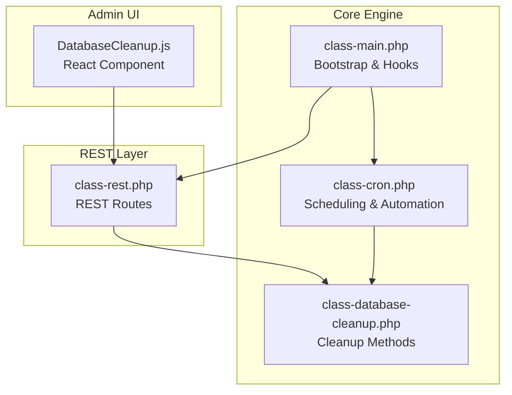
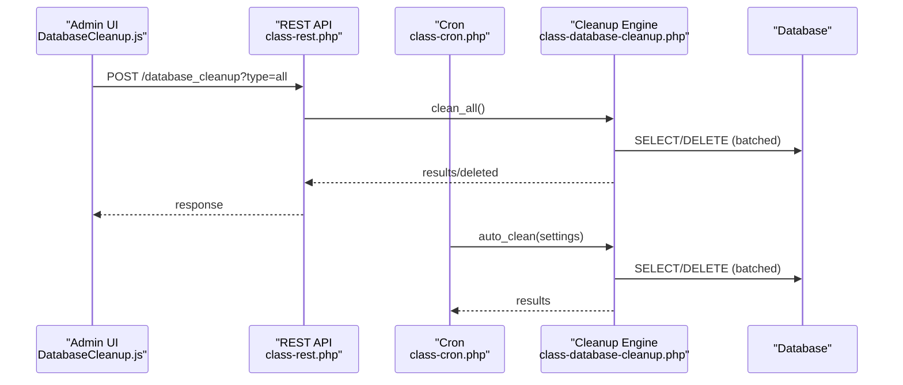
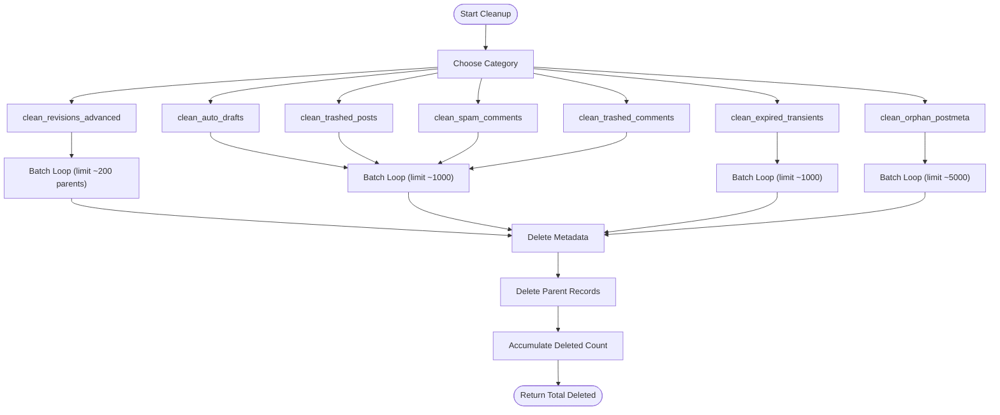
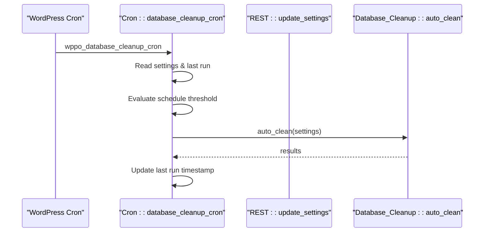
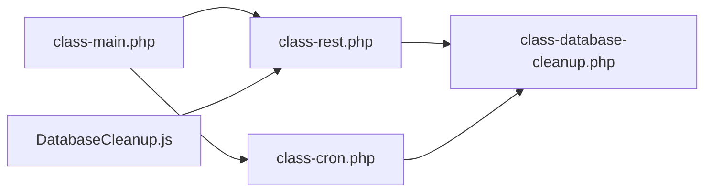

# Automated Cleanup Processes

<cite>
**Referenced Files in This Document**
- [class-database-cleanup.php](file://includes/class-database-cleanup.php)
- [class-cron.php](file://includes/class-cron.php)
- [class-rest.php](file://includes/class-rest.php)
- [DatabaseCleanup.js](file://src/components/DatabaseCleanup.js)
- [performance-optimisation.php](file://performance-optimisation.php)
- [class-main.php](file://includes/class-main.php)
- [readme.txt](file://readme.txt)
</cite>

## Table of Contents
1. [Introduction](#introduction)
2. [Project Structure](#project-structure)
3. [Core Components](#core-components)
4. [Architecture Overview](#architecture-overview)
5. [Detailed Component Analysis](#detailed-component-analysis)
6. [Dependency Analysis](#dependency-analysis)
7. [Performance Considerations](#performance-considerations)
8. [Troubleshooting Guide](#troubleshooting-guide)
9. [Conclusion](#conclusion)
10. [Appendices](#appendices)

## Introduction
This document explains the automated database cleanup processes implemented in the plugin. It covers each cleanup routine (post revisions, auto drafts, trashed posts, spam comments, expired transients, and orphaned post meta), the batch processing mechanisms, SQL optimization techniques, performance characteristics, configuration options for schedules and retention policies, and guidance for monitoring and troubleshooting cleanup operations.

## Project Structure
The cleanup functionality spans PHP backend classes, WordPress REST API endpoints, and a React-based admin UI. The main components are:
- Backend cleanup engine: a dedicated class that performs direct SQL operations for efficiency.
- Cron scheduler: schedules automated cleanup based on user-defined frequency.
- REST API: exposes endpoints for manual cleanup and counts retrieval.
- Admin UI: presents cleanup options, counts, and triggers cleanup actions.

**Diagram sources**
- [DatabaseCleanup.js:1-379](file://src/components/DatabaseCleanup.js#L1-L379)
- [class-rest.php:85-122](file://includes/class-rest.php#L85-L122)
- [class-database-cleanup.php:30-652](file://includes/class-database-cleanup.php#L30-L652)
- [class-cron.php:27-91](file://includes/class-cron.php#L27-L91)
- [class-main.php:128-186](file://includes/class-main.php#L128-L186)

**Section sources**
- [performance-optimisation.php:18-44](file://performance-optimisation.php#L18-L44)
- [class-main.php:128-186](file://includes/class-main.php#L128-L186)

## Core Components
- Database_Cleanup: Implements all cleanup routines with batched SQL operations and returns counts or errors.
- Cron: Schedules automated cleanup based on user settings and frequency.
- REST: Exposes endpoints for manual cleanup, counts retrieval, and settings updates.
- DatabaseCleanup UI: React component that displays counts, allows manual cleanup, and saves settings.

Key capabilities:
- Batched deletion to avoid memory pressure and timeouts.
- Separate handling of metadata before deleting parent records.
- Advanced revision cleanup with retention policy controls.
- Automated scheduling with daily/weekly/monthly cadence.
- Logging of cleanup actions for auditability.

**Section sources**
- [class-database-cleanup.php:30-652](file://includes/class-database-cleanup.php#L30-L652)
- [class-cron.php:27-91](file://includes/class-cron.php#L27-L91)
- [class-rest.php:85-122](file://includes/class-rest.php#L85-L122)
- [DatabaseCleanup.js:17-53](file://src/components/DatabaseCleanup.js#L17-L53)

## Architecture Overview
The cleanup architecture integrates UI, REST, scheduling, and the cleanup engine:

**Diagram sources**
- [DatabaseCleanup.js:130-162](file://src/components/DatabaseCleanup.js#L130-L162)
- [class-rest.php:451-539](file://includes/class-rest.php#L451-L539)
- [class-cron.php:369-395](file://includes/class-cron.php#L369-L395)
- [class-database-cleanup.php:529-586](file://includes/class-database-cleanup.php#L529-L586)

## Detailed Component Analysis

### Database_Cleanup Engine
The engine encapsulates all cleanup routines and provides:
- Individual cleanup methods for each category.
- A unified clean_all() aggregator.
- An auto_clean() orchestrator for scheduled runs.
- get_counts() to report current overhead.
- invoke_cleanup_method() to standardize error handling.

Batch processing patterns:
- Iteratively selects IDs in chunks (typically 1000 for posts/comments, 5000 for orphaned postmeta).
- Deletes metadata first, then parent records.
- Uses prepared statements with placeholders to safely pass IDs.

Retention and advanced revision cleanup:
- clean_revisions_advanced() prunes revisions older than a computed cutoff while retaining a configurable number per parent post.
- Parameters: dbRevMaxAge (days), dbRevKeepLatest (count).

Error handling:
- Returns false on SQL errors; invoke_cleanup_method() wraps failures as WP_Error for REST responses.

**Diagram sources**
- [class-database-cleanup.php:94-186](file://includes/class-database-cleanup.php#L94-L186)
- [class-database-cleanup.php:194-238](file://includes/class-database-cleanup.php#L194-L238)
- [class-database-cleanup.php:248-292](file://includes/class-database-cleanup.php#L248-L292)
- [class-database-cleanup.php:300-344](file://includes/class-database-cleanup.php#L300-L344)
- [class-database-cleanup.php:352-396](file://includes/class-database-cleanup.php#L352-L396)
- [class-database-cleanup.php:408-466](file://includes/class-database-cleanup.php#L408-L466)
- [class-database-cleanup.php:476-521](file://includes/class-database-cleanup.php#L476-L521)

**Section sources**
- [class-database-cleanup.php:30-652](file://includes/class-database-cleanup.php#L30-L652)

### Cron-Based Automation
The Cron class:
- Schedules a daily database cleanup hook.
- Reads user settings from wppo_settings.database_cleanup.
- Applies schedule rules (daily, weekly, monthly) with thresholds.
- Invokes auto_clean() and records last run timestamp.

**Diagram sources**
- [class-cron.php:369-395](file://includes/class-cron.php#L369-L395)
- [class-database-cleanup.php:561-586](file://includes/class-database-cleanup.php#L561-L586)

**Section sources**
- [class-cron.php:27-91](file://includes/class-cron.php#L27-L91)
- [class-cron.php:369-395](file://includes/class-cron.php#L369-L395)

### REST API Endpoints
Endpoints:
- POST /performance-optimisation/v1/database_cleanup: Executes a specific cleanup or all categories.
- GET /performance-optimisation/v1/database_cleanup_counts: Returns current overhead counts.
- POST /performance-optimisation/v1/update_settings: Saves database cleanup settings.

Behavior:
- Validates cleanup type and returns structured responses with totals and per-category results.
- Logs cleanup actions via the Log class.

**Section sources**
- [class-rest.php:85-122](file://includes/class-rest.php#L85-L122)
- [class-rest.php:451-539](file://includes/class-rest.php#L451-L539)
- [class-rest.php:548-551](file://includes/class-rest.php#L548-L551)

### Admin UI (DatabaseCleanup.js)
The React component:
- Displays cleanup categories with descriptions and current counts.
- Allows manual cleanup per category or “Optimize Everything.”
- Persists settings (dbSchedule, dbRevMaxAge, dbRevKeepLatest) via update_settings.
- Shows notifications for successes and failures.

**Section sources**
- [DatabaseCleanup.js:17-53](file://src/components/DatabaseCleanup.js#L17-L53)
- [DatabaseCleanup.js:75-95](file://src/components/DatabaseCleanup.js#L75-L95)
- [DatabaseCleanup.js:106-128](file://src/components/DatabaseCleanup.js#L106-L128)
- [DatabaseCleanup.js:130-162](file://src/components/DatabaseCleanup.js#L130-L162)

## Dependency Analysis
- Bootstrap and hooks: Main initializes REST, Cron, and other subsystems.
- REST depends on Database_Cleanup for execution and counts.
- Cron depends on Database_Cleanup for automated runs.
- UI depends on REST endpoints for counts and cleanup execution.

**Diagram sources**
- [class-main.php:128-186](file://includes/class-main.php#L128-L186)
- [class-rest.php:185-186](file://includes/class-rest.php#L185-L186)
- [class-cron.php:230-231](file://includes/class-cron.php#L230-L231)
- [class-database-cleanup.php:529-586](file://includes/class-database-cleanup.php#L529-L586)

**Section sources**
- [class-main.php:128-186](file://includes/class-main.php#L128-L186)

## Performance Considerations
- Batch sizes:
  - Posts/comments: 1000 per batch.
  - Orphaned postmeta: 5000 per batch.
  - Advanced revisions: batched parent selection (~200) and chunked deletions (≤50).
- Prepared statements and placeholders:
  - Prevents SQL injection and reduces query parsing overhead.
- Metadata-first deletion:
  - Ensures referential integrity and avoids cascade effects.
- SQL joins and conditions:
  - Transients cleanup uses INNER JOIN to pair data and timeout options.
- Count queries:
  - Live counts are fetched directly without caching to reflect current state.

[No sources needed since this section provides general guidance]

## Troubleshooting Guide
Common issues and resolutions:
- SQL errors during cleanup:
  - The engine returns false on SQL errors; invoke_cleanup_method() converts to WP_Error for REST responses. Check database connectivity and permissions.
- Partial failures:
  - clean_all() aggregates results and reports failures per category; inspect the failures map and retry.
- Scheduled cleanup not running:
  - Verify dbSchedule setting and last run threshold logic in Cron::database_cleanup_cron.
- Large databases:
  - Use smaller batch sizes or adjust retention policies (keep latest revisions) to reduce load.
- UI shows zero counts:
  - Counts are fetched live; ensure the endpoint is reachable and the database is accessible.

Monitoring:
- Use the activity log entries generated by cleanup actions for audit trails.
- Observe the “Total Optimization Opportunities” and per-category counts in the UI.

**Section sources**
- [class-database-cleanup.php:644-650](file://includes/class-database-cleanup.php#L644-L650)
- [class-rest.php:466-492](file://includes/class-rest.php#L466-L492)
- [class-cron.php:381-394](file://includes/class-cron.php#L381-L394)

## Conclusion
The plugin provides robust, batched database cleanup routines with flexible scheduling and granular retention controls. The architecture separates concerns between UI, REST, scheduling, and the cleanup engine, ensuring scalability and safety. Administrators can monitor overhead, configure automated runs, and execute targeted cleanup operations with confidence.

[No sources needed since this section summarizes without analyzing specific files]

## Appendices

### Cleanup Categories and Retention Policies
- Post Revisions:
  - Advanced pruning with dbRevMaxAge (days) and dbRevKeepLatest (count).
- Auto Drafts:
  - Immediate batched deletion of auto-draft posts and associated metadata.
- Trashed Posts:
  - Batched deletion of trashed posts and associated metadata.
- Spam Comments:
  - Batched deletion of spam comments and associated metadata.
- Trashed Comments:
  - Batched deletion of trashed comments and associated metadata.
- Expired Transients:
  - Batched deletion of expired transient data and corresponding timeout options.
- Orphaned Post Meta:
  - Batched deletion of postmeta entries with no matching post.

**Section sources**
- [class-database-cleanup.php:94-186](file://includes/class-database-cleanup.php#L94-L186)
- [class-database-cleanup.php:194-238](file://includes/class-database-cleanup.php#L194-L238)
- [class-database-cleanup.php:248-292](file://includes/class-database-cleanup.php#L248-L292)
- [class-database-cleanup.php:300-344](file://includes/class-database-cleanup.php#L300-L344)
- [class-database-cleanup.php:352-396](file://includes/class-database-cleanup.php#L352-L396)
- [class-database-cleanup.php:408-466](file://includes/class-database-cleanup.php#L408-L466)
- [class-database-cleanup.php:476-521](file://includes/class-database-cleanup.php#L476-L521)

### Configuration Options
- dbSchedule: none | daily | weekly | monthly
- dbRevMaxAge: integer (days)
- dbRevKeepLatest: integer (count)

These settings are persisted under wppo_settings.database_cleanup and consumed by Cron and REST.

**Section sources**
- [DatabaseCleanup.js:56-61](file://src/components/DatabaseCleanup.js#L56-L61)
- [class-cron.php:369-395](file://includes/class-cron.php#L369-L395)
- [class-rest.php:184-200](file://includes/class-rest.php#L184-L200)

### Example Execution Paths
- Manual cleanup (UI):
  - [DatabaseCleanup.js:130-162](file://src/components/DatabaseCleanup.js#L130-L162)
  - [class-rest.php:451-539](file://includes/class-rest.php#L451-L539)
- Automated cleanup (Cron):
  - [class-cron.php:369-395](file://includes/class-cron.php#L369-L395)
  - [class-database-cleanup.php:561-586](file://includes/class-database-cleanup.php#L561-L586)

**Section sources**
- [DatabaseCleanup.js:130-162](file://src/components/DatabaseCleanup.js#L130-L162)
- [class-rest.php:451-539](file://includes/class-rest.php#L451-L539)
- [class-cron.php:369-395](file://includes/class-cron.php#L369-L395)
- [class-database-cleanup.php:561-586](file://includes/class-database-cleanup.php#L561-L586)