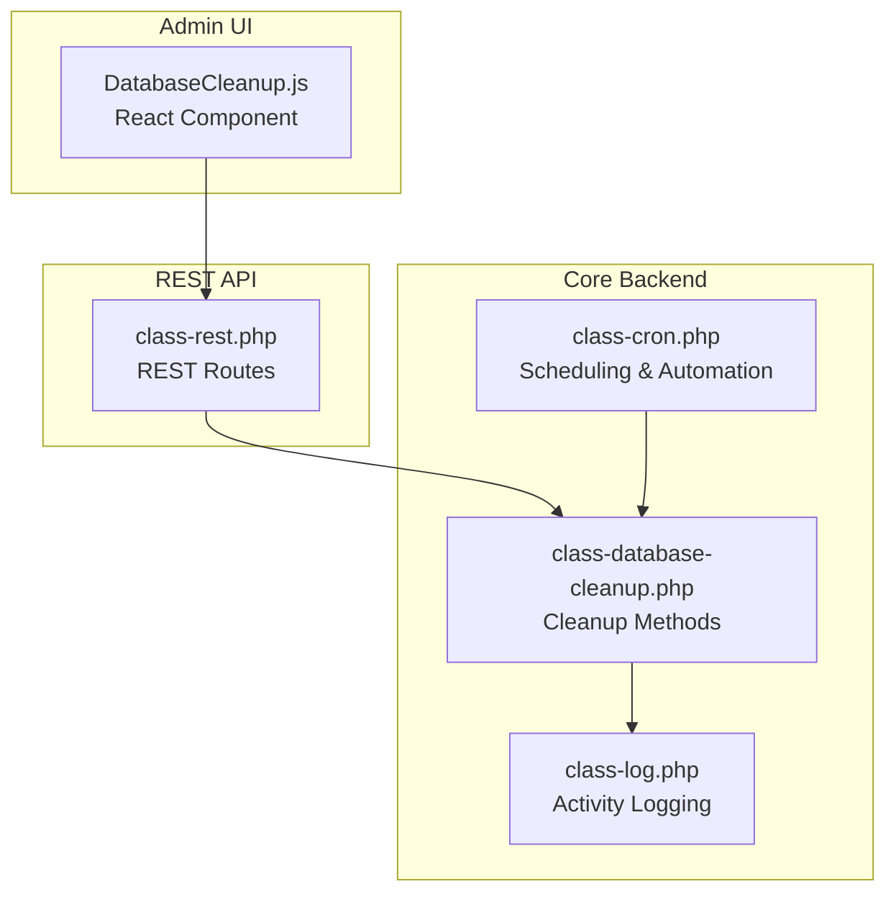
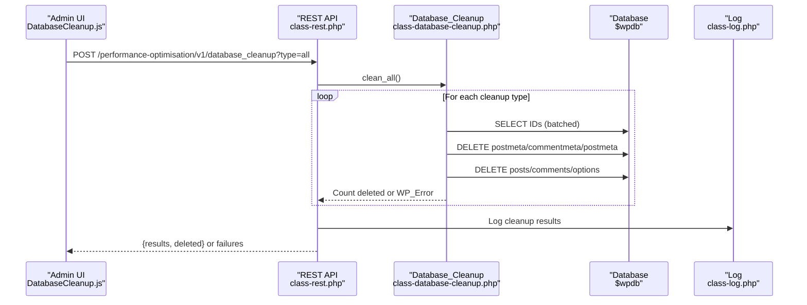
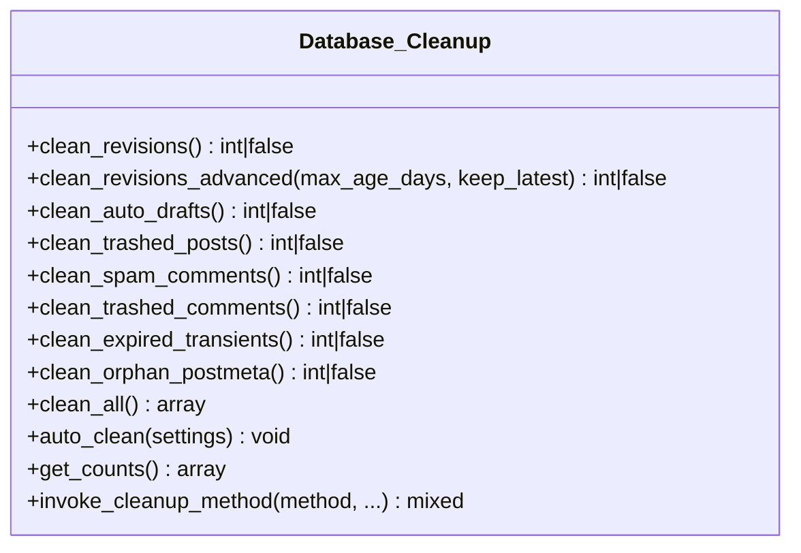
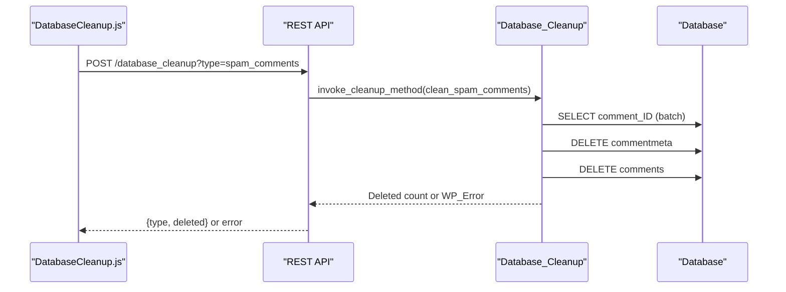
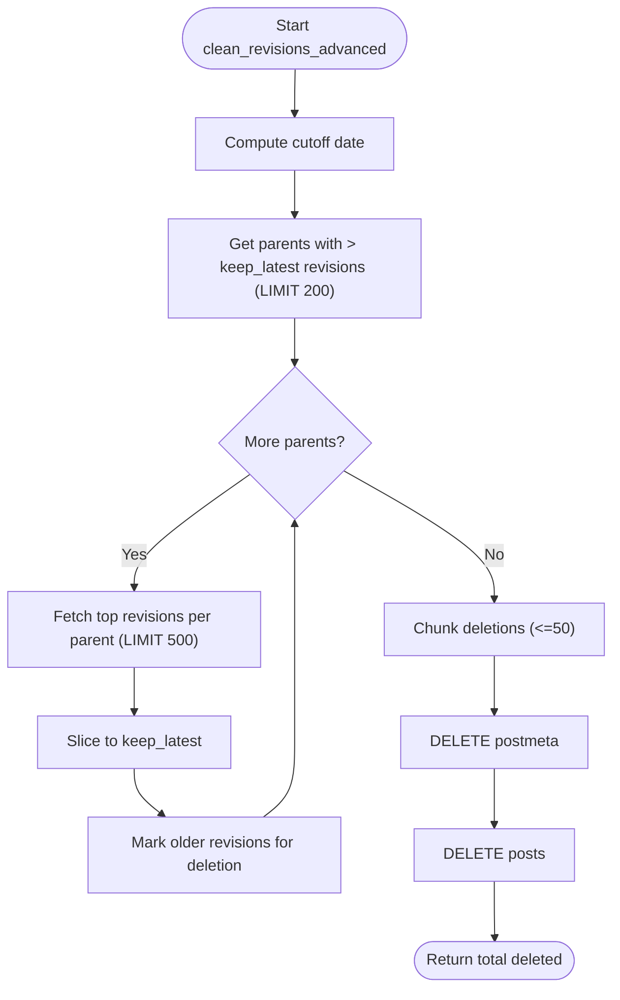
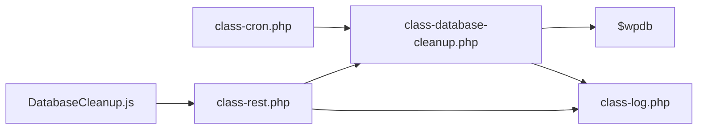

# Automated Database Cleanup Processes

<cite>
**Referenced Files in This Document**
- [class-database-cleanup.php](file://includes/class-database-cleanup.php)
- [class-cron.php](file://includes/class-cron.php)
- [class-rest.php](file://includes/class-rest.php)
- [DatabaseCleanup.js](file://src/components/DatabaseCleanup.js)
- [class-log.php](file://includes/class-log.php)
- [readme.txt](file://readme.txt)
</cite>

## Table of Contents
1. [Introduction](#introduction)
2. [Project Structure](#project-structure)
3. [Core Components](#core-components)
4. [Architecture Overview](#architecture-overview)
5. [Detailed Component Analysis](#detailed-component-analysis)
6. [Dependency Analysis](#dependency-analysis)
7. [Performance Considerations](#performance-considerations)
8. [Troubleshooting Guide](#troubleshooting-guide)
9. [Conclusion](#conclusion)
10. [Appendices](#appendices)

## Introduction
This document provides comprehensive documentation for the automated database cleanup processes within the Performance Optimisation plugin. It explains each cleanup routine (post revisions, auto drafts, trashed posts, spam comments, expired transients, and orphaned post meta), details the batch processing mechanisms, SQL optimization techniques, and performance impact of each operation. It also documents configuration options for cleanup schedules, retention policies, and selective cleanup operations, along with examples of execution, error handling, and troubleshooting guidance.

## Project Structure
The cleanup system spans both backend PHP classes and a React-based admin UI. The backend provides robust, direct SQL operations with batching and error handling, while the frontend exposes granular controls and automated scheduling.

**Diagram sources**
- [DatabaseCleanup.js:1-379](file://src/components/DatabaseCleanup.js#L1-L379)
- [class-rest.php:85-123](file://includes/class-rest.php#L85-L123)
- [class-database-cleanup.php:30-652](file://includes/class-database-cleanup.php#L30-L652)
- [class-cron.php:27-52](file://includes/class-cron.php#L27-L52)
- [class-log.php:22-132](file://includes/class-log.php#L22-L132)

**Section sources**
- [DatabaseCleanup.js:1-379](file://src/components/DatabaseCleanup.js#L1-L379)
- [class-rest.php:85-123](file://includes/class-rest.php#L85-L123)
- [class-database-cleanup.php:30-652](file://includes/class-database-cleanup.php#L30-L652)
- [class-cron.php:27-52](file://includes/class-cron.php#L27-L52)
- [class-log.php:22-132](file://includes/class-log.php#L22-L132)

## Core Components
- Database_Cleanup: Implements all cleanup routines with batched SQL operations and error handling.
- Cron: Schedules automated cleanup runs and applies retention policies.
- REST API: Exposes endpoints for manual cleanup and counts retrieval.
- DatabaseCleanup UI: Provides configuration and execution controls for administrators.

Key capabilities:
- Batched deletion with controlled chunk sizes to prevent timeouts.
- Advanced revision cleanup with configurable age and retention.
- Automated scheduling with daily/weekly/monthly options.
- Granular controls for selective cleanup categories.
- Activity logging for auditability.

**Section sources**
- [class-database-cleanup.php:30-652](file://includes/class-database-cleanup.php#L30-L652)
- [class-cron.php:27-52](file://includes/class-cron.php#L27-L52)
- [class-rest.php:85-123](file://includes/class-rest.php#L85-L123)
- [DatabaseCleanup.js:17-53](file://src/components/DatabaseCleanup.js#L17-L53)

## Architecture Overview
The cleanup architecture integrates a React admin UI with REST endpoints, which delegate to the Database_Cleanup class. Automated runs are scheduled via WP Cron and apply retention policies.

**Diagram sources**
- [DatabaseCleanup.js:130-162](file://src/components/DatabaseCleanup.js#L130-L162)
- [class-rest.php:451-539](file://includes/class-rest.php#L451-L539)
- [class-database-cleanup.php:529-546](file://includes/class-database-cleanup.php#L529-L546)
- [class-log.php:32-62](file://includes/class-log.php#L32-L62)

## Detailed Component Analysis

### Database_Cleanup Class
The core cleanup engine performs batched deletions across multiple WordPress tables. Each method:
- Selects IDs in batches to avoid memory pressure.
- Deletes associated metadata first (postmeta, commentmeta).
- Deletes the primary records (posts, comments, options).
- Tracks total deletions and returns false on SQL errors.

Cleanup routines:
- clean_revisions: Removes all post revisions.
- clean_revisions_advanced: Advanced pruning with age and retention controls.
- clean_auto_drafts: Removes auto-draft posts.
- clean_trashed_posts: Removes trashed posts.
- clean_spam_comments: Removes spam comments.
- clean_trashed_comments: Removes trashed comments.
- clean_expired_transients: Removes expired transients and timeouts.
- clean_orphan_postmeta: Removes orphaned postmeta entries.
- clean_all: Executes all routines and aggregates results.
- auto_clean: Executes configured routines with retention policy.
- get_counts: Live counts for each cleanup category.
- invoke_cleanup_method: Wraps methods to return WP_Error on SQL failure.

Batch sizes and strategies:
- Posts/comments: 1000 items per batch.
- Orphan postmeta: 5000 items per batch.
- Transients: 1000 items per batch.
- Advanced revisions: Parent grouping with chunked deletion.

SQL optimization techniques:
- Prepared statements with placeholders to prevent injection.
- LEFT JOIN and INNER JOIN to correlate transients and timeouts.
- LIMIT clauses to cap batch sizes.
- Separate meta and primary record deletions to maintain referential integrity.

Error handling:
- Returns false on SQL errors; invoke_cleanup_method converts false to WP_Error.
- auto_clean logs failures via Log class.

Retention policies:
- dbRevMaxAge: Maximum age in days for revision pruning.
- dbRevKeepLatest: Number of latest revisions to retain per parent.

**Section sources**
- [class-database-cleanup.php:30-652](file://includes/class-database-cleanup.php#L30-L652)

### Cron Automation
The Cron class schedules automated cleanup runs and applies retention policies:
- Schedules wppo_database_cleanup_cron to run daily.
- Checks user settings for schedule frequency (none/daily/weekly/monthly).
- Applies last-run thresholds before executing.
- Invokes Database_Cleanup::auto_clean with settings.
- Updates wppo_last_db_cleanup timestamp.

Scheduling intervals:
- Custom interval "every_5_hours" for other tasks.
- Daily schedule for database cleanup.

**Section sources**
- [class-cron.php:27-52](file://includes/class-cron.php#L27-L52)
- [class-cron.php:88-91](file://includes/class-cron.php#L88-L91)
- [class-cron.php:369-395](file://includes/class-cron.php#L369-L395)

### REST API Endpoints
The REST controller exposes:
- POST /performance-optimisation/v1/database_cleanup: Executes cleanup by type or "all".
- GET /performance-optimisation/v1/database_cleanup_counts: Returns live counts for each category.
- POST /performance-optimisation/v1/update_settings: Saves database cleanup settings.

Behavior:
- Validates cleanup type and returns 400 for invalid types.
- For "all", aggregates results and reports failures.
- Logs cleanup actions via Log class.
- Sanitizes and validates inputs.

**Section sources**
- [class-rest.php:85-123](file://includes/class-rest.php#L85-L123)
- [class-rest.php:451-539](file://includes/class-rest.php#L451-L539)
- [class-rest.php:548-551](file://includes/class-rest.php#L548-L551)

### Admin UI Controls
The React component provides:
- Automated cleanup settings: schedule frequency and revision retention.
- Counts display for each cleanup category.
- Per-category cleanup buttons with confirmation dialogs.
- "Optimize Everything Now" to run all routines.
- Notifications for success/error feedback.

Configuration options:
- dbSchedule: none/daily/weekly/monthly.
- dbRevMaxAge: maximum age in days for revision pruning.
- dbRevKeepLatest: number of latest revisions to keep per post.

**Section sources**
- [DatabaseCleanup.js:55-61](file://src/components/DatabaseCleanup.js#L55-L61)
- [DatabaseCleanup.js:130-162](file://src/components/DatabaseCleanup.js#L130-L162)
- [DatabaseCleanup.js:213-271](file://src/components/DatabaseCleanup.js#L213-L271)

### Class Diagram: Database Cleanup Methods

**Diagram sources**
- [class-database-cleanup.php:30-652](file://includes/class-database-cleanup.php#L30-L652)

### Sequence Diagram: Manual Cleanup Execution

**Diagram sources**
- [DatabaseCleanup.js:130-162](file://src/components/DatabaseCleanup.js#L130-L162)
- [class-rest.php:518-538](file://includes/class-rest.php#L518-L538)
- [class-database-cleanup.php:300-344](file://includes/class-database-cleanup.php#L300-L344)

### Flowchart: Advanced Revision Cleanup

**Diagram sources**
- [class-database-cleanup.php:94-186](file://includes/class-database-cleanup.php#L94-L186)

## Dependency Analysis
- DatabaseCleanup.js depends on REST endpoints for cleanup execution and counts.
- class-rest.php depends on Database_Cleanup for cleanup logic and Log for auditing.
- class-cron.php depends on Database_Cleanup for automated runs.
- class-database-cleanup.php depends on $wpdb for direct SQL operations.
- class-log.php provides centralized logging for cleanup activities.

**Diagram sources**
- [DatabaseCleanup.js:1-379](file://src/components/DatabaseCleanup.js#L1-L379)
- [class-rest.php:85-123](file://includes/class-rest.php#L85-L123)
- [class-database-cleanup.php:30-652](file://includes/class-database-cleanup.php#L30-L652)
- [class-cron.php:27-52](file://includes/class-cron.php#L27-L52)
- [class-log.php:22-132](file://includes/class-log.php#L22-L132)

**Section sources**
- [DatabaseCleanup.js:1-379](file://src/components/DatabaseCleanup.js#L1-L379)
- [class-rest.php:85-123](file://includes/class-rest.php#L85-L123)
- [class-database-cleanup.php:30-652](file://includes/class-database-cleanup.php#L30-L652)
- [class-cron.php:27-52](file://includes/class-cron.php#L27-L52)
- [class-log.php:22-132](file://includes/class-log.php#L22-L132)

## Performance Considerations
- Batch sizing:
  - Posts/comments: 1000 per batch to balance throughput and memory.
  - Orphan postmeta: 5000 per batch to minimize overhead.
  - Transients: 1000 per batch to avoid long-running transactions.
  - Advanced revisions: Parent grouping with LIMIT 200 and chunked deletions (<=50).
- Prepared statements:
  - All dynamic queries use placeholders to prevent injection and improve plan reuse.
- Index usage:
  - Queries target indexes on post_type, post_status, comment_approved, and option_name patterns.
- Transaction boundaries:
  - Each batch is executed as a separate transaction to reduce lock contention.
- Memory efficiency:
  - Methods avoid loading entire datasets into memory; they operate on ID lists and then delete.
- Concurrency:
  - Automated runs occur during off-peak windows (daily schedule) to minimize impact.
- Monitoring:
  - get_counts provides live counts for each category to guide cleanup decisions.

[No sources needed since this section provides general guidance]

## Troubleshooting Guide
Common issues and resolutions:
- SQL errors during cleanup:
  - Symptoms: Failure response with error message.
  - Causes: Database constraints, missing indexes, or timeouts.
  - Resolution: Check database health, ensure indexes exist, and run smaller batches.
- Partial failures in "all" cleanup:
  - Symptoms: Mixed success/failure response.
  - Causes: One or more routines encountered errors.
  - Resolution: Inspect logs and retry failed categories individually.
- No items to clean:
  - Symptoms: Zero counts for a category.
  - Causes: Normal state or already cleaned.
  - Resolution: Verify settings and wait for accumulation.
- Automated cleanup not running:
  - Symptoms: No cleanup performed despite schedule.
  - Causes: Schedule set to "none" or last-run threshold not met.
  - Resolution: Adjust schedule and verify Cron is active.
- Long-running cleanup:
  - Symptoms: Slow UI or timeouts.
  - Causes: Large dataset or insufficient batch size.
  - Resolution: Reduce batch size or run during low traffic periods.

Monitoring cleanup effectiveness:
- Use the "Total Database Overhead" card to track total items across categories.
- Use "Optimize Everything Now" to perform immediate cleanup and verify counts.
- Review activity logs for cleanup timestamps and results.

**Section sources**
- [class-rest.php:461-500](file://includes/class-rest.php#L461-L500)
- [class-database-cleanup.php:529-546](file://includes/class-database-cleanup.php#L529-L546)
- [class-log.php:32-62](file://includes/class-log.php#L32-L62)

## Conclusion
The Performance Optimisation plugin provides a robust, automated database cleanup system with granular controls and safety mechanisms. Its batched SQL operations, retention policies, and automated scheduling help maintain database health without manual intervention. Administrators can monitor overhead, configure schedules, and selectively clean categories to optimize performance safely.

[No sources needed since this section summarizes without analyzing specific files]

## Appendices

### Configuration Options
- dbSchedule: none | daily | weekly | monthly
- dbRevMaxAge: integer (days)
- dbRevKeepLatest: integer (count)

These settings are stored under the "database_cleanup" tab in plugin settings and are consumed by both the UI and automated runs.

**Section sources**
- [DatabaseCleanup.js:55-61](file://src/components/DatabaseCleanup.js#L55-L61)
- [class-cron.php:369-395](file://includes/class-cron.php#L369-L395)

### Cleanup Categories and Purpose
- Post Revisions: Old versions saved during editing.
- Auto Drafts: Automatically saved drafts.
- Trashed Posts: Posts moved to trash.
- Spam Comments: Comments flagged as spam.
- Trashed Comments: Comments moved to trash.
- Expired Transients: Temporary cached data past expiration.
- Orphaned Post Meta: Metadata entries with no associated post.

**Section sources**
- [DatabaseCleanup.js:17-53](file://src/components/DatabaseCleanup.js#L17-L53)
- [class-database-cleanup.php:598-634](file://includes/class-database-cleanup.php#L598-L634)

### Example Execution Paths
- Manual cleanup via UI:
  - Click "Clean" for a specific category.
  - Confirm dialog proceeds to POST /performance-optimisation/v1/database_cleanup.
- Automated cleanup:
  - WP Cron triggers wppo_database_cleanup_cron.
  - Cron checks schedule and last-run threshold.
  - Calls Database_Cleanup::auto_clean with settings.

**Section sources**
- [DatabaseCleanup.js:130-162](file://src/components/DatabaseCleanup.js#L130-L162)
- [class-cron.php:369-395](file://includes/class-cron.php#L369-L395)
- [class-rest.php:451-539](file://includes/class-rest.php#L451-L539)