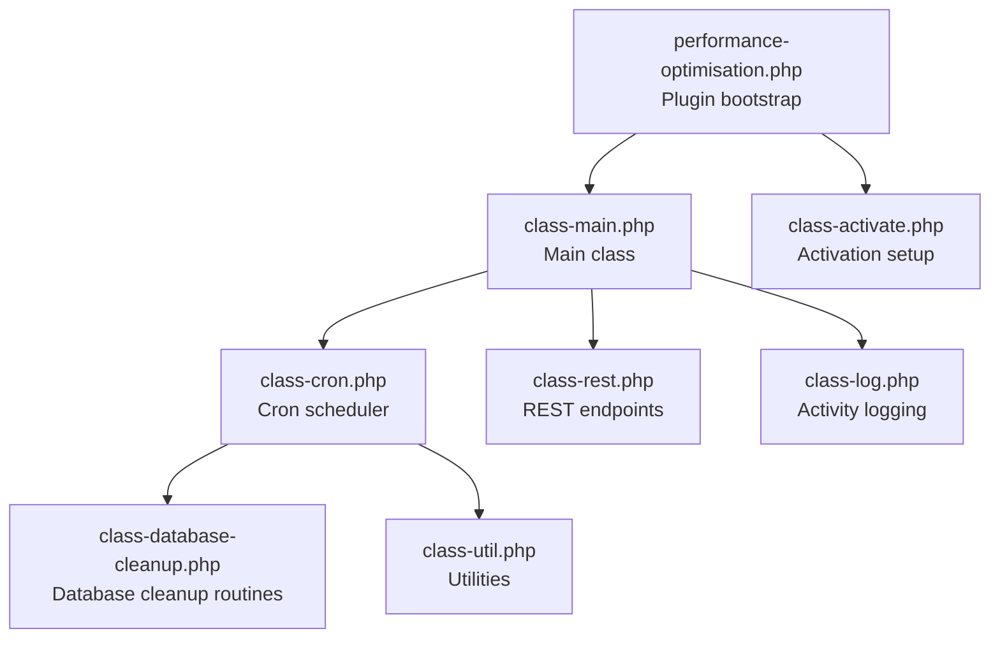
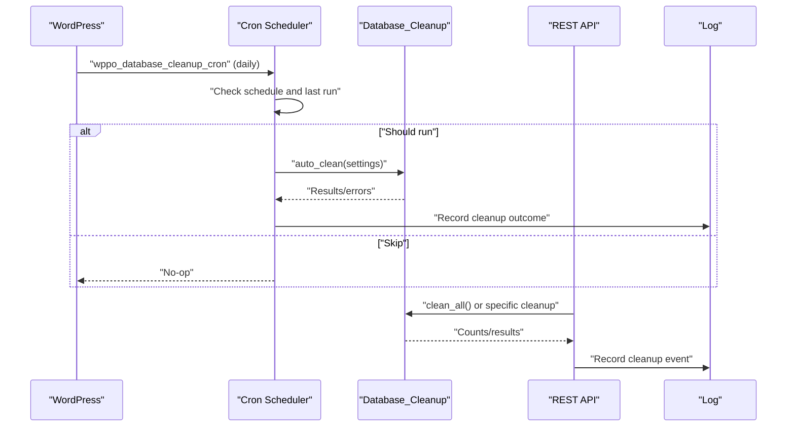
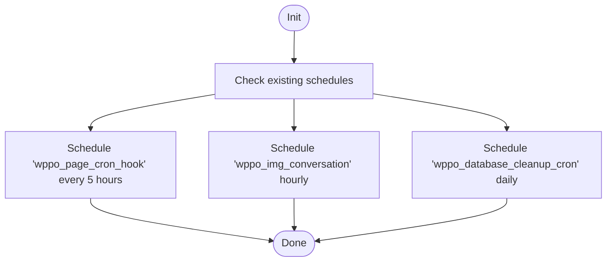
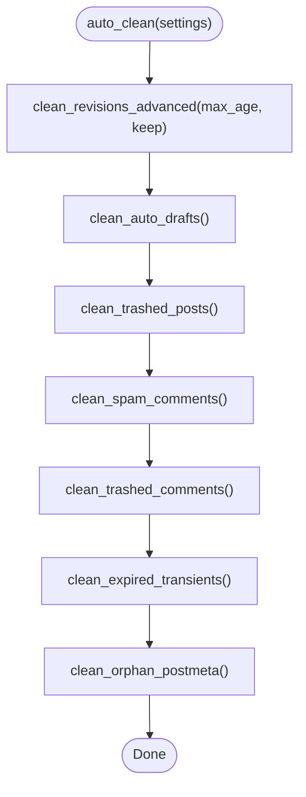
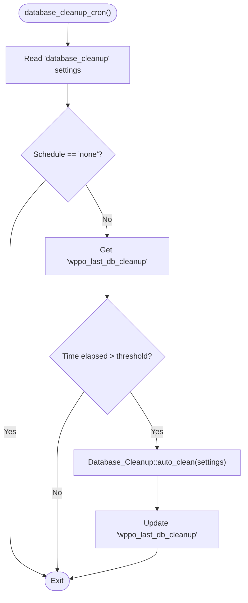
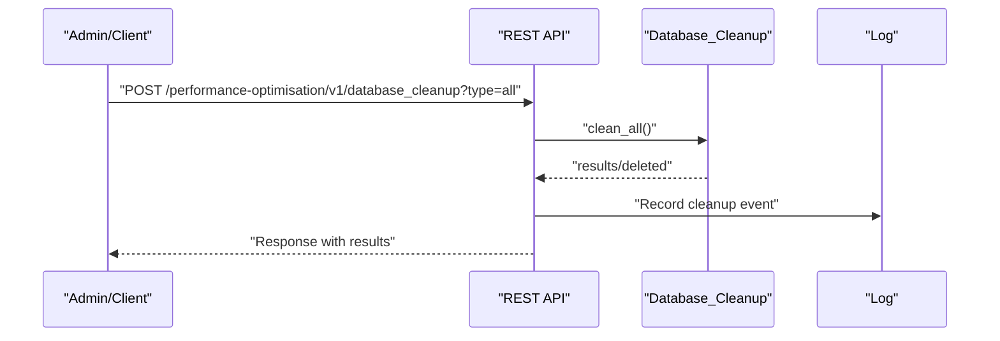
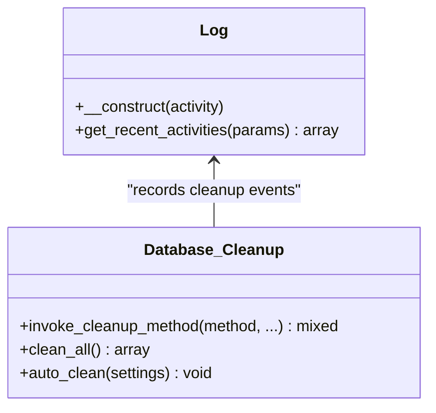
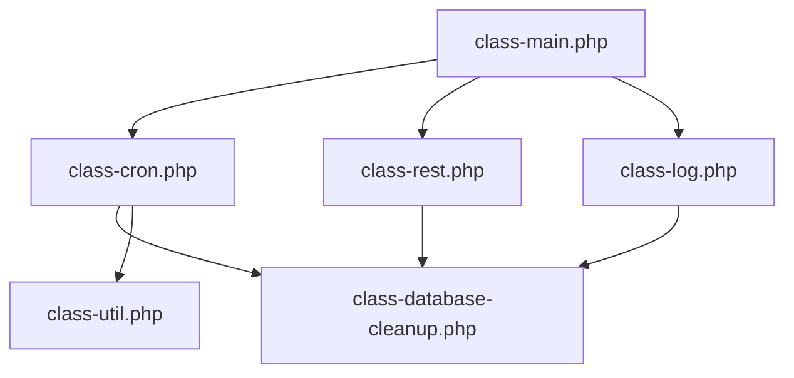

# Cron Scheduling System

<cite>
**Referenced Files in This Document**
- [performance-optimisation.php](file://performance-optimisation.php)
- [class-main.php](file://includes/class-main.php)
- [class-cron.php](file://includes/class-cron.php)
- [class-database-cleanup.php](file://includes/class-database-cleanup.php)
- [class-rest.php](file://includes/class-rest.php)
- [class-log.php](file://includes/class-log.php)
- [class-activate.php](file://includes/class-activate.php)
- [class-util.php](file://includes/class-util.php)
</cite>

## Table of Contents
1. [Introduction](#introduction)
2. [Project Structure](#project-structure)
3. [Core Components](#core-components)
4. [Architecture Overview](#architecture-overview)
5. [Detailed Component Analysis](#detailed-component-analysis)
6. [Dependency Analysis](#dependency-analysis)
7. [Performance Considerations](#performance-considerations)
8. [Troubleshooting Guide](#troubleshooting-guide)
9. [Conclusion](#conclusion)
10. [Appendices](#appendices)

## Introduction
This document explains the database maintenance scheduling system implemented in the plugin. It covers the cron job architecture, scheduled cleanup operations, background maintenance tasks, scheduling intervals, execution timing, and system resource management. It also documents the integration between cron jobs and cleanup processes, how cleanup operations are triggered and monitored, configuration options for cleanup frequency and performance tuning, and practical examples for customization and troubleshooting.

## Project Structure
The plugin initializes the main class on activation and registers the cron subsystem early in the WordPress lifecycle. The cron system schedules recurring tasks and integrates with the database cleanup module to perform automated maintenance.

**Diagram sources**
- [performance-optimisation.php:40-43](file://performance-optimisation.php#L40-L43)
- [class-main.php:128-154](file://includes/class-main.php#L128-L154)
- [class-cron.php:42-52](file://includes/class-cron.php#L42-L52)
- [class-database-cleanup.php:30](file://includes/class-database-cleanup.php#L30)
- [class-rest.php:450-551](file://includes/class-rest.php#L450-L551)
- [class-log.php:22](file://includes/class-log.php#L22)
- [class-activate.php:35](file://includes/class-activate.php#L35)
- [class-util.php:29](file://includes/class-util.php#L29)

**Section sources**
- [performance-optimisation.php:40-43](file://performance-optimisation.php#L40-L43)
- [class-main.php:128-154](file://includes/class-main.php#L128-L154)

## Core Components
- Cron scheduler: Manages scheduling of recurring tasks and triggers cleanup based on user settings.
- Database cleanup: Implements targeted cleanup routines and an automated cleanup pipeline.
- REST API: Exposes endpoints to trigger manual cleanup and fetch counts.
- Logging: Records cleanup events and plugin activity for monitoring.
- Utilities: Provides filesystem and URL processing helpers used by cleanup and caching.

Key responsibilities:
- Schedule recurring maintenance tasks at configurable intervals.
- Execute cleanup routines in batches to manage memory and runtime.
- Respect user-defined schedules and thresholds for automated runs.
- Provide visibility into cleanup progress and outcomes.

**Section sources**
- [class-cron.php:27-52](file://includes/class-cron.php#L27-L52)
- [class-database-cleanup.php:30](file://includes/class-database-cleanup.php#L30)
- [class-rest.php:450-551](file://includes/class-rest.php#L450-L551)
- [class-log.php:22](file://includes/class-log.php#L22)
- [class-util.php:29](file://includes/class-util.php#L29)

## Architecture Overview
The cron scheduling system integrates with WordPress’s event scheduler to run periodic tasks. The database cleanup is triggered either manually via REST endpoints or automatically based on user-selected schedules.

**Diagram sources**
- [class-cron.php:87-91](file://includes/class-cron.php#L87-L91)
- [class-cron.php:369-395](file://includes/class-cron.php#L369-L395)
- [class-database-cleanup.php:561-586](file://includes/class-database-cleanup.php#L561-L586)
- [class-rest.php:450-539](file://includes/class-rest.php#L450-L539)
- [class-log.php:32](file://includes/class-log.php#L32)

## Detailed Component Analysis

### Cron Scheduler
The scheduler registers hooks for recurring tasks and defines a custom “every 5 hours” interval. It schedules:
- Static page generation batch runner every 5 hours.
- Hourly image conversion job.
- Daily database cleanup job.

It also provides a callback to schedule subsequent batches of page generation and a method to clear all scheduled jobs.

**Diagram sources**
- [class-cron.php:79-91](file://includes/class-cron.php#L79-L91)

**Section sources**
- [class-cron.php:42-52](file://includes/class-cron.php#L42-L52)
- [class-cron.php:79-91](file://includes/class-cron.php#L79-L91)
- [class-cron.php:193-212](file://includes/class-cron.php#L193-L212)

### Database Cleanup Engine
The cleanup engine performs targeted maintenance across several categories:
- Post revisions (basic and advanced pruning with retention controls)
- Auto drafts
- Trashed posts
- Spam and trashed comments
- Expired transients
- Orphaned postmeta

It implements batched operations to avoid memory exhaustion and returns counts or errors. An automated mode runs a predefined sequence of cleanup methods based on user settings.

**Diagram sources**
- [class-database-cleanup.php:561-586](file://includes/class-database-cleanup.php#L561-L586)
- [class-database-cleanup.php:38-82](file://includes/class-database-cleanup.php#L38-L82)
- [class-database-cleanup.php:188-238](file://includes/class-database-cleanup.php#L188-L238)
- [class-database-cleanup.php:240-292](file://includes/class-database-cleanup.php#L240-L292)
- [class-database-cleanup.php:294-344](file://includes/class-database-cleanup.php#L294-L344)
- [class-database-cleanup.php:346-396](file://includes/class-database-cleanup.php#L346-L396)
- [class-database-cleanup.php:398-466](file://includes/class-database-cleanup.php#L398-L466)
- [class-database-cleanup.php:468-521](file://includes/class-database-cleanup.php#L468-L521)

**Section sources**
- [class-database-cleanup.php:38-82](file://includes/class-database-cleanup.php#L38-L82)
- [class-database-cleanup.php:188-238](file://includes/class-database-cleanup.php#L188-L238)
- [class-database-cleanup.php:240-292](file://includes/class-database-cleanup.php#L240-L292)
- [class-database-cleanup.php:294-344](file://includes/class-database-cleanup.php#L294-L344)
- [class-database-cleanup.php:346-396](file://includes/class-database-cleanup.php#L346-L396)
- [class-database-cleanup.php:398-466](file://includes/class-database-cleanup.php#L398-L466)
- [class-database-cleanup.php:468-521](file://includes/class-database-cleanup.php#L468-L521)
- [class-database-cleanup.php:529-546](file://includes/class-database-cleanup.php#L529-L546)
- [class-database-cleanup.php:561-586](file://includes/class-database-cleanup.php#L561-L586)

### Automated Cleanup Trigger
The automated cleanup is controlled by user settings and runs based on a schedule. The scheduler checks the last run timestamp and decides whether to execute the cleanup based on daily, weekly, or monthly cadence.

**Diagram sources**
- [class-cron.php:369-395](file://includes/class-cron.php#L369-L395)
- [class-database-cleanup.php:561-586](file://includes/class-database-cleanup.php#L561-L586)

**Section sources**
- [class-cron.php:369-395](file://includes/class-cron.php#L369-L395)

### Manual Cleanup via REST
The REST API exposes endpoints to trigger cleanup operations and retrieve counts. These endpoints call cleanup methods and record activity logs.

**Diagram sources**
- [class-rest.php:450-539](file://includes/class-rest.php#L450-L539)
- [class-database-cleanup.php:529-546](file://includes/class-database-cleanup.php#L529-L546)
- [class-log.php:32](file://includes/class-log.php#L32)

**Section sources**
- [class-rest.php:450-539](file://includes/class-rest.php#L450-L539)

### Logging and Monitoring
Cleanup events are recorded in a dedicated activity log table. The logging class inserts entries and manages caching for recent activity retrieval.

**Diagram sources**
- [class-log.php:22](file://includes/class-log.php#L22)
- [class-database-cleanup.php:644-650](file://includes/class-database-cleanup.php#L644-L650)
- [class-database-cleanup.php:529-546](file://includes/class-database-cleanup.php#L529-L546)

**Section sources**
- [class-log.php:22](file://includes/class-log.php#L22)
- [class-database-cleanup.php:582-585](file://includes/class-database-cleanup.php#L582-L585)

## Dependency Analysis
The cron scheduler depends on the database cleanup module and WordPress’s event scheduler. The main class wires everything together and exposes REST endpoints. Utilities support filesystem operations used by cleanup and caching.

**Diagram sources**
- [class-main.php:128-154](file://includes/class-main.php#L128-L154)
- [class-cron.php:42-52](file://includes/class-cron.php#L42-L52)
- [class-rest.php:450-551](file://includes/class-rest.php#L450-L551)
- [class-log.php:22](file://includes/class-log.php#L22)
- [class-database-cleanup.php:30](file://includes/class-database-cleanup.php#L30)
- [class-util.php:29](file://includes/class-util.php#L29)

**Section sources**
- [class-main.php:128-154](file://includes/class-main.php#L128-L154)
- [class-cron.php:42-52](file://includes/class-cron.php#L42-L52)

## Performance Considerations
- Batched operations: Cleanup methods iterate in fixed-size batches to avoid memory spikes and long-running queries.
- Prepared statements: Direct queries use prepared placeholders to mitigate SQL injection risks and improve performance.
- Conditional execution: Automated cleanup checks elapsed time against thresholds to avoid redundant runs.
- Filesystem operations: Utilities initialize the WordPress filesystem abstraction to safely manage cache and static files.
- Logging overhead: Activity logs are cached and inserted efficiently to minimize impact on cleanup runtime.

Best practices:
- Monitor database sizes and adjust batch sizes if needed.
- Schedule cleanup during off-peak hours to reduce impact on site performance.
- Use the REST endpoints for targeted cleanup when immediate action is required.

**Section sources**
- [class-database-cleanup.php:44-79](file://includes/class-database-cleanup.php#L44-L79)
- [class-database-cleanup.php:102-184](file://includes/class-database-cleanup.php#L102-L184)
- [class-database-cleanup.php:198-235](file://includes/class-database-cleanup.php#L198-L235)
- [class-database-cleanup.php:252-289](file://includes/class-database-cleanup.php#L252-L289)
- [class-database-cleanup.php:304-341](file://includes/class-database-cleanup.php#L304-L341)
- [class-database-cleanup.php:355-393](file://includes/class-database-cleanup.php#L355-L393)
- [class-database-cleanup.php:415-463](file://includes/class-database-cleanup.php#L415-L463)
- [class-database-cleanup.php:481-518](file://includes/class-database-cleanup.php#L481-L518)
- [class-cron.php:383-389](file://includes/class-cron.php#L383-L389)
- [class-util.php:67-80](file://includes/class-util.php#L67-L80)
- [class-log.php:82-127](file://includes/class-log.php#L82-L127)

## Troubleshooting Guide
Common issues and resolutions:
- Cron not running:
  - Verify WordPress cron is functioning and scheduled hooks exist.
  - Check that the database cleanup schedule is not set to “none”.
  - Inspect the activity log for errors or skipped runs.
- Cleanup not executed:
  - Confirm elapsed time since last run meets the selected schedule threshold.
  - Review settings for database cleanup frequency and thresholds.
- Performance degradation:
  - Reduce batch sizes or defer cleanup to off-hours.
  - Monitor database growth and adjust cleanup frequency accordingly.
- Manual cleanup failures:
  - Use REST endpoints to trigger specific cleanup types and inspect error messages.
  - Check filesystem permissions if cache or static file operations fail.

Monitoring:
- Use the REST endpoint to fetch cleanup counts and verify effectiveness.
- Review recent activity logs for cleanup events and timestamps.

**Section sources**
- [class-cron.php:369-395](file://includes/class-cron.php#L369-L395)
- [class-rest.php:548-551](file://includes/class-rest.php#L548-L551)
- [class-log.php:73-130](file://includes/class-log.php#L73-L130)

## Conclusion
The plugin’s cron scheduling system provides a robust framework for automated database maintenance. By combining scheduled runs with manual triggers and comprehensive logging, it enables reliable cleanup operations that improve database health and site performance. Proper configuration of schedules and thresholds, along with monitoring and troubleshooting practices, ensures optimal results.

## Appendices

### Configuration Options for Cleanup
- Schedule frequency:
  - None (manual only)
  - Daily
  - Weekly
  - Monthly
- Revision retention:
  - Max age (days)
  - Keep latest revisions per post
- Execution timing:
  - Daily cleanup runs at a configurable cadence based on last run timestamp.
  - Hourly image conversion runs independently.
  - Static page generation batches are scheduled every 5 hours.

Customization examples:
- Change cleanup frequency:
  - Update the database cleanup settings to “weekly” or “monthly”.
- Adjust revision retention:
  - Modify “Max Age of Revisions to Keep” and “Always Keep Latest Revisions”.
- Trigger cleanup immediately:
  - Use the REST endpoint to run specific cleanup types or “all”.

**Section sources**
- [class-main.php:631-638](file://includes/class-main.php#L631-L638)
- [class-database-cleanup.php:557-563](file://includes/class-database-cleanup.php#L557-L563)
- [class-cron.php:87-91](file://includes/class-cron.php#L87-L91)
- [class-rest.php:450-539](file://includes/class-rest.php#L450-L539)