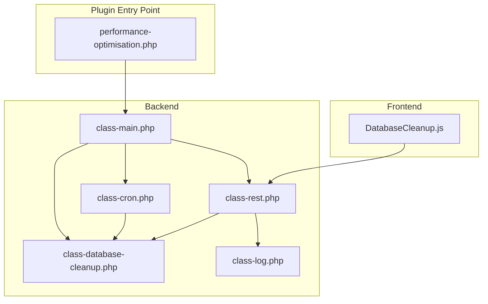
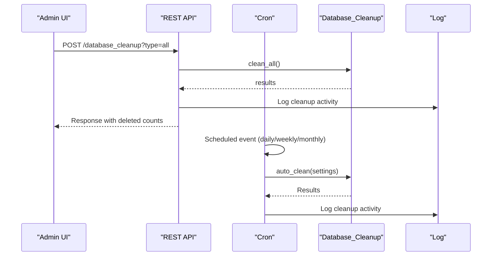
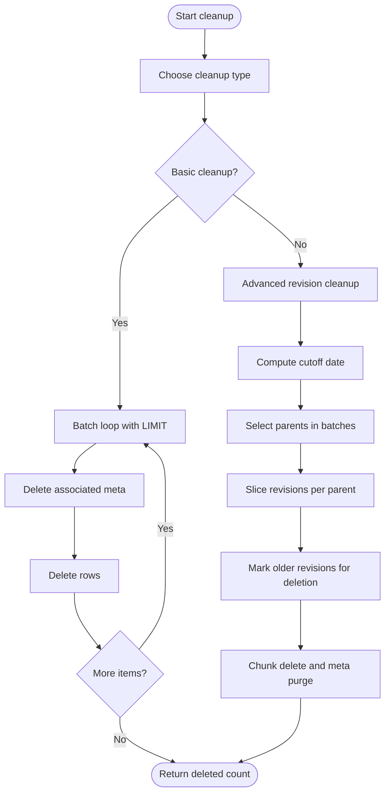
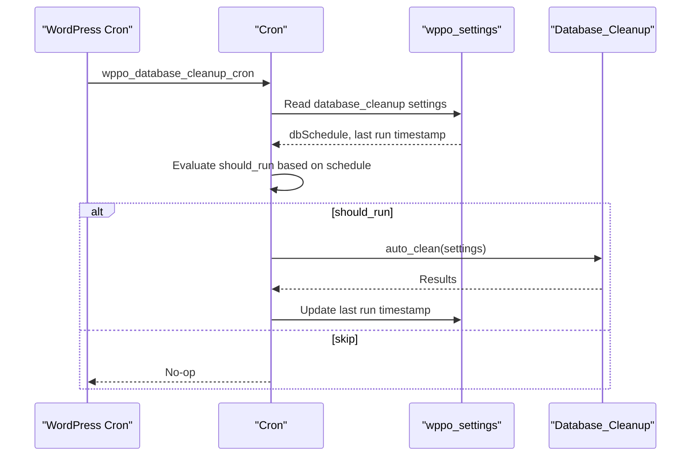
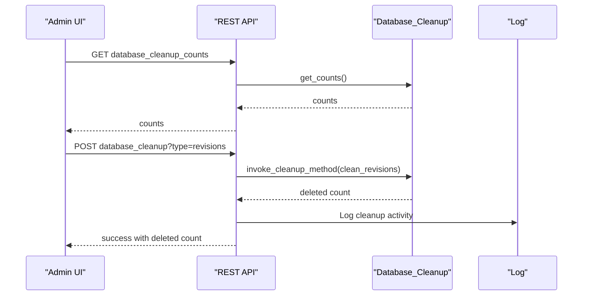
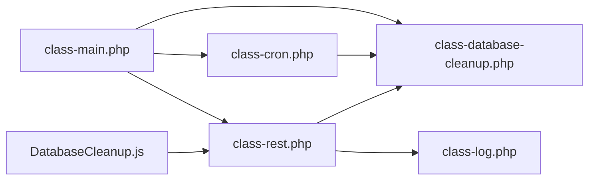

# Database Management

<cite>
**Referenced Files in This Document**
- [performance-optimisation.php](file://performance-optimisation.php)
- [includes/class-main.php](file://includes/class-main.php)
- [includes/class-cron.php](file://includes/class-cron.php)
- [includes/class-database-cleanup.php](file://includes/class-database-cleanup.php)
- [includes/class-rest.php](file://includes/class-rest.php)
- [includes/class-log.php](file://includes/class-log.php)
- [src/components/DatabaseCleanup.js](file://src/components/DatabaseCleanup.js)
</cite>

## Table of Contents
1. [Introduction](#introduction)
2. [Project Structure](#project-structure)
3. [Core Components](#core-components)
4. [Architecture Overview](#architecture-overview)
5. [Detailed Component Analysis](#detailed-component-analysis)
6. [Dependency Analysis](#dependency-analysis)
7. [Performance Considerations](#performance-considerations)
8. [Troubleshooting Guide](#troubleshooting-guide)
9. [Conclusion](#conclusion)

## Introduction
This document explains the database management system implemented in the Performance Optimisation plugin. It covers automated cleanup processes for post revisions, auto drafts, trashed posts and comments, spam comments, expired transients, and orphaned post meta. It documents the cron job scheduling system, background maintenance tasks, optimization strategies, configuration options, and practical troubleshooting guidance.

## Project Structure
The database management system spans backend PHP classes and a React-based admin interface:
- Backend: PHP classes handle cleanup logic, cron scheduling, REST API endpoints, and logging.
- Frontend: A React component provides a user interface to configure automated cleanup, view counts, and trigger manual cleanup.

**Diagram sources**
- [performance-optimisation.php:1-68](file://performance-optimisation.php#L1-L68)
- [includes/class-main.php:1-1131](file://includes/class-main.php#L1-L1131)
- [includes/class-cron.php:1-397](file://includes/class-cron.php#L1-L397)
- [includes/class-database-cleanup.php:1-652](file://includes/class-database-cleanup.php#L1-L652)
- [includes/class-rest.php:1-843](file://includes/class-rest.php#L1-L843)
- [includes/class-log.php:1-132](file://includes/class-log.php#L1-L132)
- [src/components/DatabaseCleanup.js:1-379](file://src/components/DatabaseCleanup.js#L1-L379)

**Section sources**
- [performance-optimisation.php:1-68](file://performance-optimisation.php#L1-L68)
- [includes/class-main.php:128-154](file://includes/class-main.php#L128-L154)

## Core Components
- Database_Cleanup: Implements targeted cleanup methods for revisions, auto drafts, trashed posts, spam comments, trashed comments, expired transients, and orphaned post meta. It supports batched operations and advanced revision pruning with configurable retention policies.
- Cron: Schedules periodic maintenance tasks, including daily database cleanup based on user settings, and other static page generation and image optimization jobs.
- REST: Exposes REST endpoints for manual cleanup, retrieving cleanup counts, and updating settings.
- Log: Manages activity logging for cleanup operations and other plugin actions.
- DatabaseCleanup UI: React component that renders the admin interface for configuring automated cleanup and triggering cleanup operations.

Key capabilities:
- Batched cleanup to avoid memory pressure and timeouts.
- Advanced revision cleanup with configurable maximum age and number of latest revisions to keep per post.
- Automated cleanup scheduled via cron with configurable frequency (daily, weekly, monthly).
- Real-time counts of cleanup candidates via REST endpoint.
- Logging of cleanup actions for auditability.

**Section sources**
- [includes/class-database-cleanup.php:30-652](file://includes/class-database-cleanup.php#L30-L652)
- [includes/class-cron.php:27-397](file://includes/class-cron.php#L27-L397)
- [includes/class-rest.php:434-551](file://includes/class-rest.php#L434-L551)
- [includes/class-log.php:22-132](file://includes/class-log.php#L22-L132)
- [src/components/DatabaseCleanup.js:17-53](file://src/components/DatabaseCleanup.js#L17-L53)

## Architecture Overview
The system integrates WordPress hooks, cron scheduling, and REST endpoints to deliver a robust database maintenance solution.

**Diagram sources**
- [includes/class-rest.php:434-539](file://includes/class-rest.php#L434-L539)
- [includes/class-cron.php:369-395](file://includes/class-cron.php#L369-L395)
- [includes/class-database-cleanup.php:529-586](file://includes/class-database-cleanup.php#L529-L586)
- [includes/class-log.php:32-62](file://includes/class-log.php#L32-L62)

## Detailed Component Analysis

### Database_Cleanup: Automated Cleanup Engine
Responsibilities:
- Clean post revisions (basic and advanced).
- Remove auto drafts.
- Delete trashed posts and comments.
- Purge spam and trashed comments.
- Expire transients and their timeout entries.
- Remove orphaned post meta.
- Aggregate counts for each cleanup category.
- Execute cleanup methods and convert failures to errors.

Batching strategy:
- Uses LIMIT clauses to process deletions in chunks (e.g., 1000 for posts, 5000 for orphaned post meta).
- Iterates until fewer items than the batch size remain.
- Applies prepared statements to prevent SQL injection.

Advanced revision cleanup:
- Computes a cutoff date based on maximum age in days.
- Retains a configurable number of latest revisions per parent post.
- Processes parents in batches to avoid excessive memory usage.

Error handling:
- Returns false on SQL errors, which is converted to WP_Error by the invocation wrapper.
- Logs failures via the Log class.

**Diagram sources**
- [includes/class-database-cleanup.php:38-186](file://includes/class-database-cleanup.php#L38-L186)
- [includes/class-database-cleanup.php:188-521](file://includes/class-database-cleanup.php#L188-L521)

**Section sources**
- [includes/class-database-cleanup.php:30-652](file://includes/class-database-cleanup.php#L30-L652)

### Cron: Scheduling and Maintenance
Responsibilities:
- Registers custom cron intervals (every 5 hours).
- Schedules recurring tasks including static page generation, image conversion, and database cleanup.
- Implements database cleanup callback that respects user-specified schedule and last-run timing.
- Provides helpers to clear scheduled jobs and manage batched page generation.

Database cleanup scheduling:
- Daily database cleanup is scheduled on activation if not already scheduled.
- The cleanup callback checks the user’s selected frequency and last run timestamp to decide whether to execute.
- Supports daily, weekly, and monthly frequencies with safety windows to avoid frequent runs.

**Diagram sources**
- [includes/class-cron.php:79-91](file://includes/class-cron.php#L79-L91)
- [includes/class-cron.php:369-395](file://includes/class-cron.php#L369-L395)

**Section sources**
- [includes/class-cron.php:27-397](file://includes/class-cron.php#L27-L397)

### REST API: Manual Cleanup and Counts
Endpoints:
- POST /performance-optimisation/v1/database_cleanup: Executes cleanup for a specific type or all types.
- GET /performance-optimisation/v1/database_cleanup_counts: Returns current counts for each cleanup category.
- POST /performance-optimisation/v1/update_settings: Saves database cleanup settings.

Behavior:
- Validates cleanup type and maps to appropriate cleanup method.
- Aggregates results for “all” cleanup and reports failures.
- Logs cleanup actions with timestamps and counts.

**Diagram sources**
- [includes/class-rest.php:434-551](file://includes/class-rest.php#L434-L551)
- [includes/class-database-cleanup.php:598-634](file://includes/class-database-cleanup.php#L598-L634)
- [includes/class-log.php:32-62](file://includes/class-log.php#L32-L62)

**Section sources**
- [includes/class-rest.php:434-551](file://includes/class-rest.php#L434-L551)

### Log: Activity Tracking
Responsibilities:
- Insert activity logs with sanitized HTML.
- Paginated retrieval with caching for performance.
- Cache invalidation on insert.

Integration:
- Used by cleanup operations and other plugin actions to record timestamps and outcomes.

**Section sources**
- [includes/class-log.php:22-132](file://includes/class-log.php#L22-L132)

### DatabaseCleanup UI: Admin Interface
Features:
- Automated cleanup configuration with schedule frequency and revision retention controls.
- Real-time counts display for each cleanup category.
- Granular cleanup buttons for each category and an “Optimize Everything” button.
- Confirmation dialogs for destructive operations.
- Notification feedback for successes and failures.

Configuration options exposed:
- dbSchedule: none/daily/weekly/monthly.
- dbRevMaxAge: maximum age in days for revision pruning.
- dbRevKeepLatest: number of latest revisions to keep per post.

**Section sources**
- [src/components/DatabaseCleanup.js:55-379](file://src/components/DatabaseCleanup.js#L55-L379)

## Dependency Analysis
The system exhibits clear separation of concerns:
- Main orchestrates inclusion of classes and sets up hooks.
- Cron depends on Database_Cleanup for execution and uses WordPress cron facilities.
- REST depends on Database_Cleanup for operations and Log for auditing.
- UI depends on REST endpoints for counts and cleanup actions.

**Diagram sources**
- [includes/class-main.php:128-154](file://includes/class-main.php#L128-L154)
- [includes/class-cron.php:27-52](file://includes/class-cron.php#L27-L52)
- [includes/class-rest.php:37-43](file://includes/class-rest.php#L37-L43)

**Section sources**
- [includes/class-main.php:128-154](file://includes/class-main.php#L128-L154)

## Performance Considerations
- Batched operations: All cleanup methods use LIMIT clauses and iterative loops to process deletions in small chunks, preventing memory exhaustion and long-running transactions.
- Prepared statements: Queries use prepared statements to mitigate SQL injection risks and leverage database query plans.
- Index usage: Cleanup relies on standard WordPress table indexes (post_type, post_status, comment_approved, option_name). No custom indexes are created by the plugin.
- Memory footprint: Advanced revision cleanup iterates parents in batches and slices revisions per parent to minimize PHP object overhead.
- Concurrency: Cron-based cleanup avoids blocking user requests; manual cleanup via REST runs synchronously but is scoped to a single cleanup type or “all”.

[No sources needed since this section provides general guidance]

## Troubleshooting Guide
Common issues and resolutions:
- Cleanup returns zero or partial results:
  - Verify the cleanup type exists and is valid.
  - Check database connectivity and permissions.
  - Review logs for SQL errors.
- SQL errors during cleanup:
  - Inspect the database error reported by the cleanup method.
  - Ensure the database user has DELETE privileges on relevant tables.
- Cron not running:
  - Confirm cron is enabled and WordPress cron is functioning.
  - Verify the scheduled event exists and is not blocked by other plugins.
  - Check the last run timestamp and schedule settings.
- UI shows outdated counts:
  - Trigger a refresh in the admin UI.
  - Ensure the REST endpoint is reachable and not blocked by security plugins.
- Performance impact during cleanup:
  - Reduce batch sizes or frequency.
  - Run cleanup during low-traffic periods.
  - Monitor database query performance and consider server-side tuning.

Operational tips:
- Use granular cleanup for targeted removals when full cleanup is not desired.
- Configure advanced revision retention to balance storage and history needs.
- Monitor cleanup logs to track effectiveness and detect recurring issues.

**Section sources**
- [includes/class-database-cleanup.php:644-650](file://includes/class-database-cleanup.php#L644-L650)
- [includes/class-rest.php:451-539](file://includes/class-rest.php#L451-L539)
- [includes/class-log.php:73-130](file://includes/class-log.php#L73-L130)

## Conclusion
The database management system provides a comprehensive, configurable, and performant solution for cleaning WordPress databases. It combines batched operations, advanced revision retention, and scheduled maintenance to keep sites lean and responsive. The REST-driven UI enables both manual and automated cleanup, while logging ensures visibility into cleanup outcomes. Proper configuration and monitoring help maintain optimal performance over time.