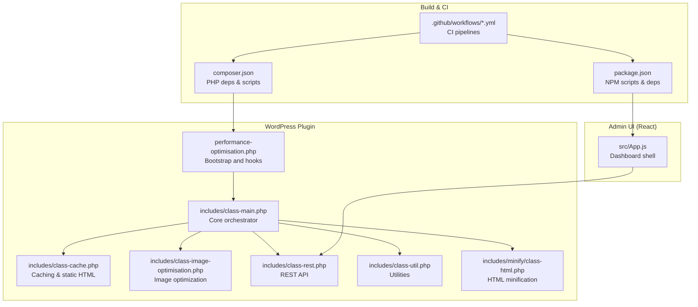
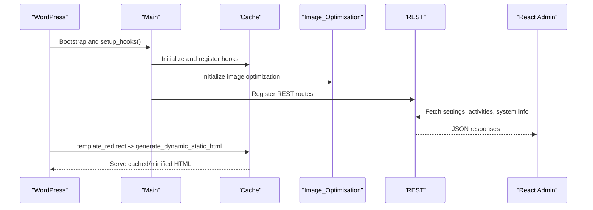
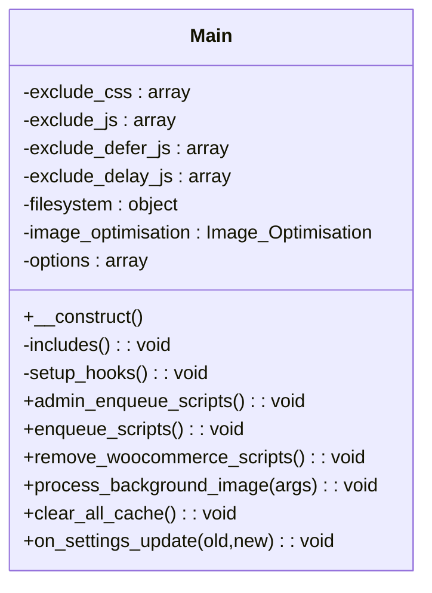
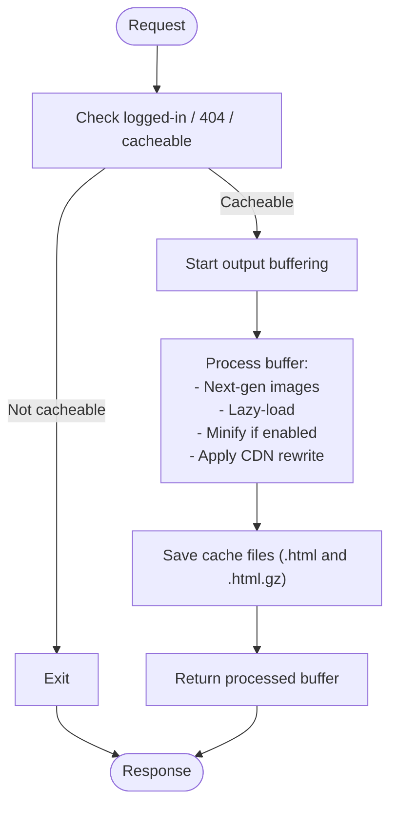
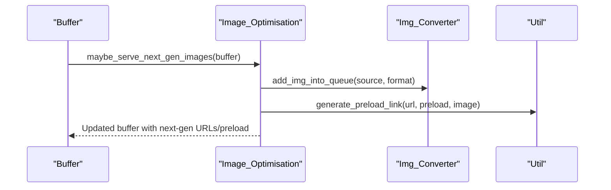
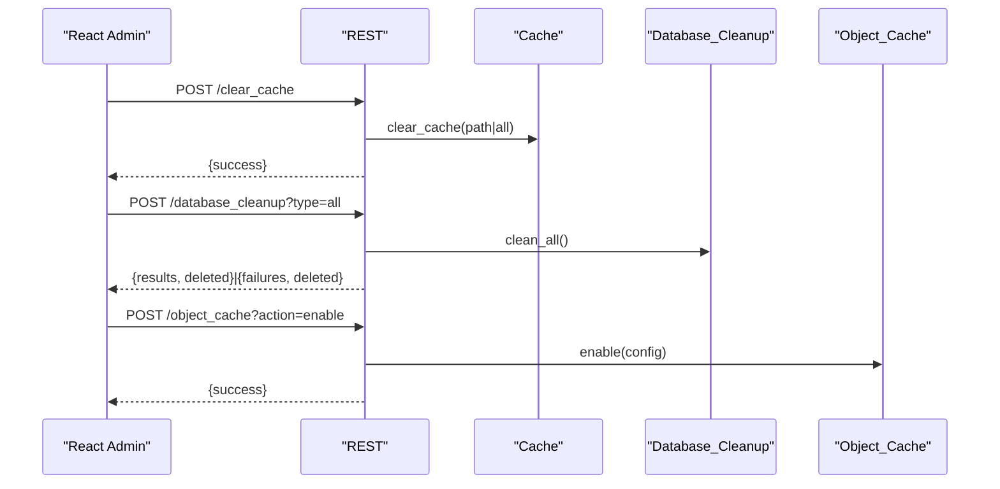
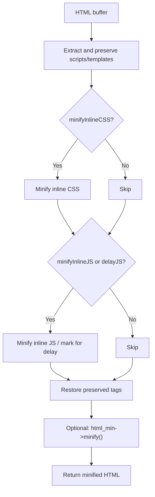
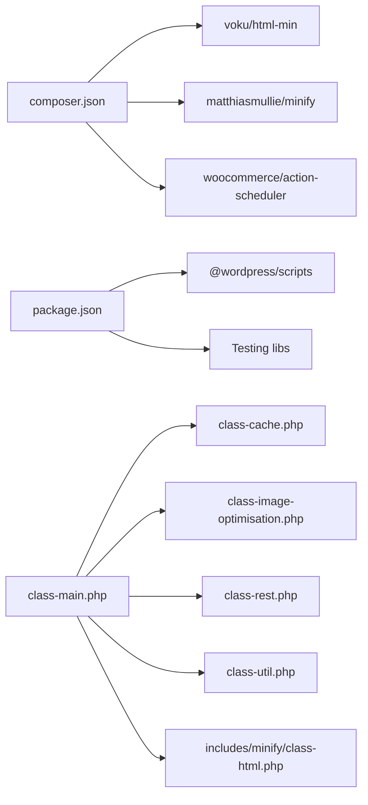

# Development Guide

<cite>
**Referenced Files in This Document**
- [performance-optimisation.php](file://performance-optimisation.php)
- [class-main.php](file://includes/class-main.php)
- [class-cache.php](file://includes/class-cache.php)
- [class-image-optimisation.php](file://includes/class-image-optimisation.php)
- [class-rest.php](file://includes/class-rest.php)
- [class-util.php](file://includes/class-util.php)
- [class-html.php](file://includes/minify/class-html.php)
- [App.js](file://src/App.js)
- [package.json](file://package.json)
- [composer.json](file://composer.json)
- [webpack.yml](file://.github/workflows/webpack.yml)
- [psalm-wpcs-check.yml](file://.github/workflows/psalm-wpcs-check.yml)
- [readme.md](file://readme.md)
</cite>

## Table of Contents
1. [Introduction](#introduction)
2. [Project Structure](#project-structure)
3. [Core Components](#core-components)
4. [Architecture Overview](#architecture-overview)
5. [Detailed Component Analysis](#detailed-component-analysis)
6. [Dependency Analysis](#dependency-analysis)
7. [Performance Considerations](#performance-considerations)
8. [Testing Strategies](#testing-strategies)
9. [Build Processes](#build-processes)
10. [Deployment Procedures](#deployment-procedures)
11. [Contribution Guidelines](#contribution-guidelines)
12. [Coding Standards](#coding-standards)
13. [Extension Points](#extension-points)
14. [Adding New Optimization Features](#adding-new-optimization-features)
15. [Debugging Techniques](#debugging-techniques)
16. [Performance Profiling](#performance-profiling)
17. [Common Development Tasks](#common-development-tasks)
18. [Best Practices](#best-practices)
19. [Troubleshooting Guide](#troubleshooting-guide)
20. [Conclusion](#conclusion)

## Introduction
This guide provides comprehensive development documentation for contributors and developers working on the Performance Optimisation plugin for WordPress. It explains the codebase structure, development environment setup, contribution guidelines, testing strategies, build processes, deployment procedures, coding standards, architectural patterns, extension points, and practical guidance for adding new optimization features, debugging, and performance profiling.

## Project Structure
The plugin follows a layered architecture:
- PHP backend in includes/ handles core logic, caching, minification, REST API, and WordPress integration.
- Frontend React admin UI in src/ provides a dashboard for configuration and monitoring.
- Build artifacts in build/ generated by Webpack.
- Composer-managed PHP dependencies and NPM-managed frontend dependencies.

**Diagram sources**
- [performance-optimisation.php:1-68](file://performance-optimisation.php#L1-L68)
- [class-main.php:1-120](file://includes/class-main.php#L1-L120)
- [class-cache.php:1-120](file://includes/class-cache.php#L1-L120)
- [class-image-optimisation.php:1-80](file://includes/class-image-optimisation.php#L1-L80)
- [class-rest.php:1-60](file://includes/class-rest.php#L1-L60)
- [class-util.php:1-40](file://includes/class-util.php#L1-L40)
- [class-html.php:1-40](file://includes/minify/class-html.php#L1-L40)
- [App.js:1-40](file://src/App.js#L1-L40)
- [package.json:1-31](file://package.json#L1-L31)
- [composer.json:1-40](file://composer.json#L1-L40)
- [webpack.yml:1-46](file://.github/workflows/webpack.yml#L1-L46)
- [psalm-wpcs-check.yml:1-40](file://.github/workflows/psalm-wpcs-check.yml#L1-L40)

**Section sources**
- [performance-optimisation.php:1-68](file://performance-optimisation.php#L1-L68)
- [class-main.php:1-120](file://includes/class-main.php#L1-L120)
- [App.js:1-40](file://src/App.js#L1-L40)
- [package.json:1-31](file://package.json#L1-L31)
- [composer.json:1-40](file://composer.json#L1-L40)

## Core Components
- Bootstrap and hooks: Initializes plugin constants, loads the main class, and registers activation/deactivation hooks.
- Main orchestrator: Includes dependencies, sets up WordPress hooks, initializes subsystems, and manages settings.
- Caching engine: Generates and serves dynamic static HTML, combines CSS, stores cache files, and invalidates cache on content changes.
- Image optimization: Converts images to WebP/AVIF, preloads critical images, lazy-loads offscreen images/videos, and injects preload hints.
- REST API: Exposes endpoints for cache management, settings updates, image optimization, database cleanup, object cache, diagnostics, and performance scans.
- Utilities: Provides filesystem helpers, URL normalization, preload link generation, and minified asset counting.
- HTML minification: Preserves critical script/template tags, minifies inline CSS/JS, and safely transforms inline JS for deferred execution.

**Section sources**
- [performance-optimisation.php:26-68](file://performance-optimisation.php#L26-L68)
- [class-main.php:98-154](file://includes/class-main.php#L98-L154)
- [class-cache.php:32-120](file://includes/class-cache.php#L32-L120)
- [class-image-optimisation.php:27-84](file://includes/class-image-optimisation.php#L27-L84)
- [class-rest.php:37-123](file://includes/class-rest.php#L37-L123)
- [class-util.php:29-80](file://includes/class-util.php#L29-L80)
- [class-html.php:32-107](file://includes/minify/class-html.php#L32-L107)

## Architecture Overview
The plugin integrates WordPress hooks with a modular PHP backend and a React admin UI. The main orchestrator wires subsystems and exposes REST endpoints consumed by the UI.

**Diagram sources**
- [class-main.php:164-241](file://includes/class-main.php#L164-L241)
- [class-cache.php:260-276](file://includes/class-cache.php#L260-L276)
- [class-rest.php:37-123](file://includes/class-rest.php#L37-L123)
- [App.js:77-112](file://src/App.js#L77-L112)

## Detailed Component Analysis

### Main Orchestrator
Responsibilities:
- Load dependencies and subsystems.
- Register WordPress actions/filters.
- Initialize caching, image optimization, REST, cron, and admin UI.
- Handle settings updates and .htaccess rule updates.

Key behaviors:
- Conditional minification and defer/delay logic based on settings.
- Background image conversion via Action Scheduler.
- Cache invalidation on structural changes.

**Diagram sources**
- [class-main.php:29-118](file://includes/class-main.php#L29-L118)
- [class-main.php:164-241](file://includes/class-main.php#L164-L241)

**Section sources**
- [class-main.php:98-154](file://includes/class-main.php#L98-L154)
- [class-main.php:243-290](file://includes/class-main.php#L243-L290)

### Caching Engine
Responsibilities:
- Generate dynamic static HTML with minification and CDN rewriting.
- Combine CSS and preload critical assets.
- Store cache files with gzip compression.
- Invalidate cache on content changes and structural updates.

**Diagram sources**
- [class-cache.php:260-310](file://includes/class-cache.php#L260-L310)
- [class-cache.php:470-483](file://includes/class-cache.php#L470-L483)

**Section sources**
- [class-cache.php:250-381](file://includes/class-cache.php#L250-L381)
- [class-cache.php:492-536](file://includes/class-cache.php#L492-L536)

### Image Optimization
Responsibilities:
- Convert images to WebP/AVIF when supported.
- Preload critical images for front page, meta, and post types.
- Lazy-load images and videos with placeholders and MutationObserver.
- Generate preload links with media queries and fetchpriority hints.

**Diagram sources**
- [class-image-optimisation.php:95-208](file://includes/class-image-optimisation.php#L95-L208)
- [class-image-optimisation.php:566-592](file://includes/class-image-optimisation.php#L566-L592)

**Section sources**
- [class-image-optimisation.php:95-290](file://includes/class-image-optimisation.php#L95-L290)
- [class-image-optimisation.php:566-592](file://includes/class-image-optimisation.php#L566-L592)

### REST API
Endpoints:
- Cache management: clear single or all cache.
- Settings: update settings and sanitize inputs.
- Image optimization: queue background conversions or run synchronously.
- Database cleanup: clean specific or all categories.
- Object cache: status, ping, enable/disable, flush.
- Diagnostics: system info and performance scan.

**Diagram sources**
- [class-rest.php:145-175](file://includes/class-rest.php#L145-L175)
- [class-rest.php:451-539](file://includes/class-rest.php#L451-L539)
- [class-rest.php:636-695](file://includes/class-rest.php#L636-L695)

**Section sources**
- [class-rest.php:37-123](file://includes/class-rest.php#L37-L123)
- [class-rest.php:145-200](file://includes/class-rest.php#L145-L200)
- [class-rest.php:253-353](file://includes/class-rest.php#L253-L353)
- [class-rest.php:451-539](file://includes/class-rest.php#L451-L539)
- [class-rest.php:636-695](file://includes/class-rest.php#L636-L695)

### HTML Minification
Features:
- Preserve critical script/template tags.
- Minify inline CSS/JS safely.
- Transform inline JS for deferred execution when delayJS is enabled.

**Diagram sources**
- [class-html.php:116-143](file://includes/minify/class-html.php#L116-L143)
- [class-html.php:264-342](file://includes/minify/class-html.php#L264-L342)

**Section sources**
- [class-html.php:116-143](file://includes/minify/class-html.php#L116-L143)
- [class-html.php:264-342](file://includes/minify/class-html.php#L264-L342)

## Dependency Analysis
- PHP dependencies managed via Composer (libraries for HTML/CSS/JS minification, Action Scheduler).
- NPM dependencies for React, WordPress scripts, and testing utilities.
- WordPress hooks orchestrate lifecycle events and integrate with caching and admin UI.
- REST endpoints depend on internal classes for cache, database cleanup, and object cache.

**Diagram sources**
- [composer.json:11-15](file://composer.json#L11-L15)
- [composer.json:22-27](file://composer.json#L22-L27)
- [package.json:16-25](file://package.json#L16-L25)
- [class-main.php:128-154](file://includes/class-main.php#L128-L154)

**Section sources**
- [composer.json:11-27](file://composer.json#L11-L27)
- [package.json:16-25](file://package.json#L16-L25)
- [class-main.php:128-154](file://includes/class-main.php#L128-L154)

## Performance Considerations
- Prefer background processing for heavy tasks (image conversion) using Action Scheduler.
- Use gzip compression for cached HTML to reduce bandwidth.
- Minimize DOM mutations by leveraging WP_HTML_Tag_Processor when available; fallback to regex for compatibility.
- Cache filesystem operations and computed metrics (e.g., cache size) with transients.
- Avoid aggressive minification on inline scripts that must run immediately; use defer/delay selectively.

[No sources needed since this section provides general guidance]

## Testing Strategies
- Unit tests for JavaScript components and utilities using Jest via WordPress scripts.
- PHP code quality enforced by WPCS and Psalm in CI.
- Parallel linting across PHP versions.
- Automated artifact builds for frontend assets.

**Section sources**
- [package.json:10-12](file://package.json#L10-L12)
- [psalm-wpcs-check.yml:55-76](file://.github/workflows/psalm-wpcs-check.yml#L55-L76)
- [webpack.yml:37-45](file://.github/workflows/webpack.yml#L37-L45)

## Build Processes
- Frontend build: Webpack via @wordpress/scripts; outputs to build/.
- Scripts: build, start, lint, test, makepot.
- CI build: Node version from .nvmrc; installs dependencies; builds assets; uploads build artifact.

**Section sources**
- [package.json:6-13](file://package.json#L6-L13)
- [webpack.yml:19-35](file://.github/workflows/webpack.yml#L19-L35)

## Deployment Procedures
- Backend: Composer install with dev dependencies disabled for production.
- Frontend: npm run build to generate production bundles.
- Upload plugin folder to wp-content/plugins/ and activate in WordPress.

**Section sources**
- [readme.md:94-107](file://readme.md#L94-L107)
- [composer.json:33-38](file://composer.json#L33-L38)

## Contribution Guidelines
- Use the repository’s issue tracker for contributions and feature requests.
- Follow PHP code style (WPCS) and run composer scripts for linting and fixing.
- Ensure frontend tests pass and build artifacts are produced in CI.

**Section sources**
- [readme.md:172-176](file://readme.md#L172-L176)
- [composer.json:34-35](file://composer.json#L34-L35)

## Coding Standards
- PHP: PSR-12 compliant via WPCS; automated checks in CI.
- JavaScript: linting via @wordpress/scripts; unit tests via Jest.
- WordPress: use of WordPress APIs, sanitization, escaping, and nonce verification for REST endpoints.

**Section sources**
- [psalm-wpcs-check.yml:55-58](file://.github/workflows/psalm-wpcs-check.yml#L55-L58)
- [package.json:10-12](file://package.json#L10-L12)
- [class-rest.php:131-136](file://includes/class-rest.php#L131-L136)

## Extension Points
- Hook into main orchestrator for additional filters/actions.
- Extend REST endpoints for new features.
- Add new minification passes in HTML minifier.
- Integrate new image formats or conversion strategies.

**Section sources**
- [class-main.php:164-241](file://includes/class-main.php#L164-L241)
- [class-rest.php:37-123](file://includes/class-rest.php#L37-L123)
- [class-html.php:64-107](file://includes/minify/class-html.php#L64-L107)

## Adding New Optimization Features
- Backend PHP:
  - Create a new class under includes/ with appropriate hooks.
  - Register filters/actions in Main::setup_hooks().
  - Use Util for filesystem and URL helpers.
- Frontend React:
  - Add a new component under src/components/.
  - Wire it into App.js sidebar and content rendering.
  - Use existing API endpoints or extend REST for new data.
- Build and CI:
  - Ensure npm run build succeeds.
  - Add tests and lint checks as needed.

**Section sources**
- [class-main.php:128-154](file://includes/class-main.php#L128-L154)
- [App.js:36-112](file://src/App.js#L36-L112)
- [package.json:6-13](file://package.json#L6-L13)

## Debugging Techniques
- REST nonces: refresh via AJAX endpoint to avoid stale nonces.
- Logging: use Log class to record cache operations and maintenance tasks.
- Filesystem: verify permissions and paths; Util::init_filesystem() ensures proper access.
- Object cache: REST endpoints expose status, ping, enable/disable, flush.

**Section sources**
- [class-rest.php:771-781](file://includes/class-rest.php#L771-L781)
- [class-main.php:287-289](file://includes/class-main.php#L287-L289)
- [class-util.php:67-80](file://includes/class-util.php#L67-L80)
- [class-rest.php:636-695](file://includes/class-rest.php#L636-L695)

## Performance Profiling
- Use REST endpoints to gather system info and run performance scans.
- Monitor cache size and minified asset counts via transients and utility functions.
- Observe CDN rewriting and preload link generation in rendered HTML.

**Section sources**
- [class-rest.php:790-792](file://includes/class-rest.php#L790-L792)
- [class-main.php:463-474](file://includes/class-main.php#L463-L474)
- [class-util.php:118-149](file://includes/class-util.php#L118-L149)

## Common Development Tasks
- Install dependencies: Composer (PHP) and npm (Node).
- Start development server: npm run start for hot reload.
- Build production assets: npm run build.
- Lint and test: npm run lint:js and npm run test.
- PHP lint and QA: composer lint and composer lint:fix.

**Section sources**
- [readme.md:94-116](file://readme.md#L94-L116)
- [package.json:6-13](file://package.json#L6-L13)
- [composer.json:34-35](file://composer.json#L34-L35)

## Best Practices
- Sanitize and validate all user inputs and file paths.
- Use WordPress nonces and capability checks for REST endpoints.
- Prefer background processing for long-running tasks.
- Keep UI responsive by delegating heavy work to REST endpoints.
- Maintain backward compatibility and provide safe defaults.

**Section sources**
- [class-rest.php:131-136](file://includes/class-rest.php#L131-L136)
- [class-cache.php:492-536](file://includes/class-cache.php#L492-L536)
- [class-main.php:250-277](file://includes/class-main.php#L250-L277)

## Troubleshooting Guide
- Cache not updating: clear cache via REST or Main::clear_all_cache(); verify filesystem permissions.
- .htaccess changes fail: rollback settings and check file permissions; see Main::on_settings_update().
- REST unauthorized: ensure user has manage_options and nonce is valid.
- Image conversion not applied: confirm browser support for WebP/AVIF and conversion format settings.

**Section sources**
- [class-main.php:287-289](file://includes/class-main.php#L287-L289)
- [class-main.php:250-277](file://includes/class-main.php#L250-L277)
- [class-rest.php:131-136](file://includes/class-rest.php#L131-L136)
- [class-image-optimisation.php:95-208](file://includes/class-image-optimisation.php#L95-L208)

## Conclusion
This guide outlines the architecture, development workflow, testing, and operational practices for contributing to the Performance Optimisation plugin. By following the documented patterns and extension points, contributors can reliably add new optimization features while maintaining performance, security, and user experience.