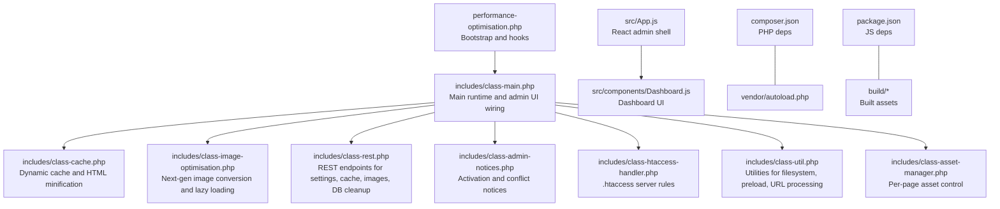
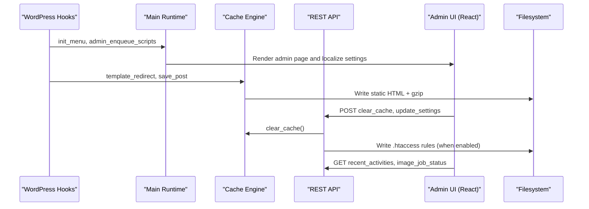
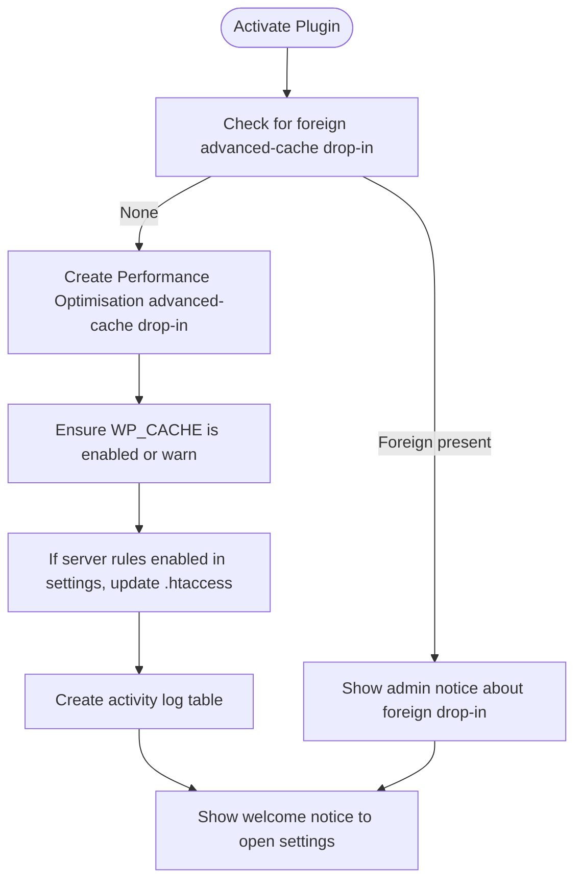
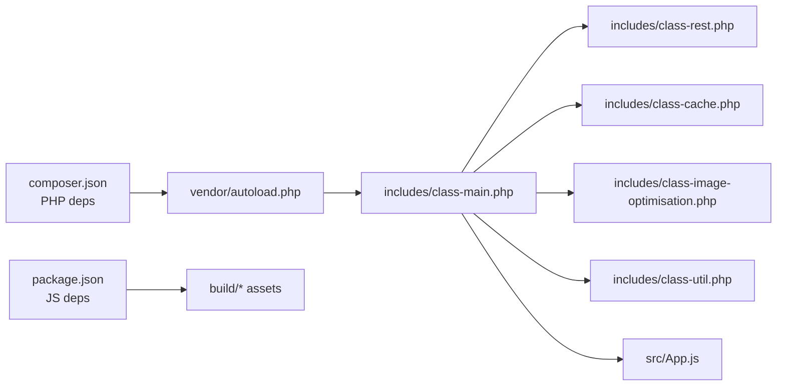

# Getting Started

<cite>
**Referenced Files in This Document**
- [performance-optimisation.php](file://performance-optimisation.php)
- [readme.txt](file://readme.txt)
- [class-main.php](file://includes/class-main.php)
- [class-activate.php](file://includes/class-activate.php)
- [class-admin-notices.php](file://includes/class-admin-notices.php)
- [class-cache.php](file://includes/class-cache.php)
- [class-image-optimisation.php](file://includes/class-image-optimisation.php)
- [class-asset-manager.php](file://includes/class-asset-manager.php)
- [class-rest.php](file://includes/class-rest.php)
- [class-htaccess-handler.php](file://includes/class-htaccess-handler.php)
- [class-util.php](file://includes/class-util.php)
- [composer.json](file://composer.json)
- [package.json](file://package.json)
- [App.js](file://src/App.js)
- [Dashboard.js](file://src/components/Dashboard.js)
</cite>

## Table of Contents
1. [Introduction](#introduction)
2. [Project Structure](#project-structure)
3. [Core Components](#core-components)
4. [Architecture Overview](#architecture-overview)
5. [Detailed Component Analysis](#detailed-component-analysis)
6. [Dependency Analysis](#dependency-analysis)
7. [Performance Considerations](#performance-considerations)
8. [Troubleshooting Guide](#troubleshooting-guide)
9. [Conclusion](#conclusion)
10. [Appendices](#appendices)

## Introduction
Performance Optimisation is a WordPress plugin that provides a comprehensive performance toolkit: cache management, JavaScript and CSS minification, image conversion to modern formats (WebP/AVIF), lazy loading, preload hints, and a modern admin UI. It is designed to be “off by default” for aggressive options so you can enable features gradually and test as you go. The plugin ships with a dashboard, file optimization, preload settings, image optimization, database cleanup, and tools for import/export of settings.

Key highlights:
- Lightweight performance toolkit with safe defaults
- Dashboard overview of cache, JS/CSS minification, and image optimization
- Minification, combination, defer/delay for JS/CSS
- Core tweaks to disable WordPress bloat (emojis, embeds, dashicons, XML-RPC, heartbeat)
- Image optimization and lazy loading
- Preload settings for cache, fonts, DNS, and images
- Database cleanup (manual and scheduled)
- Enterprise Redis object cache support
- Import/export plugin settings

**Section sources**
- [readme.txt:13-35](file://readme.txt#L13-L35)

## Project Structure
At a high level, the plugin consists of:
- Bootstrap and activation/deactivation logic
- Core runtime classes for caching, minification, image optimization, REST API, admin UI, and utilities
- Frontend admin UI built with React and WordPress scripts
- Composer-managed dependencies for minification and background task scheduling

**Diagram sources**
- [performance-optimisation.php:17-44](file://performance-optimisation.php#L17-L44)
- [class-main.php:128-154](file://includes/class-main.php#L128-L154)
- [class-rest.php:37-43](file://includes/class-rest.php#L37-L43)
- [App.js:28-112](file://src/App.js#L28-L112)
- [Dashboard.js:38-356](file://src/components/Dashboard.js#L38-L356)

**Section sources**
- [performance-optimisation.php:17-44](file://performance-optimisation.php#L17-L44)
- [class-main.php:128-154](file://includes/class-main.php#L128-L154)
- [composer.json:11-15](file://composer.json#L11-L15)
- [package.json:16-30](file://package.json#L16-L30)

## Core Components
- Main runtime and admin menu: initializes options, includes classes, sets hooks, and renders the admin UI.
- Cache engine: generates dynamic static HTML, combines CSS, minifies HTML, applies CDN rewriting, and supports smart purge.
- Image optimization: converts images to WebP/AVIF, serves next-gen formats conditionally, lazy-loads images/videos, and preloads critical images.
- REST API: exposes endpoints for cache management, settings updates, image optimization, database cleanup, and diagnostics.
- Admin notices: handles activation issues, foreign drop-in conflicts, and competing cache plugins.
- Server rules: safely appends Gzip and browser caching directives to .htaccess.
- Utilities: filesystem helpers, preload link generation, URL normalization, and minified asset counting.

**Section sources**
- [class-main.php:98-118](file://includes/class-main.php#L98-L118)
- [class-cache.php:32-120](file://includes/class-cache.php#L32-L120)
- [class-image-optimisation.php:27-57](file://includes/class-image-optimisation.php#L27-L57)
- [class-rest.php:26-123](file://includes/class-rest.php#L26-123)
- [class-admin-notices.php:20-93](file://includes/class-admin-notices.php#L20-L93)
- [class-htaccess-handler.php:25-74](file://includes/class-htaccess-handler.php#L25-L74)
- [class-util.php:29-80](file://includes/class-util.php#L29-L80)

## Architecture Overview
The plugin integrates WordPress hooks with a React admin shell. The main runtime wires hooks for caching, minification, and admin UI. The REST API provides programmatic access to all major features. The admin UI is a single-page React app that consumes localized settings and translations.

**Diagram sources**
- [class-main.php:164-241](file://includes/class-main.php#L164-L241)
- [class-cache.php:260-307](file://includes/class-cache.php#L260-L307)
- [class-rest.php:145-175](file://includes/class-rest.php#L145-L175)
- [App.js:28-112](file://src/App.js#L28-L112)

## Detailed Component Analysis

### Installation and Activation
- WordPress admin installation: upload plugin files to `/wp-content/plugins/performance-optimisation` or install directly from the Plugins screen, then activate.
- Manual installation via FTP: upload the plugin folder to the plugins directory and activate from the admin.
- Activation process:
  - Creates or verifies the advanced-cache drop-in (respects foreign drop-ins).
  - Ensures WP_CACHE is enabled or warns if not.
  - Optionally writes server rules to .htaccess if enabled in settings.
  - Creates the activity log table for audit trails.
- Post-activation notices:
  - Welcome notice to open settings.
  - Warnings for foreign drop-in conflicts or wp-config issues.
  - Info notice if another page-cache plugin is active.

**Diagram sources**
- [class-activate.php:35-68](file://includes/class-activate.php#L35-L68)
- [class-admin-notices.php:100-116](file://includes/class-admin-notices.php#L100-L116)
- [class-admin-notices.php:175-201](file://includes/class-admin-notices.php#L175-L201)

**Section sources**
- [readme.txt:36-40](file://readme.txt#L36-L40)
- [class-activate.php:35-68](file://includes/class-activate.php#L35-L68)
- [class-admin-notices.php:85-116](file://includes/class-admin-notices.php#L85-L116)

### Initial Activation and First-Time Setup
- After activation, a welcome notice appears directing you to the Performance Optimisation menu.
- Open the dashboard to review cache size, minified JS/CSS counts, and recent activities.
- Enable safe defaults first:
  - Enable server-side rules (Gzip and browser caching) if your server supports it.
  - Enable image conversion to WebP/AVIF.
  - Enable lazy loading for images and videos.
  - Configure preload hints for cache, fonts, and critical images.
- Use the Tools section to import/export settings for quick setup across environments.

**Section sources**
- [class-admin-notices.php:100-116](file://includes/class-admin-notices.php#L100-L116)
- [Dashboard.js:222-356](file://src/components/Dashboard.js#L222-L356)
- [readme.txt:71-73](file://readme.txt#L71-L73)

### Basic Configuration Steps
- File Optimization:
  - Enable minification for JS, CSS, and HTML.
  - Combine CSS and exclude specific files.
  - Defer or delay JavaScript loading with exclusion lists.
  - Core Tweaks: disable emojis, embeds, dashicons, XML-RPC, and control heartbeat.
- Preload Settings:
  - Enable cache preloading.
  - Preconnect to origins and prefetch DNS.
  - Preload fonts, CSS, and images.
- Image Optimization:
  - Enable lazy loading with SVG placeholders.
  - Convert images to WebP/AVIF and exclude specific images.
  - Preload feature images for selected post types.
- Database Cleanup:
  - Schedule automated cleanup for revisions, auto-drafts, transients.
  - Keep recent revisions based on age or maximum count.
  - Clean all overhead in one click.
- Tools:
  - Import/export plugin settings for quick setup.

**Section sources**
- [class-main.php:164-241](file://includes/class-main.php#L164-L241)
- [class-rest.php:184-200](file://includes/class-rest.php#L184-L200)
- [readme.txt:42-73](file://readme.txt#L42-L73)

### Default Settings and Recommended Starting Configurations
- Defaults:
  - File Optimization: server rules disabled by default; CDN URL empty.
  - Preload Settings: cache preload disabled; no exclusions.
  - Image Optimization: lazy loading disabled; conversion disabled; no exclusions.
  - Database Cleanup: none scheduled.
- Recommended starting configuration:
  - Enable server rules (Gzip and browser caching) if your server supports it.
  - Enable image conversion to WebP/AVIF.
  - Enable lazy loading for images and videos.
  - Preload critical assets (fonts, CSS, images) on the front page.
  - Keep core tweaks disabled initially; enable selectively after testing.

**Section sources**
- [class-main.php:98-118](file://includes/class-main.php#L98-L118)
- [class-cache.php:325-381](file://includes/class-cache.php#L325-L381)

### Quick Start Examples
- Enable caching:
  - Go to the File Optimization tab and enable server rules (Gzip and browser caching).
  - Verify .htaccess rules were inserted; if not, check file permissions and retry.
- Configure asset optimization:
  - Enable minify JS/CSS/HTML.
  - Exclude third-party scripts/styles that break when deferred or combined.
  - Use the Asset Manager to selectively disable assets per page/post.
- Verify performance improvements:
  - Use the Dashboard to check cache size and minified file counts.
  - Run a performance scan from the Performance Audit card.
  - Compare before/after metrics using your preferred measurement tool.

**Section sources**
- [class-htaccess-handler.php:42-74](file://includes/class-htaccess-handler.php#L42-L74)
- [class-rest.php:145-175](file://includes/class-rest.php#L145-L175)
- [Dashboard.js:222-356](file://src/components/Dashboard.js#L222-L356)

### Prerequisites and Compatibility
- WordPress: Requires at least 6.2
- PHP: Requires at least 7.4
- Tested up to: 6.9
- Dependencies:
  - PHP libraries: voku/html-min, matthiasmullie/minify, woocommerce/action-scheduler
  - Frontend: @wordpress/scripts, @fortawesome/react-fontawesome, @fortawesome/free-solid-svg-icons

**Section sources**
- [performance-optimisation.php:5-6](file://performance-optimisation.php#L5-L6)
- [readme.txt:4-6](file://readme.txt#L4-L6)
- [composer.json:11-15](file://composer.json#L11-L15)
- [package.json:16-25](file://package.json#L16-L25)

## Dependency Analysis
The plugin relies on Composer-managed PHP libraries and npm for frontend assets. The main runtime includes and wires these dependencies into WordPress hooks and the admin UI.

**Diagram sources**
- [composer.json:11-15](file://composer.json#L11-L15)
- [package.json:16-25](file://package.json#L16-L25)
- [class-main.php:128-154](file://includes/class-main.php#L128-L154)

**Section sources**
- [composer.json:11-15](file://composer.json#L11-L15)
- [package.json:16-25](file://package.json#L16-L25)
- [class-main.php:128-154](file://includes/class-main.php#L128-L154)

## Performance Considerations
- Use server rules (Gzip and browser caching) for static assets when possible.
- Prefer defer/delay for non-critical JavaScript; test thoroughly and exclude problematic scripts.
- Combine CSS judiciously; exclude third-party stylesheets that break when combined.
- Serve next-gen images (WebP/AVIF) conditionally; keep original images for fallback.
- Preload critical resources to reduce render-blocking.
- Use Action Scheduler for background image conversions to avoid timeouts.
- Keep cache sizes manageable; clear cache after structural changes (permalink updates, theme switches).

[No sources needed since this section provides general guidance]

## Troubleshooting Guide
Common issues and resolutions:
- .htaccess update failed:
  - Ensure file permissions allow writing to the .htaccess file.
  - Revert to previous state via FTP if needed.
- Foreign advanced-cache drop-in:
  - Another plugin or host manages the drop-in; do not overwrite it.
  - Use only one full-page cache solution to avoid conflicts.
- WP_CACHE not enabled:
  - Add or set WP_CACHE to true in wp-config.php.
  - The plugin will not modify wp-config if it is set to false.
- Conflicting cache plugins:
  - Running multiple full-page cache solutions can cause conflicts.
  - Consider disabling other cache plugins when using Performance Optimisation.
- Permission errors for filesystem operations:
  - Ensure the WordPress filesystem credentials allow directory creation and file writes.
- Image optimization not applied:
  - Verify browser supports WebP/AVIF; ensure conversion format is set.
  - Check exclusions for specific images or URLs.

**Section sources**
- [class-admin-notices.php:134-167](file://includes/class-admin-notices.php#L134-L167)
- [class-admin-notices.php:175-201](file://includes/class-admin-notices.php#L175-L201)
- [class-activate.php:76-126](file://includes/class-activate.php#L76-L126)
- [class-rest.php:152-155](file://includes/class-rest.php#L152-L155)

## Conclusion
Performance Optimisation provides a safe, dashboard-first approach to WordPress performance. Start with conservative defaults, enable server rules and image conversion, and progressively add more aggressive optimizations like defer/delay and cache preloading. Use the dashboard and performance audit tools to monitor improvements and verify changes.

[No sources needed since this section summarizes without analyzing specific files]

## Appendices

### A. Installation Steps (WordPress Admin)
- Go to Plugins > Add New.
- Search for “Performance Optimisation.”
- Click Install and then Activate.
- Open the Performance Optimisation menu and review the dashboard.

**Section sources**
- [readme.txt:36-40](file://readme.txt#L36-L40)

### B. Installation Steps (Manual via FTP)
- Upload the plugin folder to `/wp-content/plugins/performance-optimisation`.
- Activate the plugin from the Plugins screen.
- Open the Performance Optimisation menu and review the dashboard.

**Section sources**
- [readme.txt:38-39](file://readme.txt#L38-L39)

### C. First-Time Setup Checklist
- Review the dashboard for cache size and minified file counts.
- Enable server rules (Gzip and browser caching) if supported.
- Enable image conversion to WebP/AVIF and lazy loading.
- Configure preload hints for critical assets.
- Import/export settings using the Tools section.

**Section sources**
- [Dashboard.js:222-356](file://src/components/Dashboard.js#L222-L356)
- [readme.txt:71-73](file://readme.txt#L71-L73)