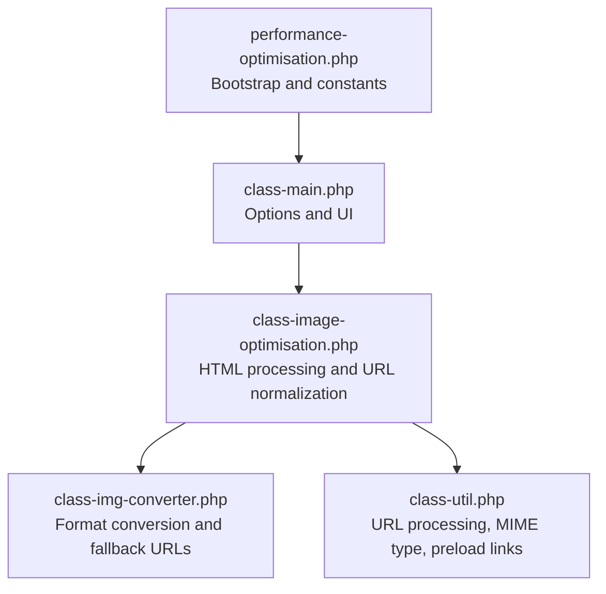
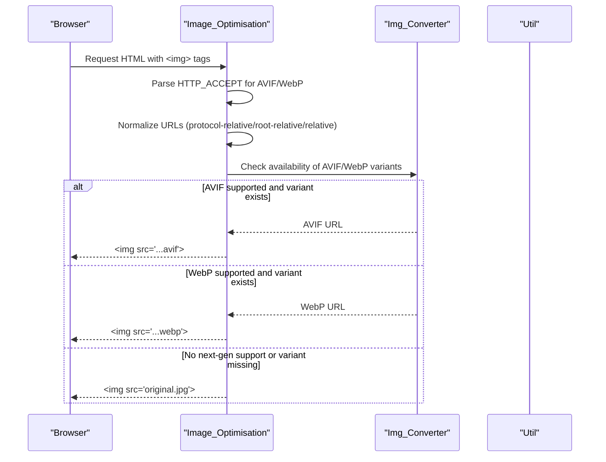
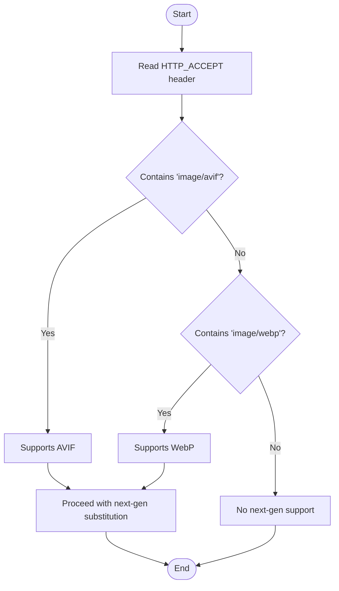
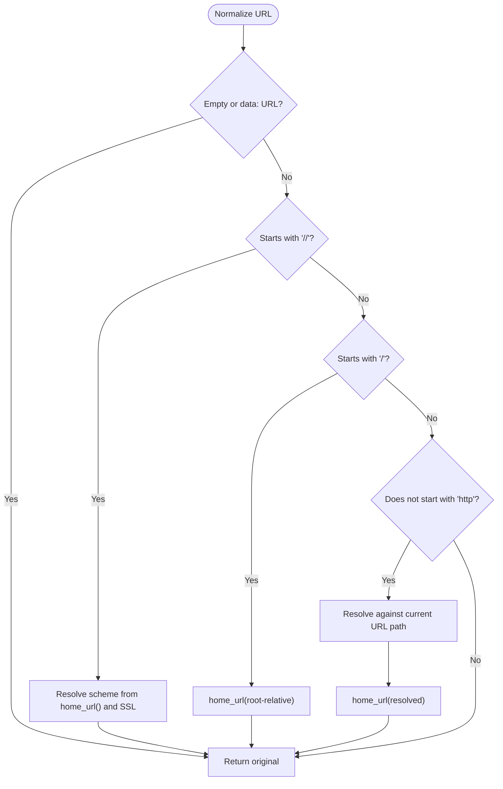
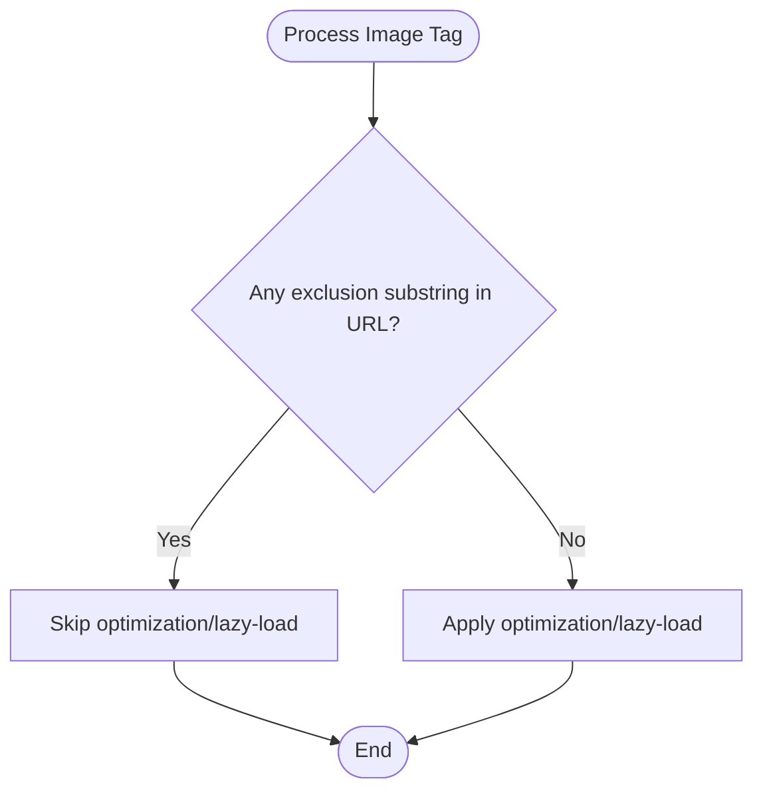
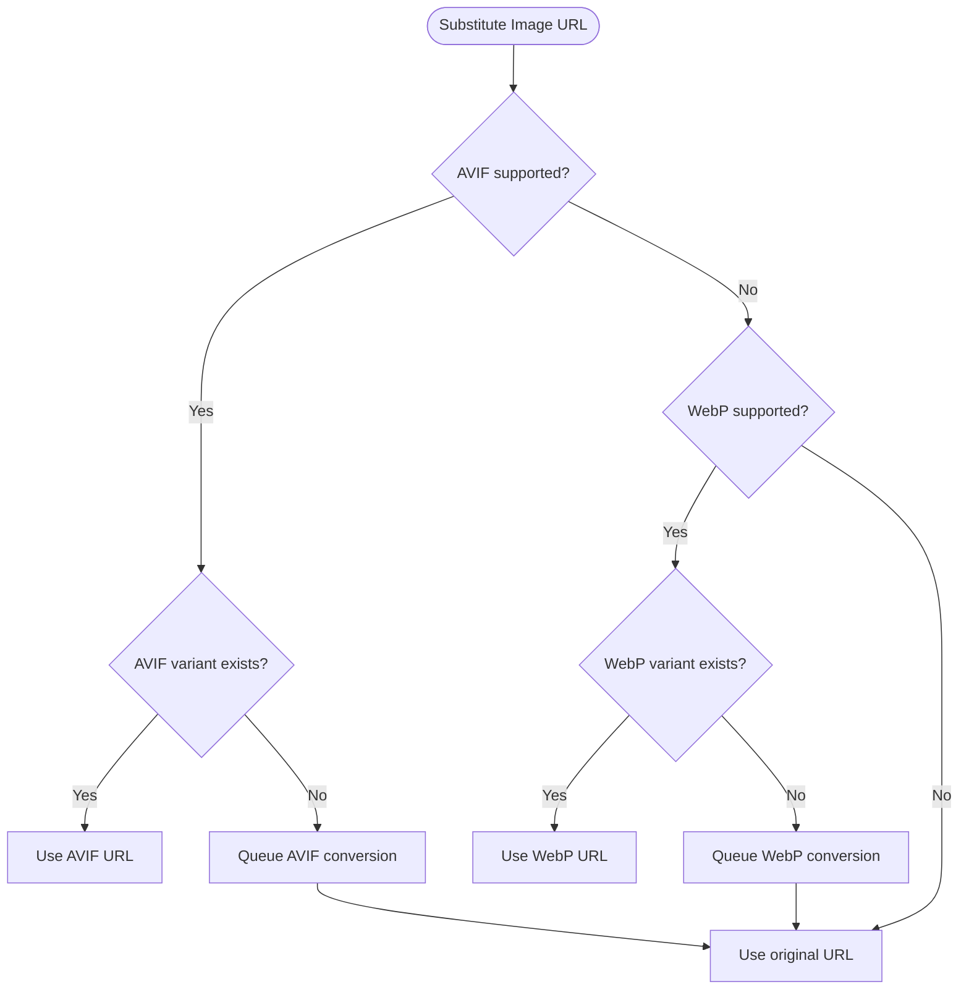
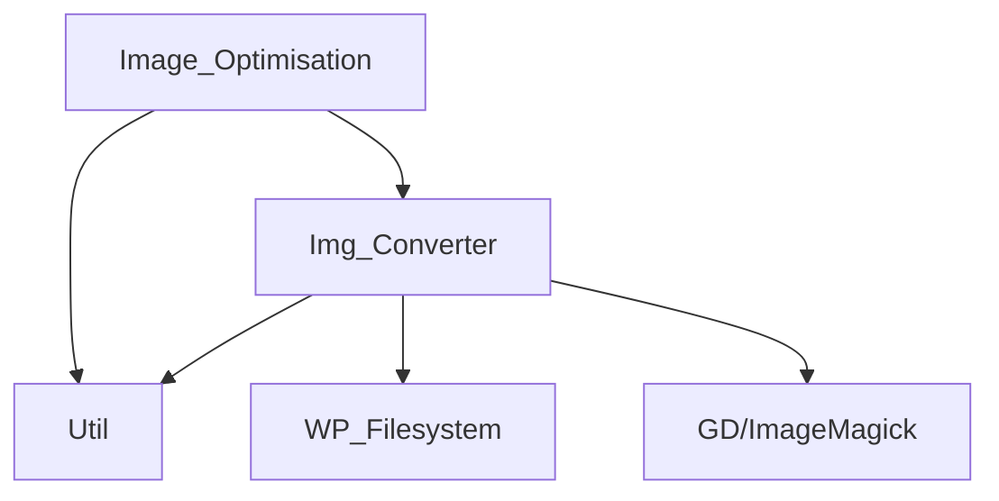

# Browser Compatibility Handling

<cite>
**Referenced Files in This Document**
- [class-image-optimisation.php](file://includes/class-image-optimisation.php)
- [class-img-converter.php](file://includes/class-img-converter.php)
- [class-util.php](file://includes/class-util.php)
- [performance-optimisation.php](file://performance-optimisation.php)
- [class-main.php](file://includes/class-main.php)
</cite>

## Table of Contents
1. [Introduction](#introduction)
2. [Project Structure](#project-structure)
3. [Core Components](#core-components)
4. [Architecture Overview](#architecture-overview)
5. [Detailed Component Analysis](#detailed-component-analysis)
6. [Dependency Analysis](#dependency-analysis)
7. [Performance Considerations](#performance-considerations)
8. [Troubleshooting Guide](#troubleshooting-guide)
9. [Conclusion](#conclusion)

## Introduction
This document explains how the plugin detects browser compatibility for next-generation image formats (AVIF and WebP) and applies graceful fallbacks when unsupported. It covers HTTP_ACCEPT header parsing, URL normalization for robust image processing, exclusion patterns for images that should bypass optimization, and the fallback mechanism that serves original images when next-gen formats are unavailable.

## Project Structure
The relevant components for browser compatibility and format detection are organized as follows:
- Main plugin bootstrap and entry point
- Image optimization pipeline that inspects HTML and applies next-gen format substitutions
- Image conversion engine that generates WebP/AVIF variants and manages fallback URLs
- Utility helpers for URL processing, MIME type inference, and sanitization

**Diagram sources**
- [performance-optimisation.php:26-43](file://performance-optimisation.php#L26-L43)
- [class-main.php:574-580](file://includes/class-main.php#L574-L580)
- [class-image-optimisation.php:64-71](file://includes/class-image-optimisation.php#L64-L71)
- [class-img-converter.php:83-91](file://includes/class-img-converter.php#L83-L91)
- [class-util.php:29-29](file://includes/class-util.php#L29-L29)

**Section sources**
- [performance-optimisation.php:17-43](file://performance-optimisation.php#L17-L43)
- [class-main.php:574-580](file://includes/class-main.php#L574-L580)

## Core Components
- HTTP_ACCEPT parsing for AVIF/WebP support detection
- URL normalization for protocol-relative, root-relative, and relative URLs
- Exclusion patterns for images that should bypass optimization
- Fallback mechanism to original image when next-gen formats are not supported
- MIME type inference for preload and picture source generation

**Section sources**
- [class-image-optimisation.php:101-108](file://includes/class-image-optimisation.php#L101-L108)
- [class-image-optimisation.php:311-342](file://includes/class-image-optimisation.php#L311-L342)
- [class-image-optimisation.php:245-251](file://includes/class-image-optimisation.php#L245-L251)
- [class-util.php:158-179](file://includes/class-util.php#L158-L179)

## Architecture Overview
The browser compatibility flow integrates HTTP_ACCEPT inspection, URL normalization, and next-gen format substitution with fallback to original images.

**Diagram sources**
- [class-image-optimisation.php:95-208](file://includes/class-image-optimisation.php#L95-L208)
- [class-image-optimisation.php:237-290](file://includes/class-image-optimisation.php#L237-L290)
- [class-img-converter.php:533-574](file://includes/class-img-converter.php#L533-L574)

## Detailed Component Analysis

### HTTP_ACCEPT Header Parsing for AVIF and WebP Support
- The plugin reads the HTTP_ACCEPT header from the request server variables.
- It checks for presence of "image/avif" and "image/webp" tokens to determine support.
- If neither is supported, the HTML processing short-circuits and no next-gen substitutions occur.

**Diagram sources**
- [class-image-optimisation.php:101-108](file://includes/class-image-optimisation.php#L101-L108)
- [class-img-converter.php:538-542](file://includes/class-img-converter.php#L538-L542)

**Section sources**
- [class-image-optimisation.php:101-108](file://includes/class-image-optimisation.php#L101-L108)
- [class-img-converter.php:538-542](file://includes/class-img-converter.php#L538-L542)

### URL Normalization for Protocol-Relative, Root-Relative, and Relative URLs
- Protocol-relative URLs (starting with "//") are resolved to the current scheme (http/https) based on the site’s home URL and SSL status.
- Root-relative URLs (starting with "/") are resolved against home_url().
- Relative paths are resolved against the current request path and then converted to absolute via home_url().
- data: URLs and empty strings are preserved unchanged.

**Diagram sources**
- [class-image-optimisation.php:311-342](file://includes/class-image-optimisation.php#L311-L342)

**Section sources**
- [class-image-optimisation.php:311-342](file://includes/class-image-optimisation.php#L311-L342)

### Exclusion Patterns for Images That Should Bypass Optimization
- Exclusion lists can be configured for:
  - Images excluded from conversion
  - Images excluded from lazy loading
  - Feature images for specific post types
  - Video exclusions
- During processing, if an image URL contains any configured exclusion substring, the tag is left unchanged or handled according to the specific exclusion rule.

**Diagram sources**
- [class-image-optimisation.php:245-251](file://includes/class-image-optimisation.php#L245-L251)
- [class-image-optimisation.php:1024-1031](file://includes/class-image-optimisation.php#L1024-L1031)
- [class-image-optimisation.php:1095-1117](file://includes/class-image-optimisation.php#L1095-L1117)

**Section sources**
- [class-image-optimisation.php:245-251](file://includes/class-image-optimisation.php#L245-L251)
- [class-image-optimisation.php:1024-1031](file://includes/class-image-optimisation.php#L1024-L1031)
- [class-image-optimisation.php:1095-1117](file://includes/class-image-optimisation.php#L1095-L1117)

### Fallback Mechanisms When Next-Generation Formats Are Not Supported
- If the browser does not advertise support for AVIF or WebP, the plugin leaves the HTML unchanged.
- If the browser supports a format but the converted variant does not yet exist, the plugin queues conversion and serves the original image URL.
- The conversion engine verifies format support and file existence before substituting URLs.

**Diagram sources**
- [class-image-optimisation.php:280-289](file://includes/class-image-optimisation.php#L280-L289)
- [class-img-converter.php:547-571](file://includes/class-img-converter.php#L547-L571)

**Section sources**
- [class-image-optimisation.php:280-289](file://includes/class-image-optimisation.php#L280-L289)
- [class-img-converter.php:547-571](file://includes/class-img-converter.php#L547-L571)

### MIME Type Inference for Preload and Picture Source Generation
- The plugin infers MIME types from URL extensions to generate appropriate preload and picture source attributes.
- Supported types include JPEG, PNG, WebP, GIF, SVG, and AVIF.

**Section sources**
- [class-util.php:158-179](file://includes/class-util.php#L158-L179)

## Dependency Analysis
- Image_Optimisation depends on:
  - HTTP_ACCEPT header parsing for compatibility decisions
  - URL normalization for robust image path resolution
  - Img_Converter for checking and generating next-gen variants
  - Util for URL processing, MIME type inference, and preload link generation
- Img_Converter depends on:
  - WordPress filesystem APIs for safe path resolution and caching
  - PHP GD/ImageMagick for format conversion
  - Option storage for conversion status and queue management

**Diagram sources**
- [class-image-optimisation.php:64-71](file://includes/class-image-optimisation.php#L64-L71)
- [class-img-converter.php:83-91](file://includes/class-img-converter.php#L83-L91)
- [class-util.php:67-80](file://includes/class-util.php#L67-L80)

**Section sources**
- [class-image-optimisation.php:64-71](file://includes/class-image-optimisation.php#L64-L71)
- [class-img-converter.php:83-91](file://includes/class-img-converter.php#L83-L91)
- [class-util.php:67-80](file://includes/class-util.php#L67-L80)

## Performance Considerations
- Early exit when no next-gen support avoids unnecessary processing.
- URL normalization prevents redundant conversions by resolving to canonical absolute paths.
- Exclusion lists minimize processing overhead for images that require special handling.
- Conversion is queued asynchronously and only performed when variants are missing.

## Troubleshooting Guide
Common issues and resolutions:
- AVIF/WebP not detected:
  - Verify HTTP_ACCEPT header includes the expected tokens.
  - Confirm conversion variants exist or are queued.
- Incorrect URLs after normalization:
  - Ensure protocol-relative URLs are resolvable to the current scheme.
  - Check that root-relative and relative URLs resolve to the intended paths.
- Images not excluded:
  - Confirm exclusion substrings match the actual URLs.
  - Review exclusion lists for lazy loading, conversion, and post-type feature images.
- Fallback to original not occurring:
  - Ensure conversion variants are generated and accessible.
  - Check for errors in conversion status tracking.

**Section sources**
- [class-image-optimisation.php:101-108](file://includes/class-image-optimisation.php#L101-L108)
- [class-image-optimisation.php:311-342](file://includes/class-image-optimisation.php#L311-L342)
- [class-image-optimisation.php:245-251](file://includes/class-image-optimisation.php#L245-L251)
- [class-img-converter.php:547-571](file://includes/class-img-converter.php#L547-L571)

## Conclusion
The plugin implements a robust, backward-compatible approach to delivering next-generation image formats. By parsing HTTP_ACCEPT headers, normalizing URLs, applying exclusion patterns, and gracefully falling back to original images, it maximizes performance gains while ensuring broad browser compatibility.