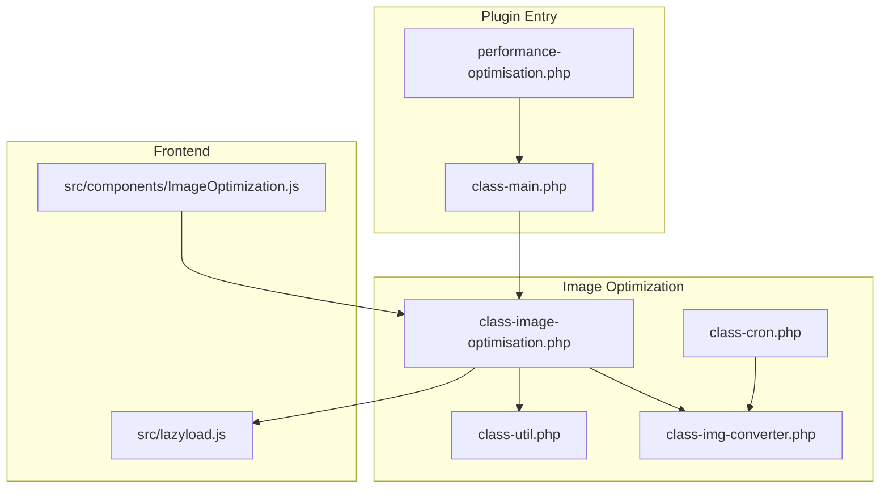
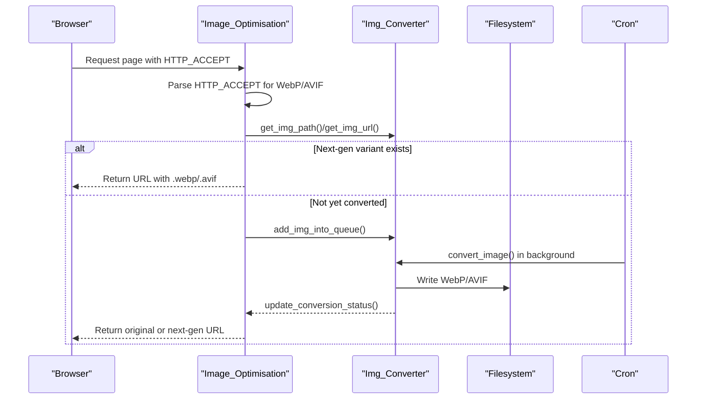
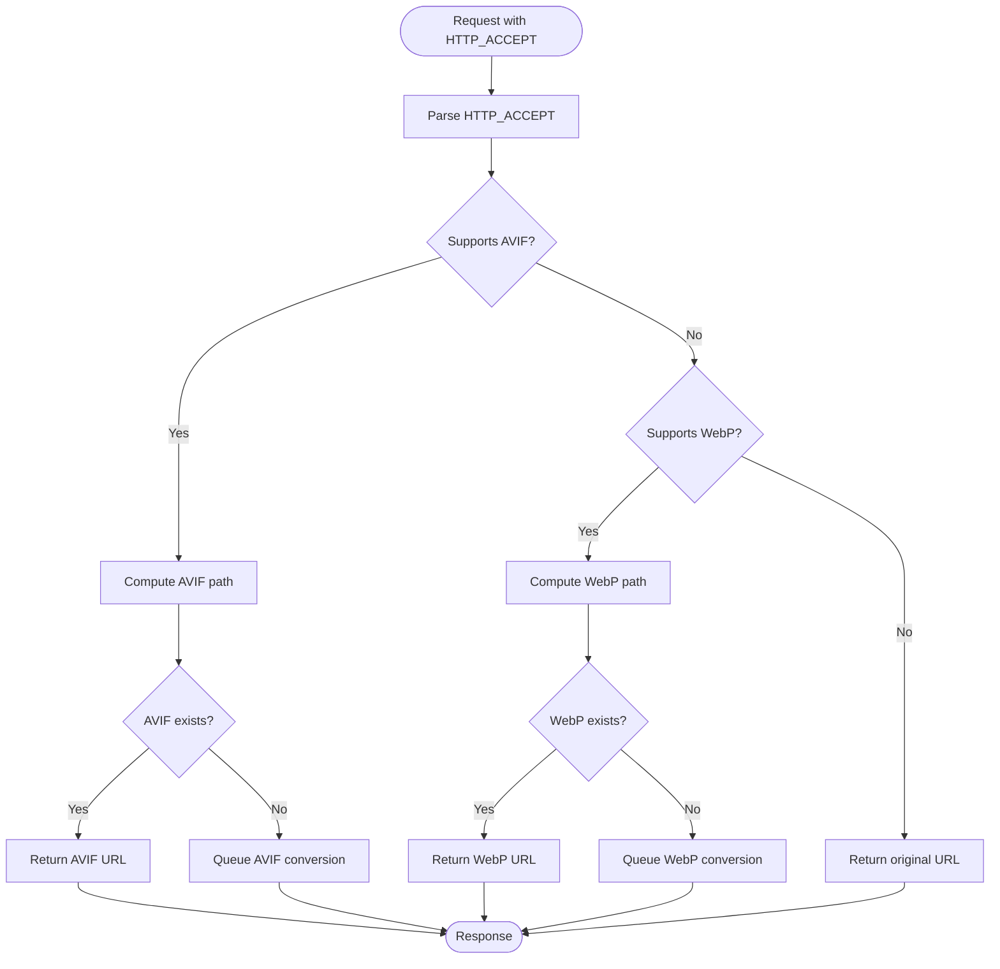
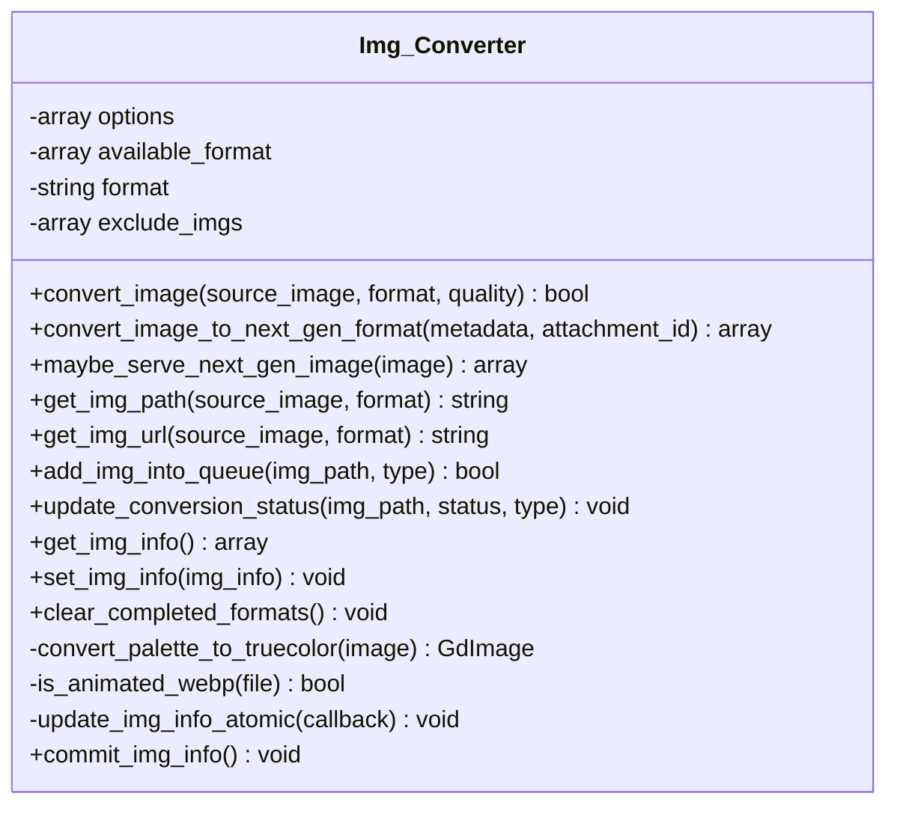
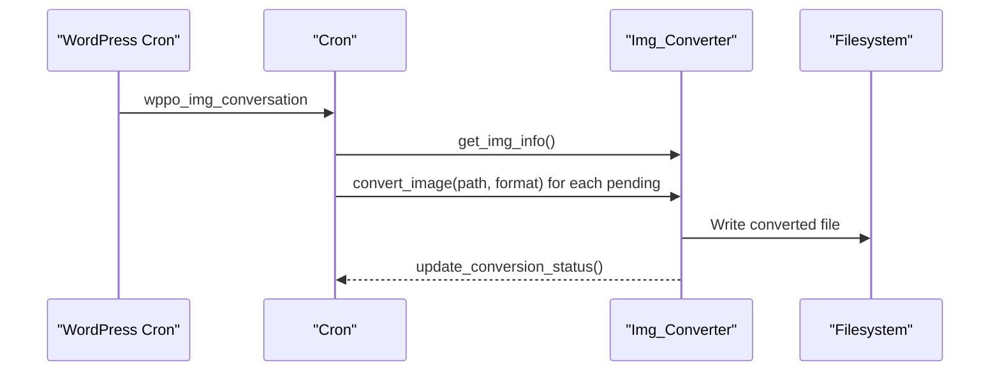
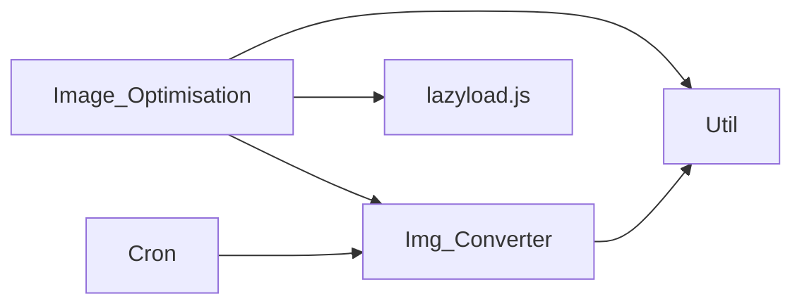

# Format Conversion

<cite>
**Referenced Files in This Document**
- [performance-optimisation.php](file://performance-optimisation.php)
- [class-main.php](file://includes/class-main.php)
- [class-image-optimisation.php](file://includes/class-image-optimisation.php)
- [class-img-converter.php](file://includes/class-img-converter.php)
- [class-cron.php](file://includes/class-cron.php)
- [class-util.php](file://includes/class-util.php)
- [ImageOptimization.js](file://src/components/ImageOptimization.js)
- [lazyload.js](file://src/lazyload.js)
</cite>

## Table of Contents
1. [Introduction](#introduction)
2. [Project Structure](#project-structure)
3. [Core Components](#core-components)
4. [Architecture Overview](#architecture-overview)
5. [Detailed Component Analysis](#detailed-component-analysis)
6. [Dependency Analysis](#dependency-analysis)
7. [Performance Considerations](#performance-considerations)
8. [Troubleshooting Guide](#troubleshooting-guide)
9. [Conclusion](#conclusion)
10. [Appendices](#appendices)

## Introduction
This document explains the image format conversion system that detects browser capabilities via HTTP_ACCEPT headers and converts images to next-generation formats (WebP and AVIF). It covers detection logic, conversion workflows, queueing, background processing, quality and compression controls, fallback mechanisms, configuration options, supported formats, conversion triggers, and troubleshooting compatibility issues.

## Project Structure
The format conversion system spans backend PHP classes and frontend JavaScript:
- Backend: Main entry initializes plugin, registers hooks, and delegates to image optimization and conversion classes.
- Image Optimization: Detects browser support via HTTP_ACCEPT, scans HTML for images, and replaces URLs with next-gen variants when available.
- Image Converter: Converts source images to WebP/AVIF, manages conversion status, and queues conversions.
- Cron: Schedules periodic background processing of queued conversions.
- Utilities: Provide path resolution, cache directory preparation, and MIME type helpers.
- Frontend: Lazy-load scripts and picture handling support next-gen image delivery.

**Diagram sources**
- [performance-optimisation.php:1-68](file://performance-optimisation.php#L1-L68)
- [class-main.php:1-1131](file://includes/class-main.php#L1-L1131)
- [class-image-optimisation.php:1-1373](file://includes/class-image-optimisation.php#L1-L1373)
- [class-img-converter.php:1-762](file://includes/class-img-converter.php#L1-L762)
- [class-cron.php:1-397](file://includes/class-cron.php#L1-L397)
- [class-util.php:1-251](file://includes/class-util.php#L1-L251)
- [lazyload.js:1-362](file://src/lazyload.js#L1-L362)
- [ImageOptimization.js:262-496](file://src/components/ImageOptimization.js#L262-L496)

**Section sources**
- [performance-optimisation.php:1-68](file://performance-optimisation.php#L1-L68)
- [class-main.php:1-1131](file://includes/class-main.php#L1-L1131)

## Core Components
- Image_Optimisation: Orchestrates browser capability detection, HTML scanning, and replacement of image URLs with next-gen variants. It integrates with Img_Converter for path resolution and queueing.
- Img_Converter: Performs actual conversion to WebP/AVIF, validates formats, checks browser support, and maintains conversion status in an option-backed store.
- Cron: Schedules hourly background processing of queued conversions in batches.
- Util: Provides filesystem helpers, URL-to-path resolution, and MIME type inference.
- Frontend lazy-loading: Supports picture element and data-* attributes to defer loading and enable next-gen image evaluation.

Key responsibilities:
- Detection: Uses HTTP_ACCEPT to detect WebP/AVIF support.
- Conversion: Validates source images, applies quality/compression, writes converted files, and updates status.
- Queueing: Adds images to a pending list and persists state atomically.
- Background processing: Processes pending images in batches to avoid blocking requests.
- Fallback: Serves original images when next-gen variants are unavailable or unsupported.

**Section sources**
- [class-image-optimisation.php:1-1373](file://includes/class-image-optimisation.php#L1-L1373)
- [class-img-converter.php:1-762](file://includes/class-img-converter.php#L1-L762)
- [class-cron.php:1-397](file://includes/class-cron.php#L1-L397)
- [class-util.php:1-251](file://includes/class-util.php#L1-L251)

## Architecture Overview
The system operates on two axes:
- Real-time detection and replacement: On page load, the plugin inspects HTTP_ACCEPT and replaces IMG tags with next-gen URLs if available.
- Background conversion: Pending conversions are processed in batches by cron to produce WebP/AVIF variants.

**Diagram sources**
- [class-image-optimisation.php:95-208](file://includes/class-image-optimisation.php#L95-L208)
- [class-img-converter.php:526-574](file://includes/class-img-converter.php#L526-L574)
- [class-img-converter.php:632-659](file://includes/class-img-converter.php#L632-L659)
- [class-cron.php:321-360](file://includes/class-cron.php#L321-L360)

## Detailed Component Analysis

### Image_Optimisation: Browser Detection and HTML Replacement
- Hooks into WordPress to convert images on attachment metadata change and to serve next-gen images in HTML.
- Detects browser support by parsing HTTP_ACCEPT for image/avif and image/webp.
- Scans IMG tags and srcset attributes, normalizes URLs, and replaces with next-gen variants when available.
- Excludes images via user-configured partial URLs.

**Diagram sources**
- [class-image-optimisation.php:95-208](file://includes/class-image-optimisation.php#L95-L208)
- [class-image-optimisation.php:237-290](file://includes/class-image-optimisation.php#L237-L290)

**Section sources**
- [class-image-optimisation.php:64-71](file://includes/class-image-optimisation.php#L64-L71)
- [class-image-optimisation.php:95-208](file://includes/class-image-optimisation.php#L95-L208)
- [class-image-optimisation.php:237-290](file://includes/class-image-optimisation.php#L237-L290)

### Img_Converter: Conversion, Validation, and Queue Management
- Validates requested format (webp, avif, both), supported GD functions, readable source, and file size/dimension limits.
- Converts JPEG/PNG/GIF to WebP/AVIF; uses Imagick for GIF/WebP transparency handling.
- Prevents animated WebP conversion and guards against oversized images.
- Computes filesystem paths for converted images and generates public URLs.
- Maintains conversion status in an option-backed store with atomic updates and shutdown commit.

**Diagram sources**
- [class-img-converter.php:22-762](file://includes/class-img-converter.php#L22-L762)

**Section sources**
- [class-img-converter.php:104-310](file://includes/class-img-converter.php#L104-L310)
- [class-img-converter.php:367-465](file://includes/class-img-converter.php#L367-L465)
- [class-img-converter.php:632-760](file://includes/class-img-converter.php#L632-L760)

### Cron: Background Conversion Processing
- Schedules hourly image conversion processing.
- Reads pending WebP/AVIF lists from the conversion status store and processes in batches.
- Invokes Img_Converter to perform conversions for queued images.

**Diagram sources**
- [class-cron.php:42-52](file://includes/class-cron.php#L42-L52)
- [class-cron.php:84-86](file://includes/class-cron.php#L84-L86)
- [class-cron.php:321-360](file://includes/class-cron.php#L321-L360)

**Section sources**
- [class-cron.php:321-360](file://includes/class-cron.php#L321-L360)

### Utilities: Path Resolution and MIME Type
- Resolves URLs to local filesystem paths safely.
- Prepares cache directories recursively.
- Infers MIME types from URL extensions.

**Section sources**
- [class-util.php:89-110](file://includes/class-util.php#L89-L110)
- [class-util.php:38-60](file://includes/class-util.php#L38-L60)
- [class-util.php:158-179](file://includes/class-util.php#L158-L179)

### Frontend: Lazy Loading and Picture Element
- Supports picture element and data-* attributes for deferred loading.
- Enables next-gen image evaluation when switching from placeholders to real sources.

**Section sources**
- [lazyload.js:152-355](file://src/lazyload.js#L152-L355)

## Dependency Analysis
- Image_Optimisation depends on Img_Converter for path computation and queueing, and on Util for URL/path resolution and MIME type.
- Img_Converter depends on WordPress filesystem APIs and GD/Imagick for image manipulation.
- Cron invokes Img_Converter to process queued conversions.
- Frontend lazy-loading complements next-gen delivery by deferring non-critical images.

**Diagram sources**
- [class-image-optimisation.php:217-223](file://includes/class-image-optimisation.php#L217-L223)
- [class-img-converter.php:381-465](file://includes/class-img-converter.php#L381-L465)
- [class-cron.php:321-360](file://includes/class-cron.php#L321-L360)

**Section sources**
- [class-image-optimisation.php:217-223](file://includes/class-image-optimisation.php#L217-L223)
- [class-img-converter.php:381-465](file://includes/class-img-converter.php#L381-L465)
- [class-cron.php:321-360](file://includes/class-cron.php#L321-L360)

## Performance Considerations
- Batch processing: Cron processes conversions in batches to avoid long-running requests.
- Atomic state updates: Conversion status is updated atomically and committed on shutdown to prevent race conditions.
- File size and dimension limits: Guards against oversized images to prevent memory exhaustion.
- Queue scope: Only images under uploads are queued to ensure safe paths.

[No sources needed since this section provides general guidance]

## Troubleshooting Guide
Common issues and resolutions:
- Animated WebP detected: The system rejects animated WebP for conversion; convert manually or disable conversion for those assets.
- Missing next-gen variants: Ensure cron is running and pending images are being processed; check conversion status store.
- Browser not receiving next-gen: Verify HTTP_ACCEPT includes image/avif or image/webp; confirm the converted file exists at computed path.
- GIF transparency: WebP conversion uses Imagick; ensure Imagick is installed and enabled.
- Exclusions not working: Confirm partial URLs are correctly entered; exclusions are matched as substrings.

**Section sources**
- [class-img-converter.php:176-209](file://includes/class-img-converter.php#L176-L209)
- [class-img-converter.php:210-265](file://includes/class-img-converter.php#L210-L265)
- [class-img-converter.php:341-364](file://includes/class-img-converter.php#L341-L364)
- [class-cron.php:321-360](file://includes/class-cron.php#L321-L360)

## Conclusion
The format conversion system combines real-time browser capability detection with robust background processing to deliver WebP and AVIF variants efficiently. It provides flexible configuration, strict safety checks, and fallback to original images when necessary. Administrators can control target formats, exclusions, and batch sizes to balance performance and compatibility.

[No sources needed since this section summarizes without analyzing specific files]

## Appendices

### Supported Image Formats and Conversion Targets
- Source formats: JPEG, PNG, GIF.
- Target formats: WebP, AVIF, or both.
- Animated WebP is not converted; GIF is converted to WebP using Imagick.

**Section sources**
- [class-img-converter.php:158-269](file://includes/class-img-converter.php#L158-L269)
- [class-img-converter.php:176-209](file://includes/class-img-converter.php#L176-L209)
- [class-img-converter.php:210-265](file://includes/class-img-converter.php#L210-L265)

### Conversion Triggers
- Attachment upload: Metadata hook queues conversions for the original and all size variants.
- Real-time request: HTTP_ACCEPT-based detection replaces IMG URLs with next-gen variants when available.
- Background cron: Hourly processing converts queued images in batches.

**Section sources**
- [class-img-converter.php:476-524](file://includes/class-img-converter.php#L476-L524)
- [class-image-optimisation.php:68-69](file://includes/class-image-optimisation.php#L68-L69)
- [class-cron.php:84-86](file://includes/class-cron.php#L84-L86)

### Configuration Options
- Target format: WebP, AVIF, or Both.
- Exclude from conversion: Partial URLs to preserve original formats.
- Batch size: Controls background conversion throughput.
- Exclusions: Exclude specific images from conversion and preloading.

**Section sources**
- [ImageOptimization.js:262-317](file://src/components/ImageOptimization.js#L262-L317)
- [class-cron.php:329](file://includes/class-cron.php#L329)

### Quality Settings and Compression Levels
- Quality parameter accepts 0–100; -1 lets libraries choose defaults.
- Transparency handling: Lossless WebP for transparent GIFs; lossy otherwise.
- Dimension and size limits: Prevents excessive memory usage.

**Section sources**
- [class-img-converter.php:100](file://includes/class-img-converter.php#L100)
- [class-img-converter.php:240-248](file://includes/class-img-converter.php#L240-L248)
- [class-img-converter.php:122-152](file://includes/class-img-converter.php#L122-L152)

### Fallback Mechanisms
- If next-gen variants do not exist, original images are served.
- If browser does not advertise support, original images are served.
- Converted files are stored under a dedicated directory within wp-content to avoid conflicts.

**Section sources**
- [class-image-optimisation.php:280-289](file://includes/class-image-optimisation.php#L280-L289)
- [class-img-converter.php:551-553](file://includes/class-img-converter.php#L551-L553)
- [class-img-converter.php:430-440](file://includes/class-img-converter.php#L430-L440)