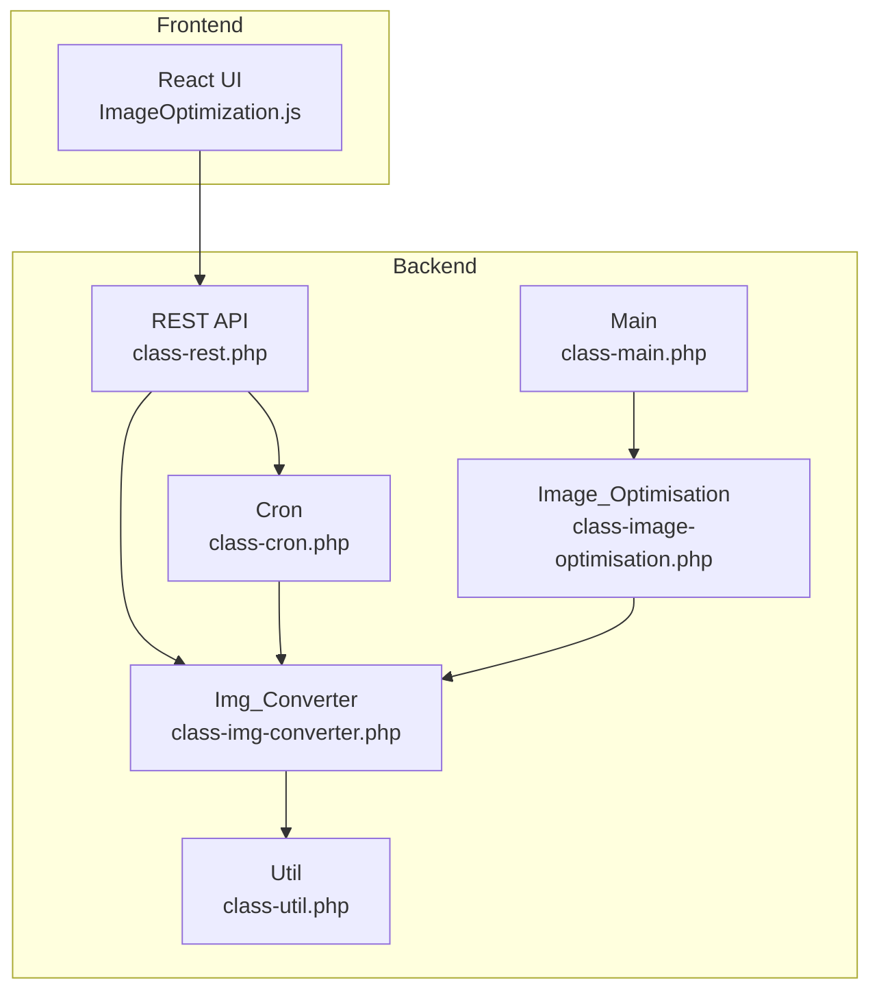
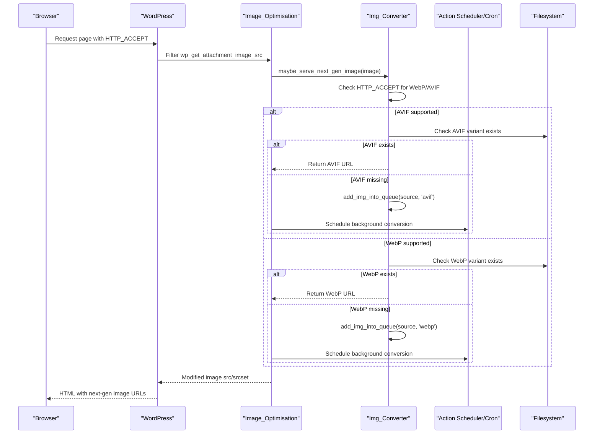
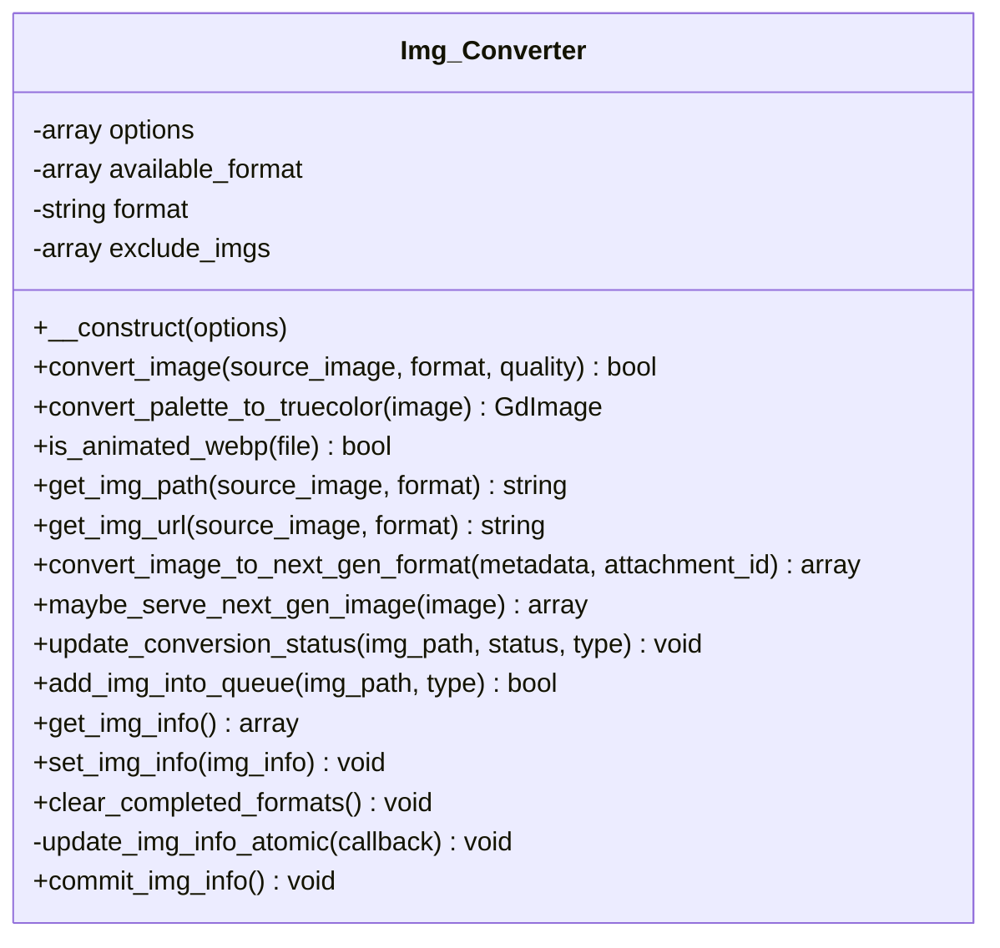
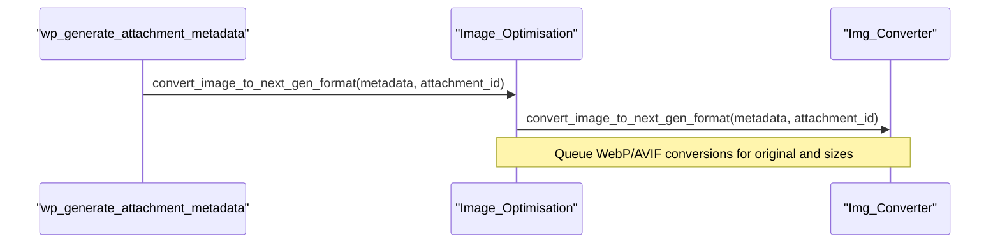
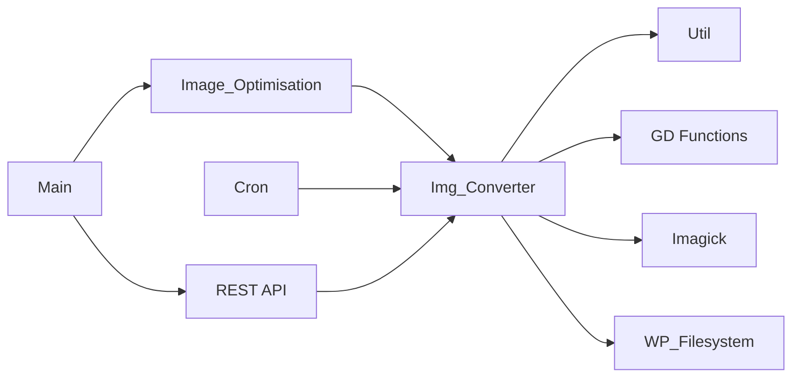

# Format Conversion

<cite>
**Referenced Files in This Document**
- [class-img-converter.php](file://includes/class-img-converter.php)
- [class-image-optimisation.php](file://includes/class-image-optimisation.php)
- [class-main.php](file://includes/class-main.php)
- [class-cron.php](file://includes/class-cron.php)
- [class-rest.php](file://includes/class-rest.php)
- [class-util.php](file://includes/class-util.php)
- [ImageOptimization.js](file://src/components/ImageOptimization.js)
</cite>

## Table of Contents
1. [Introduction](#introduction)
2. [Project Structure](#project-structure)
3. [Core Components](#core-components)
4. [Architecture Overview](#architecture-overview)
5. [Detailed Component Analysis](#detailed-component-analysis)
6. [Dependency Analysis](#dependency-analysis)
7. [Performance Considerations](#performance-considerations)
8. [Troubleshooting Guide](#troubleshooting-guide)
9. [Conclusion](#conclusion)

## Introduction
This document explains the image format conversion system that detects and converts images to modern formats (WebP and AVIF) to improve performance. It covers:
- Browser capability detection via HTTP_ACCEPT headers
- Queueing conversions and generating optimized variants
- Conversion workflow from original images to next-generation formats
- Quality settings, compression levels, and fallback mechanisms
- Configuration options for conversion formats, quality thresholds, and exclusion rules
- Supported image formats, conversion triggers, and troubleshooting compatibility issues

## Project Structure
The format conversion system spans several components:
- Backend PHP classes for conversion, optimization, and scheduling
- REST API endpoints for triggering conversions and monitoring progress
- Frontend React components for configuration and UI controls
- Utility helpers for filesystem operations and URL processing

**Diagram sources**
- [class-main.php:114](file://includes/class-main.php#L114)
- [class-image-optimisation.php:27](file://includes/class-image-optimisation.php#L27)
- [class-img-converter.php:22](file://includes/class-img-converter.php#L22)
- [class-rest.php:26](file://includes/class-rest.php#L26)
- [class-cron.php:27](file://includes/class-cron.php#L27)
- [class-util.php:29](file://includes/class-util.php#L29)

**Section sources**
- [class-main.php:114](file://includes/class-main.php#L114)
- [class-image-optimisation.php:27](file://includes/class-image-optimisation.php#L27)
- [class-img-converter.php:22](file://includes/class-img-converter.php#L22)
- [class-rest.php:26](file://includes/class-rest.php#L26)
- [class-cron.php:27](file://includes/class-cron.php#L27)
- [class-util.php:29](file://includes/class-util.php#L29)

## Core Components
- Img_Converter: Converts images to WebP and/or AVIF, validates formats, queues conversions, and tracks status.
- Image_Optimisation: Integrates conversion with WordPress hooks, detects browser support via HTTP_ACCEPT, and replaces image URLs with next-gen variants.
- Main: Initializes the plugin, sets up hooks, and registers background processing callbacks.
- Cron: Schedules periodic image conversion processing and runs batch conversions.
- REST: Exposes endpoints to trigger conversions (with Action Scheduler fallback), monitor job status, and manage optimized assets.
- Util: Provides filesystem utilities, URL normalization, and MIME-type inference.

**Section sources**
- [class-img-converter.php:22](file://includes/class-img-converter.php#L22)
- [class-image-optimisation.php:27](file://includes/class-image-optimisation.php#L27)
- [class-main.php:98](file://includes/class-main.php#L98)
- [class-cron.php:27](file://includes/class-cron.php#L27)
- [class-rest.php:26](file://includes/class-rest.php#L26)
- [class-util.php:29](file://includes/class-util.php#L29)

## Architecture Overview
The system integrates WordPress hooks and REST endpoints to detect browser capabilities, queue conversions, and serve optimized images. It supports:
- WebP and AVIF conversion
- GIF to WebP conversion (with transparency handling)
- Animated WebP detection and exclusion
- Batched background processing via Action Scheduler or cron
- Fallback to original images when next-gen variants are unavailable

**Diagram sources**
- [class-image-optimisation.php:95](file://includes/class-image-optimisation.php#L95)
- [class-img-converter.php:533](file://includes/class-img-converter.php#L533)
- [class-img-converter.php:632](file://includes/class-img-converter.php#L632)
- [class-cron.php:321](file://includes/class-cron.php#L321)

**Section sources**
- [class-image-optimisation.php:95](file://includes/class-image-optimisation.php#L95)
- [class-img-converter.php:533](file://includes/class-img-converter.php#L533)
- [class-img-converter.php:632](file://includes/class-img-converter.php#L632)
- [class-cron.php:321](file://includes/class-cron.php#L321)

## Detailed Component Analysis

### Img_Converter
Responsibilities:
- Detects supported formats and validates source images
- Converts JPEG/PNG/GIF to WebP/AVIF with quality control
- Handles transparency and palette-to-truecolor conversion
- Prevents animated WebP conversion
- Computes filesystem paths for converted images and URLs for serving
- Queues conversions and updates conversion status atomically

Key behaviors:
- Format selection: webp, avif, or both
- Quality parameter: 0–100 or -1 for defaults
- Security checks: file size and dimension limits, directory traversal prevention
- Exclusions: GIF/WebP/animated WebP handling, explicit exclude lists
- Atomic status updates: pending/completed/failed tracking via wppo_img_info

**Diagram sources**
- [class-img-converter.php:22](file://includes/class-img-converter.php#L22)
- [class-img-converter.php:104](file://includes/class-img-converter.php#L104)
- [class-img-converter.php:381](file://includes/class-img-converter.php#L381)
- [class-img-converter.php:533](file://includes/class-img-converter.php#L533)
- [class-img-converter.php:632](file://includes/class-img-converter.php#L632)

**Section sources**
- [class-img-converter.php:22](file://includes/class-img-converter.php#L22)
- [class-img-converter.php:104](file://includes/class-img-converter.php#L104)
- [class-img-converter.php:381](file://includes/class-img-converter.php#L381)
- [class-img-converter.php:533](file://includes/class-img-converter.php#L533)
- [class-img-converter.php:632](file://includes/class-img-converter.php#L632)

### Image_Optimisation
Responsibilities:
- Integrates with WordPress hooks to convert attachments and rewrite image URLs
- Detects browser support for WebP/AVIF via HTTP_ACCEPT
- Replaces image URLs with next-gen variants and maintains fallback to originals
- Normalizes and validates URLs for replacement

**Diagram sources**
- [class-image-optimisation.php:64](file://includes/class-image-optimisation.php#L64)
- [class-image-optimisation.php:476](file://includes/class-image-optimisation.php#L476)
- [class-img-converter.php:476](file://includes/class-img-converter.php#L476)

**Section sources**
- [class-image-optimisation.php:64](file://includes/class-image-optimisation.php#L64)
- [class-image-optimisation.php:476](file://includes/class-image-optimisation.php#L476)
- [class-img-converter.php:476](file://includes/class-img-converter.php#L476)

### Main
Responsibilities:
- Initializes plugin options and includes required classes
- Sets up hooks for background processing and REST endpoints
- Registers Action Scheduler callback for background image processing

**Section sources**
- [class-main.php:98](file://includes/class-main.php#L98)
- [class-main.php:233](file://includes/class-main.php#L233)
- [class-main.php:294](file://includes/class-main.php#L294)

### Cron
Responsibilities:
- Schedules hourly image conversion processing
- Processes pending images in batches according to settings
- Supports both AVIF and WebP conversions

**Section sources**
- [class-cron.php:84](file://includes/class-cron.php#L84)
- [class-cron.php:321](file://includes/class-cron.php#L321)

### REST API
Endpoints relevant to conversion:
- optimise_image: Trigger conversions (background via Action Scheduler or synchronous fallback)
- image_job_status: Poll background job status
- delete_optimised_image: Remove optimized variants

**Section sources**
- [class-rest.php:253](file://includes/class-rest.php#L253)
- [class-rest.php:592](file://includes/class-rest.php#L592)
- [class-rest.php:361](file://includes/class-rest.php#L361)

### Util
Responsibilities:
- Prepare cache directories
- Resolve local paths from URLs
- Infer MIME types from extensions
- Generate preload link tags

**Section sources**
- [class-util.php:38](file://includes/class-util.php#L38)
- [class-util.php:89](file://includes/class-util.php#L89)
- [class-util.php:158](file://includes/class-util.php#L158)

## Dependency Analysis
- Img_Converter depends on:
  - Util for filesystem operations and URL processing
  - WordPress image functions (GD) and Imagick for GIF/WebP conversion
  - WordPress filesystem API for safe file operations
- Image_Optimisation depends on:
  - Img_Converter for conversion and URL computation
  - WordPress hooks for attachment metadata and image src filtering
- Main registers:
  - Action Scheduler callback for background processing
  - REST routes for conversion and status
- Cron depends on:
  - Img_Converter for conversion and status tracking
  - WordPress cron scheduling

**Diagram sources**
- [class-img-converter.php:22](file://includes/class-img-converter.php#L22)
- [class-util.php:29](file://includes/class-util.php#L29)
- [class-image-optimisation.php:27](file://includes/class-image-optimisation.php#L27)
- [class-main.php:98](file://includes/class-main.php#L98)
- [class-cron.php:27](file://includes/class-cron.php#L27)
- [class-rest.php:26](file://includes/class-rest.php#L26)

**Section sources**
- [class-img-converter.php:22](file://includes/class-img-converter.php#L22)
- [class-util.php:29](file://includes/class-util.php#L29)
- [class-image-optimisation.php:27](file://includes/class-image-optimisation.php#L27)
- [class-main.php:98](file://includes/class-main.php#L98)
- [class-cron.php:27](file://includes/class-cron.php#L27)
- [class-rest.php:26](file://includes/class-rest.php#L26)

## Performance Considerations
- Batched processing: Cron processes pending images in configurable batches to avoid memory spikes.
- Background processing: Prefer Action Scheduler for asynchronous conversions; fallback to synchronous processing when unavailable.
- Safety limits: File size and dimension caps prevent excessive memory usage and potential DoS.
- Atomic status updates: Pending/completed/failed states are merged safely to avoid race conditions.
- Exclusions: Animated WebP and GIF/WebP exclusions prevent unsupported conversions.

[No sources needed since this section provides general guidance]

## Troubleshooting Guide

Common issues and resolutions:
- Browser does not receive next-gen images
  - Verify HTTP_ACCEPT includes image/avif or image/webp
  - Ensure conversion is queued and completed
  - Confirm filesystem paths and permissions for wppo directory under wp-content
- Animated WebP detected and skipped
  - Animated WebP files are excluded from AVIF conversion
  - Convert manually to static images if needed
- GIF to WebP conversion fails
  - Requires Imagick extension
  - Transparency is handled with lossless mode when alpha channel is present
- Conversion not triggered
  - Check conversionFormat setting (webp, avif, both)
  - Review exclude lists for URLs or formats
  - Ensure uploads directory is within wp-content/uploads
- Background processing not running
  - Confirm Action Scheduler availability or hourly cron schedule
  - Check queued jobs and logs

**Section sources**
- [class-img-converter.php:176](file://includes/class-img-converter.php#L176)
- [class-img-converter.php:211](file://includes/class-img-converter.php#L211)
- [class-img-converter.php:341](file://includes/class-img-converter.php#L341)
- [class-cron.php:84](file://includes/class-cron.php#L84)
- [class-rest.php:266](file://includes/class-rest.php#L266)

## Conclusion
The format conversion system provides robust, configurable next-gen image optimization:
- Automatic browser capability detection via HTTP_ACCEPT
- Flexible conversion targets (WebP, AVIF, or both)
- Safe, batched background processing with atomic status tracking
- Comprehensive exclusion rules and fallback to original images
- Clear configuration options exposed in the UI and REST endpoints

[No sources needed since this section summarizes without analyzing specific files]