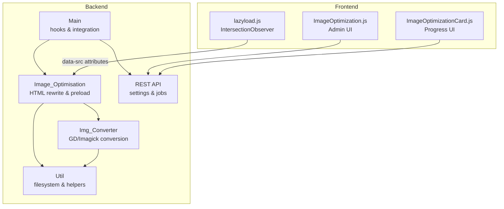
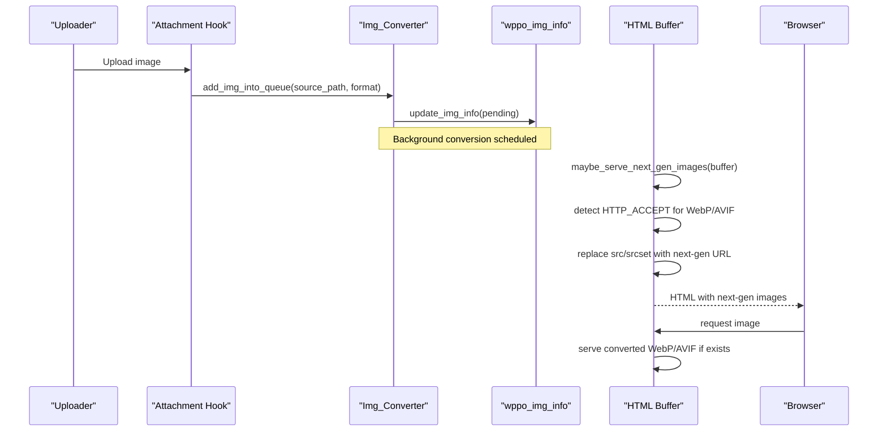
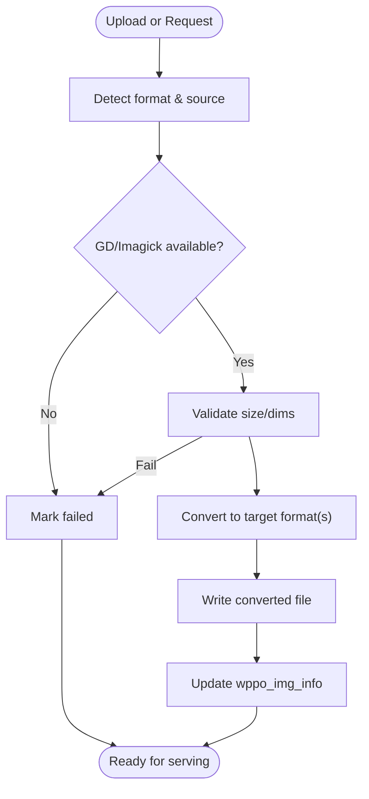
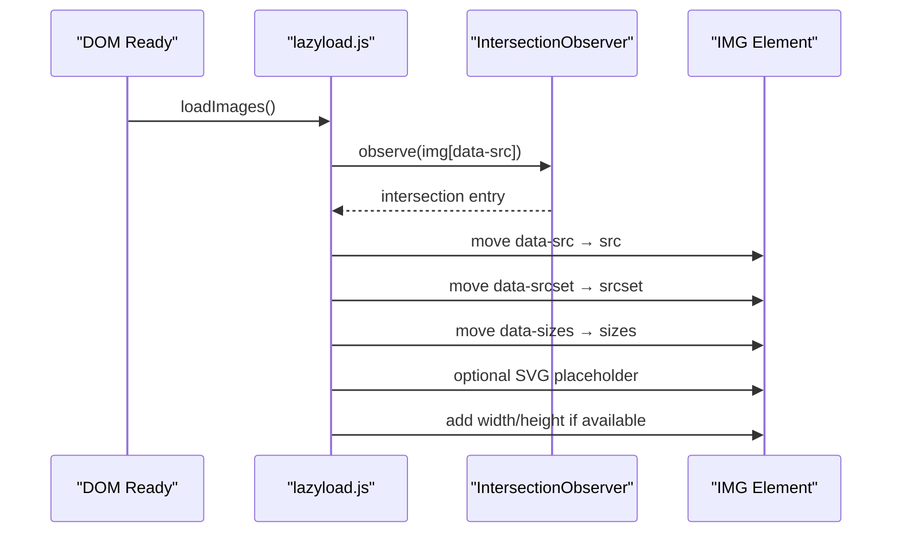
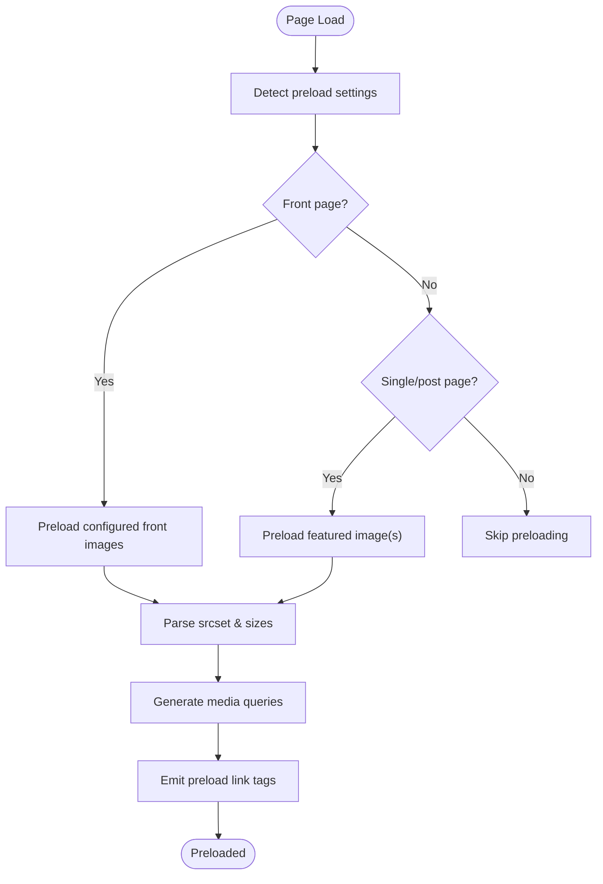
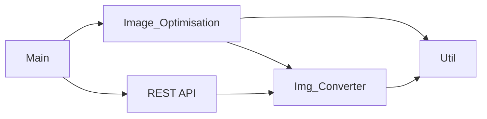

# Image Optimization

<cite>
**Referenced Files in This Document**
- [performance-optimisation.php](file://performance-optimisation.php)
- [class-main.php](file://includes/class-main.php)
- [class-image-optimisation.php](file://includes/class-image-optimisation.php)
- [class-img-converter.php](file://includes/class-img-converter.php)
- [class-util.php](file://includes/class-util.php)
- [class-rest.php](file://includes/class-rest.php)
- [lazyload.js](file://src/lazyload.js)
- [ImageOptimization.js](file://src/components/ImageOptimization.js)
- [ImageOptimizationCard.js](file://src/components/ImageOptimizationCard.js)
</cite>

## Table of Contents
1. [Introduction](#introduction)
2. [Project Structure](#project-structure)
3. [Core Components](#core-components)
4. [Architecture Overview](#architecture-overview)
5. [Detailed Component Analysis](#detailed-component-analysis)
6. [Dependency Analysis](#dependency-analysis)
7. [Performance Considerations](#performance-considerations)
8. [Troubleshooting Guide](#troubleshooting-guide)
9. [Conclusion](#conclusion)
10. [Appendices](#appendices)

## Introduction
This document explains the image optimization system implemented in the plugin, focusing on:
- Next-generation format conversion (WebP and AVIF)
- Browser compatibility and fallback mechanisms
- Lazy loading implementation for images, videos, and iframes
- Preloading strategies for critical images
- Configuration options for quality, compression, and supported formats
- Progressive enhancement techniques
- Examples of optimized image delivery and troubleshooting format compatibility issues

## Project Structure
The image optimization feature spans backend PHP classes and frontend JavaScript:
- Backend: WordPress hooks, REST API, and conversion utilities
- Frontend: JavaScript lazy loader and React-based admin UI

**Diagram sources**
- [class-main.php:98-118](file://includes/class-main.php#L98-L118)
- [class-image-optimisation.php:27-71](file://includes/class-image-optimisation.php#L27-L71)
- [class-img-converter.php:22-91](file://includes/class-img-converter.php#L22-L91)
- [class-util.php:29-110](file://includes/class-util.php#L29-L110)
- [class-rest.php:26-123](file://includes/class-rest.php#L26-L123)
- [lazyload.js:152-362](file://src/lazyload.js#L152-L362)
- [ImageOptimization.js:19-497](file://src/components/ImageOptimization.js#L19-L497)
- [ImageOptimizationCard.js:12-117](file://src/components/ImageOptimizationCard.js#L12-L117)

**Section sources**
- [performance-optimisation.php:17-44](file://performance-optimisation.php#L17-L44)
- [class-main.php:128-154](file://includes/class-main.php#L128-L154)

## Core Components
- Image_Optimisation: Rewrites HTML to serve next-gen formats, preloads critical images, and applies lazy loading enhancements.
- Img_Converter: Converts images to WebP/AVIF using GD or Imagick, enqueues background jobs, and tracks conversion status.
- Util: Provides filesystem operations, URL normalization, preload link generation, and MIME type inference.
- REST API: Exposes endpoints to update settings, optimize images, and query job status.
- lazyload.js: Implements IntersectionObserver-based lazy loading for images, iframes, and videos with fallbacks.
- Admin UI: React components for configuring image optimization settings and monitoring progress.

**Section sources**
- [class-image-optimisation.php:27-71](file://includes/class-image-optimisation.php#L27-L71)
- [class-img-converter.php:22-91](file://includes/class-img-converter.php#L22-L91)
- [class-util.php:29-110](file://includes/class-util.php#L29-L110)
- [class-rest.php:26-123](file://includes/class-rest.php#L26-L123)
- [lazyload.js:152-362](file://src/lazyload.js#L152-L362)
- [ImageOptimization.js:19-497](file://src/components/ImageOptimization.js#L19-L497)
- [ImageOptimizationCard.js:12-117](file://src/components/ImageOptimizationCard.js#L12-L117)

## Architecture Overview
The system integrates WordPress hooks and REST endpoints to deliver optimized images progressively:
- On upload, attachments are queued for conversion to WebP/AVIF.
- During page rendering, HTML is scanned to replace image URLs with next-gen alternatives when supported.
- Preload hints are injected for critical images to improve LCP.
- Lazy loading is applied to images below the fold, with optional SVG placeholders to prevent layout shifts.

**Diagram sources**
- [class-img-converter.php:476-524](file://includes/class-img-converter.php#L476-L524)
- [class-image-optimisation.php:95-208](file://includes/class-image-optimisation.php#L95-L208)
- [class-img-converter.php:533-574](file://includes/class-img-converter.php#L533-L574)

## Detailed Component Analysis

### WebP and AVIF Conversion Pipeline
- Format selection: Target format is configured as webp, avif, or both.
- Conversion libraries:
  - GD functions for WebP/AVIF when available.
  - Imagick for GIF to WebP conversion with transparency handling.
- Security checks: File size and dimension limits, animated WebP detection, and safe path resolution.
- Queueing: Pending conversions tracked in an option and processed via Action Scheduler or synchronously.

**Diagram sources**
- [class-img-converter.php:104-310](file://includes/class-img-converter.php#L104-L310)
- [class-img-converter.php:381-441](file://includes/class-img-converter.php#L381-L441)
- [class-img-converter.php:533-574](file://includes/class-img-converter.php#L533-L574)

**Section sources**
- [class-img-converter.php:104-310](file://includes/class-img-converter.php#L104-L310)
- [class-img-converter.php:381-441](file://includes/class-img-converter.php#L381-L441)
- [class-img-converter.php:533-574](file://includes/class-img-converter.php#L533-L574)

### Browser Compatibility and Fallback Mechanisms
- Detection: The system reads the HTTP Accept header to determine support for image/avif and image/webp.
- Serving logic:
  - If AVIF/WebP is supported and a converted file exists, the URL is replaced.
  - Otherwise, the original image URL is used.
- Progressive enhancement:
  - The admin UI requires wrapping images in a picture element for next-gen format serving.
  - SVG placeholders can be used to reduce layout shift during lazy loading.

**Section sources**
- [class-image-optimisation.php:95-208](file://includes/class-image-optimisation.php#L95-L208)
- [class-img-converter.php:533-574](file://includes/class-img-converter.php#L533-L574)
- [ImageOptimization.js:202-209](file://src/components/ImageOptimization.js#L202-L209)

### Lazy Loading Implementation
- IntersectionObserver-based lazy loading for images, iframes, and videos.
- Data attribute migration:
  - src → data-src
  - srcset → data-srcset
  - sizes → data-sizes
- SVG placeholders: Optionally replace src with a lightweight inline SVG while the real image loads.
- Dimensions: Adds width/height attributes when possible to prevent layout shift.
- Fallback: A scroll-based fallback for environments without IntersectionObserver.

**Diagram sources**
- [lazyload.js:152-362](file://src/lazyload.js#L152-L362)
- [class-image-optimisation.php:610-798](file://includes/class-image-optimisation.php#L610-L798)

**Section sources**
- [lazyload.js:152-362](file://src/lazyload.js#L152-L362)
- [class-image-optimisation.php:610-798](file://includes/class-image-optimisation.php#L610-L798)

### Preloading Strategies
- Front page images: Inject preload links for critical above-the-fold images.
- Post type thumbnails: Automatically preload featured images for selected post types.
- Responsive preloading: Generate media queries for srcset candidates to preload appropriate sizes.
- Utility: Preload link generation with fetchpriority and type attributes.

**Diagram sources**
- [class-image-optimisation.php:78-84](file://includes/class-image-optimisation.php#L78-L84)
- [class-image-optimisation.php:392-454](file://includes/class-image-optimisation.php#L392-L454)
- [class-image-optimisation.php:501-556](file://includes/class-image-optimisation.php#L501-L556)
- [class-util.php:193-231](file://includes/class-util.php#L193-L231)

**Section sources**
- [class-image-optimisation.php:78-84](file://includes/class-image-optimisation.php#L78-L84)
- [class-image-optimisation.php:392-454](file://includes/class-image-optimisation.php#L392-L454)
- [class-image-optimisation.php:501-556](file://includes/class-image-optimisation.php#L501-L556)
- [class-util.php:193-231](file://includes/class-util.php#L193-L231)

### Configuration Options
- Enable lazy loading for images and videos
- Wrap images in picture element for next-gen format support
- Exclude first N images from lazy loading
- Replace placeholders with SVG
- Auto convert formats: webp, avif, or both
- Exclude specific images from conversion
- Preload front page images and featured images for selected post types
- Responsive limits: max width and exclusion classes
- REST endpoints for updating settings and optimizing images

**Section sources**
- [ImageOptimization.js:19-497](file://src/components/ImageOptimization.js#L19-L497)
- [class-rest.php:184-200](file://includes/class-rest.php#L184-L200)

## Dependency Analysis
- Main orchestrates hooks and instantiates Image_Optimisation and REST API.
- Image_Optimisation depends on Img_Converter and Util for URL/path resolution and filesystem operations.
- Img_Converter depends on Util for cache directory preparation and path normalization.
- REST API coordinates with Img_Converter for background jobs and with settings storage.

**Diagram sources**
- [class-main.php:98-118](file://includes/class-main.php#L98-L118)
- [class-image-optimisation.php:27-71](file://includes/class-image-optimisation.php#L27-L71)
- [class-img-converter.php:22-91](file://includes/class-img-converter.php#L22-L91)
- [class-util.php:29-110](file://includes/class-util.php#L29-L110)
- [class-rest.php:26-123](file://includes/class-rest.php#L26-L123)

**Section sources**
- [class-main.php:98-118](file://includes/class-main.php#L98-L118)
- [class-image-optimisation.php:27-71](file://includes/class-image-optimisation.php#L27-L71)
- [class-img-converter.php:22-91](file://includes/class-img-converter.php#L22-L91)
- [class-util.php:29-110](file://includes/class-util.php#L29-L110)
- [class-rest.php:26-123](file://includes/class-rest.php#L26-L123)

## Performance Considerations
- Conversion limits: File size and dimension caps prevent memory exhaustion and slow conversions.
- Background processing: Action Scheduler queues conversions to avoid blocking requests.
- Preloading precision: Media queries ensure the right image size is preloaded for responsive scenarios.
- Lazy loading: Reduces initial payload and improves LCP by deferring off-screen content.
- SVG placeholders: Minimizes layout shift and perceived load time for lazy images.

[No sources needed since this section provides general guidance]

## Troubleshooting Guide
- Next-gen formats not served:
  - Verify browser Accept header includes image/avif or image/webp.
  - Ensure conversion is queued and completed; check conversion status via REST endpoint.
  - Confirm images are wrapped in picture element when using next-gen formats.
- Conversion failures:
  - Check file size/dimension limits and ensure required extensions (GD/Imagick) are available.
  - Review logs for errors and confirm safe paths are used.
- Lazy loading not working:
  - Ensure data-src attributes are present and IntersectionObserver is supported.
  - Verify the lazyload script is loaded and not blocked by CSP.
- Preloading issues:
  - Confirm preload URLs are absolute and accessible.
  - Validate media queries align with srcset widths.

**Section sources**
- [class-img-converter.php:111-152](file://includes/class-img-converter.php#L111-L152)
- [class-rest.php:592-627](file://includes/class-rest.php#L592-L627)
- [lazyload.js:152-362](file://src/lazyload.js#L152-L362)
- [class-image-optimisation.php:95-208](file://includes/class-image-optimisation.php#L95-L208)

## Conclusion
The image optimization system combines next-gen format conversion, intelligent browser detection, progressive enhancement, and targeted preloading to deliver fast, efficient images. Administrators can configure quality, exclusions, and preloading rules through the admin UI, while the backend ensures robust, secure, and scalable conversion and serving.

[No sources needed since this section summarizes without analyzing specific files]

## Appendices

### Configuration Options Reference
- lazyLoadImages: Enable/disable lazy loading for images
- wrapInPicture: Wrap images in picture element for next-gen formats
- excludeFirstImages: Number of top images to exclude from lazy loading
- replacePlaceholderWithSVG: Use SVG placeholders during lazy loading
- convertImg: Enable auto conversion to WebP/AVIF
- conversionFormat: webp | avif | both
- excludeConvertImages: Partial URLs to exclude from conversion
- preloadFrontPageImages: Enable preloading for front page images
- preloadFrontPageImagesUrls: URLs to preload on front page
- preloadPostTypeImage: Enable preloading for featured images
- selectedPostType: Post types to apply featured image preloading
- excludePostTypeImgUrl: Partial URLs to exclude from preloading
- maxWidthImgSize: Max width for responsive images
- excludeSize: CSS classes to exclude from max width constraint

**Section sources**
- [ImageOptimization.js:19-497](file://src/components/ImageOptimization.js#L19-L497)

### Example Workflows

#### Optimized Image Delivery
- Upload an image; it is queued for conversion to WebP/AVIF.
- On page render, the HTML is scanned; if the browser supports WebP/AVIF, src/srcset are replaced with converted URLs.
- Preload links are injected for critical images to improve LCP.
- Lazy loading is applied to images below the fold with optional SVG placeholders.

**Section sources**
- [class-img-converter.php:476-524](file://includes/class-img-converter.php#L476-L524)
- [class-image-optimisation.php:95-208](file://includes/class-image-optimisation.php#L95-L208)
- [class-image-optimisation.php:78-84](file://includes/class-image-optimisation.php#L78-L84)
- [lazyload.js:152-362](file://src/lazyload.js#L152-L362)

#### Background Conversion Job
- REST endpoint schedules background jobs via Action Scheduler.
- Jobs convert images to WebP/AVIF and update conversion status.
- Progress can be queried via REST endpoint.

**Section sources**
- [class-rest.php:253-353](file://includes/class-rest.php#L253-L353)
- [class-img-converter.php:632-659](file://includes/class-img-converter.php#L632-L659)
- [class-rest.php:592-627](file://includes/class-rest.php#L592-L627)