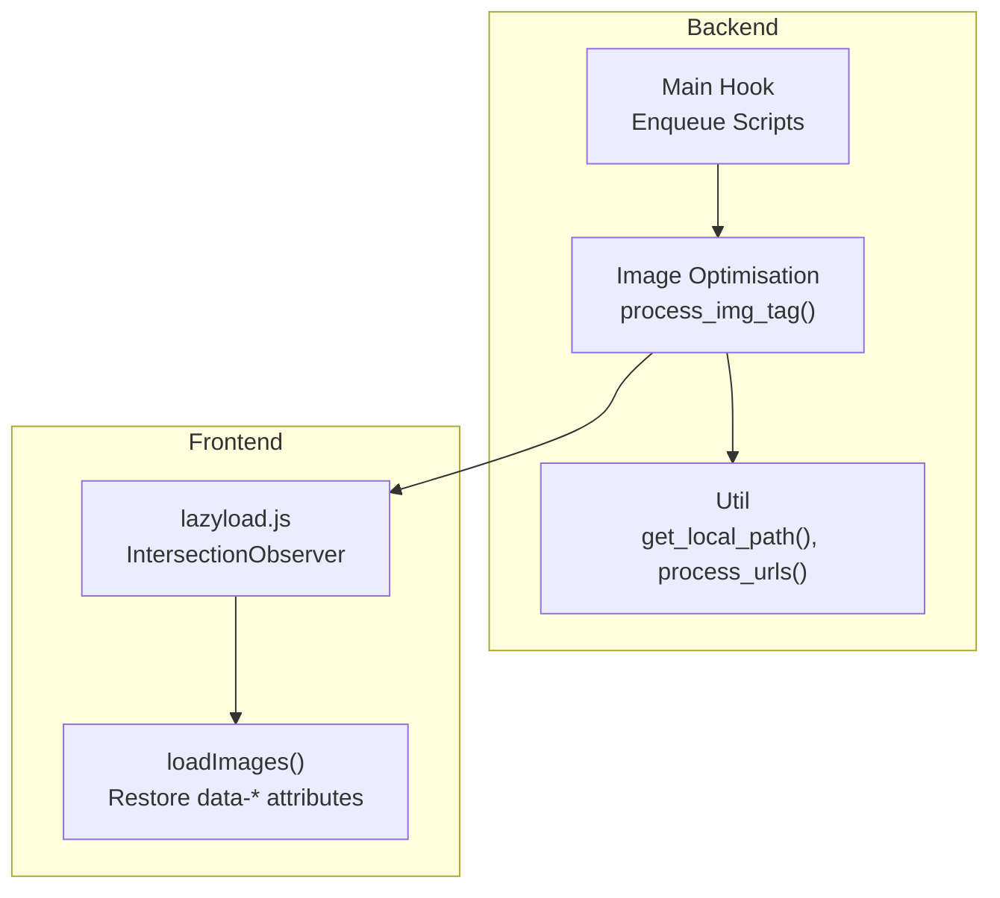
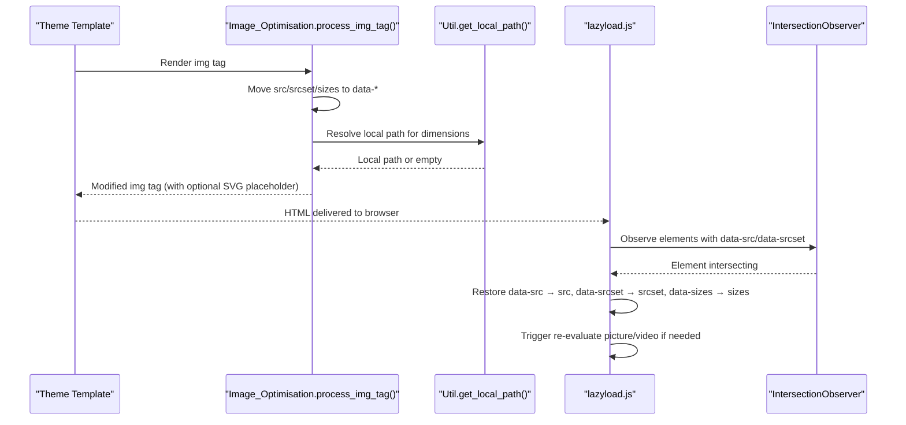
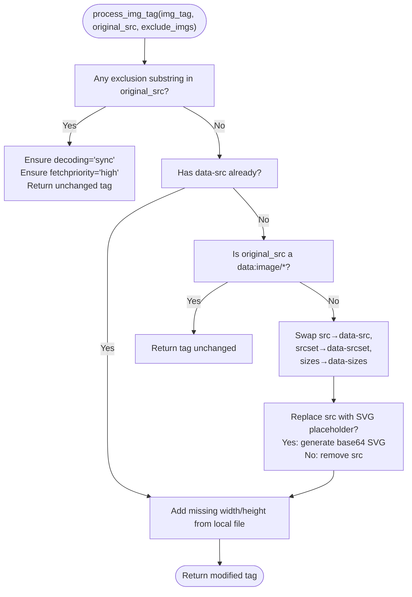
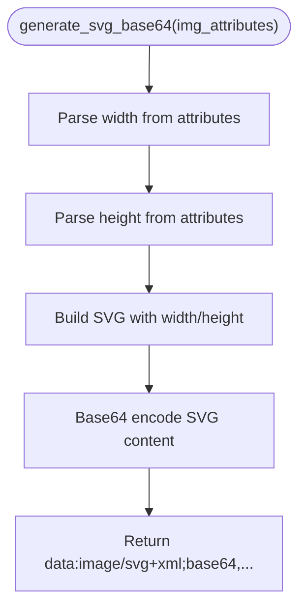
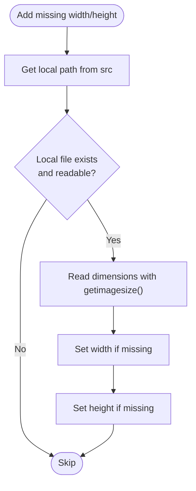
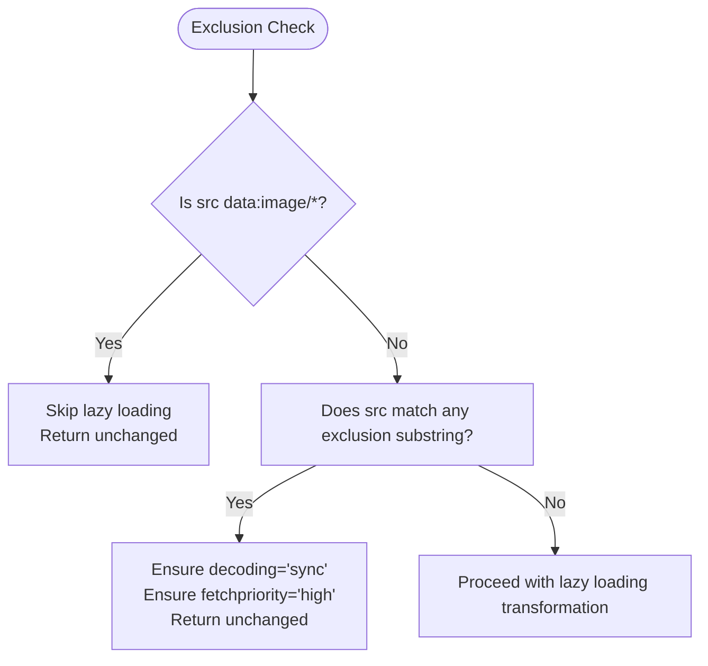
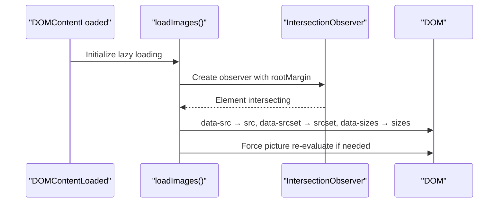
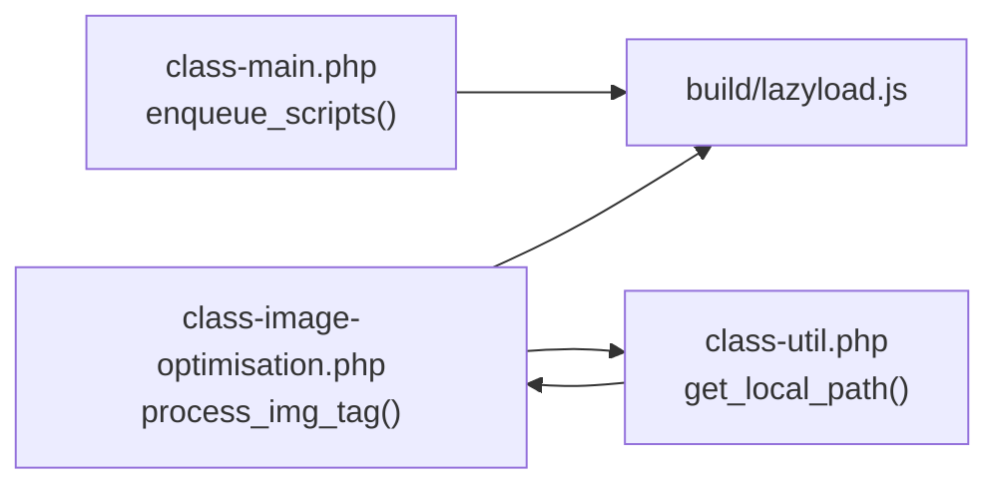

# Lazy Loading Implementation

<cite>
**Referenced Files in This Document**
- [class-image-optimisation.php](file://includes/class-image-optimisation.php)
- [class-main.php](file://includes/class-main.php)
- [class-util.php](file://includes/class-util.php)
- [lazyload.js](file://src/lazyload.js)
- [ImageOptimization.js](file://src/components/ImageOptimization.js)
</cite>

## Table of Contents
1. [Introduction](#introduction)
2. [Project Structure](#project-structure)
3. [Core Components](#core-components)
4. [Architecture Overview](#architecture-overview)
5. [Detailed Component Analysis](#detailed-component-analysis)
6. [Dependency Analysis](#dependency-analysis)
7. [Performance Considerations](#performance-considerations)
8. [Troubleshooting Guide](#troubleshooting-guide)
9. [Conclusion](#conclusion)

## Introduction
This document explains the lazy loading system implementation for images, iframes, and videos. It covers how the plugin transforms img tags by moving src attributes to data-src for deferred loading, generates placeholder images using SVG base64 encoding, extracts width and height from local images for layout stability, applies exclusion rules for base64 images and specific URL patterns, and configures placeholder replacement, decoding attributes, and fetch priority settings. It also includes examples of processed img tags and troubleshooting guidance.

## Project Structure
The lazy loading system spans PHP backend processing and JavaScript frontend execution:
- Backend processing transforms HTML and img tags, injects placeholders, and prepares dimensions.
- Frontend lazy loader observes elements and restores src/srcset/sizes attributes when elements become visible.
- Configuration options are exposed in the admin interface.

**Diagram sources**
- [class-main.php:752-774](file://includes/class-main.php#L752-L774)
- [class-image-optimisation.php:594-798](file://includes/class-image-optimisation.php#L594-L798)
- [class-util.php:89-110](file://includes/class-util.php#L89-L110)
- [lazyload.js:152-355](file://src/lazyload.js#L152-L355)

**Section sources**
- [class-main.php:752-774](file://includes/class-main.php#L752-L774)
- [class-image-optimisation.php:594-798](file://includes/class-image-optimisation.php#L594-L798)
- [class-util.php:89-110](file://includes/class-util.php#L89-L110)
- [lazyload.js:152-355](file://src/lazyload.js#L152-L355)

## Core Components
- Image Optimisation Engine: Processes img tags to move src/srcset/sizes to data-* attributes, optionally replaces src with an SVG placeholder, and adds width/height when available.
- Lazy Loader: Uses IntersectionObserver to restore data-src/data-srcset/data-sizes to src/srcset/sizes when elements enter the viewport.
- Configuration: Admin UI exposes options for lazy loading, placeholder replacement, and exclusion lists.

Key responsibilities:
- Transform img tags for lazy loading and placeholders.
- Preserve decoding and fetchpriority attributes for excluded images.
- Extract dimensions from local files to avoid layout shifts.
- Apply exclusion rules for base64 images and specific URL patterns.

**Section sources**
- [class-image-optimisation.php:594-798](file://includes/class-image-optimisation.php#L594-L798)
- [lazyload.js:152-355](file://src/lazyload.js#L152-L355)
- [ImageOptimization.js:153-210](file://src/components/ImageOptimization.js#L153-L210)

## Architecture Overview
The system integrates backend and frontend layers:
- Backend: Hooks into HTML generation to transform img tags and inject preload hints.
- Frontend: Intercepts DOMContentLoaded, sets up IntersectionObserver, and restores attributes on visibility.

**Diagram sources**
- [class-image-optimisation.php:594-798](file://includes/class-image-optimisation.php#L594-L798)
- [class-util.php:89-110](file://includes/class-util.php#L89-L110)
- [lazyload.js:152-355](file://src/lazyload.js#L152-L355)

## Detailed Component Analysis

### Backend Image Tag Processing
The backend transforms img tags to enable lazy loading:
- Exclusion checks: If the original src matches any exclusion substring, ensure decoding="sync" and fetchpriority="high" are set.
- Attribute transformation: Move src → data-src, srcset → data-srcset, sizes → data-sizes (skip data:image/* sources).
- Placeholder replacement: Optionally replace src with an inline SVG base64 placeholder derived from width/height.
- Dimension extraction: If width/height are missing, read from the local file and set attributes.

**Diagram sources**
- [class-image-optimisation.php:594-798](file://includes/class-image-optimisation.php#L594-L798)
- [class-image-optimisation.php:1224-1245](file://includes/class-image-optimisation.php#L1224-L1245)
- [class-util.php:89-110](file://includes/class-util.php#L89-L110)

**Section sources**
- [class-image-optimisation.php:594-798](file://includes/class-image-optimisation.php#L594-L798)
- [class-image-optimisation.php:1224-1245](file://includes/class-image-optimisation.php#L1224-L1245)
- [class-util.php:89-110](file://includes/class-util.php#L89-L110)

### Placeholder Image Generation (SVG Base64)
When placeholder replacement is enabled, the system generates a base64-encoded SVG:
- Extract width and height from img attributes (quoted/unquoted formats supported).
- Build a simple SVG rectangle with a neutral gray fill.
- Encode the SVG content to base64 and return a data URI.

**Diagram sources**
- [class-image-optimisation.php:1224-1245](file://includes/class-image-optimisation.php#L1224-L1245)

**Section sources**
- [class-image-optimisation.php:1224-1245](file://includes/class-image-optimisation.php#L1224-L1245)

### Dimension Attribute Optimization
The system attempts to add missing width and height attributes:
- Resolve the local filesystem path from the original src.
- Use getimagesize() to read dimensions from the local file.
- Set width and height attributes on the img tag.

**Diagram sources**
- [class-image-optimisation.php:679-704](file://includes/class-image-optimisation.php#L679-L704)
- [class-util.php:89-110](file://includes/class-util.php#L89-L110)

**Section sources**
- [class-image-optimisation.php:679-704](file://includes/class-image-optimisation.php#L679-L704)
- [class-util.php:89-110](file://includes/class-util.php#L89-L110)

### Exclusion Rules
Certain images are excluded from lazy loading transformations:
- Base64 images: src starting with data:image/ are skipped to avoid rewriting.
- URL pattern exclusions: If the original src contains any configured exclusion substring, the tag is treated as excluded and only decoding/fetchpriority attributes are ensured.

**Diagram sources**
- [class-image-optimisation.php:612-627](file://includes/class-image-optimisation.php#L612-L627)
- [class-image-optimisation.php:729-732](file://includes/class-image-optimisation.php#L729-L732)

**Section sources**
- [class-image-optimisation.php:612-627](file://includes/class-image-optimisation.php#L612-L627)
- [class-image-optimisation.php:729-732](file://includes/class-image-optimisation.php#L729-L732)

### Frontend Lazy Loading Execution
The frontend script initializes on DOMContentLoaded and uses IntersectionObserver to restore attributes:
- Observe elements with data-src/data-srcset/data-sizes or data-src on iframes/videos.
- On intersection, restore data-src → src, data-srcset → srcset, data-sizes → sizes.
- For picture elements, force re-evaluation by temporarily removing and re-adding src.
- Fallback path uses scroll detection when IntersectionObserver is unavailable.

**Diagram sources**
- [lazyload.js:152-355](file://src/lazyload.js#L152-L355)

**Section sources**
- [lazyload.js:152-355](file://src/lazyload.js#L152-L355)

### Configuration Options
Admin UI exposes the following options related to lazy loading:
- Enable Lazy Load: Toggle for enabling lazy loading of images.
- Exclude First X Images: Skip lazy loading for the first N images to ensure above-the-fold hero images load immediately.
- SVG Placeholders: Replace src with a lightweight inline SVG placeholder while the real image loads.
- Wrap in Picture Tag: Wrap img in picture element to enable next-gen format serving.
- Video Lazy Loading: Defer loading of iframe and video embeds until they enter the viewport.
- Exclude from Video Lazy Load: Enter CSS class names or partial URLs of embeds that should always load immediately.

These options are defined in the frontend component and influence backend processing and frontend behavior.

**Section sources**
- [ImageOptimization.js:153-210](file://src/components/ImageOptimization.js#L153-L210)
- [ImageOptimization.js:211-247](file://src/components/ImageOptimization.js#L211-L247)

## Dependency Analysis
The lazy loading system depends on:
- Main class enqueuing the lazyload script for non-logged-in users when lazy loading is enabled.
- Image_Optimisation transforming img tags and optionally wrapping in picture for next-gen formats.
- Util helpers for URL normalization and local path resolution.
- Frontend lazyload.js observing and restoring attributes.

**Diagram sources**
- [class-main.php:752-774](file://includes/class-main.php#L752-L774)
- [class-image-optimisation.php:594-798](file://includes/class-image-optimisation.php#L594-L798)
- [class-util.php:89-110](file://includes/class-util.php#L89-L110)
- [lazyload.js:152-355](file://src/lazyload.js#L152-L355)

**Section sources**
- [class-main.php:752-774](file://includes/class-main.php#L752-L774)
- [class-image-optimisation.php:594-798](file://includes/class-image-optimisation.php#L594-L798)
- [class-util.php:89-110](file://includes/class-util.php#L89-L110)
- [lazyload.js:152-355](file://src/lazyload.js#L152-L355)

## Performance Considerations
- Using data:* attributes prevents immediate network requests, reducing bandwidth and render blocking.
- SVG placeholders minimize layout shifts by preserving aspect ratio and providing a smooth loading experience.
- Extracting dimensions avoids CLS caused by unknown image sizes.
- IntersectionObserver with generous root margins improves perceived performance by loading images before they enter the viewport.
- Fallback scroll detection ensures compatibility when IntersectionObserver is unavailable.

[No sources needed since this section provides general guidance]

## Troubleshooting Guide
Common issues and resolutions:
- Images not lazy loading:
  - Verify lazy loading is enabled in settings.
  - Ensure the img tag does not match any exclusion substring.
  - Confirm the lazyload script is enqueued for non-logged-in users.
- Layout shifts or CLS:
  - Enable SVG placeholders to reserve space during load.
  - Ensure width/height attributes are present; the system attempts to add them from local files.
- Base64 images not loading:
  - Base64 images are intentionally skipped; confirm the src is not data:image/*.
- Video embeds not lazy loading:
  - Check video lazy loading settings and exclusion patterns.
  - Ensure the iframe/video has a data-src attribute after processing.

**Section sources**
- [class-image-optimisation.php:612-627](file://includes/class-image-optimisation.php#L612-L627)
- [class-image-optimisation.php:729-732](file://includes/class-image-optimisation.php#L729-L732)
- [lazyload.js:152-355](file://src/lazyload.js#L152-L355)

## Conclusion
The lazy loading system combines backend img tag transformation with a robust frontend IntersectionObserver-based loader. It safely excludes base64 images and configured URL patterns, inserts SVG placeholders for smooth loading, and optimizes dimensions to prevent layout shifts. Administrators can fine-tune behavior via the admin UI, ensuring optimal performance and user experience.