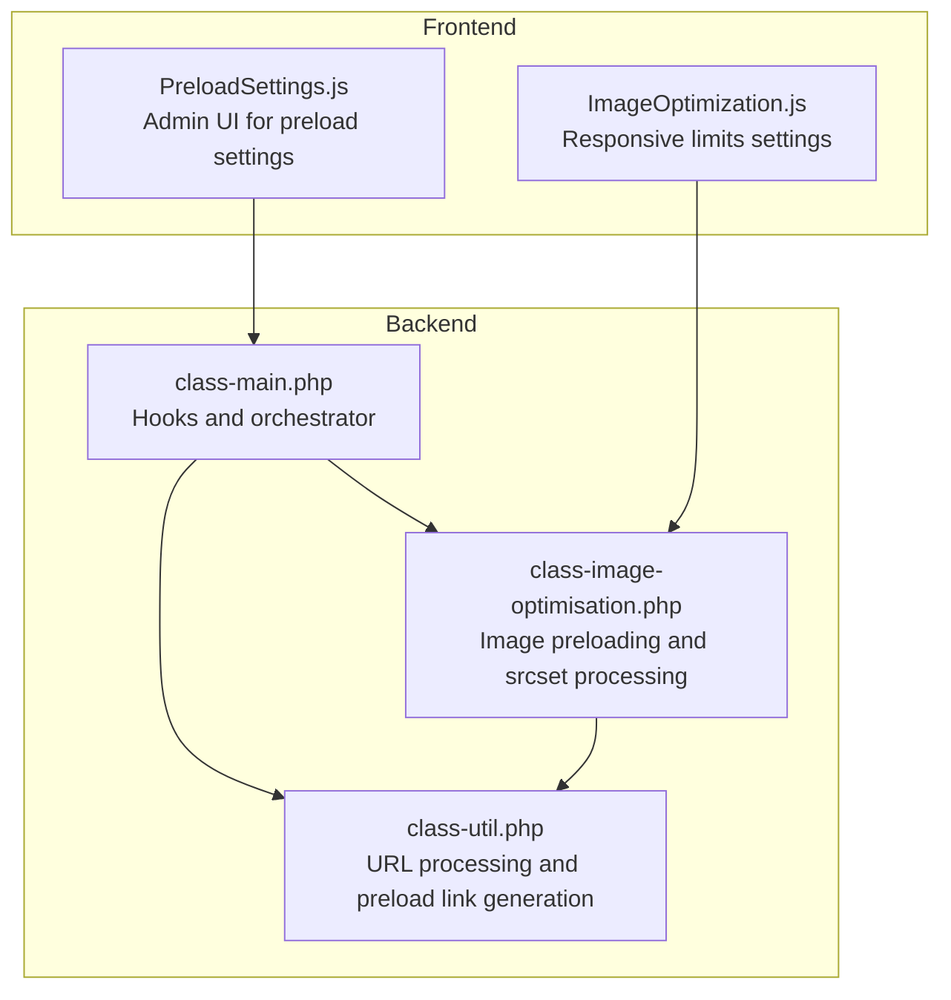
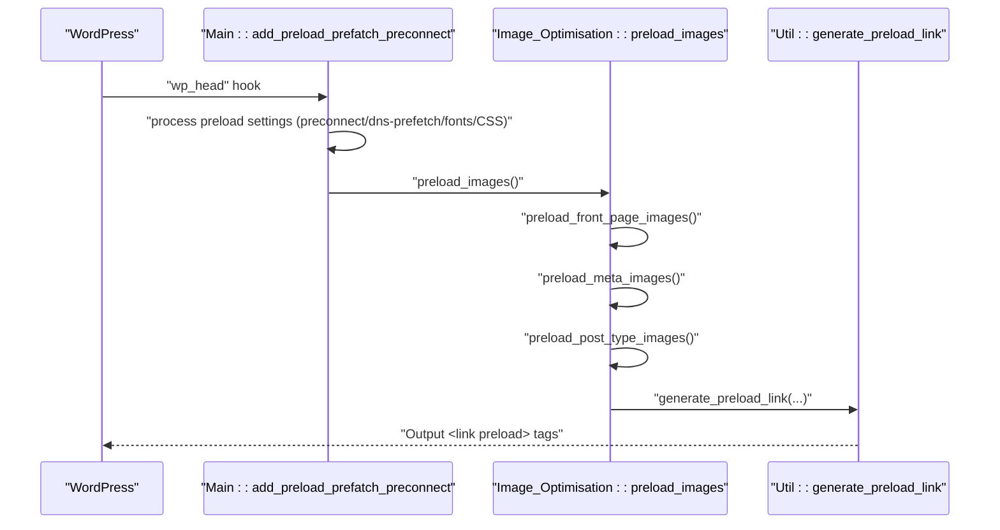
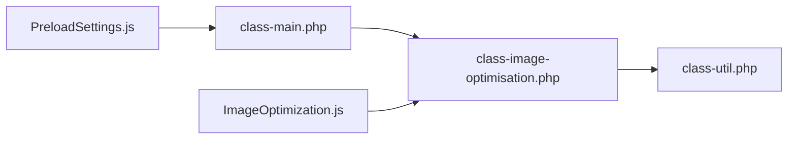

# Preloading Strategies

<cite>
**Referenced Files in This Document**
- [performance-optimisation.php](file://performance-optimisation.php)
- [class-main.php](file://includes/class-main.php)
- [class-image-optimisation.php](file://includes/class-image-optimisation.php)
- [class-util.php](file://includes/class-util.php)
- [PreloadSettings.js](file://src/components/PreloadSettings.js)
- [ImageOptimization.js](file://src/components/ImageOptimization.js)
</cite>

## Table of Contents
1. [Introduction](#introduction)
2. [Project Structure](#project-structure)
3. [Core Components](#core-components)
4. [Architecture Overview](#architecture-overview)
5. [Detailed Component Analysis](#detailed-component-analysis)
6. [Dependency Analysis](#dependency-analysis)
7. [Performance Considerations](#performance-considerations)
8. [Troubleshooting Guide](#troubleshooting-guide)
9. [Conclusion](#conclusion)

## Introduction
This document explains the plugin’s image preloading strategies and implementation. It covers:
- Front page image preloading
- Meta image preloading
- Post type specific image preloading
- Responsive image optimization via srcset processing and media query generation
- Mobile/desktop specific preloading with device-specific URL handling
- Exclusion mechanisms, maximum widths, and size limits
- Examples of generated preload links and media queries
- Performance impact analysis and optimization guidance
- Troubleshooting preloading effectiveness

## Project Structure
The preloading system spans backend PHP classes and frontend React components:
- Backend: Main orchestrator and image optimization logic
- Utilities: Shared helpers for URL processing and preload link generation
- Frontend: Admin UI for configuring preloading and responsive limits

**Diagram sources**
- [class-main.php:924-994](file://includes/class-main.php#L924-L994)
- [class-image-optimisation.php:78-84](file://includes/class-image-optimisation.php#L78-L84)
- [class-util.php:193-231](file://includes/class-util.php#L193-L231)
- [PreloadSettings.js:15-283](file://src/components/PreloadSettings.js#L15-L283)
- [ImageOptimization.js:321-372](file://src/components/ImageOptimization.js#L321-L372)

**Section sources**
- [performance-optimisation.php:17-43](file://performance-optimisation.php#L17-L43)
- [class-main.php:128-154](file://includes/class-main.php#L128-L154)

## Core Components
- Main orchestrator registers hooks and delegates to image optimization and utility classes.
- Image optimization module implements:
  - Front page, meta, and post type specific preloading
  - srcset parsing and media query generation
  - Device-specific URL handling (mobile/desktop)
  - Exclusion lists and size limits
- Utility module provides:
  - URL normalization and processing
  - Preload link generation with attributes (rel, href, as, type, media, fetchpriority)
  - MIME type detection for images

**Section sources**
- [class-main.php:924-994](file://includes/class-main.php#L924-L994)
- [class-image-optimisation.php:78-84](file://includes/class-image-optimisation.php#L78-L84)
- [class-util.php:193-231](file://includes/class-util.php#L193-L231)

## Architecture Overview
The preloading pipeline integrates with WordPress hooks and generates preload hints at runtime.

**Diagram sources**
- [class-main.php:924-994](file://includes/class-main.php#L924-L994)
- [class-image-optimisation.php:78-84](file://includes/class-image-optimisation.php#L78-L84)
- [class-util.php:193-231](file://includes/class-util.php#L193-L231)

## Detailed Component Analysis

### Front Page Image Preloading
- Enabled conditionally on the front page and configured via settings.
- Accepts a list of image URLs (full or partial) to preload.
- Normalizes and prepares URLs for preloading, including device-specific prefixes.

Implementation highlights:
- Conditional check for front page and enabled flag
- URL processing and preparation
- Generation of preload links

**Section sources**
- [class-image-optimisation.php:392-402](file://includes/class-image-optimisation.php#L392-L402)
- [class-image-optimisation.php:1193-1201](file://includes/class-image-optimisation.php#L1193-L1201)
- [class-image-optimisation.php:1211-1222](file://includes/class-image-optimisation.php#L1211-L1222)

### Meta Image Preloading
- Reads post meta for a dedicated field storing image URLs to preload.
- Supports multiple URLs per page/post.

Implementation highlights:
- Fetches post meta value
- Processes and iterates URLs
- Generates preload links

**Section sources**
- [class-image-optimisation.php:411-419](file://includes/class-image-optimisation.php#L411-L419)

### Post Type Specific Image Preloading
- Activated for selected post types and only when a post has a featured image.
- Uses WordPress attachment APIs to retrieve the image URL and srcset.
- Applies exclusions and responsive limits before generating preload links.

Implementation highlights:
- Post type selection and singular checks
- Featured image retrieval and URL building
- Exclusion checks and srcset processing

**Section sources**
- [class-image-optimisation.php:429-454](file://includes/class-image-optimisation.php#L429-L454)
- [class-image-optimisation.php:464-471](file://includes/class-image-optimisation.php#L464-L471)
- [class-image-optimisation.php:482-489](file://includes/class-image-optimisation.php#L482-L489)

### Responsive Image Optimization and Media Queries
- Parses srcset entries into width descriptors.
- Applies maximum width limit and excludes specific sizes.
- Sorts candidates by width and generates media queries for each band.

Media query generation logic:
- For each source, constructs a media range from previous width to next width
- Applies a maximum width cap to avoid oversized images

**Section sources**
- [class-image-optimisation.php:501-530](file://includes/class-image-optimisation.php#L501-L530)
- [class-image-optimisation.php:541-556](file://includes/class-image-optimisation.php#L541-L556)

### Mobile/Desktop Specific Preloading
- Supports device-specific URL prefixes:
  - mobile:content_url(...)
  - desktop:content_url(...)
- Generates preload links with device-appropriate media conditions.

**Section sources**
- [class-image-optimisation.php:566-592](file://includes/class-image-optimisation.php#L566-L592)
- [class-image-optimisation.php:1211-1222](file://includes/class-image-optimisation.php#L1211-L1222)

### Exclusions and Size Limits
- Exclusion mechanisms:
  - Exclude URLs from preloading based on substring matches
  - Exclude specific sizes from srcset preloading
- Size limits:
  - Maximum width threshold for preloading
  - Responsive limits UI for max width and excluded classes

**Section sources**
- [class-image-optimisation.php:482-489](file://includes/class-image-optimisation.php#L482-L489)
- [class-image-optimisation.php:508-509](file://includes/class-image-optimisation.php#L508-L509)
- [class-image-optimisation.php:1118-1126](file://includes/class-image-optimisation.php#L1118-L1126)
- [ImageOptimization.js:321-372](file://src/components/ImageOptimization.js#L321-L372)

### Preload Link Generation and Attributes
- Utility method generates sanitized preload link tags with:
  - rel, href, as, type, crossorigin, media, fetchpriority
- Used for images, fonts, and CSS

**Section sources**
- [class-util.php:193-231](file://includes/class-util.php#L193-L231)

### Admin UI for Preload Settings
- Provides toggles and input areas for:
  - Preconnect origins
  - DNS prefetch origins
  - Preload fonts and CSS
- Submits settings via REST API

**Section sources**
- [PreloadSettings.js:15-283](file://src/components/PreloadSettings.js#L15-L283)

## Dependency Analysis
- Main orchestrator depends on:
  - Image_Optimisation for image preloading
  - Util for URL processing and preload link generation
- Image_Optimisation depends on:
  - WordPress APIs for post types, thumbnails, and meta
  - Util for URL normalization and preload link generation
- Frontend components depend on:
  - REST endpoints for saving settings
  - Localized settings for defaults and translations

**Diagram sources**
- [class-main.php:924-994](file://includes/class-main.php#L924-L994)
- [class-image-optimisation.php:78-84](file://includes/class-image-optimisation.php#L78-L84)
- [class-util.php:193-231](file://includes/class-util.php#L193-L231)
- [PreloadSettings.js:15-283](file://src/components/PreloadSettings.js#L15-L283)
- [ImageOptimization.js:321-372](file://src/components/ImageOptimization.js#L321-L372)

**Section sources**
- [class-main.php:128-154](file://includes/class-main.php#L128-L154)
- [class-main.php:924-994](file://includes/class-main.php#L924-L994)

## Performance Considerations
- Preload bandwidth: Limiting by maximum width and excluding oversized sizes prevents unnecessary network usage.
- Targeted preloading: Device-specific URLs reduce wasted downloads on the wrong device class.
- Media queries: Precise min/max ranges minimize redundant preloads across breakpoints.
- Exclusions: Avoid preloading low-priority or dynamic images to reduce overhead.
- Combine with lazy loading: Non-preloaded images benefit from lazy loading to defer off-screen assets.

[No sources needed since this section provides general guidance]

## Troubleshooting Guide
Common issues and resolutions:
- Preloads not appearing:
  - Verify preloading is enabled for the target context (front page, meta, or post type).
  - Ensure URLs are valid and normalized (absolute or content_url).
- Wrong device preloads:
  - Confirm device-specific prefixes are correctly formatted (mobile:, desktop:).
  - Check media conditions align with intended breakpoints.
- Oversized images:
  - Adjust maximum width and excluded sizes to match your design system.
- No effect on LCP:
  - Confirm preload targets are above-the-fold and critical.
  - Review exclusions and ensure they do not block intended images.

**Section sources**
- [class-image-optimisation.php:566-592](file://includes/class-image-optimisation.php#L566-L592)
- [class-image-optimisation.php:508-509](file://includes/class-image-optimisation.php#L508-L509)
- [class-image-optimisation.php:1118-1126](file://includes/class-image-optimisation.php#L1118-L1126)

## Conclusion
The plugin provides a robust, configurable preloading system:
- Covers front page, meta, and post type specific scenarios
- Implements responsive preloading via srcset and precise media queries
- Supports device-specific preloading and strong exclusion controls
- Integrates with admin UI for easy configuration and monitoring

By tuning maximum widths, excluded sizes, and device-specific URLs, you can optimize preloading for different content types and devices while minimizing overhead.